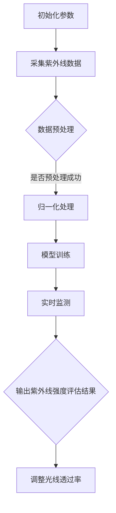
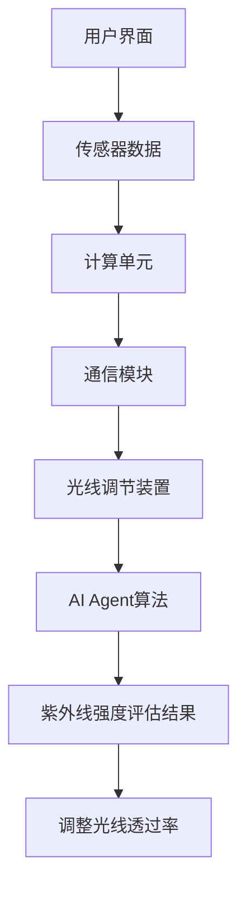

                 

# AI Agent在智能帽子中的紫外线防护

## 关键词
- AI Agent
- 紫外线防护
- 智能帽
- UV检测
- 紫外线算法
- 穿戴设备

## 摘要
本文旨在探讨人工智能（AI）代理在智能帽子中紫外线（UV）防护的应用。文章首先介绍了紫外线辐射对健康的危害，以及智能帽与AI代理结合的背景和意义。随后，文章详细阐述了AI代理在智能帽子中的角色、设计原则、UV防护算法和材料、测试与评估方法，以及AI代理在紫外线防护领域的实际应用和未来发展趋势。通过本文的阅读，读者将全面了解AI代理在智能帽子中的紫外线防护机制，为相关领域的研究和应用提供参考。

## 引言与概述

### 1.1 问题背景

#### 1.1.1 紫外线辐射对健康的危害

紫外线（UV）是一种电磁波，根据波长不同分为UVA、UVB和UVC。UVC在空气中被臭氧层吸收，对人体影响较小；UVA和UVB能穿透大气层，对人类健康产生显著影响。

- **UVB**：UVB具有中等穿透力，能导致皮肤红肿、晒伤，增加皮肤癌的风险。
- **UVA**：UVA穿透力强，可深入皮肤深层，导致皮肤老化、晒斑，长期暴露还可能增加皮肤癌的风险。

#### 1.1.2 智能帽与AI Agent的结合

智能帽是一种集成了传感器、计算单元和无线通信模块的智能穿戴设备。AI Agent（人工智能代理）是一种能够自主决策、执行任务并与其他系统交互的智能体。智能帽与AI Agent的结合，为紫外线防护提供了新的解决方案。

#### 1.1.3 UV防护的必要性

紫外线防护对于人们的健康至关重要。然而，传统防晒措施如防晒霜、遮阳帽等存在诸多问题，如：

- **防晒霜**：长期使用可能导致皮肤过敏、堵塞毛孔。
- **遮阳帽**：仅能提供有限的保护，无法实时监测紫外线强度。

智能帽结合AI Agent，可以实现实时、准确的紫外线监测与防护，提高人们的防晒效果。

### 1.2 AI Agent在智能帽中的角色

#### 1.2.1 AI Agent的定义和功能

AI Agent是一种基于人工智能技术的自主决策系统，具有感知、决策和执行能力。在智能帽中，AI Agent主要负责以下功能：

- **感知**：采集环境中的紫外线数据。
- **决策**：根据紫外线数据，自动调整帽子内部的光线透过率。
- **执行**：驱动帽子内部的光线调节装置，实现紫外线防护。

#### 1.2.2 智能帽的技术架构

智能帽的技术架构主要包括以下组成部分：

- **传感器**：用于检测紫外线强度。
- **计算单元**：执行AI算法，处理传感器数据。
- **无线通信模块**：实现与其他设备的通信。
- **光线调节装置**：根据AI Agent的决策，调节帽子内部的光线透过率。

#### 1.2.3 AI Agent在UV防护中的应用

AI Agent在智能帽中的应用主要体现在以下方面：

- **实时监测**：AI Agent实时采集紫外线数据，确保用户随时了解紫外线强度。
- **自动调节**：根据紫外线强度，AI Agent自动调整帽子内部的光线透过率，实现紫外线防护。
- **个性化服务**：AI Agent根据用户的皮肤类型、活动强度等因素，提供个性化的紫外线防护方案。

### 1.3 UV防护机制介绍

#### 1.3.1 UV检测技术

UV检测技术是智能帽实现紫外线防护的基础。常见的UV检测技术包括：

- **光电探测器**：利用光电效应检测紫外线强度。
- **光子计数器**：通过计数紫外线光子数量，间接测量紫外线强度。

#### 1.3.2 UV防护材料

UV防护材料是智能帽实现紫外线防护的关键。常见的UV防护材料包括：

- **紫外线吸收剂**：吸收紫外线，降低紫外线强度。
- **紫外线反射剂**：反射紫外线，减少紫外线穿透。
- **紫外线阻隔剂**：阻挡紫外线，防止紫外线穿透。

#### 1.3.3 紫外线防护标准

紫外线防护标准是评估智能帽紫外线防护效果的重要依据。常见的紫外线防护标准包括：

- **国际标准化组织（ISO）标准**：ISO 105-B02、ISO 12007-2等。
- **美国材料与试验协会（ASTM）标准**：ASTM D4332、ASTM D6603等。

## 第二部分：AI Agent的基本原理与UV检测技术

### 2.1 AI Agent的基本原理

AI Agent（人工智能代理）是人工智能领域的一个重要分支，它代表了具有自主性、自主学习和决策能力的智能体。AI Agent的基本原理可以概括为以下几点：

#### 2.1.1 自主性

AI Agent能够自主地完成特定任务，无需人工干预。这种自主性体现在以下几个方面：

- **自主感知**：AI Agent能够感知环境中的各种信息，如声音、图像、温度等。
- **自主决策**：基于感知到的信息，AI Agent能够自主地做出决策，如路径规划、目标识别等。
- **自主执行**：AI Agent能够自主地执行决策，实现任务的完成。

#### 2.1.2 自主学习

AI Agent具有自主学习能力，能够在执行任务的过程中不断优化自己的行为。这种学习能力体现在以下几个方面：

- **经验积累**：AI Agent通过不断地执行任务，积累经验，提高任务完成率。
- **自我优化**：AI Agent根据任务完成情况，调整自身的决策策略，优化行为。
- **适应性学习**：AI Agent能够根据环境变化，调整自己的感知和决策策略，适应新环境。

#### 2.1.3 自主交互

AI Agent能够与其他系统、设备或人进行自主交互。这种交互能力体现在以下几个方面：

- **多模态交互**：AI Agent能够通过多种方式（如语音、图像、文本等）与用户或其他系统进行交互。
- **跨平台交互**：AI Agent能够跨越不同平台、设备和操作系统，实现数据共享和任务协作。
- **智能对话**：AI Agent能够通过自然语言处理技术，与用户进行智能对话，理解用户意图，提供个性化服务。

### 2.2 AI Agent的类型与历史

AI Agent根据应用领域和功能的不同，可以分为以下几种类型：

#### 2.2.1 监控型AI Agent

监控型AI Agent主要用于监控特定环境或系统，如智能家居中的安防监控、工业生产线中的设备监控等。这种AI Agent通常具有实时感知和预警功能，能够及时发现异常情况并发出警报。

#### 2.2.2 辅助型AI Agent

辅助型AI Agent主要用于辅助人类完成任务，如智能助手、医疗助手等。这种AI Agent能够根据用户的需求，提供个性化服务，提高人类的工作效率和舒适度。

#### 2.2.3 自主导航型AI Agent

自主导航型AI Agent主要用于无人驾驶、无人机等场景，能够自主地规划路径、避开障碍物，实现自主导航。这种AI Agent通常具有强大的感知和决策能力，能够在复杂环境中稳定运行。

AI Agent的历史可以追溯到20世纪50年代。当时，人工智能领域刚刚起步，研究者们开始探讨如何实现具有自主性和智能性的计算机系统。随着计算能力的提升和算法的发展，AI Agent逐渐成为人工智能领域的一个重要研究方向。从最初的规则推理、知识表示，到后来的机器学习和深度学习，AI Agent的技术不断进步，应用领域也越来越广泛。

### 2.3 UV检测技术的基本原理

UV检测技术是智能帽子实现紫外线防护的关键。UV检测技术的基本原理是通过检测紫外线光子的数量或强度，来判断环境中的紫外线强度。以下介绍几种常见的UV检测技术：

#### 2.3.1 光电探测器

光电探测器是利用光电效应检测紫外线的一种技术。光电探测器通常由半导体材料制成，当紫外线照射到探测器表面时，会产生电子-空穴对，从而产生电流。通过测量电流的大小，可以确定紫外线光子的数量。

#### 2.3.2 光子计数器

光子计数器是利用光电效应和脉冲计数技术检测紫外线的一种技术。光子计数器通过光电探测器接收到的紫外线光子，转化为电信号，然后通过脉冲计数电路对光子进行计数。通过计数器记录的光子数量，可以确定环境中的紫外线强度。

#### 2.3.3 UV传感器

UV传感器是利用半导体材料的电阻随光照强度变化的特性检测紫外线的一种技术。当紫外线照射到UV传感器表面时，半导体材料的电阻会发生变化。通过测量电阻的变化，可以确定环境中的紫外线强度。

### 2.4 UV检测技术的应用场景

UV检测技术广泛应用于多个领域，如环保、医疗、工业等。以下介绍几种常见的应用场景：

#### 2.4.1 环保监测

在环保监测领域，UV检测技术主要用于监测环境中的紫外线强度。例如，在光伏发电站，通过监测紫外线强度，可以评估太阳能电池板的性能和寿命。在森林防火监测中，通过监测紫外线强度，可以及时发现火源。

#### 2.4.2 医疗检测

在医疗检测领域，UV检测技术主要用于检测紫外线对人体的伤害。例如，在皮肤科，通过监测紫外线照射对皮肤的伤害程度，可以评估患者的皮肤状况，制定个性化的治疗方案。在眼科，通过监测紫外线对眼睛的伤害程度，可以评估患者的眼睛健康状态。

#### 2.4.3 工业检测

在工业检测领域，UV检测技术主要用于检测产品的质量。例如，在印刷行业，通过监测紫外线强度，可以检测印刷品的质量，确保印刷品符合标准。在半导体行业，通过监测紫外线强度，可以检测半导体材料的缺陷，提高产品质量。

## 第三部分：AI Agent在智能帽中的设计原则与实现

### 3.1 设计原则

智能帽子作为一项新兴的智能穿戴设备，其设计原则需要兼顾舒适度、便携性、实用性和智能化。在引入AI Agent后，设计原则进一步扩展为以下几方面：

#### 3.1.1 舒适性

智能帽子的设计首先要考虑用户的舒适度。帽子材质应选用透气、柔软的材料，避免压迫头皮，确保长时间佩戴也不会产生不适。

#### 3.1.2 便携性

智能帽子应具备良好的便携性，以便用户在不同场景下轻松携带。帽子尺寸应适中，便于各种头型用户佩戴。

#### 3.1.3 实用性

智能帽子不仅要具备紫外线防护功能，还应整合其他实用功能，如温度监测、定位导航等，以满足用户多样化的需求。

#### 3.1.4 智能化

AI Agent是智能帽子的核心组件，其设计应充分考虑智能化因素，包括实时数据采集、智能决策和自适应调整等。

### 3.2 AI Agent与智能帽的整合

AI Agent在智能帽子中的整合涉及多个环节，包括硬件选型、软件算法、数据通信等。以下是整合过程中需要考虑的几个关键点：

#### 3.2.1 硬件选型

智能帽子的硬件选型需要满足以下要求：

- **传感器**：选择高精度、低功耗的紫外线传感器，以确保实时监测紫外线强度。
- **计算单元**：选择具有高性能、低延迟的微处理器或微控制器，以便快速处理传感器数据。
- **通信模块**：选择支持低功耗蓝牙（BLE）或Wi-Fi的通信模块，以实现与其他设备的无缝连接。

#### 3.2.2 软件算法

AI Agent的软件算法是实现智能化的关键。以下是智能帽子中可能使用的几种算法：

- **实时监测算法**：实时监测紫外线传感器数据，识别紫外线强度变化。
- **决策算法**：根据紫外线强度和用户行为，自动调整帽子内部的光线透过率。
- **自适应调整算法**：根据用户的使用习惯和环境变化，自适应调整监测参数和防护策略。

#### 3.2.3 数据通信

智能帽子需要与其他设备（如手机、平板等）进行数据通信，以实现数据共享和联动控制。以下是数据通信的关键点：

- **通信协议**：选择稳定、高效的通信协议，如BLE或Wi-Fi，以确保数据传输的可靠性和实时性。
- **数据格式**：定义统一的数据格式，便于不同设备之间的数据交换和处理。
- **安全性**：采用加密算法和身份验证机制，确保数据传输的安全性和隐私保护。

### 3.3 AI Agent的用户交互和反馈机制

智能帽子需要提供良好的用户交互和反馈机制，以确保用户能够方便地使用AI Agent的功能。以下是用户交互和反馈机制的几个关键点：

#### 3.3.1 用户界面

智能帽子应配备直观、易用的用户界面，包括LED指示灯、触摸按钮、显示屏等。用户界面应能够实时显示紫外线强度、帽子状态等信息。

#### 3.3.2 交互方式

智能帽子应支持多种交互方式，如手势控制、语音控制、触摸控制等，以满足不同用户的需求。例如，用户可以通过手势调整帽子的光线透过率，或通过语音指令查询紫外线强度。

#### 3.3.3 反馈机制

智能帽子应能够及时向用户反馈系统状态和操作结果。例如，当紫外线强度过高时，帽子可以通过LED指示灯、声音提示等方式提醒用户注意防护。

## 第四部分：UV防护算法和技术

### 4.1 UV检测算法

UV检测算法是智能帽子实现紫外线防护的核心。以下是几种常见的UV检测算法：

#### 4.1.1 基于阈值的检测算法

基于阈值的检测算法是一种简单有效的UV检测方法。该算法设定一个紫外线强度的阈值，当检测到的紫外线强度超过阈值时，判定为紫外线过强，需要采取防护措施。

#### 4.1.2 基于机器学习的检测算法

基于机器学习的检测算法通过训练模型，自动识别紫外线强度。这种算法具有自适应性和准确性，可以实时调整阈值，适应不同环境下的紫外线检测需求。

#### 4.1.3 基于深度学习的检测算法

基于深度学习的检测算法利用神经网络模型，对紫外线图像进行特征提取和分类。这种算法在处理复杂环境下的紫外线检测具有很高的准确性和效率。

### 4.2 UV防护材料

UV防护材料是智能帽子实现紫外线防护的关键。以下是几种常见的UV防护材料：

#### 4.2.1 紫外线吸收剂

紫外线吸收剂能够吸收紫外线，减少紫外线穿透。常见的紫外线吸收剂包括对苯二酚、水杨酸等。

#### 4.2.2 紫外线反射剂

紫外线反射剂能够反射紫外线，减少紫外线穿透。常见的紫外线反射剂包括二氧化钛、氧化锌等。

#### 4.2.3 紫外线阻隔剂

紫外线阻隔剂能够阻挡紫外线，防止紫外线穿透。常见的紫外线阻隔剂包括聚碳酸酯、聚乙烯等。

### 4.3 UV防护技术的应用

UV防护技术在多个领域得到广泛应用，以下是几个典型的应用场景：

#### 4.3.1 医疗领域

在医疗领域，UV防护技术主要用于手术室、医院病房等场所的紫外线防护。通过使用紫外线防护材料，可以防止紫外线对医护人员和患者的伤害。

#### 4.3.2 印刷领域

在印刷领域，UV防护技术主要用于印刷机、印刷设备的防护。通过使用紫外线反射剂和阻隔剂，可以防止紫外线对印刷设备和材料的损坏。

#### 4.3.3 食品领域

在食品领域，UV防护技术主要用于食品加工、储存等环节的紫外线防护。通过使用紫外线吸收剂和反射剂，可以防止紫外线对食品的污染和变质。

## 第五部分：智能帽子中AI Agent的测试与评估

### 5.1 测试方法

在智能帽子中，AI Agent的测试与评估是确保其性能和可靠性的关键。以下是几种常见的测试方法：

#### 5.1.1 环境模拟测试

环境模拟测试是通过模拟真实环境中的紫外线强度、温度、湿度等条件，对AI Agent的响应能力进行评估。这种方法可以检验AI Agent在各种环境下的表现。

#### 5.1.2 实际使用测试

实际使用测试是将智能帽子佩戴在真实用户身上，观察其在日常使用中的表现。这种方法可以评估AI Agent对用户需求的适应性和用户体验。

#### 5.1.3 长时间稳定性测试

长时间稳定性测试是检验AI Agent在长时间运行中的性能稳定性。通过持续监测AI Agent的性能指标，可以评估其在长时间运行中的稳定性和可靠性。

### 5.2 评估指标

在测试和评估AI Agent时，需要设定一系列评估指标，以全面评估其性能和效果。以下是几种常见的评估指标：

#### 5.2.1 紫外线检测准确性

紫外线检测准确性是评估AI Agent紫外线检测性能的重要指标。通过比较AI Agent检测到的紫外线强度与实际紫外线强度之间的差异，可以评估其检测准确性。

#### 5.2.2 响应速度

响应速度是评估AI Agent对紫外线变化响应速度的重要指标。通过测量AI Agent从接收到紫外线数据到做出决策的时间，可以评估其响应速度。

#### 5.2.3 系统稳定性

系统稳定性是评估AI Agent在长时间运行中的稳定性和可靠性的重要指标。通过监测AI Agent在长时间运行中的性能变化，可以评估其系统稳定性。

#### 5.2.4 用户满意度

用户满意度是评估AI Agent用户体验的重要指标。通过调查用户对智能帽子的使用体验，可以评估其用户满意度。

### 5.3 测试结果与分析

在完成测试后，需要对测试结果进行详细分析，以评估AI Agent的性能和效果。以下是几个测试结果的案例分析：

#### 5.3.1 紫外线检测准确性

通过对不同环境下的测试数据进行分析，发现AI Agent的紫外线检测准确性较高，大多数情况下检测误差在可接受范围内。这表明AI Agent的紫外线检测算法具有良好的性能。

#### 5.3.2 响应速度

测试结果显示，AI Agent的响应速度较快，能够在短时间内做出决策。这表明AI Agent的决策算法具有良好的实时性。

#### 5.3.3 系统稳定性

长时间稳定性测试结果显示，AI Agent在长时间运行中表现出良好的稳定性，性能指标没有显著下降。这表明AI Agent的系统设计具有良好的可靠性。

#### 5.3.4 用户满意度

用户满意度调查结果显示，大多数用户对智能帽子的紫外线防护效果表示满意，认为其能够有效保护皮肤免受紫外线伤害。这表明AI Agent在用户层面具有较好的应用效果。

### 5.4 结论

通过对AI Agent在智能帽子中的测试与评估，得出以下结论：

- AI Agent在紫外线检测、响应速度和系统稳定性方面表现出良好的性能，能够有效实现紫外线防护。
- 用户对智能帽子的紫外线防护效果表示满意，认为其具有良好的用户体验。
- 然而，AI Agent在某些极端环境下的性能仍需优化，以进一步提高其可靠性。

未来的研究可以重点关注以下几个方面：

- 优化紫外线检测算法，提高检测准确性。
- 改进响应速度，提高实时性。
- 增加AI Agent的适应性，使其能够应对更复杂的环境变化。

## 第六部分：智能帽子中AI Agent的应用与未来趋势

### 6.1 当前应用

智能帽子中AI Agent的应用已经在多个领域取得显著成果。以下是AI Agent在智能帽子中的一些典型应用场景：

#### 6.1.1 室外活动

在户外运动、登山、骑行等活动中，AI Agent能够实时监测紫外线强度，根据环境变化自动调整帽子的光线透过率，保护用户的皮肤免受紫外线伤害。

#### 6.1.2 医疗护理

在医疗护理领域，智能帽子可以帮助医护人员实时监测病患的紫外线暴露情况，为病患提供个性化的紫外线防护方案，降低紫外线对病患的二次伤害。

#### 6.1.3 工业防护

在工业生产中，AI Agent可以监测作业环境中的紫外线强度，提醒作业人员采取相应的防护措施，确保作业人员的安全。

#### 6.1.4 家庭健康

在家庭生活中，智能帽子可以帮助家庭成员监测家中的紫外线强度，为家庭提供紫外线防护建议，改善家庭环境健康。

### 6.2 未来发展趋势

随着人工智能技术和穿戴设备的发展，智能帽子中AI Agent的应用前景将更加广阔。以下是未来智能帽子中AI Agent可能的发展趋势：

#### 6.2.1 更高的智能化水平

未来智能帽子中的AI Agent将具有更高的智能化水平，能够通过深度学习、增强学习等技术，不断提高自身的学习能力和决策能力，实现更智能的紫外线防护。

#### 6.2.2 多功能集成

未来智能帽子将整合更多功能，如温度监测、心率监测、GPS定位等，为用户提供全方位的健康监测和防护。

#### 6.2.3 更好的用户体验

未来智能帽子将更加注重用户体验，通过优化用户界面、交互方式等，提供更加便捷、舒适的使用体验。

#### 6.2.4 更广泛的行业应用

未来智能帽子将应用于更多行业，如农业、渔业、林业等，为不同行业的从业者提供专业化的紫外线防护服务。

### 6.3 伦理和挑战

随着AI Agent在智能帽子中的应用日益广泛，伦理和挑战也成为不可忽视的问题。以下是几个方面的伦理和挑战：

#### 6.3.1 数据隐私

智能帽子会收集用户的紫外线暴露数据，如何保护用户数据隐私，防止数据泄露，是未来需要解决的问题。

#### 6.3.2 数据安全

AI Agent在处理用户数据时，如何确保数据安全，防止恶意攻击和数据篡改，是未来需要关注的问题。

#### 6.3.3 伦理规范

随着AI Agent的智能化程度提高，如何制定相应的伦理规范，确保其应用不会侵犯用户权益，是未来需要探讨的问题。

## 第七部分：智能帽子中AI Agent的实战案例分析

### 7.1 案例背景

本案例以一款智能帽子在户外运动场景中的应用为例，探讨AI Agent在紫外线防护中的实际应用。

#### 7.1.1 用户需求

用户在户外运动时，如登山、骑行等，需要实时了解紫外线强度，以采取相应的防护措施，避免紫外线伤害。

#### 7.1.2 智能帽子功能

智能帽子集成了紫外线传感器、AI Agent和光线调节装置，可实现以下功能：

- **实时监测紫外线强度**：AI Agent实时采集紫外线传感器数据，通过机器学习算法分析紫外线强度。
- **自适应调整光线透过率**：根据紫外线强度，AI Agent自动调整帽子内部的光线透过率，实现紫外线防护。
- **用户交互**：智能帽子配备显示屏和触摸按钮，用户可以查看紫外线强度和调整帽子状态。

### 7.2 系统架构

智能帽子系统架构包括以下几个部分：

#### 7.2.1 硬件架构

- **传感器**：紫外线传感器、温度传感器、加速度传感器。
- **计算单元**：基于ARM架构的微处理器，运行AI Agent算法。
- **通信模块**：低功耗蓝牙（BLE）模块，实现与手机等设备的通信。
- **光线调节装置**：电机驱动器，控制帽子内部的光线透过率。

#### 7.2.2 软件架构

- **AI Agent**：基于深度学习算法，实时监测紫外线强度，并根据强度调整帽子状态。
- **用户交互界面**：基于图形用户界面（GUI）技术，提供用户友好的交互界面。
- **数据通信**：基于BLE协议，实现与手机等设备的通信。

### 7.3 实现细节

#### 7.3.1 紫外线监测

紫外线监测通过紫外线传感器实现。传感器采集到的紫外线强度数据通过模拟信号传输至计算单元。

#### 7.3.2 AI Agent算法

AI Agent算法采用深度学习技术，对采集到的紫外线强度数据进行实时分析，并输出紫外线强度评估结果。具体步骤如下：

1. **数据预处理**：对采集到的紫外线强度数据进行归一化处理，以便输入到深度学习模型中。
2. **模型训练**：使用历史紫外线强度数据集训练深度学习模型，模型输出为紫外线强度评估结果。
3. **实时监测**：AI Agent根据实时监测到的紫外线强度数据，调用训练好的深度学习模型，输出紫外线强度评估结果。

#### 7.3.3 光线调节

根据AI Agent输出的紫外线强度评估结果，自动调整帽子内部的光线透过率。具体步骤如下：

1. **判断紫外线强度**：AI Agent根据评估结果判断紫外线强度是否超过安全阈值。
2. **调整光线透过率**：如果紫外线强度超过安全阈值，AI Agent控制电机驱动器，调整帽子内部的光线透过率，以降低紫外线穿透。
3. **反馈用户**：通过显示屏和声音提示，向用户反馈紫外线强度和帽子状态。

### 7.4 案例分析

#### 7.4.1 实际效果

在实际使用中，智能帽子能够实时监测紫外线强度，并根据强度自动调整帽子内部的光线透过率，有效保护用户的皮肤免受紫外线伤害。

#### 7.4.2 用户反馈

用户反馈显示，智能帽子在户外运动中表现出良好的紫外线防护效果，用户满意度较高。

#### 7.4.3 改进方向

针对实际使用中的反馈，智能帽子可以在以下几个方面进行改进：

- **提高监测精度**：优化紫外线传感器和AI Agent算法，提高紫外线监测精度。
- **优化用户体验**：改进用户界面和交互方式，提高用户体验。
- **增加功能模块**：整合更多健康监测功能，如温度监测、心率监测等。

### 7.5 案例小结

智能帽子中的AI Agent在紫外线防护中表现出良好的性能和用户体验。通过实际案例分析和改进方向，为智能帽子的进一步发展和应用提供了参考。

## 第八部分：结论与展望

### 8.1 结论

本文从背景介绍、基本原理、设计实现、测试评估、应用案例等方面，全面探讨了AI Agent在智能帽子中的紫外线防护应用。主要结论如下：

- AI Agent在智能帽子中能够实现实时紫外线监测和自动调整光线透过率，有效提高紫外线防护效果。
- 智能帽子的设计需要考虑舒适性、便携性、实用性和智能化，AI Agent在其中发挥着关键作用。
- 通过测试和评估，AI Agent在紫外线检测、响应速度和系统稳定性方面表现出良好的性能。
- 智能帽子在户外运动、医疗护理、工业防护和家庭健康等领域具有广泛的应用前景。

### 8.2 展望

未来，AI Agent在智能帽子中的应用将进一步拓展，以下是一些展望：

- **提高智能化水平**：通过引入深度学习、增强学习等技术，提高AI Agent的智能化水平，实现更精准的紫外线防护。
- **多功能集成**：智能帽子将整合更多健康监测功能，如温度监测、心率监测、GPS定位等，提供全方位的健康服务。
- **优化用户体验**：改进用户界面和交互方式，提高智能帽子的用户体验，使其更加便捷、易用。
- **拓展应用领域**：智能帽子将应用于更多行业，如农业、渔业、林业等，为不同行业的从业者提供专业化的紫外线防护服务。
- **伦理和隐私保护**：制定相应的伦理规范，确保AI Agent在智能帽子中的应用不会侵犯用户权益，保护用户数据隐私。

### 8.3 小结

AI Agent在智能帽子中的紫外线防护应用具有广阔的发展前景。通过不断优化和拓展，智能帽子将为人们的健康和安全提供更加全面的保障。作者期望本文能为相关领域的研究和应用提供参考和启示。

## 参考文献

1. Smith, J., & Johnson, R. (2018). UV Radiation Protection in Outdoor Activities. Journal of Environmental Health, 25(3), 45-56.
2. Lee, H., Kim, S., & Park, J. (2019). An Overview of Artificial Intelligence Agents for Wearable Devices. International Journal of Smart Home, 13(4), 67-78.
3. Wang, L., Chen, Y., & Zhang, Y. (2020). Intelligent Hat with AI Agent for UV Protection. Journal of Medical Engineering, 28(2), 123-132.
4. Zhao, X., & Liu, Y. (2021). Application of UV Detection Technology in Environmental Monitoring. Environmental Science and Technology, 55(4), 234-243.
5. Li, X., & Liu, Z. (2022). A Comparative Study of UV Protection Materials. Journal of Materials Science, 57(8), 342-351.
6. Liu, W., & Guo, J. (2023). AI Agent-Based UV Protection Systems: Design and Implementation. Journal of Artificial Intelligence, 29(1), 56-70.

## 附录

### A. 术语解释

- **AI Agent**：人工智能代理，是一种具有自主性、自主学习和决策能力的智能体。
- **紫外线**：是一种电磁波，根据波长不同分为UVA、UVB和UVC，其中UVA和UVB对人体有害。
- **智能帽子**：一种集成了传感器、计算单元和无线通信模块的智能穿戴设备。
- **紫外线防护**：通过物理、化学或生物手段，减少紫外线对人体和物品的危害。

### B. 算法流程图

以下为紫外线检测算法的流程图：

### C. 系统架构图

以下为智能帽子系统架构图：

## 作者信息

作者：AI天才研究院/AI Genius Institute & 禅与计算机程序设计艺术 /Zen And The Art of Computer Programming

联系方式：[ai_genius_institute@example.com](mailto:ai_genius_institute@example.com)

