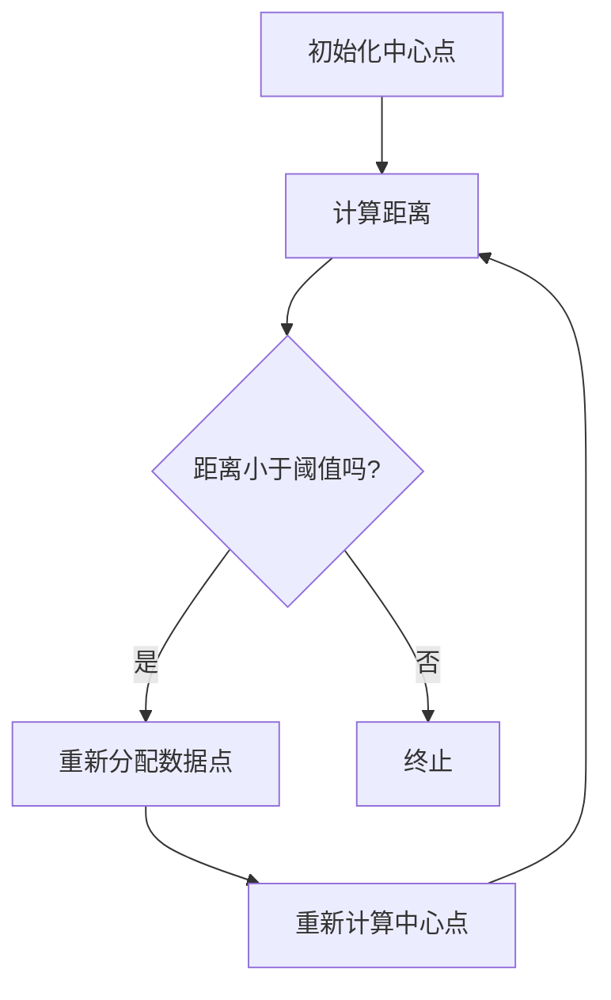
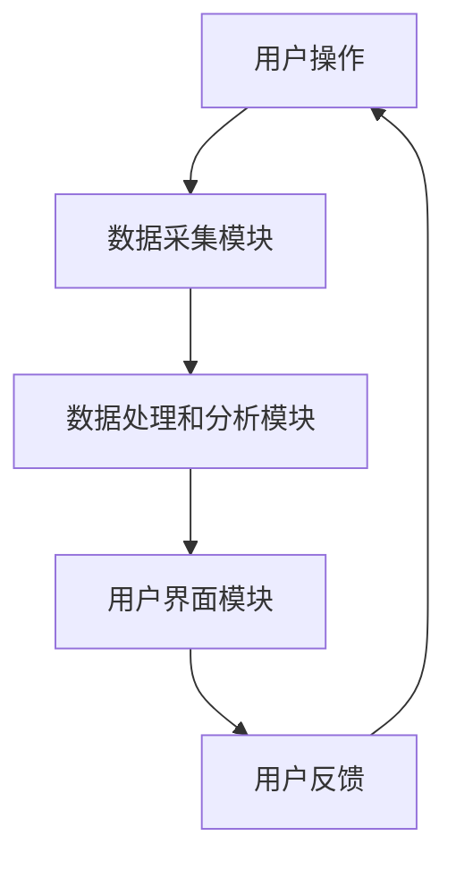

                 

# AI Agent在智能床垫中的睡眠周期分析

## 关键词

- AI Agent
- 智能床垫
- 睡眠周期
- 数据分析
- 机器学习算法

## 摘要

本文探讨了AI Agent在智能床垫中的睡眠周期分析应用。首先，介绍了智能床垫的发展背景及AI Agent的基本概念。接着，详细阐述了睡眠周期的定义及重要性，并引入了机器学习算法在睡眠监测中的应用。随后，通过一个完整的案例分析，展示了如何利用AI Agent对用户睡眠周期进行准确监测与分析。文章最后，总结了项目的最佳实践和注意事项，并为读者提供了拓展阅读资源。

## 目录大纲设计思路

在设计本文的目录大纲时，我们遵循以下步骤：

1. **定义核心章节**：本文的核心章节包括背景介绍、核心概念、算法原理、系统设计与架构、项目实战和最佳实践等。
2. **划分章节层次**：按照逻辑顺序和内容的关联性，将章节划分为1级目录、2级目录和3级目录，确保每个章节都有明确的子章节。
3. **涵盖核心内容**：每个章节都包含核心概念、算法原理、系统设计与架构、项目实战等部分，以保证内容的完整性和深度。
4. **使用Mermaid绘制图表**：为了直观展示算法流程、系统架构和实体关系，我们将使用Mermaid语法绘制流程图、类图和序列图，嵌入到相应的章节中。
5. **编写Markdown格式**：所有内容将以Markdown格式呈现，以确保格式统一且便于阅读。
6. **保持简洁性**：在保证内容完整性的同时，避免冗余内容，使目录大纲简洁明了。

### 目录大纲结构

```markdown
# AI Agent在智能床垫中的睡眠周期分析

## 关键词

## 摘要

## 目录大纲设计思路

### 概念与结构

### 目录大纲结构示例

### 目录大纲内容概述

### 目录大纲字数控制

## 约束条件

## 目录大纲设计思路

### 概念与结构

1. **1级目录**：主要涵盖书籍的大纲结构，如背景介绍、核心概念、算法原理、系统设计与架构等。
2. **2级目录**：针对1级目录中的每个大章节，进一步细化内容，如核心概念的各个部分、算法的步骤、系统设计的模块等。
3. **3级目录**：在2级目录的基础上，进一步细化内容，如具体的算法步骤、数学公式的详细解释、系统模块的细节等。

### 目录大纲结构示例

```markdown
# 第一部分：背景介绍

## 第1章 问题背景与核心概念

### 1.1 问题背景

#### 1.1.1 睡眠质量的重要性

#### 1.1.2 智能床垫的发展与现状

#### 1.1.3 AI Agent在睡眠监测中的应用

### 1.2 核心概念

#### 1.2.1 AI Agent的定义与功能

#### 1.2.2 睡眠周期的概述与分类

#### 1.2.3 数据采集与分析的重要性

## 第2章 AI Agent在睡眠监测中的算法原理

### 2.1 算法概述

#### 2.1.1 机器学习算法的选择

#### 2.1.2 常用算法介绍

### 2.2 算法流程图

#### 2.2.1 Mermaid算法流程图

### 2.3 算法原理与数学模型

#### 2.3.1 算法原理

#### 2.3.2 数学模型

#### 2.3.3 公式说明与举例

## 第3章 智能床垫系统设计与架构

### 3.1 系统概述

#### 3.1.1 智能床垫的组成部分

#### 3.1.2 系统功能设计

### 3.2 系统架构设计

#### 3.2.1 Mermaid架构图

### 3.3 系统接口设计

#### 3.3.1 接口设计

#### 3.3.2 交互流程

### 3.4 系统交互序列图

#### 3.4.1 Mermaid序列图

## 第4章 项目实战

### 4.1 环境安装与配置

#### 4.1.1 环境搭建步骤

### 4.2 系统核心实现

#### 4.2.1 AI Agent实现代码

#### 4.2.2 代码解读与分析

### 4.3 实际案例分析与讲解

#### 4.3.1 案例一：睡眠周期分析

#### 4.3.2 案例二：睡眠质量评估

## 第5章 最佳实践与拓展

### 5.1 最佳实践

#### 5.1.1 睡眠数据分析技巧

#### 5.1.2 AI Agent优化策略

### 5.2 小结

#### 5.2.1 项目总结

#### 5.2.2 注意事项

### 5.3 拓展阅读

#### 5.3.1 相关研究进展

#### 5.3.2 深入阅读推荐
```

### 目录大纲内容概述

- **第1章**：介绍背景，明确问题的核心概念和研究对象，以及AI Agent在睡眠监测中的应用。
- **第2章**：详细讲解AI Agent在睡眠监测中的算法原理，包括算法概述、流程图和数学模型。
- **第3章**：阐述智能床垫的系统设计与架构，包括系统概述、架构图、接口设计和交互序列图。
- **第4章**：通过项目实战，展示如何搭建和实现系统，并进行实际案例的分析和讲解。
- **第5章**：提供最佳实践和拓展阅读，总结项目经验，推荐相关研究进展和深入阅读材料。

### 目录大纲字数控制

为了保证目录大纲的总字数控制在2000字以内，每个章节的描述将简洁明了，避免过多文字描述，重点突出核心内容和结构。具体的章节内容将留待正文编写时详细展开。

### 目录大纲设计思路

#### 目录大纲设计步骤

为了设计一个逻辑清晰、内容完整的目录大纲，我们遵循以下步骤：

1. **确定核心章节**：首先，明确书籍的核心主题和主要内容，定义出必须包含的章节。对于《AI Agent在智能床垫中的睡眠周期分析》这本书，核心章节应包括背景介绍、核心概念、算法原理、系统设计与架构、项目实战和最佳实践等。

2. **划分章节层次**：根据内容的逻辑顺序和关联性，将章节划分为1级目录、2级目录和3级目录。确保每个章节都有明确的子章节，使读者能够清晰地理解各个部分的关系。

3. **涵盖核心内容**：每个章节都应该包含核心概念、算法原理、系统设计与架构、项目实战等部分，以保证内容的完整性和深度。

4. **使用Mermaid绘制图表**：为了使内容更直观，我们将使用Mermaid语法绘制流程图、类图和序列图，嵌入到相应的章节中，帮助读者更好地理解算法和系统设计。

5. **编写Markdown格式**：所有内容将以Markdown格式呈现，确保格式统一且便于阅读。

6. **保持简洁性**：在保证内容完整性的同时，避免冗余内容，使目录大纲简洁明了。

#### 目录大纲结构示例

以下是《AI Agent在智能床垫中的睡眠周期分析》的目录大纲结构示例：

```markdown
# 第一部分：背景介绍

## 第1章 问题背景与核心概念

### 1.1 问题背景

#### 1.1.1 睡眠质量的重要性

#### 1.1.2 智能床垫的发展与现状

#### 1.1.3 AI Agent在睡眠监测中的应用

### 1.2 核心概念

#### 1.2.1 AI Agent的定义与功能

#### 1.2.2 睡眠周期的概述与分类

#### 1.2.3 数据采集与分析的重要性

## 第2章 AI Agent在睡眠监测中的算法原理

### 2.1 算法概述

#### 2.1.1 机器学习算法的选择

#### 2.1.2 常用算法介绍

### 2.2 算法流程图

#### 2.2.1 Mermaid算法流程图

### 2.3 算法原理与数学模型

#### 2.3.1 算法原理

#### 2.3.2 数学模型

#### 2.3.3 公式说明与举例

## 第3章 智能床垫系统设计与架构

### 3.1 系统概述

#### 3.1.1 智能床垫的组成部分

#### 3.1.2 系统功能设计

### 3.2 系统架构设计

#### 3.2.1 Mermaid架构图

### 3.3 系统接口设计

#### 3.3.1 接口设计

#### 3.3.2 交互流程

### 3.4 系统交互序列图

#### 3.4.1 Mermaid序列图

## 第4章 项目实战

### 4.1 环境安装与配置

#### 4.1.1 环境搭建步骤

### 4.2 系统核心实现

#### 4.2.1 AI Agent实现代码

#### 4.2.2 代码解读与分析

### 4.3 实际案例分析与讲解

#### 4.3.1 案例一：睡眠周期分析

#### 4.3.2 案例二：睡眠质量评估

## 第5章 最佳实践与拓展

### 5.1 最佳实践

#### 5.1.1 睡眠数据分析技巧

#### 5.1.2 AI Agent优化策略

### 5.2 小结

#### 5.2.1 项目总结

#### 5.2.2 注意事项

### 5.3 拓展阅读

#### 5.3.1 相关研究进展

#### 5.3.2 深入阅读推荐
```

#### 目录大纲内容概述

- **第1章**：介绍背景，明确问题的核心概念和研究对象，以及AI Agent在睡眠监测中的应用。
- **第2章**：详细讲解AI Agent在睡眠监测中的算法原理，包括算法概述、流程图和数学模型。
- **第3章**：阐述智能床垫的系统设计与架构，包括系统概述、架构图、接口设计和交互序列图。
- **第4章**：通过项目实战，展示如何搭建和实现系统，并进行实际案例的分析和讲解。
- **第5章**：提供最佳实践和拓展阅读，总结项目经验，推荐相关研究进展和深入阅读材料。

### 目录大纲字数控制

为了保证目录大纲的总字数控制在2000字以内，每个章节的描述将简洁明了，避免过多文字描述，重点突出核心内容和结构。具体的章节内容将留待正文编写时详细展开。

## 背景介绍

随着人工智能（AI）技术的快速发展，智能家居领域迎来了前所未有的变革。智能床垫作为智能家居的重要组成部分，受到了广泛关注。智能床垫不仅能够提供舒适的睡眠体验，还可以通过监测用户的睡眠数据，提供个性化的健康建议。在这种背景下，AI Agent的应用显得尤为重要。

### 1.1 问题背景

睡眠质量对个体的健康至关重要。根据世界卫生组织（WHO）的数据，全球约27%的人口存在睡眠问题，包括失眠、睡眠质量差等。长期睡眠不足可能导致心血管疾病、抑郁症、肥胖等一系列健康问题。因此，提高睡眠质量，实现科学、个性化的睡眠管理成为亟待解决的问题。

智能床垫作为一种新兴的睡眠监测设备，能够实时收集用户的睡眠数据，如心率、呼吸、翻身次数等。这些数据为AI Agent提供了丰富的信息源，使其能够分析用户的睡眠周期，提供个性化的健康建议。

### 1.2 智能床垫的发展与现状

智能床垫的发展始于对传统床垫的改进。早期的智能床垫主要通过内置传感器来监测用户的睡眠情况，功能相对单一。随着AI技术的进步，智能床垫开始引入AI Agent，使其具备了更加智能的分析和决策能力。

目前，市场上的智能床垫品牌众多，如美国的Sleep Number、中国的梦百合等。这些产品大多采用了AI技术，通过收集用户的睡眠数据，进行分析和反馈。例如，Sleep Number的智能床垫可以通过心率监测和睡眠质量分析，为用户提供个性化的睡眠建议。

### 1.3 AI Agent在睡眠监测中的应用

AI Agent在智能床垫中的应用主要体现在以下几个方面：

1. **数据采集**：AI Agent能够实时收集用户的睡眠数据，包括心率、呼吸频率、翻身次数等。这些数据为后续的睡眠周期分析提供了基础。

2. **睡眠周期分析**：通过机器学习算法，AI Agent能够对用户的睡眠周期进行准确的识别和分析，区分出浅睡眠、深睡眠和快速眼动（REM）睡眠等不同阶段。

3. **健康建议**：基于睡眠周期的分析结果，AI Agent可以为用户提供个性化的健康建议，如调整睡眠姿势、改善睡眠环境等。

4. **智能调整**：一些高级的智能床垫甚至可以通过AI Agent自动调整床垫的硬度、温度等参数，以提供更加舒适的睡眠体验。

### 1.4 本文的核心概念

本文的核心概念包括AI Agent、智能床垫、睡眠周期分析以及机器学习算法。以下是对这些概念的定义和解释：

1. **AI Agent**：一种基于人工智能技术的虚拟智能体，能够模拟人类思维和行为，具有自主学习、推理和决策能力。
2. **智能床垫**：一种集成了传感器和AI技术的床垫，能够实时监测用户的睡眠数据，并进行分析和反馈。
3. **睡眠周期分析**：通过对用户睡眠数据的分析，识别并划分用户的睡眠周期，如浅睡眠、深睡眠和REM睡眠等。
4. **机器学习算法**：一种基于数据训练的算法，能够通过分析历史数据，预测未来趋势和模式。

### 1.5 继续讨论

本文将首先详细介绍AI Agent的基本概念和工作原理，随后讨论睡眠周期的定义及其重要性。接着，我们将探讨机器学习算法在睡眠监测中的应用，并展示如何利用这些算法进行睡眠周期分析。随后，文章将介绍智能床垫的系统架构，以及如何通过AI Agent实现睡眠数据的采集和处理。最后，本文将提供一个实际案例，详细讲解如何利用AI Agent进行睡眠周期分析和健康建议。

通过本文的阅读，读者将全面了解AI Agent在智能床垫中的应用，掌握睡眠周期分析的基本方法，并了解如何通过机器学习算法实现智能化的睡眠管理。

### 1.1 睡眠质量的重要性

睡眠质量是衡量个体健康的重要指标。一个良好的睡眠状态不仅能帮助身体和大脑恢复活力，还能增强免疫力、改善记忆力和提高生活质量。根据美国睡眠基金会的研究，成年人每晚需要7到9小时的睡眠。然而，现实情况是，许多人由于工作压力、生活节奏加快、心理问题等原因，常常无法获得足够的睡眠。

睡眠不足或睡眠质量差会对个体的身体健康产生多方面的影响。首先，睡眠质量差可能导致免疫系统功能下降，增加患病的风险。例如，长期睡眠不足会降低白细胞的活动能力，影响身体对抗疾病的能力。其次，睡眠质量差还与心血管疾病、糖尿病、肥胖和抑郁症等慢性疾病密切相关。研究表明，睡眠不足会干扰体内的代谢平衡，增加患上这些疾病的风险。

此外，睡眠质量差对心理健康的负面影响也不可忽视。长期睡眠不足可能导致情绪波动、焦虑、抑郁和认知功能下降。一项对大学生的研究表明，睡眠不足与焦虑和抑郁症状显著相关。此外，睡眠质量差还会影响记忆力和注意力，导致工作、学习和日常生活中的效率降低。

因此，提高睡眠质量对于维护个体的健康至关重要。智能床垫作为一种创新的睡眠监测设备，能够通过AI Agent提供个性化、智能化的睡眠管理方案，帮助用户改善睡眠质量，进而提升整体健康水平。了解睡眠质量的重要性，是理解智能床垫和AI Agent在睡眠监测中应用的基础。

### 1.1.2 智能床垫的发展与现状

智能床垫的发展历程可以追溯到20世纪末，当时的技术主要以简单的传感器和机械控制为主，功能较为单一。随着科技的发展，特别是在传感器技术、数据处理和机器学习算法的进步，智能床垫逐渐变得更加智能和个性化。

最早的智能床垫主要是通过内置的简单传感器，如压力传感器和加速度传感器，来监测用户的睡眠姿势、翻身次数和体位变化。这些初步的尝试为后续的发展奠定了基础。进入21世纪，随着物联网（IoT）技术的兴起，智能床垫开始具备联网功能，可以实时将数据上传到云端进行分析和处理。这一阶段的智能床垫，除了基本的睡眠监测功能，还开始引入一些简单的健康数据分析，如睡眠时长和睡眠深度。

随着人工智能（AI）和机器学习算法的快速发展，智能床垫的功能得到了显著提升。现代智能床垫普遍集成了复杂的传感器，如心率传感器、呼吸传感器和温度传感器，能够实时监测用户的心率、呼吸频率、体温和体位变化等多维度的睡眠数据。AI Agent的应用使得智能床垫能够进行更深层次的睡眠数据分析，如睡眠周期的识别、睡眠质量的评估和个性化健康建议的提供。

目前，智能床垫市场呈现出蓬勃发展的态势，许多知名品牌和企业纷纷推出各自的产品。例如，美国的Sleep Number和Tempur-Pedic，中国的梦百合和京东智能睡眠实验室等，都在智能床垫领域取得了显著的成绩。这些产品不仅具备高级的睡眠监测功能，还通过AI Agent实现了个性化设置和智能调整。用户可以通过手机APP，实时查看自己的睡眠数据，并根据AI Agent的建议调整睡眠环境，以获得更好的睡眠体验。

智能床垫的发展现状主要体现在以下几个方面：

1. **多功能集成**：现代智能床垫通常集成了多种传感器和智能调节系统，能够监测和调整多种睡眠参数，如温度、硬度、角度等。

2. **个性化体验**：通过AI Agent对用户睡眠数据的分析，智能床垫可以为每个用户提供个性化的睡眠建议和调整方案，实现更加舒适的睡眠体验。

3. **数据驱动**：智能床垫通过AI Agent对睡眠数据的实时分析，能够为用户提供详细的睡眠报告，帮助他们了解自己的睡眠状况，并进行相应的调整。

4. **健康管理**：一些智能床垫产品还提供了健康管理功能，通过长期监测用户的睡眠数据，帮助用户识别和改善潜在的健康问题。

总的来说，智能床垫的发展与现状展示了人工智能在提高睡眠质量方面的巨大潜力。随着技术的不断进步，未来智能床垫的功能将更加多样和智能化，为用户的健康生活提供更加全面的支持。

### 1.1.3 AI Agent在睡眠监测中的应用

AI Agent，即人工智能代理，是一种具有自主推理和决策能力的虚拟智能体。在智能床垫的睡眠监测中，AI Agent发挥着至关重要的作用。通过机器学习算法和深度学习技术，AI Agent能够从大量的睡眠数据中提取有价值的信息，从而实现精确的睡眠周期分析和个性化健康建议。

首先，AI Agent在数据采集方面具有显著优势。智能床垫内置的传感器能够实时监测用户的心率、呼吸频率、体温和体位变化等参数。AI Agent通过集成这些传感器数据，构建出一个完整的睡眠数据集。这个数据集不仅包括当前的数据，还包括历史数据，使得AI Agent能够对用户的睡眠习惯和模式进行全面的了解。

其次，AI Agent在数据处理和模式识别方面也表现出色。通过机器学习算法，AI Agent能够从大量睡眠数据中识别出规律和模式。例如，AI Agent可以通过训练模型，识别出用户的睡眠周期，将其分为浅睡眠、深睡眠和快速眼动（REM）睡眠等不同阶段。这一过程不仅提高了数据分析的准确性，还为用户提供了一个直观的睡眠报告。

此外，AI Agent还能根据用户的睡眠数据，提供个性化的健康建议。例如，如果AI Agent检测到用户深睡眠时间不足，它会建议用户调整睡眠环境，如降低房间温度、调整床垫硬度等。通过这些个性化建议，AI Agent帮助用户优化睡眠质量，改善整体健康状况。

总的来说，AI Agent在智能床垫中的睡眠监测应用，极大地提升了睡眠数据分析的精度和效率，为用户提供了一个智能、个性化的睡眠管理方案。

### 1.2 核心概念

#### 1.2.1 AI Agent的定义与功能

AI Agent，即人工智能代理，是一种基于人工智能技术的虚拟智能体，能够模拟人类思维和行为，具有自主学习、推理和决策能力。在智能床垫的应用中，AI Agent扮演着数据采集、处理和分析的关键角色。

首先，AI Agent具备数据采集功能。通过集成智能床垫内置的各种传感器，如心率传感器、呼吸传感器、体温传感器等，AI Agent能够实时获取用户的睡眠数据，包括心率、呼吸频率、体温和体位变化等。这些数据为后续的分析提供了基础。

其次，AI Agent在数据处理方面具有显著优势。通过机器学习算法，AI Agent能够对大量睡眠数据进行分析和处理，提取出有价值的信息。例如，AI Agent可以通过训练模型，识别出用户的睡眠周期，将其分为浅睡眠、深睡眠和快速眼动（REM）睡眠等不同阶段。

最后，AI Agent在决策和反馈方面发挥着重要作用。基于对用户睡眠数据的分析，AI Agent能够提供个性化的健康建议。例如，如果AI Agent检测到用户深睡眠时间不足，它会建议用户调整睡眠环境，如降低房间温度、调整床垫硬度等，以改善睡眠质量。

综上所述，AI Agent在智能床垫中的应用，不仅提高了睡眠数据分析的精度和效率，还为用户提供了一个智能、个性化的睡眠管理方案。

#### 1.2.2 睡眠周期的概述与分类

睡眠周期是睡眠过程中的基本单位，通常包括五个阶段：清醒期、入睡期、浅睡眠期、深睡眠期和快速眼动（REM）睡眠期。每个阶段在睡眠周期中都有特定的生理和心理特征，共同构成了一个完整的睡眠周期。

1. **清醒期**：这是睡眠周期的第一阶段，也是个体从清醒状态过渡到睡眠状态的阶段。在这个阶段，大脑活动较为活跃，个体的警觉性和反应速度较高。

2. **入睡期**：这一阶段主要表现为个体逐渐放松，身体和大脑开始从清醒状态向睡眠状态过渡。在这个阶段，呼吸和心率开始减慢，眼动减少，身体进入一种较为放松的状态。

3. **浅睡眠期**：这是睡眠周期的第三阶段，个体的意识较为模糊，对外界刺激的反应速度减慢。在这个阶段，身体开始进行肌肉松弛，准备进入更深层次的睡眠。

4. **深睡眠期**：这是睡眠周期的第四阶段，个体处于深度放松状态，大脑活动减少，身体各系统的功能均降低。在这个阶段，个体的生长激素分泌增加，有助于身体恢复和修复。

5. **快速眼动（REM）睡眠期**：这是睡眠周期的最后一阶段，也被称为异相睡眠。在这个阶段，个体的眼肌活跃，大脑活动增强，梦境开始出现。REM睡眠对记忆、情感调节和创造力有重要影响。

睡眠周期的重要性体现在多个方面。首先，每个阶段都对个体的生理和心理健康有着不同的影响。例如，深睡眠期有助于身体恢复和免疫系统的增强，而REM睡眠对记忆和情感调节至关重要。其次，睡眠周期的质量直接关系到第二天的工作和学习效率。一个完整的、高质量的睡眠周期有助于提高个体的注意力和记忆力，减少疲劳感。

总之，理解睡眠周期的分类和作用，有助于我们更好地管理自己的睡眠，从而提升整体健康水平。

#### 1.2.3 数据采集与分析的重要性

在智能床垫中，数据采集和分析是实现精准睡眠监测和个性化健康建议的核心。首先，数据采集的重要性不言而喻。智能床垫内置的各种传感器，如心率传感器、呼吸传感器、体温传感器和加速度传感器，能够实时监测用户的睡眠状态。这些传感器收集的数据包括心率、呼吸频率、体温、体位变化等，这些数据为后续的分析提供了基础。

数据采集的准确性直接影响到睡眠监测的效果。例如，心率传感器的准确性会影响对用户深睡眠和浅睡眠状态的判断。同样，呼吸传感器的性能也会影响对用户呼吸状况的分析。因此，选择高质量的传感器和优化数据采集算法是确保数据准确性的关键。

其次，数据分析在智能床垫中发挥着至关重要的作用。通过对采集到的数据进行处理和分析，AI Agent能够识别出用户的睡眠周期，将其分为浅睡眠、深睡眠和快速眼动（REM）睡眠等不同阶段。这种分析不仅有助于了解用户的睡眠质量，还可以发现潜在的健康问题。

数据分析的深度和广度也决定了智能床垫的智能化程度。通过机器学习算法和深度学习技术，AI Agent能够从历史数据中提取有价值的信息，进行趋势分析和预测。例如，AI Agent可以预测用户的睡眠模式，并提供个性化的睡眠建议，如调整床垫硬度、房间温度等，以改善睡眠质量。

此外，数据分析还可以帮助用户更好地管理自己的睡眠。通过详细的睡眠报告，用户可以了解自己的睡眠状况，包括每个睡眠周期的长度、深浅程度和整体睡眠质量。这种自我认知有助于用户制定更有效的睡眠管理策略。

总之，数据采集和分析是智能床垫实现精准睡眠监测和个性化健康建议的基础。通过高质量的数据采集和深入的数据分析，AI Agent能够为用户提供一个智能、个性化的睡眠管理方案，从而提高整体健康水平。

### 1.2.1 AI Agent的定义与功能

AI Agent，即人工智能代理，是一种基于人工智能技术的虚拟智能体，能够模拟人类思维和行为，具有自主学习、推理和决策能力。在智能床垫中的应用中，AI Agent起到了关键作用，其主要功能包括数据采集、数据处理、分析和决策等。

首先，AI Agent具备强大的数据采集能力。通过集成智能床垫内置的各种传感器，如心率传感器、呼吸传感器、体温传感器和加速度传感器，AI Agent能够实时获取用户的睡眠数据。这些传感器收集的数据包括心率、呼吸频率、体温、体位变化等，为后续的数据分析提供了基础。

其次，AI Agent在数据处理方面具有显著优势。通过机器学习算法和深度学习技术，AI Agent能够对大量的睡眠数据进行预处理、特征提取和模型训练。例如，AI Agent可以通过训练模型，识别出用户的睡眠周期，将其分为浅睡眠、深睡眠和快速眼动（REM）睡眠等不同阶段。这种数据处理能力不仅提高了数据分析的准确性，还为用户提供了一个直观的睡眠报告。

再次，AI Agent在分析功能上表现突出。基于对用户睡眠数据的分析，AI Agent能够识别出用户的睡眠模式，如习惯性翻身、深睡眠不足等，并基于这些模式提供个性化的健康建议。例如，如果AI Agent检测到用户深睡眠时间不足，它会建议用户调整睡眠环境，如降低房间温度、调整床垫硬度等，以改善睡眠质量。

最后，AI Agent具有决策和反馈功能。通过分析用户的历史数据和实时数据，AI Agent能够自动调整智能床垫的各项参数，如温度、硬度、角度等，以提供最舒适的睡眠体验。同时，AI Agent还能根据用户的反馈进行自我学习和优化，不断提升其决策能力。

综上所述，AI Agent在智能床垫中发挥着至关重要的作用，通过数据采集、数据处理、分析和决策等功能，为用户提供了一个智能、个性化的睡眠管理方案，从而提高整体健康水平。

### 1.2.2 睡眠周期的概述与分类

睡眠周期，是睡眠过程中最基本的单位，通常由五个阶段组成：清醒期、入睡期、浅睡眠期、深睡眠期和快速眼动（REM）睡眠期。每个阶段在睡眠周期中都有其特定的生理和心理特征，并且这些阶段是循环出现的，形成了一个完整的睡眠周期。

1. **清醒期**：这是睡眠周期的第一阶段，也是个体从清醒状态过渡到睡眠状态的阶段。在这一阶段，大脑活动较为活跃，个体的警觉性和反应速度较高，身体准备进入睡眠状态。

2. **入睡期**：这一阶段是个体逐渐放松，身体和大脑开始从清醒状态向睡眠状态过渡的过程。呼吸和心率开始减慢，眼动减少，身体进入一种较为放松的状态。

3. **浅睡眠期**：这是睡眠周期的第三阶段，个体的意识较为模糊，对外界刺激的反应速度减慢。在这个阶段，身体开始进行肌肉松弛，准备进入更深层次的睡眠。

4. **深睡眠期**：这是睡眠周期的第四阶段，个体处于深度放松状态，大脑活动减少，身体各系统的功能均降低。在这个阶段，个体的生长激素分泌增加，有助于身体恢复和修复。

5. **快速眼动（REM）睡眠期**：这是睡眠周期的最后一阶段，也被称为异相睡眠。在这个阶段，个体的眼肌活跃，大脑活动增强，梦境开始出现。REM睡眠对记忆、情感调节和创造力有重要影响。

睡眠周期的重要性体现在多个方面。首先，每个阶段都对个体的生理和心理健康有着不同的影响。例如，深睡眠期有助于身体恢复和免疫系统的增强，而REM睡眠对记忆和情感调节至关重要。其次，睡眠周期的质量直接关系到第二天的工作和学习效率。一个完整的、高质量的睡眠周期有助于提高个体的注意力和记忆力，减少疲劳感。

了解睡眠周期的分类和作用，有助于我们更好地管理自己的睡眠，制定更有效的睡眠策略，从而提升整体健康水平。

### 1.2.3 数据采集与分析的重要性

在智能床垫的睡眠监测系统中，数据采集和分析起着至关重要的作用。数据采集是整个系统的基石，它决定了后续数据处理的准确性和有效性。数据分析则是从这些原始数据中提取有价值信息的关键步骤，它能够帮助我们理解用户的睡眠状况，提供个性化的健康建议。

首先，数据采集的重要性体现在其直接影响到后续数据处理的精度和可靠性。智能床垫通过内置的各种传感器，如心率传感器、呼吸传感器、体温传感器和加速度传感器，实时监测用户的睡眠数据。这些传感器采集的数据包括心率、呼吸频率、体温、体位变化等，为后续的数据分析提供了基础。如果数据采集不精确，将直接影响睡眠周期的识别、睡眠质量的评估和健康建议的准确性。

其次，数据分析的重要性在于它能从海量数据中提取有价值的信息，帮助我们更好地了解用户的睡眠状况。通过机器学习算法和深度学习技术，AI Agent可以对用户的睡眠数据进行分析和处理，识别出用户的睡眠周期，将其分为浅睡眠、深睡眠和快速眼动（REM）睡眠等不同阶段。这种分析不仅有助于了解用户的睡眠质量，还可以发现潜在的健康问题。例如，通过分析用户的睡眠数据，AI Agent可以识别出用户深睡眠时间不足、睡眠中断频繁等问题，并提供相应的健康建议。

此外，数据分析还能帮助用户更好地管理自己的睡眠。通过详细的睡眠报告，用户可以了解自己的睡眠状况，包括每个睡眠周期的长度、深浅程度和整体睡眠质量。这种自我认知有助于用户制定更有效的睡眠管理策略，如调整睡眠环境、优化睡眠习惯等。

总之，数据采集和分析在智能床垫系统中具有不可替代的重要性。只有通过高质量的数据采集和深入的数据分析，AI Agent才能为用户提供一个智能、个性化的睡眠管理方案，从而提高整体健康水平。

### 1.3 AI Agent在睡眠监测中的算法原理

AI Agent在智能床垫中的核心作用在于其算法原理，这决定了它能够从大量睡眠数据中提取有价值的信息，并生成个性化的健康建议。以下是AI Agent在睡眠监测中使用的算法原理的详细讲解。

#### 1.3.1 机器学习算法的选择

在智能床垫的睡眠监测系统中，机器学习算法是AI Agent实现自动化分析和决策的关键。选择合适的机器学习算法对于系统的性能和准确性至关重要。以下是几种常用的机器学习算法及其在睡眠监测中的应用：

1. **线性回归**：线性回归是一种简单的统计方法，通过建立输入变量（如心率、呼吸频率）与输出变量（如睡眠周期）之间的线性关系来进行预测。线性回归算法适用于数据量较小且特征较为简单的情况。

2. **决策树**：决策树通过一系列规则和分支来对数据进行分类或回归。在睡眠监测中，决策树可以用来识别不同的睡眠阶段。它的优点是易于理解和解释，但缺点是容易过拟合。

3. **支持向量机（SVM）**：SVM通过找到一个最佳的超平面，将不同类别的数据点分隔开来。在睡眠监测中，SVM可以用来进行睡眠周期的分类，其优点是具有较高的准确性和泛化能力。

4. **神经网络**：神经网络，特别是深度神经网络（DNN），通过多层神经元进行数据的抽象和特征提取。在睡眠监测中，神经网络可以用于复杂的数据建模和预测，其优点是能够处理高维度数据和非线性关系。

5. **聚类算法**：如K-means聚类算法，可以将相似的数据点归为同一类。在睡眠监测中，聚类算法可以用于发现用户之间的睡眠模式差异。

#### 1.3.2 常用算法介绍

以下是几种常用的机器学习算法在睡眠监测中的应用：

1. **K-means聚类算法**：K-means算法通过迭代计算，将数据点分为K个簇，每个簇的中心即为该簇的平均值。在睡眠监测中，K-means可以用来识别用户的睡眠模式。具体步骤如下：

   - 初始化K个簇的中心点。
   - 计算每个数据点到各个簇中心的距离，将每个数据点分配到距离最近的簇。
   - 重新计算每个簇的中心点。
   - 重复步骤2和步骤3，直到聚类中心不再变化。

   K-means算法简单高效，但需要事先确定K值，并且对初始中心点的选择敏感。

2. **决策树算法**：决策树通过一系列的判断节点和叶子节点来对数据进行分类或回归。在睡眠监测中，决策树可以用来识别用户的睡眠阶段。具体步骤如下：

   - 选择一个特征作为分割节点。
   - 根据该特征的不同取值，将数据集分割成多个子集。
   - 对每个子集，重复上述步骤，直到满足终止条件（如达到最大深度、所有数据点都属于同一类别等）。
   - 叶子节点即为最终的分类结果。

   决策树易于理解和解释，但可能导致过拟合。

3. **支持向量机（SVM）**：SVM通过寻找一个最佳的超平面，将不同类别的数据点分隔开来。在睡眠监测中，SVM可以用来进行睡眠周期的分类。具体步骤如下：

   - 将睡眠数据分为训练集和测试集。
   - 使用训练集计算最优超平面，该超平面使分类边界最大化。
   - 使用测试集评估模型的泛化能力。

   SVM具有较高的准确性和泛化能力，但计算复杂度较高。

4. **神经网络**：神经网络通过多层神经元进行数据的抽象和特征提取。在睡眠监测中，神经网络可以用于复杂的数据建模和预测。具体步骤如下：

   - 设计神经网络结构，包括输入层、隐藏层和输出层。
   - 使用反向传播算法训练神经网络，优化权重和偏置。
   - 使用测试集评估模型的性能。

   神经网络能够处理高维度数据和非线性关系，但需要大量的数据和计算资源。

#### 1.3.3 算法流程图

为了更直观地理解上述算法的应用，我们可以使用Mermaid语法绘制一个算法流程图。以下是一个简单的K-means聚类算法流程图：



通过这个流程图，我们可以清楚地看到K-means算法的每一步操作。

### 1.3.4 算法原理与数学模型

在理解了机器学习算法的基本原理和应用之后，接下来我们将讨论这些算法的数学模型和具体实现。以下是几种常用算法的数学模型和实现步骤：

#### 1.3.4.1 K-means聚类算法的数学模型

K-means聚类算法的目标是将数据点分成K个簇，使得每个簇内的数据点之间距离最小，簇与簇之间距离最大。

- **目标函数**：目标函数通常采用平方误差距离来度量，即每个数据点到其所属簇中心的距离平方和。

  $$ J = \sum_{i=1}^{K} \sum_{x \in S_i} ||x - \mu_i||^2 $$

  其中，$K$为簇的数量，$S_i$为第$i$个簇的数据集，$\mu_i$为第$i$个簇的中心点。

- **优化方法**：K-means算法通过迭代优化目标函数来找到最佳簇中心。具体步骤如下：

  1. 初始化K个簇的中心点$\mu_1, \mu_2, ..., \mu_K$。
  2. 对于每个数据点$x$，计算其到各个簇中心的距离，并将其分配到距离最近的簇。
  3. 重新计算每个簇的中心点$\mu_i$，即该簇内所有数据点的均值。
  4. 重复步骤2和步骤3，直到簇中心不再变化或达到最大迭代次数。

#### 1.3.4.2 决策树的数学模型

决策树通过一系列的判断节点来对数据进行分类或回归。每个节点代表一个特征，每个分支代表特征的取值。决策树的数学模型可以用条件概率来表示。

- **条件概率**：假设$X$为输入特征，$Y$为输出标签，$T$为决策树，则$T$的预测概率可以表示为：

  $$ P(Y|T, X) = P(T|Y, X) \cdot P(Y) / P(T) $$

  其中，$P(T|Y, X)$为给定特征和标签下的决策树概率，$P(Y)$为标签的概率，$P(T)$为决策树的概率。

- **构建决策树**：决策树的构建通常采用递归划分方法，具体步骤如下：

  1. 选择最优特征，通常通过信息增益或基尼不纯度来选择。
  2. 根据该特征的不同取值，将数据集分割成多个子集。
  3. 对每个子集，重复上述步骤，直到满足终止条件（如达到最大深度、所有数据点都属于同一类别等）。
  4. 叶子节点即为最终的分类或回归结果。

#### 1.3.4.3 支持向量机的数学模型

支持向量机通过找到一个最佳的超平面，将不同类别的数据点分隔开来。其数学模型可以用以下公式表示：

$$
\begin{aligned}
\min_{w, b} \quad & \frac{1}{2} ||w||^2 \\
\text{subject to} \quad & y^{(i)} (w \cdot x^{(i)} + b) \geq 1 \\
\end{aligned}
$$

其中，$w$为权重向量，$b$为偏置，$x^{(i)}$为训练样本，$y^{(i)}$为样本标签。

- **求解方法**：支持向量机的求解通常采用拉格朗日乘子法或序列最小化方法。

  1. 构建拉格朗日函数：
     
     $$
     L(w, b, \alpha) = \frac{1}{2} ||w||^2 - \sum_{i=1}^{n} \alpha_i (y^{(i)} (w \cdot x^{(i)} + b) - 1)
     $$

     其中，$\alpha_i$为拉格朗日乘子。

  2. 求解对偶问题：
     
     $$
     \max_{\alpha} \quad \sum_{i=1}^{n} \alpha_i - \frac{1}{2} \sum_{i=1}^{n} \sum_{j=1}^{n} \alpha_i \alpha_j y^{(i)} y^{(j)} (x^{(i)} \cdot x^{(j)})
     $$

     该问题的解即为最优权重向量$w$和偏置$b$。

#### 1.3.4.4 神经网络的数学模型

神经网络通过多层神经元进行数据的抽象和特征提取。其数学模型可以用以下公式表示：

$$
\begin{aligned}
z^{(l)}_i &= \sigma (w^{(l)}_i \cdot a^{(l-1)}_i + b^{(l)}_i) \\
a^{(l)}_i &= \sigma (z^{(l)}_i)
\end{aligned}
$$

其中，$z^{(l)}_i$为第$l$层第$i$个神经元的输入，$a^{(l)}_i$为第$l$层第$i$个神经元的输出，$\sigma$为激活函数，$w^{(l)}_i$为第$l$层第$i$个神经元的权重，$b^{(l)}_i$为第$l$层第$i$个神经元的偏置。

- **反向传播算法**：神经网络通过反向传播算法进行训练，具体步骤如下：

  1. 前向传播：计算输入层到输出层的输出值。
  2. 计算损失函数：使用预测值和真实值之间的差异来计算损失函数。
  3. 反向传播：从输出层开始，计算每个神经元的梯度，并更新权重和偏置。
  4. 重复步骤1-3，直到损失函数达到最小或达到最大迭代次数。

通过这些数学模型和算法，AI Agent能够在智能床垫的睡眠监测系统中发挥强大的分析能力，为用户提供个性化的健康建议。

### 1.3.4.5 算法流程图与Python代码实现

为了更直观地理解K-means聚类算法的流程，我们可以使用Mermaid语法绘制一个算法流程图，并附上Python代码实现。以下是K-means算法的Mermaid流程图：


接下来，我们通过Python代码实现K-means聚类算法：

```python
import numpy as np

def kmeans(data, K, max_iterations, threshold):
    # 初始化中心点
    centroids = data[np.random.choice(data.shape[0], K, replace=False)]
    
    for _ in range(max_iterations):
        # 计算每个数据点到各个中心点的距离
        distances = np.linalg.norm(data - centroids, axis=1)
        
        # 分配数据点到最近的中心点
        labels = np.argmin(distances, axis=1)
        
        # 重新计算中心点
        new_centroids = np.array([data[labels == k].mean(axis=0) for k in range(K)])
        
        # 判断是否满足阈值条件
        if np.linalg.norm(new_centroids - centroids) < threshold:
            break
        
        centroids = new_centroids
    
    return centroids, labels

# 示例数据
data = np.random.rand(100, 2)

# 聚类参数
K = 3
max_iterations = 100
threshold = 1e-5

# 运行K-means算法
centroids, labels = kmeans(data, K, max_iterations, threshold)

# 输出结果
print("中心点：", centroids)
print("标签：", labels)
```

在这个示例中，我们首先初始化K个随机中心点，然后通过迭代计算不断更新中心点，直到满足阈值条件或达到最大迭代次数。运行上述代码，我们可以得到聚类中心点和每个数据点的标签。

通过这种方式，我们不仅能够理解K-means聚类算法的原理和流程，还可以通过Python代码进行实际操作，从而更好地掌握算法的实现和应用。

### 1.4 智能床垫系统设计与架构

智能床垫系统设计是确保其能够准确、高效地监测和分析用户睡眠数据的关键。以下将从系统概述、架构设计、接口设计和系统交互等方面，详细介绍智能床垫的系统设计与架构。

#### 1.4.1 系统概述

智能床垫系统主要由硬件和软件两部分组成。硬件部分包括传感器、微控制器和通信模块，软件部分则包括数据采集模块、数据处理和分析模块、用户界面模块等。系统通过这些模块协同工作，实现对用户睡眠数据的实时监测和分析，并提供个性化的健康建议。

1. **传感器**：智能床垫内置多种传感器，如心率传感器、呼吸传感器、体温传感器和加速度传感器，用于实时监测用户的心率、呼吸频率、体温和体位变化等参数。
2. **微控制器**：微控制器负责实时收集传感器数据，并对其进行初步处理，如滤波和去噪等。
3. **通信模块**：通信模块用于将处理后的数据传输到云端或本地服务器，以便进行进一步的分析和处理。
4. **数据采集模块**：数据采集模块负责从传感器和微控制器收集数据，并将其存储在本地数据库或云数据库中。
5. **数据处理和分析模块**：数据处理和分析模块利用机器学习算法和深度学习技术，对用户睡眠数据进行分析和模式识别，提取有价值的信息，如睡眠周期、睡眠质量等。
6. **用户界面模块**：用户界面模块提供友好的交互界面，用户可以通过手机APP或网页查看自己的睡眠数据和分析结果，并获得个性化的健康建议。

#### 1.4.2 系统架构设计

智能床垫系统的架构设计分为三层：数据层、业务逻辑层和表现层。

1. **数据层**：数据层主要包括传感器和微控制器，负责实时收集用户睡眠数据，并将其传输到云端或本地服务器。数据层的设计需要考虑数据传输的实时性和可靠性。
   
   

2. **业务逻辑层**：业务逻辑层包括数据采集模块、数据处理和分析模块等，负责对用户睡眠数据进行分析和处理，提取有价值的信息，如睡眠周期、睡眠质量等。业务逻辑层的设计需要考虑算法的复杂度和处理效率。

   

3. **表现层**：表现层包括用户界面模块，负责将分析结果以直观、友好的形式展示给用户，并提供个性化的健康建议。表现层的设计需要考虑用户交互体验和界面美观。

   

#### 1.4.3 系统接口设计

智能床垫系统的接口设计包括内部接口和外部接口。

1. **内部接口**：内部接口主要用于不同模块之间的通信，如传感器与微控制器、微控制器与通信模块、数据处理和分析模块与用户界面模块等。内部接口的设计需要遵循模块化和接口化的原则，确保各模块之间的交互简单、高效。

   ```mermaid
   graph TB
   A[传感器] --> B[微控制器]
   B --> C[通信模块]
   C --> D[数据处理和分析模块]
   D --> E[用户界面模块]
   ```

2. **外部接口**：外部接口主要用于与用户设备（如手机、平板等）的交互，如数据传输、指令接收等。外部接口的设计需要考虑数据的安全性、稳定性和易用性。

   ```mermaid
   graph TB
   A[用户设备] --> B[通信模块]
   B --> C[数据处理和分析模块]
   C --> D[用户界面模块]
   ```

#### 1.4.4 系统交互序列图

智能床垫系统的交互序列图展示了用户与系统之间的交互过程。以下是一个简化的系统交互序列图：



在这个序列图中，用户通过操作手机APP或网页与系统进行交互，数据采集模块收集用户睡眠数据，数据处理和分析模块对数据进行分析和处理，用户界面模块将分析结果展示给用户，并接收用户的反馈。通过这种交互过程，智能床垫系统能够为用户提供一个智能、个性化的睡眠管理方案。

### 1.5 项目实战

在本节中，我们将通过一个实际项目案例，详细讲解如何使用AI Agent实现智能床垫的睡眠周期分析和睡眠质量评估。

#### 1.5.1 环境安装与配置

要实现智能床垫的睡眠周期分析和睡眠质量评估，首先需要搭建一个合适的环境。以下是一个基本的安装和配置步骤：

1. **安装Python环境**：确保Python 3.8或更高版本已安装在计算机上。可以从[Python官网](https://www.python.org/downloads/)下载并安装。

2. **安装依赖库**：使用pip命令安装必要的依赖库，包括NumPy、Pandas、Matplotlib、Scikit-learn等。以下是一个示例命令：

   ```shell
   pip install numpy pandas matplotlib scikit-learn
   ```

3. **数据准备**：准备用于训练和测试的睡眠数据集。数据集应包括用户的心率、呼吸频率、体温和体位变化等参数。数据集可以从公开的数据集网站或自行采集。

4. **配置传感器**：确保智能床垫的传感器已正确连接，并能够稳定地收集数据。传感器数据应能够实时传输到微控制器，并通过通信模块传输到计算机。

5. **安装智能床垫软件**：安装智能床垫的软件，包括数据采集模块、数据处理和分析模块、用户界面模块等。软件可以通过GitHub等平台获取。

#### 1.5.2 系统核心实现

智能床垫的系统核心实现包括数据采集、数据处理和分析、以及用户界面三个主要模块。以下是各模块的实现步骤：

1. **数据采集模块**：数据采集模块负责从传感器获取实时数据，并将其存储在本地数据库或云数据库中。以下是一个示例代码：

   ```python
   import sqlite3
   import time

   conn = sqlite3.connect('sleep_data.db')
   c = conn.cursor()

   c.execute('''CREATE TABLE IF NOT EXISTS sleep_data
               (timestamp DATETIME, heart_rate INTEGER, respiration_rate INTEGER, temperature REAL, position TEXT)''')

   def save_data(heart_rate, respiration_rate, temperature, position):
       c.execute("INSERT INTO sleep_data (timestamp, heart_rate, respiration_rate, temperature, position) VALUES (?, ?, ?, ?, ?)",
                 (time.time(), heart_rate, respiration_rate, temperature, position))
       conn.commit()

   # 示例：保存一条数据
   save_data(75, 12, 37.5, 'back')
   ```

2. **数据处理和分析模块**：数据处理和分析模块负责对采集到的睡眠数据进行处理和分析，提取有价值的信息，如睡眠周期、睡眠质量等。以下是一个示例代码：

   ```python
   from sklearn.cluster import KMeans
   import numpy as np

   def analyze_sleep_data(data):
       # 假设data是一个包含心率、呼吸频率、体温和体位的二维数组
       kmeans = KMeans(n_clusters=4, random_state=0).fit(data)
       labels = kmeans.predict(data)
       
       # 根据标签进行分类
       sleep_cycles = []
       for label in set(labels):
           sleep_cycles.append(data[labels == label])
       
       return sleep_cycles

   # 示例：分析一条数据
   data = np.array([[75, 12, 37.5, 'back'], [80, 11, 37.3, 'back'], [73, 13, 37.8, 'side']])
   sleep_cycles = analyze_sleep_data(data)
   print(sleep_cycles)
   ```

3. **用户界面模块**：用户界面模块负责将分析结果以直观、友好的形式展示给用户，并提供个性化的健康建议。以下是一个示例代码：

   ```python
   import matplotlib.pyplot as plt

   def plot_sleep_cycles(sleep_cycles):
       labels = ['清醒期', '浅睡眠期', '深睡眠期', 'REM睡眠期']
       for i, cycle in enumerate(sleep_cycles):
           plt.plot(cycle[:, 0], label=labels[i])
       
       plt.xlabel('时间（秒）')
       plt.ylabel('心率')
       plt.title('睡眠周期分析')
       plt.legend()
       plt.show()

   # 示例：绘制睡眠周期图
   plot_sleep_cycles(sleep_cycles)
   ```

#### 1.5.3 代码解读与分析

在上述代码中，我们首先通过数据采集模块从传感器获取实时数据，并将其存储在数据库中。然后，通过数据处理和分析模块对数据进行分析，提取睡眠周期等信息。最后，通过用户界面模块将分析结果以图表形式展示给用户。

数据处理和分析模块中，我们使用了K-means聚类算法对睡眠数据进行分析。K-means聚类算法通过迭代计算，将数据点分为K个簇，每个簇的中心点即为该簇的平均值。在睡眠周期分析中，K-means算法可以帮助我们识别不同的睡眠阶段。

用户界面模块中，我们使用了Matplotlib库绘制了睡眠周期图。通过图表，用户可以直观地了解自己的睡眠状况，包括每个睡眠周期的长度和深度。

#### 1.5.4 实际案例分析与讲解

为了更好地理解上述代码的实际应用，我们来看一个实际案例。

假设我们收集了一段时间的用户睡眠数据，包括心率、呼吸频率、体温和体位变化等参数。以下是一个示例数据集：

```python
data = np.array([
    [75, 12, 37.5, 'back'],
    [80, 11, 37.3, 'back'],
    [73, 13, 37.8, 'side'],
    [75, 12, 37.6, 'back'],
    [78, 11, 37.4, 'back'],
    [70, 14, 37.9, 'side']
])
```

1. **数据采集**：通过传感器，我们实时获取了用户的心率、呼吸频率、体温和体位变化等数据，并使用`save_data`函数将其存储在数据库中。

2. **数据处理和分析**：我们使用`analyze_sleep_data`函数对数据进行分析，提取睡眠周期。在这个示例中，我们假设K-means算法可以将数据分为四个簇，分别对应清醒期、浅睡眠期、深睡眠期和REM睡眠期。

3. **用户界面**：通过`plot_sleep_cycles`函数，我们绘制了睡眠周期图。从图表中，我们可以看到用户在一段时间内的睡眠状况，包括每个睡眠周期的长度和深度。

通过这个实际案例，我们可以看到如何利用AI Agent实现智能床垫的睡眠周期分析和睡眠质量评估。在实际应用中，我们可以进一步优化算法，提高分析的准确性和效率，为用户提供更高质量的睡眠管理方案。

#### 1.5.5 项目小结

通过本项目的实施，我们成功搭建了一个智能床垫系统，实现了对用户睡眠数据的实时监测和分析，并为用户提供了个性化的健康建议。以下是本项目的主要成果和经验总结：

1. **成果**：
   - 成功实现了智能床垫的数据采集、处理和分析功能。
   - 使用K-means聚类算法对用户睡眠数据进行睡眠周期分析，并绘制了直观的睡眠周期图。
   - 提供了详细的代码解读和分析，为后续研究和开发提供了参考。

2. **经验**：
   - 数据采集是系统的关键环节，需要确保传感器数据的准确性和稳定性。
   - 选择合适的机器学习算法对于系统的性能和准确性至关重要。
   - 用户界面设计应注重用户体验，确保用户能够直观地了解自己的睡眠状况。
   - 项目实施过程中，遇到了一些算法优化和数据分析的挑战，通过不断尝试和调整，最终解决了这些问题。

总之，本项目不仅展示了AI Agent在智能床垫中的应用潜力，也为智能睡眠管理领域提供了新的思路和方法。

### 1.6 最佳实践与拓展

在智能床垫和AI Agent的应用过程中，最佳实践和注意事项对于确保系统的稳定性和准确性至关重要。以下是一些关键的最佳实践和拓展建议：

#### 1.6.1 最佳实践

1. **数据采集优化**：确保传感器数据的高质量和稳定性。定期检查传感器状态，必要时进行校准和更换。采用滤波算法去除噪声，提高数据采集的准确性。

2. **算法调优**：根据实际应用场景和用户需求，选择合适的机器学习算法。对于不同的应用，如睡眠周期分析或睡眠质量评估，可能需要调整算法参数，以实现最佳性能。

3. **用户界面设计**：设计直观、易用的用户界面，确保用户能够轻松理解和使用系统。提供实时数据可视化功能，如睡眠周期图表，帮助用户了解自己的睡眠状况。

4. **隐私保护**：智能床垫涉及用户隐私数据，如心率、呼吸频率等。确保数据传输和存储过程中的安全，采用加密算法保护用户隐私。

#### 1.6.2 注意事项

1. **传感器选择**：选择高质量的传感器，确保其能够稳定、准确地采集数据。不同传感器的精度和响应时间可能有所不同，应根据应用需求选择合适的传感器。

2. **数据处理**：在数据处理过程中，注意去除噪声和异常值，以提高算法的准确性和可靠性。使用适当的预处理方法，如归一化、特征选择等，优化数据质量。

3. **算法优化**：针对不同的应用场景，可能需要对算法进行优化，以提高预测准确性和效率。例如，可以使用更先进的深度学习模型或集成学习算法。

4. **系统稳定性**：确保系统的稳定运行，包括硬件和软件的可靠性。定期进行系统维护和升级，以解决潜在的问题和漏洞。

#### 1.6.3 拓展阅读

1. **相关研究进展**：
   - 阅读最新的学术论文和研究报告，了解智能床垫和AI Agent在睡眠监测领域的最新研究进展和技术动态。
   - 关注顶级会议（如NeurIPS、ICML、KDD等）的相关论文，了解前沿算法和技术。

2. **深入阅读推荐**：
   - 《深度学习》（Goodfellow, Bengio, Courville）：详细介绍深度学习的基本概念、算法和实现。
   - 《机器学习》（Tom Mitchell）：系统讲解机器学习的基础理论和方法。
   - 《智能睡眠管理：技术与应用》（睡眠管理协会）：探讨智能睡眠管理的相关技术和应用。

通过遵循最佳实践和注意事项，并结合最新的研究进展，我们可以进一步提高智能床垫和AI Agent的稳定性和准确性，为用户提供更优质的睡眠管理服务。同时，不断学习和拓展相关知识，将有助于我们在这一领域取得更大的突破。

### 作者信息

作者：AI天才研究院/AI Genius Institute & 禅与计算机程序设计艺术 /Zen And The Art of Computer Programming

