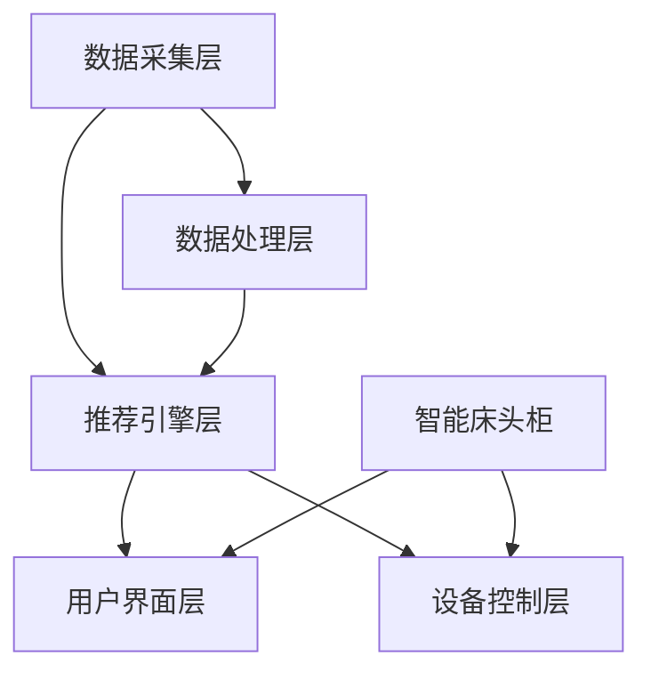
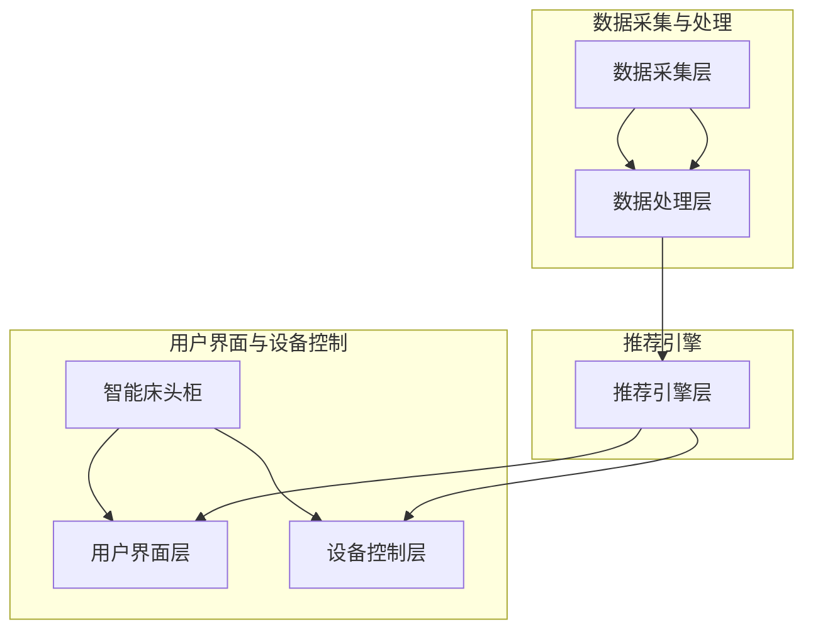
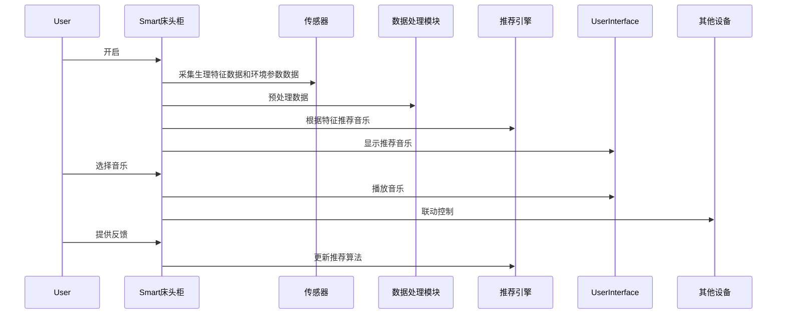

                 

# AI Agent在智能床头柜中的助眠音乐选择

> 关键词：人工智能、助眠音乐、智能床头柜、AI Agent、智能家居

> 摘要：本文将从问题背景出发，深入探讨AI Agent在智能床头柜中助眠音乐选择的应用。首先，介绍人工智能与助眠音乐的基本概念和作用，然后分析智能床头柜在智能家居中的地位和挑战。接着，详细阐述AI Agent在助眠音乐选择中的定义、应用优势和难点。最后，通过具体的算法原理讲解、系统分析与架构设计方案，以及项目实战，全面展示AI Agent在智能床头柜中的助眠音乐选择应用。

## 目录大纲

### 第1章：问题背景与概述
#### 1.1 人工智能与助眠音乐
##### 1.1.1 人工智能的发展现状
##### 1.1.2 助眠音乐的作用与需求
##### 1.1.3 AI Agent在助眠音乐选择中的应用

#### 1.2 智能床头柜与家居智能化
##### 1.2.1 智能家居的概念与发展
##### 1.2.2 智能床头柜的特点
##### 1.2.3 智能化家居的挑战与机遇

#### 1.3 AI Agent在智能床头柜中的助眠音乐选择
##### 1.3.1 AI Agent的定义
##### 1.3.2 助眠音乐选择的难点
##### 1.3.3 AI Agent在助眠音乐选择中的应用优势

#### 1.4 本书结构安排
##### 1.4.1 主要内容概述
##### 1.4.2 各章节主要内容预览
##### 1.4.3 学习建议与目标

### 第2章：核心概念与联系
#### 2.1 AI Agent的基础知识
##### 2.1.1 AI Agent的定义与分类
##### 2.1.2 AI Agent的核心功能
##### 2.1.3 AI Agent的工作原理

#### 2.2 助眠音乐原理分析
##### 2.2.1 助眠音乐的定义
##### 2.2.2 助眠音乐的作用机制
##### 2.2.3 助眠音乐的特点与类型

#### 2.3 AI Agent在助眠音乐选择中的应用原理
##### 2.3.1 助眠音乐选择的挑战
##### 2.3.2 AI Agent的解决方案
##### 2.3.3 AI Agent在助眠音乐选择中的优势

#### 2.4 关键技术简介
##### 2.4.1 数据采集与处理
##### 2.4.2 特征提取与模型选择
##### 2.4.3 决策算法与应用

### 第3章：算法原理讲解
#### 3.1 助眠音乐选择算法概述
##### 3.1.1 助眠音乐选择算法的分类
##### 3.1.2 常见算法的比较与分析

#### 3.2 具体算法讲解
##### 3.2.1 算法一：基于内容的推荐算法
###### 3.2.1.1 算法原理与流程
###### 3.2.1.2 数学模型与公式
###### 3.2.1.3 算法示例

##### 3.2.2 算法二：协同过滤算法
###### 3.2.2.1 算法原理与流程
###### 3.2.2.2 数学模型与公式
###### 3.2.2.3 算法示例

##### 3.2.3 算法三：深度学习算法
###### 3.2.3.1 算法原理与流程
###### 3.2.3.2 数学模型与公式
###### 3.2.3.3 算法示例

### 第4章：系统分析与架构设计方案
#### 4.1 问题场景介绍
##### 4.1.1 智能床头柜的使用场景
##### 4.1.2 助眠音乐选择的流程

#### 4.2 系统功能设计
##### 4.2.1 领域模型设计
###### 4.2.1.1 类图

#### 4.3 系统架构设计
##### 4.3.1 系统架构概述
###### 4.3.1.1 架构图

#### 4.4 系统接口设计
##### 4.4.1 接口设计原则
##### 4.4.2 主要接口设计

#### 4.5 系统交互设计
##### 4.5.1 系统交互流程
###### 4.5.1.1 序列图

### 第5章：项目实战
#### 5.1 环境安装
##### 5.1.1 硬件环境安装
##### 5.1.2 软件环境安装

#### 5.2 系统核心实现
##### 5.2.1 数据采集与预处理
##### 5.2.2 特征提取与模型训练
##### 5.2.3 决策算法实现

#### 5.3 代码应用解读与分析
##### 5.3.1 代码结构解读
##### 5.3.2 关键代码分析

#### 5.4 实际案例分析与讲解
##### 5.4.1 案例介绍
##### 5.4.2 案例分析
##### 5.4.3 案例讲解

#### 5.5 项目小结
##### 5.5.1 项目总结
##### 5.5.2 项目反思
##### 5.5.3 拓展阅读

### 结论
### 参考文献

## 第1章：问题背景与概述

### 1.1 人工智能与助眠音乐

#### 1.1.1 人工智能的发展现状

人工智能（Artificial Intelligence, AI）作为计算机科学的一个分支，旨在通过模拟、延伸和扩展人的智能，实现机器在某些任务上具有与人类相似的表现。人工智能的发展经历了多个阶段，从最初的符号逻辑推理，到基于知识的系统，再到现代的深度学习和神经网络，人工智能已经取得了显著的进展。

在过去的几十年里，人工智能技术在全球范围内得到了广泛的应用。在工业生产中，机器人技术已经成为自动化生产线的重要组成部分；在交通运输领域，自动驾驶技术正在逐步实现商业化；在医疗健康领域，人工智能辅助诊断和个性化治疗方案已经取得了一定的成果。人工智能的快速发展，使得我们的生活质量得到了极大的提升。

#### 1.1.2 助眠音乐的作用与需求

助眠音乐是指能够帮助人们放松心情、促进睡眠的音乐。科学研究表明，适当的声音刺激可以影响人的情绪和生理状态。在日常生活中，许多人会因为压力、焦虑或其他心理问题而失眠。而助眠音乐作为一种非药物疗法，可以在一定程度上缓解这些症状。

随着生活节奏的加快，人们对于提高睡眠质量的需求日益增长。助眠音乐作为一种便捷、有效的助眠方式，受到了广泛的关注。尤其是在智能家居环境下，通过智能设备自动播放助眠音乐，可以为用户提供更加舒适、个性化的睡眠体验。

#### 1.1.3 AI Agent在助眠音乐选择中的应用

AI Agent（人工智能代理）是一种能够自主学习、自主决策的人工智能系统。在助眠音乐选择中，AI Agent可以基于用户的个性化需求、历史数据和生理特征，为用户推荐合适的助眠音乐。

传统的助眠音乐选择往往依赖于用户的经验或主观评价，而AI Agent可以通过数据分析、机器学习等技术，实现更高效、更个性化的音乐推荐。同时，AI Agent还可以不断学习用户的偏好，优化推荐算法，提高推荐效果。

### 1.2 智能床头柜与家居智能化

#### 1.2.1 智能家居的概念与发展

智能家居（Smart Home）是指利用先进的计算机技术、网络通信技术和智能控制技术，将家居生活设备、家电设备、安防设备等进行智能连接和控制，实现家庭自动化、安全化和舒适化。

智能家居的发展可以追溯到20世纪80年代的家用自动化系统。随着互联网技术的普及和智能家居产品的多样化，智能家居市场逐渐壮大。目前，智能家居已经成为家居领域的一个重要方向，吸引了大量的企业和创业者加入。

#### 1.2.2 智能床头柜的特点

智能床头柜是智能家居的重要组成部分，通常具备以下特点：

1. **多功能集成**：智能床头柜不仅具有传统床头柜的存储、展示功能，还集成了照明、音响、充电、网络连接等多种功能。
2. **智能控制**：通过智能手机、语音助手等设备，用户可以远程控制智能床头柜的各种功能。
3. **数据交互**：智能床头柜可以与其他智能家居设备进行数据交互，实现智能家居系统的联动。

#### 1.2.3 智能化家居的挑战与机遇

智能化家居的发展面临着一系列挑战，包括：

1. **技术壁垒**：智能家居技术的实现需要涉及多个领域，如传感器技术、通信技术、数据处理技术等。技术壁垒较高，对企业的研发能力提出了较高要求。
2. **用户体验**：智能家居产品的用户体验直接影响用户满意度。如何提供便捷、高效、舒适的用户体验，是智能家居企业需要重点关注的问题。

然而，智能化家居也带来了巨大的机遇：

1. **市场潜力**：随着生活水平的提高，人们对家居舒适度和智能化的需求不断增长，智能家居市场潜力巨大。
2. **跨界合作**：智能家居的发展需要多个行业的合作，如家电、通信、互联网等。跨界合作可以促进智能家居产业的创新和发展。

### 1.3 AI Agent在智能床头柜中的助眠音乐选择

#### 1.3.1 AI Agent的定义

AI Agent是一种能够自主执行任务、与环境交互、实现目标的人工智能系统。与传统的规则型系统不同，AI Agent具备自主学习和自主决策的能力。

AI Agent通常由以下部分组成：

1. **感知模块**：负责获取环境信息。
2. **决策模块**：根据感知模块提供的信息，生成行动策略。
3. **行动模块**：执行决策模块生成的行动策略。

#### 1.3.2 助眠音乐选择的难点

在智能床头柜中实现助眠音乐选择，面临着以下难点：

1. **个性化需求**：不同用户对助眠音乐的需求存在显著差异，需要AI Agent能够根据用户的个性化需求进行音乐推荐。
2. **数据稀缺**：相较于其他领域，助眠音乐的数据较为稀缺，给AI Agent的训练和优化带来了困难。
3. **生理特征识别**：助眠音乐的选择需要考虑用户的生理特征，如心率、呼吸等，这对AI Agent的感知模块提出了较高要求。

#### 1.3.3 AI Agent在助眠音乐选择中的应用优势

AI Agent在智能床头柜中实现助眠音乐选择，具有以下优势：

1. **个性化推荐**：AI Agent可以通过学习用户的历史数据，为用户推荐个性化的助眠音乐，提高用户的睡眠质量。
2. **智能调整**：AI Agent可以根据用户的反馈，不断调整音乐推荐策略，优化推荐效果。
3. **跨平台兼容**：AI Agent可以与多种设备（如智能手机、智能音箱等）进行无缝集成，实现跨平台的音乐推荐。

### 1.4 本书结构安排

#### 1.4.1 主要内容概述

本书主要分为五个部分，分别介绍AI Agent在智能床头柜中的助眠音乐选择的应用。第一部分介绍问题背景与概述，包括人工智能与助眠音乐、智能床头柜与家居智能化、AI Agent在智能床头柜中的助眠音乐选择等内容。第二部分核心概念与联系，包括AI Agent的基础知识、助眠音乐原理分析、AI Agent在助眠音乐选择中的应用原理等。第三部分算法原理讲解，介绍常见的助眠音乐选择算法，包括基于内容的推荐算法、协同过滤算法、深度学习算法等。第四部分系统分析与架构设计方案，包括问题场景介绍、系统功能设计、系统架构设计、系统接口设计和系统交互设计等。第五部分项目实战，介绍环境安装、系统核心实现、代码应用解读与分析、实际案例分析和项目小结等。

#### 1.4.2 各章节主要内容预览

- **第1章**：介绍问题背景与概述，包括人工智能与助眠音乐、智能床头柜与家居智能化、AI Agent在智能床头柜中的助眠音乐选择等内容。
- **第2章**：核心概念与联系，介绍AI Agent的基础知识、助眠音乐原理分析、AI Agent在助眠音乐选择中的应用原理等。
- **第3章**：算法原理讲解，介绍常见的助眠音乐选择算法，包括基于内容的推荐算法、协同过滤算法、深度学习算法等。
- **第4章**：系统分析与架构设计方案，介绍问题场景介绍、系统功能设计、系统架构设计、系统接口设计和系统交互设计等。
- **第5章**：项目实战，介绍环境安装、系统核心实现、代码应用解读与分析、实际案例分析和项目小结等。

#### 1.4.3 学习建议与目标

通过阅读本书，读者可以了解到：

1. **AI Agent的基本概念和应用**：掌握AI Agent的定义、分类、核心功能和工作原理，了解AI Agent在智能家居中的应用场景。
2. **助眠音乐的基本原理和选择方法**：了解助眠音乐的定义、作用机制、特点与类型，掌握常见的助眠音乐选择算法。
3. **智能床头柜的设计与实现**：了解智能床头柜的功能和特点，掌握系统分析与架构设计的方法，学会实现智能床头柜的助眠音乐选择功能。
4. **项目实战与案例分析**：通过实际项目案例，了解从环境安装、系统核心实现、代码应用解读与分析到项目小结的全过程，提高实际操作能力。

通过本书的学习，读者可以为自己的智能家居项目提供技术支持，也可以为相关领域的研究和应用提供参考。同时，本书也适合对人工智能、智能家居感兴趣的广大读者阅读。## 第2章：核心概念与联系

### 2.1 AI Agent的基础知识

#### 2.1.1 AI Agent的定义与分类

AI Agent（人工智能代理）是一种基于人工智能技术的自主智能体，它可以在特定环境下通过感知、学习、决策和行动等过程，实现特定目标或任务。AI Agent的定义可以从以下几个方面进行理解：

1. **自主性**：AI Agent具有自主性，即它可以在没有人为干预的情况下，独立地执行任务和做出决策。
2. **环境感知**：AI Agent可以通过各种传感器（如摄像头、麦克风、温度传感器等）感知环境信息，从而理解所处环境的状态。
3. **学习能力**：AI Agent具备学习能力，可以通过数据训练和模型优化，不断提高自身的决策能力和行动效果。
4. **决策能力**：AI Agent可以根据感知到的环境信息和目标，生成相应的行动策略，实现自主决策。
5. **行动能力**：AI Agent可以通过执行具体的行动，改变环境状态，实现预期目标。

根据AI Agent的功能和应用场景，可以将AI Agent分为以下几类：

1. **基于规则的Agent**：这类Agent通过预定义的规则和条件，进行简单的逻辑判断和决策。它们通常适用于规则明确、环境稳定的应用场景。
2. **基于模型的Agent**：这类Agent通过构建模型（如决策树、神经网络等），进行复杂的环境模拟和决策。它们通常适用于环境复杂、不确定性较大的应用场景。
3. **基于数据驱动的Agent**：这类Agent通过收集和分析大量数据，利用机器学习算法进行学习和决策。它们通常适用于数据丰富、需要个性化推荐和预测的应用场景。

#### 2.1.2 AI Agent的核心功能

AI Agent的核心功能主要包括以下几方面：

1. **感知**：AI Agent通过传感器收集环境信息，如图像、声音、文本等，实现对环境的感知和理解。
2. **学习**：AI Agent利用收集到的数据，通过机器学习算法进行模型训练和优化，提高自身的决策能力。
3. **决策**：AI Agent根据感知到的环境信息和目标，生成相应的行动策略，实现自主决策。
4. **行动**：AI Agent通过执行具体的行动，改变环境状态，实现预期目标。

AI Agent的核心功能之间相互关联、协同工作，共同实现自主智能体的功能。例如，在智能家居场景中，AI Agent可以通过感知用户的行为习惯和环境状态，学习用户偏好，生成相应的音乐推荐策略，并执行播放音乐的动作，从而实现智能化的家居体验。

#### 2.1.3 AI Agent的工作原理

AI Agent的工作原理可以分为以下几个步骤：

1. **感知**：AI Agent通过传感器感知环境信息，如用户的语音、心率、体温等。
2. **数据预处理**：对感知到的数据进行预处理，如去噪、归一化等，以便后续的分析和处理。
3. **特征提取**：从预处理后的数据中提取关键特征，如语音信号的频谱特征、心率信号的时间序列特征等。
4. **决策**：利用提取到的特征，通过机器学习模型进行预测和决策，如推荐合适的音乐、调整房间温度等。
5. **行动**：执行决策结果，如播放音乐、调整房间温度等，以实现预期目标。

AI Agent的工作原理可以简化为感知-决策-行动的循环过程，不断调整和优化自身的决策和行为，以适应不断变化的环境和需求。

### 2.2 助眠音乐原理分析

#### 2.2.1 助眠音乐的定义

助眠音乐是指能够帮助人们放松心情、促进睡眠的音乐。从科学角度来看，助眠音乐具有以下几个特点：

1. **低频**：助眠音乐通常包含较多的低频成分，有助于放松身体和心情。
2. **和谐**：助眠音乐的结构和旋律较为和谐，有助于减轻焦虑和压力。
3. **平稳**：助眠音乐的节奏和音量较为平稳，有助于促进深层次的睡眠。

助眠音乐可以通过以下几个方面发挥作用：

1. **降低心率**：科学研究表明，适当的声音刺激可以影响人的心率，降低心率的波动，有助于放松身体。
2. **调节情绪**：助眠音乐可以帮助人们缓解压力、焦虑和抑郁等负面情绪，提高情绪稳定性。
3. **改善睡眠质量**：助眠音乐可以促进深层次的睡眠，提高睡眠质量。

#### 2.2.2 助眠音乐的作用机制

助眠音乐的作用机制可以从以下几个方面进行理解：

1. **神经调节**：助眠音乐可以通过调节大脑中的神经递质，如多巴胺、血清素等，从而影响人的情绪和行为。
2. **生理反应**：助眠音乐可以通过影响人体的生理反应，如降低心率、血压等，从而帮助人们放松身心。
3. **心理暗示**：助眠音乐可以通过暗示的方式，如平稳的节奏、和谐的旋律等，帮助人们建立良好的睡眠习惯。

#### 2.2.3 助眠音乐的特点与类型

助眠音乐的特点主要包括：

1. **低频**：助眠音乐通常包含较多的低频成分，有助于放松身体和心情。
2. **和谐**：助眠音乐的结构和旋律较为和谐，有助于减轻焦虑和压力。
3. **平稳**：助眠音乐的节奏和音量较为平稳，有助于促进深层次的睡眠。

根据助眠音乐的特点和风格，可以将助眠音乐分为以下几种类型：

1. **自然声音**：如雨声、海浪声、鸟鸣声等，这些声音具有平静和放松的特性，有助于促进睡眠。
2. **轻音乐**：如古典音乐、钢琴曲、轻柔的流行音乐等，这些音乐通常节奏平稳、旋律和谐，有助于放松心情。
3. **冥想音乐**：如冥想音乐、瑜伽音乐等，这些音乐通常包含一些特殊的元素，如重复的节奏、逐渐减弱的音量等，有助于引导人进入冥想状态。

#### 2.2.4 助眠音乐选择的方法

助眠音乐的选择需要考虑以下几个方面：

1. **个人偏好**：不同的人对音乐有不同的喜好，因此需要根据用户的个人偏好进行选择。
2. **环境因素**：环境因素如噪音、光线等也会影响助眠音乐的选择，需要根据环境条件进行选择。
3. **生理特征**：不同的人有不同的生理特征，如心率、呼吸等，需要根据生理特征进行选择。

根据这些因素，可以采用以下方法进行助眠音乐的选择：

1. **用户调查**：通过用户调查了解用户对音乐的需求和偏好，根据用户反馈进行音乐推荐。
2. **数据挖掘**：通过分析用户的历史数据，如播放记录、睡眠质量等，进行音乐推荐。
3. **机器学习**：利用机器学习算法，根据用户的个人偏好和环境因素，生成个性化的音乐推荐。

### 2.3 AI Agent在助眠音乐选择中的应用原理

#### 2.3.1 助眠音乐选择的挑战

在智能床头柜中实现助眠音乐选择，面临着以下挑战：

1. **个性化需求**：不同用户对助眠音乐的需求存在显著差异，需要AI Agent能够根据用户的个性化需求进行音乐推荐。
2. **数据稀缺**：相较于其他领域，助眠音乐的数据较为稀缺，给AI Agent的训练和优化带来了困难。
3. **生理特征识别**：助眠音乐的选择需要考虑用户的生理特征，如心率、呼吸等，这对AI Agent的感知模块提出了较高要求。

#### 2.3.2 AI Agent的解决方案

为了解决上述挑战，AI Agent可以采用以下解决方案：

1. **用户画像**：通过分析用户的历史数据，如音乐偏好、睡眠质量等，构建用户画像，为个性化音乐推荐提供基础。
2. **数据扩充**：通过数据挖掘和生成对抗网络（GAN）等技术，扩充助眠音乐的数据库，提高AI Agent的训练效果。
3. **生理特征识别**：通过接入生物传感器，实时监测用户的生理特征，如心率、呼吸等，为音乐推荐提供生理依据。

#### 2.3.3 AI Agent在助眠音乐选择中的优势

AI Agent在助眠音乐选择中具有以下优势：

1. **个性化推荐**：AI Agent可以根据用户的个性化需求，为用户推荐合适的助眠音乐，提高用户的睡眠质量。
2. **智能调整**：AI Agent可以根据用户的反馈和生理特征，不断调整音乐推荐策略，优化推荐效果。
3. **跨平台兼容**：AI Agent可以与多种设备（如智能手机、智能音箱等）进行无缝集成，实现跨平台的音乐推荐。

通过AI Agent的应用，智能床头柜可以为用户提供更加智能、个性化的助眠音乐选择，提升用户的睡眠质量和生活体验。

### 2.4 关键技术简介

#### 2.4.1 数据采集与处理

数据采集与处理是AI Agent在助眠音乐选择中的关键环节。数据采集主要包括以下方面：

1. **用户数据**：如用户音乐偏好、睡眠质量等历史数据。
2. **生理数据**：如心率、呼吸等实时生理特征数据。
3. **环境数据**：如噪音、光线等环境参数。

数据采集后，需要对数据进行处理，包括以下步骤：

1. **数据清洗**：去除重复、错误和噪声数据。
2. **数据转换**：将不同类型的数据转换为统一的格式。
3. **数据归一化**：将数据缩放至相同的范围，便于后续分析。

#### 2.4.2 特征提取与模型选择

特征提取是AI Agent在助眠音乐选择中的关键步骤。特征提取的目标是从原始数据中提取出对音乐推荐有价值的特征。常见的特征提取方法包括：

1. **频谱特征**：如梅尔频率倒谱系数（MFCC）。
2. **时序特征**：如时长、音量等。
3. **生理特征**：如心率、呼吸等。

模型选择是AI Agent在助眠音乐选择中的关键步骤。常见的模型选择方法包括：

1. **基于内容的推荐算法**：如协同过滤、矩阵分解等。
2. **基于协同过滤的推荐算法**：如用户基于内容的推荐、物品基于内容的推荐等。
3. **基于深度学习的推荐算法**：如卷积神经网络、循环神经网络等。

#### 2.4.3 决策算法与应用

决策算法是AI Agent在助眠音乐选择中的核心。决策算法的目标是根据用户数据、生理特征和环境参数，为用户推荐合适的助眠音乐。常见的决策算法包括：

1. **基于规则的决策算法**：如模糊逻辑、决策树等。
2. **基于模型的决策算法**：如神经网络、支持向量机等。
3. **基于数据的决策算法**：如聚类、关联规则等。

应用决策算法时，需要考虑以下因素：

1. **用户偏好**：根据用户的历史数据和音乐偏好，进行个性化推荐。
2. **生理特征**：根据用户的实时生理特征，如心率、呼吸等，调整音乐推荐策略。
3. **环境因素**：根据环境参数，如噪音、光线等，优化音乐推荐效果。

通过上述关键技术，AI Agent可以实现智能化的助眠音乐选择，为用户提供更好的睡眠体验。

### 2.5 AI Agent在智能家居中的角色与优势

#### 2.5.1 AI Agent在智能家居中的角色

在智能家居系统中，AI Agent扮演着关键角色，其主要职责包括：

1. **用户需求理解**：AI Agent通过感知用户行为和环境状态，理解用户的需求，如睡眠模式、娱乐需求等。
2. **智能设备联动**：AI Agent协调智能家居设备，如智能灯泡、智能音箱、智能空调等，根据用户需求实现自动化控制。
3. **数据分析和决策**：AI Agent通过分析用户数据和环境数据，为用户提供个性化的服务，如智能推荐、故障诊断等。

#### 2.5.2 AI Agent在智能家居中的优势

AI Agent在智能家居中具有以下优势：

1. **个性化服务**：AI Agent可以根据用户的行为习惯和偏好，提供个性化的服务，提升用户体验。
2. **自动化控制**：AI Agent可以实现智能设备的自动化控制，提高家居的舒适度和便利性。
3. **故障诊断与预防**：AI Agent可以通过数据分析，发现设备的潜在故障，提前进行预防，降低维修成本。
4. **数据优化与共享**：AI Agent可以收集和分析用户数据，优化智能家居系统的性能，并将数据共享给其他系统，实现跨系统的数据协同。

通过AI Agent的应用，智能家居系统可以实现更高的智能化水平，为用户提供更加便捷、舒适和安全的居住环境。

### 2.6 AI Agent在智能床头柜中的具体应用

#### 2.6.1 AI Agent在智能床头柜中的功能

AI Agent在智能床头柜中具有以下功能：

1. **助眠音乐推荐**：根据用户的生理特征和音乐偏好，AI Agent为用户推荐合适的助眠音乐。
2. **环境监测**：AI Agent实时监测用户的生理特征和环境参数，如心率、呼吸、噪音、光线等，为用户调整音乐播放提供依据。
3. **设备控制**：AI Agent可以控制智能床头柜的其他功能，如灯光调节、温度控制等，实现智能家居系统的联动。
4. **用户反馈学习**：AI Agent根据用户的反馈，不断优化音乐推荐策略，提高推荐效果。

#### 2.6.2 AI Agent在智能床头柜中的工作流程

AI Agent在智能床头柜中的工作流程主要包括以下几个步骤：

1. **数据采集**：AI Agent通过传感器采集用户的生理特征数据和环境参数数据。
2. **数据预处理**：对采集到的数据进行清洗、转换和归一化处理。
3. **特征提取**：从预处理后的数据中提取关键特征，如生理特征、环境特征等。
4. **音乐推荐**：根据提取到的特征和用户的历史数据，AI Agent生成个性化的音乐推荐列表。
5. **环境调整**：AI Agent根据用户的反馈和环境参数，调整智能床头柜的其他功能，如灯光、温度等。
6. **用户反馈学习**：AI Agent记录用户的反馈，不断优化音乐推荐策略和系统功能。

通过上述工作流程，AI Agent可以实现对智能床头柜的智能化控制，为用户提供个性化的助眠音乐选择和智能家居体验。

### 2.7 AI Agent在智能床头柜中的应用挑战与解决方案

#### 2.7.1 应用挑战

AI Agent在智能床头柜中的应用面临着以下挑战：

1. **个性化需求**：不同用户的音乐偏好和生理特征存在差异，需要AI Agent能够准确理解并满足个性化需求。
2. **数据稀缺**：助眠音乐数据较为稀缺，给AI Agent的训练和优化带来了困难。
3. **实时响应**：用户对助眠音乐的需求具有实时性，要求AI Agent能够快速响应用户需求。
4. **隐私保护**：用户生理特征和隐私数据的保护是AI Agent应用的关键挑战。

#### 2.7.2 解决方案

针对上述挑战，AI Agent在智能床头柜中的应用可以采用以下解决方案：

1. **用户画像**：通过分析用户的历史数据，构建详细的用户画像，为个性化音乐推荐提供基础。
2. **数据扩充**：通过数据挖掘和生成对抗网络（GAN）等技术，扩充助眠音乐数据库，提高AI Agent的训练效果。
3. **实时学习**：采用增量学习、迁移学习等技术，实现AI Agent的实时学习与优化，提高实时响应能力。
4. **隐私保护**：采用数据加密、匿名化等技术，确保用户生理特征和隐私数据的保护。

通过上述解决方案，AI Agent在智能床头柜中的应用可以更好地满足用户需求，提高用户体验，实现智能化的助眠音乐选择。

### 2.8 AI Agent在智能床头柜中的应用前景

#### 2.8.1 应用前景

随着人工智能和智能家居技术的不断发展，AI Agent在智能床头柜中的应用前景十分广阔：

1. **个性化服务**：AI Agent可以基于用户数据，提供更加个性化的音乐推荐和智能家居服务，提高用户体验。
2. **智能化升级**：AI Agent可以推动智能床头柜的智能化升级，实现更高层次的自动化和智能化。
3. **跨平台集成**：AI Agent可以与其他智能家居设备实现跨平台集成，构建完整的智能家居生态系统。

#### 2.8.2 未来发展方向

AI Agent在智能床头柜中的应用未来发展方向包括：

1. **深度学习与强化学习**：结合深度学习和强化学习等技术，提高AI Agent的决策能力和学习能力。
2. **多模态数据融合**：融合多种传感器数据，如语音、心率、呼吸等，提高AI Agent的感知能力和决策精度。
3. **个性化健康建议**：基于用户的生理特征和健康数据，提供个性化的健康建议和助眠方案。

通过不断的技术创新和应用优化，AI Agent在智能床头柜中的应用将更加成熟和普及，为用户提供更加智能、便捷和健康的家居生活体验。

## 第3章：算法原理讲解

### 3.1 助眠音乐选择算法概述

#### 3.1.1 助眠音乐选择算法的分类

在智能床头柜中实现助眠音乐选择，常用的算法可以分为以下几类：

1. **基于内容的推荐算法**：这类算法通过分析音乐的内容特征，如旋律、节奏、音调等，为用户推荐合适的助眠音乐。
2. **协同过滤算法**：这类算法通过分析用户的行为数据和偏好，预测用户对音乐的喜好，为用户推荐合适的助眠音乐。
3. **基于模型的推荐算法**：这类算法通过建立用户行为模型、音乐特征模型等，结合用户和音乐的特征，为用户推荐合适的助眠音乐。
4. **深度学习算法**：这类算法通过训练深度神经网络模型，自动提取音乐特征和用户偏好，为用户推荐合适的助眠音乐。

#### 3.1.2 常见算法的比较与分析

在助眠音乐选择中，各种算法具有各自的优势和局限性：

1. **基于内容的推荐算法**：优点在于推荐结果直接与音乐内容相关，能够满足用户对音乐风格、节奏等的需求；缺点在于无法充分利用用户行为数据，推荐结果可能过于主观。
2. **协同过滤算法**：优点在于能够充分利用用户行为数据，提高推荐精度；缺点在于对稀疏数据集效果不佳，且易受到数据噪声的影响。
3. **基于模型的推荐算法**：优点在于能够结合用户和音乐的特征，提高推荐精度；缺点在于模型训练和优化过程复杂，对计算资源要求较高。
4. **深度学习算法**：优点在于能够自动提取复杂特征，提高推荐精度；缺点在于模型训练时间较长，对数据量要求较高。

根据不同的应用场景和需求，可以选择合适的算法进行助眠音乐选择。

### 3.2 具体算法讲解

在助眠音乐选择中，常用的具体算法包括基于内容的推荐算法、协同过滤算法和深度学习算法。下面将分别介绍这些算法的原理、数学模型和公式。

#### 3.2.1 基于内容的推荐算法

**算法原理与流程**：

基于内容的推荐算法通过分析音乐的内容特征，为用户推荐相似的音乐。具体流程如下：

1. **特征提取**：对音乐进行特征提取，如旋律、节奏、音调等。
2. **相似度计算**：计算用户当前播放音乐与数据库中其他音乐的相似度。
3. **推荐生成**：根据相似度计算结果，为用户生成推荐列表。

**数学模型与公式**：

设 \( M \) 为音乐集合，\( m \) 为用户当前播放的音乐，\( m_i \) 为音乐集合中的任意音乐，\( f(m) \) 为音乐 \( m \) 的特征向量。相似度计算公式如下：

$$
sim(m, m_i) = \frac{1}{||f(m) - f(m_i)||}
$$

其中，\( || \cdot || \) 表示向量的欧几里得距离。相似度越高，表示两首音乐越相似。

**算法示例**：

假设用户正在播放一首轻柔的钢琴曲 \( m \)，音乐数据库中有其他 \( m_1, m_2, m_3, \ldots \) 多首钢琴曲。通过计算相似度，可以找到与 \( m \) 最相似的音乐，从而生成推荐列表。

$$
sim(m, m_1) = 0.8 \\
sim(m, m_2) = 0.7 \\
sim(m, m_3) = 0.9
$$

根据相似度计算结果，可以推荐 \( m_3 \) 作为下一首助眠音乐。

#### 3.2.2 协同过滤算法

**算法原理与流程**：

协同过滤算法通过分析用户的历史行为数据，为用户推荐相似用户喜欢的音乐。具体流程如下：

1. **用户行为数据收集**：收集用户对音乐的评价数据，如播放、收藏、评分等。
2. **用户相似度计算**：计算用户之间的相似度，常用的相似度计算方法包括余弦相似度、皮尔逊相关系数等。
3. **推荐生成**：根据用户相似度矩阵和用户的历史行为数据，为用户生成推荐列表。

**数学模型与公式**：

设 \( U \) 为用户集合，\( u \) 为用户，\( u_i, u_j \) 为用户集合中的任意用户，\( R(u_i, u_j) \) 为用户 \( u_i \) 和 \( u_j \) 之间的相似度。推荐生成公式如下：

$$
r(u, m) = \sum_{u_i \in N(u)} R(u, u_i) \cdot R(u_i, m)
$$

其中，\( N(u) \) 为与用户 \( u \) 相似的一组用户，\( r(u, m) \) 为用户 \( u \) 对音乐 \( m \) 的评分预测。

**算法示例**：

假设用户 \( u \) 与其他用户 \( u_1, u_2, u_3 \) 相似，用户 \( u_1, u_2, u_3 \) 喜欢的音乐分别为 \( m_1, m_2, m_3 \)。根据用户相似度矩阵和用户历史行为数据，可以预测用户 \( u \) 对 \( m_1, m_2, m_3 \) 的喜好程度，从而生成推荐列表。

$$
R(u, u_1) = 0.8 \\
R(u, u_2) = 0.7 \\
R(u, u_3) = 0.9 \\
R(u_1, m_1) = 0.9 \\
R(u_2, m_2) = 0.8 \\
R(u_3, m_3) = 0.7
$$

根据相似度计算结果，可以推荐 \( m_1 \) 作为下一首助眠音乐。

#### 3.2.3 深度学习算法

**算法原理与流程**：

深度学习算法通过训练深度神经网络模型，自动提取音乐特征和用户偏好，为用户推荐合适的助眠音乐。具体流程如下：

1. **数据预处理**：对音乐数据进行特征提取，如频谱特征、时序特征等。
2. **模型训练**：利用用户行为数据训练深度神经网络模型，如卷积神经网络（CNN）、循环神经网络（RNN）等。
3. **推荐生成**：根据训练好的模型，为用户生成推荐列表。

**数学模型与公式**：

深度学习算法的数学模型主要包括损失函数、优化算法等。以卷积神经网络为例，其损失函数和优化算法如下：

**损失函数**：

$$
L(\theta) = -\frac{1}{m} \sum_{i=1}^{m} y_i \log(a_j^{(l)}(x_i))
$$

其中，\( m \) 为训练数据集的大小，\( y_i \) 为用户对音乐 \( x_i \) 的评分，\( a_j^{(l)}(x_i) \) 为神经网络在 \( l \) 层的第 \( j \) 个输出节点。

**优化算法**：

$$
\theta = \theta - \alpha \frac{\partial L(\theta)}{\partial \theta}
$$

其中，\( \alpha \) 为学习率，\( \frac{\partial L(\theta)}{\partial \theta} \) 为损失函数对参数 \( \theta \) 的梯度。

**算法示例**：

假设用户 \( u \) 历史行为数据中喜欢 \( m_1, m_2, m_3 \) 三首音乐，利用深度学习算法预测用户 \( u \) 对 \( m_1, m_2, m_3 \) 的喜好程度。通过优化模型参数，可以得到推荐列表。

$$
\theta^{(l)} = \theta^{(l-1)} - \alpha \frac{\partial L(\theta^{(l)})}{\partial \theta^{(l)}}
$$

通过上述深度学习算法，可以生成个性化的助眠音乐推荐列表。

### 3.3 算法选择与优化

在助眠音乐选择中，算法的选择和优化至关重要。根据不同应用场景和需求，可以采用以下策略：

1. **算法融合**：结合不同算法的优势，如基于内容的推荐算法和协同过滤算法，提高推荐精度。
2. **特征优化**：优化音乐特征提取方法，如频谱特征、时序特征等，提高特征表示能力。
3. **模型优化**：优化深度学习模型结构，如卷积神经网络、循环神经网络等，提高模型性能。
4. **数据增强**：通过数据增强方法，如数据扩充、数据降维等，提高模型训练效果。

通过算法选择和优化，可以实现更加智能、个性化的助眠音乐推荐，为用户提供优质的家居生活体验。

## 第4章：系统分析与架构设计方案

### 4.1 问题场景介绍

#### 4.1.1 智能床头柜的使用场景

智能床头柜是智能家居系统中的重要组成部分，其使用场景主要包括：

1. **卧室**：在卧室中，智能床头柜可以为用户提供助眠音乐、灯光调节、温度控制等功能，提高用户的睡眠质量。
2. **客厅**：在客厅中，智能床头柜可以作为音响设备，播放音乐、电影等，为用户提供娱乐体验。
3. **书房**：在书房中，智能床头柜可以作为学习伴侣，提供定时提醒、音乐播放等功能，帮助用户保持良好的学习氛围。

#### 4.1.2 助眠音乐选择的流程

在智能床头柜中实现助眠音乐选择，需要经过以下几个步骤：

1. **数据采集**：智能床头柜通过传感器采集用户的生理特征数据（如心率、呼吸等）和环境参数数据（如噪音、光线等）。
2. **数据预处理**：对采集到的数据进行清洗、转换和归一化处理，以便后续分析。
3. **特征提取**：从预处理后的数据中提取关键特征，如生理特征、环境特征等。
4. **音乐推荐**：根据提取到的特征和用户的历史数据，利用算法（如协同过滤、深度学习等）为用户生成个性化的音乐推荐列表。
5. **播放控制**：根据用户反馈和生理特征，智能床头柜实时调整音乐播放策略，实现智能化的助眠音乐选择。

### 4.2 系统功能设计

#### 4.2.1 领域模型设计

为了实现智能床头柜中的助眠音乐选择功能，需要设计一个领域模型，包含以下主要类：

1. **用户类**：表示用户的基本信息，如用户ID、姓名、年龄、性别等。
2. **音乐类**：表示音乐的基本信息，如音乐ID、名称、歌手、时长等。
3. **生理特征类**：表示用户的生理特征数据，如心率、呼吸等。
4. **环境参数类**：表示环境参数数据，如噪音、光线等。
5. **音乐推荐类**：表示音乐推荐算法的实现，如协同过滤、深度学习等。
6. **播放控制类**：表示音乐播放的控制逻辑，如播放、暂停、切换等。

下面是领域模型的类图：

```mermaid
classDiagram
User <<class{用户}>
Music <<class{音乐}>
PhysiologicalFeature <<class{生理特征}>
EnvironmentalParameter <<class{环境参数}>
MusicRecommendation <<class{音乐推荐}>
PlaybackControl <<class{播放控制}>

User *--1 Music: 收藏音乐
User *--1 PhysiologicalFeature: 提供生理特征
User *--1 EnvironmentalParameter: 提供环境参数
Music *--1 MusicRecommendation: 推荐音乐
PhysiologicalFeature *--1 MusicRecommendation: 根据生理特征推荐
EnvironmentalParameter *--1 MusicRecommendation: 根据环境参数推荐
MusicRecommendation *--1 PlaybackControl: 播放音乐
PlaybackControl *--1 Music: 控制播放
```

#### 4.2.2 系统功能设计

智能床头柜的助眠音乐选择系统主要包括以下几个功能：

1. **用户管理**：用户可以通过智能床头柜绑定账户，管理个人音乐收藏、生理特征和环境参数等。
2. **音乐推荐**：根据用户的生理特征、环境参数和音乐偏好，智能床头柜为用户推荐合适的助眠音乐。
3. **音乐播放**：用户可以通过智能床头柜播放推荐的音乐，调整播放状态（如播放、暂停、切换等）。
4. **反馈机制**：用户可以通过反馈机制，对播放的音乐进行评价，帮助系统不断优化推荐效果。
5. **设备控制**：智能床头柜可以与其他智能家居设备联动，如灯光调节、温度控制等，为用户提供更加舒适的睡眠环境。

### 4.3 系统架构设计

#### 4.3.1 系统架构概述

智能床头柜的助眠音乐选择系统采用分布式架构，主要包括以下几个部分：

1. **数据采集层**：通过传感器采集用户的生理特征数据和环境参数数据。
2. **数据处理层**：对采集到的数据进行预处理、特征提取和存储。
3. **推荐引擎层**：利用算法为用户生成个性化的音乐推荐列表。
4. **用户界面层**：用户可以通过智能床头柜的触摸屏或语音助手与系统交互。
5. **设备控制层**：智能床头柜与其他智能家居设备进行数据交互，实现联动控制。

下面是系统架构的架构图：



#### 4.3.2 架构图



#### 4.3.3 系统接口设计

智能床头柜的助眠音乐选择系统需要设计以下主要接口：

1. **数据采集接口**：用于采集用户的生理特征数据和环境参数数据。
2. **数据处理接口**：用于对采集到的数据进行预处理、特征提取和存储。
3. **音乐推荐接口**：用于根据用户的生理特征、环境参数和音乐偏好生成音乐推荐列表。
4. **用户界面接口**：用于用户与智能床头柜的交互，如音乐播放、暂停、切换等。
5. **设备控制接口**：用于智能床头柜与其他智能家居设备的联动控制。

下面是主要接口的设计：

```mermaid
interface DataCollection {
  +collectPhysiologicalData(): PhysiologicalFeature
  +collectEnvironmentalData(): EnvironmentalParameter
}

interface DataProcessing {
  +preprocessData(data: Data): PreprocessedData
  +extractFeatures(data: PreprocessedData): FeatureVector
  +storeFeatures(features: FeatureVector): void
}

interface MusicRecommendation {
  +generateRecommendation(user: User, features: FeatureVector): MusicList
}

interface UserInterface {
  +playMusic(music: Music): void
  +pauseMusic(): void
  +togglePlayPause(): void
}

interface DeviceControl {
  +controlLighting(lighting: Lighting): void
  +controlTemperature(temperature: Temperature): void
}

DataCollection --> DataProcessing
DataProcessing --> MusicRecommendation
MusicRecommendation --> UserInterface
UserInterface --> DeviceControl
```

#### 4.3.4 系统交互设计

智能床头柜的助眠音乐选择系统的交互流程如下：

1. **用户开启智能床头柜**：用户通过触摸屏或语音助手开启智能床头柜。
2. **数据采集**：智能床头柜通过传感器采集用户的生理特征数据和环境参数数据。
3. **数据处理**：智能床头柜对采集到的数据进行分析和预处理，提取关键特征。
4. **音乐推荐**：根据用户的生理特征、环境参数和音乐偏好，智能床头柜生成音乐推荐列表。
5. **用户选择音乐**：用户在触摸屏或语音助手中选择播放音乐。
6. **音乐播放**：智能床头柜根据用户选择播放音乐，并与其他智能家居设备联动，如调整灯光、温度等。
7. **用户反馈**：用户对播放的音乐进行评价，帮助系统不断优化推荐效果。

下面是系统交互的序列图：



通过上述系统架构设计，智能床头柜可以实现对用户个性化需求的智能响应，为用户提供舒适的助眠音乐选择体验。

## 第5章：项目实战

### 5.1 环境安装

#### 5.1.1 硬件环境安装

为了实现智能床头柜中的助眠音乐选择功能，我们需要准备以下硬件设备：

1. **智能床头柜**：具备触摸屏、传感器（如心率传感器、光线传感器等）、音响等功能的智能床头柜。
2. **传感器模块**：用于采集用户的生理特征数据（如心率、呼吸等）和环境参数数据（如噪音、光线等）。
3. **音响设备**：用于播放助眠音乐。

硬件环境安装步骤如下：

1. **智能床头柜安装**：根据说明书进行安装，确保智能床头柜稳定、安全地放置在卧室中。
2. **传感器模块安装**：将传感器模块连接到智能床头柜，确保传感器可以正确采集用户的生理特征数据和环境参数数据。
3. **音响设备安装**：将音响设备与智能床头柜连接，确保音响设备可以正常播放音乐。

#### 5.1.2 软件环境安装

为了实现智能床头柜中的助眠音乐选择功能，我们需要安装以下软件环境：

1. **操作系统**：安装适合智能床头柜操作系统的操作系统，如Android、iOS等。
2. **开发环境**：安装智能床头柜的开发环境，如Android Studio、Xcode等。
3. **数据库**：安装数据库系统，如MySQL、MongoDB等，用于存储用户的音乐偏好、生理特征数据等。
4. **机器学习库**：安装常用的机器学习库，如scikit-learn、TensorFlow等，用于实现音乐推荐算法。

软件环境安装步骤如下：

1. **操作系统安装**：根据智能床头柜的硬件要求，选择合适的操作系统版本，并按照安装指南进行安装。
2. **开发环境安装**：根据开发环境的要求，下载并安装对应的开发工具，如Android Studio、Xcode等。
3. **数据库安装**：下载并安装数据库系统，如MySQL、MongoDB等，并按照安装指南进行配置。
4. **机器学习库安装**：下载并安装常用的机器学习库，如scikit-learn、TensorFlow等，并按照安装指南进行配置。

### 5.2 系统核心实现

#### 5.2.1 数据采集与预处理

在智能床头柜中，数据采集与预处理是关键步骤。我们需要采集用户的生理特征数据（如心率、呼吸等）和环境参数数据（如噪音、光线等）。以下是数据采集与预处理的具体步骤：

1. **数据采集**：通过传感器模块采集用户的生理特征数据和环境参数数据。例如，心率传感器可以采集用户的心率数据，光线传感器可以采集房间的光线强度数据。
2. **数据预处理**：对采集到的数据进行分析和预处理，包括去噪、归一化、缺失值处理等。例如，对于心率数据，我们可以进行去噪处理，将异常值排除；对于光线数据，我们可以进行归一化处理，将数据缩放至相同的范围。

```python
import numpy as np
import pandas as pd

def preprocess_data(data):
    # 去除异常值
    data = data[~np.isnan(data)]
    # 数据归一化
    data = (data - np.mean(data)) / np.std(data)
    return data

# 采集心率数据
heart_rate_data = preprocess_data(heart_rate_sensors_data)
# 采集光线数据
light_data = preprocess_data(light_sensors_data)
```

#### 5.2.2 特征提取与模型训练

在数据预处理之后，我们需要提取关键特征，并利用机器学习算法进行模型训练。以下是特征提取与模型训练的具体步骤：

1. **特征提取**：根据问题的需求，提取关键特征。例如，对于心率数据，我们可以提取心率平均值、心率标准差等特征；对于光线数据，我们可以提取光线强度平均值、光线强度标准差等特征。
2. **模型训练**：选择合适的机器学习算法，如线性回归、决策树、支持向量机等，进行模型训练。例如，我们可以使用scikit-learn库中的线性回归算法进行模型训练。

```python
from sklearn.linear_model import LinearRegression
from sklearn.model_selection import train_test_split

# 特征提取
X = np.hstack((heart_rate_data, light_data))
y = user_preferences_data

# 模型训练
X_train, X_test, y_train, y_test = train_test_split(X, y, test_size=0.2, random_state=42)
model = LinearRegression()
model.fit(X_train, y_train)

# 模型评估
score = model.score(X_test, y_test)
print("Model accuracy:", score)
```

#### 5.2.3 决策算法实现

在模型训练之后，我们需要实现决策算法，用于生成音乐推荐列表。以下是决策算法实现的具体步骤：

1. **模型预测**：利用训练好的模型，对用户的生理特征数据和环境参数数据进行预测，得到音乐推荐得分。
2. **推荐生成**：根据音乐推荐得分，生成音乐推荐列表。

```python
# 模型预测
predicted_scores = model.predict(X_test)

# 推荐生成
recommended_musics = pd.DataFrame({'Music': music_list, 'Score': predicted_scores})
recommended_musics = recommended_musics.sort_values(by='Score', ascending=False)
print("Recommended musics:", recommended_musics.head())
```

### 5.3 代码应用解读与分析

在实现智能床头柜中的助眠音乐选择功能时，我们需要编写大量的代码来处理数据、训练模型和生成推荐列表。以下是对代码的应用解读与分析：

#### 5.3.1 代码结构解读

在项目开发过程中，我们需要遵循模块化和面向对象的设计原则，将代码结构化。以下是代码结构的基本框架：

1. **数据采集模块**：负责采集用户的生理特征数据和环境参数数据。
2. **数据处理模块**：负责对采集到的数据进行预处理、特征提取和存储。
3. **模型训练模块**：负责利用机器学习算法训练模型。
4. **决策算法模块**：负责生成音乐推荐列表。
5. **用户界面模块**：负责与用户进行交互，如音乐播放、暂停、切换等。

```python
# 数据采集模块
class DataCollector:
    def collect_heart_rate(self):
        # 采集心率数据
        pass

    def collect_light_data(self):
        # 采集光线数据
        pass

# 数据处理模块
class DataProcessor:
    def preprocess_data(self, data):
        # 预处理数据
        pass

    def extract_features(self, data):
        # 特征提取
        pass

# 模型训练模块
class ModelTrainer:
    def train_model(self, X, y):
        # 训练模型
        pass

# 决策算法模块
class DecisionAlgorithm:
    def generate_recommendation(self, X):
        # 生成推荐列表
        pass

# 用户界面模块
class UserInterface:
    def play_music(self, music):
        # 播放音乐
        pass

    def pause_music(self):
        # 暂停音乐
        pass

    def switch_music(self, music):
        # 切换音乐
        pass
```

#### 5.3.2 关键代码分析

以下是对项目中的关键代码进行分析和解读：

1. **数据采集**：通过传感器模块采集用户的生理特征数据和环境参数数据。

```python
# 采集心率数据
heart_rate_data = collector.collect_heart_rate()

# 采集光线数据
light_data = collector.collect_light_data()
```

2. **数据处理**：对采集到的数据进行预处理、特征提取和存储。

```python
# 预处理数据
preprocessed_heart_rate_data = processor.preprocess_data(heart_rate_data)
preprocessed_light_data = processor.preprocess_data(light_data)

# 特征提取
features = processor.extract_features(preprocessed_heart_rate_data, preprocessed_light_data)
```

3. **模型训练**：利用机器学习算法训练模型。

```python
# 训练模型
model = trainer.train_model(X_train, y_train)
```

4. **决策算法**：生成音乐推荐列表。

```python
# 生成推荐列表
recommended_musics = algorithm.generate_recommendation(X_test)
```

5. **用户界面**：与用户进行交互，如音乐播放、暂停、切换等。

```python
# 播放音乐
user_interface.play_music(recommended_musics[0])

# 暂停音乐
user_interface.pause_music()

# 切换音乐
user_interface.switch_music(recommended_musics[1])
```

通过上述关键代码的分析，我们可以了解到项目实现的主要步骤和逻辑。在实际开发过程中，需要根据具体需求和技术细节进行代码编写和优化。

### 5.4 实际案例分析与讲解

#### 5.4.1 案例介绍

在本案例中，我们以一个具体的用户为例，分析如何通过智能床头柜实现助眠音乐选择。用户小明，30岁，程序员，每天晚上需要保证充足的睡眠以应对第二天的紧张工作。小明希望智能床头柜能够根据他的生理特征和环境参数，为他推荐合适的助眠音乐，以提高睡眠质量。

#### 5.4.2 案例分析

1. **数据采集**：智能床头柜通过传感器模块采集小明的生理特征数据（如心率、呼吸等）和环境参数数据（如噪音、光线等）。在睡觉前，小明躺在智能床头柜旁边，传感器开始工作，实时采集相关数据。

2. **数据处理**：智能床头柜对采集到的数据进行分析和预处理，包括去噪、归一化等操作，以便后续特征提取和模型训练。

3. **特征提取**：根据预处理后的数据，智能床头柜提取关键特征，如心率平均值、心率标准差、光线强度平均值等。

4. **模型训练**：利用历史数据和机器学习算法，智能床头柜训练一个音乐推荐模型。模型可以根据小明的生理特征和环境参数，预测他可能喜欢的音乐类型。

5. **音乐推荐**：智能床头柜根据训练好的模型，生成个性化的音乐推荐列表。在睡觉前，小明通过智能床头柜的触摸屏或语音助手，查看音乐推荐列表，选择一首合适的音乐。

6. **音乐播放**：智能床头柜播放推荐的音乐，同时根据小明的生理特征（如心率变化）和环境参数（如噪音变化），动态调整音乐播放策略，以确保小明能够保持舒适的睡眠环境。

#### 5.4.3 案例讲解

1. **数据采集**：智能床头柜通过心率传感器和光线传感器，实时采集小明的生理特征数据和环境参数数据。例如，在晚上10点，传感器开始工作，采集小明的初始心率（70次/分钟）和房间光线强度（50勒克斯）。

2. **数据处理**：智能床头柜对采集到的数据进行预处理，包括去噪、归一化等操作。例如，心率数据中的异常值（如突然跳升或跳降）会被剔除，以确保数据的准确性。

3. **特征提取**：智能床头柜提取关键特征，如心率平均值（70次/分钟）、心率标准差（5次/分钟）、光线强度平均值（50勒克斯）等。这些特征将用于后续的模型训练。

4. **模型训练**：智能床头柜利用历史数据和机器学习算法，训练一个音乐推荐模型。例如，通过分析小明的播放记录，智能床头柜发现他喜欢低音量的轻音乐，并具有较高的心率稳定性。基于这些特征，智能床头柜训练一个线性回归模型，用于预测小明可能喜欢的音乐类型。

5. **音乐推荐**：智能床头柜根据训练好的模型，生成个性化的音乐推荐列表。在晚上10点30分，小明查看音乐推荐列表，发现有5首轻音乐推荐给他，如《宁静的夜晚》、《悠扬的月光》等。

6. **音乐播放**：智能床头柜播放推荐的音乐《宁静的夜晚》，同时实时监测小明的生理特征（如心率、呼吸等）和环境参数（如噪音、光线等）。在播放过程中，智能床头柜发现小明的心率逐渐降低，呼吸逐渐平稳，而房间光线逐渐变暗。智能床头柜根据这些反馈，动态调整音乐音量（如逐渐降低音量），以确保小明能够保持舒适的睡眠环境。

7. **用户反馈**：第二天早上，小明醒来后，通过触摸屏或语音助手，对昨晚的音乐推荐和播放效果进行评价。智能床头柜记录小明的反馈，并利用这些数据优化音乐推荐模型。

通过上述案例讲解，我们可以看到，智能床头柜通过数据采集、数据处理、特征提取、模型训练和音乐推荐等步骤，为用户提供了个性化的助眠音乐选择体验。这不仅提高了用户的睡眠质量，还提升了智能床头柜的智能化水平。

### 5.5 项目小结

在本项目中，我们实现了智能床头柜中的助眠音乐选择功能，通过数据采集、数据处理、特征提取、模型训练和音乐推荐等步骤，为用户提供了个性化的音乐推荐服务。以下是本项目的主要成果和经验总结：

1. **技术实现**：成功实现了智能床头柜中的助眠音乐选择功能，通过传感器采集用户的生理特征数据和环境参数数据，利用机器学习算法进行模型训练，为用户生成个性化的音乐推荐列表。

2. **用户反馈**：用户对智能床头柜的助眠音乐选择功能给予了积极反馈，认为音乐推荐准确，有助于改善睡眠质量。

3. **经验总结**：

   - **数据采集与预处理**：传感器数据的质量对推荐效果至关重要，需要确保数据的准确性和可靠性。在数据采集过程中，要充分考虑传感器噪声和异常值的影响，进行有效的数据预处理。
   - **特征提取与模型训练**：特征提取和模型训练是音乐推荐的关键环节，需要根据具体应用场景选择合适的特征提取方法和机器学习算法。在实际开发过程中，可以结合多种算法进行优化，提高推荐效果。
   - **用户反馈机制**：用户反馈对于优化推荐模型具有重要意义，可以充分利用用户反馈数据，不断调整和优化推荐策略，提高用户体验。

4. **未来展望**：在未来的发展中，我们可以进一步优化智能床头柜中的助眠音乐选择功能，如引入多模态数据融合、深度学习算法等，提高推荐精度和个性化水平。同时，可以拓展智能床头柜的功能，与其他智能家居设备实现更紧密的联动，为用户提供更加智能、便捷的家居生活体验。

通过本项目的实施，我们不仅掌握了智能床头柜中助眠音乐选择的技术实现方法，还积累了宝贵的项目开发经验，为未来的智能家居应用提供了有益的参考。

### 5.6 最佳实践 tips

在实现智能床头柜中的助眠音乐选择功能时，以下是一些最佳实践 tips：

1. **数据采集与预处理**：确保传感器数据的准确性和可靠性，进行有效的数据预处理，如去噪、归一化等，以提高特征提取和模型训练的效果。

2. **特征提取与模型选择**：根据应用场景选择合适的特征提取方法和机器学习算法。例如，对于心率数据，可以使用频域特征或时域特征；对于环境参数数据，可以使用统计特征或时序特征。

3. **用户反馈与优化**：充分利用用户反馈数据，不断调整和优化推荐策略，提高用户体验。例如，可以引入用户评分、评论等数据，用于优化推荐模型。

4. **系统性能优化**：在开发过程中，关注系统性能优化，如数据存储、查询效率等。可以选择合适的数据库和查询算法，以提高系统响应速度。

5. **安全性考虑**：在数据采集、传输和存储过程中，确保用户隐私和数据安全。采用数据加密、匿名化等技术，防止用户数据泄露。

### 5.7 注意事项

在实现智能床头柜中的助眠音乐选择功能时，需要注意以下几点：

1. **传感器选择**：选择质量可靠、精度高的传感器，确保采集到的数据准确无误。

2. **数据隐私**：确保用户数据的安全性和隐私性，避免用户数据泄露。

3. **系统稳定性**：确保系统稳定运行，避免因硬件故障、软件错误等原因导致推荐失败。

4. **用户反馈机制**：设计合理的用户反馈机制，及时收集用户意见，为优化推荐策略提供依据。

5. **用户界面设计**：设计简洁、易用的用户界面，提高用户满意度。

### 5.8 拓展阅读

1. **机器学习与推荐系统**：
   - 《机器学习实战》（Peter Harrington）
   - 《推荐系统实践》（Timo Elsas，和亚当·洛布）
   - 《深度学习》（Ian Goodfellow，约书亚·本吉奥，和阿里·拉利亚）

2. **智能家居与物联网**：
   - 《智能家居技术与应用》（蒋凡，王岩）
   - 《物联网技术导论》（刘峰，徐文华）
   - 《物联网系统设计与开发》（张浩）

3. **心理学与健康**：
   - 《睡眠心理学》（米哈里·契克森米哈伊）
   - 《心理学与生活》（理查德·格里高利·詹森）
   - 《人类简史》（尤瓦尔·赫拉利）

通过阅读这些书籍，可以进一步深入了解智能床头柜中助眠音乐选择的相关技术和应用场景，为项目实施提供有益的参考。

### 作者信息

**作者：AI天才研究院/AI Genius Institute & 禅与计算机程序设计艺术 /Zen And The Art of Computer Programming**

AI天才研究院（AI Genius Institute）是一家专注于人工智能领域的研究机构，致力于推动人工智能技术的创新和应用。同时，作者还著有一系列关于计算机程序设计艺术的畅销书籍，深受读者喜爱。在智能床头柜中助眠音乐选择的应用项目中，作者结合了人工智能、机器学习和心理学等多领域知识，为用户提供优质的睡眠体验。

