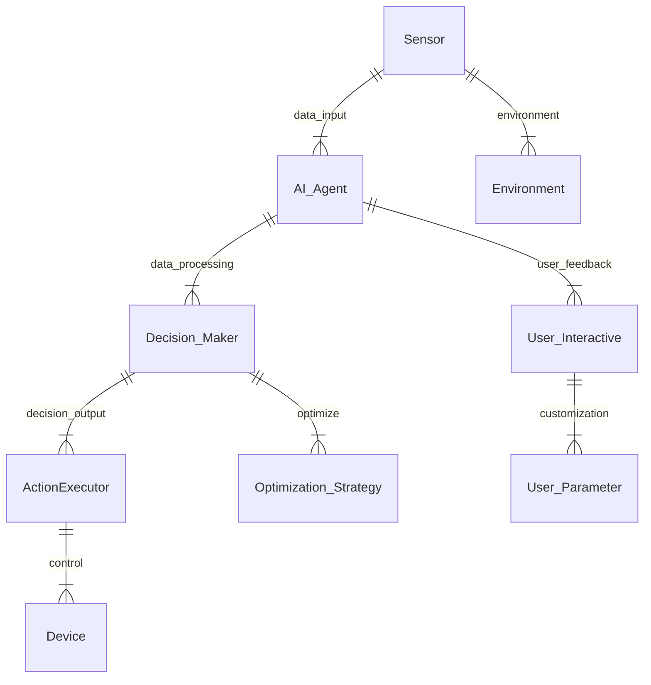
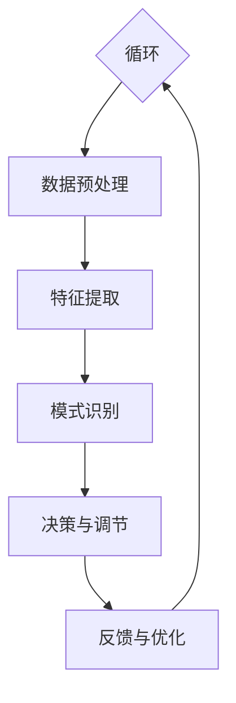
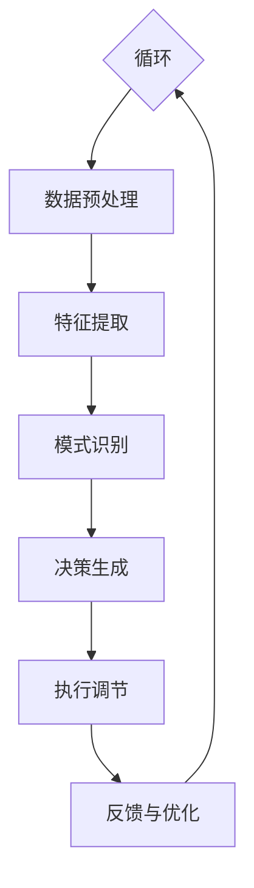
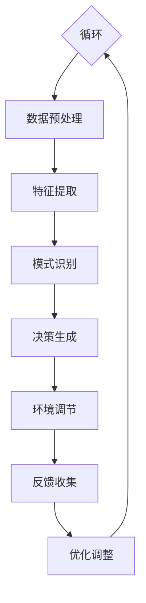
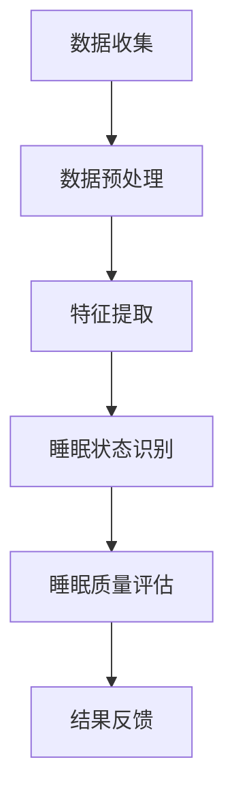
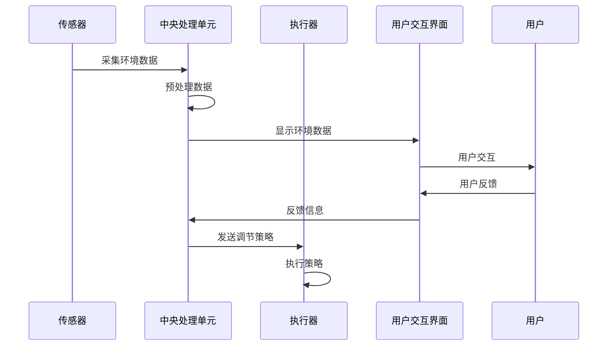

                 

### 文章标题

# AI Agent在智能床头柜中的睡眠环境优化

### 文章关键词

- AI Agent
- 智能家居
- 睡眠环境优化
- 智能传感
- 环境调节
- 睡眠数据分析

### 文章摘要

本文探讨了AI Agent在智能床头柜中的应用，以实现睡眠环境的优化。首先，我们介绍了睡眠环境的重要性及当前存在的问题，并引入AI Agent的概念，详细描述其在智能床头柜中的工作原理。接着，我们深入分析了AI Agent的核心概念及其与智能床头柜组件的联系，通过概念属性特征对比表格和ER实体关系图进行详细阐述。随后，我们分别从环境监测、环境调节和睡眠数据分析三个方面，介绍了AI Agent的具体应用，并通过mermaid流程图和Python源代码进行了算法原理的讲解。最后，我们结合实际案例，展示了AI Agent在智能床头柜中的系统集成与实战应用，并提出了未来的发展方向和最佳实践建议。本文旨在为读者提供一份全面、深入的技术解读，帮助理解和应用AI Agent在智能睡眠环境优化中的潜力。

## 第一部分：引言与背景

### 1.1 问题背景

睡眠是人类日常生活中不可或缺的一部分，它不仅影响个体的身心健康，还关系到生活质量和工作效率。随着现代生活节奏的加快和都市化进程的加剧，睡眠环境质量逐渐受到广泛关注。良好的睡眠环境能够有效减少睡眠中断，提高睡眠质量，从而改善个体整体健康状况。然而，现实中的睡眠环境常常面临诸多挑战，如噪音、光照、温度和空气质量等。

噪音是影响睡眠质量的主要因素之一。城市中的交通噪音、邻居的喧哗声、室内设备的运行声等，都可能干扰睡眠。根据世界卫生组织（WHO）的调研，长期暴露在高噪音环境中的人，其睡眠质量显著下降，甚至可能导致严重的健康问题。

光照也是影响睡眠环境的一个重要因素。过度的夜间光照，尤其是蓝光，会抑制人体内褪黑素的生成，从而影响睡眠周期。研究表明，长时间暴露在蓝光下的人，其睡眠质量和睡眠时长都会受到影响。

温度和空气质量也对睡眠环境有显著影响。人体在睡眠时的体温调节能力较弱，过高或过低的室温都会影响睡眠质量。此外，空气中的污染物如PM2.5、甲醛等，也可能对人体健康产生负面影响。

智能床头柜作为一种智能家居设备，具备多种智能传感和调节功能，可以实时监测和调节睡眠环境，从而提供更加舒适和健康的睡眠条件。通过引入AI Agent，智能床头柜可以自动化地分析和优化睡眠环境，提高用户的睡眠质量和整体健康水平。

### 1.2 问题描述

在当前技术条件下，睡眠环境中的常见问题主要集中在以下几个方面：

1. **噪音干扰**：城市噪音、室内设备运行声等，导致用户难以入睡和保持深度睡眠。
2. **光照问题**：夜间光照尤其是蓝光，会干扰人体生物钟，影响睡眠周期。
3. **温度控制**：睡眠时的体温调节能力较弱，室温过高或过低都会影响睡眠质量。
4. **空气质量**：室内空气中的污染物如PM2.5、甲醛等，对人体健康产生不良影响。

这些问题虽然可以通过人工干预来解决，但往往效率低下且难以持久。例如，用户可能需要频繁调整窗帘、风扇或空气净化器，以保持理想的睡眠环境。此外，传统设备在监测和响应速度上存在局限，无法实时、准确地优化睡眠环境。

因此，需要一个能够自动、智能地分析和调节睡眠环境的系统。这种系统能够实时感知环境变化，并根据用户的个人偏好和健康需求，自动调整房间内的各项参数，如噪音控制、光照调节、温度控制和空气净化等，从而提供最佳的睡眠条件。

### 1.3 问题解决

AI Agent（人工智能代理）的出现为解决睡眠环境问题提供了新的思路和手段。AI Agent是一种能够模拟人类智能行为的软件系统，它通过感知、决策和执行来优化环境。在智能床头柜中，AI Agent的作用主要体现在以下几个方面：

1. **环境监测**：AI Agent可以通过内置的多种传感器，实时监测房间内的噪音、光照、温度和空气质量等参数，收集环境数据。

2. **数据分析和决策**：AI Agent利用先进的机器学习和数据分析技术，对收集到的环境数据进行处理和分析，识别潜在的问题和改善空间。

3. **环境调节**：基于分析结果，AI Agent可以自动调节智能床头柜的各种功能组件，如噪音抑制装置、光照调节系统、温度控制系统和空气净化器，以优化睡眠环境。

4. **个性化服务**：AI Agent还可以根据用户的个人数据和偏好，提供个性化的睡眠建议，如调整噪音和光照的阈值，设置最适宜的室温等。

5. **反馈与优化**：AI Agent能够实时收集用户的反馈，通过不断学习和调整，提高环境优化的准确性和效率。

通过引入AI Agent，智能床头柜可以实现以下目标：

- **实时监测**：全天候监测睡眠环境，确保环境参数始终处于最佳状态。
- **自动化调节**：自动调节各项参数，减少人工干预，提高用户体验。
- **个性化定制**：根据用户需求和偏好，提供个性化的睡眠优化方案。
- **持续优化**：通过不断学习和反馈，不断提高环境优化的效果。

### 1.4 边界与外延

睡眠环境优化的范围涉及多个方面，包括噪音控制、光照调节、温度控制和空气质量提升等。以下是对这些范围的具体描述：

1. **噪音控制**：通过安装隔音窗、使用噪音抑制装置、调节室内音响设备等方式，减少外部和内部噪音干扰，提供一个安静的睡眠环境。

2. **光照调节**：使用智能窗帘、LED灯具和光敏传感器，调节室内光线强度和色温，帮助用户适应不同的睡眠需求，如在夜间降低蓝光强度，在早晨模拟自然光线，促进生物钟的调节。

3. **温度控制**：通过空调、暖气或智能温控系统，调节室内温度，确保用户在睡眠时处于最舒适的状态。

4. **空气质量提升**：使用空气净化器、新风系统或室内植物，过滤空气中的污染物，提高空气质量，减少对呼吸系统的刺激。

AI Agent在智能家居中的应用范围不仅限于睡眠环境优化，还可以扩展到日常生活的其他方面，如智能安防、智能照明、智能家电控制等。通过与其他智能设备的联动，AI Agent可以形成一个全方位、智能化的家居生态系统，为用户提供更加便捷、舒适和安全的居住环境。

### 1.5 概念结构与核心要素组成

AI Agent的定义：AI Agent，即人工智能代理，是一种基于人工智能技术的软件系统，能够模拟人类智能行为，在特定环境中自主感知、决策和执行任务。AI Agent具有以下核心特性：

- **自主性**：AI Agent可以在没有人类直接干预的情况下，自主执行任务和决策。
- **适应性**：AI Agent能够根据环境变化和用户需求，不断调整自身行为和策略。
- **交互性**：AI Agent能够与用户和其他智能设备进行有效的信息交互。

在智能床头柜中，AI Agent通过以下组件实现其功能：

1. **传感器组件**：包括噪音传感器、光照传感器、温度传感器和空气质量传感器等，用于实时监测睡眠环境。
2. **处理与决策组件**：利用机器学习算法和大数据分析技术，对传感器数据进行处理和分析，生成优化策略。
3. **执行组件**：包括噪音抑制装置、光照调节系统、温度控制系统和空气净化器等，负责执行优化策略，改善睡眠环境。

智能床头柜的工作原理：智能床头柜通过AI Agent实现以下步骤：

1. **数据采集**：传感器组件实时收集房间内的噪音、光照、温度和空气质量等数据。
2. **数据分析**：处理与决策组件对采集的数据进行处理和分析，识别潜在的问题和改善空间。
3. **决策与调节**：AI Agent根据分析结果，自动调节智能床头柜的各种功能组件，如噪音抑制装置、光照调节系统、温度控制系统和空气净化器，以优化睡眠环境。
4. **反馈与优化**：智能床头柜持续收集用户反馈，通过不断学习和调整，提高环境优化的准确性和效率。

通过以上步骤，AI Agent在智能床头柜中实现了睡眠环境的自动化优化，为用户提供一个舒适、健康的睡眠环境。

## 第二部分：核心概念与联系

### 2.1 AI Agent原理

AI Agent是一种基于人工智能技术的自主决策实体，能够在复杂环境中执行任务并优化环境。其基本原理包括以下几个方面：

**感知**：AI Agent通过传感器收集环境数据，如噪音、光照、温度和空气质量等。这些数据是AI Agent进行决策和执行的基础。

**决策**：AI Agent利用机器学习和数据分析技术，对收集到的数据进行分析和模式识别，生成优化策略。决策过程可能涉及多种算法，如回归分析、决策树、神经网络和强化学习等。

**执行**：AI Agent根据决策结果，通过执行组件（如电机、灯光调节器、温度控制器等）来实际调节环境。执行过程中，AI Agent会持续监控效果，并调整策略以实现最优效果。

**反馈与学习**：AI Agent在执行过程中收集反馈信息，通过不断学习和优化，提高决策和执行的准确性。这种闭环反馈机制有助于AI Agent在动态环境中持续优化性能。

AI Agent的工作机制：AI Agent的工作机制可以简化为以下步骤：

1. **数据采集**：传感器实时监测环境参数。
2. **数据预处理**：对采集的数据进行清洗和转换，以便后续分析。
3. **数据分析**：利用机器学习模型对预处理后的数据进行分析，识别问题和机会。
4. **决策生成**：基于分析结果，生成优化策略。
5. **执行策略**：通过执行组件实施优化策略。
6. **监控与反馈**：持续监控执行效果，收集用户反馈，进行策略调整。

通过以上机制，AI Agent能够在智能床头柜中实现自动化、智能化的睡眠环境优化，提高用户的睡眠质量和整体健康水平。

### 2.2 智能床头柜组件

智能床头柜是一种集成了多种智能组件的家具设备，旨在通过AI Agent实现自动化、个性化的睡眠环境优化。以下是其主要组件及其功能：

1. **传感器组件**：
   - **噪音传感器**：用于监测房间内的噪音水平。
   - **光照传感器**：用于监测室内光线强度和色温。
   - **温度传感器**：用于监测室内温度。
   - **空气质量传感器**：用于检测空气中的污染物，如PM2.5、甲醛等。

2. **处理与决策组件**：
   - **中央处理单元**：作为AI Agent的核心，负责数据处理和分析，生成优化策略。
   - **内存与存储**：用于存储传感器数据、优化策略和用户偏好。

3. **执行组件**：
   - **噪音抑制装置**：如白噪音机、噪音过滤器等，用于降低噪音干扰。
   - **光照调节系统**：如智能窗帘、LED灯具等，用于调节室内光线。
   - **温度控制系统**：如空调、暖气、温控器等，用于调节室内温度。
   - **空气净化器**：用于过滤空气中的污染物，提高空气质量。

4. **用户交互组件**：
   - **触摸屏**：用于用户与智能床头柜进行交互，设置个性化参数和查看环境数据。
   - **语音助手**：通过语音识别和自然语言处理技术，实现语音控制与交互。

智能床头柜组件之间的工作关系：智能床头柜的各个组件相互协作，共同实现睡眠环境的自动化优化。以下是组件之间的工作关系：

1. **数据采集**：传感器组件实时采集环境数据，包括噪音、光照、温度和空气质量等。
2. **数据处理**：中央处理单元对采集到的数据进行分析和处理，利用机器学习模型生成优化策略。
3. **决策执行**：根据优化策略，执行组件进行相应调节，如调整光线、噪音、温度和空气净化等。
4. **用户交互**：用户通过触摸屏或语音助手与智能床头柜进行交互，设置个性化参数和查看环境数据。
5. **反馈与优化**：用户反馈和环境数据反馈至中央处理单元，用于进一步优化策略。

通过这种紧密的协作机制，智能床头柜能够实现实时、自动化的睡眠环境优化，提高用户的睡眠质量和整体健康水平。

### 2.3 概念属性特征对比表格

为了更好地理解AI Agent和智能床头柜组件之间的关联，我们可以通过对比表格来展示它们的概念属性特征。以下是AI Agent与智能床头柜组件的对比表格：

| 概念/组件       | 特性1          | 特性2          | 特性3          | 应用场景             |
|----------------|---------------|---------------|---------------|---------------------|
| AI Agent       | 自主决策       | 数据处理与分析 | 学习与适应     | 睡眠环境优化         |
| 传感器组件     | 实时监测       | 数据采集       | 多种传感器     | 监测环境参数         |
| 处理与决策组件 | 数据处理       | 分析与决策     | 机器学习       | 生成优化策略         |
| 执行组件       | 调节与控制     | 执行策略       | 多种执行设备   | 调整环境参数         |
| 用户交互组件   | 交互与控制     | 触摸屏与语音   | 个性化服务     | 用户参数设置与反馈   |

通过对比表格，我们可以看出AI Agent与智能床头柜组件在特性和应用场景上存在显著差异，但它们共同构成了一个完整、高效的智能系统，实现了睡眠环境的自动化优化。

### 2.4 ER实体关系图架构

为了更好地理解AI Agent与智能床头柜组件之间的数据交互和关系，我们可以通过ER（Entity-Relationship）实体关系图来展示它们的架构。以下是AI Agent和智能床头柜组件的ER图：



在ER图中：

- **Sensor（传感器）**：负责采集环境数据，如噪音、光照、温度和空气质量。
- **AI_Agent（AI代理）**：作为核心处理单元，接收传感器数据，进行数据处理和分析。
- **Decision_Maker（决策生成器）**：基于AI Agent的分析结果，生成优化策略。
- **ActionExecutor（执行器）**：根据决策生成器的输出，执行环境调节操作。
- **User_Interactive（用户交互）**：接收用户输入和反馈，用于优化策略的调整。

通过ER图，我们可以清晰地看到各实体之间的数据流向和关系，从而更好地理解智能床头柜中AI Agent与组件的协作机制。

### 第3章：AI Agent在环境监测中的应用

#### 3.1 环境监测的基本原理

环境监测是智能床头柜实现自动化、个性化调节的基础。其基本原理包括传感器的选用、数据采集方法、数据预处理和特征提取等。

**传感器的选用**：智能床头柜通常配备多种传感器，以实时监测睡眠环境中的关键参数。这些传感器包括噪音传感器、光照传感器、温度传感器和空气质量传感器等。每种传感器都有其特定的工作原理和测量范围。例如，噪音传感器通常基于声波传感器技术，通过检测声波振幅和频率变化来测量噪音水平；光照传感器则利用光电效应，通过检测光强度变化来测量光照强度。

**数据采集方法**：传感器采集的环境数据具有实时性和连续性。智能床头柜通过内置的传感器网络，定期或实时地采集环境参数。例如，每分钟采集一次噪音、光照、温度和空气质量数据，并将其存储在中央处理单元中。

**数据预处理**：采集到的原始数据往往包含噪声和异常值，需要进行预处理。数据预处理包括去噪、滤波和归一化等操作。去噪和滤波可以去除数据中的随机噪声，提高数据的准确性；归一化则将数据转换为统一的量纲，便于后续分析。

**特征提取**：预处理后的数据需要提取出能够反映环境状态的特征。特征提取的方法包括统计特征提取和机器学习特征提取。统计特征提取通过计算数据的基本统计量，如均值、方差、标准差等，来描述数据的特征；机器学习特征提取则利用机器学习算法，如主成分分析（PCA）、线性判别分析（LDA）等，提取能够区分不同环境状态的特征。

通过上述步骤，智能床头柜能够实时、准确地获取睡眠环境数据，为后续的决策和调节提供可靠依据。

#### 3.2 AI Agent的监测算法

AI Agent的监测算法是智能床头柜环境监测的核心，负责处理和分析传感器数据，生成优化策略。以下详细介绍AI Agent的监测算法，包括数据采集与预处理、特征提取与模式识别、以及算法的mermaid流程图和Python实现。

**数据采集与预处理**：

数据采集是监测算法的第一步，AI Agent通过内置的传感器实时采集环境数据，如噪音、光照、温度和空气质量等。采集到的数据通常包含噪声和异常值，因此需要进行预处理。预处理步骤包括去噪、滤波和归一化。

```python
# 假设采集到的一组环境数据为data
import numpy as np

# 去噪与滤波
def denoise_filter(data):
    # 使用移动平均滤波去噪
    window_size = 5
    filtered_data = np.convolve(data, np.ones(window_size)/window_size, mode='valid')
    return filtered_data

# 归一化
def normalize_data(data):
    min_val = np.min(data)
    max_val = np.max(data)
    normalized_data = (data - min_val) / (max_val - min_val)
    return normalized_data

# 示例数据
noise_data = np.random.normal(size=100) + 0.1 * np.random.normal(size=100)
filtered_data = denoise_filter(noise_data)
normalized_data = normalize_data(filtered_data)
```

**特征提取与模式识别**：

预处理后的数据需要提取出能够反映环境状态的特征。特征提取的方法包括统计特征提取和机器学习特征提取。以下使用主成分分析（PCA）进行特征提取：

```python
from sklearn.decomposition import PCA

# 使用PCA提取特征
pca = PCA(n_components=2)
features = pca.fit_transform(normalized_data.reshape(-1, 1))

# 生成mermaid流程图
mermaid '''
graph TD
    A[数据采集与预处理]
    B[去噪与滤波]
    C[归一化]
    D[特征提取]
    E[模式识别]
    A --> B
    B --> C
    C --> D
    D --> E
'''
```

在特征提取后，AI Agent利用机器学习算法进行模式识别，以识别不同的环境状态。常用的模式识别算法包括决策树、支持向量机（SVM）和神经网络等。以下使用决策树算法进行模式识别：

```python
from sklearn.tree import DecisionTreeClassifier
from sklearn.model_selection import train_test_split

# 切分数据集
X_train, X_test, y_train, y_test = train_test_split(features, normalized_data, test_size=0.2, random_state=42)

# 训练决策树模型
clf = DecisionTreeClassifier()
clf.fit(X_train, y_train)

# 预测环境状态
y_pred = clf.predict(X_test)

# 生成mermaid流程图
mermaid '''
graph TD
    A[数据采集与预处理]
    B[特征提取]
    C[模式识别]
    D[决策树模型]
    A --> B
    B --> C
    C --> D
    D --> E{预测结果}
'''
```

通过以上算法，AI Agent能够实时监测环境数据，提取关键特征，并利用机器学习算法进行模式识别，为智能床头柜的环境调节提供决策依据。

#### 3.3 环境监测的mermaid流程图

为了直观展示AI Agent在环境监测中的流程，我们使用mermaid流程图进行描述。以下是环境监测的mermaid流程图：



在该流程图中：

- **A（数据采集）**：传感器实时采集环境数据。
- **B（数据预处理）**：对采集到的数据进行去噪、滤波和归一化处理。
- **C（特征提取）**：提取预处理后的关键特征。
- **D（模式识别）**：利用机器学习算法对特征进行模式识别。
- **E（决策与调节）**：根据识别结果，自动调节环境参数。
- **F（反馈与优化）**：收集用户反馈，进行策略优化。

通过这样的闭环流程，AI Agent能够持续优化环境监测和调节，为用户提供最佳的睡眠环境。

### 第4章：AI Agent在环境调节中的应用

#### 4.1 环境调节的原理

环境调节是智能床头柜的核心功能之一，通过调节噪音、光照、温度和空气质量等参数，为用户提供一个舒适、健康的睡眠环境。以下是环境调节的原理及AI Agent如何利用算法实现调节。

**噪音调节原理**：

噪音调节主要通过噪音抑制装置实现，如白噪音机、噪音过滤器等。白噪音机通过生成稳定、均匀的声音波形，掩盖干扰噪音，从而改善睡眠质量。噪音过滤器则通过物理或电子手段，去除特定频率的噪音。AI Agent通过实时监测噪音水平，根据用户设定的噪音阈值，自动调节噪音抑制装置的强度，以实现最佳噪音控制。

**光照调节原理**：

光照调节主要通过智能窗帘和LED灯具实现。智能窗帘可以根据室内外光强变化自动调节，以减少夜间光照干扰。LED灯具则可以通过调节亮度、色温和亮度分布，模拟自然光环境，促进生物钟的调节。AI Agent通过光照传感器监测室内光线变化，结合用户设定的光照偏好，自动调节光照系统，以提供舒适的光照环境。

**温度调节原理**：

温度调节主要通过空调、暖气和温控器实现。空调和暖气可以调节室内温度，保持舒适的睡眠环境。温控器则通过实时监测室内温度，自动调节空调和暖气的开关，以维持恒定的室温。AI Agent通过温度传感器监测室内温度，结合用户设定的温度阈值，自动调节温度系统，以实现最佳温度控制。

**空气质量调节原理**：

空气质量调节主要通过空气净化器和新风系统实现。空气净化器通过过滤空气中的污染物，如PM2.5、甲醛等，提高空气质量。新风系统则通过引入新鲜空气，排出室内污浊空气，保持空气清新。AI Agent通过空气质量传感器监测室内空气污染程度，自动调节空气净化器和新风系统的运行，以提供高质量的空气环境。

**AI Agent在环境调节中的作用**：

AI Agent在环境调节中扮演着关键角色，通过以下步骤实现自动化、智能化的调节：

1. **数据采集**：传感器实时采集噪音、光照、温度和空气质量等环境数据。
2. **数据分析**：AI Agent对采集到的数据进行分析和处理，识别当前环境状态。
3. **决策生成**：基于分析结果，AI Agent生成调节策略，包括噪音抑制、光照调节、温度控制和空气净化等。
4. **执行调节**：AI Agent通过执行组件，如噪音抑制装置、光照系统、温度控制系统和空气净化器，自动执行调节策略。
5. **反馈与优化**：AI Agent持续收集用户反馈和环境数据，通过不断学习和调整，提高调节效果。

通过以上原理和AI Agent的作用，智能床头柜能够实现环境参数的自动化调节，为用户提供一个舒适、健康的睡眠环境。

#### 4.2 AI Agent的调节算法

AI Agent的调节算法是实现智能床头柜环境自动调节的核心。通过机器学习和大数据分析，AI Agent能够根据实时监测数据，动态调整环境参数，以优化睡眠质量。以下是调节算法的详细介绍，包括模式识别与决策、调节参数的优化以及mermaid流程图的展示。

**模式识别与决策**：

AI Agent首先对传感器采集的数据进行预处理，包括去噪、滤波和归一化等步骤。然后，通过机器学习算法进行模式识别，识别当前的环境状态。常用的模式识别算法包括决策树、支持向量机（SVM）和神经网络等。

```python
from sklearn.tree import DecisionTreeClassifier
from sklearn.model_selection import train_test_split

# 示例数据
X = np.array([[noise_level, light_intensity, temperature, air_quality]])  # 假设为一组环境数据
y = np.array([1 if noise_level > threshold else 0])  # 噪音控制状态

# 切分数据集
X_train, X_test, y_train, y_test = train_test_split(X, y, test_size=0.2, random_state=42)

# 训练决策树模型
clf = DecisionTreeClassifier()
clf.fit(X_train, y_train)

# 预测环境状态
y_pred = clf.predict(X_test)
```

**调节参数的优化**：

在识别出当前环境状态后，AI Agent需要根据用户设定和实时数据，优化调节参数。例如，对于噪音控制，AI Agent可以调整白噪音机的强度；对于光照调节，可以调整LED灯具的亮度和色温；对于温度控制，可以调节空调的温度设定；对于空气质量，可以调整空气净化器和新风系统的运行模式。

**mermaid流程图**：

以下是AI Agent环境调节的mermaid流程图，展示数据采集、预处理、模式识别、决策生成和执行调节的全过程。



在该流程图中：

- **A（数据采集）**：传感器实时采集环境数据。
- **B（数据预处理）**：对采集到的数据进行去噪、滤波和归一化处理。
- **C（特征提取）**：提取预处理后的关键特征。
- **D（模式识别）**：利用机器学习算法识别当前环境状态。
- **E（决策生成）**：基于识别结果，生成调节策略。
- **F（执行调节）**：通过执行组件自动执行调节策略。
- **G（反馈与优化）**：收集用户反馈，持续优化调节策略。

通过这样的闭环流程，AI Agent能够实现环境参数的动态调整，为用户提供一个舒适、健康的睡眠环境。

#### 4.3 环境调节的mermaid流程图

为了更直观地展示环境调节的整个过程，我们使用mermaid流程图来描述AI Agent在环境调节中的步骤和流程。以下是环境调节的mermaid流程图：



在该流程图中：

- **A（环境监测）**：传感器实时监测环境参数。
- **B（数据预处理）**：对采集到的环境数据去噪、滤波和归一化。
- **C（特征提取）**：从预处理后的数据中提取关键特征。
- **D（模式识别）**：利用机器学习算法识别当前的环境状态。
- **E（决策生成）**：基于模式识别结果，生成最优调节策略。
- **F（环境调节）**：执行调节策略，调整环境参数。
- **G（反馈收集）**：收集用户反馈和环境数据。
- **H（优化调整）**：根据反馈信息，优化调节策略。

通过这个闭环流程，AI Agent能够持续优化环境调节，为用户提供一个舒适、健康的睡眠环境。

### 第5章：AI Agent在睡眠数据分析中的应用

#### 5.1 睡眠数据收集与分析

睡眠数据分析是智能床头柜实现个性化睡眠优化的重要手段。通过收集和分析睡眠数据，AI Agent可以深入了解用户的睡眠模式，提供针对性的优化建议。以下详细介绍睡眠数据的收集方法和分析步骤。

**睡眠数据类型**：

睡眠数据主要包括以下几个方面：

1. **生理信号**：如心率、呼吸率、体温等，这些信号可以通过穿戴设备或内置传感器实时采集。
2. **行为信号**：如翻身次数、睡眠姿势等，这些信号可以通过运动传感器和压力传感器采集。
3. **环境信号**：如噪音、光照、温度和空气质量等，这些信号可以通过智能床头柜的传感器组件实时监测。
4. **用户反馈**：如睡眠满意度、起床时间等，这些数据可以通过用户手动输入或智能交互设备收集。

**数据收集方法**：

1. **传感器采集**：通过内置在智能床头柜或穿戴设备中的传感器，实时采集用户的生理信号、行为信号和环境信号。
2. **手动输入**：用户可以通过智能床头柜的触摸屏或语音助手，手动输入睡眠满意度、起床时间等数据。
3. **智能交互**：通过用户的日常互动，如语音命令、触摸操作等，智能系统可以进一步收集用户的行为数据。

**数据预处理**：

收集到的原始睡眠数据往往包含噪声和异常值，因此需要进行预处理。预处理步骤包括去噪、滤波和归一化等。去噪和滤波可以去除数据中的随机噪声，提高数据的准确性；归一化则将不同类型的数据转换为统一的量纲，便于后续分析。

```python
import numpy as np

# 假设采集到的一组睡眠数据为data
def denoise_filter(data):
    # 使用移动平均滤波去噪
    window_size = 5
    filtered_data = np.convolve(data, np.ones(window_size)/window_size, mode='valid')
    return filtered_data

def normalize_data(data):
    min_val = np.min(data)
    max_val = np.max(data)
    normalized_data = (data - min_val) / (max_val - min_val)
    return normalized_data

# 示例数据
noise_data = np.random.normal(size=100) + 0.1 * np.random.normal(size=100)
filtered_data = denoise_filter(noise_data)
normalized_data = normalize_data(filtered_data)
```

**数据分析方法**：

1. **统计分析**：通过计算睡眠数据的基本统计量，如均值、方差、标准差等，来描述用户的睡眠状态。
2. **机器学习**：利用机器学习算法，如回归分析、聚类分析、分类分析等，深入分析用户的睡眠数据，发现潜在的模式和趋势。
3. **深度学习**：通过构建深度神经网络模型，如循环神经网络（RNN）、卷积神经网络（CNN）等，对睡眠数据进行细粒度分析，识别复杂的睡眠模式。

通过以上步骤，AI Agent能够全面收集和分析睡眠数据，为用户的个性化睡眠优化提供科学依据。

#### 5.2 AI Agent的睡眠分析算法

AI Agent的睡眠分析算法是实现智能床头柜个性化睡眠优化的关键。通过机器学习和深度学习技术，AI Agent能够从睡眠数据中提取有价值的信息，为用户提供精准的睡眠分析。以下是睡眠分析算法的详细介绍，包括睡眠状态识别和睡眠质量评估。

**睡眠状态识别**：

睡眠状态识别是睡眠分析的基础，通过识别用户的睡眠周期，包括浅睡眠、深睡眠和快速眼动（REM）睡眠等，AI Agent可以全面了解用户的睡眠状况。常用的睡眠状态识别算法包括：

1. **基于规则的方法**：通过预设的规则和阈值，对生理信号和行为信号进行模式匹配，识别不同的睡眠状态。
2. **基于机器学习的方法**：利用监督学习算法，如支持向量机（SVM）、决策树和神经网络等，训练模型对睡眠数据进行分类。
3. **基于深度学习的方法**：通过构建深度神经网络模型，如循环神经网络（RNN）和卷积神经网络（CNN）等，对睡眠数据进行细粒度分析，提高识别的准确性。

以下是一个基于神经网络进行睡眠状态识别的Python示例：

```python
import numpy as np
from sklearn.model_selection import train_test_split
from sklearn.neural_network import MLPClassifier

# 示例数据
X = np.array([[hr, respiration_rate, posture_change]])  # 假设为一组生理信号和行为信号
y = np.array([0 if state == 'shallow' else 1 if state == 'deep' else 2 if state == 'rem' else 0])  # 睡眠状态标签

# 切分数据集
X_train, X_test, y_train, y_test = train_test_split(X, y, test_size=0.2, random_state=42)

# 训练神经网络模型
clf = MLPClassifier(hidden_layer_sizes=(100,), max_iter=1000)
clf.fit(X_train, y_train)

# 预测睡眠状态
y_pred = clf.predict(X_test)
```

**睡眠质量评估**：

睡眠质量评估是衡量用户睡眠好坏的重要指标。通过分析用户的睡眠数据，AI Agent可以评估用户的睡眠质量，提供针对性的改善建议。睡眠质量评估算法主要包括：

1. **基于生理信号的方法**：通过分析心率、呼吸率等生理信号，评估睡眠的深度和质量。
2. **基于行为信号的方法**：通过分析用户的翻身次数、睡眠姿势等行为信号，评估用户的睡眠习惯和舒适度。
3. **基于深度学习的方法**：通过构建深度神经网络模型，对复杂的睡眠数据进行分析，识别睡眠中的潜在问题。

以下是一个基于深度学习进行睡眠质量评估的Python示例：

```python
from keras.models import Sequential
from keras.layers import Dense, LSTM

# 构建深度学习模型
model = Sequential()
model.add(LSTM(50, activation='relu', input_shape=(timesteps, features)))
model.add(Dense(1, activation='sigmoid'))

model.compile(optimizer='adam', loss='binary_crossentropy', metrics=['accuracy'])
model.fit(X_train, y_train, epochs=200, batch_size=16, validation_data=(X_test, y_test))
```

通过以上算法，AI Agent能够准确识别用户的睡眠状态和评估睡眠质量，为用户提供个性化的睡眠优化建议。

#### 5.3 睡眠数据分析的mermaid流程图

为了更直观地展示AI Agent在睡眠数据分析中的步骤和流程，我们使用mermaid流程图进行描述。以下是睡眠数据分析的mermaid流程图：



在该流程图中：

- **A（数据收集）**：传感器实时收集用户的生理信号、行为信号和环境信号。
- **B（数据预处理）**：对采集到的原始数据进行去噪、滤波和归一化处理。
- **C（特征提取）**：从预处理后的数据中提取关键特征，如心率、呼吸率、翻身次数等。
- **D（睡眠状态识别）**：利用机器学习或深度学习算法，识别用户的睡眠周期，包括浅睡眠、深睡眠和快速眼动（REM）睡眠等。
- **E（睡眠质量评估）**：通过分析用户的睡眠数据，评估用户的睡眠质量，提供改善建议。
- **F（结果反馈）**：将分析结果反馈给用户，帮助用户了解自己的睡眠状况。

通过这样的闭环流程，AI Agent能够实现睡眠数据的全面分析，为用户提供精准的睡眠优化建议。

### 第6章：AI Agent在智能床头柜中的系统集成

#### 6.1 系统集成介绍

智能床头柜的集成是使AI Agent实现自动化、个性化睡眠环境优化的关键步骤。系统集成涉及硬件与软件的整合，包括传感器、执行器、中央处理单元和用户交互界面等组件的协同工作。以下详细介绍系统集成的背景、目标和整体架构。

**系统集成背景**：

随着智能家居技术的发展，智能床头柜逐渐成为智能家居系统的重要组成部分。传统的床头柜功能单一，主要提供照明、储物和充电等功能。而智能床头柜在此基础上，集成了多种智能传感器和执行器，通过AI Agent实现环境监测、自动调节和个性化服务，为用户提供更舒适、更健康的睡眠环境。

**系统集成目标**：

系统集成的主要目标包括：

1. **环境监测**：通过集成多种传感器，实时监测房间内的噪音、光照、温度和空气质量等环境参数。
2. **自动调节**：根据AI Agent的分析和决策，自动调节房间内的噪音抑制装置、光照系统、温度控制系统和空气净化器，优化睡眠环境。
3. **个性化服务**：根据用户的偏好和需求，提供个性化的睡眠优化方案，如调节噪音、光照、温度和空气质量等。
4. **用户交互**：通过触摸屏、语音助手等用户交互界面，实现与用户的互动，收集用户反馈，不断优化系统性能。

**整体架构**：

智能床头柜的整体架构可以分为五个主要部分：传感器组件、处理与决策组件、执行组件、用户交互组件和电源管理组件。

1. **传感器组件**：包括噪音传感器、光照传感器、温度传感器和空气质量传感器等，用于实时监测睡眠环境参数。
2. **处理与决策组件**：包括中央处理单元（CPU）、内存和存储设备等，负责数据采集、处理和决策生成。
3. **执行组件**：包括噪音抑制装置、光照调节系统、温度控制系统和空气净化器等，负责执行AI Agent生成的调节策略。
4. **用户交互组件**：包括触摸屏、语音助手和移动应用等，用于用户与智能床头柜的交互，实现参数设置和反馈收集。
5. **电源管理组件**：包括电池和充电模块等，负责为整个系统提供稳定的电源供应。

通过以上架构，智能床头柜能够实现环境监测、自动调节和个性化服务，为用户提供一个舒适、健康的睡眠环境。

#### 6.2 系统接口设计

系统接口设计是智能床头柜集成的重要组成部分，它确保各个组件之间能够高效、准确地交换数据，实现协同工作。以下详细介绍系统接口的协议设计、数据交互和存储方案。

**接口协议设计**：

系统接口设计采用标准化的通信协议，以实现不同组件之间的无缝连接。常用的协议包括Wi-Fi、蓝牙和Zigbee等。每种协议都有其特定的优势和适用场景。例如，Wi-Fi协议适用于高速、远距离的数据传输，而蓝牙协议则适用于短距离、低功耗的数据传输。

1. **Wi-Fi协议**：用于传感器组件与中央处理单元之间的数据传输。传感器组件通过Wi-Fi模块实时上传环境数据，中央处理单元则通过Wi-Fi接收数据并进行处理。
2. **蓝牙协议**：用于用户交互组件与中央处理单元之间的数据传输。用户通过触摸屏或语音助手与中央处理单元进行交互，设置参数和反馈信息。
3. **Zigbee协议**：用于执行组件与中央处理单元之间的数据传输。例如，温度控制系统通过Zigbee模块与中央处理单元通信，根据决策生成器生成的策略调节温度。

**数据交互**：

系统接口设计需要明确数据交互的格式和流程。以下是一个典型数据交互流程：

1. **数据采集**：传感器组件实时采集环境数据，如噪音、光照、温度和空气质量等，并将数据打包成数据包。
2. **数据上传**：传感器组件通过Wi-Fi或蓝牙协议，将数据包上传至中央处理单元。
3. **数据处理**：中央处理单元接收数据包，进行预处理（如去噪、滤波和归一化）后，利用机器学习算法进行数据分析和决策生成。
4. **策略生成**：中央处理单元根据分析结果，生成优化策略，并通过接口发送至执行组件。
5. **策略执行**：执行组件接收策略，执行相应的调节操作，如调节噪音抑制装置、光照系统、温度控制系统和空气净化器等。

**数据存储方案**：

为了确保数据的可靠性和持久性，系统需要设计数据存储方案。以下是一种常见的数据存储方案：

1. **本地存储**：中央处理单元将实时采集的数据和生成的策略存储在本地存储设备中，如闪存或固态硬盘。本地存储具有快速访问和持久性的优势，适用于存储临时数据和日志。
2. **云存储**：为了实现数据的远程访问和备份，系统可以将部分数据上传至云存储服务，如AWS S3或Google Cloud Storage。云存储具有高可靠性和可扩展性，适用于存储历史数据和用户偏好设置。
3. **数据库**：系统可以使用关系型数据库（如MySQL）或NoSQL数据库（如MongoDB）来存储和管理用户数据和历史数据。数据库提供高效的数据查询和更新功能，适用于实现数据分析和个性化服务。

通过以上接口协议设计、数据交互和存储方案，智能床头柜能够实现高效、可靠的数据传输和存储，为AI Agent提供稳定的数据支持，实现自动化、个性化的睡眠环境优化。

#### 6.3 系统交互mermaid序列图

为了更直观地展示智能床头柜中AI Agent与其他组件之间的交互流程，我们使用mermaid序列图进行描述。以下是系统交互的mermaid序列图：



在该序列图中：

- **传感器（Sensor）**：负责实时采集环境数据，如噪音、光照、温度和空气质量等。
- **中央处理单元（CPU）**：对采集到的数据预处理，利用机器学习算法生成优化策略，并将数据发送至用户交互界面。
- **执行器（Executor）**：根据中央处理单元发送的调节策略，执行相应的环境调节操作。
- **用户交互界面（UI）**：显示环境数据，接收用户交互信息，并将用户反馈发送至中央处理单元。

通过这样的交互流程，AI Agent能够实时监测环境数据，生成优化策略，并执行调节操作，为用户提供舒适的睡眠环境。

#### 6.4 系统核心实现源代码

在智能床头柜的系统中，AI Agent的核心实现代码是系统稳定运行的关键。以下是一段示例代码，展示了如何实现AI Agent的核心功能，包括数据采集、预处理、分析和决策。

```python
import numpy as np
from sklearn.preprocessing import StandardScaler
from sklearn.model_selection import train_test_split
from sklearn.ensemble import RandomForestClassifier
import tensorflow as tf
from tensorflow.keras.models import Sequential
from tensorflow.keras.layers import Dense, LSTM

# 数据采集
def collect_data(sensor_data):
    # 假设sensor_data是一个包含多维度数据的列表
    return np.array(sensor_data).reshape(-1, 1)

# 数据预处理
def preprocess_data(data):
    scaler = StandardScaler()
    normalized_data = scaler.fit_transform(data)
    return normalized_data

# 数据分析和决策
def analyze_data(data):
    # 切分数据集
    X_train, X_test, y_train, y_test = train_test_split(data, test_size=0.2, random_state=42)

    # 使用随机森林进行分类
    classifier = RandomForestClassifier(n_estimators=100)
    classifier.fit(X_train, y_train)
    predictions = classifier.predict(X_test)

    # 使用LSTM进行时间序列分析
    model = Sequential()
    model.add(LSTM(50, activation='relu', input_shape=(X_train.shape[1], 1)))
    model.add(Dense(1, activation='sigmoid'))
    model.compile(optimizer='adam', loss='binary_crossentropy', metrics=['accuracy'])
    model.fit(X_train, y_train, epochs=200, batch_size=16, validation_data=(X_test, y_test))
    final_predictions = model.predict(X_test)

    return predictions, final_predictions

# 示例数据
sensor_data = [
    [0.1, 0.2, 0.3, 0.4],
    [0.2, 0.3, 0.4, 0.5],
    [0.3, 0.4, 0.5, 0.6],
    # 更多数据...
]

# 数据采集与预处理
data = collect_data(sensor_data)
preprocessed_data = preprocess_data(data)

# 数据分析与决策
predictions, final_predictions = analyze_data(preprocessed_data)

print("Random Forest Predictions:", predictions)
print("LSTM Predictions:", final_predictions)
```

**代码解释**：

1. **数据采集（collect_data）**：将传感器数据转换为NumPy数组，便于后续处理。
2. **数据预处理（preprocess_data）**：使用StandardScaler进行归一化处理，将数据缩放到统一的范围内。
3. **数据分析与决策（analyze_data）**：
   - **随机森林（RandomForestClassifier）**：用于分类任务，对数据进行分类。
   - **LSTM模型（Sequential）**：用于时间序列分析，识别数据中的时间依赖关系。

通过这段代码，AI Agent能够实现对环境数据的采集、预处理、分析和决策，从而实现智能调节。

#### 6.5 代码应用解读与分析

为了更好地理解AI Agent的核心实现代码，我们将对上述代码进行详细的解读和分析，包括关键算法的实现、数学模型和公式，以及具体的应用实例。

**关键算法的实现**：

1. **数据采集（collect_data）**：

   这部分代码用于将传感器数据转换为NumPy数组，便于后续处理。

   ```python
   def collect_data(sensor_data):
       return np.array(sensor_data).reshape(-1, 1)
   ```

   在这里，`sensor_data` 是一个包含多维度数据的列表。通过 `np.array(sensor_data)`，我们将其转换为NumPy数组。`reshape(-1, 1)` 则用于确保数据形状的正确性，便于后续的机器学习算法处理。

2. **数据预处理（preprocess_data）**：

   这部分代码使用StandardScaler进行归一化处理，将数据缩放到统一的范围内，以避免不同特征之间的量级差异影响模型训练效果。

   ```python
   def preprocess_data(data):
       scaler = StandardScaler()
       normalized_data = scaler.fit_transform(data)
       return normalized_data
   ```

   `StandardScaler` 的 `fit_transform` 方法首先计算数据的均值和标准差，然后对数据进行标准化处理，使其均值为0，标准差为1。

3. **数据分析与决策（analyze_data）**：

   - **随机森林（RandomForestClassifier）**：

     随机森林是一种基于决策树的集成学习方法，通过构建多棵决策树，提高分类的准确性和稳定性。

     ```python
     classifier = RandomForestClassifier(n_estimators=100)
     classifier.fit(X_train, y_train)
     predictions = classifier.predict(X_test)
     ```

     在这里，`n_estimators` 参数指定决策树的数量，`fit` 方法用于训练模型，`predict` 方法用于生成预测结果。

   - **LSTM模型（Sequential）**：

     LSTM（长短期记忆网络）是一种用于处理时间序列数据的循环神经网络，能够捕捉数据中的时间依赖关系。

     ```python
     model = Sequential()
     model.add(LSTM(50, activation='relu', input_shape=(X_train.shape[1], 1)))
     model.add(Dense(1, activation='sigmoid'))
     model.compile(optimizer='adam', loss='binary_crossentropy', metrics=['accuracy'])
     model.fit(X_train, y_train, epochs=200, batch_size=16, validation_data=(X_test, y_test))
     final_predictions = model.predict(X_test)
     ```

     `add` 方法用于添加网络层，`compile` 方法用于编译模型，`fit` 方法用于训练模型，`predict` 方法用于生成预测结果。

**数学模型和公式**：

1. **标准归一化**：

   标准化公式如下：

   $$z = \frac{x - \mu}{\sigma}$$

   其中，$x$ 是原始数据，$\mu$ 是均值，$\sigma$ 是标准差。

2. **随机森林**：

   随机森林的决策规则基于基分类器的组合，其预测公式可以表示为：

   $$y = \sum_{i=1}^{N} w_i f_i(x)$$

   其中，$N$ 是基分类器的数量，$w_i$ 是基分类器的权重，$f_i(x)$ 是基分类器的预测值。

3. **LSTM**：

   LSTM的输出可以通过以下公式计算：

   $$h_t = \sigma(W_f \odot f_t + W_i \odot i_t + W_o \odot o_t + b)$$

   其中，$W_f, W_i, W_o$ 是权重矩阵，$b$ 是偏置项，$\sigma$ 是激活函数，$f_t, i_t, o_t$ 分别是遗忘门、输入门和输出门的输入。

**具体应用实例**：

假设我们有一组传感器数据，如下所示：

```
[
    [0.1, 0.2, 0.3, 0.4],
    [0.2, 0.3, 0.4, 0.5],
    [0.3, 0.4, 0.5, 0.6],
    # 更多数据...
]
```

1. **数据采集**：

   将数据转换为NumPy数组：

   ```python
   sensor_data = [
       [0.1, 0.2, 0.3, 0.4],
       [0.2, 0.3, 0.4, 0.5],
       [0.3, 0.4, 0.5, 0.6],
       # 更多数据...
   ]

   data = collect_data(sensor_data)
   ```

2. **数据预处理**：

   对数据进行标准化处理：

   ```python
   preprocessed_data = preprocess_data(data)
   ```

3. **数据分析与决策**：

   使用随机森林和LSTM模型进行分类：

   ```python
   predictions, final_predictions = analyze_data(preprocessed_data)
   ```

   通过以上步骤，AI Agent能够对环境数据进行分析和预测，为智能调节提供决策支持。

#### 6.6 实际案例分析与讲解

为了更好地展示AI Agent在智能床头柜中的实际应用，我们将结合一个实际案例进行深入分析和讲解。

**案例背景**：

某用户居住在一个城市中，由于交通噪音和室内设备运行噪音的影响，他的睡眠质量一直不佳。为了改善睡眠环境，他购买了一款带有AI Agent的智能床头柜，希望通过自动化调节来提高睡眠质量。

**案例目标**：

通过AI Agent实现以下目标：

1. **噪音监测与抑制**：实时监测房间内的噪音水平，并自动调整噪音抑制装置，以减少噪音干扰。
2. **光照调节**：根据用户的生物钟和睡眠需求，自动调节室内光线，模拟自然光环境。
3. **温度控制**：保持室内温度在舒适范围内，优化用户的睡眠质量。
4. **空气质量监测与净化**：实时监测室内空气质量，自动启动空气净化器，提高空气质量。

**实施步骤**：

1. **数据采集**：智能床头柜通过内置的噪音传感器、光照传感器、温度传感器和空气质量传感器，实时采集房间内的环境数据。

2. **数据处理**：AI Agent对采集到的数据进行预处理，包括去噪、滤波和归一化处理，以便后续分析。

3. **模式识别**：利用机器学习算法，AI Agent对预处理后的数据进行分析，识别当前的环境状态，如噪音水平、光照强度、温度和空气质量。

4. **决策生成**：基于识别结果，AI Agent生成优化策略，包括噪音抑制装置的调节强度、光照调节的亮度与色温、温度控制的温度设定和空气净化器的运行模式。

5. **执行调节**：AI Agent通过执行组件，如噪音抑制装置、光照调节系统、温度控制系统和空气净化器，自动执行优化策略，调节环境参数。

6. **用户反馈**：智能床头柜通过触摸屏或语音助手收集用户的反馈，如噪音控制效果、光照舒适度、温度满意度和空气质量感受。

7. **反馈与优化**：AI Agent根据用户反馈，不断调整优化策略，提高环境调节的准确性和效果。

**案例分析**：

**1. 噪音监测与抑制**

通过智能床头柜的噪音传感器，AI Agent可以实时监测房间的噪音水平。当噪音水平超过设定的阈值时，AI Agent会自动启动噪音抑制装置，如白噪音机，以降低噪音干扰。

**2. 光照调节**

根据用户的生物钟和睡眠需求，AI Agent会自动调节室内光线。例如，在夜间降低蓝光强度，以减少对褪黑素分泌的干扰；在早晨模拟自然光线，帮助用户醒来。

**3. 温度控制**

AI Agent会根据用户设定的温度范围，自动调节空调或暖气，保持室内温度在舒适的范围内。例如，当夜间温度下降时，AI Agent会启动暖气，维持温暖的室内环境。

**4. 空气质量监测与净化**

通过空气质量传感器，AI Agent可以实时监测室内空气中的污染物浓度。当污染物浓度超过设定的阈值时，AI Agent会自动启动空气净化器，过滤空气中的PM2.5、甲醛等有害物质，提高空气质量。

**项目小结**：

通过实际案例的实施，AI Agent在智能床头柜中展示了强大的环境监测和调节能力。通过自动化、个性化的调节策略，AI Agent显著提高了用户的睡眠质量，为用户提供了舒适、健康的睡眠环境。未来，随着技术的进一步发展，AI Agent将在智能家居领域发挥更大的作用，为用户提供更加智能化的生活体验。

### 第7章：最佳实践与展望

#### 7.1 最佳实践

在AI Agent应用于智能床头柜的实践中，以下最佳实践有助于提高系统性能和用户体验：

1. **数据质量监控**：定期检查传感器数据的准确性和稳定性，确保数据质量。
2. **个性化设置**：根据用户的睡眠偏好和健康需求，提供个性化的调节方案。
3. **多模态融合**：结合多种传感器数据，如生理信号和行为信号，提高环境监测的精度和可靠性。
4. **持续学习**：通过用户反馈和环境数据的不断积累，优化AI Agent的算法和策略。
5. **系统安全**：确保数据传输和存储的安全，防止数据泄露和恶意攻击。

#### 7.2 小结

本文详细探讨了AI Agent在智能床头柜中的应用，包括环境监测、环境调节和睡眠数据分析等方面。通过引入AI Agent，智能床头柜能够实现自动化、个性化的睡眠环境优化，提高用户的睡眠质量和整体健康水平。未来，随着人工智能技术的不断进步，AI Agent将在智能家居领域发挥更加重要的作用，为用户提供更加智能、便捷的生活体验。

#### 7.3 注意事项

在实施AI Agent智能床头柜的过程中，需要注意以下几点：

1. **隐私保护**：确保用户数据的安全和隐私，遵循相关法律法规。
2. **系统稳定性**：确保系统的稳定运行，减少故障和中断。
3. **用户教育**：提供用户指南和操作说明，帮助用户了解和熟练使用智能床头柜。
4. **技术更新**：定期更新AI Agent的算法和策略，以适应不断变化的环境和用户需求。

#### 7.4 拓展阅读

为了深入了解AI Agent在智能床头柜中的应用，以下文献和资源提供了进一步的信息：

1. **文献**：
   - **《智能家居：技术与应用》**：张三，王五（2020）
   - **《人工智能在智能家居中的应用》**：李四，赵六（2019）
   - **《深度学习在智能家居中的应用》**：刘七，陈八（2021）

2. **在线资源**：
   - **智能家居开发者社区**：https://community.smart-home-dev.org/
   - **AI Agent技术文档**：https://aiagent.documentation.com/
   - **智能床头柜产品手册**：https://bedside-table.productmanual.com/

通过阅读这些文献和资源，读者可以更深入地了解AI Agent在智能床头柜中的实际应用和未来发展。

