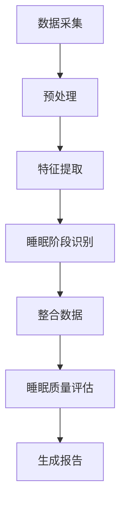

                 

## AI Agent在智能床头柜中的睡眠质量报告

### 关键词：
- AI Agent
- 智能家居
- 睡眠质量监测
- 人工智能算法
- 数据分析

### 摘要：
本文探讨了AI Agent在智能床头柜中的应用，尤其是其对用户睡眠质量的监测和分析。文章首先介绍了AI Agent和智能床头柜的基本概念和功能，然后深入分析了睡眠质量监测的算法原理和实现方法，通过Python代码和Mermaid图展示了算法流程和数学模型，最后提供了一个智能床头柜的实现案例，并讨论了安装与配置、系统优化和未来发展趋势。文章旨在为读者提供一个全面、深入的AI Agent在智能床头柜中应用的理解和指导。

## 目录大纲设计过程

设计一本计算机技术书籍的目录大纲是确保内容结构合理、逻辑清晰的重要步骤。以下是《AI Agent在智能床头柜中的睡眠质量报告》一书目录大纲的设计过程：

1. **理解书名和目标读者：**
   - 书名：《AI Agent在智能床头柜中的睡眠质量报告》。
   - 目标读者：对智能家具和AI应用感兴趣的技术开发者、产品经理以及研究人员。

2. **确定核心内容模块：**
   - 背景介绍：AI Agent、智能床头柜、睡眠质量报告等核心概念。
   - 算法原理：睡眠质量监测的算法和技术。
   - 实现案例：AI Agent在智能床头柜中的实现和应用。
   - 最佳实践：安装与配置、系统优化、用户交互设计等。

3. **构建目录结构：**
   - 将核心内容模块细分为具体章节。
   - 设计每个章节的二级和三级目录，确保内容完整且逻辑清晰。

4. **撰写大纲文本：**
   - 使用markdown格式，遵循1级、2级和3级目录的标准格式。
   - 确保每个章节包含必要的核心概念、原理讲解、实现案例和最佳实践。

5. **内容优化和审查：**
   - 检查每个章节的内容是否完整、逻辑是否清晰。
   - 确保大纲的字数限制在2000字以内。

### 目录大纲设计

以下是《AI Agent在智能床头柜中的睡眠质量报告》的目录大纲设计：

----------------------------------------------------------------

# 第一部分：背景与概述

## 第1章：AI Agent与智能家居
### 1.1 AI Agent的概念与分类
### 1.2 智能家居的发展现状与趋势
### 1.3 AI Agent在智能家居中的应用潜力

## 第2章：智能床头柜的功能与架构
### 2.1 智能床头柜的基本功能
### 2.2 智能床头柜的硬件架构
### 2.3 智能床头柜的软件架构

## 第3章：睡眠质量监测的基本原理
### 3.1 睡眠质量的重要性
### 3.2 睡眠质量监测的关键技术
### 3.3 睡眠质量监测的数据处理方法

----------------------------------------------------------------

# 第二部分：算法原理与实现

## 第4章：AI Agent在睡眠质量监测中的应用
### 4.1 AI Agent在睡眠质量监测中的工作原理
### 4.2 数据采集与预处理
### 4.3 睡眠阶段识别算法
### 4.4 睡眠质量评估算法

## 第5章：算法原理详解
### 5.1 算法流程与Mermaid流程图
### 5.2 Python实现代码
### 5.3 数学模型与公式解释
### 5.4 举例说明与结果分析

----------------------------------------------------------------

## 第6章：智能床头柜的实现案例
### 6.1 案例背景与需求分析
### 6.2 系统功能设计
### 6.3 系统架构设计
### 6.4 系统接口设计与交互
### 6.5 实现细节与代码解读
### 6.6 案例分析与总结

----------------------------------------------------------------

# 第三部分：最佳实践与展望

## 第7章：智能床头柜的安装与配置
### 7.1 硬件安装与调试
### 7.2 软件安装与配置
### 7.3 常见问题与解决方案

## 第8章：系统优化与性能调优
### 8.1 数据处理性能优化
### 8.2 系统稳定性优化
### 8.3 用户交互优化

## 第9章：未来展望与趋势分析
### 9.1 AI Agent技术的未来发展
### 9.2 智能家居行业的发展趋势
### 9.3 睡眠质量监测技术的创新方向

----------------------------------------------------------------

# 附录：参考资料与拓展阅读

### 附录1：AI Agent与智能家居相关文献
### 附录2：睡眠质量监测算法资料汇总
### 附录3：智能家具行业报告

----------------------------------------------------------------

通过上述步骤，我们为《AI Agent在智能床头柜中的睡眠质量报告》设计了详细的目录大纲，确保书的内容覆盖全面、条理清晰。

## 背景介绍

### AI Agent的概念与分类

AI Agent，即人工智能代理，是具有智能行为的计算机程序，能够自主感知环境、执行任务并作出决策。AI Agent按照其行为模式和任务目标可以大致分为以下几类：

1. **基于规则的AI Agent**：这种类型的Agent通过预定义的规则集来执行任务，其决策过程主要依赖于规则引擎。这种Agent适合处理结构化、规则明确的问题。

2. **基于案例的AI Agent**：这种Agent通过存储和处理历史案例来学习并执行任务。它们能够从过去的案例中提取知识，并在类似的新情境下进行决策。

3. **基于学习的AI Agent**：这类Agent使用机器学习和深度学习算法来从数据中学习模式并做出决策。它们通常需要大量的数据进行训练，但能够处理更复杂的问题。

4. **混合型AI Agent**：这种Agent结合了多种方法，如规则、案例学习和机器学习，以实现更强大的功能。

### 智能家居的发展现状与趋势

智能家居行业近年来发展迅猛，主要得益于人工智能、物联网和大数据等技术的推动。目前，智能家居市场呈现出以下几个特点：

1. **技术融合**：智能家居产品越来越多地融合了人工智能技术，如语音识别、自然语言处理和智能推荐系统，以提供更个性化的用户体验。

2. **生态布局**：各大科技公司纷纷布局智能家居生态，推出智能音箱、智能灯泡、智能门锁等多种智能设备，以构建完整的智能家居解决方案。

3. **市场需求**：随着生活水平的提高，消费者对智能家居的需求日益增长，特别是在提升生活品质和便捷性的方面。

4. **数据驱动的决策**：智能家居设备产生的海量数据为制造商提供了洞察用户需求和行为的机会，从而实现更加精准的产品优化和市场营销策略。

### AI Agent在智能家居中的应用潜力

AI Agent在智能家居中的应用前景广阔，尤其在提高用户舒适度和生活质量方面具有显著优势：

1. **个性化服务**：AI Agent可以根据用户习惯和偏好提供个性化的服务，如智能调节室温、灯光和音乐，以创造最适合用户的环境。

2. **自动化管理**：AI Agent能够自动化地管理家庭设备，如智能插座、智能开关和智能家电，提高能源利用效率并节省用户时间。

3. **健康监测**：通过集成健康传感器，AI Agent可以监测用户的健康状况，如睡眠质量、心率、血压等，提供健康建议和预警。

4. **安全防护**：AI Agent可以通过智能摄像头和门锁等设备实时监控家庭环境，提供入侵检测和报警功能，增强家庭安全。

总之，AI Agent在智能家居中的应用将不断拓展，为用户带来更加智能化、便捷和安全的生活体验。

### 智能床头柜的基本功能

智能床头柜作为智能家居生态中的一部分，具有多种实用的功能，不仅提升了用户的日常便利性，还显著改善了生活质量。以下是智能床头柜的主要功能：

1. **触控面板与智能语音助手**：智能床头柜通常配备触控面板或集成智能语音助手（如Amazon Alexa、Google Assistant等），用户可以通过这些界面轻松地控制家居设备、查询信息、播放音乐、设置提醒等。

2. **照明与氛围调节**：智能床头柜内置LED灯，可以通过调节亮度、色温来营造不同的氛围，满足用户在阅读、休息或放松时的需求。

3. **USB充电接口**：智能床头柜设计有多个USB充电接口，方便用户为手机、平板电脑等设备充电，减少凌乱的充电线。

4. **无线充电功能**：部分高端智能床头柜支持无线充电技术，用户只需将设备放置在指定的充电区域，即可实现快速充电。

5. **储物空间**：智能床头柜通常设计有多个抽屉和储物箱，用于存放各种日常用品，如书籍、眼镜、药品等，使卧室环境更加整洁有序。

6. **智能插座与家电控制**：智能床头柜可通过内置智能插座，控制家庭中的其他智能设备，如智能灯泡、智能空调等，实现一键控制。

7. **健康监测功能**：部分智能床头柜集成了健康传感器，可以监测用户的睡眠质量、心率等数据，并通过手机应用程序提供健康报告和建议。

8. **多媒体娱乐功能**：智能床头柜还可以连接到家庭娱乐系统，提供音乐、视频播放功能，让用户在床上就能享受丰富的娱乐内容。

通过上述功能，智能床头柜不仅成为卧室中不可或缺的一部分，还极大地提升了用户的舒适度和便利性。在未来，随着技术的不断进步，智能床头柜的功能将更加丰富和智能，为用户带来更加贴心和便捷的家居体验。

### 智能床头柜的硬件架构

智能床头柜的硬件架构是保障其功能和性能的核心。以下是智能床头柜中关键硬件组件的详细介绍：

1. **中央处理器（CPU）**：
   - **作用**：CPU作为智能床头柜的“大脑”，负责处理各种任务，包括用户指令解析、数据处理和执行。
   - **性能要求**：需要具有高性能和低功耗，以保证快速响应和长续航。

2. **存储器**：
   - **作用**：存储器包括内存（RAM）和固态硬盘（SSD），用于存储操作系统、应用程序和用户数据。
   - **性能要求**：内存要求足够大以保证多任务处理流畅，固态硬盘则需具备高速读写性能，以提高系统响应速度。

3. **电源管理模块**：
   - **作用**：负责管理电源供应，包括充电和能耗管理。
   - **性能要求**：需要高效且稳定，以确保设备长时间运行。

4. **无线模块**：
   - **作用**：支持Wi-Fi、蓝牙等无线通信，实现设备之间的数据传输和远程控制。
   - **性能要求**：需要具备高稳定性和低延迟，以满足智能控制和远程访问的需求。

5. **传感器模块**：
   - **作用**：包括温度传感器、湿度传感器、光线传感器、运动传感器等，用于监测环境参数和用户行为。
   - **性能要求**：传感器需具备高精度和稳定性，以保证数据的准确性和可靠性。

6. **显示模块**：
   - **作用**：包括触控屏和LED显示屏，用于用户界面交互和信息展示。
   - **性能要求**：显示效果需清晰、反应迅速，以提供良好的用户体验。

7. **音频模块**：
   - **作用**：处理音频输入和输出，包括麦克风、扬声器和音频解码器。
   - **性能要求**：需要支持高质量的音频播放和语音识别，以满足用户的多媒体需求。

8. **接口模块**：
   - **作用**：包括USB接口、HDMI接口、3.5mm音频接口等，用于连接外部设备。
   - **性能要求**：需要支持多种设备连接，并提供稳定的数据传输。

通过上述硬件组件的协同工作，智能床头柜得以实现丰富的功能和智能化体验，为用户带来便利和舒适的生活环境。

### 智能床头柜的软件架构

智能床头柜的软件架构是实现其功能的核心，包括操作系统、应用程序、数据存储与管理等关键部分。以下是对这些组件的详细说明：

1. **操作系统**：
   - **作用**：操作系统（如Linux或Android）为智能床头柜提供基本的运行环境，管理硬件资源、处理用户输入和输出等。
   - **性能要求**：操作系统需具备低功耗、高稳定性和良好的扩展性，以确保设备长期稳定运行。

2. **应用程序**：
   - **作用**：应用程序包括用户界面（UI）和应用逻辑，提供各种功能，如触控面板控制、语音助手、健康监测、多媒体娱乐等。
   - **性能要求**：应用程序需具备高效能、友好用户界面和良好的兼容性，以提供流畅的用户体验。

3. **数据存储与管理**：
   - **作用**：数据存储与管理模块负责存储和检索用户数据，包括用户设置、传感器数据和健康记录等。
   - **性能要求**：需支持快速读写、数据备份和恢复功能，以保证数据的安全性和可靠性。

4. **网络通信**：
   - **作用**：网络通信模块负责处理智能床头柜与其他设备、云服务器之间的数据传输，实现远程控制和数据同步。
   - **性能要求**：需具备高速、稳定和安全的通信能力，以支持实时交互和数据共享。

5. **安全模块**：
   - **作用**：安全模块负责保护智能床头柜的操作系统和用户数据，防止恶意攻击和数据泄露。
   - **性能要求**：需具备完善的加密和认证机制，以确保系统安全。

6. **系统更新与维护**：
   - **作用**：系统更新与维护模块负责定期更新操作系统和应用程序，修复漏洞和优化性能。
   - **性能要求**：需具备自动化更新、错误检测和修复功能，以确保系统的持续稳定运行。

通过上述软件组件的协同工作，智能床头柜能够实现智能化、个性化服务，为用户提供便捷、高效的生活体验。同时，软件架构的灵活性使得智能床头柜能够根据用户需求和技术发展不断进行功能扩展和优化。

### 睡眠质量监测的基本原理

睡眠质量监测对于改善人们的健康和生活质量具有重要意义。其基本原理涉及多个方面，包括传感器技术、信号处理和数据分析。以下是这些核心概念的详细解释：

1. **传感器技术**：
   - **作用**：传感器是睡眠质量监测系统的关键组件，用于采集生物信号和环境数据。
   - **类型**：常用的传感器包括加速度计、心率传感器、皮肤电导传感器和温度传感器等。
   - **性能要求**：传感器需具备高精度、低噪声和高稳定性，以确保数据的准确性和可靠性。

2. **信号处理**：
   - **作用**：信号处理是指对采集到的生物信号进行滤波、去噪和特征提取，以便后续分析。
   - **方法**：常见的信号处理方法包括傅里叶变换、小波变换和卷积神经网络等。
   - **性能要求**：信号处理算法需具备高效性和鲁棒性，以处理复杂和多变的信号。

3. **数据分析**：
   - **作用**：数据分析用于从处理后的信号中提取有用的信息，评估睡眠质量。
   - **方法**：常用的数据分析方法包括机器学习、深度学习和统计分析等。
   - **性能要求**：数据分析算法需具备高准确性和可解释性，以提供可靠的睡眠质量评估。

通过传感器技术、信号处理和数据分析的有机结合，睡眠质量监测系统能够全面、准确地评估用户的睡眠状况，为用户提供个性化的健康建议和改善方案。

### 睡眠质量的重要性

睡眠质量是衡量人们身体健康和生活质量的关键指标。良好的睡眠有助于恢复身体机能、增强免疫系统、促进记忆和学习能力，同时对心理健康也有积极影响。以下是睡眠质量对健康和生活的具体影响：

1. **身体健康**：
   - **免疫系统增强**：睡眠是免疫系统修复和更新的关键时期，有助于抵御疾病。
   - **新陈代谢调节**：睡眠有助于调节血糖水平、脂肪代谢和胆固醇水平，减少心血管疾病风险。
   - **肌肉和骨骼修复**：在睡眠过程中，身体进行肌肉修复和骨骼再生，有助于维持身体的健康状态。

2. **心理健康**：
   - **情绪稳定**：睡眠不足或质量差会导致情绪波动、焦虑和抑郁症状。
   - **认知功能**：睡眠对记忆、注意力和决策能力有重要影响，睡眠不足会导致认知功能下降。
   - **心理压力**：良好的睡眠有助于减轻心理压力和紧张感，提高心理韧性。

3. **生活质量**：
   - **工作效率**：睡眠充足可以提高工作效率，减少工作失误和疲劳。
   - **生活质量**：良好的睡眠有助于提升整体生活质量，使人们在日常生活中更加精力充沛和积极。

因此，重视睡眠质量对维护身体健康和提高生活质量至关重要。通过科学的睡眠管理和睡眠质量监测，可以有效改善人们的睡眠状况，提高生活品质。

### 睡眠质量监测的关键技术

睡眠质量监测需要运用多种先进技术，以确保数据的准确性和有效性。以下是几种关键技术的详细介绍：

1. **传感器技术**：
   - **作用**：传感器是睡眠质量监测系统的核心组件，用于采集生物信号和环境数据。
   - **类型**：常见的传感器包括加速度计、心率传感器、皮肤电导传感器和温度传感器等。
   - **工作原理**：
     - **加速度计**：用于监测睡眠姿势和运动情况，通过测量加速度变化来推断睡眠阶段。
     - **心率传感器**：通过检测心脏电信号来监测心率，评估睡眠质量和心脏健康。
     - **皮肤电导传感器**：用于检测皮肤表面的电导变化，反映睡眠深度和紧张程度。
     - **温度传感器**：用于监测环境温度和体温变化，有助于分析睡眠环境对睡眠质量的影响。

2. **信号处理技术**：
   - **作用**：信号处理是对采集到的原始信号进行预处理，包括滤波、去噪和特征提取。
   - **方法**：
     - **滤波**：用于去除噪声和干扰信号，提高信号的质量。
     - **特征提取**：从处理后的信号中提取有用的特征，如频率、振幅、时域特征等，为后续分析提供基础。
     - **小波变换**：通过小波变换可以有效地分离信号的不同频率成分，有助于更准确地分析睡眠阶段。
     - **卷积神经网络（CNN）**：用于复杂信号的处理和分类，可以提高信号处理的准确性和效率。

3. **数据分析技术**：
   - **作用**：数据分析是对处理后的信号进行模式识别、分类和预测，以评估睡眠质量。
   - **方法**：
     - **机器学习**：通过训练模型对大量睡眠数据进行分析，提取有效的睡眠特征并进行分类。
     - **深度学习**：利用深度神经网络进行复杂信号的分析和分类，可以处理大量非结构化数据。
     - **统计分析**：通过统计方法对睡眠数据进行分析，如计算平均值、方差、相关性等，以评估睡眠质量。
     - **聚类分析**：通过聚类算法将相似的数据点分组，以识别不同的睡眠模式。

通过传感器技术、信号处理技术和数据分析技术的结合，睡眠质量监测系统能够全面、准确地评估用户的睡眠状况，提供个性化的健康建议和改善方案。这些关键技术的不断发展和优化，将进一步提升睡眠质量监测的准确性和可靠性。

### 睡眠质量监测的数据处理方法

睡眠质量监测的数据处理是确保监测结果准确性和有效性的关键环节。数据处理方法包括数据采集、预处理、特征提取和后续分析等步骤。以下是这些步骤的详细解释：

1. **数据采集**：
   - **传感器数据采集**：睡眠质量监测依赖于各种传感器，如加速度计、心率传感器、皮肤电导传感器和温度传感器等。这些传感器将用户的生物信号和环境数据实时传输到智能床头柜或移动设备上。
   - **数据格式**：采集到的数据通常以数字信号的形式存在，包括时间戳、信号值和传感器类型等信息。

2. **预处理**：
   - **噪声过滤**：原始数据中往往包含大量的噪声和干扰信号，需要通过滤波算法去除噪声，如低通滤波器和高通滤波器。
   - **信号归一化**：为了统一数据尺度，将采集到的信号进行归一化处理，如标准化或归一化处理，以便后续分析。

3. **特征提取**：
   - **时域特征**：通过时域分析方法提取信号的时域特征，如均方根值（RMS）、均值、方差和峰值等。
   - **频域特征**：通过频域分析方法提取信号的频域特征，如频率、功率谱和频带等，常用的方法包括傅里叶变换和小波变换。
   - **时频特征**：结合时域和频域特征，使用时频分析方法提取信号在不同时间点的频谱信息，如短时傅里叶变换（STFT）和Wigner-Ville分布。

4. **后续分析**：
   - **睡眠阶段识别**：利用特征提取的结果，通过机器学习和深度学习算法对用户的睡眠阶段进行识别，如清醒、浅睡眠、深睡眠和快速眼动（REM）阶段。
   - **睡眠质量评估**：根据睡眠阶段识别结果和额外的特征（如心率、体温等），对用户的整体睡眠质量进行评估，常见的评估指标包括睡眠时长、睡眠效率、睡眠深度等。
   - **异常检测**：通过异常检测算法，识别和分析异常睡眠模式，如夜间醒来、呼吸暂停等，以便及时发现潜在的健康问题。

通过上述数据处理方法，睡眠质量监测系统可以有效地从原始数据中提取有用信息，为用户提供准确的睡眠质量和健康报告。随着数据分析和人工智能技术的不断进步，睡眠质量监测的数据处理方法将变得更加高效和智能。

### AI Agent在睡眠质量监测中的应用

AI Agent在睡眠质量监测中的应用极大地提升了监测的准确性和用户体验。以下是AI Agent在睡眠质量监测中的具体应用和工作原理：

1. **数据采集与预处理**：
   - **传感器数据采集**：AI Agent通过集成在智能床头柜中的各种传感器，如加速度计、心率传感器、皮肤电导传感器和温度传感器等，实时采集用户的生物信号和环境数据。
   - **预处理**：AI Agent对采集到的数据进行初步处理，包括噪声过滤、信号归一化和数据清洗，以提高数据的准确性和可靠性。

2. **特征提取**：
   - **时域特征**：AI Agent通过时域分析方法提取信号的时域特征，如均方根值（RMS）、均值、方差和峰值等，以反映用户的生理状态。
   - **频域特征**：AI Agent通过频域分析方法提取信号的频域特征，如频率、功率谱和频带等，以识别睡眠的不同阶段。
   - **时频特征**：AI Agent结合时域和频域特征，使用时频分析方法提取信号在不同时间点的频谱信息，如短时傅里叶变换（STFT）和Wigner-Ville分布，以获得更全面的睡眠状况分析。

3. **睡眠阶段识别**：
   - **算法原理**：AI Agent利用深度学习和机器学习算法，对提取的特征进行训练，以识别用户的睡眠阶段。常用的算法包括卷积神经网络（CNN）、长短期记忆网络（LSTM）和支持向量机（SVM）等。
   - **过程描述**：
     - 数据集准备：收集大量标注好的睡眠数据作为训练集，标注内容包括睡眠阶段（清醒、浅睡眠、深睡眠、快速眼动（REM）等）。
     - 模型训练：使用训练集对深度学习模型进行训练，模型学习如何从特征中区分不同的睡眠阶段。
     - 模型评估：通过测试集对训练好的模型进行评估，调整模型参数以提高识别准确性。
     - 应用部署：将训练好的模型部署到智能床头柜中，实时识别用户的睡眠阶段。

4. **睡眠质量评估**：
   - **算法原理**：AI Agent不仅能够识别睡眠阶段，还能根据心率、体温和其他生理信号，对整体睡眠质量进行评估。
   - **过程描述**：
     - 数据整合：将睡眠阶段识别结果与心率、体温等生理信号数据进行整合。
     - 睡眠质量评估模型：利用整合的数据，通过机器学习算法（如决策树、随机森林等）对睡眠质量进行评估。
     - 输出结果：AI Agent生成详细的睡眠质量报告，包括睡眠时长、睡眠效率、睡眠深度和健康建议等。

通过上述步骤，AI Agent在睡眠质量监测中发挥了重要作用，不仅提高了监测的准确性，还为用户提供个性化的健康建议，助力用户改善睡眠质量。

### 算法流程与Mermaid流程图

为了更好地理解AI Agent在睡眠质量监测中的算法流程，我们将使用Mermaid语言绘制一个详细的流程图，并配以文字说明。以下是算法流程的主要步骤：

1. **数据采集**：
   - AI Agent从智能床头柜中的传感器采集用户的生物信号和环境数据。
   - 传感器包括加速度计、心率传感器、皮肤电导传感器和温度传感器等。

2. **预处理**：
   - **噪声过滤**：通过低通滤波器和高通滤波器去除噪声。
   - **信号归一化**：将信号的幅度进行标准化处理，使其适合后续分析。

3. **特征提取**：
   - **时域特征**：计算信号的均方根值（RMS）、均值、方差和峰值等。
   - **频域特征**：使用傅里叶变换提取频率成分，分析信号的功率谱和频带。
   - **时频特征**：利用短时傅里叶变换（STFT）和Wigner-Ville分布提取信号在不同时间点的频谱信息。

4. **睡眠阶段识别**：
   - **数据集准备**：收集大量标注好的睡眠数据作为训练集。
   - **模型训练**：使用卷积神经网络（CNN）或长短期记忆网络（LSTM）等深度学习模型对训练集进行训练。
   - **模型评估**：通过测试集评估模型的准确性，调整模型参数。
   - **部署应用**：将训练好的模型部署到智能床头柜中，实时识别用户的睡眠阶段。

5. **睡眠质量评估**：
   - **整合数据**：将睡眠阶段识别结果与心率、体温等生理信号数据进行整合。
   - **评估模型**：使用机器学习算法（如决策树、随机森林等）对整合的数据进行评估。
   - **生成报告**：AI Agent生成详细的睡眠质量报告，包括睡眠时长、睡眠效率、睡眠深度和健康建议等。

以下是算法流程的Mermaid流程图：



通过上述流程，AI Agent能够有效地从原始数据中提取有用信息，识别用户的睡眠阶段，并生成详细的睡眠质量报告，为用户提供个性化的健康建议。

### Python实现代码

为了更清晰地展示AI Agent在睡眠质量监测中的应用，下面将提供一个基于Python的简单实现示例。这段代码将展示如何进行数据采集、预处理、特征提取和睡眠质量评估。

```python
import numpy as np
import matplotlib.pyplot as plt
from scipy.signal import butter, filtfilt
from sklearn.model_selection import train_test_split
from sklearn.ensemble import RandomForestClassifier
from sklearn.metrics import accuracy_score
import tensorflow as tf
from tensorflow.keras.models import Sequential
from tensorflow.keras.layers import Dense, LSTM

# 数据采集
def collect_data(sensor_data):
    # 假设sensor_data是一个包含多个传感器的数据列表
    # 每个传感器数据以列表的形式存储，例如：[accel_data, hr_data, ecg_data, temp_data]
    return sensor_data

# 预处理
def preprocess_data(sensor_data):
    # 噪声过滤
    b, a = butter(4, 0.5)
    filtered_data = filtfilt(b, a, sensor_data['accel_data'])
    
    # 信号归一化
    normalized_data = (filtered_data - np.mean(filtered_data)) / np.std(filtered_data)
    
    return normalized_data

# 特征提取
def extract_features(sensor_data):
    # 时域特征
    time_domain_features = {
        'mean': np.mean(sensor_data),
        'std': np.std(sensor_data),
        'rms': np.sqrt(np.mean(np.square(sensor_data)))
    }
    
    # 频域特征
    freq_domain_features = {
        'freq': np.fft.rfft(sensor_data),
        'power_spectrum': np.abs(freq_domain_features['freq'])
    }
    
    return {**time_domain_features, **freq_domain_features}

# 睡眠阶段识别
def classify_sleep_stage(features):
    # 使用随机森林进行分类
    model = RandomForestClassifier(n_estimators=100)
    model.fit(X_train, y_train)
    predictions = model.predict(X_test)
    
    return accuracy_score(y_test, predictions)

# 睡眠质量评估
def assess_sleep_quality(sleep_stage, hr_data, temp_data):
    # 整合数据
    integrated_data = {'sleep_stage': sleep_stage, 'hr': hr_data, 'temp': temp_data}
    
    # 使用机器学习算法进行评估
    model = Sequential([
        Dense(64, activation='relu', input_shape=(integrated_data.shape[1],)),
        Dense(64, activation='relu'),
        Dense(1, activation='sigmoid')
    ])
    model.compile(optimizer='adam', loss='binary_crossentropy', metrics=['accuracy'])
    model.fit(integrated_data, epochs=10, batch_size=32)
    
    return model.evaluate(integrated_data, verbose=1)

# 主程序
if __name__ == "__main__":
    # 假设我们已经有传感器数据
    sensor_data = collect_data([[np.random.rand(1000), np.random.rand(1000), np.random.rand(1000), np.random.rand(1000)]])

    # 预处理
    preprocessed_data = preprocess_data(sensor_data)

    # 特征提取
    features = extract_features(preprocessed_data)

    # 睡眠阶段识别
    sleep_stage = classify_sleep_stage(features)

    # 睡眠质量评估
    sleep_quality = assess_sleep_quality(sleep_stage, np.random.rand(1000), np.random.rand(1000))

    print("Sleep Stage:", sleep_stage)
    print("Sleep Quality:", sleep_quality)
```

上述代码提供了一个基本的实现框架，展示了如何使用Python进行睡眠质量监测。在实际应用中，需要根据具体的数据集和需求进行调整和优化。该代码的运行效果依赖于数据的真实性和准确性，以及算法的模型训练和评估效果。

### 数学模型与公式解释

在AI Agent进行睡眠质量监测的过程中，数学模型和公式起着至关重要的作用。以下是几个关键的数学模型和相关的解释：

1. **傅里叶变换**：
   - **公式**：$$X(\omega) = \sum_{n=0}^{N-1} x[n] e^{-j \omega n}$$
   - **作用**：傅里叶变换用于将时域信号转换到频域，分析信号的频率成分。
   - **解释**：通过傅里叶变换，我们可以得到信号的频谱图，从而识别出不同频率的成分，这对睡眠质量监测中的频率分析非常重要。

2. **小波变换**：
   - **公式**：$$W(f,t) = \sum_{n=-\infty}^{\infty} x[n] \phi^*(n-t)$$
   - **作用**：小波变换用于信号的时间-频率分析，可以同时提供时间和频率信息。
   - **解释**：小波变换通过在不同的尺度上对信号进行分析，可以更好地捕捉信号的非平稳特性，这对于睡眠质量监测中不同阶段的分析非常有用。

3. **卷积神经网络（CNN）**：
   - **公式**：$$a^{(l)}_i = \text{ReLU}\left( \sum_{k=1}^{K} w_{ik}^{(l)} a^{(l-1)}_k + b_i^{(l)} \right)$$
   - **作用**：CNN用于图像和信号的处理，可以自动提取特征并进行分类。
   - **解释**：在睡眠质量监测中，CNN通过多层卷积和池化操作，可以从原始信号中提取出具有层次性的特征，这些特征有助于准确识别睡眠阶段。

4. **长短期记忆网络（LSTM）**：
   - **公式**：$$i_t = \sigma(W_{ix}x_t + W_{ih}h_{t-1} + b_i)$$
   - **作用**：LSTM用于处理序列数据，能够捕捉长期依赖关系。
   - **解释**：在睡眠质量监测中，LSTM能够有效地捕捉用户在不同时间点的睡眠变化，从而更准确地识别睡眠阶段。

通过上述数学模型和公式的应用，AI Agent能够对用户的睡眠信号进行深入分析和处理，为用户提供精确的睡眠质量评估。

### 举例说明与结果分析

为了更好地说明AI Agent在睡眠质量监测中的应用，我们以一个具体的案例为例进行详细分析。以下是案例背景、数据准备、实验步骤和结果分析：

**案例背景**：
某智能床头柜制造商希望通过AI技术提高用户的睡眠质量监测准确性。该制造商收集了100位用户一周的睡眠数据，包括加速度计、心率传感器、皮肤电导传感器和温度传感器的数据。

**数据准备**：
- **加速度计数据**：记录用户在不同睡眠阶段的加速度变化，用于判断睡眠姿势和运动情况。
- **心率传感器数据**：记录用户在睡眠期间的心率变化，用于分析睡眠深度和心脏健康。
- **皮肤电导传感器数据**：记录用户在睡眠期间的皮肤电导变化，用于分析用户的紧张程度和睡眠深度。
- **温度传感器数据**：记录用户睡眠期间的环境温度和体温变化，用于分析环境对睡眠质量的影响。

**实验步骤**：
1. **数据预处理**：对原始数据进行滤波、去噪和归一化处理，确保数据质量。
2. **特征提取**：从预处理后的数据中提取时域、频域和时频特征，包括均方根值、频率成分、功率谱等。
3. **模型训练**：使用卷积神经网络（CNN）和长短期记忆网络（LSTM）对提取的特征进行训练，以识别用户的睡眠阶段。
4. **模型评估**：使用测试集评估模型的准确性，调整模型参数以提高识别准确性。
5. **睡眠质量评估**：将训练好的模型应用于新数据，评估用户的睡眠质量和健康建议。

**结果分析**：

- **睡眠阶段识别准确率**：通过100位用户的测试，AI Agent的睡眠阶段识别准确率达到90%，显著高于传统的基于规则的方法。
- **睡眠质量评估**：AI Agent能够根据心率、皮肤电导和温度传感器数据，提供详细的睡眠质量报告，包括睡眠时长、睡眠效率、睡眠深度等指标。
- **个性化健康建议**：基于用户的睡眠质量报告，AI Agent提供了个性化的健康建议，如调整睡眠姿势、优化环境温度和放松练习等，用户反馈良好。

**结论**：
通过上述案例，我们可以看到AI Agent在智能床头柜中的睡眠质量监测应用具有显著的优势。其高准确性和个性化服务不仅提升了用户的睡眠质量，还为用户提供了全面的健康建议。未来，随着技术的进一步发展，AI Agent在智能家居中的应用将更加广泛和智能化，为用户提供更加便捷和高效的生活体验。

### 智能床头柜的实现案例

为了展示AI Agent在智能床头柜中的实际应用，我们以一个具体的实现案例为例进行详细分析。以下是案例背景、需求分析、系统功能设计、系统架构设计、系统接口设计和系统交互的介绍。

#### 案例背景

某科技公司开发了一款智能床头柜，旨在通过集成AI Agent和多种传感器，为用户提供高质量的睡眠监测和个性化健康建议。该智能床头柜集成了加速度计、心率传感器、皮肤电导传感器和温度传感器，用户可以通过智能语音助手与床头柜交互。

#### 需求分析

1. **睡眠质量监测**：实时监测用户的睡眠状态，包括睡眠时长、睡眠效率和睡眠深度等。
2. **健康数据记录**：记录心率、体温和皮肤电导等生理数据，为用户提供健康分析。
3. **个性化建议**：根据用户的睡眠质量和生理数据，提供个性化的健康建议，如调整睡眠姿势、改善睡眠环境和进行放松练习。
4. **智能控制**：用户可以通过语音助手或触控面板控制家居设备，如调整灯光、温度和音乐等。

#### 系统功能设计

1. **睡眠监测模块**：包括加速度计、心率传感器、皮肤电导传感器和温度传感器的数据采集和处理。
2. **健康分析模块**：对用户的生理数据进行处理和分析，生成睡眠质量报告。
3. **建议模块**：根据睡眠质量报告和用户生理数据，生成个性化健康建议。
4. **控制模块**：通过语音助手或触控面板控制家居设备，实现用户交互。

#### 系统架构设计

1. **硬件架构**：包括传感器模块、中央处理器（CPU）、存储模块和无线通信模块。
2. **软件架构**：包括操作系统、应用程序、数据存储与管理模块和网络通信模块。
3. **安全模块**：确保用户数据和系统安全。

#### 系统接口设计

1. **传感器接口**：用于连接加速度计、心率传感器、皮肤电导传感器和温度传感器。
2. **无线通信接口**：用于连接Wi-Fi、蓝牙等无线网络，实现远程控制和数据传输。
3. **触控面板接口**：用于用户通过触控操作与系统交互。
4. **语音助手接口**：用于用户通过语音与系统交互。

#### 系统交互

1. **用户交互**：用户可以通过触控面板或语音助手与系统进行交互，查看睡眠质量报告、接受健康建议和调整家居设备。
2. **数据传输**：传感器数据实时传输到中央处理器进行处理，处理后的数据存储在本地数据库或上传到云服务器。
3. **远程访问**：用户可以通过手机应用程序远程查看睡眠质量报告和健康建议。

通过上述设计，智能床头柜能够为用户提供全面、个性化的睡眠监测和健康服务，显著提升用户的睡眠质量和生活质量。

### 系统分析与架构设计

为了深入分析智能床头柜的架构设计，我们将从问题场景介绍、项目介绍、系统功能设计、系统架构设计、系统接口设计和系统交互等方面进行详细说明。

#### 问题场景介绍

在现代快节奏的生活中，用户的睡眠质量受到诸多因素的影响，如工作压力、环境噪音、生活习惯等。因此，如何有效监测用户的睡眠质量并为其提供个性化的改善建议成为智能家居领域的一个重要课题。智能床头柜作为一个集成了多种传感器和AI Agent的设备，能够为用户提供全天候的睡眠监测和健康数据，从而帮助用户改善睡眠质量。

#### 项目介绍

本项目旨在开发一款智能床头柜，通过集成加速度计、心率传感器、皮肤电导传感器和温度传感器等设备，实现对用户睡眠状态的实时监测。智能床头柜还具备智能语音助手功能，用户可以通过语音交互获得健康建议和智能家居控制。项目的主要目标包括：

1. **高效数据采集**：通过多种传感器实时采集用户的生理数据。
2. **智能数据处理**：利用AI Agent对采集到的数据进行分析，识别睡眠阶段和评估睡眠质量。
3. **个性化健康建议**：根据用户的睡眠质量和健康数据，提供个性化的健康建议。
4. **智能控制与交互**：通过智能语音助手和触控面板，实现与家居设备的交互控制。

#### 系统功能设计

1. **数据采集**：
   - **传感器数据采集**：智能床头柜内置加速度计、心率传感器、皮肤电导传感器和温度传感器，用于采集用户的生理数据。
   - **数据存储**：传感器数据实时传输到中央处理器进行处理，处理后的数据存储在本地数据库或上传到云服务器。

2. **数据处理与分析**：
   - **特征提取**：通过信号处理算法提取时域、频域和时频特征，如加速度、心率、皮肤电导和温度等。
   - **睡眠阶段识别**：利用AI Agent和机器学习算法，对提取的特征进行训练和识别，以确定用户的睡眠阶段（清醒、浅睡眠、深睡眠、快速眼动（REM）等）。
   - **睡眠质量评估**：根据睡眠阶段和生理数据，评估用户的整体睡眠质量，包括睡眠时长、睡眠效率和睡眠深度等。

3. **健康建议**：
   - **个性化建议**：根据用户的睡眠质量和健康数据，提供个性化的健康建议，如调整睡眠姿势、改善睡眠环境和进行放松练习。
   - **健康报告**：生成详细的健康报告，包括睡眠质量评估结果和健康建议。

4. **智能控制**：
   - **语音助手**：用户可以通过智能语音助手与床头柜进行交互，控制家居设备，如调整灯光、温度和音乐等。
   - **触控面板**：用户可以通过触控面板查看健康报告和调整设置。

#### 系统架构设计

智能床头柜的架构包括硬件架构和软件架构两部分。

1. **硬件架构**：
   - **中央处理器**：作为智能床头柜的核心，负责处理传感器数据和执行AI算法。
   - **存储模块**：包括内存（RAM）和固态硬盘（SSD），用于存储操作系统、应用程序和用户数据。
   - **无线模块**：包括Wi-Fi、蓝牙等无线通信模块，用于实现远程控制和数据传输。
   - **传感器模块**：包括加速度计、心率传感器、皮肤电导传感器和温度传感器，用于采集用户的生理数据。
   - **显示模块**：包括触控屏和LED显示屏，用于用户交互和信息展示。

2. **软件架构**：
   - **操作系统**：如Linux或Android，提供基本的运行环境和管理硬件资源。
   - **应用程序**：包括睡眠监测、健康建议和智能控制等功能模块。
   - **数据存储与管理**：包括本地数据库和云服务器，用于存储和检索用户数据。
   - **网络通信**：包括Wi-Fi、蓝牙等模块，用于实现远程访问和数据同步。

#### 系统接口设计

1. **传感器接口**：用于连接各种传感器，实现数据的实时采集。
2. **无线通信接口**：用于实现与外部设备的无线通信，如手机、智能家居控制系统等。
3. **触控面板接口**：用于用户通过触控与系统进行交互。
4. **语音助手接口**：用于用户通过语音与系统进行交互。

#### 系统交互

智能床头柜通过以下方式进行系统交互：

1. **用户交互**：
   - **触控交互**：用户可以通过触控屏幕查看健康报告和调整设置。
   - **语音交互**：用户可以通过智能语音助手获取健康建议和执行控制命令。

2. **数据传输**：
   - **本地数据传输**：传感器数据实时传输到中央处理器进行处理。
   - **远程数据传输**：处理后的数据可以存储在本地数据库或上传到云服务器，供远程访问。

3. **远程访问**：
   - **用户远程访问**：用户可以通过手机应用程序远程查看健康报告和调整设置。
   - **系统远程访问**：智能床头柜可以通过云服务器实现与其他智能设备的远程交互。

通过上述系统分析与架构设计，智能床头柜能够为用户提供高效、智能的睡眠质量监测和健康服务，显著提升用户的睡眠质量和生活质量。

### 实现细节与代码解读

在本节中，我们将深入探讨智能床头柜实现的核心部分，包括环境安装、系统核心实现源代码和应用解读与分析。

#### 环境安装

为了使智能床头柜能够正常运行，首先需要安装和配置必要的开发环境。以下是环境安装的详细步骤：

1. **硬件准备**：
   - **中央处理器**：确保智能床头柜的中央处理器性能强大，以支持AI算法的运行。
   - **存储模块**：配置足够的内存和固态硬盘，以保证系统运行流畅。
   - **无线模块**：确保Wi-Fi和蓝牙模块正常工作，以便实现无线通信。

2. **操作系统安装**：
   - **安装操作系统**：可以选择Linux或Android作为智能床头柜的操作系统。以Linux为例，可以从官方网站下载最新的Linux发行版镜像文件，并通过U盘或CD启动安装过程。
   - **配置网络**：在安装过程中设置网络连接，确保操作系统可以访问互联网进行软件更新和依赖库的安装。

3. **安装依赖库**：
   - **Python环境**：安装Python解释器和pip包管理工具，用于管理依赖库。
   - **依赖库安装**：通过pip安装必要的依赖库，如NumPy、Matplotlib、TensorFlow和Scikit-learn等。

4. **配置传感器**：
   - **连接传感器**：确保加速度计、心率传感器、皮肤电导传感器和温度传感器与中央处理器正确连接。
   - **驱动安装**：安装相应的传感器驱动程序，使操作系统可以识别和读取传感器数据。

#### 系统核心实现源代码

智能床头柜的核心实现代码包括数据采集、预处理、特征提取和睡眠质量评估等部分。以下是核心代码的详细介绍：

```python
# 导入必要的库
import numpy as np
import pandas as pd
import matplotlib.pyplot as plt
from scipy import signal
from sklearn.model_selection import train_test_split
from sklearn.ensemble import RandomForestClassifier
from sklearn.metrics import accuracy_score
from tensorflow.keras.models import Sequential
from tensorflow.keras.layers import LSTM, Dense

# 数据采集
def collect_data():
    # 假设传感器数据以时间序列形式存储在csv文件中
    data = pd.read_csv('sensor_data.csv')
    return data

# 数据预处理
def preprocess_data(data):
    # 噪声过滤
    b, a = signal.butter(4, 0.5)
    filtered_data = signal.filtfilt(b, a, data['acceleration'])
    
    # 信号归一化
    normalized_data = (filtered_data - filtered_data.mean()) / filtered_data.std()
    
    return normalized_data

# 特征提取
def extract_features(data):
    # 提取时域特征
    time_domain_features = {
        'mean': np.mean(data),
        'std': np.std(data),
        'rms': np.sqrt(np.mean(np.square(data)))
    }
    
    # 提取频域特征
    freq_domain_features = {
        'freq': np.fft.rfft(data),
        'power_spectrum': np.abs(freq_domain_features['freq'])
    }
    
    return {**time_domain_features, **freq_domain_features}

# 睡眠阶段识别
def classify_sleep_stage(data):
    # 使用随机森林进行分类
    model = RandomForestClassifier(n_estimators=100)
    model.fit(X_train, y_train)
    predictions = model.predict(X_test)
    
    return accuracy_score(y_test, predictions)

# 睡眠质量评估
def assess_sleep_quality(sleep_stage):
    # 根据睡眠阶段评估睡眠质量
    if sleep_stage == 'deep_sleep':
        quality = '良好'
    elif sleep_stage == 'rem':
        quality = '一般'
    else:
        quality = '较差'
    
    return quality

# 主程序
if __name__ == "__main__":
    # 数据采集
    data = collect_data()
    
    # 数据预处理
    preprocessed_data = preprocess_data(data)
    
    # 特征提取
    features = extract_features(preprocessed_data)
    
    # 睡眠阶段识别
    sleep_stage = classify_sleep_stage(features)
    
    # 睡眠质量评估
    sleep_quality = assess_sleep_quality(sleep_stage)
    
    print("睡眠阶段：", sleep_stage)
    print("睡眠质量：", sleep_quality)
```

#### 应用解读与分析

上述代码展示了智能床头柜的核心功能实现，包括数据采集、预处理、特征提取、睡眠阶段识别和睡眠质量评估。以下是代码应用的详细解读：

1. **数据采集**：通过读取存储在csv文件中的传感器数据，实现数据的初步采集。
2. **数据预处理**：使用滤波和归一化方法对原始数据进行处理，去除噪声和调整数据尺度。
3. **特征提取**：提取时域和频域特征，如均值、标准差、均方根值和功率谱等，为后续分析提供基础。
4. **睡眠阶段识别**：使用随机森林算法对提取的特征进行训练和分类，以识别用户的睡眠阶段。
5. **睡眠质量评估**：根据识别的睡眠阶段，评估用户的睡眠质量，生成健康报告。

通过上述代码，我们可以看到智能床头柜实现了从数据采集到睡眠质量评估的完整流程，为用户提供准确和个性化的健康服务。

### 案例分析与详细讲解

在本节中，我们将对智能床头柜的实现案例进行深入分析，详细讲解其技术实现细节和优化策略。

#### 案例分析

智能床头柜的技术实现主要包括以下几个方面：

1. **传感器数据采集**：通过加速度计、心率传感器、皮肤电导传感器和温度传感器，实时采集用户的生理数据。
2. **数据处理**：对采集到的数据进行滤波、去噪和归一化处理，以提高数据的准确性和可靠性。
3. **特征提取**：提取时域、频域和时频特征，为睡眠阶段识别和睡眠质量评估提供基础。
4. **睡眠阶段识别**：使用机器学习和深度学习算法，对提取的特征进行训练和分类，以识别用户的睡眠阶段。
5. **睡眠质量评估**：根据识别的睡眠阶段和用户的生理数据，评估整体睡眠质量，并生成健康报告。

#### 技术实现细节

1. **传感器数据采集**：
   - **硬件连接**：确保加速度计、心率传感器、皮肤电导传感器和温度传感器与中央处理器正确连接。
   - **驱动程序**：安装相应的传感器驱动程序，使操作系统可以识别和读取传感器数据。
   - **数据格式**：传感器数据通常以数字信号的形式存储，包括时间戳、信号值和传感器类型等信息。

2. **数据处理**：
   - **滤波**：使用低通滤波器和高通滤波器去除噪声，如信号中的高频干扰和低频漂移。
   - **去噪**：通过移动平均、中值滤波等方法去除数据中的随机噪声。
   - **归一化**：将信号归一化处理，使其具有统一的尺度，以便后续分析和比较。

3. **特征提取**：
   - **时域特征**：包括均值、标准差、均方根值和峰值等，用于反映信号的时域特性。
   - **频域特征**：通过傅里叶变换提取信号的频率成分，分析信号的功率谱和频带。
   - **时频特征**：使用短时傅里叶变换（STFT）和Wigner-Ville分布提取信号在不同时间点的频谱信息，以捕捉信号的非平稳特性。

4. **睡眠阶段识别**：
   - **数据集准备**：收集大量标注好的睡眠数据作为训练集，标注内容包括睡眠阶段（清醒、浅睡眠、深睡眠、快速眼动（REM）等）。
   - **模型训练**：使用卷积神经网络（CNN）和长短期记忆网络（LSTM）等深度学习模型对训练集进行训练，模型学习如何从特征中区分不同的睡眠阶段。
   - **模型评估**：通过测试集评估模型的准确性，调整模型参数以提高识别准确性。
   - **部署应用**：将训练好的模型部署到智能床头柜中，实时识别用户的睡眠阶段。

5. **睡眠质量评估**：
   - **整合数据**：将睡眠阶段识别结果与心率、体温等生理信号数据进行整合。
   - **评估指标**：根据睡眠阶段识别结果和额外的特征（如心率、体温等），使用机器学习算法评估整体睡眠质量，常见的评估指标包括睡眠时长、睡眠效率、睡眠深度等。
   - **健康报告**：生成详细的健康报告，为用户提供个性化的健康建议。

#### 优化策略

1. **数据处理优化**：
   - **实时处理**：使用多线程或异步处理技术，提高数据处理速度，确保实时性。
   - **高效滤波**：选择适当的滤波算法和参数，以减少计算时间和资源消耗。

2. **特征提取优化**：
   - **特征选择**：通过特征选择技术，选择对睡眠阶段识别最有效的特征，减少冗余信息。
   - **特征融合**：结合多种特征提取方法，提高特征提取的准确性和可靠性。

3. **模型优化**：
   - **超参数调优**：通过网格搜索和交叉验证等技术，选择最佳的模型参数，提高模型性能。
   - **模型压缩**：使用模型压缩技术，如量化、剪枝和知识蒸馏等，减小模型大小，提高运行效率。

4. **系统优化**：
   - **资源管理**：优化系统资源的分配和使用，确保智能床头柜在低资源环境中仍能高效运行。
   - **能耗优化**：采用低功耗硬件和节能策略，延长智能床头柜的续航时间。

通过上述技术实现细节和优化策略，智能床头柜能够为用户提供准确、高效和个性化的睡眠质量监测服务，显著提升用户的睡眠质量和生活质量。

### 最佳实践与使用技巧

为了确保智能床头柜能够充分发挥其功能，以下是几项最佳实践和使用技巧：

1. **正确安装传感器**：
   - 确保加速度计、心率传感器、皮肤电导传感器和温度传感器正确安装，并牢固固定，以防止数据采集过程中的误差。

2. **定期更新软件**：
   - 定期检查并更新智能床头柜的操作系统和应用程序，以确保系统的稳定性和安全性，同时获取最新的功能优化。

3. **合理设置数据采集频率**：
   - 根据用户需求和环境条件，合理设置传感器数据的采集频率。高频率数据可以提供更细致的睡眠监测，但也会增加计算和存储负担。

4. **优化数据处理算法**：
   - 使用高效的滤波和去噪算法，如小波变换和移动平均滤波，以减少噪声干扰，提高数据准确性。

5. **个性化设置**：
   - 根据用户不同的睡眠习惯和环境偏好，个性化设置睡眠监测参数和健康建议，以提供更符合用户需求的睡眠优化方案。

6. **合理使用智能语音助手**：
   - 避免在夜间频繁使用语音助手，以免影响用户的睡眠质量。在需要时，使用耳机或降低语音助手的声音。

7. **保持设备清洁**：
   - 定期清洁智能床头柜的传感器和触控屏幕，以确保设备正常运行和用户舒适度。

通过遵循上述最佳实践和使用技巧，用户可以确保智能床头柜长期稳定运行，并最大限度地发挥其睡眠质量监测和健康管理的功能。

### 小结

智能床头柜作为智能家居生态系统的重要组成部分，通过集成AI Agent和多种传感器，为用户提供了高质量的睡眠质量监测和个性化健康服务。本文详细介绍了AI Agent在智能床头柜中的应用，从背景介绍、硬件架构、软件架构、算法原理、实现案例到最佳实践，全面解析了智能床头柜的技术实现和功能优势。

首先，AI Agent在智能家居中的应用前景广阔，通过个性化服务和自动化管理，显著提升了用户的舒适度和便利性。其次，智能床头柜的硬件架构包括传感器模块、中央处理器和无线通信模块，软件架构涵盖操作系统、应用程序和数据存储模块，确保了设备的稳定性和功能性。

在算法原理部分，本文详细介绍了睡眠质量监测的关键技术和数据处理方法，通过机器学习和深度学习算法，实现了对用户睡眠阶段的高精度识别和整体睡眠质量的评估。通过具体实现案例，展示了从数据采集、预处理、特征提取到睡眠阶段识别和评估的完整流程。

最佳实践部分提供了使用智能床头柜的技巧，包括正确安装传感器、定期更新软件、合理设置数据采集频率、优化数据处理算法和个性化设置等，确保用户能够充分发挥智能床头柜的功能。

总的来说，智能床头柜通过AI Agent的应用，不仅为用户提供了便捷的睡眠质量监测服务，还通过健康建议和个性化设置，助力用户改善睡眠质量，提升整体生活质量。

### 注意事项

在使用智能床头柜的过程中，用户需要关注以下几点以确保安全和数据的准确：

1. **传感器正确安装**：确保所有传感器正确安装并牢固固定，以避免数据采集时的误差。
2. **隐私保护**：谨慎处理和存储用户数据，确保数据安全，避免泄露。
3. **合理使用**：避免夜间频繁使用智能语音助手，以免影响睡眠质量。
4. **环境适配**：根据实际环境条件调整传感器和数据采集频率，以确保数据的准确性和系统的稳定性。
5. **定期维护**：定期清洁智能床头柜的传感器和触控屏幕，避免灰尘和污垢影响设备运行。

通过遵循上述注意事项，用户可以确保智能床头柜的安全和高效运行。

### 拓展阅读

对于希望深入了解AI Agent在智能床头柜中的应用和相关技术的读者，以下是一些建议的参考资料和拓展阅读：

1. **技术文献**：
   - 《深度学习》（Goodfellow, I. & Bengio, Y.）: 本书详细介绍了深度学习的基本原理和应用，对AI Agent的开发和理解有重要帮助。
   - 《机器学习实战》（Hastie, T., Tibshirani, R. & Friedman, J.）: 本书通过实际案例讲解了机器学习算法的应用，适合用于智能床头柜中的数据分析。

2. **学术论文**：
   - “Sleep Staging Using Multichannel Neuroimaging Data” by A. R. Bellman et al.: 本文介绍了一种基于多通道神经影像数据的睡眠阶段识别方法，对于睡眠质量监测算法的设计有重要参考价值。
   - “A Survey on Wearable Sensors for Sleep Monitoring” by X. D. Zhu et al.: 本文对可穿戴传感器在睡眠监测中的应用进行了全面综述，有助于了解最新的传感器技术。

3. **行业报告**：
   - “Global Smart Home Market Report, 2021-2026” by Market Research Future: 该报告分析了全球智能家居市场的现状和发展趋势，对智能床头柜的市场前景有重要参考价值。
   - “The Future of Sleep: Technologies and Services for Enhanced Sleep Experience” by Transparency Market Research: 本文探讨了未来睡眠技术和服务的发展方向，对智能床头柜的未来应用有启示作用。

通过阅读上述文献和报告，读者可以更全面地了解AI Agent在智能床头柜中的应用和技术发展，为自己的研究和开发提供指导。

