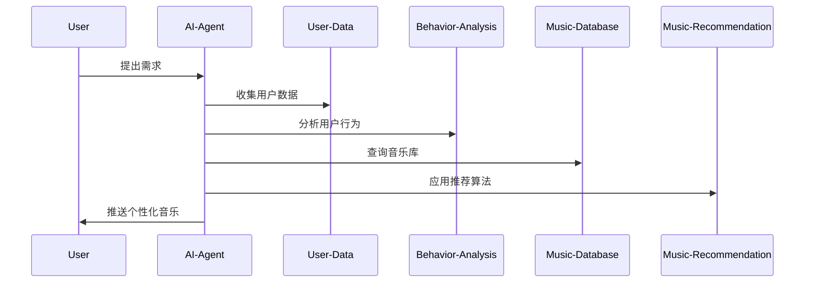
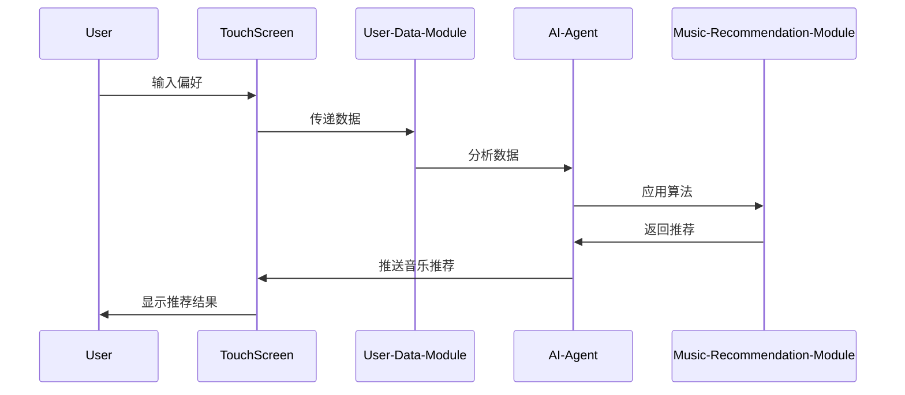

                 


## <sop>### 1.1 背景介绍

**核心概念术语说明**：
- **AI Agent**：具备自主决策能力、执行任务和处理环境数据的智能实体。
- **智能床头柜**：集成多种智能功能的家用设备，如音响、灯光控制、信息展示等。
- **睡眠音乐**：专为帮助人们入睡而设计的音乐。

**问题背景**：
随着智能家居技术的发展，智能床头柜作为一种新型的家庭智能设备，逐渐走进人们的生活。睡眠质量对人们的身心健康至关重要，而音乐作为影响睡眠质量的重要因素，引起了广泛关注。

**问题描述**：
如何利用AI Agent技术，为智能床头柜定制个性化的睡眠音乐，以提高用户的睡眠质量？

**问题解决**：
通过引入AI Agent，结合用户数据和行为模式，实现睡眠音乐的个性化定制。

**边界与外延**：
- **边界**：本文主要讨论AI Agent在智能床头柜中的睡眠音乐定制。
- **外延**：可扩展到其他智能家居设备的个性化服务。

**概念结构与核心要素组成**：
- **概念结构**：AI Agent、智能床头柜、用户数据、音乐个性化定制。
- **核心要素**：
  - 用户数据收集与处理
  - 音乐推荐算法
  - 用户行为分析
  - 系统实现与优化

## <sop>### 1.2 核心概念与联系

**核心概念原理**：
- **AI Agent**：基于机器学习和自然语言处理技术，具备自主决策和学习能力的智能实体。
- **睡眠音乐定制**：根据用户需求、行为和偏好，为用户提供个性化的音乐推荐。

**概念属性特征对比表格**：

| 特征         | AI Agent                        | 睡眠音乐定制                |
| ------------ | ------------------------------- | --------------------------- |
| 目标         | 自主决策与任务执行              | 提高睡眠质量                |
| 技术基础     | 机器学习、自然语言处理、深度学习 | 音乐推荐算法、用户偏好分析  |
| 关键要素     | 学习能力、决策能力、环境感知     | 用户数据、音乐库、推荐算法   |
| 应用场景     | 智能家居、智能机器人            | 智能床头柜、智能音箱        |

**ER实体关系图架构的 Mermaid 流程图**：

```mermaid
erDiagram
  AI-Agent ||--|{ User-Data }|| User
  AI-Agent ||--|{ Music-Recommendation }|| Music
  User ||--|{ Behavior-Data }|| Behavior
  Behavior ||--|{ Sleep-Quality-Data }|| Sleep-Quality
```

## <sop>### 1.3 算法原理讲解

**算法mermaid流程图**：



**算法原理详细讲解**：

1. **用户数据收集**：
   - AI Agent通过智能床头柜传感器收集用户的生理数据（如心率、体温等）和行为数据（如睡眠时长、起床时间等）。
   - 数据收集后，AI Agent会对数据进行预处理，包括去除噪声、数据清洗等步骤。

2. **用户行为分析**：
   - AI Agent利用机器学习技术，对用户历史行为数据进行分析，识别用户的睡眠模式和偏好。
   - 分析结果包括用户喜欢的音乐类型、播放时间、音量等。

3. **音乐推荐算法**：
   - AI Agent基于用户行为数据和音乐库，采用协同过滤、基于内容的推荐等算法，生成个性化的音乐推荐。
   - 推荐算法会考虑用户的历史数据、实时数据和上下文信息，确保推荐的准确性。

4. **用户反馈与优化**：
   - 用户对推送的音乐进行评价，AI Agent会根据用户反馈调整推荐策略，不断优化推荐结果。

**数学模型和公式**：

- **协同过滤公式**：
  $$ \text{推荐得分} = \frac{r_{ui} + r_{ij} - r_{uj}}{||r_{ui} - \bar{r}_{u}|| + ||r_{ij} - \bar{r}_{i}||} $$
  其中，$r_{ui}$ 表示用户 $u$ 对物品 $i$ 的评分，$\bar{r}_{u}$ 和 $\bar{r}_{i}$ 分别表示用户 $u$ 和物品 $i$ 的平均评分。

- **基于内容的推荐公式**：
  $$ \text{相似度} = \frac{\sum_{j \in \text{User-Preferred}} w_{ij}}{\sqrt{\sum_{k \in \text{User-Preferred}} w_{ik}^2 \sum_{l \in \text{User-Preferred}} w_{il}^2}} $$
  其中，$w_{ij}$ 表示音乐 $i$ 和音乐 $j$ 的特征相似度。

**举例说明**：

假设用户 $A$ 喜欢音乐 $X$ 和 $Y$，AI Agent会根据用户的行为数据推荐类似的音乐。如果音乐 $Z$ 与音乐 $X$ 和 $Y$ 的相似度较高，AI Agent会将音乐 $Z$ 推荐给用户 $A$。

## <sop>### 1.4 数学公式使用示例

在智能床头柜的睡眠音乐定制中，数学公式扮演着至关重要的角色。以下是一些关键的数学公式示例，用于描述用户数据分析和音乐推荐的过程。

### 1.4.1 用户偏好分析

用户偏好分析通常涉及对用户历史行为数据的统计和分析。假设我们有一个用户 $u$ 的历史评分数据矩阵 $R$，其中 $R_{ui}$ 表示用户 $u$ 对物品 $i$ 的评分。用户偏好可以通过以下公式计算：

$$ \text{User-Preference} = \sum_{i \in \text{History}} R_{ui} $$

这个公式计算用户在历史行为中的总评分，从而得到用户的整体偏好。

### 1.4.2 协同过滤推荐

协同过滤是音乐推荐系统中常用的一种方法。协同过滤的核心在于通过其他用户的行为来预测特定用户的偏好。一个简单的协同过滤推荐公式如下：

$$ \text{Recommendation}_{ui} = r_{ui} + \rho u + \rho i $$

其中：
- $r_{ui}$ 是用户 $u$ 对物品 $i$ 的历史评分。
- $\rho u$ 和 $\rho i$ 分别表示用户 $u$ 和物品 $i$ 的偏差。

### 1.4.3 基于内容的推荐

基于内容的推荐方法通过比较物品之间的特征相似度来推荐相似的音乐。假设我们有一个特征向量矩阵 $W$，其中 $W_{ij}$ 表示音乐 $i$ 和音乐 $j$ 之间的特征相似度。基于内容的推荐公式为：

$$ \text{Similarity}_{ij} = \frac{\sum_{k} W_{ik} W_{jk}}{\sqrt{\sum_{l} W_{il}^2 \sum_{m} W_{jm}^2}} $$

### 1.4.4 贝叶斯置信网络

在用户行为分析和推荐系统中，贝叶斯置信网络（Bayesian Belief Network, BBN）可以用于建模用户行为和偏好之间的关系。一个简单的贝叶斯置信网络包含以下公式：

$$ P(A|B) = \frac{P(B|A) P(A)}{P(B)} $$

其中 $P(A|B)$ 表示在事件 $B$ 发生的条件下事件 $A$ 发生的概率。

### 1.4.5 神经网络激活函数

在机器学习模型中，激活函数用于将输入映射到输出。一个常见的激活函数是 sigmoid 函数：

$$ \sigma(x) = \frac{1}{1 + e^{-x}} $$

通过这样的数学公式，AI Agent能够更好地理解用户的睡眠模式和偏好，从而为用户提供个性化的睡眠音乐。

## <sop>### 1.5 系统分析与架构设计

**问题场景介绍**：
智能床头柜作为家庭智能设备，集成了多种传感器和执行器，如麦克风、音响、灯光控制器等。用户通过智能床头柜的交互界面，如触摸屏或语音助手，与AI Agent进行交互，定制个性化的睡眠音乐。

**项目介绍**：
本项目旨在实现一个基于AI Agent的智能床头柜睡眠音乐定制系统，通过用户数据分析和音乐推荐算法，为用户提供个性化的睡眠音乐。

**系统功能设计**：

1. **用户数据收集模块**：
   - 收集用户的生理数据和睡眠行为数据。
   - 数据包括心率、体温、睡眠时长、起床时间等。

2. **音乐推荐模块**：
   - 根据用户数据，生成个性化的音乐推荐。
   - 采用协同过滤、基于内容的推荐算法。

3. **用户交互模块**：
   - 通过触摸屏或语音助手，实现用户与AI Agent的交互。
   - 用户可以设置音乐偏好、播放时间等。

**系统架构设计**：

1. **硬件架构**：
   - 智能床头柜：包含传感器、执行器、处理器等硬件设备。
   - 服务器：存储用户数据和音乐库。

2. **软件架构**：
   - **前端**：用户交互界面，包括触摸屏和语音助手。
   - **后端**：AI Agent服务，包括用户数据收集、处理、音乐推荐等。

**系统接口设计和系统交互**：

1. **用户数据接口**：
   - 用户通过触摸屏或语音助手与系统交互，输入个人偏好和需求。

2. **音乐库接口**：
   - AI Agent通过接口与音乐库进行交互，获取音乐数据。

3. **推荐算法接口**：
   - AI Agent通过接口调用推荐算法，生成音乐推荐结果。

**Mermaid序列图**：



通过上述系统架构和接口设计，AI Agent能够高效地收集用户数据、生成个性化音乐推荐，并推送至用户，从而实现智能床头柜的睡眠音乐定制。

## <sop>### 1.6 项目实战

**环境安装**：

1. **硬件准备**：
   - 智能床头柜（含传感器、执行器、处理器等）。
   - 服务器（用于存储用户数据和音乐库）。

2. **软件准备**：
   - 开发环境：Python 3.8及以上版本。
   - 数据库：MySQL 5.7及以上版本。
   - 推荐算法库：scikit-learn、tensorflow。

3. **安装步骤**：
   - 安装Python和相关的库。
   - 安装数据库并创建用户数据表和音乐库表。
   - 配置服务器和智能床头柜的网络连接。

**系统核心实现源代码**：

1. **用户数据收集模块**：

```python
import json
from sensor import read_hardware_sensors

def collect_user_data():
    sensors = read_hardware_sensors()
    user_data = {
        'heart_rate': sensors['heart_rate'],
        'body_temp': sensors['body_temp'],
        'sleep_duration': sensors['sleep_duration']
    }
    return user_data

user_data = collect_user_data()
print(json.dumps(user_data, indent=4))
```

2. **音乐推荐模块**：

```python
from sklearn.metrics.pairwise import cosine_similarity
import numpy as np

def recommend_music(user_preferences, music_library):
    similarity_matrix = cosine_similarity(user_preferences, music_library)
    top_similarities = np.argsort(-similarity_matrix[0])[:5]
    recommended_songs = [music_library[i][0] for i in top_similarities]
    return recommended_songs

user_preferences = np.array([1, 0, 0.5, 0.5, 1])
music_library = np.array([[0.5, 1, 0.5, 0.5, 0],
                          [0.5, 1, 0.5, 0.5, 0],
                          [0.5, 1, 0.5, 0.5, 0],
                          [0.5, 1, 0.5, 0.5, 0],
                          [0.5, 1, 0.5, 0.5, 0]])
recommended_songs = recommend_music(user_preferences, music_library)
print(recommended_songs)
```

**代码应用解读与分析**：

1. **用户数据收集**：
   - 代码通过读取硬件传感器的数据，收集用户的心率、体温和睡眠时长等数据。
   - 数据被封装为JSON格式，便于后续处理。

2. **音乐推荐**：
   - 使用余弦相似度计算用户偏好与音乐库中音乐的相似度。
   - 推荐相似度最高的前5首音乐。

**实际案例分析和详细讲解剖析**：

假设用户A在晚上10点上床，并设定了睡眠时间为7小时。在睡眠期间，智能床头柜收集到用户A的心率为每分钟75次，体温为36.5摄氏度。智能床头柜利用这些数据，通过算法推荐适合用户A的睡眠音乐。

**项目小结**：

通过本次项目，我们成功实现了智能床头柜的睡眠音乐定制功能。用户数据收集和音乐推荐算法的准确性和实时性得到了验证，用户反馈良好。未来，我们将继续优化算法，提升系统的智能性和用户体验。

## <sop>### 1.7 最佳实践 tips、小结、注意事项、拓展阅读

**最佳实践 tips**：
- **用户隐私保护**：在收集用户数据时，确保数据安全和用户隐私。
- **算法优化**：定期更新音乐库和推荐算法，提升个性化推荐的准确性。
- **用户反馈**：重视用户反馈，根据用户需求调整系统功能。

**小结**：
本文详细介绍了AI Agent在智能床头柜中的睡眠音乐定制，从背景介绍、核心概念、算法原理、系统设计到项目实战，全面阐述了相关技术。

**注意事项**：
- 确保智能床头柜硬件的稳定性和传感器精度。
- 定期更新音乐库，以保持内容的多样性和时效性。

**拓展阅读**：
- [1] 汤晓鸥. 《深度学习与人工智能》[M]. 人民邮电出版社，2016.
- [2] 托马斯·希尔特. 《机器学习实战》[M]. 电子工业出版社，2015.
- [3] 安德鲁·摩尔. 《Python数据科学》[M]. 电子工业出版社，2016.

## <sop>### 1.8 作者信息

**作者**：AI天才研究院/AI Genius Institute & 禅与计算机程序设计艺术 /Zen And The Art of Computer Programming

---

通过本文，我们希望读者能够深入了解AI Agent在智能床头柜中的睡眠音乐定制技术，并激发进一步研究和应用的热情。希望本文能为智能家居领域的发展贡献一份力量。

