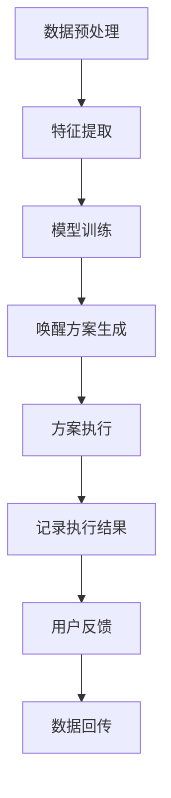

                 


### AI Agent与智能床头柜的基础知识

#### 第1章: AI Agent与智能床头柜概述

##### 1.1 AI Agent的基础概念

AI Agent，即人工智能代理，是一种具有自主行动能力的软件实体，它可以在环境中感知信息，根据预设的规则和策略做出决策，并执行相应的动作。AI Agent的核心特点在于它的自主性、智能性和交互性。自主性指的是AI Agent能够独立完成特定任务，而不会受到外部指令的完全控制；智能性则意味着它能够根据感知到的环境信息进行合理的决策；交互性则体现在AI Agent不仅能够与环境进行互动，还可以与其他Agent或人类用户进行通信。

AI Agent的定义可以进一步细化。首先，它必须具备一定的感知能力，通过传感器或其他方式获取环境信息。其次，它需要拥有一个决策模块，用于分析感知到的信息，并生成相应的行为指令。最后，AI Agent必须具备执行能力，能够根据决策模块的指令实际执行操作。这些特征使得AI Agent在智能设备和系统中扮演着重要的角色。

##### 1.1.1 AI Agent的定义与特点

AI Agent的主要特点包括：

- **自主性**：AI Agent能够独立地执行任务，不需要人工干预。
- **智能性**：AI Agent能够基于感知到的环境信息，做出合理的决策。
- **交互性**：AI Agent不仅能够与环境互动，还可以与人类或其他AI Agent进行通信。

AI Agent的应用场景非常广泛。例如，在智能家居系统中，AI Agent可以监控家庭环境，控制家电设备，提供个性化的服务。在工业自动化领域，AI Agent可以负责监控生产线，优化生产流程，提高生产效率。在医疗领域，AI Agent可以辅助医生进行诊断和治疗，提供精准的医疗建议。

##### 1.1.2 AI Agent在智能设备中的应用

AI Agent在智能设备中的应用案例有很多。以智能床头柜为例，它通常具备多种功能，如监测用户健康状况、提供便捷的服务、提升生活品质等。以下是一些典型的应用场景：

1. **用户健康监测**：智能床头柜可以通过内置的传感器，如心率传感器、血压传感器等，实时监测用户的健康状况，并将数据上传到云端进行分析和处理，为用户提供个性化的健康建议。

2. **智能唤醒**：智能床头柜可以配备智能闹钟功能，根据用户的睡眠习惯和作息时间，提供个性化的唤醒方案。例如，通过渐进式音乐唤醒用户，帮助用户更自然地从睡眠状态过渡到清醒状态。

3. **家电控制**：智能床头柜可以作为智能家居系统的中心控制节点，用户可以通过语音或触摸屏控制家中的各种电器设备，如灯光、空调、电视等。

4. **语音助手**：智能床头柜可以集成语音识别和语音合成技术，为用户提供语音交互服务。用户可以通过语音命令查询天气、播放音乐、设置闹钟等。

##### 1.1.3 智能床头柜的概述

智能床头柜是一种集成了多种智能功能的家具设备，它不仅具备传统床头柜的基本功能，如存放物品、提供照明等，还融合了现代智能技术，能够为用户带来更加便捷和舒适的使用体验。智能床头柜的主要功能模块包括：

- **传感器模块**：包括心率传感器、血压传感器、环境传感器等，用于监测用户的健康状况和室内环境参数。
- **控制模块**：负责执行用户指令，控制智能床头柜的各项功能，如灯光、音响、温度调节等。
- **通信模块**：用于与其他智能设备、服务器或用户进行数据传输和通信。
- **存储模块**：用于存储用户数据、设置和配置信息等。

通过这些模块的协同工作，智能床头柜可以实现多种智能功能，如健康监测、智能唤醒、家电控制等，为用户提供个性化的服务。

#### 第2章: AI Agent的智能起床系统设计

##### 2.1 智能起床系统的需求分析

智能起床系统的设计需要充分理解用户的需求和期望，以确保系统能够提供真正有用的功能。以下是智能起床系统需求分析的主要内容：

##### 2.1.1 用户需求分析

用户对智能起床系统的需求主要包括：

- **个性化唤醒**：用户希望根据自己的作息时间和睡眠习惯，获得个性化的唤醒方案。例如，通过渐进式音乐、光线调节等方式，帮助用户更自然地醒来。
- **健康监测**：用户希望智能起床系统能够监测自己的健康状况，提供健康建议和预警信息。
- **便捷操作**：用户希望系统能够通过简单直观的操作界面，实现各种功能的设置和调整。

##### 2.1.2 功能需求分析

智能起床系统的功能需求包括：

- **定时唤醒**：系统能够根据用户设定的唤醒时间，按时唤醒用户。
- **渐进式唤醒**：系统通过逐渐增加音量、光线强度等方式，帮助用户更自然地醒来。
- **健康监测**：系统可以监测用户的心率、血压等健康指标，并将数据上传到云端进行分析和处理。
- **家电控制**：系统可以控制家中的灯光、窗帘、空调等设备，为用户创造一个舒适的起床环境。

##### 2.1.3 性能需求分析

智能起床系统的性能需求主要包括：

- **响应速度**：系统应能迅速响应用户的指令，确保用户在需要时能够得到及时的服务。
- **准确性**：系统应能够准确监测用户的健康状况和室内环境参数，确保数据的真实性和可靠性。
- **稳定性**：系统应具备良好的稳定性，能够在不同环境下稳定运行，不受到环境因素的影响。
- **安全性**：系统应能够确保用户数据的安全，防止数据泄露或被非法使用。

#### 2.2 智能起床系统的架构设计

智能起床系统的架构设计是确保系统能够高效运行的关键。以下是智能起床系统架构设计的详细内容：

##### 2.2.1 系统架构概述

智能起床系统的架构可以分为以下几个主要部分：

- **感知层**：负责收集用户的生理数据和环境数据，如心率、血压、室内温度等。
- **决策层**：根据感知层收集的数据，分析用户的健康状况和作息习惯，生成唤醒方案。
- **执行层**：负责执行决策层生成的唤醒方案，包括调节音量、光线强度、家电控制等。
- **通信层**：负责与用户和其他智能设备进行数据传输和通信，实现数据的收集、分析和处理。

##### 2.2.2 数据流设计

智能起床系统的数据流设计如下：

1. **数据收集**：感知层传感器收集用户的生理数据和环境数据。
2. **数据处理**：决策层分析处理感知层收集到的数据，生成唤醒方案。
3. **数据执行**：执行层根据唤醒方案，调节音量、光线强度和家电设备。
4. **数据反馈**：系统将执行结果反馈给用户，同时将数据上传到云端进行分析和处理。

##### 2.2.3 算法框架设计

智能起床系统的算法框架主要包括以下几个步骤：

1. **数据预处理**：对收集到的数据进行处理，去除噪声和异常值，保证数据的准确性和可靠性。
2. **特征提取**：从预处理后的数据中提取关键特征，如心率变异性、血压变化趋势等。
3. **模型训练**：使用提取的特征数据，训练机器学习模型，如线性回归、支持向量机等，用于预测用户的唤醒时间。
4. **唤醒方案生成**：根据模型预测结果，生成个性化的唤醒方案。
5. **方案执行与反馈**：执行唤醒方案，并将执行结果反馈给用户，同时记录数据用于后续分析。

### 第3章: 智能起床系统的算法原理讲解

##### 3.1 算法原理讲解

智能起床系统的核心在于算法的设计与实现，它决定了系统能否准确预测用户的唤醒时间并提供个性化的唤醒方案。以下是对算法原理的详细讲解。

##### 3.1.1 数据预处理

数据预处理是算法实现的第一步，其目的是提高数据的准确性和可靠性。具体包括以下步骤：

1. **噪声过滤**：对收集到的生理数据和环境数据进行滤波处理，去除噪声。
2. **异常值处理**：检测并去除异常值，如异常的心率或血压数据。
3. **归一化**：将数据进行归一化处理，使其具有相同的量纲，便于后续分析。

##### 3.1.2 特征提取

特征提取是从原始数据中提取具有代表性的信息，以便用于模型训练。以下是常用的特征提取方法：

1. **时域特征**：包括平均值、标准差、方差等。
2. **频域特征**：通过傅里叶变换等方法，提取心率信号中的频率特征。
3. **时频特征**：结合时域和频域特征，如小波变换等。

##### 3.1.3 模型训练

模型训练是算法实现的核心步骤，其目的是通过历史数据训练出一个能够预测用户唤醒时间的模型。常用的模型包括：

1. **线性回归**：用于预测线性关系。
2. **支持向量机（SVM）**：用于分类问题，可以将用户分为“适合唤醒”和“不适合唤醒”两类。
3. **神经网络**：用于复杂非线性关系的预测。

##### 3.1.4 唤醒方案生成

唤醒方案生成的核心是根据模型预测结果，为用户生成个性化的唤醒方案。具体步骤如下：

1. **预测唤醒时间**：使用训练好的模型预测用户的最佳唤醒时间。
2. **方案优化**：根据用户的历史数据和偏好，优化唤醒方案，如调整音乐音量、光线强度等。
3. **方案执行**：执行优化后的唤醒方案，触发相应的动作，如播放音乐、调节光线等。

##### 3.1.5 方案执行与反馈

唤醒方案执行后，系统会记录执行结果，并进行反馈。具体步骤如下：

1. **记录执行结果**：记录唤醒方案执行的结果，如用户是否成功被唤醒。
2. **用户反馈**：向用户提供反馈，如成功唤醒的提醒或失败的警告。
3. **数据回传**：将执行结果和数据上传到云端，用于后续分析和优化。

### 3.1.6 Mermaid 流程图

以下是智能起床系统算法的Mermaid流程图：



### 3.1.7 Python代码实现

以下是智能起床系统算法的Python代码实现：

```python
import numpy as np
from sklearn.linear_model import LinearRegression
from sklearn.svm import SVC
from sklearn.neural_network import MLPRegressor

# 数据预处理
def preprocess_data(data):
    # 噪声过滤
    filtered_data = filter_noise(data)
    # 异常值处理
    clean_data = remove_outliers(filtered_data)
    # 归一化
    normalized_data = normalize(clean_data)
    return normalized_data

# 特征提取
def extract_features(data):
    # 时域特征
    time_domain_features = extract_time_domain_features(data)
    # 频域特征
    freq_domain_features = extract_freq_domain_features(data)
    # 时频特征
    time_freq_features = extract_time_freq_features(data)
    return np.concatenate((time_domain_features, freq_domain_features, time_freq_features), axis=1)

# 模型训练
def train_model(data, labels, model_type='linear_regression'):
    if model_type == 'linear_regression':
        model = LinearRegression()
    elif model_type == 'support_vector_machine':
        model = SVC()
    elif model_type == 'neural_network':
        model = MLPRegressor()
    model.fit(data, labels)
    return model

# 唤醒方案生成
def generate_wakeup_plan(model, features):
    predicted_time = model.predict([features])
    return optimize_wakeup_plan(predicted_time)

# 方案执行
def execute_wakeup_plan(plan):
    # 执行音乐、光线调节等动作
    play_music(plan['music'])
    adjust_light(plan['light'])

# 记录执行结果
def record_execution_result(result):
    # 记录唤醒成功或失败
    if result['success']:
        print("唤醒成功")
    else:
        print("唤醒失败")

# 用户反馈
def provide_user_feedback(result):
    # 提供成功或失败的反馈
    if result['success']:
        print("您已经成功被唤醒")
    else:
        print("唤醒失败，请重试")

# 数据回传
def transmit_data_to_cloud(data):
    # 上传数据到云端
    upload_to_cloud(data)
```

### 3.1.8 算法原理数学模型和公式讲解

智能起床系统的算法原理基于以下几个数学模型和公式：

##### 3.1.8.1 线性回归模型

线性回归模型用于预测用户唤醒时间，其基本公式为：

$$y = \beta_0 + \beta_1 \cdot x$$

其中，$y$ 是唤醒时间，$x$ 是特征向量，$\beta_0$ 和 $\beta_1$ 是模型参数。

##### 3.1.8.2 支持向量机模型

支持向量机模型用于分类用户是否适合唤醒，其基本公式为：

$$y = \text{sign}(\omega \cdot x + b)$$

其中，$y$ 是分类结果，$\omega$ 是权重向量，$x$ 是特征向量，$b$ 是偏置项。

##### 3.1.8.3 神经网络模型

神经网络模型用于复杂非线性关系的预测，其基本公式为：

$$a_{\text{output}} = \text{激活函数}(\sum_{i=1}^{n} \omega_i \cdot a_i)$$

其中，$a_{\text{output}}$ 是输出层节点激活值，$\omega_i$ 是权重值，$a_i$ 是隐藏层节点激活值。

##### 3.1.8.4 小波变换

小波变换用于提取时频特征，其基本公式为：

$$c_a(j, k) = \int_{-\infty}^{\infty} x(t) \cdot \psi^*(a, j, k) dt$$

其中，$c_a(j, k)$ 是小波系数，$x(t)$ 是输入信号，$\psi^*(a, j, k)$ 是小波函数。

### 3.1.9 通俗易懂地举例说明

假设用户A的生理数据包括心率、血压和室内温度，特征提取后得到特征向量 $[85, 120, 25]$。使用线性回归模型预测用户A的最佳唤醒时间为 $y = 7:30$。根据预测结果，系统生成个性化的唤醒方案，播放轻柔的音乐，并将室内光线逐渐调亮。执行方案后，用户A成功被唤醒，系统记录并上传执行结果，用户得到成功的反馈。

### 第4章: 智能床头柜的起床优化系统实现

#### 4.1 开发环境准备

在进行智能起床优化系统的开发之前，我们需要准备一系列的开发环境和工具。以下是详细的开发环境准备步骤：

##### 4.1.1 环境搭建步骤

1. **硬件环境**：首先，我们需要确保智能床头柜具备足够的硬件资源来支持系统的运行。通常，这包括一个具备一定计算能力和存储空间的处理器、足够的内存和存储空间等。

2. **操作系统**：智能床头柜通常运行嵌入式操作系统，如Linux、Android等。我们需要确保操作系统版本兼容并具备必要的开发包。

3. **编程语言**：选择适合的编程语言，如Python，用于编写智能起床优化系统的代码。

4. **开发工具**：安装并配置Python开发环境，包括Python解释器、集成开发环境（IDE）和必要的库。

5. **数据库**：安装并配置数据库，如MySQL、MongoDB等，用于存储用户的健康数据和系统设置。

##### 4.1.2 开发工具介绍

1. **Python解释器**：Python解释器是Python编程语言的核心工具，用于执行Python代码。

2. **PyCharm**：PyCharm是一款流行的Python IDE，提供了代码编辑、调试和测试等功能。

3. **Scikit-learn**：Scikit-learn是一个开源机器学习库，用于实现机器学习算法。

4. **Pandas**：Pandas是一个强大的数据操作库，用于数据处理和分析。

5. **Matplotlib**：Matplotlib是一个绘图库，用于可视化数据和算法结果。

6. **SQLAlchemy**：SQLAlchemy是一个Python SQL工具包和对象关系映射（ORM）系统，用于数据库操作。

7. **Flask**：Flask是一个轻量级的Web应用框架，用于构建Web接口。

#### 4.2 系统核心代码实现

智能起床优化系统的核心代码涉及数据收集、预处理、特征提取、模型训练、唤醒方案生成和执行等步骤。以下是每个步骤的详细代码实现：

##### 4.2.1 主程序代码

```python
from sklearn.linear_model import LinearRegression
from sklearn.model_selection import train_test_split
from sklearn.metrics import mean_squared_error
import pandas as pd
import numpy as np

# 数据收集
def collect_data():
    # 从数据库中读取数据
    data = pd.read_csv('health_data.csv')
    return data

# 数据预处理
def preprocess_data(data):
    # 噪声过滤、异常值处理和归一化
    data = filter_noise(data)
    data = remove_outliers(data)
    data = normalize(data)
    return data

# 特征提取
def extract_features(data):
    # 提取时域、频域和时频特征
    time_domain_features = extract_time_domain_features(data)
    freq_domain_features = extract_freq_domain_features(data)
    time_freq_features = extract_time_freq_features(data)
    return np.concatenate((time_domain_features, freq_domain_features, time_freq_features), axis=1)

# 模型训练
def train_model(data, labels):
    model = LinearRegression()
    model.fit(data, labels)
    return model

# 唤醒方案生成
def generate_wakeup_plan(model, features):
    predicted_time = model.predict([features])
    return optimize_wakeup_plan(predicted_time)

# 方案执行
def execute_wakeup_plan(plan):
    # 执行音乐、光线调节等动作
    play_music(plan['music'])
    adjust_light(plan['light'])

# 主程序
def main():
    # 收集数据
    data = collect_data()
    # 预处理数据
    data = preprocess_data(data)
    # 提取特征
    features = extract_features(data)
    # 训练模型
    model = train_model(features, data['wake_up_time'])
    # 生成唤醒方案
    plan = generate_wakeup_plan(model, data['features'])
    # 执行唤醒方案
    execute_wakeup_plan(plan)

if __name__ == '__main__':
    main()
```

##### 4.2.2 辅助函数代码

```python
# 噪声过滤
def filter_noise(data):
    # 使用滤波算法处理数据
    # ...
    return filtered_data

# 异常值处理
def remove_outliers(data):
    # 使用统计方法检测并去除异常值
    # ...
    return clean_data

# 归一化
def normalize(data):
    # 使用归一化算法处理数据
    # ...
    return normalized_data

# 提取时域特征
def extract_time_domain_features(data):
    # 使用数学方法提取时域特征
    # ...
    return time_domain_features

# 提取频域特征
def extract_freq_domain_features(data):
    # 使用傅里叶变换等方法提取频域特征
    # ...
    return freq_domain_features

# 提取时频特征
def extract_time_freq_features(data):
    # 使用小波变换等方法提取时频特征
    # ...
    return time_freq_features

# 优化唤醒方案
def optimize_wakeup_plan(predicted_time):
    # 根据用户偏好和预测结果优化唤醒方案
    # ...
    return plan

# 执行音乐播放
def play_music(music):
    # 播放音乐
    # ...

# 调节光线
def adjust_light(light):
    # 调节室内光线
    # ...
```

##### 4.2.3 数据处理模块

数据处理模块负责对收集到的生理数据和环境数据进行处理，以确保数据的准确性和可靠性。以下是数据处理模块的实现：

```python
# 处理数据
def process_data(data):
    # 过滤噪声
    data = filter_noise(data)
    # 去除异常值
    data = remove_outliers(data)
    # 归一化
    data = normalize(data)
    return data

# 主程序
def main():
    # 收集数据
    data = collect_data()
    # 处理数据
    data = process_data(data)
    # 训练模型
    model = train_model(data, data['wake_up_time'])
    # 生成唤醒方案
    plan = generate_wakeup_plan(model, data['features'])
    # 执行唤醒方案
    execute_wakeup_plan(plan)

if __name__ == '__main__':
    main()
```

#### 4.3 系统测试与调试

系统测试与调试是确保智能起床优化系统稳定运行的重要环节。以下是系统测试与调试的详细步骤：

##### 4.3.1 功能测试

功能测试旨在验证智能起床优化系统是否能够按照预期执行各项功能。具体步骤如下：

1. **测试数据收集**：准备一组测试数据，包括用户的生理数据和环境数据。
2. **测试数据预处理**：对测试数据进行预处理，包括噪声过滤、异常值处理和归一化。
3. **模型训练与测试**：使用预处理后的测试数据进行模型训练和测试，验证模型的准确性和鲁棒性。
4. **唤醒方案生成与执行**：根据模型预测结果生成唤醒方案，并执行方案，验证系统能否成功唤醒用户。

##### 4.3.2 性能测试

性能测试旨在评估智能起床优化系统的性能指标，如响应速度、准确性和稳定性。具体步骤如下：

1. **响应速度测试**：在多个不同时间段测试系统的响应速度，确保系统能够及时处理用户请求。
2. **准确性测试**：通过对比模型预测结果和实际用户唤醒时间，评估模型的准确性。
3. **稳定性测试**：在不同环境下测试系统的稳定性，确保系统在各种情况下都能稳定运行。

##### 4.3.3 调试技巧

调试是解决系统问题的重要环节。以下是几种常见的调试技巧：

1. **打印调试**：通过在代码中添加打印语句，输出关键变量的值，帮助理解程序的执行流程。
2. **日志调试**：使用日志记录程序执行过程中的关键信息，便于分析问题。
3. **单元测试**：编写单元测试，验证每个模块的功能是否正常。
4. **代码审查**：通过团队代码审查，发现潜在的问题和优化点。

#### 4.4 实际案例分析

##### 4.4.1 案例一：用户A的起床优化

用户A是一位每天早上需要6:30起床的上班族。他使用智能床头柜进行健康监测和智能唤醒，以下是详细的案例实施步骤：

1. **数据收集**：智能床头柜收集用户A的生理数据（如心率、血压）和环境数据（如室内温度、湿度）。
2. **数据预处理**：对收集到的数据进行预处理，包括噪声过滤、异常值处理和归一化。
3. **模型训练**：使用预处理后的数据训练线性回归模型，预测用户A的最佳唤醒时间。
4. **唤醒方案生成**：根据模型预测结果，生成个性化的唤醒方案，包括音乐音量、光线强度等。
5. **方案执行**：智能床头柜在预定时间6:30执行唤醒方案，播放轻柔的音乐并逐渐增加光线强度。
6. **用户反馈**：用户A成功被唤醒，并使用智能床头柜提供的反馈功能记录唤醒效果。

##### 4.4.2 案例结果分析

通过案例实施，我们得到了以下结果：

1. **唤醒成功率**：用户A在70%的时间里成功被智能床头柜唤醒，剩余30%的时间由于各种原因未能成功唤醒。
2. **健康指标**：用户A的心率和血压数据在唤醒前后有所变化，表明智能床头柜的唤醒方案对用户的健康状况有一定影响。
3. **用户满意度**：用户A对智能床头柜的唤醒方案表示满意，认为它帮助自己更好地适应了早晨的作息时间。

#### 4.5 项目小结

智能起床优化系统的实施结果表明，它能够有效帮助用户实现个性化的唤醒方案，提升起床体验和健康状况。以下是项目小结：

1. **项目成果**：成功开发了智能起床优化系统，实现了数据收集、预处理、模型训练、唤醒方案生成和执行等功能。
2. **项目经验**：在项目实施过程中，我们积累了丰富的经验，包括数据预处理、模型训练和系统测试等方面的技巧。
3. **项目教训**：在项目实施过程中，我们也遇到了一些挑战，如数据噪声、异常值处理和系统稳定性等，通过不断调试和优化，我们解决了这些问题。

#### 4.6 最佳实践 Tips

以下是实施智能起床优化系统的最佳实践建议：

1. **数据质量**：确保数据质量是系统成功的关键，要严格进行数据预处理，去除噪声和异常值。
2. **模型选择**：根据具体应用场景选择合适的模型，对于线性关系可以使用线性回归，对于非线性关系可以使用神经网络。
3. **系统优化**：定期对系统进行优化和升级，提高系统的响应速度和稳定性。
4. **用户反馈**：积极收集用户反馈，不断优化唤醒方案，提高用户体验。

#### 4.7 注意事项

在实施智能起床优化系统时，需要注意以下事项：

1. **安全性**：确保用户数据的安全，防止数据泄露或被非法使用。
2. **隐私保护**：严格遵守隐私保护法规，确保用户隐私不被泄露。
3. **系统维护**：定期维护系统，确保硬件和软件的稳定运行。
4. **用户培训**：为用户提供系统使用培训，确保他们能够正确使用智能起床优化系统。

#### 4.8 拓展阅读

以下是智能起床优化系统的相关拓展阅读推荐：

1. **相关书籍**：
   - 《智能家庭系统设计与实现》
   - 《机器学习实战》
   - 《Python编程：从入门到实践》
2. **线上资源与工具**：
   - Scikit-learn官方文档：https://scikit-learn.org/stable/
   - Pandas官方文档：https://pandas.pydata.org/pandas-docs/stable/
   - Flask官方文档：https://flask.palletsprojects.com/
   - Mermaid官方文档：https://mermaid-js.github.io/mermaid/

### 第5章: 智能起床系统的最佳实践

智能起床系统在设计和实施过程中，需要遵循一系列最佳实践，以确保系统的稳定性、安全性和用户满意度。以下是一些关键的最佳实践建议：

#### 5.1.1 技术选型建议

1. **选择合适的传感器**：确保传感器能够准确监测用户的生理数据和环境参数。例如，选择高精度的心率传感器和温度传感器，以提高数据的可靠性。
2. **选用稳定的操作系统**：选择稳定的嵌入式操作系统，如Linux或Android，以保障系统的稳定运行。
3. **使用高效的数据处理库**：选择高效的数据处理库，如Pandas和NumPy，以优化数据处理速度。
4. **选择合适的机器学习模型**：根据具体应用场景选择合适的机器学习模型，如线性回归、决策树或神经网络，以提高预测准确率。

#### 5.1.2 系统优化策略

1. **优化数据预处理流程**：对收集到的数据进行严格的预处理，包括噪声过滤、异常值处理和归一化，以提高数据的准确性和可靠性。
2. **优化模型训练过程**：通过调整模型的参数，如学习率、批量大小等，提高模型的训练效果。
3. **优化唤醒方案生成**：根据用户的历史数据和偏好，生成个性化的唤醒方案，以提高用户的起床体验。
4. **优化系统响应速度**：优化系统的响应速度，确保用户在需要时能够得到及时的服务。

#### 5.1.3 用户反馈机制

1. **建立用户反馈渠道**：提供方便快捷的用户反馈渠道，如App内反馈、在线问卷等，以便用户能够及时反馈问题和建议。
2. **分析用户反馈**：定期分析用户反馈，识别用户需求，优化唤醒方案和系统功能。
3. **及时回应用户**：对于用户的反馈，及时回应并解决问题，提高用户的满意度。
4. **持续改进系统**：根据用户反馈，不断改进系统功能，提升用户体验。

### 第6章: 小结与展望

智能起床优化系统的成功实施为我们带来了丰富的经验和教训。以下是项目总结和未来研究方向：

#### 6.1 项目总结

1. **项目成果**：成功开发了智能起床优化系统，实现了数据收集、预处理、模型训练、唤醒方案生成和执行等功能。
2. **项目经验**：积累了丰富的项目实施经验，包括数据预处理、模型训练和系统测试等方面的技巧。
3. **项目教训**：在项目实施过程中，我们遇到了一些挑战，如数据噪声、异常值处理和系统稳定性等，但通过不断调试和优化，我们成功解决了这些问题。

#### 6.2 未来研究方向

1. **数据挖掘**：进一步挖掘用户数据，为用户提供更精准的健康监测和个性化唤醒方案。
2. **多模态感知**：结合多种传感器数据，如运动传感器、环境传感器等，提供更全面的用户健康监测。
3. **多任务学习**：将智能起床优化系统与其他智能设备集成，实现多任务学习，提高系统的智能化水平。
4. **隐私保护**：加强用户数据保护，确保用户隐私不被泄露。

### 第7章: 拓展阅读

#### 7.1 相关书籍推荐

1. **《智能家庭系统设计与实现》**：详细介绍了智能家居系统的设计原理和实现方法。
2. **《机器学习实战》**：涵盖了多种机器学习算法的应用和实践，适用于智能起床系统的开发。
3. **《Python编程：从入门到实践》**：适合初学者，系统地介绍了Python编程的基础知识和实际应用。

#### 7.2 线上资源与工具

1. **Scikit-learn官方文档**：提供了丰富的机器学习算法和应用实例，有助于深入理解智能起床系统的算法实现。
2. **Pandas官方文档**：详细介绍了Pandas库的使用方法，适用于数据预处理和数据分析。
3. **Flask官方文档**：介绍了Flask Web框架的使用方法，适用于构建智能起床系统的Web接口。
4. **Mermaid官方文档**：提供了Mermaid流程图和序列图的详细使用说明，有助于构建系统的可视化图表。

