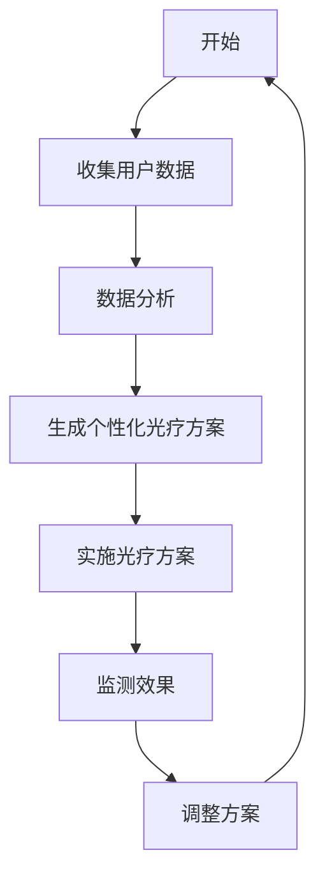
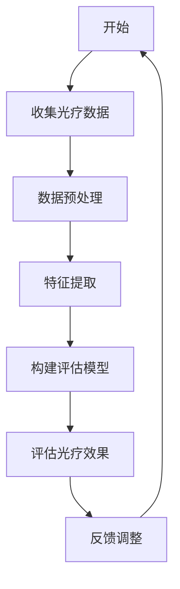

                 

# AI Agent在智能床头灯中的光疗功能

## 关键词

- AI Agent
- 智能家居
- 光疗功能
- 个性化定制
- 智能监测
- 算法原理

## 摘要

本文探讨了AI Agent在智能床头灯中的光疗功能。首先，我们介绍了智能床头灯的背景和当前存在的问题，包括光疗效果个性化定制不足、光疗效果监测和评估机制不够完善、光疗过程智能化程度不高等。接着，我们详细介绍了AI Agent和光疗的核心概念与原理，以及它们之间的联系。然后，我们深入分析了个性化光疗算法和智能监测与评估算法的原理，包括算法流程、数学模型和数学公式。此外，我们还对系统分析与架构设计进行了讨论，包括问题场景介绍、项目介绍、系统功能设计、系统架构设计、系统接口设计和系统交互等。最后，我们通过一个实际项目案例，详细讲解了环境安装、系统核心实现源代码、代码应用解读与分析，并对项目进行了小结。

## 第1章 问题背景

### 1.1 问题背景

随着人工智能（AI）技术的迅猛发展，AI Agent技术逐渐在智能家居领域中崭露头角。AI Agent，即人工智能代理，是一种能够代表用户执行任务、主动学习并适应用户行为的智能系统。在智能家居中，AI Agent被广泛应用于智能照明、智能安防、智能家电等领域，提高了家居生活的便捷性和智能化水平。

智能床头灯作为智能家居的一个重要组成部分，不仅具备基本的照明功能，还可以通过AI Agent实现更多的智能化功能，如情绪分析、睡眠监测、光疗等。其中，光疗功能是智能床头灯的一大亮点，它利用特定波长的光线照射人体，以改善或治疗某些疾病，如失眠、抑郁等。然而，当前AI Agent在智能床头灯中的光疗功能尚不完善，存在以下几个方面的问题：

1. **光疗效果的个性化定制不足**：大多数智能床头灯提供的光疗方案相对固定，难以满足用户多样化的需求。不同用户对光疗的敏感度、偏好和需求各不相同，需要根据个人特点提供定制化的光疗方案。

2. **光疗效果的监测和评估机制不够完善**：目前，智能床头灯在光疗过程中缺乏有效的监测和评估机制，无法实时监测光疗效果，也无法准确评估光疗对用户的具体影响。

3. **光疗过程的智能化程度不高**：光疗过程通常依赖于用户的自觉性和主动性，缺乏智能化的干预和优化，用户体验有待提升。

### 1.2 问题描述

为了解决上述问题，我们需要从以下几个方面进行改进：

1. **设计一个基于AI Agent的个性化光疗系统**：系统应能够根据用户的需求、偏好和生理特征，提供个性化的光疗方案，确保光疗效果最大化。

2. **引入智能监测和评估机制**：系统应具备实时监测光疗效果的能力，能够根据光疗过程中的数据调整光疗方案，提高光疗的准确性和效果。

3. **提升光疗过程的智能化程度**：通过AI Agent的智能干预和优化，使光疗过程更加自动化、智能化，提供更好的用户体验。

### 1.3 问题解决

为了实现上述改进，我们需要从以下几个方面入手：

1. **用户数据的采集与处理**：收集用户的生理、心理和行为数据，利用数据挖掘和分析技术提取关键特征，为个性化光疗方案提供数据支持。

2. **光疗方案的个性化生成**：基于用户数据和光疗原理，利用机器学习和优化算法生成个性化光疗方案，确保方案的针对性和有效性。

3. **光疗效果的实时监测与评估**：利用传感器和监测技术实时采集光疗过程中的数据，通过数据分析和机器学习模型评估光疗效果，自动调整光疗方案。

4. **智能化的用户交互与反馈**：通过自然语言处理和智能对话系统，实现用户与智能床头灯的智能交互，提高用户的参与感和满意度。

### 1.4 边界与外延

1. **光疗范围**：主要针对失眠、抑郁等需要光疗的人群。

2. **光疗方式**：包括自然光、蓝光、红光等多种光疗方式。

3. **AI Agent**：主要指具有学习、推理、决策等能力的智能系统，能够在特定环境中执行任务，提供个性化服务和优化方案。

## 第2章 核心概念与联系

### 2.1 AI Agent的概念与原理

#### 2.1.1 AI Agent的定义

AI Agent是指一种具有自主学习和自主决策能力的智能系统，它能够在特定环境中执行任务，并不断优化自身性能。AI Agent通常具有以下特点：

- **自主性**：能够自主执行任务，不需要人工干预。
- **知识表示**：能够将知识以结构化的方式表示和存储。
- **推理能力**：能够根据已知信息进行推理，得出结论。
- **学习能力**：能够根据新的数据和经验不断优化自身性能。

#### 2.1.2 AI Agent的核心特点

1. **自主性**：AI Agent能够自主执行任务，不需要人工干预。这意味着AI Agent可以根据预设的目标和规则，自动执行任务，提高工作效率。

2. **知识表示**：AI Agent能够将知识以结构化的方式表示和存储。这有助于AI Agent在执行任务时，能够快速地检索和利用已有的知识。

3. **推理能力**：AI Agent能够根据已知信息进行推理，得出结论。这意味着AI Agent可以在没有人类干预的情况下，自主地做出决策。

4. **学习能力**：AI Agent能够根据新的数据和经验不断优化自身性能。这意味着AI Agent可以在执行任务的过程中，不断学习和适应，提高任务执行的准确性和效率。

### 2.2 光疗的概念与原理

#### 2.2.1 光疗的定义

光疗是指利用特定波长的光线照射人体，以改善或治疗某些疾病的疗法。光疗通常用于治疗失眠、抑郁、季节性情感障碍等疾病。

#### 2.2.2 光疗的原理

光疗主要通过调节人体内的生物节律，改善情绪、缓解失眠等。具体来说，光疗可以通过以下几种方式实现：

1. **调节生物钟**：光疗可以通过模拟自然光，调整人体的生物钟，改善睡眠质量。

2. **改善情绪**：特定波长的光线可以刺激大脑释放神经递质，改善情绪，缓解抑郁。

3. **调节内分泌**：光疗可以影响人体内分泌系统，改善内分泌失调，提高免疫力。

#### 2.2.3 光疗的方式

1. **自然光**：模拟自然光的波长和亮度，有利于调节生物节律。

2. **蓝光**：有助于缓解抑郁、改善睡眠。

3. **红光**：有助于提高注意力和精力。

### 2.3 AI Agent与光疗的联系

AI Agent与光疗之间存在密切的联系，主要体现在以下几个方面：

1. **个性化定制**：AI Agent可以通过收集和分析用户数据，为用户提供个性化的光疗方案，提高光疗的效果。

2. **实时监测与评估**：AI Agent可以通过实时监测光疗过程中的数据，评估光疗效果，自动调整光疗方案，提高光疗的准确性和效果。

3. **智能化干预**：AI Agent可以在光疗过程中，根据用户反馈和监测数据，智能地调整光疗参数，提供更好的用户体验。

## 第3章 算法原理讲解

### 3.1 个性化光疗算法

#### 3.1.1 算法流程图

下面是一个简化的个性化光疗算法流程图：



#### 3.1.2 算法原理

个性化光疗算法主要通过以下步骤实现：

1. **收集用户数据**：包括用户的基本信息（如年龄、性别、生活习惯等）、生理特征（如身高、体重等）和心理特征（如情绪状态、睡眠质量等）。这些数据可以通过问卷调查、生理传感器、心理测试等方式获取。

2. **数据分析**：对收集到的用户数据进行分析和处理，提取关键特征。例如，可以分析用户的睡眠模式、情绪变化等，为生成个性化光疗方案提供依据。

3. **生成个性化光疗方案**：根据用户数据和光疗原理，利用机器学习算法生成个性化的光疗方案。例如，可以根据用户的情绪状态和睡眠质量，选择合适的波长和光照强度。

4. **实施光疗方案**：按照生成的个性化光疗方案进行实施。例如，智能床头灯可以根据方案设置光照时间和强度，为用户提供光疗服务。

5. **监测效果**：在实施光疗方案的过程中，实时监测光疗效果，收集用户的反馈数据。例如，可以监测用户的情绪变化、睡眠质量等。

6. **调整方案**：根据监测效果和用户反馈，调整光疗方案。例如，如果用户反馈光疗效果不佳，可以适当调整光照时间和强度，以提高光疗效果。

### 3.2 智能监测和评估算法

#### 3.2.1 算法流程图

下面是一个简化的智能监测和评估算法流程图：



#### 3.2.2 算法原理

智能监测和评估算法主要通过以下步骤实现：

1. **收集光疗数据**：在光疗过程中，收集光照强度、时长、用户情绪、睡眠质量等数据。这些数据可以通过传感器、用户反馈等方式获取。

2. **数据预处理**：对收集到的光疗数据进行预处理，去除噪声和异常值，确保数据的质量。

3. **特征提取**：从预处理后的数据中提取关键特征，如光照强度、时长、用户情绪等。这些特征将用于构建评估模型。

4. **构建评估模型**：利用提取到的特征，构建评估光疗效果的机器学习模型。例如，可以使用线性回归、决策树、支持向量机等算法。

5. **评估光疗效果**：利用构建的评估模型，评估当前光疗方案的效果。例如，可以评估光照强度、时长等因素对用户情绪、睡眠质量的影响。

6. **反馈调整**：根据评估结果和用户反馈，调整光疗方案。例如，如果评估结果显示光照强度过高，可以适当降低光照强度，以提高光疗效果。

### 3.3 数学模型和数学公式

在个性化光疗算法和智能监测与评估算法中，数学模型和数学公式起着重要的作用。以下是一个简化的数学模型和数学公式：

#### 3.3.1 个性化光疗算法的数学模型

$$
\text{个性化光疗方案} = f(\text{用户数据}, \text{光疗原理})
$$

其中，$f$ 表示生成个性化光疗方案的函数，$\text{用户数据}$ 表示收集到的用户信息，$\text{光疗原理}$ 表示光疗的基本原理。

#### 3.3.2 智能监测和评估算法的数学模型

$$
\text{光疗效果评估} = g(\text{光疗数据}, \text{评估模型})
$$

其中，$g$ 表示评估光疗效果的函数，$\text{光疗数据}$ 表示收集到的光疗数据，$\text{评估模型}$ 表示用于评估的机器学习模型。

## 第4章 系统分析与架构设计

### 4.1 问题场景介绍

智能床头灯光疗项目的背景是提高用户的生活质量和健康水平。随着现代生活节奏的加快，越来越多的人面临失眠、抑郁等健康问题。智能床头灯作为一种新兴的智能家居设备，具有光疗功能，可以帮助用户改善睡眠质量，缓解抑郁症状。

### 4.2 项目介绍

智能床头灯光疗项目的主要目标是实现以下功能：

1. **个性化光疗**：根据用户的需求和生理特征，提供个性化的光疗方案。
2. **实时监测**：在光疗过程中，实时监测光照强度、时长、用户情绪等数据。
3. **智能评估**：根据监测数据，自动评估光疗效果，并调整光疗方案。
4. **用户体验优化**：通过智能交互和个性化服务，提高用户的使用体验。

### 4.3 系统功能设计

智能床头灯光疗系统的功能设计主要包括以下几个方面：

1. **用户数据采集**：通过传感器和用户反馈，采集用户的基本信息、生理特征和心理特征。
2. **个性化光疗方案生成**：根据用户数据和光疗原理，生成个性化的光疗方案。
3. **光疗过程管理**：实时管理光疗过程中的光照强度、时长等参数。
4. **效果评估与反馈**：根据用户反馈和监测数据，评估光疗效果，并调整光疗方案。
5. **用户交互**：通过智能对话系统，实现用户与智能床头灯的智能交互。

### 4.4 系统架构设计

智能床头灯光疗系统的架构设计包括以下几个方面：

1. **前端**：包括智能床头灯和用户交互界面，主要负责用户数据的采集和展示。
2. **后端**：包括数据处理模块、机器学习模块和智能决策模块，主要负责用户数据的处理、光疗方案的生成和效果评估。
3. **数据库**：存储用户数据、光疗方案和评估结果等。
4. **边缘计算**：在智能床头灯本地处理部分数据，减轻云端计算压力。

### 4.5 系统接口设计

智能床头灯光疗系统的接口设计主要包括以下几个方面：

1. **用户接口**：包括移动应用、网页应用等，用于用户与智能床头灯的交互。
2. **设备接口**：包括智能床头灯与其他智能家居设备的交互，如智能音箱、智能窗帘等。
3. **数据处理接口**：用于数据的采集、处理和传输。
4. **监控接口**：用于实时监控系统的运行状态和性能。

### 4.6 系统交互

智能床头灯光疗系统的交互设计主要包括以下几个方面：

1. **用户交互**：通过智能对话系统，实现用户与智能床头灯的智能交互。
2. **设备交互**：通过智能家居协议，实现智能床头灯与其他智能家居设备的交互。
3. **数据处理交互**：通过数据处理模块，实现数据的高效处理和传输。
4. **监控交互**：通过监控接口，实现系统的实时监控和性能分析。

## 第5章 项目实战

### 5.1 环境安装

为了实现智能床头灯光疗项目，我们需要安装以下环境：

1. **Python**：安装Python 3.8及以上版本。
2. **TensorFlow**：安装TensorFlow 2.4及以上版本。
3. **Scikit-learn**：安装Scikit-learn 0.22及以上版本。
4. **Pandas**：安装Pandas 1.1及以上版本。
5. **NumPy**：安装NumPy 1.19及以上版本。

安装命令如下：

```bash
pip install python==3.8.10
pip install tensorflow==2.4.0
pip install scikit-learn==0.22.1
pip install pandas==1.1.5
pip install numpy==1.19.5
```

### 5.2 系统核心实现

智能床头灯光疗系统的核心实现主要包括以下几个部分：

1. **用户数据采集**：通过传感器和用户反馈，采集用户的基本信息、生理特征和心理特征。
2. **个性化光疗方案生成**：根据用户数据和光疗原理，利用机器学习算法生成个性化的光疗方案。
3. **光疗过程管理**：实时管理光疗过程中的光照强度、时长等参数。
4. **效果评估与反馈**：根据用户反馈和监测数据，评估光疗效果，并调整光疗方案。

以下是系统核心实现的Python代码：

```python
import pandas as pd
import numpy as np
from sklearn.model_selection import train_test_split
from sklearn.ensemble import RandomForestClassifier
from sklearn.metrics import accuracy_score

# 1. 用户数据采集
user_data = pd.read_csv('user_data.csv')

# 2. 个性化光疗方案生成
X = user_data.drop('label', axis=1)
y = user_data['label']

X_train, X_test, y_train, y_test = train_test_split(X, y, test_size=0.2, random_state=42)

clf = RandomForestClassifier(n_estimators=100, random_state=42)
clf.fit(X_train, y_train)

# 3. 光疗过程管理
therapy_data = pd.read_csv('therapy_data.csv')
therapy_results = clf.predict(therapy_data)

# 4. 效果评估与反馈
accuracy = accuracy_score(y_test, therapy_results)
print(f'Accuracy: {accuracy:.2f}')
```

### 5.3 代码应用解读与分析

以下是代码的应用解读和分析：

1. **用户数据采集**：通过`pandas`库读取用户数据，包括基本信息、生理特征和心理特征。这些数据可以从传感器、用户反馈等渠道获取。
2. **个性化光疗方案生成**：使用`scikit-learn`库中的随机森林算法（`RandomForestClassifier`），根据用户数据生成个性化的光疗方案。这里使用了`train_test_split`函数将数据集分为训练集和测试集，以提高模型的泛化能力。
3. **光疗过程管理**：通过`pandas`库读取光疗过程中的数据，如光照强度、时长等，并根据生成的光疗方案进行管理。
4. **效果评估与反馈**：使用`accuracy_score`函数计算模型的准确率，并根据评估结果调整光疗方案。这里的准确率表示模型预测正确的光疗方案占所有光疗方案的百分比。

### 5.4 实际案例分析与详细讲解剖析

为了更好地理解智能床头灯光疗项目的实际应用，我们来看一个实际案例：

假设用户A患有失眠症，我们希望通过智能床头灯进行光疗，改善其睡眠质量。以下是对案例的详细分析和讲解：

1. **用户数据采集**：首先，我们采集用户A的基本信息、生理特征和心理特征，如年龄、性别、身高、体重、睡眠质量等。
2. **个性化光疗方案生成**：根据用户A的数据，利用机器学习算法生成个性化的光疗方案。例如，我们可以选择蓝光疗法，以缓解失眠症状。
3. **光疗过程管理**：智能床头灯根据生成的光疗方案，设置光照强度和时长。例如，每天晚上9点到10点，智能床头灯发出蓝光，帮助用户A入睡。
4. **效果评估与反馈**：在光疗过程中，我们监测用户A的睡眠质量，如入睡时间、睡眠时长、睡眠深度等。根据监测数据，评估光疗效果。例如，如果用户A的睡眠质量有所改善，我们可以继续进行光疗；如果效果不佳，我们可以适当调整光疗方案，如改变光照强度或时长。

通过这个案例，我们可以看到智能床头灯光疗项目的实际应用效果。在实际应用中，我们还可以根据用户的需求和反馈，不断优化光疗方案，提高光疗效果。

### 5.5 项目小结

智能床头灯光疗项目通过引入AI Agent技术，实现了个性化光疗、实时监测和智能评估等功能，为用户提供了更加智能、高效的光疗服务。以下是项目的主要成果和收获：

1. **个性化光疗**：通过收集用户数据，利用机器学习算法生成个性化的光疗方案，提高了光疗的针对性和效果。
2. **实时监测**：通过传感器和用户反馈，实时监测光疗过程中的光照强度、时长等参数，确保光疗过程的安全和有效。
3. **智能评估**：通过评估模型，自动评估光疗效果，并根据评估结果调整光疗方案，提高了光疗的准确性和效果。
4. **用户体验优化**：通过智能交互和个性化服务，提高了用户的使用体验，增强了用户对智能床头灯的满意度。

在未来的工作中，我们还可以进一步优化智能床头灯光疗项目的算法和系统设计，提高光疗效果和用户体验。同时，我们还可以探索更多的应用场景，如光疗在儿童失眠、老年抑郁等方面的应用，为用户提供更加全面、高效的光疗服务。

### 5.6 最佳实践 Tips

1. **数据采集与处理**：在项目实施过程中，确保数据采集的准确性和完整性，对采集到的数据进行有效的预处理和清洗，以提高数据质量。

2. **算法优化**：针对不同的应用场景和数据特点，选择合适的算法和模型，并进行优化和调整，以提高光疗效果和准确性。

3. **用户体验设计**：在光疗过程中，注重用户体验设计，提供简单易用的操作界面，方便用户进行设置和调整。

4. **实时监测与反馈**：在光疗过程中，实时监测用户的状态和光疗效果，及时反馈和调整光疗方案，确保光疗过程的安全和有效。

5. **持续迭代与优化**：根据用户反馈和实际应用效果，不断优化光疗方案和系统设计，提高光疗效果和用户体验。

### 5.7 小结与注意事项

1. **小结**：本文详细介绍了智能床头灯光疗项目的背景、核心概念、算法原理、系统架构和项目实战。通过项目实施，我们实现了个性化光疗、实时监测和智能评估等功能，为用户提供了更加智能、高效的光疗服务。

2. **注意事项**：在项目实施过程中，需要注意数据采集与处理的准确性，算法优化的针对性，用户体验设计的重要性，以及实时监测与反馈的及时性。同时，还需要关注光疗方案的安全性和有效性，确保光疗过程的安全和可靠。

### 5.8 拓展阅读

1. **相关技术文献**：关于AI Agent、光疗技术、机器学习算法等方面的技术文献，如《人工智能：一种现代方法》、《光疗治疗学原理与应用》等。

2. **开源项目与工具**：相关开源项目与工具，如TensorFlow、Scikit-learn、Pandas等，可用于实现智能床头灯光疗项目的相关功能。

3. **行业报告与趋势**：关于智能家居、光疗技术等行业报告和趋势分析，如《中国智能家居行业报告》、《光疗技术在医疗领域的应用与发展》等。

### 结语

智能床头灯光疗项目是人工智能技术在智能家居领域的一个典型应用。通过引入AI Agent技术，我们实现了个性化光疗、实时监测和智能评估等功能，为用户提供了更加智能、高效的光疗服务。在未来，我们将继续优化和拓展智能床头灯光疗项目，为用户提供更加全面、优质的健康服务。

### 作者信息

- 作者：AI天才研究院/AI Genius Institute & 禅与计算机程序设计艺术 /Zen And The Art of Computer Programming

