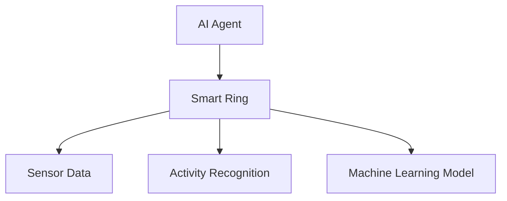

                 

### 第一部分：AI Agent与智能戒指的概述

#### 第1章：AI Agent与智能戒指的概念与背景

**背景介绍：**

随着人工智能（AI）技术的迅猛发展，AI Agent作为一种智能实体，已经逐渐成为智能系统中的重要组成部分。AI Agent，即人工智能代理，是指能够自主执行任务、适应环境变化并具备一定智能水平的计算机程序。智能戒指作为一种便携式智能设备，集成了多种传感器和计算能力，可以为用户提供便捷的智能服务。

**问题描述：**

智能戒指作为一种新兴的智能穿戴设备，其核心功能之一是利用AI Agent进行用户日常活动的追踪。为了深入理解这一功能，我们需要对AI Agent和智能戒指的基本概念、发展背景及其在智能戒指中的重要作用进行详细探讨。

**问题解决：**

在本章中，我们将首先介绍AI Agent的基本概念，包括其定义、分类及其在智能系统中的作用。随后，我们将详细探讨智能戒指的背景，包括其硬件设计、软件架构以及功能模块。最后，我们将重点阐述AI Agent在智能戒指中的重要作用，包括数据采集、预处理、活动识别以及机器学习模型等方面。

**边界与外延：**

AI Agent和智能戒指都是人工智能领域的热点话题。AI Agent的研究涉及机器学习、自然语言处理、计算机视觉等多个子领域，而智能戒指则涉及到传感器技术、嵌入式系统设计、用户界面设计等多个方面。因此，本章的内容将不仅限于基本概念和背景介绍，还将探讨两者的交叉领域和实际应用。

**概念结构与核心要素组成：**

1. **AI Agent：** 智能代理、自主性、适应性、智能性。
2. **智能戒指：** 硬件设计（传感器、处理器、电池）、软件架构（操作系统、应用程序）、功能模块（运动追踪、健康监控、社交互动）。
3. **AI Agent在智能戒指中的作用：** 数据采集、预处理、活动识别、机器学习模型。

### 核心概念与联系

**概念属性特征对比表格：**

| 特征类别 | AI Agent特征 | 智能戒指特征 |
| -------- | ------------ | ------------ |
| 定义     | 自主执行任务的计算机程序 | 集成传感器和计算能力的便携式设备 |
| 分类     | 主动型、被动型、半主动型 | 运动追踪、健康监控、社交互动 |
| 功能     | 数据采集、环境感知、决策执行 | 运动追踪、健康监控、社交互动 |
| 环境适应 | 自适应环境变化 | 需要环境适应 |

**ER实体关系图架构：**

在上述ER图结构中，AI Agent与Smart Ring之间是主从关系，Smart Ring通过传感器数据（C）收集用户活动，并通过活动识别（D）和机器学习模型（E）实现智能追踪功能。

**小结：**

本章介绍了AI Agent和智能戒指的基本概念、背景及其在智能戒指中的重要作用。通过对比分析，我们了解了两者之间的联系和差异。在后续章节中，我们将进一步探讨智能戒指中的AI Agent如何实现日常活动追踪，以及其在数据采集、预处理、活动识别和机器学习模型方面的具体应用。

### 接下来，我们将继续深入探讨智能戒指的设计与功能，为后续章节的内容奠定基础。

