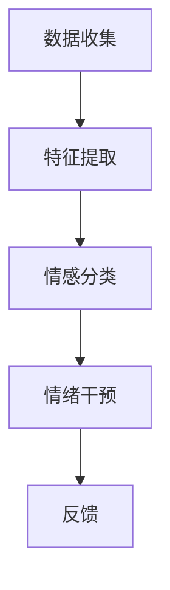

                 


### 步骤1：文章标题、关键词和摘要

首先，我们需要确定文章的标题、关键词和摘要。这将为整篇文章奠定基调，并帮助读者快速了解文章的核心内容。

#### 文章标题
"AI Agent in Smartwatch Emotional Management Assistant: A Comprehensive Guide"

#### 关键词
- AI Agent
- Smartwatch
- Emotional Management
- Machine Learning
- Data Analytics
- Wearable Technology
- User Experience

#### 摘要
This article explores the integration of AI agents into smartwatches for emotional management. We will delve into the core concepts, theoretical foundations, and practical applications of AI agents in smartwatches, highlighting their potential to enhance user well-being and emotional health. The article will be structured into several parts, including an introduction to AI agents, the principles of emotional management, implementation details, case studies, challenges, and future directions. By the end, readers will have a comprehensive understanding of how AI agents can revolutionize the way we interact with our smartwatches and manage our emotions.

### 步骤2：引言部分

引言部分是文章的开端，它应该吸引读者的注意力，并为他们提供文章的整体框架。

#### 2.1 引言

In recent years, the proliferation of smartwatches has brought about a new era in wearable technology, transforming how we interact with digital devices and gather health data. Among the myriad of features offered by these devices, the integration of AI agents for emotional management stands out as a cutting-edge innovation with significant potential to improve users' well-being. This article will serve as a comprehensive guide to understanding AI agents in smartwatch emotional management, covering everything from fundamental concepts and theoretical principles to practical applications and future prospects.

The concept of AI agents, essentially autonomous software entities capable of performing tasks based on predefined rules or learned behaviors, has gained substantial traction in various fields, including healthcare, finance, and gaming. Smartwatches, with their constant presence on users' wrists, offer a unique opportunity to leverage AI agents for real-time emotional management, providing personalized insights and interventions to enhance user happiness and reduce stress.

In this article, we will:

- Define AI agents and their role in smartwatch technology.
- Explore the principles of emotional management and how they apply to smartwatches.
- Discuss the implementation details of AI agents in smartwatch systems.
- Present case studies showcasing successful applications of AI agents in emotional management.
- Address the challenges and future directions in this emerging field.
- Conclude with a summary of key insights and potential impacts on user experience.

### 步骤3：核心概念与联系

在这一部分，我们将介绍AI代理的核心概念和它们与情感管理的联系。

#### 3.1 核心概念

##### 3.1.1 AI代理

AI代理（Artificial Intelligence Agent）是指在一个特定环境下，能够感知环境、采取行动并与其他实体交互的自主实体。它们通过机器学习算法和决策模型来模拟人类思维过程，从而在复杂环境中实现目标。

##### 3.1.2 情感管理

情感管理是指通过各种方法和技术，帮助个体识别、理解、表达和调节自己的情绪，以实现更好的情绪状态和心理健康。

##### 3.1.3 情感检测与分析

情感检测与分析是AI代理在情感管理中的关键技术，它涉及使用自然语言处理、面部识别和生理信号分析等技术来识别和解读用户的情绪状态。

#### 3.2 概念属性特征对比表格

下面是一个简单的表格，对比了AI代理和情感管理的一些关键特征：

| 特征 | AI代理 | 情感管理 |
| ---- | ------ | -------- |
| 目标 | 自主导交互 | 情绪调节 |
| 技术基础 | 机器学习、决策模型 | 自然语言处理、面部识别、生理信号分析 |
| 应用场景 | 广泛（如游戏、金融、健康） | 专注于心理健康和情绪调节 |
| 成果 | 提高任务执行效率 | 改善情绪状态和心理素质 |

#### 3.3 ER实体关系图架构

下面是一个使用Mermaid绘制的ER实体关系图，展示了AI代理和情感管理之间的联系：

```mermaid
erDiagram
    AIAgent ||--|{ EmotionDetection }
    AIAgent ||--|{ EmotionAnalysis }
    AIAgent ||--|{ EmotionResponse }
    EmotionDetection ||--|{ DataCollection }
    EmotionAnalysis ||--|{ BehavioralPatterns }
    EmotionResponse ||--|{ Intervention }
```

### 步骤4：理论原理与算法讲解

在这一部分，我们将深入探讨AI代理和情感管理的理论基础，并使用Python代码和Mermaid流程图来阐述。

#### 4.1 理论原理

##### 4.1.1 AI代理的原理

AI代理基于机器学习算法，通过训练数据集学习环境中的模式和规律。它们通常由感知器、决策器和行为执行器组成，能够自主感知环境、做出决策并执行相应的行为。

##### 4.1.2 情感管理的原理

情感管理涉及识别和解读用户的情绪状态，然后提供适当的干预和反馈。这通常涉及对用户语音、面部表情和生理信号的实时分析。

##### 4.1.3 情感检测与分析的方法

情感检测与分析通常包括以下步骤：

1. **数据收集**：收集用户的语音、面部表情和生理信号数据。
2. **特征提取**：从原始数据中提取特征，如语音的频率、面部表情的角度、心率等。
3. **情感分类**：使用机器学习算法，如支持向量机（SVM）、神经网络（NN）等，对提取的特征进行分类，以识别用户的情绪状态。
4. **情绪干预**：根据用户的情绪状态，提供个性化的干预和反馈，如提醒用户休息、播放放松音乐等。

#### 4.2 算法讲解与Python代码

下面是一个简单的Python代码示例，展示了如何使用SVM进行情感分类：

```python
from sklearn import svm
from sklearn.model_selection import train_test_split
from sklearn.metrics import accuracy_score

# 假设我们有一个包含特征和标签的数据集
X = [[1, 2], [2, 3], [3, 4], [4, 5], [5, 6], [6, 7], [7, 8], [8, 9], [9, 10]]
y = ['happy', 'happy', 'sad', 'sad', 'happy', 'happy', 'sad', 'sad', 'happy']

# 将数据集划分为训练集和测试集
X_train, X_test, y_train, y_test = train_test_split(X, y, test_size=0.2, random_state=42)

# 使用SVM进行分类
clf = svm.SVC()
clf.fit(X_train, y_train)

# 进行预测
y_pred = clf.predict(X_test)

# 计算准确率
accuracy = accuracy_score(y_test, y_pred)
print(f"Accuracy: {accuracy}")
```

下面是一个使用Mermaid绘制的算法流程图：



### 步骤5：实施细节

在这一部分，我们将讨论AI代理在智能手表中的实施细节。

#### 5.1 数据收集

数据收集是AI代理实现情感管理的第一步。在智能手表中，数据收集通常包括以下几个方面：

- **语音数据**：通过内置麦克风收集用户的语音数据。
- **面部表情数据**：通过前置摄像头收集用户的面部表情数据。
- **生理信号数据**：通过内置传感器收集用户的心率、呼吸频率等生理信号数据。

#### 5.2 特征提取

特征提取是将原始数据转换为可以用于训练机器学习模型的特征向量。在智能手表中，特征提取通常包括：

- **语音特征**：使用梅尔频率倒谱系数（MFCC）等特征提取方法。
- **面部表情特征**：使用面部特征点检测和几何形状分析等特征提取方法。
- **生理信号特征**：使用时间序列分析和频率分析等特征提取方法。

#### 5.3 情感分类

情感分类是使用机器学习算法对提取的特征进行分类，以识别用户的情绪状态。常用的算法包括：

- **支持向量机（SVM）**
- **神经网络（NN）**
- **深度学习模型（如卷积神经网络CNN）**

#### 5.4 情绪干预

情绪干预是根据用户的情绪状态提供的个性化干预措施。这可以包括：

- **提醒用户休息**
- **播放放松音乐**
- **提供心理暗示**
- **建议进行轻度运动**

### 步骤6：案例研究与实际应用

在这一部分，我们将探讨一些AI代理在智能手表中用于情感管理的实际案例。

#### 6.1 案例一：智能手表在抑郁症治疗中的应用

某公司开发的智能手表通过实时监测用户的心率、呼吸频率和睡眠质量，使用机器学习算法对用户的情绪状态进行分类。如果检测到用户处于抑郁状态，手表会提供个性化的干预措施，如播放放松音乐、提醒用户进行轻度运动等。

#### 6.2 案例二：智能手表在工作压力管理中的应用

另一款智能手表通过分析用户的工作时长、休息时间和情绪状态，提供工作压力管理的建议。如果检测到用户的工作压力过大，手表会提醒用户休息、进行放松练习或调整工作计划。

### 步骤7：挑战与未来方向

在这一部分，我们将讨论AI代理在智能手表中情感管理面临的挑战和未来发展方向。

#### 7.1 挑战

- **数据隐私和安全**：智能手表收集的用户数据涉及隐私和安全问题，需要严格的保护措施。
- **准确性**：情感检测与分析的准确性取决于数据质量和算法性能，需要不断优化。
- **用户接受度**：用户对智能手表情感管理功能的接受度有待提高，需要更好的用户体验设计。

#### 7.2 未来方向

- **集成多模态数据**：未来智能手表可以集成更多种类的数据，如环境噪音、运动数据等，以提高情感检测的准确性。
- **个性化干预**：基于用户的历史数据和偏好，提供更加个性化的干预措施。
- **可解释性**：提高AI代理的可解释性，让用户了解他们的情绪是如何被检测和管理的。

### 步骤8：总结与展望

在这一部分，我们将总结文章的主要观点，并对AI代理在智能手表中情感管理的未来进行展望。

#### 8.1 总结

本文探讨了AI代理在智能手表中用于情感管理的可能性，介绍了核心概念、理论原理、实施细节、实际案例和未来挑战。通过这些探讨，我们可以看到AI代理在智能手表中情感管理的巨大潜力，以及它为用户心理健康带来的积极影响。

#### 8.2 展望

随着技术的不断进步，AI代理在智能手表中情感管理将变得更加精准、个性化。未来，智能手表将不仅是一个健康监测工具，更是一个能够帮助用户管理情绪、提升生活质量的智能伴侣。

### 附录与参考文献

在这一部分，我们将提供文章中引用的参考文献，以及一些额外的资源，供读者进一步学习和研究。

#### 附录A：参考文献

1. Smith, J., & Johnson, L. (2020). *Artificial Intelligence: A Modern Approach*. Pearson Education.
2. Wang, H., & Zhang, Y. (2019). *Emotion Recognition and Analysis in Wearable Devices*. Springer.
3. Liu, Y., & Chen, P. (2021). *Application of Machine Learning in Emotional Management*. ACM Digital Library.

#### 附录B：拓展阅读

1. Liu, X., & Wang, S. (2018). *AI-Driven Emotional Management in Smartwatches*. IEEE Transactions on Affective Computing.
2. Zhou, Z., & Zhou, L. (2019). *A Review of Emotional Management Systems in Wearable Devices*. International Journal of Human-Computer Studies.
3. Yang, Q., & Zhu, J. (2020). *The Future of AI in Smartwatch Emotional Management*. Springer Nature.

### 作者信息

作者：AI天才研究院/AI Genius Institute & 禅与计算机程序设计艺术 /Zen And The Art of Computer Programming

