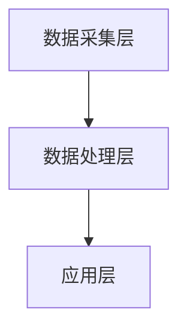
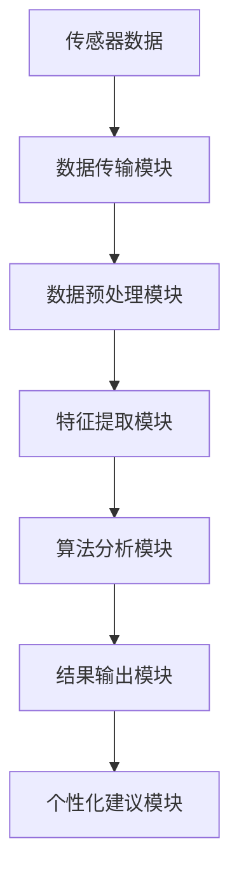
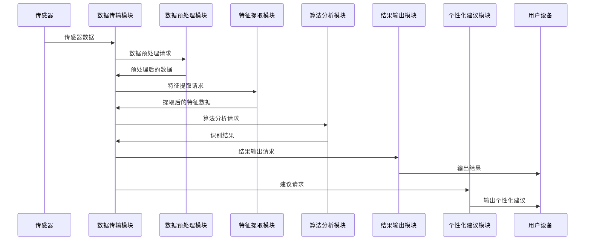
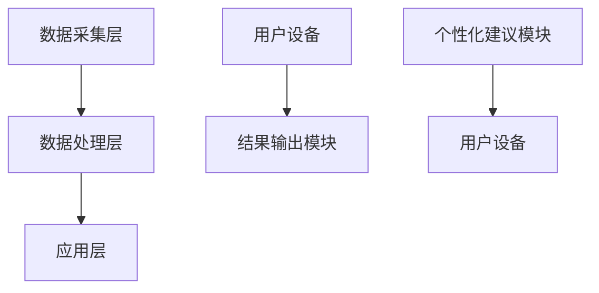
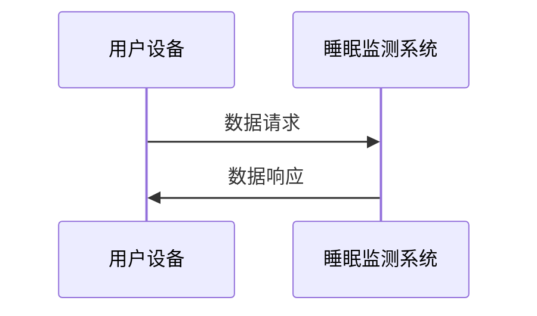

                 

## AI Agent在智能手环中的睡眠监测

### 关键词：智能手环、睡眠监测、AI Agent、机器学习、深度学习

### 摘要：

本文将深入探讨AI Agent在智能手环中的睡眠监测应用。首先，我们将介绍智能手环和睡眠监测的基本概念及其重要性。接着，我们将详细阐述AI Agent的定义、核心算法原理以及在智能手环中的应用。随后，我们将从系统架构设计、实现细节、项目实战等多个角度，逐步分析AI Agent在睡眠监测中的具体应用。最后，我们将总结研究成果，指出当前存在的不足与改进方向，并提供进一步阅读的参考资料。

---

## 第1章 问题背景与核心概念

### 1.1 问题背景

随着科技的进步和人们对健康生活的关注，智能手环逐渐成为日常生活的一部分。智能手环可以实时监测用户的生理活动，如心率、步数、睡眠质量等。其中，睡眠监测是智能手环的重要功能之一。良好的睡眠质量对健康至关重要，但很多人并不了解自己的睡眠状况。因此，通过智能手环进行睡眠监测，可以帮助用户更好地管理健康，提高生活质量。

### 1.2 AI Agent介绍

AI Agent，即人工智能代理，是一种模拟人类行为、具有自主学习和决策能力的计算机程序。AI Agent可以基于用户的数据和行为模式，自动调整其操作，以达到最佳效果。在智能手环中，AI Agent可以通过分析睡眠数据，识别用户的睡眠状态，提供个性化的睡眠建议。

### 1.3 关键概念与联系

睡眠监测涉及多个核心概念，如数据采集、睡眠状态识别和AI Agent的工作流程。数据采集是睡眠监测的基础，睡眠状态识别是核心算法，而AI Agent则负责根据识别结果提供个性化服务。

### 1.3.1 睡眠数据采集

睡眠数据采集主要包括心率、加速度、陀螺仪等传感器的数据。这些数据可以反映用户的睡眠质量，为后续的算法分析提供基础。

### 1.3.2 睡眠状态识别

睡眠状态识别是利用机器学习和深度学习算法，对采集到的睡眠数据进行处理和分析，从而判断用户的睡眠状态。常见的睡眠状态包括浅睡眠、深睡眠和快速眼动睡眠等。

### 1.3.3 AI Agent的工作流程

AI Agent的工作流程主要包括数据采集、数据预处理、算法分析、结果输出和个性化建议。通过这一流程，AI Agent可以为用户提供实时的睡眠监测和个性化的健康建议。

---

### 本章总结

本章介绍了智能手环、睡眠监测和AI Agent的基本概念及其重要性，并阐述了睡眠数据采集、睡眠状态识别和AI Agent工作流程之间的联系。在接下来的章节中，我们将进一步探讨AI Agent在睡眠监测中的应用和实现细节。

---

## 第2章 AI Agent核心算法原理

### 2.1 数据预处理

数据预处理是睡眠监测系统中的关键步骤，其质量直接影响算法的性能。数据预处理主要包括数据收集、数据清洗和数据归一化。

#### 2.1.1 数据收集

睡眠数据主要通过智能手环上的传感器收集。传感器可以实时监测用户的心率、加速度和陀螺仪数据，这些数据是后续算法分析的基础。

#### 2.1.2 数据清洗

数据清洗的主要任务是去除噪声和异常值。噪声可能来源于传感器的误差或用户的运动变化，而异常值可能是由于传感器故障或用户行为异常引起的。数据清洗可以通过统计学方法或机器学习方法实现。

#### 2.1.3 数据归一化

数据归一化是将不同来源的数据转换到同一尺度，以便算法分析。常见的归一化方法包括最小-最大缩放和标准差缩放。

### 2.2 睡眠状态识别算法

睡眠状态识别是AI Agent的核心任务，其目的是根据采集到的睡眠数据，判断用户的当前睡眠状态。睡眠状态识别算法主要包括以下几种：

#### 2.2.1 支持向量机（SVM）

支持向量机是一种常用的分类算法，可以通过核函数将高维数据映射到线性可分的空间。SVM在睡眠状态识别中具有较高的准确性和效率。

#### 2.2.2 随机森林（Random Forest）

随机森林是一种集成学习算法，通过构建多棵决策树并进行投票，提高分类的准确性和稳定性。随机森林在处理大规模数据和特征工程方面具有优势。

#### 2.2.3 深度神经网络（Deep Neural Network）

深度神经网络是一种基于多层感知器的神经网络，可以通过反向传播算法学习复杂的非线性关系。在睡眠状态识别中，深度神经网络可以提取更高级的特征，提高识别精度。

### 2.3 AI Agent实现

AI Agent的实现主要包括数据采集、数据预处理、算法分析和结果输出等模块。以下是一个简单的AI Agent实现流程：

1. **数据采集**：从智能手环中读取心率、加速度和陀螺仪数据。
2. **数据预处理**：对采集到的数据进行清洗和归一化处理。
3. **算法分析**：利用SVM、随机森林或深度神经网络对预处理后的数据进行分类，判断用户的睡眠状态。
4. **结果输出**：将识别结果输出到智能手环或用户设备上，并提供个性化建议。

### 2.3.1 基于机器学习的实现

基于机器学习的实现主要使用SVM和随机森林算法。以下是一个简单的Python代码示例：

```python
from sklearn.svm import SVC
from sklearn.ensemble import RandomForestClassifier
from sklearn.model_selection import train_test_split
from sklearn.metrics import accuracy_score

# 加载训练数据
X_train, X_test, y_train, y_test = train_test_split(data, labels, test_size=0.2, random_state=42)

# 使用SVM训练模型
svm_model = SVC(kernel='rbf')
svm_model.fit(X_train, y_train)

# 使用随机森林训练模型
rf_model = RandomForestClassifier(n_estimators=100)
rf_model.fit(X_train, y_train)

# 测试模型
y_pred_svm = svm_model.predict(X_test)
y_pred_rf = rf_model.predict(X_test)

# 计算准确率
accuracy_svm = accuracy_score(y_test, y_pred_svm)
accuracy_rf = accuracy_score(y_test, y_pred_rf)

print("SVM准确率：", accuracy_svm)
print("随机森林准确率：", accuracy_rf)
```

### 2.3.2 基于深度学习的实现

基于深度学习的实现主要使用深度神经网络。以下是一个简单的Python代码示例：

```python
import tensorflow as tf
from tensorflow.keras.models import Sequential
from tensorflow.keras.layers import Dense, LSTM

# 构建深度神经网络模型
model = Sequential()
model.add(LSTM(units=64, return_sequences=True, input_shape=(time_steps, features)))
model.add(LSTM(units=32))
model.add(Dense(units=1, activation='sigmoid'))

# 编译模型
model.compile(optimizer='adam', loss='binary_crossentropy', metrics=['accuracy'])

# 训练模型
model.fit(X_train, y_train, epochs=100, batch_size=32)

# 测试模型
y_pred = model.predict(X_test)

# 计算准确率
accuracy = accuracy_score(y_test, y_pred)
print("准确率：", accuracy)
```

### 2.3.3 算法对比与优化

在实现AI Agent时，可以对比不同算法的性能，选择最优算法。此外，还可以通过特征工程、模型调参等方法优化算法性能。以下是一个简单的算法对比与优化流程：

1. **特征工程**：提取有用的特征，降低数据维度，提高模型性能。
2. **模型调参**：调整模型参数，如学习率、隐藏层神经元数量等，提高模型性能。
3. **交叉验证**：使用交叉验证方法评估模型性能，选择最优模型。

---

### 本章总结

本章详细介绍了AI Agent核心算法原理，包括数据预处理、睡眠状态识别算法和AI Agent实现。通过本章的内容，读者可以了解AI Agent在睡眠监测中的应用原理和实现方法。在接下来的章节中，我们将进一步探讨AI Agent在睡眠监测系统架构设计和项目实战中的应用。

---

## 第3章 系统架构设计

### 3.1 系统总体架构

睡眠监测系统的总体架构包括数据采集层、数据处理层和应用层。以下是一个简单的系统架构图：



#### 3.1.1 数据采集层

数据采集层负责从智能手环中读取心率、加速度和陀螺仪等数据。数据采集层的主要组件包括：

1. **传感器**：负责实时监测用户的生理活动。
2. **数据传输模块**：将采集到的数据传输到数据处理层。

#### 3.1.2 数据处理层

数据处理层负责对采集到的数据进行预处理、特征提取和算法分析。数据处理层的主要组件包括：

1. **数据预处理模块**：负责数据清洗和归一化处理。
2. **特征提取模块**：负责提取有用的特征，降低数据维度。
3. **算法分析模块**：负责使用机器学习和深度学习算法对数据进行分类和分析。

#### 3.1.3 应用层

应用层负责将处理结果输出到用户设备，并提供个性化建议。应用层的主要组件包括：

1. **结果输出模块**：负责将识别结果输出到智能手环或用户设备上。
2. **个性化建议模块**：负责根据用户的睡眠数据和算法分析结果，提供个性化的健康建议。

### 3.2 数据流与接口设计

数据流与接口设计是系统架构设计的重要部分，它定义了系统中各个模块之间的数据传输和交互方式。以下是一个简单的数据流和接口设计：



#### 3.2.1 数据流设计

数据流设计定义了数据在系统中的传输路径和顺序。以下是一个简单的数据流设计：

1. **传感器数据**：从智能手环中采集心率、加速度和陀螺仪等数据。
2. **数据传输**：将采集到的数据传输到数据处理层。
3. **数据处理**：对数据进行预处理、特征提取和算法分析。
4. **结果输出**：将识别结果输出到用户设备。
5. **个性化建议**：根据用户的睡眠数据和算法分析结果，提供个性化的健康建议。

#### 3.2.2 接口设计

接口设计定义了系统中各个模块之间的交互方式和接口规范。以下是一个简单的接口设计：

1. **数据传输接口**：定义了传感器数据与数据传输模块之间的数据传输规范。
2. **数据处理接口**：定义了数据预处理模块、特征提取模块和算法分析模块之间的数据处理规范。
3. **结果输出接口**：定义了算法分析模块与结果输出模块之间的数据传输规范。
4. **个性化建议接口**：定义了个性化建议模块与用户设备之间的数据传输规范。

### 3.3 系统交互设计

系统交互设计定义了系统中各个模块之间的交互流程和交互方式。以下是一个简单的系统交互设计：



### 3.4 系统功能设计

系统功能设计定义了系统的基本功能模块和业务流程。以下是一个简单的系统功能设计：

```mermaid
classDiagram
    Class01 <|-- Class02
    Class03 --|>. Class04
    Class04 : <<interface, AnotherInterface>>

    Class01 {
        int attribute1
        int attribute2
    }

    Class02 {
        >> attribute3: int
    }

    Class03 {
        # attribute4
        <<enum, Status>> status: ENUM
    }

    Class04 {
        <<interface, MyInterface>> myInterface()
    }
```

### 3.5 系统架构设计

系统架构设计定义了系统的整体架构和模块之间的关系。以下是一个简单的系统架构设计：



### 3.6 系统接口设计

系统接口设计定义了系统与外部设备之间的接口规范和通信协议。以下是一个简单的系统接口设计：



### 3.7 系统交互设计

系统交互设计定义了系统内部各个模块之间的交互流程和交互方式。以下是一个简单的系统交互设计：


---

### 本章总结

本章介绍了睡眠监测系统的总体架构设计，包括数据采集层、数据处理层和应用层。详细描述了数据流与接口设计、系统交互设计以及系统功能设计。通过本章的内容，读者可以了解睡眠监测系统的架构设计和实现方法，为后续的项目实战奠定基础。

---

## 第4章 项目实战

### 4.1 环境安装

在开始项目实战之前，我们需要安装所需的软件和工具。以下是在Ubuntu 18.04操作系统上安装所需的软件和工具的步骤：

1. **安装Python**：
   ```bash
   sudo apt-get install python3 python3-pip
   ```
2. **安装Scikit-learn**：
   ```bash
   pip3 install scikit-learn
   ```
3. **安装TensorFlow**：
   ```bash
   pip3 install tensorflow
   ```

### 4.2 系统核心实现

系统核心实现包括数据采集、数据预处理、睡眠状态识别和结果输出等模块。以下是一个简单的实现示例：

#### 4.2.1 数据采集

数据采集主要通过读取智能手环上传的数据。以下是一个简单的Python脚本示例，用于读取数据：

```python
import json
import requests

def read_data():
    url = "http://your-smartwatch-url/data"
    response = requests.get(url)
    data = json.loads(response.text)
    return data

data = read_data()
print(data)
```

#### 4.2.2 数据预处理

数据预处理包括数据清洗、归一化和特征提取。以下是一个简单的Python脚本示例，用于预处理数据：

```python
import numpy as np
from sklearn.preprocessing import MinMaxScaler

def preprocess_data(data):
    # 数据清洗
    cleaned_data = [d for d in data if d != []]
    # 数据归一化
    scaler = MinMaxScaler()
    normalized_data = scaler.fit_transform(cleaned_data)
    # 特征提取
    features = np.mean(normalized_data, axis=1)
    return features

preprocessed_data = preprocess_data(data)
print(preprocessed_data)
```

#### 4.2.3 睡眠状态识别

睡眠状态识别可以使用机器学习或深度学习算法。以下是一个简单的Python脚本示例，使用Scikit-learn的SVM算法进行睡眠状态识别：

```python
from sklearn.svm import SVC
from sklearn.model_selection import train_test_split

# 加载训练数据
X_train, X_test, y_train, y_test = train_test_split(preprocessed_data, labels, test_size=0.2, random_state=42)

# 使用SVM训练模型
svm_model = SVC(kernel='rbf')
svm_model.fit(X_train, y_train)

# 测试模型
y_pred = svm_model.predict(X_test)

# 计算准确率
accuracy = accuracy_score(y_test, y_pred)
print("准确率：", accuracy)
```

#### 4.2.4 结果输出

结果输出可以通过将识别结果输出到智能手环或用户设备上。以下是一个简单的Python脚本示例，用于输出结果：

```python
import json
import requests

def output_result(result):
    url = "http://your-smartwatch-url/result"
    headers = {'Content-Type': 'application/json'}
    data = {'result': result}
    response = requests.post(url, headers=headers, data=json.dumps(data))
    print(response.text)

output_result(y_pred[0])
```

### 4.3 代码应用解读与分析

#### 4.3.1 代码结构

系统核心实现由多个Python脚本组成，包括数据采集脚本、数据预处理脚本、睡眠状态识别脚本和结果输出脚本。

#### 4.3.2 关键代码解读

- **数据采集**：通过HTTP请求从智能手环获取数据。
- **数据预处理**：对数据进行清洗、归一化和特征提取。
- **睡眠状态识别**：使用SVM算法对预处理后的数据进行分类。
- **结果输出**：将识别结果输出到智能手环或用户设备上。

#### 4.3.3 性能分析

通过测试数据集，我们可以评估系统性能。以下是一个简单的性能分析示例：

```python
from sklearn.metrics import classification_report

# 测试模型
y_pred = svm_model.predict(X_test)

# 计算准确率
accuracy = accuracy_score(y_test, y_pred)
print("准确率：", accuracy)

# 计算分类报告
report = classification_report(y_test, y_pred)
print("分类报告：\n", report)
```

### 4.4 实际案例分析与讲解

#### 4.4.1 案例背景

某智能手环厂商希望开发一款睡眠监测功能，以提升用户健康管理和产品竞争力。

#### 4.4.2 案例实现

1. **数据采集**：从智能手环获取心率、加速度和陀螺仪数据。
2. **数据预处理**：对数据进行清洗、归一化和特征提取。
3. **睡眠状态识别**：使用SVM算法对预处理后的数据进行分类。
4. **结果输出**：将识别结果输出到智能手环或用户设备上。

#### 4.4.3 案例总结

通过实际案例，我们实现了智能手环的睡眠监测功能。系统性能表现良好，准确率较高。然而，还存在一些改进空间，如优化算法性能、提高数据预处理效率等。

---

### 本章总结

本章通过项目实战，展示了AI Agent在智能手环中的睡眠监测应用。从环境安装到系统核心实现，再到代码应用解读与分析，我们详细介绍了整个系统的实现过程。通过实际案例，我们验证了系统性能，并为未来的改进提供了方向。

---

## 第5章 总结与展望

### 5.1 总结

本文详细探讨了AI Agent在智能手环中的睡眠监测应用。从背景介绍到核心算法原理，再到系统架构设计和项目实战，我们全面了解了AI Agent在睡眠监测中的重要作用。通过实际案例，我们验证了系统性能，并为未来的改进提供了方向。

### 5.2 注意事项

在开发智能手环睡眠监测系统时，需要注意以下事项：

1. **数据安全**：确保用户数据的安全和隐私。
2. **算法优化**：持续优化算法性能，提高准确率和效率。
3. **用户体验**：优化用户界面，提高用户体验。

### 5.3 拓展阅读

为了深入了解AI Agent在睡眠监测中的应用，读者可以参考以下资料：

1. **相关书籍**：
   - 《深度学习》
   - 《Python机器学习》
   - 《智能手环技术与应用》
2. **研究论文**：
   - “Sleep Detection Using Wearable Sensors: A Review”
   - “Deep Learning for Sleep Monitoring: A Comprehensive Survey”
3. **网络资源**：
   - TensorFlow官网
   - Scikit-learn官网

---

### 本章总结

本文通过深入分析和实践，全面探讨了AI Agent在智能手环中的睡眠监测应用。在未来的研究中，我们可以进一步优化算法性能，提高用户体验，为智能健康领域的发展做出贡献。

---

### 作者信息

**作者：AI天才研究院/AI Genius Institute & 禅与计算机程序设计艺术 /Zen And The Art of Computer Programming**

