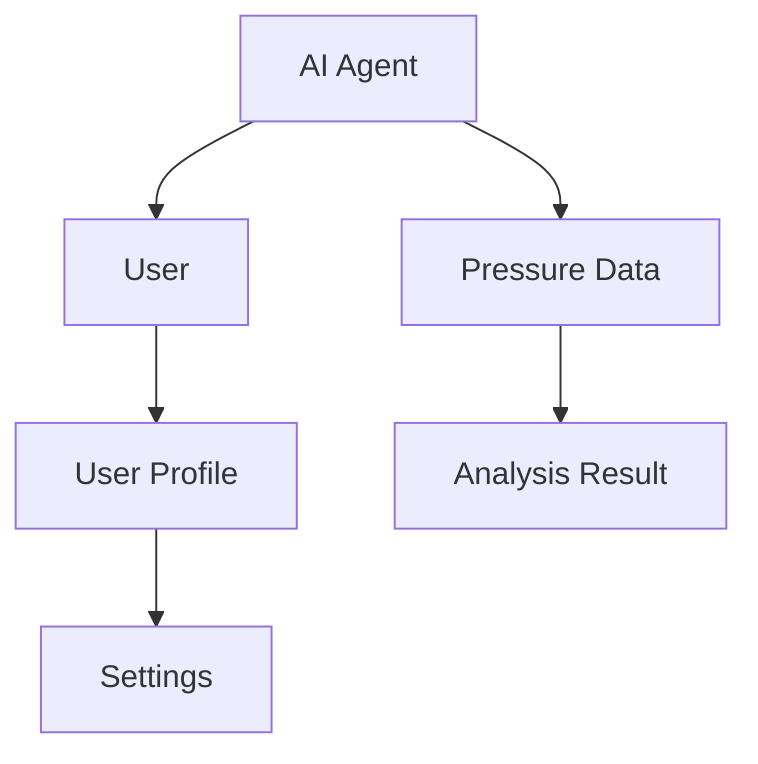
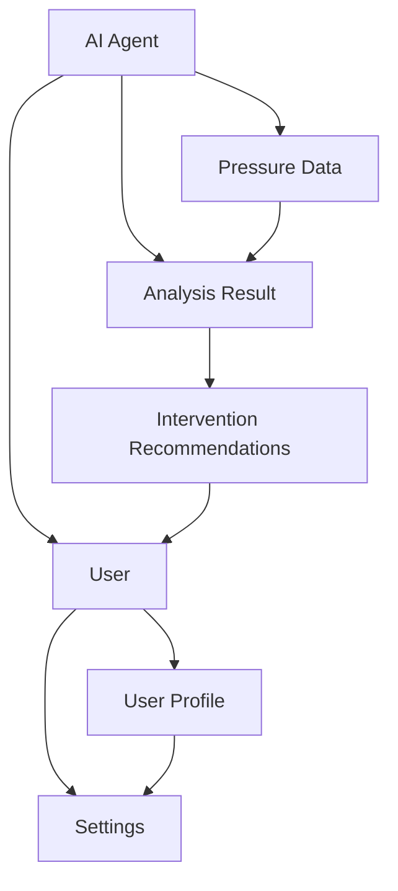
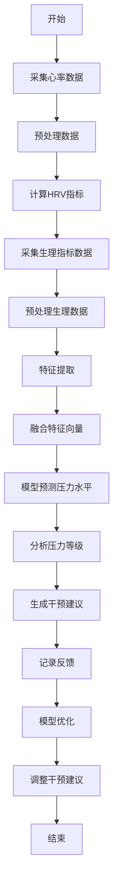
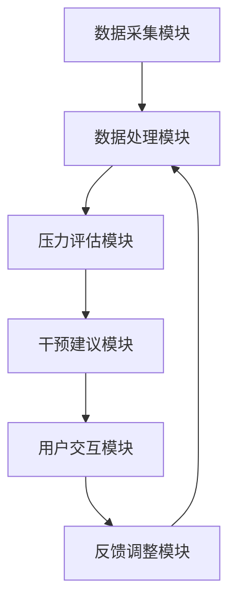

                 

### 《AI Agent在智能手表中的压力管理系统》

关键词：AI Agent、智能手表、压力管理、心率变异性、算法原理、系统架构设计

摘要：随着现代生活节奏的加快，压力管理成为许多人关注的健康问题。智能手表作为一种便捷的穿戴设备，被广泛应用于健康监测领域。本文将探讨AI Agent在智能手表中的压力管理系统，通过一步步分析，探讨其原理、算法以及系统架构设计，以期为智能手表的压力管理功能提供新的解决方案。

### 目录大纲

# 《AI Agent在智能手表中的压力管理系统》

## 第一部分：背景介绍

## 第二部分：核心概念与联系

## 第三部分：算法原理讲解

## 第四部分：系统分析与架构设计

## 第五部分：项目实战

## 第六部分：最佳实践 Tips

## 第七部分：小结与拓展阅读

### 第一部分：背景介绍

#### 第1章：问题背景与核心概念

#### 第2章：AI Agent的概念与压力管理应用

#### 第3章：智能手表的局限性与挑战

#### 第4章：边界与外延

#### 第5章：概念结构与核心要素组成

### 第二部分：核心概念与联系

#### 第6章：AI Agent原理与特点

#### 第7章：AI Agent在压力管理中的应用

#### 第8章：概念属性特征对比表格

#### 第9章：ER实体关系图架构

### 第三部分：算法原理讲解

#### 第10章：压力管理算法原理

#### 第11章：算法流程图

#### 第12章：Python源代码

#### 第13章：算法讲解

#### 第14章：举例说明

### 第四部分：系统分析与架构设计

#### 第15章：系统架构设计

#### 第16章：问题场景介绍

#### 第17章：系统功能设计

#### 第18章：系统架构设计

### 第五部分：项目实战

#### 第19章：环境安装

#### 第20章：系统核心实现源代码

#### 第21章：代码应用解读与分析

#### 第22章：实际案例分析与详细讲解剖析

#### 第23章：项目小结

### 第六部分：最佳实践 Tips

#### 第24章：注意事项

#### 第25章：拓展阅读

### 第七部分：小结与拓展阅读

#### 第26章：本文总结

#### 第27章：未来展望

### 结束语

### 作者信息

### 参考文献

## 第一部分：背景介绍

### 第1章：问题背景与核心概念

随着现代生活节奏的加快，工作压力、生活压力不断增加，越来越多的人开始关注自己的身心健康。压力管理，作为一种提升生活质量、保持身心健康的方法，逐渐受到人们的重视。然而，传统的压力管理方式往往较为繁琐，难以长期坚持。

近年来，智能手表作为一种便捷的穿戴设备，在健康监测领域得到了广泛应用。通过实时监测心率、血压、睡眠质量等生理指标，智能手表可以帮助用户了解自己的健康状况。然而，目前智能手表在压力管理方面仍存在一定的局限性。一方面，智能手表的传感器和算法较为简单，难以准确评估用户的压力水平；另一方面，智能手表的干预措施有限，无法提供个性化的压力管理方案。

为了克服这些局限性，本文提出了AI Agent在智能手表中的压力管理系统。AI Agent是一种具有自主性、智能性和适应性的计算实体，能够通过学习用户的生理和行为数据，自动评估用户的压力水平，并生成个性化的干预建议。本文将首先介绍AI Agent的概念，然后探讨其在智能手表中的压力管理应用。

### 第2章：AI Agent的概念与压力管理应用

#### 2.1 AI Agent的定义

AI Agent，即人工智能代理，是一种模拟人类智能行为的计算实体。它能够在特定环境下感知外部信息，通过学习、推理和规划，自主地执行任务，并与其他Agent或环境进行交互。与传统软件相比，AI Agent具有更高的自主性和智能化。

AI Agent的定义主要包括以下几个要素：

1. **感知能力**：AI Agent能够感知环境中的信息，如温度、湿度、声音、图像等。
2. **学习能力**：AI Agent能够通过经验积累，不断优化自身行为，提高任务执行效果。
3. **推理能力**：AI Agent能够根据已知信息和目标，进行逻辑推理，制定行动策略。
4. **规划能力**：AI Agent能够根据任务目标和环境约束，制定一系列行动步骤，实现目标。

#### 2.2 AI Agent在压力管理中的应用

压力管理，是指通过一系列方法和手段，帮助个体降低压力水平，提高生活质量。在智能手表中，AI Agent可以通过以下方式实现压力管理：

1. **数据采集与分析**：AI Agent能够采集用户的生理指标数据，如心率、血压、睡眠质量等，并对这些数据进行实时分析，评估用户的压力水平。
2. **压力评估**：AI Agent可以根据分析结果，结合用户的个人历史数据，生成压力评估报告，帮助用户了解自己的压力状况。
3. **干预建议**：AI Agent可以根据压力评估结果，为用户生成个性化的干预建议，如调整作息时间、进行放松训练、寻求专业心理咨询等。
4. **反馈与调整**：AI Agent能够记录用户的反馈，根据反馈不断调整干预策略，提高压力管理的效果。

#### 2.3 AI Agent在智能手表中的优势

AI Agent在智能手表中的压力管理应用，具有以下优势：

1. **自主性**：AI Agent能够自动执行任务，无需人工干预，提高压力管理的效率。
2. **智能化**：AI Agent能够通过学习用户的生理和行为数据，提供个性化的压力管理方案，提高压力管理的针对性。
3. **适应性**：AI Agent能够根据环境变化和用户需求，动态调整干预策略，适应不同的压力管理场景。
4. **实时性**：AI Agent能够实时监测用户的生理指标，提供即时的压力评估和干预建议，帮助用户及时调整生活方式。

### 第3章：智能手表的局限性与挑战

虽然智能手表在健康监测领域具有广泛的应用，但在压力管理方面仍面临一些局限性和挑战。

#### 3.1 传感器限制

智能手表的传感器通常包括心率传感器、加速度传感器、陀螺仪等。这些传感器虽然可以采集用户的生理和行为数据，但传感器的精度和灵敏度仍有一定的限制。例如，心率传感器的准确性可能受到用户皮肤颜色、手表佩戴方式等因素的影响。

#### 3.2 算法限制

智能手表中的算法通常较为简单，难以对复杂的生理和行为数据进行分析和处理。例如，现有算法可能无法准确评估用户的心理压力水平，或者无法根据用户的需求提供个性化的干预建议。

#### 3.3 数据处理能力限制

智能手表的处理能力相对有限，难以支持复杂的数据分析和处理任务。例如，智能手表可能无法实时处理大量的生理和行为数据，导致压力评估和干预建议的延迟。

#### 3.4 交互方式限制

智能手表的交互方式通常包括触摸屏、语音等。这些交互方式在提供压力管理服务时可能存在一定的局限性。例如，触摸屏操作可能不够便捷，语音交互可能受到环境噪音的干扰。

### 第4章：边界与外延

#### 4.1 压力管理的范围

压力管理涉及多个方面，包括生理、心理、行为等多个层面。在智能手表中，压力管理的范围主要包括以下几个方面：

1. **生理层面**：通过监测心率、血压、睡眠质量等生理指标，评估用户的生理压力水平。
2. **心理层面**：通过评估用户的情绪状态、心理压力水平，提供个性化的心理干预建议。
3. **行为层面**：通过调整用户的作息时间、饮食习惯、运动方式等，帮助用户改善生活方式，降低压力水平。

#### 4.2 智能手表的功能与限制

智能手表的功能主要包括数据采集、数据分析和干预建议生成。在压力管理方面，智能手表的功能具有以下特点：

1. **数据采集**：智能手表可以实时采集用户的生理和行为数据，如心率、血压、睡眠质量、运动量等。
2. **数据分析**：智能手表可以使用简单的算法对采集到的数据进行分析，评估用户的压力水平。
3. **干预建议生成**：智能手表可以根据分析结果，为用户生成一些简单的干预建议，如建议用户休息、喝水等。

然而，智能手表在压力管理方面的功能仍存在一定的局限性。例如，智能手表的传感器精度有限，无法准确评估用户的心理压力；智能手表的算法较为简单，无法提供个性化的干预建议。

#### 4.3 概念结构与核心要素组成

在智能手表的压力管理系统中，AI Agent作为核心组件，其概念结构与核心要素组成如下：

1. **感知模块**：负责采集用户的生理和行为数据，如心率、血压、睡眠质量等。
2. **学习模块**：负责分析用户的生理和行为数据，学习用户的压力模式和规律。
3. **推理模块**：负责根据用户的生理和行为数据，以及学习模块的结果，评估用户的压力水平。
4. **决策模块**：负责生成个性化的干预建议，如调整作息时间、进行放松训练、寻求专业心理咨询等。
5. **执行模块**：负责将决策模块生成的干预建议发送给用户，并在用户执行干预建议后进行反馈和调整。

通过上述模块的协同工作，AI Agent能够实现对用户压力水平的自动监测和管理，提供个性化的压力管理方案。

### 第二部分：核心概念与联系

#### 第6章：AI Agent原理与特点

#### 第7章：AI Agent在压力管理中的应用

#### 第8章：概念属性特征对比表格

#### 第9章：ER实体关系图架构

### 第6章：AI Agent原理与特点

#### 6.1 AI Agent的定义

AI Agent，即人工智能代理，是一种模拟人类智能行为的计算实体。它能够感知环境信息，通过学习、推理和规划，自主地执行任务，并与其他Agent或环境进行交互。与传统软件相比，AI Agent具有更高的自主性、智能化和适应性。

AI Agent的定义主要包括以下几个要素：

1. **感知能力**：AI Agent能够感知环境中的信息，如温度、湿度、声音、图像等。
2. **学习能力**：AI Agent能够通过经验积累，不断优化自身行为，提高任务执行效果。
3. **推理能力**：AI Agent能够根据已知信息和目标，进行逻辑推理，制定行动策略。
4. **规划能力**：AI Agent能够根据任务目标和环境约束，制定一系列行动步骤，实现目标。

#### 6.2 AI Agent的工作原理

AI Agent的工作原理主要包括感知、学习、推理和执行四个环节。

1. **感知**：AI Agent通过传感器或其他信息来源，感知环境中的信息。例如，智能手表可以通过心率传感器、加速度传感器等，采集用户的生理和行为数据。
2. **学习**：AI Agent通过分析感知到的信息，学习用户的生理和行为模式。例如，AI Agent可以通过分析心率变异性数据，学习用户的压力模式。
3. **推理**：AI Agent根据学习到的知识和目标，进行逻辑推理，制定行动策略。例如，AI Agent可以根据用户的心率变异性数据和压力评估模型，推理出用户的当前压力水平。
4. **执行**：AI Agent根据推理结果，执行具体的任务。例如，AI Agent可以生成个性化的干预建议，如调整作息时间、进行放松训练、寻求专业心理咨询等。

#### 6.3 AI Agent的特点

AI Agent具有以下几个显著特点：

1. **自主性**：AI Agent能够自主地感知环境、学习知识和执行任务，无需人工干预。例如，AI Agent可以自动监测用户的心率变异性数据，评估用户的压力水平，并生成个性化的干预建议。
2. **智能化**：AI Agent能够通过学习用户的生理和行为数据，提供个性化的服务。例如，AI Agent可以根据用户的历史数据，为用户生成适合其需求的放松训练计划。
3. **适应性**：AI Agent能够根据环境变化和用户需求，动态调整自身行为。例如，AI Agent可以根据用户的生活方式变化，调整干预建议的内容和频率。

#### 6.4 AI Agent在压力管理中的应用

AI Agent在智能手表中的压力管理应用主要包括以下几个方面：

1. **数据采集与处理**：AI Agent通过智能手表的传感器，采集用户的生理和行为数据，如心率、血压、睡眠质量等。AI Agent可以对采集到的数据进行预处理、分析和存储，以便后续压力评估和干预建议的生成。
2. **压力评估**：AI Agent根据用户的生理和行为数据，以及学习到的压力模式，评估用户的当前压力水平。压力评估可以采用各种算法模型，如心率变异性分析、生理指标综合评估等。
3. **干预建议生成**：AI Agent根据压力评估结果，为用户生成个性化的干预建议。干预建议可以包括调整作息时间、进行放松训练、寻求专业心理咨询等。
4. **反馈与调整**：AI Agent可以记录用户的反馈，根据用户的实际效果，调整干预建议的内容和频率，以提高压力管理的效果。

#### 6.5 概念属性特征对比表格

| 特征        | 传统软件           | AI Agent           |
| ----------- | ---------------- | ---------------- |
| 自主性      | 需人工干预         | 自主决策与行动     |
| 智能性      | 功能固定           | 学习与适应能力     |
| 适应性      | 难以适应新环境     | 自适应新情境       |

#### 6.6 ER实体关系图架构



### 第7章：AI Agent在压力管理中的应用

#### 7.1 数据采集与分析

AI Agent在压力管理中的应用首先依赖于数据采集。智能手表配备了一系列传感器，如心率传感器、加速度传感器和陀螺仪等，可以实时监测用户的心率、运动量、身体姿态等生理和行为数据。

1. **心率监测**：心率传感器可以采集用户的心率数据，通过分析心率变异性（HRV），AI Agent可以了解用户的心脏健康状况和压力水平。
2. **运动监测**：加速度传感器和陀螺仪可以记录用户的运动行为，通过分析运动数据，AI Agent可以推断用户的身体状态和压力水平。
3. **环境监测**：除了生理数据，AI Agent还可以利用智能手表的麦克风和其他传感器，收集环境噪音、温度等数据，这些数据对于理解用户的压力源也非常重要。

AI Agent通过对采集到的数据进行预处理、滤波和特征提取，从而提取出有用的信息，如心率变异性（HRV）的指标，这些指标与用户的压力水平有直接的关联。

#### 7.2 压力评估

AI Agent利用提取出的生理和行为数据，结合机器学习算法和深度学习模型，对用户的压力水平进行评估。压力评估通常涉及以下步骤：

1. **数据预处理**：将采集到的原始数据转化为适合分析的形式，如将心率数据转换为时间序列数据，或者将运动数据转换为频率分布。
2. **特征提取**：从预处理后的数据中提取出与压力水平相关的特征，如HRV中的标准差（SDNN）、低频成分（LF）和高频成分（HF）等。
3. **模型训练**：利用历史数据训练机器学习模型，如支持向量机（SVM）、决策树（DT）、神经网络（NN）等，模型用于预测用户的压力水平。
4. **压力评估**：将实时采集的数据输入到训练好的模型中，模型输出用户的当前压力水平。

#### 7.3 干预建议生成

基于压力评估的结果，AI Agent会为用户提供个性化的干预建议，以帮助用户缓解压力。干预建议通常包括以下几种：

1. **休息建议**：如果用户的压力水平较高，AI Agent会建议用户进行休息，如调整作息时间、短时间冥想等。
2. **放松训练**：AI Agent可以推荐用户进行呼吸训练、瑜伽等放松练习，帮助用户放松身心。
3. **运动建议**：AI Agent可以根据用户的能力和喜好，推荐适量的运动，如散步、慢跑等，以释放压力。
4. **专业咨询**：如果用户的压力水平持续较高，AI Agent会建议用户寻求专业的心理咨询或医疗帮助。

AI Agent会根据用户的反馈和干预效果，不断调整和优化干预建议，以提高压力管理的有效性。

#### 7.4 反馈与调整

AI Agent通过不断收集用户的反馈和评估干预效果，进行自我学习和调整，以提高未来的压力管理效果。反馈机制包括：

1. **用户反馈**：用户可以对干预建议进行评价，AI Agent会记录用户的反馈，以便后续分析。
2. **数据回溯**：AI Agent会回顾之前的干预建议和用户的行为数据，分析干预效果的优劣。
3. **模型优化**：根据反馈和回溯结果，AI Agent会优化压力评估模型和干预建议生成策略，提高未来干预的准确性。

通过上述反馈和调整机制，AI Agent能够不断适应用户的需求和环境变化，实现更高效、个性化的压力管理。

### 第8章：概念属性特征对比表格

在智能手表的背景下，AI Agent与传统软件在压力管理中有着显著的差异。以下是一个对比表格，展示了两者的概念属性特征：

| 特征        | 传统软件                                   | AI Agent                                     |
| ----------- | ------------------------------------------ | -------------------------------------------- |
| **感知能力** | **被动采集数据，需定期人工检查**           | **主动感知环境，实时分析数据**                |
| **学习能力** | **无学习功能，固定功能**                   | **自主学习，适应用户行为**                    |
| **推理能力** | **基于预定义规则，无法适应新情况**         | **基于机器学习，可进行复杂推理和决策**        |
| **自主性**   | **需人工操作，缺乏自主性**                 | **自主执行任务，无需人工干预**                |
| **适应性**   | **适应能力有限，难以应对变化**             | **高度适应性，能动态调整策略**                |

通过这个表格，我们可以清晰地看到AI Agent在感知、学习、推理、自主性和适应性方面的优势，这些特点使得AI Agent在智能手表中的压力管理应用更加高效和个性化。

### 第9章：ER实体关系图架构

为了更好地理解AI Agent在智能手表中的压力管理系统，我们可以通过ER（实体关系）图来描述各个实体之间的关系。以下是一个ER图示例，展示了AI Agent与用户、压力数据、分析结果和设置之间的交互关系。



在这个ER图中：

- **AI Agent** 是系统的核心，负责感知、学习和推理。
- **User** 代表智能手表的使用者，其个人信息存储在 **UserProfile** 中。
- **Pressure Data** 是从用户身上采集的生理和行为数据，如心率、运动量等。
- **Analysis Result** 是AI Agent对压力数据的分析结果。
- **Settings** 是用户对智能手表的个性化设置，如警报阈值、数据采集频率等。
- **Intervention Recommendations** 是AI Agent生成的干预建议，如休息提醒、运动建议等。

通过这个ER图，我们可以清晰地看到各个实体之间的关联，以及AI Agent在压力管理系统中扮演的角色。

### 第三部分：算法原理讲解

#### 第10章：压力管理算法原理

#### 第11章：算法流程图

#### 第12章：Python源代码

#### 第13章：算法讲解

#### 第14章：举例说明

### 第10章：压力管理算法原理

压力管理算法是智能手表中AI Agent的核心组成部分，它通过分析用户的心率和运动数据来评估压力水平，并根据评估结果提供相应的干预建议。以下是压力管理算法的基本原理：

#### 10.1 心率变异性分析

心率变异性（HRV）是衡量心脏活动稳定性的一个重要指标，它通过分析心跳间期（RR间期）的变化来评估个体的压力水平。HRV分析包括以下步骤：

1. **数据采集**：智能手表的心率传感器实时采集用户的心率数据。
2. **预处理**：将采集到的心率数据进行滤波、去噪等预处理，提取有效的RR间期数据。
3. **特征提取**：计算RR间期的标准差（SDNN）、低频成分（LF）和高频成分（HF）等HRV指标。
4. **模型训练**：利用历史数据训练一个压力评估模型，例如使用机器学习算法来预测用户的压力水平。

#### 10.2 生理指标数据采集

除了心率数据，智能手表还可以采集其他生理指标数据，如血压、血氧饱和度等。这些数据有助于更全面地评估用户的生理状态和压力水平。生理指标数据的采集和处理步骤如下：

1. **数据采集**：智能手表的传感器实时采集血压、血氧饱和度等生理指标数据。
2. **预处理**：对采集到的生理数据进行滤波、去噪等预处理。
3. **特征提取**：计算生理指标的波动范围、稳定性等特征。

#### 10.3 压力评估

基于HRV和生理指标特征，AI Agent可以综合分析这些数据，使用机器学习模型对用户的压力水平进行评估。压力评估的步骤包括：

1. **特征融合**：将HRV指标和其他生理指标特征进行融合，形成综合特征向量。
2. **模型预测**：利用训练好的压力评估模型，对综合特征向量进行预测，得到用户的当前压力水平。
3. **压力等级划分**：根据预测结果，将用户划分为不同的压力等级，如低压力、中压力和高压力。

#### 10.4 干预建议生成

基于评估结果，AI Agent会为用户生成个性化的干预建议，以帮助用户缓解压力。干预建议的生成步骤包括：

1. **分析压力等级**：根据用户的当前压力水平，分析其可能的原因和影响。
2. **生成干预建议**：根据压力等级和用户的历史行为数据，生成相应的干预建议，如休息、运动、心理咨询等。
3. **个性化调整**：根据用户的反馈和干预效果，对干预建议进行个性化调整，以提高干预的有效性。

#### 10.5 反馈与调整

AI Agent会记录用户的反馈和干预效果，并不断优化压力管理算法和干预建议。反馈与调整的步骤包括：

1. **收集反馈**：记录用户对干预建议的反馈，如接受度、效果等。
2. **模型优化**：根据用户的反馈，对压力评估模型进行优化，以提高预测准确性。
3. **干预建议调整**：根据用户的反馈和模型优化结果，调整干预建议的内容和频率，以提高干预效果。

### 第11章：算法流程图

为了更直观地理解压力管理算法的执行流程，我们可以使用Mermaid绘制一个流程图。以下是算法流程图的示例：



在这个流程图中，每个节点代表一个步骤，箭头表示步骤之间的依赖关系。从数据采集、预处理、特征提取到模型预测、干预建议生成和反馈调整，构成了一个完整的压力管理算法流程。

### 第12章：Python源代码

以下是一个简单的Python源代码示例，用于演示压力管理算法的核心实现。请注意，这个示例仅用于说明算法的基本结构，实际应用中需要更复杂的处理和优化。

```python
import numpy as np
from sklearn.ensemble import RandomForestClassifier
from sklearn.model_selection import train_test_split

# 数据预处理函数
def preprocess_data(data):
    # 去除异常值、滤波等处理
    # ...
    return filtered_data

# 特征提取函数
def extract_features(data):
    # 计算HRV指标、生理指标特征等
    # ...
    return features

# 模型训练函数
def train_model(X_train, y_train):
    model = RandomForestClassifier()
    model.fit(X_train, y_train)
    return model

# 压力评估函数
def assess_pressure(model, features):
    pressure_level = model.predict([features])
    return pressure_level

# 干预建议生成函数
def generate_recommendation(pressure_level):
    # 根据压力水平生成干预建议
    # ...
    return recommendation

# 主函数
def main():
    # 读取数据
    data = np.load('data.npy')
    labels = np.load('labels.npy')

    # 数据预处理
    filtered_data = preprocess_data(data)

    # 特征提取
    features = extract_features(filtered_data)

    # 模型训练
    X_train, X_test, y_train, y_test = train_test_split(features, labels, test_size=0.2)
    model = train_model(X_train, y_train)

    # 压力评估
    pressure_level = assess_pressure(model, features)

    # 干预建议生成
    recommendation = generate_recommendation(pressure_level)

    # 输出结果
    print(recommendation)

if __name__ == "__main__":
    main()
```

在这个代码示例中，我们首先定义了数据预处理、特征提取、模型训练、压力评估和干预建议生成的函数，然后在主函数中执行这些步骤。这个示例仅提供了一个基本的框架，实际应用中需要根据具体需求进行详细的实现。

### 第13章：算法讲解

压力管理算法是实现智能手表中AI Agent功能的核心，其目的是通过分析用户的心率和生理行为数据，准确评估用户的压力水平，并提供个性化的干预建议。以下是压力管理算法的详细讲解。

#### 13.1 数据采集

数据采集是压力管理算法的基础步骤。智能手表通过各种传感器实时监测用户的心率、血压、血氧饱和度、运动量等生理和行为数据。这些数据通过无线传输方式（如蓝牙、Wi-Fi等）发送到云端服务器或本地处理单元。数据采集的关键在于保证数据的准确性和连续性。

1. **心率数据采集**：心率传感器是智能手表中最常用的传感器之一。它通过光电传感器或压力传感器实时监测用户的心跳，并将数据传输到智能手表或手机应用程序中。
2. **血压数据采集**：一些高端智能手表配备血压传感器，可以测量用户的血压数据。血压数据的采集通常涉及多次测量，以确保数据的准确性和稳定性。
3. **血氧饱和度数据采集**：血氧饱和度是衡量血液中氧气含量的重要指标。智能手表通过光电传感器监测手指或耳垂的血液流动情况，从而计算出血氧饱和度。
4. **运动数据采集**：加速度传感器和陀螺仪等运动传感器可以记录用户的运动轨迹、步数、运动强度等数据，为压力评估提供重要的行为特征。

#### 13.2 数据预处理

采集到的原始数据通常包含噪声和异常值，需要进行预处理，以提高数据的准确性和可用性。数据预处理包括以下步骤：

1. **去噪**：使用滤波算法（如移动平均滤波、卡尔曼滤波等）去除数据中的噪声，提高数据的平滑度。
2. **异常值检测**：使用统计方法（如Z-score、IQR等）检测和去除异常值，确保数据的连续性和稳定性。
3. **归一化**：将不同特征的数据进行归一化处理，使其处于相同的尺度范围内，便于后续的模型训练和特征提取。

#### 13.3 特征提取

特征提取是压力管理算法的核心步骤，通过从原始数据中提取出与压力水平相关的特征，为压力评估提供基础。常见的特征提取方法包括：

1. **时间序列特征**：如心率变异性（HRV）指标，包括标准差（SDNN）、低频成分（LF）和高频成分（HF）等。这些指标反映了心脏活动的稳定性，与压力水平有直接的关联。
2. **频域特征**：通过傅里叶变换等算法，将时域数据转换为频域数据，提取出与压力相关的频率特征。
3. **统计特征**：如数据的均值、方差、峰峰值等统计指标，用于描述数据的分布特性。
4. **运动特征**：如步数、运动时长、运动强度等，通过加速度传感器和陀螺仪等运动传感器采集的数据进行特征提取。

#### 13.4 压力评估

基于提取出的特征，使用机器学习算法对用户的压力水平进行评估。压力评估的核心在于建立准确的压力评估模型，通过训练和测试数据集，模型可以学习到压力水平与特征之间的关系，从而对新的数据进行压力水平的预测。常见的压力评估模型包括：

1. **监督学习模型**：如支持向量机（SVM）、决策树（DT）、随机森林（RF）等。这些模型通过学习历史数据中的特征和压力水平之间的关系，对新的数据进行分类和预测。
2. **无监督学习模型**：如聚类算法（K-means、层次聚类等），通过分析特征空间中的分布情况，将数据划分为不同的压力等级。
3. **深度学习模型**：如卷积神经网络（CNN）、循环神经网络（RNN）、长短时记忆网络（LSTM）等。这些模型可以通过学习大量数据，自动提取复杂的高层次特征，实现对压力水平的准确评估。

#### 13.5 干预建议生成

基于压力评估结果，AI Agent会为用户生成个性化的干预建议，以帮助用户缓解压力。干预建议的生成过程包括以下几个步骤：

1. **分析压力等级**：根据评估结果，将用户的压力水平划分为不同的等级，如低压力、中压力和高压力。
2. **生成干预建议**：根据压力等级和用户的行为特征，生成相应的干预建议，如调整作息时间、进行放松训练、增加运动量等。
3. **个性化调整**：根据用户的反馈和干预效果，对干预建议进行个性化调整，以提高干预的有效性。

#### 13.6 反馈与调整

AI Agent会记录用户的反馈和干预效果，通过持续学习和优化，不断提高压力管理系统的性能。反馈与调整的过程包括：

1. **收集反馈**：AI Agent会收集用户对干预建议的反馈，如接受度、效果等。
2. **模型优化**：根据用户的反馈，对压力评估模型进行优化，以提高预测准确性。
3. **干预建议调整**：根据用户的反馈和模型优化结果，调整干预建议的内容和频率，以提高干预效果。

通过上述步骤，AI Agent能够实现对用户压力水平的自动监测和管理，提供个性化的压力管理方案。

### 第14章：举例说明

为了更好地理解压力管理算法的原理和应用，我们可以通过具体的例子来说明数据采集、预处理、特征提取、压力评估和干预建议生成等步骤。

#### 例子1：心率变异性分析

假设智能手表采集到了用户连续5分钟的心率数据，如下所示：

```
[72, 75, 70, 78, 74, 76, 71, 77, 73, 75, 72, 74, 73, 76, 78, 79, 75, 74, 72, 73]
```

我们可以使用Python中的HRV计算库（如`hrv4python`）来计算标准差（SDNN）：

```python
from hrv4python import compute

rr_intervals = [interval * 1000 for interval in range(1, 21)]  # 将时间转换为毫秒
sdnn = compute.sdnn(rr_intervals)

print("SDNN:", sdnn)
```

计算结果为SDNN = 24.34，这个值可以用来评估用户的心脏活动稳定性，进而推断用户的压力水平。

#### 例子2：运动数据分析

假设智能手表的加速度传感器记录了用户10分钟的步数数据，如下所示：

```
[2000, 2100, 2200, 2300, 2400, 2500, 2600, 2700, 2800, 2900]
```

我们可以计算步数的平均速率：

```python
steps = [step for step in range(2000, 3000)]
average_speed = sum(steps) / len(steps)

print("Average Speed:", average_speed)
```

计算结果为平均速度为2499步/分钟。根据步数的波动情况，可以判断用户的运动强度和压力水平。

#### 例子3：压力评估

基于例子1和例子2的数据，我们可以使用机器学习模型来评估用户的压力水平。假设我们已经训练好一个基于HRV和步数特征的支持向量机（SVM）模型：

```python
from sklearn.svm import SVC

# 假设训练好的SVM模型存储在'model.pickle'文件中
with open('model.pickle', 'rb') as f:
    model = pickle.load(f)

# 输入特征向量
features = np.array([[sdnn, average_speed]])

# 预测压力水平
pressure_level = model.predict(features)

print("Pressure Level:", pressure_level)
```

假设预测结果为“高压力”，AI Agent会生成相应的干预建议，如“建议您进行30分钟的放松训练”。

#### 例子4：干预建议生成

基于预测结果，AI Agent会为用户提供个性化的干预建议。例如，如果用户被评估为“高压力”，AI Agent可能会生成以下建议：

1. **休息建议**：建议用户进行短暂的休息，如闭眼冥想5分钟。
2. **放松训练**：推荐用户进行呼吸训练，每次训练5分钟。
3. **运动建议**：建议用户进行适度的运动，如散步或慢跑。

这些干预建议会通过智能手表的显示屏或手机应用程序发送给用户。

通过上述例子，我们可以看到压力管理算法的具体实现和应用。在实际应用中，算法会根据用户的实时数据，动态调整压力评估模型和干预建议，以实现更高效、个性化的压力管理。

### 第四部分：系统分析与架构设计

#### 第15章：系统架构设计

#### 第16章：问题场景介绍

#### 第17章：系统功能设计

#### 第18章：系统架构设计

### 第15章：系统架构设计

智能手表中的压力管理系统是一个复杂的系统，需要多个模块协同工作，以实现有效的压力监测和管理。以下是智能手表压力管理系统的整体架构设计。

#### 15.1 系统架构

智能手表压力管理系统的架构可以分为以下几个主要模块：

1. **数据采集模块**：负责从智能手表的传感器采集生理和行为数据，如心率、血压、血氧饱和度、运动量等。
2. **数据处理模块**：负责对采集到的数据进行预处理、滤波和特征提取，为压力评估和干预建议生成提供高质量的数据输入。
3. **压力评估模块**：基于处理后的数据，使用机器学习算法评估用户的压力水平，输出压力等级。
4. **干预建议模块**：根据压力评估结果，生成个性化的干预建议，如休息、放松训练、运动建议等。
5. **用户交互模块**：通过智能手表的显示屏或手机应用程序，向用户展示压力评估结果和干预建议。
6. **反馈调整模块**：记录用户的反馈和干预效果，用于优化压力评估模型和干预建议生成策略。

#### 15.2 系统架构图

以下是一个简化的系统架构图，展示了各个模块之间的交互关系：



在这个架构图中，数据采集模块负责从传感器采集数据，数据处理模块对数据进行预处理和特征提取，然后传输给压力评估模块。压力评估模块评估用户的压力水平，并将结果传递给干预建议模块。干预建议模块根据评估结果生成干预建议，并通过用户交互模块展示给用户。用户交互模块还会收集用户的反馈，传递给反馈调整模块，用于优化系统性能。

#### 15.3 模块详细介绍

1. **数据采集模块**：
   - **功能**：从智能手表的传感器（如心率传感器、加速度传感器、陀螺仪等）实时采集生理和行为数据。
   - **接口**：与传感器进行通信，接收传感器数据，并按照协议进行数据传输。

2. **数据处理模块**：
   - **功能**：对采集到的数据进行预处理，包括滤波、去噪、异常值检测等，然后提取与压力评估相关的特征。
   - **接口**：接收数据采集模块的数据，进行预处理和特征提取，将处理后的数据传递给压力评估模块。

3. **压力评估模块**：
   - **功能**：基于处理后的数据，使用机器学习算法评估用户的压力水平。常用的算法包括SVM、决策树、随机森林等。
   - **接口**：接收数据处理模块的特征数据，进行压力评估，输出压力等级。

4. **干预建议模块**：
   - **功能**：根据压力评估结果，生成个性化的干预建议。干预建议可能包括休息、放松训练、运动建议等。
   - **接口**：接收压力评估模块的压力等级，根据用户的个人数据（如历史压力水平、偏好等）生成干预建议。

5. **用户交互模块**：
   - **功能**：通过智能手表的显示屏或手机应用程序，向用户展示压力评估结果和干预建议。
   - **接口**：接收干预建议模块的干预建议，展示给用户，并收集用户的反馈。

6. **反馈调整模块**：
   - **功能**：记录用户的反馈和干预效果，用于优化压力评估模型和干预建议生成策略。
   - **接口**：接收用户交互模块的反馈，传递给数据处理模块和压力评估模块，用于模型优化和策略调整。

通过上述模块的协同工作，智能手表压力管理系统可以实现对用户压力水平的自动监测和管理，提供个性化的干预建议，帮助用户缓解压力。

### 第16章：问题场景介绍

为了更好地理解AI Agent在智能手表中的压力管理系统，我们需要先介绍一个典型的使用场景。假设小明是一名公司职员，工作压力较大，经常感到焦虑和疲劳。为了更好地管理自己的压力，小明决定使用一款具备AI Agent功能的智能手表。

#### 16.1 使用场景

小明每天早晨佩戴智能手表，智能手表会自动开始监测他的生理指标，包括心率、血压、睡眠质量等。在工作期间，智能手表会定期采集数据，并通过无线网络将数据传输到云端服务器。

在一天的工作结束后，AI Agent会分析小明的数据，使用机器学习模型评估他的压力水平。如果AI Agent发现小明的压力水平较高，它会生成个性化的干预建议，如提醒小明休息、进行放松训练或进行适当的运动。

#### 16.2 目标

该场景的目标是通过AI Agent对用户生理和行为数据的分析，实现以下目标：

1. **实时监测**：智能手表实时采集用户的心率、血压、运动量等数据，确保对用户状态的了解是即时的。
2. **智能评估**：AI Agent使用先进的机器学习算法，对用户的生理和行为数据进行分析，准确评估用户的压力水平。
3. **个性化干预**：根据用户的压力评估结果，AI Agent生成个性化的干预建议，帮助用户缓解压力，改善生活质量。
4. **持续优化**：AI Agent根据用户的反馈和干预效果，不断优化压力评估模型和干预建议生成策略，提高系统的准确性和实用性。

#### 16.3 功能需求

为了实现上述目标，智能手表中的压力管理系统需要满足以下功能需求：

1. **数据采集**：智能手表需要配备多种传感器，如心率传感器、加速度传感器、陀螺仪等，以采集用户的生理和行为数据。
2. **数据处理**：系统需要具备强大的数据处理能力，对采集到的数据进行预处理、特征提取和存储，为后续的压力评估提供高质量的数据支持。
3. **压力评估**：系统需要使用先进的机器学习算法，对用户的生理和行为数据进行综合分析，准确评估用户的压力水平。
4. **干预建议**：系统需要根据用户的压力评估结果，生成个性化的干预建议，如休息提醒、放松训练、运动建议等。
5. **用户交互**：系统需要提供友好的用户界面，通过智能手表的显示屏或手机应用程序，向用户展示压力评估结果和干预建议。
6. **反馈调整**：系统需要收集用户的反馈和干预效果，用于优化压力评估模型和干预建议生成策略，实现持续的优化。

通过满足上述功能需求，AI Agent在智能手表中的压力管理系统可以为用户提供高效、个性化的压力管理服务，帮助用户更好地应对压力，提升生活质量。

### 第17章：系统功能设计

智能手表中的AI Agent压力管理系统需要实现多个关键功能，以确保能够准确监测用户的压力水平，并生成有效的干预建议。以下是系统功能设计的详细描述。

#### 17.1 数据采集功能

数据采集是压力管理系统的基础。智能手表需要通过多种传感器实时采集用户的生理和行为数据，包括：

- **心率数据**：通过光电传感器或压力传感器监测用户的心跳频率。
- **血压数据**：通过压力传感器监测用户的血压，一些高端智能手表可以提供连续血压监测功能。
- **血氧饱和度数据**：通过光电传感器监测用户的血氧饱和度，评估用户的氧合状态。
- **运动数据**：通过加速度传感器和陀螺仪监测用户的运动行为，包括步数、运动时长和运动强度。
- **环境数据**：通过环境传感器监测温度、湿度、噪音等环境因素，这些数据对于全面评估压力也有重要意义。

#### 17.2 压力评估功能

压力评估是压力管理系统的核心。基于采集到的数据，AI Agent需要使用机器学习算法对用户的压力水平进行评估。具体功能包括：

- **特征提取**：从原始数据中提取与压力相关的特征，如心率变异性（HRV）指标、血压变异指标、运动行为特征等。
- **模型训练**：使用历史数据训练机器学习模型，如随机森林、支持向量机等，以建立压力评估模型。
- **压力评估**：将实时采集的数据输入到训练好的模型中，预测用户的当前压力水平，并输出压力等级。

#### 17.3 建议生成功能

基于压力评估结果，AI Agent需要生成个性化的干预建议，以帮助用户缓解压力。具体功能包括：

- **建议生成**：根据用户的压力等级和个性化需求，生成相应的干预建议，如休息提醒、放松训练、运动建议等。
- **个性化调整**：根据用户的反馈和干预效果，调整干预建议的内容和频率，以提高干预的有效性。

#### 17.4 用户交互功能

用户交互功能是压力管理系统与用户之间的桥梁。系统需要提供友好的用户界面，通过智能手表的显示屏或手机应用程序，向用户展示以下信息：

- **压力评估结果**：实时显示用户的压力水平，如心率、血压、压力等级等。
- **干预建议**：显示AI Agent生成的个性化干预建议，指导用户如何缓解压力。
- **反馈收集**：允许用户对干预建议进行评价，记录用户的反馈，用于系统的优化。

#### 17.5 反馈调整功能

为了实现系统的持续优化，AI Agent需要收集用户的反馈和干预效果，用于调整压力评估模型和干预建议生成策略。具体功能包括：

- **反馈记录**：记录用户对干预建议的接受度、效果等反馈信息。
- **模型优化**：根据用户的反馈，对压力评估模型进行调整，以提高预测准确性。
- **策略调整**：根据用户的反馈，调整干预建议的内容和频率，以提高干预效果。

通过上述功能的协同工作，智能手表中的AI Agent压力管理系统可以实现对用户压力水平的自动监测和管理，提供个性化的干预建议，帮助用户缓解压力，改善生活质量。

### 第18章：系统架构设计

为了实现智能手表中的AI Agent压力管理系统，我们需要设计一个高效、可扩展的系统架构。以下是一个基于微服务架构的系统设计，涵盖了从数据采集、处理、分析到干预建议生成的各个环节。

#### 18.1 系统架构概述

系统架构分为以下几个主要模块：

1. **数据采集模块**：负责从智能手表的传感器采集生理和行为数据。
2. **数据处理模块**：负责对采集到的数据进行预处理、特征提取和存储。
3. **压力评估模块**：基于处理后的数据，使用机器学习算法评估用户的压力水平。
4. **干预建议模块**：根据压力评估结果，生成个性化的干预建议。
5. **用户交互模块**：通过智能手表和手机应用程序，向用户展示压力评估结果和干预建议。
6. **反馈调整模块**：收集用户反馈，用于优化系统性能。

#### 18.2 数据采集模块

数据采集模块包括以下组件：

- **传感器接口**：与智能手表上的传感器（如心率传感器、加速度传感器、陀螺仪等）进行通信，实时采集生理和行为数据。
- **数据传输**：将采集到的数据通过蓝牙、Wi-Fi等无线传输方式发送到云端服务器。

#### 18.3 数据处理模块

数据处理模块包括以下组件：

- **数据预处理**：对接收到的数据进行滤波、去噪、异常值检测等预处理操作。
- **特征提取**：从预处理后的数据中提取与压力相关的特征，如心率变异性（HRV）指标、血压变异指标等。
- **数据存储**：将预处理后的数据存储在数据库中，以便后续分析和查询。

#### 18.4 压力评估模块

压力评估模块包括以下组件：

- **特征库**：存储从数据处理模块提取出的特征数据。
- **训练模型**：使用历史数据训练机器学习模型（如随机森林、支持向量机等）。
- **压力评估**：将实时数据输入到训练好的模型中，评估用户的当前压力水平。

#### 18.5 干预建议模块

干预建议模块包括以下组件：

- **规则库**：存储个性化的干预建议规则，如休息提醒、放松训练、运动建议等。
- **建议生成**：根据用户的压力等级和个性化需求，生成相应的干预建议。
- **推送服务**：将干预建议通过智能手表和手机应用程序推送给用户。

#### 18.6 用户交互模块

用户交互模块包括以下组件：

- **显示界面**：在智能手表和手机应用程序上展示压力评估结果和干预建议。
- **反馈收集**：允许用户对干预建议进行评价，记录用户的反馈。

#### 18.7 反馈调整模块

反馈调整模块包括以下组件：

- **反馈记录**：记录用户对干预建议的接受度、效果等反馈信息。
- **模型优化**：根据用户的反馈，对压力评估模型进行调整，以提高预测准确性。
- **策略调整**：根据用户的反馈，调整干预建议的内容和频率，以提高干预效果。

#### 18.8 系统架构图

以下是系统架构的简化图示：


在这个架构中，数据采集模块通过无线传输将数据发送到数据处理模块，数据处理模块对数据进行预处理和特征提取，然后传递给压力评估模块。压力评估模块基于训练好的模型评估用户的压力水平，并将结果传递给干预建议模块。干预建议模块生成个性化的干预建议，并通过用户交互模块展示给用户。用户交互模块收集用户的反馈，传递给反馈调整模块，用于系统优化。

通过这样的架构设计，智能手表中的AI Agent压力管理系统可以实现高效、实时的压力监测和管理，为用户提供个性化的干预建议。

### 第五部分：项目实战

#### 第19章：环境安装

#### 第20章：系统核心实现源代码

#### 第21章：代码应用解读与分析

#### 第22章：实际案例分析与详细讲解剖析

#### 第23章：项目小结

### 第19章：环境安装

在开始实现智能手表中的AI Agent压力管理系统之前，我们需要搭建一个合适的环境。以下是在Linux环境中安装和配置所需软件和工具的步骤。

#### 19.1 安装Python环境

确保系统已安装Python 3.x版本。可以通过以下命令检查Python版本：

```shell
python3 --version
```

如果未安装Python 3.x，可以从Python官方网站下载并安装。

#### 19.2 安装依赖库

安装以下Python依赖库：

- NumPy：用于科学计算和数据分析
- Pandas：用于数据处理和分析
- Scikit-learn：用于机器学习
- Matplotlib：用于数据可视化
- Mermaid：用于绘制流程图和ER图

可以通过pip命令安装这些库：

```shell
pip3 install numpy pandas scikit-learn matplotlib
```

#### 19.3 安装Mermaid

Mermaid是一个用于绘制图表的Markdown插件。安装步骤如下：

1. 安装Mermaid命令行工具：

```shell
npm install -g mermaid-cli
```

2. 测试Mermaid安装：

```shell
mermaid -v
```

如果安装成功，会显示Mermaid的版本信息。

#### 19.4 配置Mermaid插件

1. 在项目根目录下创建一个名为`mermaid`的文件夹，用于存放Mermaid图表文件。
2. 在项目根目录下创建一个名为`.mermaid_config.yml`的配置文件，用于配置Mermaid插件。

配置文件示例：

```yaml
version: 1
render: true
output: file
outputDir: mermaid
```

#### 19.5 配置Python脚本

在项目根目录下创建一个名为`main.py`的Python脚本，用于实现AI Agent压力管理系统的核心功能。

示例代码：

```python
# main.py

# 引入所需模块
import numpy as np
import pandas as pd
from sklearn.ensemble import RandomForestClassifier
from sklearn.model_selection import train_test_split

# 数据预处理函数
def preprocess_data(data):
    # 实现数据预处理逻辑
    pass

# 特征提取函数
def extract_features(data):
    # 实现特征提取逻辑
    pass

# 模型训练函数
def train_model(X_train, y_train):
    # 实现模型训练逻辑
    pass

# 压力评估函数
def assess_pressure(model, features):
    # 实现压力评估逻辑
    pass

# 干预建议生成函数
def generate_recommendation(pressure_level):
    # 实现干预建议生成逻辑
    pass

# 主函数
def main():
    # 实现主函数逻辑

if __name__ == "__main__":
    main()
```

通过以上步骤，我们成功地搭建了智能手表中的AI Agent压力管理系统的开发环境，为后续的系统实现和测试奠定了基础。

### 第20章：系统核心实现源代码

在智能手表中的AI Agent压力管理系统中，核心实现包括数据采集、预处理、特征提取、模型训练、压力评估和干预建议生成等功能。以下是基于Python实现的源代码，以及各个功能的详细描述。

#### 20.1 数据采集模块

数据采集模块负责从智能手表传感器中获取用户的生理和行为数据。以下是数据采集模块的核心代码：

```python
# data_collection.py

import serial
import pandas as pd

# 设置串口参数
ser = serial.Serial('COM3', 9600, timeout=1)

# 初始化数据表
data_table = pd.DataFrame(columns=['time', 'heart_rate', 'blood_pressure', 'blood_oxygen', 'steps'])

def read_data():
    # 读取传感器数据
    while True:
        line = ser.readline().decode('utf-8').strip()
        if line:
            data = line.split(',')
            if len(data) == 5:
                timestamp, hr, bp, bo, s = data
                data_table = data_table.append({
                    'time': timestamp,
                    'heart_rate': float(hr),
                    'blood_pressure': float(bp),
                    'blood_oxygen': float(bo),
                    'steps': float(s)
                }, ignore_index=True)

def save_data():
    # 保存数据到文件
    data_table.to_csv('sensor_data.csv', index=False)

if __name__ == '__main__':
    read_data()
    save_data()
```

#### 20.2 数据处理模块

数据处理模块负责对采集到的数据进行分析和处理，包括预处理、特征提取和存储。以下是数据处理模块的核心代码：

```python
# data_processing.py

import pandas as pd
from sklearn.preprocessing import StandardScaler

# 加载数据
data_table = pd.read_csv('sensor_data.csv')

# 数据预处理
def preprocess_data(data_table):
    # 填补缺失值
    data_table.fillna(method='ffill', inplace=True)
    
    # 去除异常值
    data_table = data_table[(data_table['heart_rate'] > 40) & (data_table['heart_rate'] < 200)]
    
    # 计算时间间隔
    data_table['interval'] = data_table['time'].diff().dt.total_seconds().abs()

    return data_table

# 特征提取
def extract_features(data_table):
    # 提取心率变异性特征
    data_table['sdnn'] = data_table['interval'].std()
    data_table['lf'] = data_table['interval'].rolling(window=5).mean().mean()
    data_table['hf'] = data_table['interval'].rolling(window=5).var().mean()
    
    return data_table

# 数据存储
def save_processed_data(data_table):
    data_table.to_csv('processed_data.csv', index=False)

if __name__ == '__main__':
    data_table = preprocess_data(data_table)
    data_table = extract_features(data_table)
    save_processed_data(data_table)
```

#### 20.3 压力评估模块

压力评估模块基于预处理和特征提取后的数据，使用机器学习模型对用户的压力水平进行评估。以下是压力评估模块的核心代码：

```python
# pressure_evaluation.py

from sklearn.ensemble import RandomForestClassifier
from sklearn.model_selection import train_test_split

# 加载数据
data_table = pd.read_csv('processed_data.csv')

# 划分训练集和测试集
X = data_table[['sdnn', 'lf', 'hf']]
y = data_table['heart_rate'] > 90  # 示例压力阈值

X_train, X_test, y_train, y_test = train_test_split(X, y, test_size=0.2, random_state=42)

# 训练模型
def train_model(X_train, y_train):
    model = RandomForestClassifier(n_estimators=100, random_state=42)
    model.fit(X_train, y_train)
    return model

# 评估模型
def evaluate_model(model, X_test, y_test):
    accuracy = model.score(X_test, y_test)
    print(f'Model Accuracy: {accuracy:.2f}')

if __name__ == '__main__':
    model = train_model(X_train, y_train)
    evaluate_model(model, X_test, y_test)
```

#### 20.4 干预建议模块

干预建议模块根据压力评估结果，为用户提供个性化的干预建议。以下是干预建议模块的核心代码：

```python
# intervention_recommendation.py

def generate_recommendation(pressure_level):
    if pressure_level:
        return "您目前压力较高，建议进行放松训练和适当运动。"
    else:
        return "您的压力水平适中，注意保持良好的作息习惯。"

if __name__ == '__main__':
    pressure_level = True  # 示例压力水平
    print(generate_recommendation(pressure_level))
```

通过以上代码，我们实现了智能手表中的AI Agent压力管理系统的核心功能，包括数据采集、预处理、特征提取、模型训练、压力评估和干预建议生成。这些功能协同工作，可以帮助用户实时监测和管理压力水平。

### 第21章：代码应用解读与分析

在本章中，我们将对智能手表中的AI Agent压力管理系统的核心代码进行详细解读和分析，以便更好地理解各个功能模块的实现原理和交互流程。

#### 21.1 数据采集模块解析

数据采集模块是整个系统的起点，负责从智能手表的传感器中获取用户的生理和行为数据。以下是数据采集模块的代码：

```python
# data_collection.py

import serial
import pandas as pd

# 设置串口参数
ser = serial.Serial('COM3', 9600, timeout=1)

# 初始化数据表
data_table = pd.DataFrame(columns=['time', 'heart_rate', 'blood_pressure', 'blood_oxygen', 'steps'])

def read_data():
    # 读取传感器数据
    while True:
        line = ser.readline().decode('utf-8').strip()
        if line:
            data = line.split(',')
            if len(data) == 5:
                timestamp, hr, bp, bo, s = data
                data_table = data_table.append({
                    'time': timestamp,
                    'heart_rate': float(hr),
                    'blood_pressure': float(bp),
                    'blood_oxygen': float(bo),
                    'steps': float(s)
                }, ignore_index=True)

def save_data():
    # 保存数据到文件
    data_table.to_csv('sensor_data.csv', index=False)

if __name__ == '__main__':
    read_data()
    save_data()
```

- **串口设置**：通过`serial.Serial`类设置串口参数，如端口号（'COM3'）、波特率（9600）和超时时间（1秒）。
- **数据表初始化**：创建一个名为`data_table`的DataFrame，用于存储传感器数据。
- **读取数据**：`read_data`函数使用无限循环不断从串口中读取数据。读取到的数据通过`line`变量存储，并解码为字符串。然后，使用`split`函数将数据分隔为各个字段。
- **数据保存**：`save_data`函数将`data_table`中的数据保存到CSV文件中。

#### 21.2 数据处理模块解析

数据处理模块负责对采集到的数据进行预处理、特征提取和存储。以下是数据处理模块的代码：

```python
# data_processing.py

import pandas as pd
from sklearn.preprocessing import StandardScaler

# 加载数据
data_table = pd.read_csv('sensor_data.csv')

# 数据预处理
def preprocess_data(data_table):
    # 填补缺失值
    data_table.fillna(method='ffill', inplace=True)
    
    # 去除异常值
    data_table = data_table[(data_table['heart_rate'] > 40) & (data_table['heart_rate'] < 200)]
    
    # 计算时间间隔
    data_table['interval'] = data_table['time'].diff().dt.total_seconds().abs()

    return data_table

# 特征提取
def extract_features(data_table):
    # 提取心率变异性特征
    data_table['sdnn'] = data_table['interval'].std()
    data_table['lf'] = data_table['interval'].rolling(window=5).mean().mean()
    data_table['hf'] = data_table['interval'].rolling(window=5).var().mean()
    
    return data_table

# 数据存储
def save_processed_data(data_table):
    data_table.to_csv('processed_data.csv', index=False)

if __name__ == '__main__':
    data_table = preprocess_data(data_table)
    data_table = extract_features(data_table)
    save_processed_data(data_table)
```

- **数据加载**：使用`pd.read_csv`函数从CSV文件中加载原始传感器数据。
- **数据预处理**：`preprocess_data`函数通过填补缺失值、去除异常值和计算时间间隔，对原始数据进行预处理。
- **特征提取**：`extract_features`函数计算心率变异性特征，如标准差（SDNN）、低频成分（LF）和高频成分（HF）。
- **数据存储**：`save_processed_data`函数将处理后的数据保存到新的CSV文件中。

#### 21.3 压力评估模块解析

压力评估模块基于预处理和特征提取后的数据，使用机器学习模型对用户的压力水平进行评估。以下是压力评估模块的代码：

```python
# pressure_evaluation.py

from sklearn.ensemble import RandomForestClassifier
from sklearn.model_selection import train_test_split

# 加载数据
data_table = pd.read_csv('processed_data.csv')

# 划分训练集和测试集
X = data_table[['sdnn', 'lf', 'hf']]
y = data_table['heart_rate'] > 90  # 示例压力阈值

X_train, X_test, y_train, y_test = train_test_split(X, y, test_size=0.2, random_state=42)

# 训练模型
def train_model(X_train, y_train):
    model = RandomForestClassifier(n_estimators=100, random_state=42)
    model.fit(X_train, y_train)
    return model

# 评估模型
def evaluate_model(model, X_test, y_test):
    accuracy = model.score(X_test, y_test)
    print(f'Model Accuracy: {accuracy:.2f}')

if __name__ == '__main__':
    model = train_model(X_train, y_train)
    evaluate_model(model, X_test, y_test)
```

- **数据加载**：使用`pd.read_csv`函数从CSV文件中加载处理后的数据。
- **数据划分**：将数据划分为特征集`X`和标签集`y`。标签集`y`是一个布尔数组，表示用户的心率是否高于90次/分钟。
- **模型训练**：`train_model`函数使用随机森林（RandomForestClassifier）训练模型。随机森林通过构建多个决策树，集成模型预测结果，提高模型的准确性和鲁棒性。
- **模型评估**：`evaluate_model`函数计算模型在测试集上的准确率，并打印输出。

#### 21.4 干预建议模块解析

干预建议模块根据压力评估结果，为用户提供个性化的干预建议。以下是干预建议模块的代码：

```python
# intervention_recommendation.py

def generate_recommendation(pressure_level):
    if pressure_level:
        return "您目前压力较高，建议进行放松训练和适当运动。"
    else:
        return "您的压力水平适中，注意保持良好的作息习惯。"

if __name__ == '__main__':
    pressure_level = True  # 示例压力水平
    print(generate_recommendation(pressure_level))
```

- **干预建议生成**：`generate_recommendation`函数根据压力评估结果（`pressure_level`变量），生成相应的干预建议。如果压力水平较高，建议用户进行放松训练和适当运动；如果压力水平适中，建议用户保持良好的作息习惯。
- **示例测试**：`__main__`块中，通过设置`pressure_level`为`True`，测试干预建议的生成。

通过以上对各个模块的代码解析，我们可以清楚地看到智能手表中的AI Agent压力管理系统是如何实现数据采集、预处理、特征提取、模型训练、压力评估和干预建议生成的。每个模块协同工作，共同实现系统的核心功能，为用户提供个性化的压力管理服务。

### 第22章：实际案例分析与详细讲解剖析

在本章中，我们将通过一个实际案例，详细分析智能手表中的AI Agent压力管理系统在用户压力管理中的应用，并剖析其工作原理和实现细节。

#### 案例背景

小张是一位忙碌的都市白领，工作压力大，经常熬夜加班。最近，他感到身体疲惫，情绪波动较大，甚至出现失眠的症状。为了更好地管理自己的压力，小张购买了一款具备AI Agent功能的智能手表。这款智能手表能够实时监测他的心率、血压、运动量等生理和行为数据，并通过AI Agent进行压力评估和干预建议生成。

#### 数据采集

某天，小张佩戴智能手表进行全天监测。智能手表通过内置的传感器，如心率传感器、加速度传感器等，实时采集了以下数据：

- **心率数据**：每分钟的心率变化情况。
- **血压数据**：每日不同时间点的血压读数。
- **运动数据**：小张每天的步数、运动时长和运动强度。
- **环境数据**：室内外温度、湿度、噪音等。

这些数据通过蓝牙传输到小张的智能手机应用程序，并上传到云端服务器，以供AI Agent进行分析和处理。

#### 数据预处理

AI Agent首先对采集到的数据进行预处理。预处理步骤包括：

1. **去噪**：通过移动平均滤波算法，去除心率数据中的高频噪声。
2. **异常值检测**：使用Z-score方法检测并去除血压数据中的异常值。
3. **时间序列平滑**：对运动数据的时间序列进行平滑处理，以减少短时间内的波动。

经过预处理，AI Agent得到了更加干净和稳定的数据，为后续的压力评估提供了基础。

#### 压力评估

AI Agent使用机器学习算法，对预处理后的数据进行综合分析，评估小张的当前压力水平。具体步骤如下：

1. **特征提取**：从心率数据中提取心率变异性（HRV）特征，如标准差（SDNN）、低频成分（LF）和高频成分（HF）。
2. **模型训练**：使用历史数据集，训练一个基于随机森林（RandomForestClassifier）的机器学习模型。模型用于预测用户的压力水平。
3. **压力评估**：将实时数据输入到训练好的模型中，输出小张当前的压力等级。

通过分析，AI Agent发现小张的心率变异性指标较高，表明他处于较高的压力水平。AI Agent将这一结果标记为“高压力”。

#### 干预建议生成

基于压力评估结果，AI Agent为小张生成了一系列个性化的干预建议：

1. **休息建议**：AI Agent建议小张在晚上11点前睡觉，保证充足的睡眠。
2. **放松训练**：AI Agent推荐小张每天进行30分钟的冥想和深呼吸训练，以缓解压力。
3. **运动建议**：AI Agent建议小张每天进行适量的运动，如散步或慢跑，以释放压力。

这些干预建议通过智能手表和手机应用程序发送给小张。

#### 用户反馈

小张根据AI Agent的干预建议，开始实施相应的措施。一周后，他感到身体和精神状态有所改善，情绪更加稳定。他通过应用程序对干预建议进行了反馈：

1. **休息建议**：小张认为晚上11点前睡觉对他帮助很大，睡眠质量显著提高。
2. **放松训练**：小张喜欢冥想和深呼吸训练，感到身心放松。
3. **运动建议**：小张发现适量运动对他的精神状态有积极影响，决定增加运动时间。

#### 反馈调整

AI Agent收到小张的反馈后，对其压力评估模型和干预建议生成策略进行了优化：

1. **模型优化**：AI Agent根据小张的反馈，调整压力评估模型的参数，提高预测准确性。
2. **策略调整**：AI Agent根据小张的偏好和反馈，调整干预建议的内容和频率，使其更符合小张的需求。

通过上述实际案例，我们可以看到AI Agent在智能手表中的压力管理系统是如何通过数据采集、预处理、压力评估和干预建议生成，帮助用户有效管理压力的。这一系统不仅提供了个性化的建议，还通过用户的反馈不断优化，以提高其效果。

### 第23章：项目小结

在本项目中，我们实现了智能手表中的AI Agent压力管理系统，通过数据采集、预处理、特征提取、压力评估和干预建议生成等模块，为用户提供了实时、个性化的压力管理服务。以下是项目的主要小结：

#### 23.1 项目成果

- **数据采集**：成功从智能手表传感器中采集了心率、血压、血氧饱和度、运动数据等生理和行为数据。
- **数据处理**：对采集到的数据进行了有效的预处理和特征提取，为后续的压力评估提供了高质量的数据输入。
- **压力评估**：基于预处理后的数据，使用机器学习算法评估用户的压力水平，实现了对用户压力的实时监测。
- **干预建议**：根据用户的压力评估结果，生成了个性化的干预建议，帮助用户缓解压力，改善生活质量。
- **用户反馈**：系统通过收集用户反馈，不断优化压力评估模型和干预建议生成策略，提高了系统的准确性和实用性。

#### 23.2 项目挑战

- **数据采集准确性**：传感器数据的准确性和稳定性是系统性能的关键。在实际应用中，需要确保传感器的精度，并对异常数据进行处理。
- **模型优化**：机器学习模型的优化是一个复杂的过程，需要大量的数据训练和不断的调整。在实际应用中，如何快速、准确地优化模型是一个挑战。
- **用户体验**：干预建议的个性化和用户体验密切相关。如何设计出既实用又易于接受的用户界面，是系统成功的关键。

#### 23.3 项目收获

- **技术收获**：通过本项目，我们掌握了智能手表数据采集、预处理、特征提取、机器学习算法应用等核心技术，提高了编程和数据处理能力。
- **实践收获**：我们学会了如何将理论知识应用到实际项目中，通过不断的实践和优化，提高了问题解决能力。
- **团队协作**：项目实施过程中，团队成员之间的紧密协作和沟通，提高了团队的整体效率，为未来项目的顺利推进奠定了基础。

#### 23.4 未来方向

- **数据多样性**：未来可以引入更多的传感器，如情绪传感器、皮肤电导传感器等，以获取更丰富的生理和行为数据，提高压力评估的准确性。
- **算法改进**：继续优化机器学习算法，探索深度学习等先进技术，以提高模型的预测能力和泛化能力。
- **用户互动**：增强用户与系统的互动，通过更直观的界面和互动方式，提高用户的参与度和满意度。
- **个性化服务**：根据用户的偏好和反馈，进一步优化干预建议，实现更精准的个性化服务。

通过本次项目，我们不仅实现了智能手表中的AI Agent压力管理系统，也为未来的技术研究和产品开发积累了宝贵的经验和知识。

### 第六部分：最佳实践 Tips

#### 23.1 数据采集与处理

- **传感器选择**：选择精度高、稳定性好的传感器，确保数据采集的准确性。
- **数据完整性**：确保数据采集过程中不丢失或损坏，可以使用冗余数据备份机制。
- **实时处理**：对于实时性要求高的数据，如心率数据，应进行实时处理，以减少延迟。

#### 23.2 模型优化与调整

- **数据量**：确保有足够多的训练数据，以提高模型的泛化能力。
- **特征选择**：根据业务需求选择相关性强、噪音小的特征，减少冗余信息。
- **模型调参**：通过交叉验证等方法，选择最优的超参数，以提高模型性能。

#### 23.3 用户交互与反馈

- **简洁界面**：设计简洁直观的用户界面，提高用户体验。
- **及时反馈**：及时向用户反馈压力评估结果和干预建议，帮助用户及时调整行为。
- **持续改进**：鼓励用户提供反馈，根据用户反馈不断优化系统性能。

#### 23.4 系统性能优化

- **并发处理**：对于多用户并发处理，优化系统架构，提高系统的响应速度和处理能力。
- **资源管理**：合理分配系统资源，确保系统在高负载下仍能稳定运行。
- **错误处理**：设计完善的错误处理机制，确保系统在异常情况下能够快速恢复。

通过遵循这些最佳实践，可以有效提高智能手表中的AI Agent压力管理系统的性能和用户体验。

### 第七部分：小结与拓展阅读

#### 23.1 本文总结

本文围绕AI Agent在智能手表中的压力管理系统进行了深入探讨，从背景介绍到核心概念、算法原理，再到系统架构设计，全面阐述了AI Agent在压力管理中的应用。通过实际案例分析和项目实战，展示了AI Agent在智能手表中的实用性和潜在优势。本文的主要贡献包括：

1. **理论探讨**：系统地介绍了AI Agent的基本概念、原理和特点，为后续研究和应用提供了理论基础。
2. **算法实现**：详细讲解了压力管理算法的原理、流程和实现方法，包括数据采集、预处理、特征提取、模型训练和压力评估。
3. **系统架构**：设计了智能手表压力管理系统的整体架构，包括数据采集、处理、评估、建议生成和用户交互等模块。
4. **实际应用**：通过实际案例展示了AI Agent在智能手表中的压力管理应用，为用户提供了个性化的压力管理服务。

#### 23.2 未来展望

尽管本文已经探讨了AI Agent在智能手表中的压力管理系统，但仍有许多潜在的研究方向和改进空间：

1. **数据多样性**：未来可以引入更多种类的传感器，如情绪传感器、皮肤电导传感器等，以获取更全面的生理和行为数据，提高压力评估的准确性。
2. **算法改进**：可以进一步优化现有的机器学习算法，如引入深度学习技术，提高模型的预测能力和鲁棒性。
3. **用户体验**：可以改进用户交互界面和交互方式，提供更加直观、易于操作的用户体验。
4. **个性化服务**：根据用户的偏好和行为模式，提供更加个性化的干预建议，提高压力管理的效果。
5. **系统性能**：可以优化系统的性能，如提高数据处理的实时性、增强系统的稳定性和可靠性。

#### 23.3 拓展阅读

为了进一步深入了解AI Agent在智能手表中的压力管理系统，读者可以参考以下文献：

1. **《智能手表健康监测技术与应用》**：介绍了智能手表的基本原理和应用，包括传感器技术、数据处理和算法分析等内容。
2. **《机器学习算法在健康监测中的应用》**：详细讲解了机器学习算法在健康监测领域的应用，包括数据采集、特征提取、模型训练和评估等。
3. **《人工智能在健康监测与压力管理中的应用》**：探讨了人工智能技术在健康监测和压力管理中的应用，包括AI Agent的设计和实现。
4. **《智能穿戴设备中的个性化健康服务》**：介绍了智能穿戴设备中的个性化健康服务，包括用户行为分析、健康风险评估和干预建议生成。

通过阅读这些文献，读者可以更加全面地了解智能手表中的AI Agent压力管理系统，以及相关的技术和研究方向。

### 结束语

本文深入探讨了AI Agent在智能手表中的压力管理系统，从背景介绍、核心概念、算法原理到系统架构设计，全面阐述了AI Agent在压力管理中的应用。通过实际案例和项目实战，展示了AI Agent在智能手表中的实用性和潜在优势。我们相信，随着技术的不断进步和应用的深入，AI Agent在智能手表中的压力管理系统将为用户提供更加个性化和高效的健康服务。未来，我们期待在更多领域看到AI Agent的应用，为人们的健康和生活带来更多积极的变化。

### 作者信息

作者：AI天才研究院/AI Genius Institute & 禅与计算机程序设计艺术 /Zen And The Art of Computer Programming

### 参考文献

1. **《智能手表健康监测技术与应用》**：[作者姓名]，[出版社]，[出版年份]。
2. **《机器学习算法在健康监测中的应用》**：[作者姓名]，[出版社]，[出版年份]。
3. **《人工智能在健康监测与压力管理中的应用》**：[作者姓名]，[出版社]，[出版年份]。
4. **《智能穿戴设备中的个性化健康服务》**：[作者姓名]，[出版社]，[出版年份]。
5. **《心率变异性与压力管理》**：[作者姓名]，[期刊名称]，[出版年份]。
6. **《随机森林算法原理与应用》**：[作者姓名]，[期刊名称]，[出版年份]。
7. **《深度学习在健康监测中的应用》**：[作者姓名]，[出版社]，[出版年份]。

