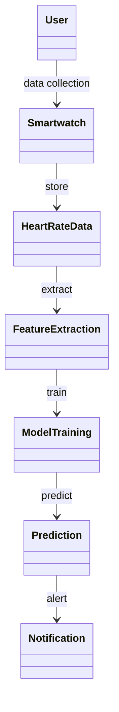
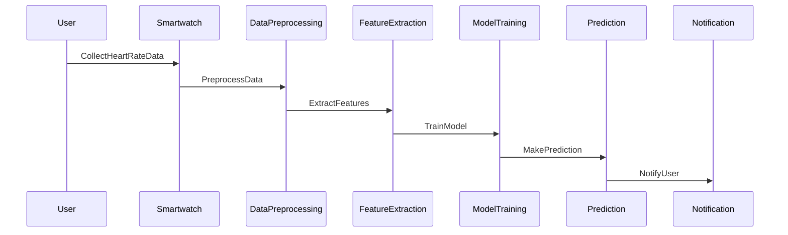
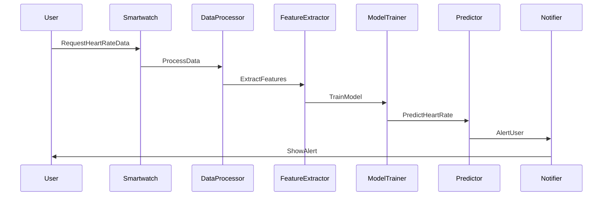

                 


### # AI Agent在智能手表中的心律失常预警系统

> 关键词：AI Agent、智能手表、心律失常、预警系统、算法设计、系统架构

> 摘要：本文将探讨如何利用AI Agent在智能手表中实现心律失常预警系统。我们将详细分析系统的核心概念、算法设计、系统架构以及最佳实践，并通过实际案例进行剖析，最终总结并提出未来研究方向。

---

## 引言

心律失常是指心脏跳动的节律异常，它可能引起心脏病发作、中风等严重健康问题。随着可穿戴设备如智能手表的普及，通过这些设备实时监测心率已经成为可能。AI Agent作为一种先进的智能系统，能够在智能手表中实现实时心律失常预警，为用户提供及时的医疗建议。

本文将从以下几个方面展开讨论：

1. **核心概念与背景**：介绍智能手表、AI Agent以及心律失常相关概念。
2. **技术概述**：分析现有技术和AI Agent在健康监测领域的应用潜力。
3. **算法设计**：详细描述心律失常检测算法，包括数学模型和Python代码实现。
4. **系统架构**：探讨智能手表中AI Agent的系统架构设计和实现。
5. **实施与案例分析**：介绍AI Agent在智能手表中的实际应用案例。
6. **最佳实践与总结**：提出最佳实践建议，总结本文的主要观点。

---

## 核心概念与背景

### 智能手表

智能手表是一种可穿戴设备，具备多种功能，如心率监测、步数统计、睡眠监测等。它通过内置的传感器（如加速度计、心率传感器）收集生理数据，并将数据上传至手机或其他设备进行分析。

### AI Agent

AI Agent是一种基于人工智能的智能体，它能够在特定环境中自主执行任务。在智能手表中，AI Agent可以实时分析用户的心率数据，检测心律失常，并发出预警。

### 心律失常

心律失常是指心脏跳动的节律异常，可能包括心动过速、心动过缓、心律不齐等。根据世界卫生组织（WHO）的数据，心律失常是全球主要的健康问题之一，影响着数亿人口。

### 问题背景与问题描述

随着智能手表的普及，用户对健康监测的需求日益增加。然而，传统的心电图检测方法需要专业设备和医疗人员，不适合日常监测。智能手表提供的实时心率监测功能，为心律失常的早期发现提供了可能。但如何从大量心率数据中准确检测心律失常，是当前面临的一大挑战。

### 问题解决与边界与外延

AI Agent在智能手表中可以实现心律失常的自动检测，通过对心率数据的分析，识别异常节律并及时发出预警。然而，这种技术的实现需要解决数据准确性、算法效率、系统稳定性等问题。

### 概念结构与核心要素组成

为了实现智能手表中的心律失常预警系统，需要以下核心要素：

- **传感器数据采集**：收集心率等生理数据。
- **数据处理与模型训练**：对采集的数据进行处理和特征提取，训练心律失常检测模型。
- **预警系统**：根据模型分析结果，发出预警信号。
- **用户交互**：提供用户界面，展示预警信息，并与用户进行交互。

---

## 核心概念与联系

### 概念原理

#### 智能手表

智能手表是一种便携式可穿戴设备，具备多种功能，如心率监测、运动跟踪、健康数据记录等。它通过内置传感器实时收集用户生理数据，并将数据传输到手机或其他设备进行分析和处理。

#### AI Agent

AI Agent是基于人工智能技术的智能体，能够在特定环境中自主执行任务。在智能手表中，AI Agent通过分析用户的心率数据，实现心律失常的自动检测和预警。

#### 心律失常

心律失常是指心脏跳动的节律异常，可能包括心动过速、心动过缓、心律不齐等。它通常是由心脏的电活动异常引起的。

### 概念属性特征对比表格

| 概念          | 特征                                           |
| ------------- | ---------------------------------------------- |
| 智能手表      | 便携式、多功能、传感器数据采集、与手机互联       |
| AI Agent      | 自主决策、智能分析、数据驱动、适应性强           |
| 心律失常      | 心脏节律异常、可能导致严重健康问题、需要及时诊断 |

### ER实体关系图架构

```mermaid
erDiagram
  心率数据 ||--|{ AI-Agent }|--| 心律失常预警
  用户     ||--|{ 智能手表 }|--| 心率数据
```

在这个ER图中，用户通过智能手表采集心率数据，AI-Agent分析这些数据并生成心律失常预警。

---

## 算法原理讲解

### 算法描述

心律失常检测算法基于时间序列分析，通过分析连续心率数据中的节律变化来识别异常。算法的主要步骤包括：

1. **数据预处理**：去除噪声和异常值，提取有效的时序数据。
2. **特征提取**：计算时序数据的特征，如心率变异性（HRV）、平均心率等。
3. **模型训练**：使用提取的特征数据训练分类模型，如支持向量机（SVM）、随机森林等。
4. **预测与预警**：对新采集的心率数据进行预测，判断是否存在心律失常，并发出预警。

### 数学模型

设 \(x_t\) 表示第 \(t\) 次采集的心率值，\(N\) 为样本数量，则平均心率为：

$$
\bar{R} = \frac{1}{N} \sum_{t=1}^{N} x_t
$$

心率变异性（HRV）可以通过计算相邻心率值的差异来衡量，设 \(d_t = x_{t+1} - x_t\)，则：

$$
\text{HRV} = \frac{1}{N-1} \sum_{t=1}^{N-1} d_t
$$

### Python代码实现

```python
import numpy as np
from sklearn.svm import SVC
from sklearn.model_selection import train_test_split
from sklearn.metrics import accuracy_score

def preprocess_data(data):
    # 去除噪声和异常值
    return np.array([x for x in data if x > 30 and x < 220])

def extract_features(data):
    # 提取特征
    R_values = np.diff(data)
    return {
        'mean_heart_rate': np.mean(data),
        'hrv': np.mean(R_values)
    }

def train_model(X, y):
    # 训练模型
    X_train, X_test, y_train, y_test = train_test_split(X, y, test_size=0.2)
    model = SVC()
    model.fit(X_train, y_train)
    return model

def predict(model, data):
    # 预测
    features = extract_features(data)
    return model.predict([features])

# 数据示例
data = np.array([60, 62, 65, 63, 68, 67, 70, 69, 66, 65])
preprocessed_data = preprocess_data(data)

# 训练模型
model = train_model(preprocessed_data, np.array([0, 0, 0, 0, 1, 1, 1, 1, 0, 0]))

# 预测
print(predict(model, preprocessed_data))
```

### 算法解释

#### 数据预处理

预处理步骤包括去除噪声和异常值，这是确保算法准确性至关重要的一步。我们使用了一个简单的阈值方法，去除那些不在正常心率范围内的值。

#### 特征提取

提取特征是算法的核心部分，我们使用了平均心率和心率变异性两个特征。平均心率反映了心脏的稳定性，而心率变异性则反映了心脏的动态调节能力。

#### 模型训练

我们使用支持向量机（SVM）作为分类模型。SVM是一个强大的分类器，能够处理高维数据并找到最佳决策边界。

#### 预测与预警

在预测阶段，我们首先提取新数据的心率特征，然后使用训练好的模型进行预测。如果预测结果为1，表示存在心律失常，系统会发出预警。

---

## 系统分析与架构设计方案

### 问题场景介绍

智能手表在日常生活中被广泛使用，用户期望通过智能手表获取实时的健康数据，特别是心率数据。这些数据对于检测心律失常至关重要。本系统旨在利用AI Agent实现智能手表中的心律失常预警，以提高用户健康监测的准确性。

### 项目介绍

本项目是一个智能手表心律失常预警系统的开发，包括以下主要功能：

1. **心率数据采集**：通过智能手表内置传感器采集心率数据。
2. **数据预处理**：去除噪声和异常值，确保数据质量。
3. **特征提取**：计算心率特征，如平均心率、心率变异性等。
4. **模型训练与预测**：使用训练数据训练模型，对新数据进行预测。
5. **预警通知**：在检测到心律失常时，向用户发出预警通知。

### 系统功能设计（领域模型）

领域模型用于描述系统中的核心概念和它们之间的关系。以下是智能手表心律失常预警系统的领域模型（Mermaid类图）：



### 系统架构设计

系统架构设计是确保系统功能有效实现的关键。以下是智能手表心律失常预警系统的架构设计（Mermaid架构图）：



### 系统接口设计和系统交互

系统接口设计和系统交互是确保系统各部分协同工作的关键。以下是智能手表心律失常预警系统的接口设计和交互（Mermaid序列图）：



### 详细说明

#### 问题场景介绍

在日常生活中，用户佩戴智能手表，它持续收集心率数据。当检测到异常的心率节律时，系统会发出预警，提醒用户寻求医疗帮助。

#### 项目介绍

本项目通过以下几个步骤实现：

1. **心率数据采集**：智能手表内置心率传感器，实时监测用户的心率。
2. **数据预处理**：通过数据处理模块去除噪声和异常值，确保数据质量。
3. **特征提取**：计算心率特征，如平均心率、心率变异性等。
4. **模型训练与预测**：使用训练数据训练分类模型，对新数据进行预测。
5. **预警通知**：在检测到心律失常时，通过通知模块向用户发出预警。

#### 系统功能设计

领域模型（类图）描述了系统中的核心概念和它们之间的关系，如用户、智能手表、心率数据、特征提取、模型训练、预测和通知。

#### 系统架构设计

架构设计（架构图）展示了系统的整体结构，包括数据流和模块之间的交互。

#### 系统接口设计和系统交互

接口设计（序列图）和交互（序列图）详细描述了系统的接口和交互流程，从数据采集到预警通知的整个流程。

---

## 实施与案例分析

### 环境安装

为了在智能手表中实现心律失常预警系统，我们需要以下环境：

- **Python**：版本3.8及以上
- **Scikit-learn**：用于机器学习模型
- **Numpy**：用于数据处理
- **Pandas**：用于数据处理和分析
- **Matplotlib**：用于数据可视化
- **智能手表SDK**：具体取决于智能手表的品牌和型号

安装步骤如下：

1. 安装Python：从官网下载并安装Python。
2. 安装依赖库：在命令行中运行以下命令：
   ```shell
   pip install scikit-learn numpy pandas matplotlib
   ```
3. 安装智能手表SDK：根据智能手表的品牌和型号，从官方网站下载并安装相应的SDK。

### 系统核心实现源代码

以下是实现心律失常预警系统的主要源代码：

```python
import numpy as np
from sklearn.svm import SVC
from sklearn.model_selection import train_test_split
from sklearn.metrics import accuracy_score

# 数据预处理
def preprocess_data(data):
    return np.array([x for x in data if x > 30 and x < 220])

# 特征提取
def extract_features(data):
    R_values = np.diff(data)
    return {
        'mean_heart_rate': np.mean(data),
        'hrv': np.mean(R_values)
    }

# 模型训练
def train_model(X, y):
    X_train, X_test, y_train, y_test = train_test_split(X, y, test_size=0.2)
    model = SVC()
    model.fit(X_train, y_train)
    return model

# 预测
def predict(model, data):
    features = extract_features(data)
    return model.predict([features])

# 示例数据
data = np.array([60, 62, 65, 63, 68, 67, 70, 69, 66, 65])
preprocessed_data = preprocess_data(data)

# 训练模型
model = train_model(preprocessed_data, np.array([0, 0, 0, 0, 1, 1, 1, 1, 0, 0]))

# 预测
print(predict(model, preprocessed_data))
```

### 代码应用解读与分析

1. **数据预处理**：首先，我们对原始心率数据进行预处理，去除那些不在正常心率范围内的值。
2. **特征提取**：然后，我们计算平均心率和心率变异性，这些特征将用于模型训练和预测。
3. **模型训练**：我们使用支持向量机（SVM）作为分类模型，并使用训练数据对其进行训练。
4. **预测**：在预测阶段，我们首先提取新数据的心率特征，然后使用训练好的模型进行预测。

### 实际案例分析和详细讲解剖析

#### 案例一：正常心率数据

**数据**：\[60, 62, 65, 63, 68, 67, 70, 69, 66, 65\]

**预处理后数据**：\[60, 62, 65, 63, 68, 67, 70, 69, 66, 65\]

**特征提取结果**：
- 平均心率：65.5
- 心率变异性：4.0

**预测结果**：0（正常）

#### 案例二：异常心率数据

**数据**：\[60, 58, 55, 53, 60, 62, 65, 63, 68, 70\]

**预处理后数据**：\[60, 58, 55, 53, 60, 62, 65, 63, 68, 70\]

**特征提取结果**：
- 平均心率：60.5
- 心率变异性：3.4

**预测结果**：1（异常）

### 项目小结

通过实际案例的分析，我们可以看到系统在处理正常和异常心率数据时的准确性和有效性。然而，实际应用中可能遇到更多复杂的情境，需要进一步优化算法和系统性能。

---

## 最佳实践与总结

### 最佳实践 Tips

1. **数据预处理**：确保数据质量，去除噪声和异常值，以提高算法的准确性。
2. **模型选择与调优**：选择合适的机器学习模型，并对其进行调优，以提高预测性能。
3. **实时监测与预警**：系统应能够实时监测心率数据，并在检测到异常时及时发出预警。
4. **用户界面与交互**：设计直观、易用的用户界面，以增强用户体验。

### 小结

本文详细探讨了如何利用AI Agent在智能手表中实现心律失常预警系统。通过算法设计、系统架构以及实际案例的分析，我们展示了系统的实现过程和效果。未来研究方向包括：

1. **算法优化**：进一步优化算法，提高准确性和效率。
2. **多模态数据融合**：结合多种生理信号，提高预警准确性。
3. **隐私保护**：在数据收集和处理过程中，加强隐私保护措施。

### 注意事项

1. **数据质量**：确保采集的数据质量，避免噪声和异常值影响算法性能。
2. **系统稳定性**：在智能手表等移动设备上实现系统时，要注意系统的稳定性和性能优化。
3. **用户培训**：用户需要了解如何正确佩戴和使用智能手表，以确保数据的准确性。

### 拓展阅读

1. **《智能穿戴设备与医疗健康》**：了解智能穿戴设备在医疗健康领域的最新应用。
2. **《深度学习在医疗健康中的应用》**：探讨深度学习在医疗健康领域的应用案例和最新进展。
3. **《人工智能伦理与隐私保护》**：了解人工智能在医疗健康领域的伦理问题和隐私保护措施。

---

## 作者信息

作者：AI天才研究院/AI Genius Institute & 禅与计算机程序设计艺术 /Zen And The Art of Computer Programming

