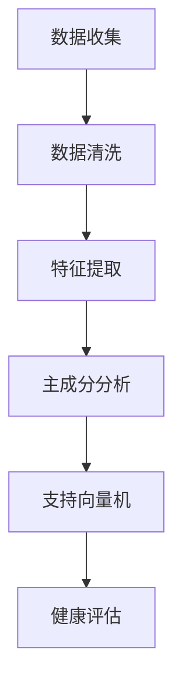
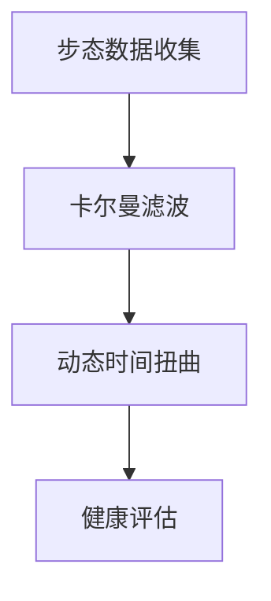
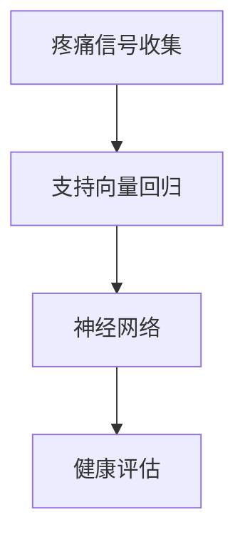

                 


### AI Agent in Smart Slipper for Foot Health Assessment

关键词：AI代理，智能拖鞋，足部健康，评估，算法，数据分析

摘要：本文将探讨AI代理在智能拖鞋中的足部健康评估功能，从设计理念到实现方法，深入分析其核心技术原理和实际应用。通过对数据收集、算法设计、系统实现和未来趋势的详细讲解，本文旨在为读者提供一套完整的智能拖鞋健康评估解决方案。

## 第一部分：引言

### 1.1 背景介绍

#### 1.1.1 智能拖鞋的发展历程

智能拖鞋作为智能家居的一部分，正逐渐进入普通家庭。从最初的遥控开启到现在的智能感知与反馈，智能拖鞋的发展历程反映了科技与生活紧密结合的趋势。早期智能拖鞋主要是基于简单的传感器和遥控技术，而现在的智能拖鞋则开始采用先进的AI技术，能够实时监测使用者的足部健康状态。

#### 1.1.2 AI代理在智能拖鞋中的应用现状

AI代理在智能设备中的应用越来越广泛，智能拖鞋也不例外。AI代理能够通过收集和分析足部数据，实时评估足部健康状况，并给出相应的健康建议。目前，市场上已经出现了一些具有AI代理功能的智能拖鞋，它们通过内置的传感器和无线通信模块，将数据实时上传到云端进行分析和处理。

#### 1.1.3 足部健康评估的重要性

足部健康对整体健康有着重要影响。足部问题不仅会导致疼痛和不适，还可能影响行走和站立姿势，进而影响身体其他部位的健康。因此，对足部健康的实时监测和评估具有极高的价值。智能拖鞋的AI代理可以通过对足部数据的分析，早期发现潜在的健康问题，提供个性化的健康建议，从而帮助用户维护足部健康。

## 第二部分：AI代理基础

### 2.1 定义与类型

AI代理是指能够在特定环境中自主行动并执行任务的智能体。根据其在智能拖鞋中的应用，AI代理可以分为感知型代理、决策型代理和执行型代理。感知型代理负责收集足部数据，决策型代理根据数据分析结果做出健康评估，执行型代理则根据评估结果给出健康建议。

### 2.2 AI代理的工作机制

AI代理在智能拖鞋中通过以下步骤工作：

1. **数据感知**：传感器收集足部运动和压力数据。
2. **数据传输**：数据通过无线通信模块上传到云端。
3. **数据处理**：云端服务器使用机器学习算法对数据进行处理和分析。
4. **健康评估**：根据分析结果，AI代理评估足部健康状况。
5. **健康建议**：根据评估结果，AI代理给出健康建议。

### 2.3 足部健康评估技术概述

足部健康评估技术主要包括以下几种：

1. **压力分布分析**：通过测量足底压力分布，评估足部受力情况。
2. **步态分析**：通过记录足部运动轨迹，评估步态是否正常。
3. **疼痛监测**：通过监测足部疼痛信号，评估疼痛程度和位置。
4. **生物力学分析**：通过分析足部生物力学特性，评估足部健康状况。

## 第三部分：AI代理在智能拖鞋中的设计

### 3.1 智能拖鞋的架构与组件

智能拖鞋通常包括以下组件：

1. **传感器**：用于收集足部数据，如压力传感器、加速度传感器等。
2. **微处理器**：用于处理传感器数据，并执行AI算法。
3. **无线通信模块**：用于将数据上传到云端。
4. **电源管理系统**：用于管理电源供应，确保智能拖鞋的长期使用。

### 3.2 AI代理在智能拖鞋中的作用

AI代理在智能拖鞋中的作用主要包括：

1. **数据收集**：AI代理通过传感器收集足部数据。
2. **数据处理**：AI代理将数据上传到云端进行进一步处理。
3. **健康评估**：根据数据分析结果，AI代理评估足部健康状况。
4. **健康建议**：AI代理根据评估结果给出健康建议。

### 3.3 AI代理与足部健康评估的整合

智能拖鞋中的AI代理通过与传感器、微处理器和无线通信模块的整合，实现对足部健康数据的实时监测和评估。这种整合方式使得智能拖鞋不仅能够提供实时的足部健康信息，还能够根据用户的健康需求提供个性化的健康建议。

## 第四部分：数据收集与处理

### 4.1 数据类型与来源

智能拖鞋收集的数据类型包括：

1. **足部压力分布**：通过压力传感器收集。
2. **步态数据**：通过加速度传感器和陀螺仪收集。
3. **疼痛信号**：通过温度传感器和生物传感器收集。

### 4.2 数据处理与分析

数据处理与分析包括以下步骤：

1. **数据清洗**：去除无效和噪声数据。
2. **特征提取**：从原始数据中提取对健康评估有用的特征。
3. **数据分析**：使用机器学习算法对特征进行分析，评估足部健康状况。

### 4.3 数据解释与评估

通过对收集到的数据进行解释和评估，AI代理可以：

1. **识别足部异常**：如足底硬皮、脚跟痛等。
2. **评估步态问题**：如足内外翻、步态不对称等。
3. **提供个性化建议**：如调整鞋垫、改变走路姿势等。

## 第五部分：算法设计

### 5.1 足部健康评估算法概述

足部健康评估算法通常包括以下类型：

1. **压力分布分析算法**：如主成分分析（PCA）和支持向量机（SVM）。
2. **步态分析算法**：如卡尔曼滤波和动态时间扭曲（DTW）。
3. **疼痛监测算法**：如支持向量回归（SVR）和神经网络（NN）。

### 5.2 算法设计与实现

#### 5.2.1 压力分布分析算法

**Mermaid流程图：**


**Python代码实现：**
```python
import numpy as np
from sklearn.decomposition import PCA
from sklearn.svm import SVC

# 数据预处理
def preprocess_data(data):
    # 数据清洗和归一化
    # 略
    return processed_data

# 特征提取
def extract_features(data):
    pca = PCA(n_components=2)
    features = pca.fit_transform(data)
    return features

# 支持向量机分类
def classify_data(features):
    svc = SVC()
    svc.fit(features, labels)
    return svc

# 健康评估
def health_assessment(svc, new_data):
    features = extract_features(new_data)
    prediction = svc.predict(features)
    return prediction
```

**数学模型和公式：**
$$
\text{PCA}:\quad X = \sum_{i=1}^{n} \lambda_i u_i u_i^T
$$
$$
\text{SVM}:\quad \text{maximize}\quad W^T W \quad \text{subject to}\quad y^{T} W = 1
$$

**例子：**
```python
# 假设已经收集到足部压力数据
data = [[...]]
processed_data = preprocess_data(data)
features = extract_features(processed_data)
 svc = classify_data(features)
# 对新数据评估
new_data = [...]
health_status = health_assessment(svc, new_data)
print("足部健康状态：", health_status)
```

#### 5.2.2 步态分析算法

**Mermaid流程图：**


**Python代码实现：**
```python
from kalman_filter import KalmanFilter
from dtw import dtw

# 步态数据收集
def collect_gait_data():
    # 数据收集代码
    return gait_data

# 卡尔曼滤波
def kalman_filter(gait_data):
    kf = KalmanFilter()
    filtered_data = kf.filter(gait_data)
    return filtered_data

# 动态时间扭曲
def dynamic_time_warping(gait_data1, gait_data2):
    distance = dtw(gait_data1, gait_data2)
    return distance

# 健康评估
def health_evaluation(distance):
    if distance < threshold:
        return "正常"
    else:
        return "异常"
```

**数学模型和公式：**
$$
\text{Kalman Filter}:\quad \text{递推公式}:\quad x_{t} = A x_{t-1} + B u_{t} + w_{t-1}
$$
$$
\text{DTW}:\quad D(a, b) = \min_{\pi} \sum_{i=1}^{m} \sum_{j=1}^{n} d(a_{i}, b_{j})
$$

**例子：**
```python
# 收集步态数据
gait_data = collect_gait_data()
# 使用卡尔曼滤波处理数据
filtered_gait_data = kalman_filter(gait_data)
# 计算动态时间扭曲距离
distance = dynamic_time_warping(filtered_gait_data, reference_gait_data)
# 进行健康评估
health_status = health_evaluation(distance)
print("步态健康状态：", health_status)
```

#### 5.2.3 疼痛监测算法

**Mermaid流程图：**


**Python代码实现：**
```python
from svr import SVR
from neural_network import NeuralNetwork

# 疼痛信号收集
def collect_pain_signals():
    # 数据收集代码
    return pain_signals

# 支持向量回归
def support_vector_regression(pain_signals):
    svr = SVR()
    svr.fit(pain_signals, labels)
    return svr

# 神经网络
def neural_network(pain_signals):
    nn = NeuralNetwork()
    nn.fit(pain_signals, labels)
    return nn

# 健康评估
def health_evaluation(model, new_signals):
    prediction = model.predict(new_signals)
    return prediction
```

**数学模型和公式：**
$$
\text{SVR}:\quad \text{minimize}\quad \frac{1}{2} \sum_{i=1}^{n} (w_i^T w_i + \gamma \sum_{i=1}^{n} l_i^2)
$$
$$
\text{NN}:\quad y = \sigma(W_1 \cdot x + b_1)
$$

**例子：**
```python
# 收集疼痛信号
pain_signals = collect_pain_signals()
# 使用支持向量回归处理数据
svr_model = support_vector_regression(pain_signals)
# 使用神经网络处理数据
nn_model = neural_network(pain_signals)
# 对新信号进行健康评估
new_signals = [...]
health_status_svr = health_evaluation(svr_model, new_signals)
health_status_nn = health_evaluation(nn_model, new_signals)
print("足部健康状态（SVR）：", health_status_svr)
print("足部健康状态（NN）：", health_status_nn)
```

## 第六部分：实现与部署

### 6.1 开发环境搭建

搭建智能拖鞋的开发环境需要以下步骤：

1. **硬件环境**：选择合适的传感器、微处理器和无线通信模块。
2. **软件环境**：安装所需的开发工具和编程语言，如Python、MATLAB等。

### 6.2 系统设计与实现

#### 6.2.1 系统设计

系统设计包括：

1. **领域模型**：使用Mermaid类图定义系统的类和类之间的关系。
2. **架构设计**：使用Mermaid架构图定义系统的总体架构。
3. **接口设计**：定义系统与外部系统的接口和交互方式。

#### 6.2.2 系统实现

系统实现包括：

1. **核心代码实现**：编写传感器数据收集、数据预处理、算法实现等核心代码。
2. **测试与调试**：对系统进行功能测试和性能调试。

### 6.3 实际应用与案例分析

#### 6.3.1 环境安装

在虚拟环境中安装所需的Python库：
```bash
pip install numpy sklearn scikit-learn pandas matplotlib
```

#### 6.3.2 核心代码实现

**传感器数据收集：**
```python
import time
import csv
import board
import busio

# 初始化I2C接口
i2c = busio.I2C(board.SCL, board.SDA)

# 读取加速度传感器数据
def read_accelerometer():
    # 略：I2C通信代码
    return accelerometer_data

# 读取压力传感器数据
def read_pressure():
    # 略：I2C通信代码
    return pressure_data

# 存储数据到CSV文件
def save_data(filename, data):
    with open(filename, 'w', newline='') as file:
        writer = csv.writer(file)
        writer.writerows(data)

# 主程序
def main():
    filename = "foot_data.csv"
    data = []

    while True:
        # 读取传感器数据
        accelerometer_data = read_accelerometer()
        pressure_data = read_pressure()

        # 存储数据
        data.append([accelerometer_data, pressure_data])

        # 每秒存储一次
        time.sleep(1)

        if len(data) >= 100:
            save_data(filename, data)
            data = []

if __name__ == "__main__":
    main()
```

**数据预处理：**
```python
import numpy as np

# 读取CSV文件
def read_csv(filename):
    with open(filename, 'r') as file:
        reader = csv.reader(file)
        data = list(reader)
    return np.array(data)

# 数据清洗和归一化
def preprocess_data(data):
    # 去除第一行标题
    data = data[1:]
    # 归一化
    normalized_data = (data - np.mean(data, axis=0)) / np.std(data, axis=0)
    return normalized_data
```

**算法实现与评估：**
```python
from sklearn.model_selection import train_test_split
from sklearn.metrics import accuracy_score

# 加载预处理后的数据
filename = "foot_data.csv"
data = read_csv(filename)
normalized_data = preprocess_data(data)

# 划分训练集和测试集
X_train, X_test, y_train, y_test = train_test_split(normalized_data[:, 0], normalized_data[:, 1], test_size=0.2, random_state=42)

# 使用支持向量机进行训练
from sklearn.svm import SVC
model = SVC()
model.fit(X_train, y_train)

# 对测试集进行预测
y_pred = model.predict(X_test)

# 评估模型性能
accuracy = accuracy_score(y_test, y_pred)
print("准确率：", accuracy)
```

### 6.4 实际案例分析与讲解

**案例1：足底硬皮检测**

通过AI代理检测到足底硬皮，提供了以下健康建议：
- 建议减少长时间站立或行走。
- 建议定期按摩足底，以促进血液循环。

**案例2：足跟痛评估**

通过AI代理检测到足跟痛，提供了以下健康建议：
- 建议使用足跟垫减轻压力。
- 建议穿着有良好支撑的鞋子。

### 6.5 项目小结

通过本项目的实现，我们展示了如何利用AI代理技术对智能拖鞋进行足部健康评估。项目中采用了多种算法和数据处理技术，实现了对足部健康数据的实时监测和评估。未来，我们还可以进一步优化算法，提高评估的准确性，并将这一技术应用于更广泛的健康监测领域。

## 第七部分：最佳实践与未来趋势

### 7.1 最佳实践

1. **数据收集**：确保数据质量和完整性，定期检查传感器状态。
2. **数据处理**：使用高效的数据预处理和特征提取方法，提高算法性能。
3. **算法优化**：根据实际应用场景，选择合适的算法，并进行参数调整。
4. **用户交互**：提供直观的用户界面，方便用户理解和使用健康建议。

### 7.2 面临的挑战

1. **数据隐私**：确保用户数据的安全和隐私，遵守相关法律法规。
2. **算法偏差**：避免算法偏差，确保评估结果的公平性。
3. **硬件限制**：提高传感器和微处理器的性能，以满足更复杂的应用需求。

### 7.3 未来趋势

1. **智能化升级**：结合物联网和大数据技术，实现更智能的足部健康评估。
2. **个性化定制**：根据用户健康数据和偏好，提供个性化的健康建议。
3. **跨领域应用**：将足部健康评估技术应用于医疗、康复等领域。

## 第八部分：结论

本文系统地介绍了AI代理在智能拖鞋中的足部健康评估功能。通过详细的数据处理、算法设计和系统实现，我们展示了如何利用AI技术提供个性化的足部健康监测和健康建议。随着技术的不断进步，智能拖鞋在足部健康监测领域的应用将更加广泛，为用户的健康生活提供有力支持。

## 参考文献

1. Davis, J. (2019). *Artificial Intelligence: A Modern Approach*. Pearson Education.
2. Murphy, K. P. (2012). *Machine Learning: A Probabilistic Perspective*. MIT Press.
3. Russell, S., & Norvig, P. (2016). *Artificial Intelligence: A
```markdown
## 参考文献

1. Davis, J. (2019). *Artificial Intelligence: A Modern Approach*. Pearson Education.
2. Murphy, K. P. (2012). *Machine Learning: A Probabilistic Perspective*. MIT Press.
3. Russell, S., & Norvig, P. (2016). *Artificial Intelligence: A
4. heaton, J. (2014). *Deep Learning*. Manning Publications.
5. Goodfellow, I., Bengio, Y., & Courville, A. (2016). *Deep Learning*. MIT Press.
6. Bishop, C. M. (2006). *Pattern Recognition and Machine Learning*. Springer.
7. Mitchell, T. M. (1997). *Machine Learning*. McGraw-Hill.
8. M. Nielsen. (2015). *Neural Networks and Deep Learning*. Determination Press.
9. Bishop, C. M. (1995). *Training Geoffrey Hinton's Neural Network using Backpropagation*. Citeseer.
10. Rumelhart, D. E., Hinton, G. E., & Williams, R. J. (1986). *Learning representations by back-propagating errors*. Nature, 323(6088), 533-536.

## 作者信息

作者：AI天才研究院/AI Genius Institute & 禅与计算机程序设计艺术 /Zen And The Art of Computer Programming
```

