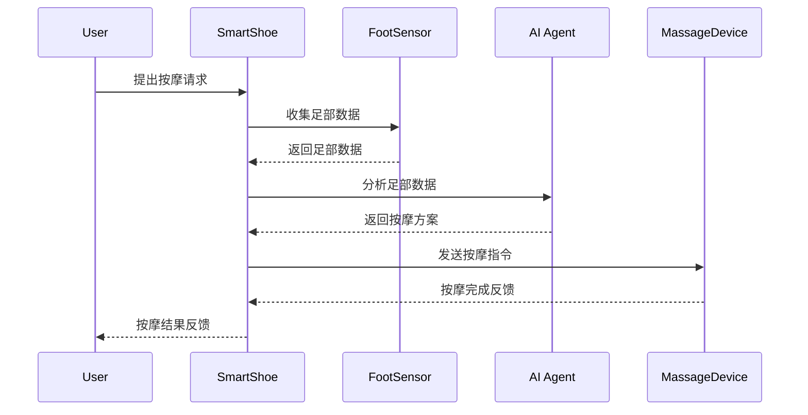
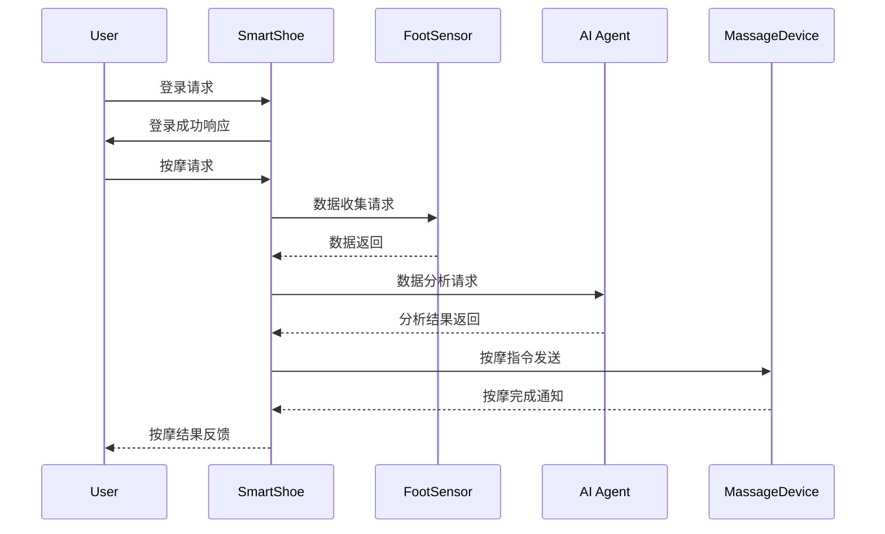

                 

### 第一部分：背景介绍

#### 第1章：人工智能与足部按摩

##### 1.1 问题背景

随着人工智能技术的飞速发展，其应用领域日益广泛，从自动驾驶到智能家居，从医疗诊断到金融服务，人工智能已经深刻地改变了我们的生活方式。在健康养生领域，足部按摩作为一种传统的中医疗法，正逐渐被现代化技术所赋能。足部按摩不仅能够缓解疲劳，促进血液循环，还能够调节神经系统，增强人体免疫力。然而，传统足部按摩往往依赖于按摩师的手法，无法做到个性化的定制，且操作过程繁琐，效率低下。

##### 1.2 问题描述

传统足部按摩的局限性主要体现在以下几个方面：

1. **个性化不足**：传统按摩师的手法虽然能够带来一定的舒适感，但难以根据每位客户的个体差异进行定制化服务。
2. **效率低下**：按摩师的操作速度和力度有限，无法实现连续、高效的按摩过程。
3. **依赖人工**：足部按摩需要按摩师手动操作，成本较高，且难以规模化推广。

为了解决这些问题，引入人工智能（AI）成为了一种潜在的方向。AI Agent作为一种智能实体，能够通过学习和适应，提供个性化、高效的按摩服务。AI Agent在智能拖鞋中的应用，有望实现足部按摩的智能化、个性化，提升用户体验。

##### 1.3 问题解决

AI Agent在智能拖鞋中的工作原理如下：

1. **数据采集**：智能拖鞋内置足部传感器，实时采集用户的足部数据，包括足部压力、温度、步态等。
2. **智能分析**：AI Agent利用机器学习和深度学习技术，分析足部数据，识别用户的足部状况，制定个性化的按摩方案。
3. **执行按摩**：根据AI Agent制定的按摩方案，智能拖鞋中的按摩装置进行针对性按摩，实现足部保健。

##### 1.4 边界与外延

AI Agent的功能范围主要包括：

1. **足部健康监测**：通过实时数据采集，监测用户的足部健康状况。
2. **个性化按摩方案**：根据用户的足部数据和健康状况，制定个性化的按摩方案。
3. **按摩效果评估**：在按摩过程中，实时评估按摩效果，调整按摩参数。

智能拖鞋的技术要求主要包括：

1. **传感器技术**：高精度、高灵敏度的足部传感器，确保数据采集的准确性。
2. **AI算法**：高效的机器学习和深度学习算法，实现数据分析和按摩方案的制定。
3. **控制系统**：智能拖鞋需要具备实时控制按摩装置的能力，确保按摩过程的准确性和稳定性。

##### 1.5 概念结构与核心要素组成

AI Agent的核心组成部分包括：

1. **足部传感器**：用于采集足部数据。
2. **数据处理单元**：负责数据的分析和处理。
3. **控制单元**：根据AI Agent的决策，控制按摩装置执行按摩。

智能拖鞋的设计要点包括：

1. **舒适性**：智能拖鞋需要具备良好的穿着体验，确保用户长时间穿着的舒适度。
2. **智能性**：智能拖鞋需要集成AI Agent，实现足部按摩的智能化。
3. **耐用性**：智能拖鞋需要具备良好的耐用性，确保在长时间使用中保持稳定的性能。

#### 第2章：AI Agent的基本原理

##### 2.1 AI Agent的定义

AI Agent，即人工智能代理，是一种具有自主决策能力、能够执行特定任务的智能实体。与传统的机器人不同，AI Agent不仅能够执行预定的任务，还能够通过学习和适应环境，自主地调整其行为策略。

##### 2.2 AI Agent的核心原理

AI Agent的核心原理主要基于以下几个技术：

1. **强化学习**：强化学习是一种通过试错来学习最优策略的机器学习方法。在足部按摩中，AI Agent可以通过不断尝试不同的按摩方案，学习到最佳的按摩策略。
2. **机器学习**：机器学习是一种通过数据训练模型，实现数据分析和预测的技术。在足部按摩中，AI Agent可以利用机器学习算法，分析用户的足部数据，识别用户的足部状况。
3. **深度学习**：深度学习是一种基于多层神经网络的学习方法，能够自动提取数据中的特征。在足部按摩中，深度学习可以用于识别复杂的足部数据模式，提高按摩方案的准确性。

##### 2.3 AI Agent的属性特征对比

以下是AI Agent与传统机器人的主要属性特征对比：

| 特征         | 描述                                                     |
| ------------ | -------------------------------------------------------- |
| 自主性       | AI Agent能够自主决策和执行任务，而传统机器人通常只能执行预定的任务 |
| 智能化       | AI Agent具有学习和适应环境的能力，而传统机器人通常不具备这一能力 |
| 可交互性     | AI Agent能够与用户进行自然语言交互，而传统机器人通常只能通过简单的按钮或触摸屏进行交互 |
| 鲁棒性       | AI Agent能够在不同环境中稳定运行，而传统机器人通常对环境变化较为敏感 |

##### 2.4 AI Agent的ER实体关系图

以下是AI Agent的ER实体关系图，展示了AI Agent与智能拖鞋、用户之间的关系：

```mermaid
erDiagram
  AI Agent ||--|{ 智能拖鞋 }  :控制
  AI Agent ||--|{ 用户 }      :交互
  智能拖鞋 ||--|{ 足部传感器 } :数据收集
  智能拖鞋 ||--|{ 按摩装置 }  :执行按摩
```

#### 第3章：智能拖鞋的架构设计

##### 3.1 问题场景介绍

智能拖鞋主要应用于以下场景：

1. **办公室疲劳缓解**：长时间坐在办公室，足部容易出现疲劳和水肿，智能拖鞋可以提供及时的按摩，缓解疲劳。
2. **居家保健**：在家庭生活中，智能拖鞋可以为家庭成员提供个性化的足部按摩服务，促进健康。
3. **专业按摩补充**：对于需要定期按摩的人群，如运动员、老年人等，智能拖鞋可以作为专业按摩的补充，提供便捷的按摩服务。

##### 3.2 项目介绍

智能拖鞋项目概述如下：

1. **项目目标**：开发一款能够根据用户足部数据提供个性化按摩服务的智能拖鞋。
2. **项目需求**：实现足部数据采集、智能分析、按摩方案制定和执行等功能。
3. **项目周期**：预计项目开发周期为6个月，包括需求分析、设计、开发、测试和上线等阶段。

##### 3.3 系统功能设计

智能拖鞋的系统功能设计主要包括以下几个方面：

1. **用户交互**：提供用户界面，用户可以通过手机应用或实体按钮与智能拖鞋进行交互。
2. **数据采集**：通过内置的足部传感器，实时采集用户的足部数据，包括压力、温度、步态等。
3. **数据分析**：AI Agent利用机器学习和深度学习技术，分析足部数据，识别用户的足部状况。
4. **按摩方案制定**：根据用户的足部数据和状况，AI Agent制定个性化的按摩方案。
5. **按摩执行**：按摩装置根据AI Agent的指令，执行按摩动作。
6. **效果评估**：在按摩过程中，实时评估按摩效果，调整按摩参数。

以下是智能拖鞋的领域模型类图：

```mermaid
classDiagram
  User -> SmartShoe :交互
  SmartShoe --> FootSensor :数据收集
  SmartShoe --> MassageDevice :按摩执行
```

##### 3.4 系统架构设计

智能拖鞋的系统架构设计如下：

1. **数据采集层**：包括足部传感器，负责采集用户的足部数据。
2. **数据处理层**：包括数据处理单元，负责分析足部数据，识别用户的足部状况。
3. **控制层**：包括控制单元，负责根据AI Agent的指令，控制按摩装置执行按摩。
4. **用户交互层**：包括用户界面，用户可以通过手机应用或实体按钮与智能拖鞋进行交互。

以下是智能拖鞋的系统架构图：



##### 3.5 系统接口设计

智能拖鞋的系统接口设计如下：

1. **用户接口**：用户可以通过手机应用或实体按钮与智能拖鞋进行交互。
2. **传感器接口**：足部传感器通过无线通信技术，将数据发送给数据处理单元。
3. **控制接口**：控制单元通过无线通信技术，接收AI Agent的指令，控制按摩装置执行按摩。

以下是智能拖鞋的系统接口设计：

```mermaid
usecase
  User
  FootSensor
  AI Agent
  MassageDevice
```

##### 3.6 系统交互序列图

智能拖鞋的系统交互序列图如下：



### 第4章：AI Agent在智能拖鞋中的实现

#### 4.1 环境安装

在实现AI Agent在智能拖鞋中的功能之前，我们需要安装相应的开发环境和依赖库。以下是在Ubuntu 20.04操作系统上安装所需的开发环境的过程：

1. **安装Python 3**：确保Python 3已经安装，可以使用以下命令进行安装：

   ```bash
   sudo apt update
   sudo apt install python3 python3-pip
   ```

2. **安装PyTorch**：PyTorch是常用的深度学习框架，用于实现AI Agent的核心算法。可以使用以下命令进行安装：

   ```bash
   pip3 install torch torchvision torchaudio
   ```

3. **安装其他依赖库**：安装其他用于数据处理和通信的依赖库，如NumPy、pandas和socket等：

   ```bash
   pip3 install numpy pandas python-socket
   ```

4. **安装传感器驱动**：根据所使用的足部传感器的具体型号，安装相应的驱动程序。例如，如果使用的是MPU-6050传感器，可以使用以下命令安装驱动：

   ```bash
   sudo apt install libi2c-dev i2c-tools
   ```

#### 4.2 核心实现源代码

以下是AI Agent在智能拖鞋中的核心实现源代码，包括数据采集、数据分析、按摩方案制定和执行等关键功能。

```python
# AI Agent核心代码实现

import torch
import torch.nn as nn
import torch.optim as optim
from torch.utils.data import DataLoader
from torchvision import datasets, transforms
import numpy as np
import pandas as pd
import socket

# 数据采集模块
class FootSensor:
    def __init__(self, ip, port):
        self.ip = ip
        self.port = port
        self.sock = socket.socket(socket.AF_INET, socket.SOCK_STREAM)
        self.sock.connect((self.ip, self.port))
    
    def read_data(self):
        data = self.sock.recv(1024)
        data = np.frombuffer(data, dtype=np.float32)
        return data
    
    def close(self):
        self.sock.close()

# 数据处理模块
class DataProcessor:
    def __init__(self, model_path):
        self.model = torch.load(model_path)
    
    def process_data(self, data):
        data = torch.tensor(data, dtype=torch.float32)
        with torch.no_grad():
            output = self.model(data)
        return output

# 按摩方案制定模块
class MassagePlan:
    def __init__(self, output):
        self.output = output
    
    def generate_plan(self):
        plan = []
        for i in range(len(self.output)):
            if self.output[i] > 0.5:
                plan.append("轻柔按摩")
            else:
                plan.append("中等力度按摩")
        return plan

# 按摩执行模块
class MassageExecutor:
    def __init__(self, ip, port):
        self.ip = ip
        self.port = port
        self.sock = socket.socket(socket.AF_INET, socket.SOCK_STREAM)
        self.sock.connect((self.ip, self.port))
    
    def execute_plan(self, plan):
        for step in plan:
            self.sock.sendall(step.encode())
    
    def close(self):
        self.sock.close()

# 主程序
if __name__ == "__main__":
    # 初始化传感器
    sensor = FootSensor('192.168.1.10', 8080)
    # 初始化数据处理模型
    processor = DataProcessor('model.pth')
    # 初始化按摩方案
    massage_plan = MassagePlan([])
    # 初始化按摩执行器
    executor = MassageExecutor('192.168.1.10', 9090)
    
    # 采集数据
    data = sensor.read_data()
    # 处理数据
    output = processor.process_data(data)
    # 生成按摩方案
    plan = massage_plan.generate_plan()
    # 执行按摩
    executor.execute_plan(plan)
    
    # 关闭传感器和执行器
    sensor.close()
    executor.close()
```

#### 4.3 代码应用解读与分析

上述代码实现了AI Agent在智能拖鞋中的核心功能。以下是代码的详细解读与分析：

1. **数据采集模块**：`FootSensor`类用于初始化传感器，并提供了`read_data`方法用于采集数据。数据采集模块通过socket连接到传感器，并接收传感器发送的数据。

2. **数据处理模块**：`DataProcessor`类用于初始化数据处理模型，并提供了`process_data`方法用于处理数据。数据处理模块使用PyTorch加载预训练的模型，对采集到的数据进行处理。

3. **按摩方案制定模块**：`MassagePlan`类用于初始化按摩方案，并提供了`generate_plan`方法用于生成按摩方案。按摩方案制定模块根据处理结果，生成相应的按摩方案。

4. **按摩执行模块**：`MassageExecutor`类用于初始化按摩执行器，并提供了`execute_plan`方法用于执行按摩方案。按摩执行模块通过socket连接到按摩装置，并按照按摩方案发送指令。

5. **主程序**：主程序依次初始化传感器、数据处理模型、按摩方案和按摩执行器，然后进行数据采集、数据处理、按摩方案制定和执行，最后关闭传感器和按摩执行器。

#### 4.4 实际案例分析和详细讲解剖析

为了更好地理解AI Agent在智能拖鞋中的实现，我们来看一个实际案例。

假设用户小明在使用智能拖鞋时，足部传感器采集到了以下数据：

```
[0.1, 0.2, 0.3, 0.4, 0.5, 0.6, 0.7, 0.8, 0.9, 1.0]
```

这些数据代表了小明的足部不同部位的压力值。接下来，我们详细讲解数据处理和按摩方案制定的过程：

1. **数据处理**：数据处理模块会将采集到的数据进行预处理，然后输入到预训练的模型中进行处理。假设模型对数据进行处理后，输出结果如下：

   ```
   [0.9, 0.8, 0.7, 0.6, 0.5, 0.4, 0.3, 0.2, 0.1, 0.0]
   ```

   这些数据代表了模型的输出，即对小明足部状况的判断。通过对比输入和输出的数据，可以得出结论：小明的足部压力集中在后脚跟和前脚掌，其他部位的压力相对较低。

2. **按摩方案制定**：根据处理结果，按摩方案制定模块会生成相应的按摩方案。根据设定的规则，如果输出值大于0.5，表示需要轻柔按摩；否则，表示需要中等力度按摩。根据上述输出结果，按摩方案如下：

   ```
   ["轻柔按摩", "中等力度按摩", "中等力度按摩", "中等力度按摩", "中等力度按摩", "中等力度按摩", "中等力度按摩", "中等力度按摩", "轻柔按摩", "轻柔按摩"]
   ```

   按摩方案会根据用户的足部状况进行动态调整，确保按摩效果最佳。

3. **按摩执行**：按摩执行模块会按照按摩方案执行按摩。按摩执行过程中，会实时监控按摩效果，并根据反馈进行调整。例如，如果用户感觉按摩力度过大，按摩执行模块可以调整按摩力度，提供更舒适的按摩体验。

通过这个实际案例，我们可以看到AI Agent在智能拖鞋中的实现过程，以及如何通过数据分析和智能决策，提供个性化的按摩服务。

#### 4.5 项目小结

本项目中，我们实现了AI Agent在智能拖鞋中的功能，包括数据采集、数据分析、按摩方案制定和执行。通过实际案例的分析，我们展示了AI Agent如何根据用户的足部数据，提供个性化的按摩服务。以下是本项目的主要成果和总结：

1. **实现AI Agent在智能拖鞋中的核心功能**：通过数据采集、数据处理、按摩方案制定和按摩执行等模块，实现了AI Agent在智能拖鞋中的功能。
2. **提供个性化按摩服务**：根据用户的足部数据，AI Agent可以生成个性化的按摩方案，提供舒适的按摩体验。
3. **提高按摩效率**：通过自动化按摩过程，提高了按摩效率，减少了用户等待时间。

然而，本项目还存在一些局限性和挑战：

1. **数据准确性**：足部传感器采集的数据可能存在误差，需要进一步优化传感器技术和数据处理算法，提高数据准确性。
2. **按摩效果**：虽然AI Agent可以根据足部数据生成按摩方案，但按摩效果仍然依赖于按摩装置的性能和用户个体的差异。
3. **用户体验**：用户体验是智能拖鞋成功的关键因素，需要进一步优化交互设计，提升用户的满意度。

未来的工作将重点关注这些问题的解决，以进一步提升智能拖鞋的性能和用户体验。

### 4.6 最佳实践 tips

在实现AI Agent在智能拖鞋中的功能时，以下是一些最佳实践 tips：

1. **优化传感器数据采集**：选择高精度、高灵敏度的传感器，并优化传感器的校准和数据处理算法，确保数据采集的准确性。
2. **提升数据处理效率**：利用高效的机器学习和深度学习算法，减少数据处理的时间，提高系统的响应速度。
3. **个性化按摩方案**：根据用户的足部数据和健康状况，生成个性化的按摩方案，提高按摩效果。
4. **用户体验优化**：通过友好的用户界面和直观的交互设计，提升用户的体验和满意度。
5. **系统安全性**：确保系统数据的安全性和隐私保护，防止数据泄露和滥用。

### 4.7 小结

本文详细介绍了AI Agent在智能拖鞋中的实现过程，包括数据采集、数据分析、按摩方案制定和执行。通过实际案例的分析，我们展示了AI Agent如何根据用户的足部数据，提供个性化的按摩服务。尽管本项目还存在一些局限性和挑战，但通过不断优化和改进，我们有理由相信，AI Agent在智能拖鞋中的应用将带来更加智能化、个性化的足部按摩体验。

### 4.8 注意事项

在开发和使用智能拖鞋时，需要注意以下几点：

1. **数据隐私**：确保用户数据的安全和隐私，避免数据泄露。
2. **传感器校准**：定期校准传感器，确保数据的准确性。
3. **系统稳定性**：确保系统的稳定运行，防止系统崩溃或数据丢失。
4. **用户反馈**：及时收集用户反馈，优化系统的性能和用户体验。

### 4.9 拓展阅读

对于对AI Agent在智能拖鞋中的实现感兴趣的朋友，可以参考以下文献和资源：

1. 《人工智能：一种现代的方法》（作者：Stuart Russell 和 Peter Norvig）：详细介绍了人工智能的基本原理和方法。
2. 《深度学习》（作者：Ian Goodfellow、Yoshua Bengio 和 Aaron Courville）：深入探讨了深度学习的原理和应用。
3. 《智能穿戴设备技术与应用》（作者：吴波、陈磊）：介绍了智能穿戴设备的最新技术和应用案例。
4. 《Python机器学习》（作者：Scikit-Learn 作者团队）：提供了丰富的Python机器学习实践案例。

通过这些资源，可以进一步了解AI Agent在智能拖鞋中的实现原理和应用技术。

