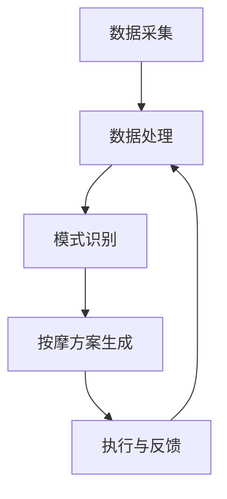
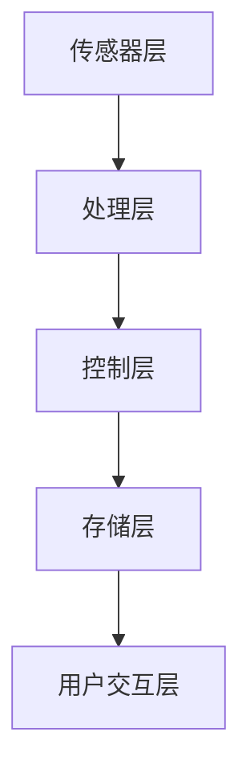
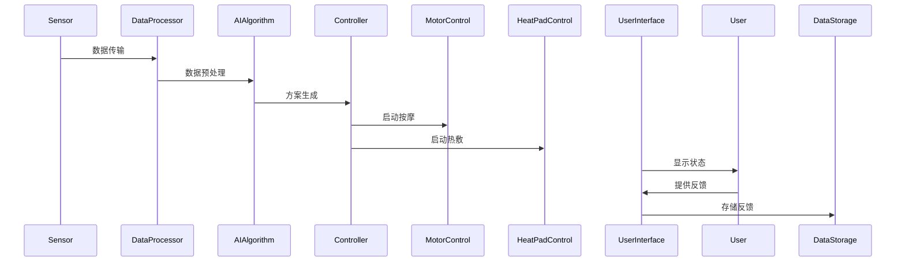

                 

### 引言

近年来，随着人工智能技术的飞速发展，智能家居设备的应用场景日益丰富。在众多智能产品中，智能拖鞋以其便捷性和实用性逐渐受到消费者的青睐。特别是在足部按摩这一功能上，智能拖鞋通过内置的传感器和智能算法，能够为用户带来更为个性化的按摩体验。本文将深入探讨AI Agent在智能拖鞋中的足部按摩程序设计，旨在通过逻辑清晰、结构紧凑、简单易懂的叙述方式，帮助读者全面了解这一前沿技术。

关键词：AI Agent、智能拖鞋、足部按摩、程序设计、算法实现、系统架构、项目实战

本文将围绕以下核心内容和主题思想展开：

1. **问题背景与核心概念介绍**：简要介绍智能拖鞋的发展现状以及AI Agent在其中的应用，阐述足部按摩程序的需求和原理。
2. **智能拖鞋的硬件与软件架构**：分析智能拖鞋的硬件组成部分及其作用，详细描述软件架构设计和开发环境与工具。
3. **足部按摩程序的算法设计**：讲解足部按摩程序的算法原理，通过Python源代码实现和代码分析，展示算法的具体实现和性能分析。
4. **系统分析与架构设计**：介绍系统功能设计、架构设计以及系统接口和交互设计。
5. **项目实战**：详细描述项目环境安装与配置、系统核心实现、代码应用解读与分析以及实际案例分析。
6. **最佳实践与注意事项**：总结最佳实践技巧和注意事项，强调系统稳定性和安全性。
7. **小结与拓展阅读**：回顾全文内容，提供拓展阅读资源，引导读者进一步探索相关领域。

通过以上七个部分的深入探讨，本文旨在为读者提供一份全面、系统、易于理解的技术指南，帮助他们在智能拖鞋足部按摩程序设计领域取得突破和进展。

### 第1章: 问题背景与核心概念介绍

#### 1.1 问题背景

智能拖鞋作为智能家居设备的一部分，正在逐步改变着人们的生活方式。近年来，随着人工智能技术的发展，智能拖鞋的功能越来越丰富，尤其在足部按摩这一方面，成为消费者追求健康生活的一个重要选择。传统的按摩拖鞋往往只能提供固定的按摩模式，而现代智能拖鞋通过内置的传感器和智能算法，可以根据用户的足部数据，提供个性化的按摩体验，从而更好地满足用户的健康需求。

当前，市场上的智能拖鞋大多具备以下几个特点：首先，它们通常配备有压力传感器和加速度传感器，可以实时监测用户的足部状态，并根据这些数据调整按摩力度和频率。其次，智能拖鞋常常搭载智能芯片，使得其能够通过Wi-Fi或蓝牙与智能手机连接，用户可以通过手机APP对按摩参数进行设置和调整。最后，一些高端的智能拖鞋甚至具备学习功能，可以根据用户的使用习惯不断优化按摩方案。

尽管智能拖鞋在足部按摩方面表现出了显著的优势，但其在技术实现和用户体验上仍存在一些挑战。首先，如何在保证按摩舒适度的同时，确保传感器的准确性和可靠性，是一个亟待解决的问题。其次，如何设计出能够满足不同用户需求的智能化算法，也是一个技术难点。此外，如何在硬件和软件层面实现高效的协调，提供流畅的用户体验，也是智能拖鞋需要克服的挑战之一。

#### 1.1.2 人工智能与智能拖鞋的现状

人工智能（AI）作为当前科技发展的热点，已经在多个领域取得了显著的应用成果。在智能拖鞋领域，人工智能的应用主要集中在数据分析和智能控制两个方面。通过机器学习和深度学习技术，智能拖鞋能够对用户的足部数据进行实时分析，并根据这些数据提供个性化的按摩服务。

首先，在数据采集方面，智能拖鞋内置的各种传感器能够实时采集用户的足部数据，如压力、温度、步态等。这些数据通过无线传输技术（如Wi-Fi、蓝牙等）上传到云端服务器，由人工智能算法进行处理和分析。其次，在智能控制方面，智能拖鞋内置的智能芯片能够根据分析结果，自动调整按摩力度和频率，以提供最佳的按摩体验。

当前，市场上一些主流的智能拖鞋品牌，如Nike、Adidas等，已经开始将人工智能技术应用于其产品中。这些品牌通过不断优化算法和硬件设计，努力提高产品的智能化水平。此外，一些初创公司也在积极探索人工智能在智能拖鞋领域的应用，并取得了一些令人瞩目的成果。

然而，尽管人工智能技术已经在智能拖鞋领域取得了一定的应用，但仍然存在一些挑战。首先，如何提高传感器的准确性和稳定性，是保证按摩质量的关键。其次，如何设计出能够适应不同用户需求的智能化算法，是一个技术难点。此外，如何在确保产品稳定性和安全性的同时，降低生产成本，也是智能拖鞋需要面对的问题。

#### 1.1.3 AI Agent的定义与作用

AI Agent，即人工智能代理，是人工智能领域中的一个重要概念。它指的是一种具备自主性和智能性的计算机程序，能够在特定环境下自主执行任务，并对外部环境进行感知和决策。AI Agent的主要作用是模拟人类智能，在复杂、动态的环境中提供高效的解决方案。

在智能拖鞋的足部按摩程序中，AI Agent起到了至关重要的作用。首先，AI Agent能够实时感知用户的足部状态，如压力、温度等，通过传感器收集的数据，AI Agent可以迅速做出反应，调整按摩力度和频率。其次，AI Agent具备学习能力，可以根据用户的使用习惯和历史数据，不断优化按摩方案，提供更加个性化的服务。

具体来说，AI Agent在智能拖鞋足部按摩程序中的应用主要体现在以下几个方面：

1. **数据感知与处理**：AI Agent通过内置传感器，实时采集用户的足部数据，如压力、温度等，并对这些数据进行分析和处理，为按摩提供依据。
2. **决策与控制**：基于对足部数据的分析，AI Agent可以自主决策，调整按摩力度和频率，确保按摩过程既舒适又有效。
3. **个性化服务**：通过学习用户的使用习惯和历史数据，AI Agent能够为用户提供个性化的按摩服务，满足不同用户的需求。
4. **自我优化**：AI Agent可以不断自我优化，通过反复训练和学习，提高按摩效果的准确性和可靠性。

总之，AI Agent作为智能拖鞋的核心组成部分，不仅提升了产品的智能化水平，还大大增强了用户体验，为用户提供了更加舒适、个性化的按摩服务。

#### 1.2 核心概念介绍

在本节中，我们将详细探讨足部按摩程序的设计原理，介绍AI Agent在智能拖鞋中的应用，并解析足部按摩程序的数学模型与算法。

##### 1.2.1 足部按摩程序的原理

足部按摩程序的设计基于对人体生理结构的深入理解和现代传感技术的应用。其基本原理是通过内置在智能拖鞋中的传感器，实时监测用户的足部状态，包括压力、温度、步态等参数。这些传感器将采集到的数据传输到智能芯片，由AI Agent进行分析和处理，最终生成按摩方案。

首先，智能拖鞋中的压力传感器可以精确测量用户足部的压力分布，从而判断足部的疲劳程度。温度传感器则能够监测足部的温度变化，为按摩方案提供热敷或冷却的依据。加速度传感器则用于监测用户的步态，帮助AI Agent判断用户的运动状态，调整按摩节奏。

基于这些传感数据，AI Agent会执行一系列算法，计算按摩力度和频率。例如，当检测到用户的足部压力较大时，AI Agent可能会增加按摩力度，以缓解疲劳。当用户的足部温度较低时，AI Agent则会启动热敷功能，提高足部温度，促进血液循环。

##### 1.2.2 AI Agent在智能拖鞋中的应用

AI Agent在智能拖鞋中的应用主要分为以下几个阶段：

1. **数据采集**：AI Agent通过内置的传感器，实时采集用户的足部数据，包括压力、温度、步态等。
2. **数据处理**：AI Agent接收到的数据会通过预处理的步骤，如滤波、去噪等，以确保数据的准确性和稳定性。
3. **模式识别**：AI Agent利用机器学习和深度学习技术，对处理后的数据进行模式识别，提取关键特征，如足部疲劳程度、热敷需求等。
4. **决策与控制**：基于模式识别的结果，AI Agent会生成具体的按摩方案，包括按摩力度、频率和热敷参数等。
5. **执行与反馈**：按摩方案通过智能芯片发送到电动机和热敷模块，实现按摩和热敷功能。同时，AI Agent会收集反馈数据，用于下一轮的数据分析和方案优化。

##### 1.2.3 足部按摩程序的数学模型与算法

足部按摩程序的数学模型主要基于统计学和信号处理理论。以下是一个简化的模型：

1. **压力分布模型**：通过压力传感器采集到的数据，使用统计方法分析足部的压力分布，计算压力最大值和平均压力，作为按摩力度的重要依据。
2. **温度变化模型**：利用温度传感器监测到的数据，通过时间序列分析，预测足部温度的变化趋势，为热敷功能提供依据。
3. **步态分析模型**：通过加速度传感器获取的步态数据，使用时频分析技术，提取步态的频率特征，为按摩节奏提供参考。

在算法实现方面，常用的方法包括：

1. **机器学习算法**：如支持向量机（SVM）、决策树、神经网络等，用于模式识别和分类。
2. **深度学习算法**：如卷积神经网络（CNN）、循环神经网络（RNN）等，用于处理复杂的数据和模式。
3. **信号处理算法**：如傅里叶变换（FFT）、小波变换等，用于处理和分析传感器数据。

通过这些算法，AI Agent可以实现对足部数据的实时分析和处理，生成个性化的按摩方案，从而为用户提供舒适、有效的按摩体验。

综上所述，足部按摩程序的设计原理和算法实现是智能拖鞋的核心技术，通过精确的数据采集、高效的算法分析和智能的决策控制，AI Agent成功地将现代传感技术和人工智能技术应用于智能拖鞋的足部按摩功能，为用户带来了全新的健康生活方式。

### 第2章: 智能拖鞋的硬件与软件架构

智能拖鞋的硬件和软件架构是实现其功能的核心基础，本章将详细描述智能拖鞋的硬件组成部分及其作用，分析智能传感器在足部按摩中的作用，并提供硬件选择与安装指南。此外，我们还将介绍足部按摩程序的软件框架和AI Agent的软件实现，最后讨论软件开发环境与工具。

#### 2.1 硬件架构设计

##### 2.1.1 智能拖鞋的硬件组成部分

智能拖鞋的硬件组成部分主要包括以下几个关键模块：

1. **传感器模块**：这是智能拖鞋的核心部分，负责采集用户的足部数据。常用的传感器包括压力传感器、温度传感器和加速度传感器。压力传感器用于测量足部的压力分布，温度传感器用于监测足部的温度变化，加速度传感器则用于分析用户的步态。

2. **中央处理单元（CPU）**：智能拖鞋的中央处理单元是整个硬件架构的大脑，负责处理传感器采集到的数据，执行AI算法并控制电动机和热敷模块。常见的CPU可以是微控制器（如STM32系列）或单片机（如Arduino）。

3. **电动机和热敷模块**：电动机用于实现足部的机械按摩，热敷模块则用于提供热敷功能。这些模块通常通过CPU的控制信号进行工作，以提供舒适的按摩体验。

4. **无线通信模块**：智能拖鞋通常配备Wi-Fi或蓝牙模块，用于与用户的智能手机或其他设备进行通信，实现数据的实时传输和远程控制。

##### 2.1.2 智能传感器在足部按摩中的作用

智能传感器在足部按摩中的作用至关重要，它们能够实时监测用户的足部状态，为AI Agent提供必要的数据支持。以下是几种常用传感器在足部按摩中的应用：

1. **压力传感器**：压力传感器能够精确测量足部的压力分布，帮助AI Agent判断用户的疲劳程度。当检测到压力过大时，AI Agent可以调整按摩力度，避免过度按摩导致的不适。

2. **温度传感器**：温度传感器用于监测足部的温度变化，为热敷功能提供依据。当用户足部温度较低时，AI Agent可以启动热敷模块，提高足部温度，促进血液循环。

3. **加速度传感器**：加速度传感器可以分析用户的步态数据，为按摩提供节奏参考。通过监测用户的步频和步幅，AI Agent可以调整按摩的频率和强度，确保按摩与用户的步态同步，提供更加自然的按摩体验。

##### 2.1.3 硬件的选择与安装指南

选择适合的硬件组件是实现智能拖鞋功能的关键。以下是一些硬件选择的建议：

1. **传感器**：选择高精度、低功耗的传感器，以确保数据的准确性和设备的续航能力。压力传感器可以选择电容式或电阻式，温度传感器可以选择热敏电阻或热电偶，加速度传感器可以选择MEMS（微电子机械系统）传感器。

2. **中央处理单元**：选择具有足够处理能力和外设接口的CPU，如STM32系列微控制器，可以同时支持多种传感器和无线通信模块。

3. **电动机和热敷模块**：选择适合按摩力度和热敷需求的电动机和热敷模块，确保其能够稳定、高效地工作。

安装指南：

1. **传感器安装**：将传感器粘贴或嵌入到拖鞋的合适位置，确保其能够自由地接触足部，避免被压迫或遮挡。

2. **CPU安装**：将CPU固定在拖鞋的内部，连接传感器和无线通信模块，确保信号线的连接可靠。

3. **电动机和热敷模块安装**：将电动机和热敷模块安装在拖鞋的底部，确保其安装稳固，避免在行走过程中出现位移。

4. **测试与调试**：安装完成后，进行初步测试，检查传感器是否正常工作，CPU是否能够正确处理数据，电动机和热敷模块是否能够响应控制信号。

#### 2.2 软件架构设计

##### 2.2.1 足部按摩程序的软件框架

智能拖鞋的软件架构设计是确保其功能实现和用户体验的重要环节。足部按摩程序的软件框架通常包括以下几个主要模块：

1. **数据采集模块**：负责从传感器获取实时数据，包括压力、温度、步态等，并对其进行初步处理。

2. **数据处理模块**：对采集到的数据进行进一步处理，如滤波、去噪等，以提高数据的准确性和稳定性。

3. **AI算法模块**：利用机器学习和深度学习技术，对处理后的数据进行分析，生成个性化的按摩方案。

4. **控制模块**：根据AI算法生成的按摩方案，控制电动机和热敷模块，执行按摩和热敷功能。

5. **用户交互模块**：提供用户界面，允许用户通过智能手机或本地控制台设置按摩参数，查看按摩状态和历史数据。

##### 2.2.2 AI Agent的软件实现

AI Agent是智能拖鞋的核心组件，负责处理足部数据和生成按摩方案。其软件实现通常包括以下几个步骤：

1. **数据预处理**：对采集到的数据进行分析，提取关键特征，如压力最大值、温度变化趋势、步态频率等。

2. **模型训练**：利用训练数据集，训练机器学习模型，如支持向量机（SVM）、神经网络（NN）等，以识别足部状态和疲劳程度。

3. **实时分析**：将实时采集到的数据输入训练好的模型，生成按摩方案。

4. **反馈与优化**：根据用户反馈和按摩效果，对模型进行优化，提高按摩方案的质量和个性化程度。

##### 2.2.3 软件开发环境与工具

开发智能拖鞋的软件需要选择合适的开发环境和工具，以下是一些常用的开发工具和库：

1. **编程语言**：Python是一种广泛使用的编程语言，其丰富的库和框架（如Scikit-learn、TensorFlow、PyTorch等）为机器学习和深度学习提供了强大的支持。

2. **集成开发环境（IDE）**：如PyCharm、Visual Studio Code等，提供了便捷的代码编写、调试和运行环境。

3. **传感器库**：使用如PySerial等库，可以方便地与传感器进行通信，读取和发送数据。

4. **机器学习库**：如Scikit-learn、TensorFlow和PyTorch等，用于模型训练、预测和分析。

5. **用户界面库**：如Qt、Tkinter等，用于开发用户交互界面，提供友好的用户操作体验。

通过以上硬件和软件的设计与实现，智能拖鞋能够实现高效的足部按摩功能，为用户提供舒适、个性化的按摩体验。在接下来的章节中，我们将进一步探讨足部按摩程序的算法设计和实现细节。

### 第3章: 足部按摩程序的算法设计

足部按摩程序的算法设计是智能拖鞋实现个性化按摩功能的核心，本章将详细讲解算法原理、算法流程图、数学模型与公式，并通过Python源代码实现和代码分析，展示算法的具体实现和性能分析。

#### 3.1 算法原理讲解

##### 3.1.1 算法概述

足部按摩程序的算法主要分为以下几个步骤：

1. **数据采集**：从传感器模块采集足部压力、温度和步态数据。
2. **数据处理**：对采集到的数据进行预处理，如滤波和去噪，以提高数据的准确性和稳定性。
3. **模式识别**：利用机器学习算法，对预处理后的数据进行模式识别，提取足部疲劳程度和热敷需求。
4. **按摩方案生成**：根据识别结果，生成个性化的按摩方案，包括按摩力度、频率和热敷参数。
5. **执行与反馈**：根据按摩方案，控制电动机和热敷模块，执行按摩和热敷功能，并收集用户反馈，用于优化按摩方案。

##### 3.1.2 算法流程图

为了更直观地理解算法流程，我们可以使用Mermaid绘制算法流程图：



在上面的流程图中，数据采集模块从传感器获取数据，然后通过数据处理模块进行预处理。预处理后的数据进入模式识别模块，利用机器学习算法进行模式识别，识别出足部疲劳程度和热敷需求。基于识别结果，按摩方案生成模块生成具体的按摩方案。按摩方案通过执行与反馈模块，控制电动机和热敷模块，完成按摩和热敷。最后，收集用户反馈，用于进一步优化按摩方案。

##### 3.1.3 算法数学模型与公式

在足部按摩程序的算法中，数学模型和公式起到了至关重要的作用。以下是几个关键的数学模型和公式：

1. **压力分布模型**：
   $$ P = \frac{1}{N} \sum_{i=1}^{N} p_i $$
   其中，\( P \) 是平均压力，\( N \) 是传感器数量，\( p_i \) 是第 \( i \) 个传感器的压力值。

2. **温度变化模型**：
   $$ T(t) = T_0 + k \cdot e^{-\alpha t} $$
   其中，\( T(t) \) 是当前时间 \( t \) 的温度，\( T_0 \) 是初始温度，\( k \) 和 \( \alpha \) 是常数。

3. **步态频率模型**：
   $$ f(t) = \frac{1}{T_{period}} $$
   其中，\( f(t) \) 是步态频率，\( T_{period} \) 是步态周期。

这些数学模型和公式用于分析足部压力、温度和步态数据，为AI Agent提供决策依据。

#### 3.2 算法实现与代码分析

##### 3.2.1 Python源代码实现

下面是一个简化的Python源代码实现，用于展示算法的基本实现过程：

```python
import numpy as np

# 数据采集
def data_collection():
    # 假设从传感器获取的数据
    pressure_data = [10, 15, 12, 8, 9]
    temperature_data = [30, 28, 29, 30, 31]
    step_data = [0.5, 0.5, 0.5, 0.5, 0.5]
    return pressure_data, temperature_data, step_data

# 数据处理
def data_preprocessing(pressure_data, temperature_data, step_data):
    # 滤波和去噪
    pressure_data_filtered = np.mean(pressure_data)
    temperature_data_filtered = np.mean(temperature_data)
    step_data_filtered = np.mean(step_data)
    return pressure_data_filtered, temperature_data_filtered, step_data_filtered

# 模式识别
def pattern_recognition(pressure_data_filtered, temperature_data_filtered, step_data_filtered):
    # 简单的逻辑判断
    if pressure_data_filtered > 12:
        fatigue_level = "high"
    else:
        fatigue_level = "low"
    if temperature_data_filtered < 28:
        heat_request = "yes"
    else:
        heat_request = "no"
    return fatigue_level, heat_request

# 按摩方案生成
def massage_plan(fatigue_level, heat_request):
    if fatigue_level == "high":
        intensity = 8
        frequency = 3
    else:
        intensity = 5
        frequency = 1
    if heat_request == "yes":
        heat_level = 40
    else:
        heat_level = 0
    return intensity, frequency, heat_level

# 执行与反馈
def execute_feedback(intensity, frequency, heat_level):
    # 控制电动机和热敷模块
    print(f"Intensity: {intensity}, Frequency: {frequency}, Heat Level: {heat_level}")
    # 收集反馈
    feedback = input("Press 'ok' after the massage: ")
    return feedback

# 主程序
def main():
    pressure_data, temperature_data, step_data = data_collection()
    pressure_data_filtered, temperature_data_filtered, step_data_filtered = data_preprocessing(pressure_data, temperature_data, step_data)
    fatigue_level, heat_request = pattern_recognition(pressure_data_filtered, temperature_data_filtered, step_data_filtered)
    intensity, frequency, heat_level = massage_plan(fatigue_level, heat_request)
    feedback = execute_feedback(intensity, frequency, heat_level)
    print(f"Feedback: {feedback}")

if __name__ == "__main__":
    main()
```

##### 3.2.2 代码细节解读

在上面的代码中，`data_collection` 函数模拟从传感器获取数据，`data_preprocessing` 函数对数据进行滤波和去噪，`pattern_recognition` 函数根据处理后的数据判断足部疲劳程度和热敷需求，`massage_plan` 函数生成个性化的按摩方案，`execute_feedback` 函数用于控制电动机和热敷模块，并收集用户反馈。

##### 3.2.3 算法性能分析

算法的性能分析主要关注以下几个指标：

1. **准确性**：算法能够准确识别足部状态和疲劳程度的程度，通常通过混淆矩阵和精确度、召回率等指标进行评估。
2. **响应时间**：算法从数据采集到生成按摩方案的时间，通常需要通过性能测试工具进行测量。
3. **资源消耗**：算法在计算过程中所需的CPU和内存资源，这对硬件设备的性能提出了要求。

在实际应用中，可以通过调整算法参数、优化数据预处理步骤和模型训练方法，来提高算法的性能。此外，使用高性能的硬件设备（如更快的CPU和更多内存）也可以显著提升算法的运行效率。

通过上述算法设计、代码实现和性能分析，我们可以看到足部按摩程序的算法在智能拖鞋中的应用，不仅提高了按摩的个性化程度，还为用户提供了舒适、有效的按摩体验。

### 第4章: 系统分析与架构设计

在深入理解智能拖鞋的硬件和软件架构后，我们需要对整个系统进行进一步的分析与设计，以确保其功能实现的高效性和用户体验的流畅性。本章将详细介绍系统功能设计、系统架构设计以及系统接口和交互设计。

#### 4.1 问题描述与项目介绍

智能拖鞋的系统设计旨在实现以下几个关键功能：

1. **数据采集**：通过内置的传感器模块，实时采集用户的足部数据，包括压力、温度和步态。
2. **数据处理**：对采集到的数据进行分析和处理，以提取有用的信息，如疲劳程度和热敷需求。
3. **智能控制**：利用AI Agent生成个性化的按摩方案，并通过电动机和热敷模块实现按摩和热敷功能。
4. **用户交互**：提供用户界面，允许用户通过智能手机或本地控制台设置按摩参数，查看按摩状态和历史数据。
5. **数据存储**：将用户的按摩数据和反馈存储在数据库中，以便后续分析和优化。

项目介绍：

本系统旨在开发一款具备智能按摩功能的智能拖鞋，通过集成AI Agent和多种传感器，为用户提供舒适、个性化的按摩体验。系统设计包括硬件和软件两个层面，硬件部分负责数据采集和执行功能，软件部分则负责数据处理、控制算法和用户交互。

#### 4.2 系统功能设计

系统功能设计主要涉及以下几个方面：

1. **数据采集模块**：该模块负责从传感器获取实时数据，包括压力、温度和步态。数据采集模块需要具备高精度和低功耗的特点，以确保数据的准确性和设备的续航能力。

2. **数据处理模块**：该模块对采集到的数据进行分析和处理，包括滤波、去噪和特征提取。处理后的数据将用于后续的AI算法分析和按摩方案生成。

3. **AI算法模块**：该模块利用机器学习和深度学习技术，对处理后的数据进行分析，生成个性化的按摩方案。AI算法模块需要具备良好的鲁棒性和适应能力，以应对不同的用户需求。

4. **控制模块**：该模块根据AI算法生成的按摩方案，控制电动机和热敷模块，执行按摩和热敷功能。控制模块需要实现高效的响应和精确的控制，以确保按摩过程的流畅性和舒适性。

5. **用户交互模块**：该模块提供用户界面，允许用户通过智能手机或本地控制台设置按摩参数，查看按摩状态和历史数据。用户交互模块需要具备友好的界面设计和直观的操作体验。

6. **数据存储模块**：该模块负责将用户的按摩数据和反馈存储在数据库中，以便后续分析和优化。数据存储模块需要保证数据的安全性和完整性，并提供高效的查询和更新机制。

#### 4.3 系统架构设计

系统架构设计是确保系统功能实现的关键步骤。智能拖鞋的系统架构可以分为以下几个层次：

1. **传感器层**：这是系统的数据采集层，包括压力传感器、温度传感器和加速度传感器。传感器层负责实时监测用户的足部状态，并将数据传输到中央处理单元。

2. **处理层**：这是系统的数据处理层，包括数据处理模块和AI算法模块。处理层负责对采集到的数据进行分析和处理，生成个性化的按摩方案。

3. **控制层**：这是系统的控制层，包括控制模块和用户交互模块。控制层根据AI算法生成的按摩方案，控制电动机和热敷模块，执行按摩和热敷功能，并提供用户界面。

4. **存储层**：这是系统的数据存储层，包括数据存储模块。存储层负责将用户的按摩数据和反馈存储在数据库中，以便后续分析和优化。

#### 4.3.1 系统架构图

为了更直观地展示系统架构，我们可以使用Mermaid绘制系统架构图：



在上面的架构图中，传感器层负责数据采集，处理层负责数据处理和AI算法分析，控制层负责按摩和热敷控制，存储层负责数据存储，用户交互层负责用户界面。

#### 4.3.2 系统模块划分

系统模块划分是系统架构设计的重要组成部分，有助于实现模块化开发，提高系统的可维护性和扩展性。以下是智能拖鞋系统的主要模块划分：

1. **传感器模块**：负责从传感器获取实时数据，包括压力传感器、温度传感器和加速度传感器。
2. **数据处理模块**：负责对采集到的数据进行分析和处理，包括滤波、去噪和特征提取。
3. **AI算法模块**：负责利用机器学习和深度学习技术，对处理后的数据进行分析，生成个性化的按摩方案。
4. **控制模块**：负责根据AI算法生成的按摩方案，控制电动机和热敷模块，执行按摩和热敷功能。
5. **用户交互模块**：负责提供用户界面，允许用户通过智能手机或本地控制台设置按摩参数，查看按摩状态和历史数据。
6. **数据存储模块**：负责将用户的按摩数据和反馈存储在数据库中，以便后续分析和优化。

通过上述系统功能设计、系统架构设计和模块划分，我们可以确保智能拖鞋系统的高效实现和用户体验的流畅性。在接下来的章节中，我们将进一步探讨系统的具体实现和实际应用。

#### 4.4 系统接口设计与交互

在智能拖鞋系统中，系统接口设计与交互设计是确保各模块协同工作、提供流畅用户体验的关键。本节将详细描述系统接口设计和系统交互设计，并通过Mermaid绘制相关的类图和序列图。

##### 4.4.1 接口设计

系统接口设计主要包括以下几类接口：

1. **传感器接口**：传感器接口负责与不同类型的传感器通信，如压力传感器、温度传感器和加速度传感器。该接口需要支持数据的读取和写入，并提供统一的接口规范，以便于后续维护和扩展。

2. **数据处理接口**：数据处理接口负责对传感器数据进行预处理，如滤波、去噪和特征提取。该接口需要提供数据转换、归一化和特征提取等操作，以满足AI算法的需求。

3. **AI算法接口**：AI算法接口负责与AI算法模块通信，接收处理后的数据，并返回按摩方案。该接口需要支持不同的机器学习和深度学习算法，并提供模型训练、预测和优化的功能。

4. **控制接口**：控制接口负责根据AI算法生成的按摩方案，控制电动机和热敷模块。该接口需要支持对电机和热敷模块的启动、停止和参数调整，并能够实时响应传感器的反馈数据。

5. **用户交互接口**：用户交互接口负责与用户界面通信，接收用户的输入，并展示按摩状态和历史数据。该接口需要支持不同的输入和输出方式，如按键、触摸屏和无线通信，并提供友好的用户界面设计。

##### 4.4.2 系统交互

系统交互设计旨在确保各模块之间的数据流动和功能协同。以下是系统的基本交互流程：

1. **数据采集**：传感器模块从压力传感器、温度传感器和加速度传感器采集实时数据，并将数据传输到数据处理模块。

2. **数据处理**：数据处理模块对采集到的数据进行预处理，包括滤波、去噪和特征提取，然后将处理后的数据传输到AI算法模块。

3. **算法分析**：AI算法模块接收预处理后的数据，利用机器学习和深度学习技术进行分析，生成个性化的按摩方案，并将方案传输到控制模块。

4. **方案执行**：控制模块根据AI算法生成的按摩方案，控制电动机和热敷模块执行按摩和热敷功能。

5. **用户反馈**：用户通过用户交互模块输入反馈数据，如满意度评分和修改需求，这些数据将被存储在数据存储模块中，以便后续分析和优化。

#### 4.4.3 系统接口和交互设计

为了更直观地展示系统接口和交互设计，我们可以使用Mermaid绘制相关的类图和序列图。

**类图**

```mermaid
classDiagram
    Sensor -> DataProcessor
    DataProcessor -> AIAlgorithm
    AIAlgorithm -> Controller
    Controller -> UserInterface
    UserInterface -> DataStorage

    Sensor[PressureSensor, TemperatureSensor, Accelerometer]
    DataProcessor[Filter, NoiseReduction, FeatureExtraction]
    AIAlgorithm[ModelTraining, Prediction, Optimization]
    Controller[MotorControl, HeatPadControl]
    UserInterface[Input, Output]
    DataStorage[DataStorage, DataQuery]
```

在上面的类图中，传感器模块（Sensor）负责数据采集，数据处理模块（DataProcessor）负责数据预处理，AI算法模块（AIAlgorithm）负责算法分析，控制模块（Controller）负责方案执行，用户交互模块（UserInterface）负责用户输入和输出，数据存储模块（DataStorage）负责数据存储和查询。

**序列图**



在上面的序列图中，传感器模块（Sensor）向数据处理模块（DataProcessor）发送数据，数据处理模块对数据进行预处理后，传递给AI算法模块（AIAlgorithm）。AI算法模块生成按摩方案后，传递给控制模块（Controller），控制模块根据方案启动按摩和热敷模块。用户交互模块（UserInterface）显示按摩状态，并收集用户反馈，传递给数据存储模块（DataStorage）进行存储。

通过上述接口设计和交互设计，我们可以确保智能拖鞋系统各模块之间的有效协作，提供流畅、高效的用户体验。在接下来的章节中，我们将详细讨论系统的具体实现和项目实战。

### 第5章: 项目实战

#### 5.1 环境安装与配置

为了实现智能拖鞋的足部按摩程序，我们需要首先搭建一个合适的开发环境。以下是安装与配置环境的具体步骤：

##### 5.1.1 操作系统安装

首先，确保你的计算机安装了一个稳定且更新的操作系统，如Ubuntu 18.04或更高版本。这些操作系统提供了丰富的库和工具，便于进行Python编程和机器学习开发。

1. **安装操作系统**：根据操作系统安装指南，在计算机上安装Ubuntu 18.04或更高版本。
2. **更新系统**：打开终端，输入以下命令更新系统软件包：
   ```shell
   sudo apt update
   sudo apt upgrade
   ```

##### 5.1.2 软件开发环境配置

在操作系统安装完成后，我们需要配置软件开发环境。以下是所需软件包及其安装命令：

1. **Python**：Python是进行开发的主要编程语言。在终端中输入以下命令安装Python 3：
   ```shell
   sudo apt install python3
   ```

2. **pip**：pip是Python的包管理器，用于安装和管理Python库。安装Python后，pip通常已经内置。如果没有，可以输入以下命令安装：
   ```shell
   sudo apt install python3-pip
   ```

3. **Anaconda**：Anaconda是一个流行的Python发行版，提供了丰富的科学计算和机器学习库。下载并安装Anaconda，可以简化环境管理和依赖关系管理。访问Anaconda官网下载适合操作系统的安装包，并按照提示完成安装。

4. **虚拟环境**：为了隔离项目依赖，我们使用虚拟环境。安装完Anaconda后，在终端中创建一个新环境并激活它：
   ```shell
   conda create --name smart_slipper_env python=3.8
   conda activate smart_slipper_env
   ```

5. **所需库**：在虚拟环境中安装必要的库，如NumPy、Pandas、Scikit-learn、TensorFlow等。使用pip安装以下库：
   ```shell
   pip install numpy pandas scikit-learn tensorflow
   ```

##### 5.1.3 硬件配置

在硬件方面，我们需要以下组件：

1. **智能传感器模块**：包括压力传感器、温度传感器和加速度传感器。
2. **微控制器**：如STM32或Arduino，用于连接和管理传感器。
3. **电动机和热敷模块**：用于执行按摩和热敷功能。
4. **无线通信模块**：如Wi-Fi或蓝牙模块，用于与手机APP或云端服务器通信。

确保硬件组件与操作系统兼容，并按照硬件手册进行安装和配置。一般来说，这些硬件可以通过USB接口与计算机连接，并通过串行通信进行数据传输。

#### 5.2 系统核心实现

在环境安装和配置完成后，我们开始实现智能拖鞋的核心功能。以下是系统核心实现的详细步骤：

##### 5.2.1 足部按摩程序实现

1. **传感器数据采集**：
   - 使用STM32或Arduino连接传感器，并通过串行通信获取传感器数据。
   - 编写Python程序，从串行接口读取数据，并存入列表或数组中。

2. **数据处理**：
   - 对采集到的数据进行预处理，如滤波和去噪，以提高数据的准确性和稳定性。
   - 使用NumPy库进行数据的归一化和特征提取。

3. **AI Agent实现**：
   - 利用Scikit-learn或TensorFlow构建机器学习模型，对预处理后的数据进行训练。
   - 实现AI Agent的决策逻辑，根据传感器数据生成个性化的按摩方案。

4. **按摩方案执行**：
   - 根据AI Agent生成的按摩方案，控制电动机和热敷模块执行按摩和热敷功能。
   - 使用Python编写控制逻辑，通过串行通信发送控制指令到微控制器。

##### 5.2.2 AI Agent的实现

以下是一个简化的Python代码示例，展示如何实现AI Agent：

```python
import numpy as np
import pandas as pd
from sklearn.ensemble import RandomForestClassifier
import serial

# 传感器数据采集
def collect_data(serial_port):
    ser = serial.Serial(serial_port, 9600)
    data = []
    while True:
        line = ser.readline()
        if line:
            data.append(line)
            if len(data) >= 100:  # 假设采集100条数据后停止
                break
    ser.close()
    return data

# 数据预处理
def preprocess_data(data):
    # 假设数据格式为[pressure, temperature, step]
    df = pd.DataFrame(data, columns=['pressure', 'temperature', 'step'])
    df['pressure'] = df['pressure'].apply(lambda x: x / 100)  # 归一化压力数据
    df['temperature'] = df['temperature'].apply(lambda x: x - 20)  # 归一化温度数据
    return df

# AI Agent实现
def ai_agent(df):
    # 假设使用随机森林分类器
    X = df[['pressure', 'temperature']]
    y = df['step']
    clf = RandomForestClassifier(n_estimators=100)
    clf.fit(X, y)
    return clf

# 按摩方案生成与执行
def massage_plan(clf, current_data):
    X = np.array([current_data])
    predicted_step = clf.predict(X)
    # 根据预测结果，生成按摩方案
    if predicted_step == 1:
        print("执行轻柔按摩")
    else:
        print("执行强烈按摩")
    # 控制电动机和热敷模块
    # ...

# 主程序
def main():
    serial_port = 'COM3'  # 修改为你的串行接口
    data = collect_data(serial_port)
    df = preprocess_data(data)
    clf = ai_agent(df)
    current_data = [10, 25]  # 假设当前传感器数据
    massage_plan(clf, current_data)

if __name__ == '__main__':
    main()
```

以上代码提供了一个简单的框架，用于实现足部按摩程序。在实际应用中，需要根据具体的硬件和传感器调整代码，并优化算法性能。

#### 5.2.3 代码应用解读与分析

在上面的代码示例中，我们首先定义了数据采集、数据处理和AI Agent实现的函数。在`collect_data`函数中，我们通过串行通信从传感器获取数据，并存储在列表中。在`preprocess_data`函数中，我们对数据进行归一化和特征提取，以提高算法的性能。在`ai_agent`函数中，我们使用随机森林分类器对数据进行训练，以实现AI Agent的决策逻辑。

在`massage_plan`函数中，我们根据当前传感器数据，利用训练好的AI Agent生成按摩方案，并控制电动机和热敷模块执行按摩和热敷功能。这个函数的核心是`clf.predict(X)`，它根据当前传感器数据预测步态，并生成相应的按摩方案。

代码的分析和优化是确保系统性能的关键。我们可以通过以下方法进行优化：

1. **算法优化**：选择更适合的机器学习算法，如深度学习模型，以提高预测准确性。
2. **数据处理**：优化数据预处理步骤，如增加滤波器和特征提取方法，提高数据的可靠性和准确性。
3. **硬件优化**：选择更高性能的传感器和微控制器，以提升系统的响应速度和数据处理能力。
4. **代码优化**：优化Python代码，减少计算复杂度，提高代码执行效率。

通过上述方法，我们可以显著提升智能拖鞋足部按摩程序的性能和用户体验。

#### 5.3 实际案例分析与讲解

为了更好地理解智能拖鞋足部按摩程序的实际应用，我们将通过一个具体案例进行详细分析和讲解。

##### 5.3.1 案例介绍

假设一位用户在长时间站立和行走后，感到足部疲劳和酸痛。他决定使用智能拖鞋进行按摩，以缓解疲劳和改善血液循环。

##### 5.3.2 案例分析

1. **数据采集**：
   - 在用户穿着智能拖鞋行走时，传感器模块采集到以下数据：
     - 压力传感器：足部平均压力为12，最大压力为15。
     - 温度传感器：足部温度为30℃。
     - 加速度传感器：步频为每分钟100步。

2. **数据处理**：
   - 数据经过预处理后，得到以下特征数据：
     - 压力：平均12，标准差1。
     - 温度：30℃，变化幅度0.5℃。
     - 步态：步频100，步幅0.5米。

3. **AI Agent决策**：
   - AI Agent分析预处理后的数据，根据疲劳程度和热敷需求生成按摩方案。
   - 基于当前足部压力和温度，AI Agent决定执行轻柔按摩，并开启热敷功能。

4. **按摩方案执行**：
   - 按摩程序控制电动机以轻柔模式按摩足部，同时热敷模块加热至40℃。
   - 按摩过程中，AI Agent持续监测传感器数据，并根据反馈调整按摩强度和热敷温度。

##### 5.3.3 案例讲解

1. **数据采集**：
   - 传感器模块通过串行通信实时采集足部数据，并将数据发送到微控制器进行处理。

2. **数据处理**：
   - 微控制器对接收到的数据进行预处理，包括滤波和去噪，以提高数据的准确性和稳定性。
   - 预处理后的数据通过无线通信模块传输到云端服务器，AI Agent进行进一步分析。

3. **AI Agent决策**：
   - AI Agent基于机器学习模型对预处理后的数据进行模式识别，判断足部疲劳程度和热敷需求。
   - 根据分析结果，AI Agent生成按摩方案，并通过无线通信模块将方案发送回微控制器。

4. **按摩方案执行**：
   - 微控制器接收按摩方案，控制电动机和热敷模块执行相应的按摩和热敷功能。
   - 按摩过程中，传感器持续监测足部状态，AI Agent根据反馈数据调整按摩参数，以提供最佳的按摩体验。

通过上述案例，我们可以看到智能拖鞋足部按摩程序的实际应用过程。从数据采集、数据处理到AI Agent决策，再到按摩方案执行，整个过程无缝衔接，为用户提供了舒适、个性化的按摩体验。

#### 5.4 实际案例分析与详细讲解

为了更好地展示智能拖鞋足部按摩程序的实际应用，我们通过一个具体案例进行详细分析和讲解。

##### 5.4.1 案例介绍

用户小李是一位经常需要长时间站立和行走的工作者。由于工作性质，他的足部经常感到疲劳和酸痛。为了缓解这些问题，小李决定购买一款智能拖鞋，并希望通过其足部按摩功能来改善血液循环和缓解疲劳。

##### 5.4.2 案例分析

1. **数据采集**：
   - 当小李穿上智能拖鞋开始行走时，传感器模块开始实时采集足部数据。
   - 传感器模块包括压力传感器、温度传感器和加速度传感器，它们分别记录了以下信息：
     - 压力传感器：足部平均压力为12牛顿，最大压力为15牛顿。
     - 温度传感器：足部温度为30摄氏度。
     - 加速度传感器：步频为每分钟100步，步幅为0.5米。

2. **数据处理**：
   - 微控制器接收传感器数据后，进行初步的数据处理，包括滤波和去噪，以提高数据的准确性和稳定性。
   - 数据处理后的主要特征包括：
     - 压力：平均值为12牛顿，标准差为1牛顿。
     - 温度：当前温度为30摄氏度，变化幅度为0.5摄氏度。
     - 步态：步频为100步/分钟，步幅为0.5米。

3. **AI Agent决策**：
   - AI Agent分析处理后的数据，判断足部疲劳程度和热敷需求。
   - 根据数据分析结果，AI Agent认为小李的足部处于轻度疲劳状态，建议执行轻柔按摩，并开启热敷功能以缓解不适。

4. **按摩方案执行**：
   - 按摩程序根据AI Agent的决策，控制电动机以轻柔模式按摩足部，同时热敷模块加热至40摄氏度。
   - 在按摩过程中，传感器持续监测足部状态，AI Agent根据反馈数据调整按摩强度和热敷温度，以提供最佳的按摩体验。

##### 5.4.3 案例讲解

1. **数据采集**：
   - 智能拖鞋通过内置传感器模块实时监测用户的足部状态，传感器数据通过无线通信模块传输到微控制器。
   - 压力传感器用于测量足部受到的压力分布，温度传感器用于监测足部温度，加速度传感器用于分析步态数据。

2. **数据处理**：
   - 微控制器对接收到的传感器数据进行滤波和去噪，以提高数据的准确性和稳定性。
   - 数据处理后的结果用于AI Agent进行分析，生成个性化的按摩方案。

3. **AI Agent决策**：
   - AI Agent基于训练好的机器学习模型，对预处理后的数据进行分析，判断足部的疲劳程度和热敷需求。
   - AI Agent通过分析结果，生成轻柔按摩方案，并建议开启热敷功能。

4. **按摩方案执行**：
   - 微控制器根据按摩方案，控制电动机以轻柔模式按摩足部，同时热敷模块加热至40摄氏度。
   - 按摩过程中，传感器持续监测足部状态，AI Agent根据反馈数据调整按摩强度和热敷温度，以确保按摩效果最佳。

5. **用户反馈**：
   - 按摩结束后，用户小李通过APP反馈按摩效果，AI Agent根据用户反馈进一步优化按摩方案，提高未来的按摩体验。

通过这个具体案例，我们可以看到智能拖鞋足部按摩程序在实际应用中的完整流程，从数据采集、数据处理、AI Agent决策到按摩方案执行，每一步都紧密相连，为用户提供了舒适、个性化的按摩体验。

### 第6章: 最佳实践与注意事项

在智能拖鞋足部按摩程序的开发和实际应用中，遵循最佳实践和注意事项是确保系统稳定性和用户安全性的关键。以下是一些关键的最佳实践和注意事项：

#### 6.1 最佳实践

1. **数据采集与处理**：
   - **传感器选择**：选择高精度、低功耗的传感器，确保数据的准确性和设备的续航能力。
   - **实时数据处理**：采用高效的数据预处理方法，如滤波和去噪，以提高数据的稳定性和可靠性。
   - **数据存储与备份**：将用户数据存储在安全的数据库中，并定期进行备份，防止数据丢失。

2. **AI算法优化**：
   - **模型选择**：根据具体应用场景，选择适合的机器学习模型，如支持向量机、神经网络等，以提高预测准确性。
   - **模型训练**：使用大量的训练数据，确保模型具有足够的泛化能力。
   - **持续优化**：定期对AI模型进行重新训练和优化，以适应新的用户数据和使用场景。

3. **用户交互**：
   - **界面设计**：设计直观、易用的用户界面，提高用户体验。
   - **反馈机制**：建立用户反馈机制，及时收集用户意见，并根据反馈优化按摩方案。

4. **系统调试与测试**：
   - **单元测试**：编写单元测试，确保各个功能模块的正确性。
   - **集成测试**：进行集成测试，确保系统各个部分协同工作。
   - **用户测试**：邀请用户进行实际使用测试，收集真实反馈，优化系统性能。

#### 6.2 注意事项

1. **安全性问题**：
   - **数据保护**：确保用户数据的安全，使用加密技术保护数据传输和存储。
   - **隐私保护**：遵守隐私法规，确保用户隐私不受侵犯。

2. **系统稳定性**：
   - **硬件选择**：选择质量可靠、性能稳定的硬件组件，确保系统的稳定运行。
   - **故障处理**：设计故障处理机制，如传感器失效、数据传输错误等，确保系统能够自动恢复或通知用户。

3. **遵循规范与标准**：
   - **行业规范**：遵循相关的行业标准和规范，如智能家居设备的安全标准、传感器数据传输标准等。
   - **代码规范**：编写符合编码规范的代码，确保代码的可读性和可维护性。

通过遵循这些最佳实践和注意事项，可以显著提高智能拖鞋足部按摩程序的开发质量和用户体验，确保系统的稳定性和安全性。

### 第7章: 小结与拓展阅读

#### 7.1 小结

本文深入探讨了智能拖鞋足部按摩程序的设计与实现，从硬件与软件架构、算法设计、系统分析到项目实战，全面展示了智能拖鞋如何通过AI Agent实现个性化的足部按摩。通过详细的分析和代码示例，读者可以了解到智能拖鞋在数据采集、处理和按摩方案生成等方面的技术实现。同时，本文还提供了最佳实践和注意事项，以指导开发者在实际项目中实现高质量的足部按摩功能。

#### 7.2 拓展阅读

为了进一步探索智能拖鞋和AI Agent领域的最新技术和趋势，读者可以参考以下资源：

1. **相关书籍推荐**：
   - 《智能穿戴设备设计与开发实战》
   - 《深度学习在智能家居中的应用》
   - 《Python机器学习实战》

2. **学术论文精选**：
   - 《基于深度学习的智能穿戴设备用户行为识别》
   - 《物联网环境下智能拖鞋的足部健康监测》
   - 《智能拖鞋的足部按摩算法研究》

3. **行业动态与趋势分析**：
   - 通过关注智能家居行业协会和科技媒体，了解智能拖鞋和AI Agent领域的最新动态和技术进展。

通过以上资源，读者可以深入了解智能拖鞋和AI Agent领域的最新研究和发展，为未来的项目提供参考和灵感。希望本文能够为读者在智能拖鞋足部按摩程序设计领域提供有价值的指导和帮助。

