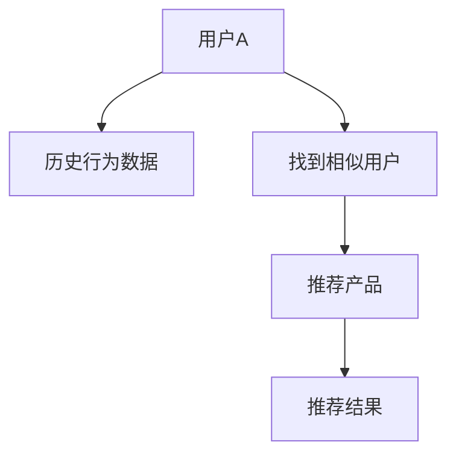
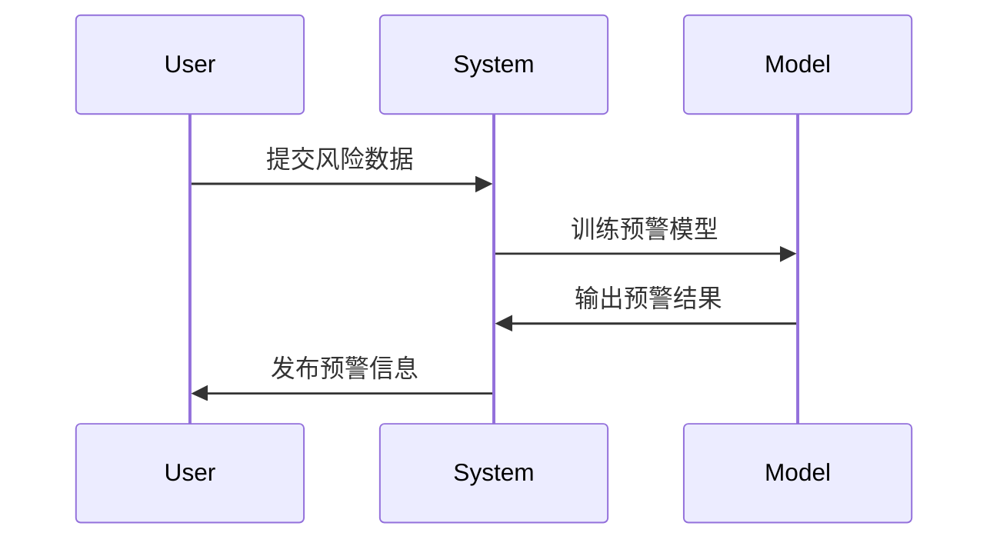
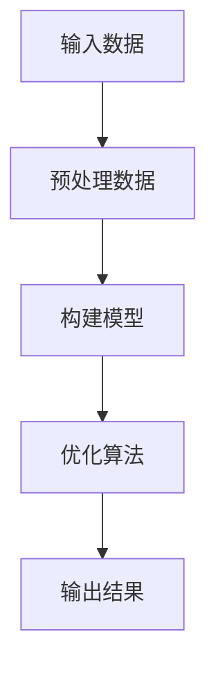
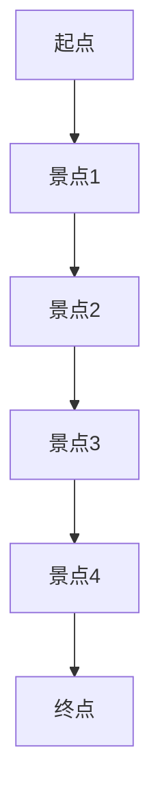
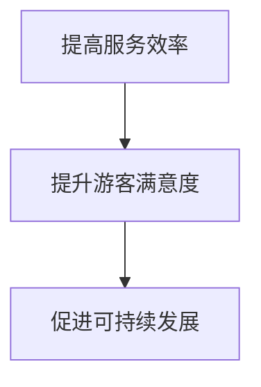
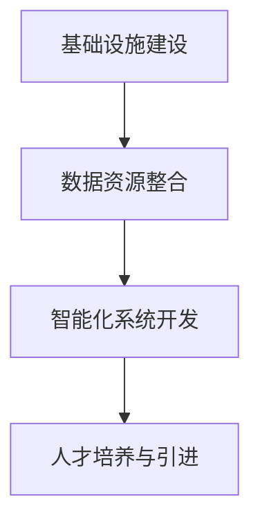

                 

### 文章标题：AI Agent在智能旅游规划中的应用

#### 关键词：
- AI Agent
- 智能旅游规划
- 个性化推荐
- 旅游风险评估
- 智慧旅游目的地建设

#### 摘要：
本文将深入探讨AI Agent在智能旅游规划中的应用，通过逻辑清晰、结构紧凑的论述，详细介绍AI Agent的基础知识、智能旅游规划中的数据与AI、AI Agent在具体应用场景中的案例，以及其在未来展望中的挑战与机遇。本文旨在为读者提供一个全面、系统的认识，助力智能旅游规划的发展与实现。

### 引言与背景

#### 智能旅游规划概述

智能旅游规划是指利用信息技术和人工智能技术，对旅游活动中的各个环节进行智能化管理和服务，以提高旅游体验、优化资源配置、提升旅游产业整体效益的一种新型旅游规划模式。智能旅游规划的核心在于通过数据采集、处理和分析，实现对游客需求、旅游资源、旅游环境的全面了解，从而提供个性化的旅游服务、旅游产品设计和旅游路线规划。

随着信息技术的快速发展，人工智能（AI）已经成为推动智能旅游规划的重要力量。AI Agent作为人工智能的一种高级形式，具有自主学习、自主决策、自主执行的能力，可以在智能旅游规划中发挥重要作用。

#### AI Agent的概念与作用

AI Agent，即人工智能代理，是指具有独立思考、决策和执行能力的计算机程序。AI Agent通过感知环境、理解信息、学习知识和制定计划，实现自主运行和任务完成。在智能旅游规划中，AI Agent可以应用于多个方面：

1. **个性化推荐**：根据游客的兴趣和需求，提供个性化的旅游产品和路线推荐。
2. **旅游风险评估**：对旅游环境、旅游设施和游客行为进行分析，预测潜在风险并提前预警。
3. **旅游行程规划**：根据游客的喜好和时间安排，自动生成最优的旅游行程。
4. **智慧旅游目的地建设**：通过数据分析和管理，提升旅游目的地的智能化水平和游客满意度。

#### AI Agent在智能旅游规划中的应用现状

目前，AI Agent在智能旅游规划中的应用已经取得了显著的成果。例如，一些旅游平台已经开始使用AI Agent进行个性化推荐，通过分析游客的历史行为和兴趣偏好，提供个性化的旅游建议。此外，一些智慧旅游目的地也利用AI Agent进行旅游风险评估和行程规划，提高了旅游服务的质量和效率。

然而，AI Agent在智能旅游规划中的应用仍然面临一些挑战，如数据隐私保护、算法透明度、决策伦理等问题。因此，需要进一步研究和探索，以实现AI Agent在智能旅游规划中的广泛应用。

#### 书籍结构安排

本书分为三个部分，共十章：

1. **第一部分：引言与背景**，介绍智能旅游规划与AI Agent的基本概念和现状。
2. **第二部分：AI Agent在智能旅游规划中的应用案例**，详细探讨AI Agent在个性化推荐、旅游风险评估、旅游行程规划、智慧旅游目的地建设中的应用。
3. **第三部分：AI Agent在智能旅游规划中的未来展望**，分析AI Agent在智能旅游规划中的挑战与机遇，以及相关的伦理和法律问题。

通过本书的阅读，读者可以全面了解AI Agent在智能旅游规划中的应用，为实际工作和研究提供有益的参考。

### AI Agent基础

#### 人工智能与机器学习基础

人工智能（AI）是计算机科学的一个分支，旨在使计算机具有人类智能，能够执行复杂的任务，如理解语言、感知环境、做出决策等。机器学习（ML）是人工智能的一种方法，通过从数据中学习，使计算机能够识别模式、预测结果和自动优化。

在人工智能与机器学习领域，常用的算法包括：

- **监督学习**：通过标记数据训练模型，使模型能够对未知数据进行预测。
- **无监督学习**：在没有标记数据的情况下，通过发现数据中的隐含模式进行学习。
- **强化学习**：通过与环境互动，不断调整策略以实现最大化奖励。

这些算法为AI Agent提供了强大的学习能力，使其能够处理复杂的问题。

#### AI Agent的基本架构

AI Agent的基本架构通常包括以下几个组成部分：

- **感知器**：用于接收外部环境的输入信息，如文字、图像、声音等。
- **推理机**：根据感知到的信息，利用规则库和知识库进行推理和决策。
- **执行器**：根据推理结果，执行相应的任务或动作。

这种架构使得AI Agent能够在复杂的环境中自主运行和完成任务。

#### AI Agent的核心功能与特性

AI Agent具有以下几个核心功能与特性：

- **自主性**：AI Agent能够自主地感知环境、理解和处理信息、做出决策和执行任务。
- **智能性**：AI Agent能够通过学习和推理，解决复杂的问题。
- **灵活性**：AI Agent能够适应不同的环境和任务，具有较好的泛化能力。
- **协作性**：AI Agent能够与其他AI Agent或人类进行协作，共同完成任务。

这些特性使得AI Agent在智能旅游规划中具有广泛的应用前景。

#### AI Agent的分类与应用场景

根据应用场景和任务需求，AI Agent可以分为以下几类：

1. **基于规则的AI Agent**：这种AI Agent主要依赖于规则库和知识库，通过推理机进行决策。适用于需要明确规则和流程的场景，如旅游行程规划、旅游风险评估等。
2. **基于模型的AI Agent**：这种AI Agent主要依赖于机器学习模型，通过训练数据进行预测和决策。适用于需要大量数据支持和复杂模式识别的场景，如个性化推荐、旅游目的地推荐等。
3. **混合型AI Agent**：这种AI Agent结合了基于规则和基于模型的方法，具有更好的适应性和灵活性。适用于复杂多变、需要综合分析和决策的场景，如智慧旅游目的地建设、旅游大数据分析等。

通过合理选择和应用不同类型的AI Agent，可以更好地实现智能旅游规划的目标。

### 智能旅游中的数据与AI

#### 旅游数据概述

在智能旅游规划中，数据是基础和核心。旅游数据包括游客信息、旅游活动记录、旅游资源信息、旅游设施信息等。这些数据种类繁多，格式多样，来源广泛。

- **游客信息**：包括游客的基本信息、兴趣偏好、行为记录等。
- **旅游活动记录**：包括游客的行程、消费、评价等。
- **旅游资源信息**：包括景点、酒店、餐厅、交通设施等的信息。
- **旅游设施信息**：包括景区的设施、设备、服务人员的安排等。

这些数据为AI Agent提供了丰富的输入，使其能够更好地理解和预测游客需求，提供个性化的服务。

#### 数据采集与处理

数据采集是智能旅游规划中至关重要的一环。以下是一个典型的数据采集和处理流程：

1. **数据采集**：通过多种渠道收集数据，如线上平台、移动应用、传感器、问卷调查等。
2. **数据清洗**：对采集到的数据去重、去噪声、填补缺失值等，保证数据的质量和准确性。
3. **数据转换**：将不同格式的数据进行统一处理，如将文本数据转换为数字或图像数据。
4. **数据存储**：将处理后的数据存储到数据库或数据仓库中，以便后续分析和处理。

#### 数据分析在智能旅游中的应用

数据分析在智能旅游中具有广泛的应用，以下是一些关键应用场景：

1. **游客需求分析**：通过分析游客的历史行为和偏好，了解他们的需求，为个性化推荐提供依据。
2. **旅游市场分析**：通过分析旅游数据的分布和趋势，了解市场的需求和潜力，为旅游产品的设计和营销提供参考。
3. **旅游风险评估**：通过分析游客的行为和旅游环境的数据，预测潜在的风险，提前采取防范措施。
4. **旅游行程规划**：通过分析游客的需求和时间安排，自动生成最优的旅游行程，提高旅游体验。

#### AI Agent与旅游数据的融合

AI Agent与旅游数据的融合，是智能旅游规划的核心和关键。以下是一个典型的融合过程：

1. **数据预处理**：对旅游数据进行清洗、转换和存储，为AI Agent提供高质量的数据输入。
2. **特征工程**：从数据中提取关键特征，为AI Agent的模型训练提供支持。
3. **模型训练**：利用机器学习算法，对AI Agent进行训练，使其能够理解和预测旅游数据。
4. **模型部署**：将训练好的AI Agent部署到旅游平台或系统中，实现自动化、智能化的服务。

通过AI Agent与旅游数据的深度融合，可以大幅提升智能旅游规划的效果和效率，为游客提供更加优质、个性化的服务。

### 旅游个性化推荐

#### 旅游个性化推荐系统架构

旅游个性化推荐系统是利用人工智能技术，为游客提供个性化旅游产品推荐的一种智能旅游服务。其系统架构主要包括以下几个部分：

1. **用户行为分析模块**：用于收集和分析游客的历史行为数据，如浏览记录、消费记录、评价等。
2. **推荐算法模块**：包括协同过滤、基于内容的推荐、混合推荐等算法，用于生成个性化推荐结果。
3. **推荐结果展示模块**：用于将推荐结果以用户友好的方式展示，如推荐列表、推荐地图等。
4. **反馈机制模块**：用于收集游客对推荐结果的反馈，以不断优化推荐系统。

#### 旅游个性化推荐算法

旅游个性化推荐算法是旅游个性化推荐系统的核心，主要包括以下几种：

1. **协同过滤算法**：基于用户的历史行为数据，找到与目标用户相似的用户，推荐他们喜欢的旅游产品。
2. **基于内容的推荐算法**：根据旅游产品的属性和特征，为游客推荐与其兴趣相似的旅游产品。
3. **混合推荐算法**：结合协同过滤和基于内容的推荐，生成更加精准的推荐结果。

以下是一个协同过滤算法的Mermaid流程图：



#### 旅游个性化推荐应用实例

以下是一个旅游个性化推荐的应用实例：

假设用户张三最近浏览了海南三亚的旅游景点，并评价了“天涯海角”为“非常棒”。基于这些信息，旅游个性化推荐系统可以为他推荐以下旅游产品：

1. **三亚其他热门景点**：如“亚龙湾”、“大东海”等。
2. **海南特色美食**：如“清补凉”、“椰子饭”等。
3. **三亚周边酒店**：如“三亚亚龙湾如家酒店”、“三亚海棠湾希尔顿酒店”等。

通过这样的个性化推荐，不仅能够提高用户的旅游体验，还能够为旅游企业带来更多的业务机会。

### 旅游风险评估与预警

#### 旅游风险评估模型

旅游风险评估是智能旅游规划中的重要环节，用于识别、评估和监控旅游活动中的潜在风险。以下是一个典型的旅游风险评估模型：

1. **风险识别**：通过数据分析、专家评审等方法，识别出旅游活动中的各种潜在风险，如自然灾害、人为破坏、疾病传播等。
2. **风险评估**：对识别出的风险进行定量或定性的评估，确定其风险等级和影响范围。
3. **风险监控**：实时监控旅游活动中的风险变化，及时采取应对措施。

以下是一个基于Mermaid的ER实体关系图架构：

```mermaid
erDiagram
    Risk |-> TourismEvent : "has"
    Risk |-> RiskFactor : "contains"
    TourismEvent |-> RiskEvent : "has"
    RiskFactor |-> RiskType : "type of"
```

#### 旅游风险预警系统设计

旅游风险预警系统是用于提前发现和预警旅游活动中潜在风险的一种智能系统。其设计主要包括以下几个部分：

1. **预警指标**：根据旅游风险评估结果，确定预警的指标和阈值，如自然灾害预警、疾病传播预警等。
2. **预警模型**：利用机器学习算法，构建预警模型，实现对风险的预测和预警。
3. **预警机制**：设计预警机制，包括预警信息的发布、接收和处理，确保预警信息的及时性和准确性。
4. **预警反馈**：对预警结果进行反馈，不断优化预警模型和机制。

以下是一个基于Mermaid的预警机制架构图：



#### 旅游风险预警案例解析

以下是一个旅游风险预警的案例解析：

假设某旅游目的地近期出现连续的暴雨天气，根据历史数据分析和机器学习预警模型预测，未来几天内暴雨天气的风险等级较高。预警系统会自动生成预警报告，并向旅游管理部门、游客发出预警信息，建议游客合理安排行程，注意安全。

通过这样的旅游风险预警系统，可以有效降低旅游活动中的风险，保障游客的安全和旅游体验。

### 旅游行程规划

#### 旅游行程规划方法

旅游行程规划是智能旅游规划中的重要一环，旨在为游客提供合理的旅游行程，提高旅游体验。以下是一些常见的旅游行程规划方法：

1. **基于规则的规划方法**：根据旅游指南、景点介绍等信息，制定固定的旅游行程。
2. **基于数据的规划方法**：利用游客的历史行为数据和旅游目的地信息，自动生成个性化的旅游行程。
3. **基于优化的规划方法**：利用优化算法，如遗传算法、模拟退火算法等，找到最优的旅游行程。

以下是一个基于Mermaid的优化规划流程图：



#### 旅游行程规划算法

旅游行程规划算法是用于生成合理旅游行程的关键技术。以下是一些常见的旅游行程规划算法：

1. **最小生成树算法**：通过连接景点之间的最优路径，构建一个包含所有景点的最小生成树，实现旅游行程的最优化。
2. **旅行商问题（TSP）算法**：寻找从起点到各景点再回到起点的最短路径，实现旅游行程的最优化。
3. **多目标规划算法**：考虑多个目标，如时间、距离、费用等，找到平衡各目标的最佳旅游行程。

以下是一个基于Mermaid的TSP算法流程图：



#### 旅游行程规划应用案例

以下是一个旅游行程规划的应用案例：

假设游客李四计划在周末前往北京旅游，他希望在有限的时间内游览尽可能多的景点。基于他的需求，旅游行程规划系统为他推荐以下行程：

1. **第一天**：上午游览故宫，下午游览天安门广场。
2. **第二天**：上午游览长城，下午游览颐和园。
3. **第三天**：上午游览圆明园，下午游览鸟巢和水立方。

通过这样的个性化行程规划，李四可以充分利用周末时间，游览北京的主要景点，获得丰富的旅游体验。

### 智慧旅游目的地建设

#### 智慧旅游目的地的概念与目标

智慧旅游目的地是指通过应用信息技术和人工智能技术，实现旅游目的地智能化管理和服务的一种新型旅游目的地。其核心目标是提高旅游服务的质量和效率，提升游客的满意度，推动旅游产业的可持续发展。

智慧旅游目的地的主要目标包括：

1. **提高旅游服务效率**：通过智能化系统，实现旅游服务的自动化和高效化，减少人力成本和等待时间。
2. **提升游客满意度**：通过个性化服务，满足游客的个性化需求，提高游客的满意度和忠诚度。
3. **促进旅游产业可持续发展**：通过数据分析和管理，优化旅游资源分配，实现旅游资源的合理利用和保护。

以下是一个基于Mermaid的智慧旅游目的地目标架构图：



#### 智慧旅游目的地建设策略

智慧旅游目的地建设是一个系统工程，需要从多个方面进行规划和实施。以下是一些关键的智慧旅游目的地建设策略：

1. **基础设施建设**：建设智能化的基础设施，如智能景区、智能酒店、智能交通等，为智慧旅游提供硬件支持。
2. **数据资源整合**：整合各类旅游数据，实现数据资源的共享和利用，为智慧旅游提供数据支持。
3. **智能化系统开发**：开发智能化系统，如智能导游、智能推荐、智能分析等，为智慧旅游提供软件支持。
4. **人才培养与引进**：培养和引进专业人才，提高智慧旅游目的地建设的专业水平。

以下是一个基于Mermaid的智慧旅游目的地建设策略架构图：



#### 智慧旅游目的地建设案例研究

以下是一个智慧旅游目的地建设的案例研究：

以黄山为例，黄山是一个著名的旅游目的地，通过智慧旅游建设，实现了旅游服务的智能化和高效化。其主要措施包括：

1. **智能景区建设**：通过建设智能导览系统、智能监控系统、智能厕所等，提高了景区的服务质量和游客体验。
2. **智能交通管理**：通过建设智能停车场、智能交通监控系统等，实现了景区交通的智能化管理和优化。
3. **智能推荐系统**：通过分析游客行为数据，为游客提供个性化的旅游推荐，提高了游客的满意度。
4. **智能数据分析**：通过分析景区运营数据，优化景区资源分配，提高了景区的运营效率。

通过这些措施，黄山成功实现了智慧旅游目的地建设，提高了旅游服务的质量和效率，受到了游客和业内人士的一致好评。

### AI Agent在智能旅游规划中的挑战与机遇

#### AI Agent在智能旅游规划中的挑战

尽管AI Agent在智能旅游规划中具有巨大的潜力，但其应用仍然面临一些挑战：

1. **数据隐私保护**：在收集、处理和分析游客数据时，需要确保数据的安全性，防止数据泄露和滥用。
2. **算法透明度**：AI Agent的决策过程往往是非线性和复杂的，需要提高算法的透明度，使其决策过程可解释、可信任。
3. **决策伦理**：在应用AI Agent进行旅游风险评估、行程规划等时，需要考虑伦理问题，确保决策的公正性和公平性。
4. **技术成熟度**：目前AI Agent的技术尚未完全成熟，需要不断优化和完善，提高其性能和可靠性。

#### AI Agent在智能旅游规划中的机遇

尽管面临挑战，但AI Agent在智能旅游规划中仍然具有巨大的机遇：

1. **个性化服务**：通过AI Agent的个性化推荐，可以更好地满足游客的个性化需求，提高游客满意度。
2. **风险预警**：通过AI Agent的风险评估和预警，可以提前发现和应对旅游活动中的潜在风险，保障游客安全。
3. **资源优化**：通过AI Agent的数据分析和优化，可以优化旅游资源的分配和使用，提高旅游产业的整体效益。
4. **产业升级**：AI Agent的应用可以推动旅游产业向智能化、数字化转型，提升旅游产业的竞争力。

#### AI Agent在智能旅游规划中的未来发展

随着AI技术的不断发展和完善，AI Agent在智能旅游规划中的应用前景将更加广阔。以下是一些可能的未来发展趋势：

1. **更加智能的AI Agent**：通过不断优化算法和提升技术，使AI Agent具有更强的自主性、智能性和适应性。
2. **多模态数据融合**：结合多种数据来源，如图像、声音、文本等，实现更加全面和准确的旅游数据分析。
3. **跨领域合作**：与旅游产业的其他领域，如酒店、交通、餐饮等，实现跨领域的协同和共享，提升整体服务能力。
4. **伦理和法律规范**：制定相应的伦理和法律规范，确保AI Agent在智能旅游规划中的应用符合道德和法律规定。

通过不断克服挑战和把握机遇，AI Agent在智能旅游规划中的未来发展将充满希望。

### 智能旅游规划中的伦理与法律问题

#### 智能旅游规划中的伦理问题

在智能旅游规划中，AI Agent的应用引发了一系列伦理问题，主要包括：

1. **数据隐私**：AI Agent需要收集和处理大量游客数据，如何保护游客的隐私成为关键伦理问题。
2. **算法透明度**：AI Agent的决策过程往往复杂且不透明，如何提高算法的透明度，使公众能够理解其决策逻辑，是伦理问题的重要方面。
3. **算法歧视**：AI Agent的决策可能受到数据偏见的影响，导致对某些群体产生不公平的待遇，如何避免算法歧视是伦理问题之一。
4. **责任归属**：在AI Agent发生错误决策或导致不良后果时，如何确定责任归属是伦理问题中的难点。

#### 智能旅游规划中的法律问题

智能旅游规划中的法律问题主要包括以下几个方面：

1. **数据保护法律**：涉及游客个人数据的收集、存储、使用和分享，需要遵守相关数据保护法律，如《通用数据保护条例》（GDPR）。
2. **隐私权法律**：游客对其个人信息的隐私权受到法律保护，智能旅游规划中的数据处理活动必须尊重游客的隐私权。
3. **消费者权益法律**：在提供旅游服务时，必须遵守消费者权益保护法律，确保服务的公平、透明和高质量。
4. **算法透明度法律**：为了提高算法的透明度，法律可能要求AI Agent的决策过程可解释，以便用户能够理解并信任其服务。

#### 伦理与法律问题在智能旅游规划中的应用

在智能旅游规划中，解决伦理与法律问题需要采取以下措施：

1. **数据保护与合规**：确保数据收集和处理活动符合相关法律法规，采用加密技术保护数据安全。
2. **算法透明与可解释性**：提高AI Agent算法的可解释性，使游客能够理解其推荐和决策逻辑。
3. **公平与无歧视**：确保AI Agent的算法设计避免数据偏见，实现公平无歧视的服务。
4. **责任明确**：建立明确的责任归属机制，确保在发生错误决策或事故时能够及时解决并承担相应责任。

通过在智能旅游规划中充分考虑和解决伦理与法律问题，可以促进AI Agent在旅游行业中的健康、可持续发展。

### 总结与展望

#### 全书总结

本文围绕AI Agent在智能旅游规划中的应用，系统地介绍了AI Agent的基础知识、智能旅游规划中的数据与AI、AI Agent在具体应用场景中的案例，以及其在未来展望中的挑战与机遇。通过全面的分析和探讨，展示了AI Agent在提升旅游服务质量、优化旅游资源配置、增强旅游风险管理等方面的巨大潜力。

#### AI Agent在智能旅游规划中的未来应用

展望未来，AI Agent在智能旅游规划中的应用前景将更加广阔。随着AI技术的不断进步和旅游行业的持续发展，AI Agent将在以下方面发挥更大的作用：

1. **个性化服务**：通过更精准的个性化推荐，为游客提供定制化的旅游体验，提高游客满意度。
2. **智慧旅游目的地建设**：助力智慧旅游目的地的建设，实现旅游服务的智能化和高效化。
3. **旅游大数据分析**：通过对海量旅游数据的分析，挖掘潜在的商业机会和市场需求，推动旅游产业的创新和发展。
4. **风险管理与预警**：提高旅游风险管理的智能化水平，提前预警和防范旅游风险，保障游客安全。

#### 研究展望与建议

为了进一步推动AI Agent在智能旅游规划中的应用，本文提出以下研究展望与建议：

1. **技术创新**：加大对AI技术的研究投入，提升AI Agent的自主性、智能性和适应性，为智能旅游规划提供更强大的技术支持。
2. **跨学科合作**：促进计算机科学、旅游管理、心理学等学科的合作，从不同角度探讨AI Agent在智能旅游规划中的应用场景和效果。
3. **伦理与法律研究**：加强对AI Agent在智能旅游规划中伦理和法律问题的研究，制定相应的伦理规范和法律框架，确保其应用的合法性和公正性。
4. **实际应用探索**：开展更多的实际应用案例研究，验证AI Agent在智能旅游规划中的可行性和有效性，为产业实践提供有益的参考。

通过不断的研究和实践，AI Agent将在智能旅游规划中发挥越来越重要的作用，为旅游产业的创新和发展注入新的活力。作者：AI天才研究院/AI Genius Institute & 禅与计算机程序设计艺术 /Zen And The Art of Computer Programming

---

本文从多个角度深入探讨了AI Agent在智能旅游规划中的应用，涵盖了从基础概念到实际应用的各个方面。通过逻辑清晰、结构紧凑的论述，为读者提供了一个全面、系统的认识。希望本文能为相关领域的学者、从业者提供有价值的参考，助力智能旅游规划的发展与实现。作者：AI天才研究院/AI Genius Institute & 禅与计算机程序设计艺术 /Zen And The Art of Computer Programming

