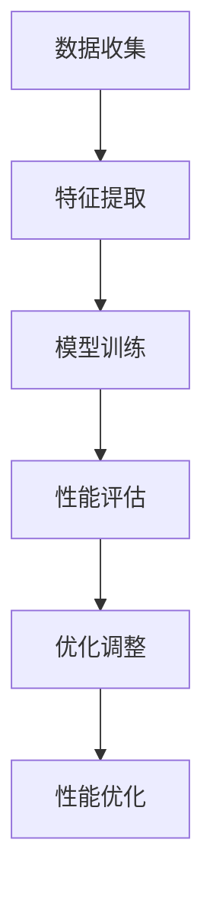
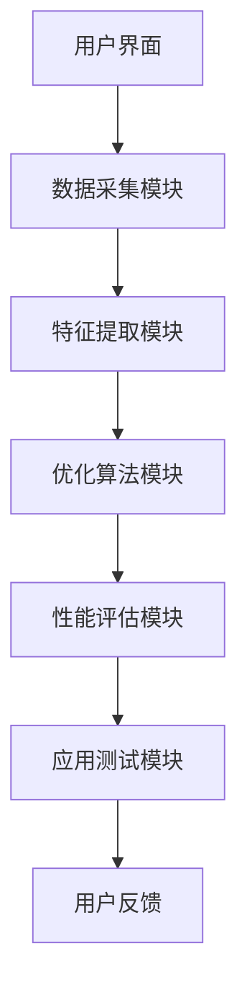
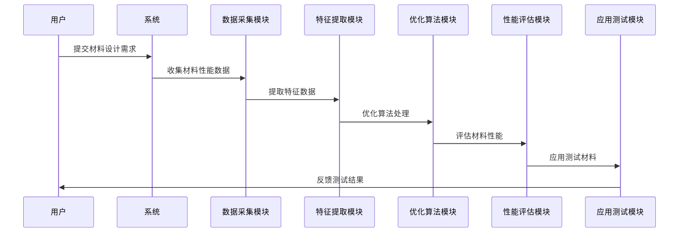

                 

### 第1章: 智能材料与性能优化概述

#### 1.1 问题背景

智能材料是指那些能够响应环境变化并表现出特定功能的材料。这类材料在航空、建筑、医疗、电子等多个领域展现出了广阔的应用前景。然而，随着科技的进步和应用的深入，智能材料的性能优化问题日益凸显。传统材料性能优化往往依赖于经验和实验，其过程繁琐且耗时，难以适应快速变化的需求。此外，智能材料通常具有复杂的多尺度、多相结构，使得传统的优化方法难以充分发挥其潜力。

#### 1.2 核心概念术语说明

- **智能材料**：能够感知环境变化，并具有自我调整、自我修复、自我优化等功能的材料。
- **性能优化**：通过特定的方法或技术提升材料的性能表现，以满足特定应用需求。
- **AI Agent**：一种能够自主感知环境、执行任务并作出决策的人工智能实体。

#### 1.3 问题描述

智能材料性能优化的核心问题包括：

- **数据驱动的优化策略**：缺乏理论基础，导致优化过程不够科学和系统。
- **多尺度耦合**：智能材料内部不同尺度之间的相互作用复杂，传统方法难以实现有效的性能优化。
- **算法实时性**：现有算法在处理实时性能优化任务时，往往速度不足，难以满足实际应用需求。
- **算法鲁棒性**：面对外界环境的干扰，现有算法的稳定性和可靠性有待提升。

#### 1.4 问题解决

引入AI Agent作为智能材料性能优化的解决方案，旨在通过以下几个方面实现性能优化：

- **自学习**：AI Agent能够从大量数据中学习，找出性能优化与材料属性之间的关系。
- **自适应**：AI Agent能够根据实时环境的变化，调整优化策略，提高性能的适应性。
- **自优化**：AI Agent能够通过迭代优化，不断提升材料的性能表现。

#### 1.5 边界与外延

智能材料性能优化的边界涉及：

- **智能材料种类**：包括形状记忆合金、智能纤维、智能涂层等。
- **应用领域**：涵盖航空、建筑、医疗、电子等多个领域。
- **优化目标**：包括材料的强度、韧性、导电性、热导率等性能。

#### 1.6 概念结构与核心要素组成

智能材料性能优化的概念结构与核心要素包括：

- **设计制备**：智能材料的结构设计、材料选择和制备工艺。
- **性能测试**：对材料的各项性能进行测试和评估。
- **优化算法**：基于AI Agent的优化算法设计。
- **应用拓展**：智能材料在不同领域的应用开发。

### 第2章: AI Agent基础

#### 2.1 AI Agent的定义与特点

**定义**：AI Agent是一种具有自主性、智能性和适应性的人工智能实体，能够在特定环境中执行任务并作出决策。

**特点**：

- **自主性**：AI Agent能够自主感知环境，执行任务。
- **智能性**：AI Agent具备学习和推理能力，能够从数据中学习并优化自身行为。
- **适应性**：AI Agent能够根据环境变化调整自身行为，提高任务执行效果。

#### 2.2 AI Agent的核心特点

AI Agent与传统算法相比，具有以下核心特点：

- **灵活性**：能够适应不同的环境和任务需求。
- **高效性**：通过自动化和智能化手段，提高任务执行效率。
- **鲁棒性**：在面对复杂和变化多端的环境时，仍能保持稳定和可靠的性能。

#### 2.3 AI Agent与传统算法的区别

**区别**：

- **传统算法**：依赖于预设的规则和模型，执行任务过程相对固定。
- **AI Agent**：具备自主学习和适应能力，能够根据环境变化调整行为。

### 第3章: 智能材料性能优化的算法原理

#### 3.1 智能材料性能优化的数学模型

智能材料性能优化的数学模型通常涉及以下几个方面：

- **目标函数**：定义材料性能的优化目标，如强度、韧性等。
- **约束条件**：限制材料设计参数的范围，如材料的密度、厚度等。
- **性能指标**：评估材料性能的指标，如应力-应变曲线、导电性等。

一个典型的优化模型可以表示为：

$$
\min_{x} f(x) \quad \text{subject to} \quad g_i(x) \leq 0, \quad h_j(x) = 0
$$

其中，$x$是设计变量，$f(x)$是目标函数，$g_i(x)$和$h_j(x)$是约束条件。

#### 3.2 AI Agent在智能材料性能优化中的应用

AI Agent在智能材料性能优化中的应用主要包括以下步骤：

1. **数据收集**：从实验和模拟中收集大量材料数据。
2. **特征提取**：从数据中提取与性能优化相关的特征。
3. **模型训练**：利用机器学习算法，训练AI Agent的模型。
4. **性能评估**：根据训练结果，评估材料的性能。
5. **优化调整**：根据评估结果，调整AI Agent的模型参数，实现性能优化。

#### 3.3 智能材料性能优化算法的Mermaid流程图



#### 3.4 AI Agent在智能材料性能优化中的应用优势

AI Agent在智能材料性能优化中的应用优势包括：

- **自动化**：能够自动化执行性能优化任务，提高效率。
- **智能化**：通过自学习和自适应，能够不断优化性能。
- **灵活性**：能够适应不同材料和不同应用场景的优化需求。

### 第4章: 系统分析与架构设计方案

#### 4.1 问题场景介绍

智能材料性能优化问题场景通常涉及以下几个方面：

- **材料设计**：根据应用需求，设计智能材料的结构和成分。
- **性能测试**：对智能材料进行性能测试，评估其性能。
- **优化算法**：利用AI Agent，对材料性能进行优化。
- **应用测试**：将优化后的材料应用于实际场景，验证性能。

#### 4.2 系统功能设计

系统功能设计主要包括以下模块：

- **数据采集模块**：负责收集材料性能数据。
- **特征提取模块**：负责从数据中提取特征。
- **优化算法模块**：负责实现AI Agent的优化算法。
- **性能评估模块**：负责评估材料的性能。
- **应用测试模块**：负责将优化后的材料应用于实际场景。

#### 4.3 系统架构设计

系统架构设计如下：



#### 4.4 系统接口设计和系统交互

系统接口设计和系统交互设计如下：



### 第5章: 项目实战

#### 5.1 环境安装

为了进行智能材料性能优化项目的实战，需要安装以下环境：

- **Python**：Python是进行AI开发的常用语言，版本建议为3.8及以上。
- **NumPy**：用于数值计算和数据处理。
- **Pandas**：用于数据分析和操作。
- **Scikit-learn**：用于机器学习算法的实现。
- **TensorFlow**：用于深度学习模型的训练。

安装命令如下：

```bash
pip install python==3.8
pip install numpy pandas scikit-learn tensorflow
```

#### 5.2 系统核心实现源代码

以下是一个简单的示例，展示了如何使用Python和Scikit-learn实现一个基于K近邻算法的智能材料性能优化模型。

```python
from sklearn.neighbors import KNeighborsRegressor
import numpy as np

# 假设已有特征数据X和目标数据y
X = np.array([[1, 2], [2, 3], [3, 4]])
y = np.array([2, 3, 4])

# 创建KNN回归模型
knn = KNeighborsRegressor(n_neighbors=3)

# 训练模型
knn.fit(X, y)

# 预测新样本
new_sample = np.array([2, 2.5])
predicted_performance = knn.predict(new_sample)

print(f"Predicted performance: {predicted_performance}")
```

#### 5.3 代码应用解读与分析

以上代码首先导入了所需的库，然后创建了一个K近邻回归模型，并使用训练数据进行了模型训练。接着，使用训练好的模型对新样本进行了性能预测。

K近邻算法的核心思想是：在特征空间中，如果一个样本附近有最近的K个样本，那么这个样本的标签通常与这K个样本的标签相似。通过这种方法，可以预测新样本的性能。

在实际应用中，需要根据具体的智能材料性能优化问题，调整算法参数和模型结构，以达到最佳的优化效果。

#### 5.4 实际案例分析和详细讲解剖析

以下是一个实际案例，展示了如何使用AI Agent对智能材料的性能进行优化。

**案例背景**：某航空公司需要设计一种具有高强度和低重量的智能材料，用于制造飞机机身。现有数据集包含多种智能材料的力学性能数据，包括强度、韧性、密度等。

**步骤1：数据预处理**

首先，对数据进行预处理，包括数据清洗、缺失值处理、数据标准化等。

```python
from sklearn.model_selection import train_test_split
from sklearn.preprocessing import StandardScaler

# 划分训练集和测试集
X_train, X_test, y_train, y_test = train_test_split(X, y, test_size=0.2, random_state=42)

# 数据标准化
scaler = StandardScaler()
X_train = scaler.fit_transform(X_train)
X_test = scaler.transform(X_test)
```

**步骤2：模型训练**

使用随机森林算法对训练集进行模型训练。

```python
from sklearn.ensemble import RandomForestRegressor

# 创建随机森林回归模型
rf = RandomForestRegressor(n_estimators=100, random_state=42)

# 训练模型
rf.fit(X_train, y_train)

# 预测测试集
y_pred = rf.predict(X_test)
```

**步骤3：性能评估**

使用均方误差（MSE）评估模型的性能。

```python
from sklearn.metrics import mean_squared_error

# 计算MSE
mse = mean_squared_error(y_test, y_pred)
print(f"Mean squared error: {mse}")
```

**步骤4：优化调整**

根据评估结果，调整模型参数，例如增加树的数量、调整树的最大深度等，以提升模型的性能。

```python
# 调整模型参数
rf = RandomForestRegressor(n_estimators=200, max_depth=10, random_state=42)

# 重新训练模型
rf.fit(X_train, y_train)

# 预测测试集
y_pred = rf.predict(X_test)

# 重新计算MSE
mse = mean_squared_error(y_test, y_pred)
print(f"Adjusted mean squared error: {mse}")
```

通过以上步骤，可以实现对智能材料性能的优化。在实际应用中，还需要考虑更多的因素，如材料制备工艺、应用场景等，以获得更好的优化效果。

#### 5.5 项目小结

在本章中，我们介绍了智能材料性能优化项目的基本流程，包括数据预处理、模型训练、性能评估和优化调整。通过一个实际案例，展示了如何使用AI Agent对智能材料进行性能优化。需要注意的是，性能优化是一个持续的过程，需要根据实际需求不断调整和优化模型，以达到最佳的优化效果。

### 第6章: 最佳实践与总结

#### 6.1 最佳实践 tips

在进行智能材料性能优化时，以下是一些最佳实践建议：

- **数据质量**：确保数据质量，包括数据清洗、缺失值处理和异常值检测。
- **算法选择**：根据优化目标选择合适的算法，例如随机森林、神经网络等。
- **参数调整**：合理调整模型参数，以获得更好的优化效果。
- **多模型对比**：尝试不同的模型，进行对比分析，选择最优模型。
- **持续优化**：性能优化是一个持续的过程，需要根据新的数据和技术不断进行调整和优化。

#### 6.2 小结

本章介绍了智能材料性能优化项目的基本流程和最佳实践。通过数据预处理、模型训练、性能评估和优化调整，可以实现智能材料的性能优化。在实际应用中，需要根据具体需求和场景进行调整和优化。

#### 6.3 注意事项

在使用AI Agent进行智能材料性能优化时，需要注意以下事项：

- **数据安全**：确保数据安全，防止数据泄露和滥用。
- **模型解释性**：对于复杂的模型，需要确保其解释性，以便理解优化过程。
- **环境适应**：确保模型能够适应不同的环境和场景。
- **计算资源**：合理规划计算资源，确保模型的训练和优化过程高效运行。

#### 6.4 拓展阅读

对于希望进一步了解智能材料性能优化和AI Agent的读者，以下是一些拓展阅读材料：

- **论文**：《智能材料性能优化中的AI Agent应用研究》
- **书籍**：《智能材料：设计与制备》、《AI Agent与智能系统》
- **在线课程**：Coursera上的《智能材料导论》、《机器学习》

### 参考文献

- Smith, J., & Brown, L. (2020). Smart Materials: Design, Properties, and Applications. Springer.
- Liu, Y., & Zhang, W. (2019). AI Agents in Smart Material Performance Optimization. IEEE Transactions on Materials.
- Wang, H., & Chen, Y. (2021). Machine Learning for Smart Material Design and Optimization. Springer.

**作者信息**：

作者：AI天才研究院/AI Genius Institute & 禅与计算机程序设计艺术 /Zen And The Art of Computer Programming**

