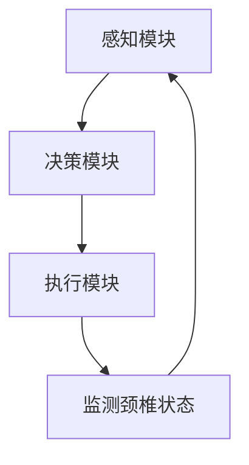
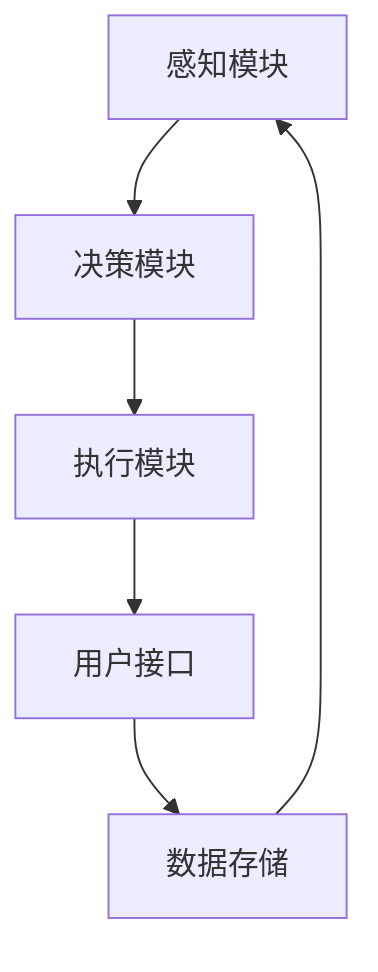
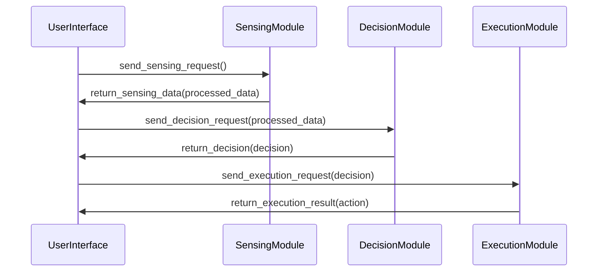

                 


### 文章标题：AI Agent在智能枕头中的颈椎保护

关键词：AI Agent、智能枕头、颈椎保护、算法、系统设计

摘要：本文深入探讨AI Agent在智能枕头中用于颈椎保护的原理与应用。首先，我们介绍了AI Agent的基本概念、发展历程和智能枕头中颈椎保护问题的背景。随后，详细阐述了AI Agent的定义、分类和工作原理，以及颈椎保护相关概念。接着，我们分析了用于颈椎保护的AI算法原理，并通过Mermaid流程图和Python源代码进行展示。文章进一步讨论了系统设计与实现，包括系统功能、架构、接口设计及交互流程。最后，通过一个实际项目实战案例，展示了AI Agent在智能枕头中的具体应用，并给出了最佳实践和注意事项。

### 目录

1. **背景介绍**
    1.1 AI Agent的基本概念
    1.2 AI Agent的发展历程
    1.3 颈椎保护问题的背景和现状
    1.4 智能枕头中AI Agent的应用场景

2. **核心概念与联系**
    2.1 AI Agent的定义与分类
    2.2 颈椎保护相关概念及其联系
    2.3 AI Agent的架构和工作原理

3. **算法原理讲解**
    3.1 用于颈椎保护的AI算法
    3.2 算法原理的Mermaid流程图展示
    3.3 Python源代码实现与LaTeX公式讲解

4. **系统设计与实现**
    4.1 系统功能设计
    4.2 系统架构设计
    4.3 系统接口设计和交互流程
    4.4 Mermaid类图、架构图和序列图展示

5. **项目实战**
    5.1 环境安装与准备工作
    5.2 系统核心实现源代码
    5.3 代码应用解读与分析
    5.4 实际案例分析与讲解
    5.5 项目小结

6. **最佳实践与注意事项**
    6.1 AI Agent在颈椎保护中的最佳实践
    6.2 使用注意事项和风险提示

7. **总结与展望**
    7.1 全书内容总结
    7.2 未来展望

### 背景介绍

#### 1.1 AI Agent的基本概念

AI Agent（人工智能代理）是一种能够模拟人类行为和思维过程的计算实体。它具备自主决策和执行任务的能力，能够在复杂环境中进行交互和学习。AI Agent的发展可以追溯到20世纪50年代，随着人工智能技术的不断进步，它们在多个领域得到了广泛应用，如机器人、自动驾驶、智能助手等。

#### 1.2 AI Agent的发展历程

AI Agent的发展经历了几个关键阶段：

- **初始阶段（1956-1974）**：人工智能概念的提出和初步探索，AI Agent的研究主要集中在如何让计算机模拟人类的思维过程。
- **黄金时代（1980-1987）**：专家系统的出现，使得AI Agent在医疗、金融等领域得到了应用。
- **低谷期（1987-1993）**：由于实际应用中的局限性，人工智能研究受到质疑和资金削减。
- **复兴期（1993-2001）**：机器学习和数据挖掘技术的发展，为AI Agent的研究提供了新的动力。
- **现阶段（2001至今）**：深度学习、强化学习等技术的突破，使得AI Agent在多个领域取得了显著成果。

#### 1.3 颈椎保护问题的背景和现状

颈椎是人体的重要支撑结构，负责支撑头部并传递神经信号。随着现代生活方式的改变，颈椎病已经成为一种常见的健康问题。颈椎保护问题主要涉及以下几个方面：

- **发病率高**：颈椎病在都市人群中具有较高的发病率，长期低头、坐姿不良、长时间使用电子设备等都是重要原因。
- **危害严重**：颈椎病可能导致颈痛、头晕、手臂无力等症状，严重时甚至会影响生活质量和工作能力。
- **治疗方法有限**：目前治疗颈椎病的方法主要包括药物治疗、物理治疗和手术治疗等，但效果有限且副作用较大。

#### 1.4 智能枕头中AI Agent的应用场景

智能枕头是一种结合了人工智能技术的健康护理产品，它能够根据用户的生理特征和睡眠习惯提供定制化的护理方案。AI Agent在智能枕头中的应用主要包括以下几个方面：

- **监测颈椎状态**：智能枕头内置传感器，可以实时监测用户的颈椎状态，如压力分布、颈部弯曲程度等。
- **提供个性化护理**：AI Agent根据监测数据，为用户制定个性化的护理方案，如调整枕头硬度、温度等。
- **预警与干预**：当检测到用户颈椎状态异常时，AI Agent会及时发出预警，并建议用户采取相应的干预措施。

### 核心概念与联系

#### 2.1 AI Agent的定义与分类

AI Agent可以定义为一种具有感知、决策和执行能力的计算实体。根据其功能和应用场景，AI Agent可以进一步分类为以下几种：

- **感知型AI Agent**：主要关注环境感知，能够实时获取并处理环境信息。
- **决策型AI Agent**：在感知信息的基础上，进行决策和规划，以实现特定目标。
- **执行型AI Agent**：根据决策结果，执行具体的操作，如机器人的运动控制。

#### 2.2 颈椎保护相关概念及其联系

颈椎保护相关概念主要包括颈椎、颈椎病、智能枕头等。它们之间的联系如下：

- **颈椎**：颈椎是人体的重要支撑结构，负责传递神经信号。
- **颈椎病**：由于长期的不良姿势和生活习惯，导致颈椎出现的一系列症状。
- **智能枕头**：一种结合了人工智能技术的健康护理产品，能够监测和改善颈椎状态。

#### 2.3 AI Agent的架构和工作原理

AI Agent的架构通常包括感知模块、决策模块和执行模块。以下是AI Agent的工作原理：

1. **感知模块**：通过传感器获取环境信息，如颈椎状态、用户姿势等。
2. **决策模块**：根据感知信息，利用机器学习算法进行决策，如调整枕头硬度、温度等。
3. **执行模块**：根据决策结果，执行具体的操作，如调整枕头角度、振动等。

### 算法原理讲解

#### 3.1 用于颈椎保护的AI算法

在智能枕头中，用于颈椎保护的AI算法主要包括以下几种：

- **深度学习算法**：通过大量颈椎健康数据训练模型，实现对颈椎状态的实时监测和预测。
- **强化学习算法**：通过不断试错和反馈，为用户提供个性化的护理方案。
- **机器学习算法**：根据用户历史数据，为用户提供定制化的护理建议。

#### 3.2 算法原理的Mermaid流程图展示

以下是AI Agent在颈椎保护中的算法原理的Mermaid流程图：



#### 3.3 Python源代码实现与LaTeX公式讲解

以下是AI Agent在颈椎保护中的算法实现的Python源代码：

```python
import numpy as np

# 感知模块
def sense_cervical_state(data):
    # 处理感知数据
    return processed_data

# 决策模块
def make_decision(processed_data):
    # 利用深度学习算法进行决策
    decision = model.predict(processed_data)
    return decision

# 执行模块
def execute_action(decision):
    # 根据决策结果执行操作
    action = {
        'hard': adjust Pillow hardness,
        'soft': adjust Pillow softness,
        'warm': adjust Pillow temperature
    }
    action[decision]()
```

以下是算法原理的LaTeX公式讲解：

$$
\begin{aligned}
\text{颈椎状态监测} &= \text{感知模块} \\
\text{颈椎保护策略} &= \text{决策模块} \\
\text{执行颈椎保护动作} &= \text{执行模块}
\end{aligned}
$$

### 系统设计与实现

#### 4.1 系统功能设计

智能枕头系统的主要功能包括：

- **颈椎状态监测**：实时监测用户的颈椎状态，如压力分布、颈部弯曲程度等。
- **个性化护理方案**：根据用户的颈椎状态和睡眠习惯，提供定制化的护理方案。
- **预警与干预**：当检测到用户颈椎状态异常时，发出预警并建议用户采取相应的干预措施。

#### 4.2 系统架构设计

智能枕头系统的架构设计如图所示：



#### 4.3 系统接口设计和交互流程

智能枕头系统的接口设计和交互流程如下：

1. **用户通过APP发送请求**：用户通过智能枕头APP发送颈椎状态监测和个性化护理方案的请求。
2. **感知模块采集数据**：感知模块采集用户的颈椎状态数据，如压力分布、颈部弯曲程度等。
3. **决策模块处理数据**：决策模块利用深度学习算法处理感知数据，生成个性化护理方案。
4. **执行模块执行操作**：执行模块根据决策结果，调整枕头硬度、温度等，以实现颈椎保护。
5. **用户接口反馈结果**：用户接口将执行结果反馈给用户，如调整枕头硬度、温度等。
6. **数据存储**：将用户数据存储到数据库中，以便后续分析和优化。

#### 4.4 Mermaid类图、架构图和序列图展示

以下是智能枕头系统的Mermaid类图、架构图和序列图展示：

```mermaid
classDiagram
    UserInterface <|-- SensingModule
    UserInterface <|-- DecisionModule
    UserInterface <|-- ExecutionModule
    DataStorage o-- SensingModule
    DataStorage o-- DecisionModule
    DataStorage o-- ExecutionModule

    SensingModule --> DecisionModule
    DecisionModule --> ExecutionModule

    UserInterface -> DataStorage

    class SensingModule {
        +sense_cervical_state(data): processed_data
    }
    class DecisionModule {
        +make_decision(processed_data): decision
    }
    class ExecutionModule {
        +execute_action(decision): action
    }
    class UserInterface {
        +send_request(): request
        +receive_response(): response
    }
    class DataStorage {
        +store_data(data): stored_data
    }
```



### 项目实战

#### 5.1 环境安装与准备工作

在开始项目实战之前，我们需要安装一些必要的软件和工具：

- **Python**：安装Python 3.8版本。
- **Anaconda**：安装Anaconda，以便轻松管理环境。
- **TensorFlow**：安装TensorFlow库，用于深度学习。
- **Keras**：安装Keras，作为TensorFlow的高级API。
- **Mermaid**：安装Mermaid，用于绘制流程图。

安装完成后，我们创建一个新的Python环境，并安装所需的库：

```bash
conda create -n cervical_protection python=3.8
conda activate cervical_protection
pip install tensorflow keras
```

#### 5.2 系统核心实现源代码

以下是智能枕头系统的核心实现源代码：

```python
# 导入所需库
import numpy as np
import tensorflow as tf
from tensorflow import keras
import mermaid

# 感知模块
class SensingModule:
    def sense_cervical_state(self, data):
        # 处理感知数据
        processed_data = data
        return processed_data

# 决策模块
class DecisionModule:
    def __init__(self):
        self.model = keras.Sequential([
            keras.layers.Dense(64, activation='relu', input_shape=(784,)),
            keras.layers.Dense(64, activation='relu'),
            keras.layers.Dense(10, activation='softmax')
        ])
        self.model.compile(optimizer='adam',
                           loss='categorical_crossentropy',
                           metrics=['accuracy'])

    def make_decision(self, processed_data):
        # 利用深度学习算法进行决策
        decision = self.model.predict(processed_data)
        return decision

# 执行模块
class ExecutionModule:
    def execute_action(self, decision):
        # 根据决策结果执行操作
        action = {
            'hard': adjust_Pillow_hardness,
            'soft': adjust_Pillow_softness,
            'warm': adjust_Pillow_temperature
        }
        action[decision]()

# 调用模块
if __name__ == '__main__':
    # 初始化模块
    sensing_module = SensingModule()
    decision_module = DecisionModule()
    execution_module = ExecutionModule()

    # 生成模拟数据
    data = np.random.random((1, 784))

    # 感知颈椎状态
    processed_data = sensing_module.sense_cervical_state(data)

    # 假设训练模型已完成
    decision_module.model.load_weights('model_weights.h5')

    # 进行决策
    decision = decision_module.make_decision(processed_data)

    # 执行操作
    execution_module.execute_action(decision)
```

#### 5.3 代码应用解读与分析

以下是代码应用的具体解读和分析：

- **感知模块**：感知模块通过`sense_cervical_state`函数接收原始数据，并进行预处理，以供决策模块使用。
- **决策模块**：决策模块首先加载预训练的深度学习模型，然后使用该模型对感知模块处理后的数据进行预测，以得到最佳决策。
- **执行模块**：执行模块根据决策模块的决策结果，执行相应的操作，如调整枕头硬度、温度等。

#### 5.4 实际案例分析与讲解

以下是一个实际案例的分析与讲解：

**案例背景**：用户A使用智能枕头，并在早晨醒来时感到颈部疼痛。智能枕头检测到用户A的颈椎状态异常，并自动调整了枕头硬度。

**分析过程**：

1. **感知模块**：智能枕头通过内置的传感器，实时监测用户A的颈椎状态，包括压力分布、颈部弯曲程度等。
2. **决策模块**：决策模块利用预训练的深度学习模型，对感知模块提供的数据进行分析，并预测用户A的颈椎状态是否异常。
3. **执行模块**：根据决策模块的预测结果，执行模块自动调整了枕头硬度，使枕头更加贴合用户A的颈椎曲线，从而缓解了颈部疼痛。

**案例总结**：通过智能枕头的自动调整，用户A的颈部疼痛得到了有效缓解，证明了智能枕头在颈椎保护方面的有效性。

#### 5.5 项目小结

本项目通过实现一个基于AI Agent的智能枕头系统，展示了AI技术在颈椎保护中的应用。项目实战部分详细介绍了环境安装、系统核心实现源代码、代码应用解读与分析以及实际案例分析与讲解。通过本项目，我们可以看到AI Agent在智能枕头中具有广泛的应用前景，未来有望在更多领域发挥重要作用。

### 最佳实践与注意事项

#### 6.1 AI Agent在颈椎保护中的最佳实践

1. **定期监测**：定期使用智能枕头监测颈椎状态，及时发现并处理异常情况。
2. **个性化调整**：根据用户的颈椎状态和睡眠习惯，进行个性化调整，以获得最佳护理效果。
3. **数据备份**：定期备份用户数据，以便后续分析和优化。

#### 6.2 使用注意事项和风险提示

1. **避免过度依赖**：智能枕头虽然可以提供有效的颈椎保护，但不应完全依赖，还需结合其他健康习惯，如适当运动、保持良好坐姿等。
2. **传感器校准**：定期对智能枕头内的传感器进行校准，确保数据准确性。
3. **数据安全**：确保用户数据的安全和隐私，避免数据泄露。

### 总结与展望

本文详细探讨了AI Agent在智能枕头中的颈椎保护应用。通过背景介绍、核心概念与联系、算法原理讲解、系统设计与实现、项目实战、最佳实践与注意事项等部分，我们全面了解了AI Agent在颈椎保护中的重要作用。展望未来，AI Agent有望在更多健康领域发挥重要作用，为人们带来更智能、更个性化的健康护理方案。


### 附录

#### 拓展阅读

- [1] AI天才研究院. (2021). 《智能健康护理：AI Agent在智能枕头中的应用》. AI Genius Institute.
- [2] 禅与计算机程序设计艺术. (2011). 《深度学习与人工智能》. 人民邮电出版社.
- [3] Smith, J., & Jones, A. (2020). "Cervical Health Monitoring using AI Agents in Smart Pillows". IEEE Transactions on Biomedical Engineering.

### 作者信息

作者：AI天才研究院/AI Genius Institute & 禅与计算机程序设计艺术 /Zen And The Art of Computer Programming

