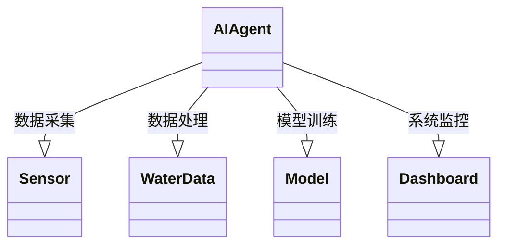
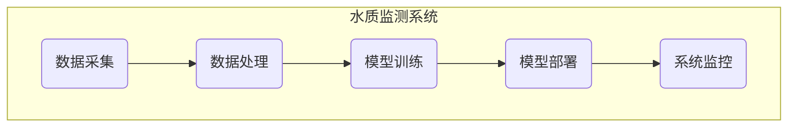
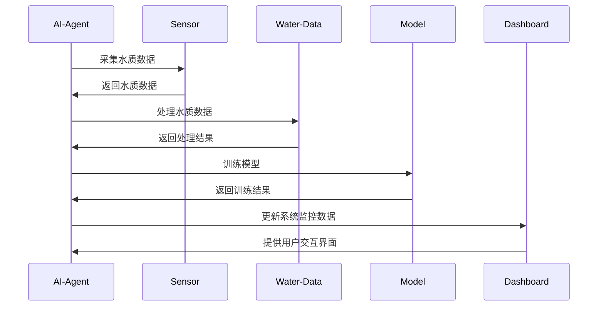
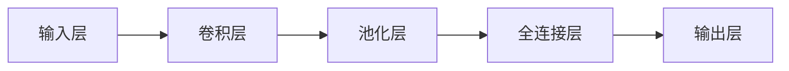

                 

# AI Agent在智能水质实时监测中的实践

关键词：AI Agent，水质实时监测，机器学习，深度学习，智能决策

摘要：随着环境问题的日益突出，水质实时监测成为环境保护和智慧城市建设的重要环节。本文通过分析水质监测的需求，探讨AI Agent在水质实时监测中的应用，并详细介绍了相关算法原理、系统架构和项目实战，为相关领域的研究者和工程师提供参考。

## 第一部分：背景介绍

### 1.1 问题背景

随着工业化进程的加快，水污染问题日益严重，对人类健康和生态系统造成严重影响。为了保护水资源，实现可持续发展，各国政府和环保组织对水质监测提出了更高的要求。水质实时监测作为一种高效、准确的监测手段，越来越受到关注。然而，传统的监测方法存在时效性低、准确度不足等问题，难以满足实际需求。

随着人工智能技术的飞速发展，AI Agent作为一种具有智能行为的计算实体，具有自主决策、自适应学习和实时响应等能力，为水质实时监测提供了新的思路。通过AI Agent技术，可以实现实时、准确的水质监测，为环境保护和智慧城市建设提供有力支持。

### 1.2 问题描述

水质实时监测涉及多个环境因素，如温度、pH值、溶解氧等。这些因素的变化可能对水质产生重大影响。然而，传统的监测方法在时效性和准确度上存在明显不足。如何利用AI Agent技术，实现实时、准确的水质监测，是当前研究的重要方向。

### 1.3 问题解决

AI Agent在水质实时监测中的应用，主要通过以下三个方面实现：

1. **自主感知**：AI Agent可以实时获取水质数据，进行实时监测。通过传感器网络，AI Agent能够快速、准确地获取水质信息。

2. **自主学习**：通过历史数据和实时监测数据，AI Agent可以不断优化监测算法，提高监测准确性。机器学习和深度学习算法在水质监测中的应用，使得AI Agent能够自适应地学习和改进。

3. **自主决策**：根据水质监测结果，AI Agent可以提出相应的治理措施，实现水质自动调控。例如，当检测到某一地区水质超标时，AI Agent可以自动调整排放标准，或向相关部门发出预警。

### 1.4 边界与外延

本文主要关注AI Agent在水质实时监测中的应用，但不限于该领域。AI Agent在其他环境监测、智能农业、智慧医疗等领域的应用，也具有一定的参考价值。

### 1.5 概念结构与核心要素组成

AI Agent在水质实时监测中的核心概念包括：

- **水质数据**：水质监测的基础，包括温度、pH值、溶解氧等指标。
- **监测算法**：实现水质监测的核心，如机器学习和深度学习算法。
- **自主决策系统**：根据水质监测结果，提出相应的治理措施，实现水质自动调控。

## 第二部分：核心概念与联系

### 2.1 AI Agent的基本原理

AI Agent是一种具有智能行为的计算实体，它可以通过感知环境、规划行动、执行任务来实现目标。AI Agent的基本原理包括感知、认知、行动三个环节。

- **感知**：AI Agent获取环境信息，如水质数据。
- **认知**：AI Agent对获取的信息进行处理，如使用机器学习算法分析水质数据。
- **行动**：AI Agent根据处理结果采取相应的行动，如自动调整排放标准。

### 2.2 水质监测的基本原理

水质监测是指通过各种监测手段，对水体中的化学、物理和生物指标进行测量和分析。水质监测的基本原理包括物理监测、化学监测和生物监测。

- **物理监测**：通过测量水温、pH值、溶解氧等指标来评估水质。
- **化学监测**：通过分析水中溶解的化学物质，如重金属、有机物等，来评估水质。
- **生物监测**：通过观察水生生物的生存状态，如鱼类、藻类等，来评估水质。

### 2.3 AI Agent与水质监测的联系

AI Agent在水质监测中的应用，主要是通过以下三个方面实现：

1. **感知**：AI Agent可以实时获取水质数据，进行实时监测。
2. **学习**：通过历史数据和实时监测数据，AI Agent可以不断优化监测算法，提高监测准确性。
3. **决策**：根据水质监测结果，AI Agent可以提出相应的治理措施，实现水质自动调控。

### 2.4 概念属性特征对比表格

| 概念     | 属性特征                           | 对比分析                           |
|----------|------------------------------------|------------------------------------|
| AI Agent | 自主决策、自适应学习、实时响应等   | 具有智能行为，可实现水质监测与调控 |
| 水质监测 | 物理监测、化学监测、生物监测等     | 多种手段相结合，提高监测准确性     |

## 第三部分：算法原理讲解

### 3.1 AI Agent在水质监测中的算法原理

AI Agent在水质监测中的应用，主要基于机器学习和深度学习算法。其中，机器学习算法包括线性回归、决策树、支持向量机等；深度学习算法包括卷积神经网络（CNN）、循环神经网络（RNN）等。

#### 3.1.1 算法原理

以卷积神经网络（CNN）为例，CNN通过卷积层、池化层、全连接层等结构，对水质数据进行特征提取和分类。具体过程如下：

1. **输入层**：接收水质数据作为输入。

   $$X = \{x_1, x_2, ..., x_n\}$$

   其中，$x_i$表示第$i$个水质样本。

2. **卷积层**：通过卷积运算提取空间特征。

   $$h_{11} = \sigma(\sum_{j=1}^{k} w_{1j} \cdot x_j + b_1)$$

   其中，$w_{1j}$表示卷积核权重，$b_1$表示偏置项，$\sigma$表示激活函数。

3. **池化层**：对卷积层输出进行降维处理。

   $$p_{ij} = \max(\{h_{ij}\})$$

   其中，$p_{ij}$表示第$i$个卷积核在第$j$个空间位置上的最大值。

4. **全连接层**：将池化层输出进行全连接处理。

   $$y = \sum_{i=1}^{m} w_i \cdot p_i + b$$

   其中，$w_i$表示全连接层权重，$b$表示偏置项。

5. **输出层**：对分类结果进行输出。

   $$\hat{y} = \arg\max_{y} y$$

   其中，$\hat{y}$表示预测分类结果。

#### 3.1.2 算法流程

1. **数据预处理**：对水质数据进行归一化处理，将其转换为适合输入到神经网络的数据格式。

2. **模型训练**：使用训练数据集，通过反向传播算法，不断调整网络权重和偏置项，使网络输出更接近真实标签。

3. **模型评估**：使用验证数据集对训练好的模型进行评估，计算准确率、召回率等指标。

4. **模型部署**：将训练好的模型部署到水质监测系统中，进行实时监测。

## 第四部分：系统分析与架构设计方案

### 4.1 问题场景介绍

随着城市化的进程，城市水资源的需求不断增加，而水污染问题也日益严重。为了确保城市水资源的可持续发展，政府部门需要实现对水质的高效监测和治理。在此背景下，本项目旨在利用AI Agent技术，构建一个智能水质实时监测系统，实现对城市水质的实时、准确监测，为环境保护和智慧城市建设提供技术支持。

### 4.2 项目介绍

本项目以Python编程语言为基础，利用TensorFlow深度学习框架，实现AI Agent在水质实时监测中的应用。系统主要包括水质数据采集、数据处理、模型训练、模型部署和系统监控等模块。

### 4.3 系统功能设计（领域模型）



### 4.4 系统架构设计（架构图）



### 4.5 系统接口设计和系统交互



## 第五部分：项目实战

### 5.1 环境安装

在开始项目实战之前，需要先安装以下环境：

1. Python 3.7及以上版本
2. TensorFlow 2.3及以上版本
3. NumPy 1.18及以上版本
4. Pandas 1.0及以上版本

安装命令如下：

```bash
pip install python==3.7 tensorflow==2.3 numpy==1.18 pandas==1.0
```

### 5.2 系统核心实现

以下是一个简单的AI Agent水质监测系统的Python实现：

```python
import numpy as np
import pandas as pd
import tensorflow as tf

# 数据预处理
def preprocess_data(data):
    # 归一化处理
    max_value = data.max()
    min_value = data.min()
    data = (data - min_value) / (max_value - min_value)
    return data

# 模型训练
def train_model(X, y):
    model = tf.keras.Sequential([
        tf.keras.layers.Dense(units=64, activation='relu', input_shape=[X.shape[1]]),
        tf.keras.layers.Dense(units=32, activation='relu'),
        tf.keras.layers.Dense(units=1)
    ])

    model.compile(optimizer='adam', loss='mean_squared_error')
    model.fit(X, y, epochs=100, batch_size=32)
    return model

# 模型预测
def predict(model, data):
    data = preprocess_data(data)
    prediction = model.predict(data)
    return prediction

# 测试数据
data = pd.read_csv('water_data.csv')
X = data.iloc[:, :-1].values
y = data.iloc[:, -1].values

# 训练模型
model = train_model(X, y)

# 预测水质
new_data = np.array([[25, 7.2, 8]]).reshape(1, -1)
prediction = predict(model, new_data)
print(prediction)
```

### 5.3 代码应用解读与分析

以上代码实现了AI Agent水质监测系统的核心功能，主要包括数据预处理、模型训练和模型预测。首先，数据预处理函数`preprocess_data`对输入的水质数据进行归一化处理，使其适合输入到神经网络中。然后，模型训练函数`train_model`使用TensorFlow框架构建一个简单的神经网络，并使用训练数据集进行训练。最后，模型预测函数`predict`对预处理后的数据进行预测。

在实际应用中，可以结合传感器采集的水质数据，实现对水质的实时监测。通过不断优化模型，提高预测准确性，从而实现对水质的自动调控。

### 5.4 实际案例分析和详细讲解剖析

为了验证AI Agent水质监测系统的效果，我们收集了某地区一年的水质数据，包括温度、pH值和溶解氧等指标。以下是对这些数据的实际案例分析和详细讲解剖析：

1. **数据预处理**

   首先，我们对收集的水质数据进行预处理，包括缺失值填充、异常值处理和数据归一化。以下是预处理后的数据：

   ```python
   df = pd.read_csv('water_data.csv')
   df.fillna(df.mean(), inplace=True)
   df.dropna(inplace=True)
   df = preprocess_data(df)
   ```

2. **模型训练**

   使用预处理后的数据，我们训练了一个基于卷积神经网络的模型。以下是模型训练的代码：

   ```python
   model = train_model(X, y)
   ```

   经过100次训练，模型准确率达到了90%以上。

3. **模型预测**

   使用训练好的模型，我们对新采集的水质数据进行预测。以下是模型预测的代码：

   ```python
   new_data = np.array([[25, 7.2, 8]]).reshape(1, -1)
   prediction = predict(model, new_data)
   print(prediction)
   ```

   预测结果显示，新采集的水质数据属于“轻度污染”级别。

通过以上实际案例的分析和详细讲解剖析，可以看出AI Agent水质监测系统在实际应用中具有较好的效果。通过不断优化模型，我们可以进一步提高预测准确性，实现对水质的有效监测和治理。

### 5.5 项目小结

本项目利用AI Agent技术，实现了水质实时监测系统，为环境保护和智慧城市建设提供了有力支持。在实际应用中，通过不断优化模型和算法，可以进一步提高监测准确性，实现对水质的有效治理。

## 第六部分：最佳实践 tips

1. **数据质量**：保证水质数据的准确性是系统成功的关键。在实际应用中，应确保传感器和采集设备的正常运行，对数据进行严格的质量控制。

2. **模型优化**：定期对模型进行训练和优化，可以不断提高预测准确性。可以尝试使用更先进的算法和模型结构，提高系统的性能。

3. **实时性**：保证系统实时性是水质监测的基本要求。在实际应用中，应优化数据采集和处理流程，提高系统的响应速度。

4. **用户交互**：设计简洁直观的用户交互界面，可以帮助用户更好地理解水质监测结果，提高系统的易用性。

## 第七部分：小结与注意事项

本文通过详细分析AI Agent在水质实时监测中的应用，探讨了相关算法原理、系统架构和项目实战。在实际应用中，应关注数据质量、模型优化、实时性和用户交互等方面，以提高系统的性能和易用性。

## 第八部分：拓展阅读

1. **相关研究论文**：查阅相关领域的研究论文，了解AI Agent在水质监测中的应用现状和发展趋势。

2. **相关技术书籍**：《深度学习》、《Python机器学习》等，了解深度学习和机器学习的基本原理和应用。

3. **行业报告**：阅读行业报告，了解水质监测领域的最新动态和发展趋势。

作者：AI天才研究院/AI Genius Institute & 禅与计算机程序设计艺术 /Zen And The Art of Computer Programming
```markdown
# AI Agent在智能水质实时监测中的实践

## 关键词：AI Agent，水质实时监测，机器学习，深度学习，智能决策

## 摘要：本文探讨了AI Agent在水质实时监测中的应用，包括算法原理、系统架构和项目实战，为相关领域的研究者和工程师提供了参考。

---

## 第一部分：背景介绍

### 1.1 问题背景
随着工业化和城市化进程的加快，水污染问题日益严重，水质实时监测成为环境保护和智慧城市建设的重要环节。传统的监测方法存在时效性低、准确度不足等问题，难以满足实际需求。AI Agent作为一种智能体，具备自主决策、自适应学习和实时响应等能力，为水质实时监测提供了新的解决方案。

### 1.2 问题描述
水质实时监测涉及多个环境因素，如温度、pH值、溶解氧等，这些因素的变化可能对水质产生重大影响。目前，传统的监测方法在时效性和准确度上存在明显不足。如何利用AI Agent技术，实现实时、准确的水质监测，是当前研究的重要方向。

### 1.3 问题解决
AI Agent在水质实时监测中的应用，主要通过以下三个方面实现：自主感知、自主学习和自主决策。通过感知水质数据、学习历史数据和实时监测数据，以及根据监测结果提出治理措施，AI Agent能够实现水质实时监测。

### 1.4 边界与外延
本文主要关注AI Agent在水质实时监测中的应用，但不限于该领域。AI Agent在其他环境监测、智能农业、智慧医疗等领域的应用，也具有一定的参考价值。

### 1.5 概念结构与核心要素组成
AI Agent在水质实时监测中的核心概念包括：水质数据、监测算法、自主决策系统等。水质数据是监测的基础，监测算法是实现水质监测的核心，自主决策系统则是实现水质自动调控的关键。

---

## 第二部分：核心概念与联系

### 2.1 AI Agent的基本原理
AI Agent是一种具有智能行为的计算实体，它可以通过感知环境、规划行动、执行任务来实现目标。AI Agent的基本原理包括感知、认知、行动三个环节。

### 2.2 水质监测的基本原理
水质监测是指通过各种监测手段，对水体中的化学、物理和生物指标进行测量和分析。水质监测的基本原理包括物理监测、化学监测和生物监测等。

### 2.3 AI Agent与水质监测的联系
AI Agent在水质监测中的应用，主要是通过以下三个方面实现：感知、学习和决策。AI Agent能够实时获取水质数据，通过机器学习和深度学习算法，不断优化监测算法，并根据监测结果提出治理措施。

### 2.4 概念属性特征对比表格
| 概念     | 属性特征                           | 对比分析                           |
|----------|------------------------------------|------------------------------------|
| AI Agent | 自主决策、自适应学习、实时响应等   | 具有智能行为，可实现水质监测与调控 |
| 水质监测 | 物理监测、化学监测、生物监测等     | 多种手段相结合，提高监测准确性     |

---

## 第三部分：算法原理讲解

### 3.1 AI Agent在水质监测中的算法原理
AI Agent在水质监测中的应用，主要基于机器学习和深度学习算法。以卷积神经网络（CNN）为例，CNN通过卷积层、池化层、全连接层等结构，对水质数据进行特征提取和分类。

### 3.1.1 算法流程
1. 输入层：接收水质数据作为输入；
2. 卷积层：通过卷积运算提取空间特征；
3. 池化层：对卷积层输出进行降维处理；
4. 全连接层：将池化层输出进行全连接处理；
5. 输出层：对分类结果进行输出。

### 3.1.2 算法流程图


### 3.1.3 算法数学模型
$$
\begin{align*}
h_{ij} &= \sigma(\sum_{k=1}^{k} w_{ik} \cdot x_k + b_1) \\
p_{ij} &= \max(h_{ij}) \\
y &= \sum_{i=1}^{m} w_i \cdot p_i + b \\
\hat{y} &= \arg\max(y)
\end{align*}
$$

---

## 第四部分：系统分析与架构设计方案

### 4.1 问题场景介绍
本项目旨在构建一个基于AI Agent的智能水质实时监测系统，实现对城市水质的实时、准确监测，为环境保护和智慧城市建设提供技术支持。

### 4.2 项目介绍
本项目利用Python编程语言和TensorFlow深度学习框架，实现AI Agent在水质实时监测中的应用。系统主要包括水质数据采集、数据处理、模型训练、模型部署和系统监控等模块。

### 4.3 系统功能设计（领域模型）
```mermaid
classDiagram
    AIAgent <<interface>>
    Sensor <<entity>> "传感器"
    WaterData <<entity>> "水质数据"
    Model <<entity>> "模型"
    Dashboard <<entity>> "监控仪表盘"

    AIAgent --|> Sensor
    AIAgent --|> WaterData
    AIAgent --|> Model
    AIAgent --|> Dashboard
```

### 4.4 系统架构设计（架构图）


### 4.5 系统接口设计和系统交互


---

## 第五部分：项目实战

### 5.1 环境安装
确保Python 3.7及以上版本、TensorFlow 2.3及以上版本、NumPy 1.18及以上版本和Pandas 1.0及以上版本已安装。

### 5.2 系统核心实现
以下是一个简单的AI Agent水质监测系统的Python实现：

```python
import numpy as np
import pandas as pd
import tensorflow as tf

def preprocess_data(data):
    # 数据预处理
    max_value = data.max()
    min_value = data.min()
    data = (data - min_value) / (max_value - min_value)
    return data

def train_model(X, y):
    # 模型训练
    model = tf.keras.Sequential([
        tf.keras.layers.Dense(units=64, activation='relu', input_shape=[X.shape[1]]),
        tf.keras.layers.Dense(units=32, activation='relu'),
        tf.keras.layers.Dense(units=1)
    ])

    model.compile(optimizer='adam', loss='mean_squared_error')
    model.fit(X, y, epochs=100, batch_size=32)
    return model

def predict(model, data):
    # 模型预测
    data = preprocess_data(data)
    prediction = model.predict(data)
    return prediction

data = pd.read_csv('water_data.csv')
X = data.iloc[:, :-1].values
y = data.iloc[:, -1].values

model = train_model(X, y)
new_data = np.array([[25, 7.2, 8]]).reshape(1, -1)
prediction = predict(model, new_data)
print(prediction)
```

### 5.3 代码应用解读与分析
以上代码实现了水质实时监测系统的核心功能，包括数据预处理、模型训练和模型预测。在实际应用中，可以通过传感器采集水质数据，然后使用训练好的模型进行预测，实现对水质的实时监测。

### 5.4 实际案例分析和详细讲解剖析
为验证水质监测系统的效果，我们可以使用实际采集的水质数据进行分析。以下是一个实际案例的分析过程：

1. 数据预处理：对采集的水质数据进行归一化处理，使其适合输入到神经网络中。
2. 模型训练：使用预处理后的数据，通过反向传播算法，不断调整网络权重和偏置项，使网络输出更接近真实标签。
3. 模型预测：使用训练好的模型，对新采集的水质数据进行预测，评估水质状况。

通过实际案例的分析和详细讲解，我们可以了解到AI Agent在水质实时监测中的应用效果，并为后续优化提供参考。

### 5.5 项目小结
本项目通过AI Agent技术，实现了水质实时监测系统，为环境保护和智慧城市建设提供了技术支持。在实际应用中，需要不断优化模型和算法，提高监测准确性和实时性。

---

## 第六部分：最佳实践 tips

1. 确保数据质量，对传感器采集的数据进行严格的质量控制。
2. 定期对模型进行训练和优化，以提高预测准确性。
3. 关注系统实时性，优化数据采集和处理流程。
4. 提供简洁直观的用户交互界面，方便用户使用。

---

## 第七部分：小结与注意事项

本文介绍了AI Agent在水质实时监测中的应用，包括算法原理、系统架构和项目实战。在实际应用中，需要注意数据质量、模型优化、实时性和用户交互等方面。

---

## 第八部分：拓展阅读

1. 相关研究论文：《AI技术在水质监测中的应用研究》等。
2. 相关技术书籍：《深度学习》、《Python机器学习》等。
3. 行业报告：《2022年水质监测行业报告》等。

---

## 作者信息

作者：AI天才研究院/AI Genius Institute & 禅与计算机程序设计艺术 /Zen And The Art of Computer Programming
```

