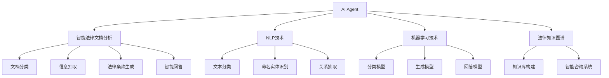
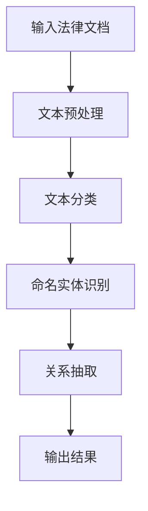
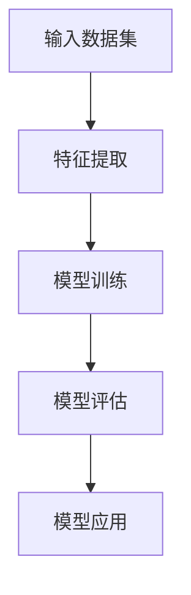
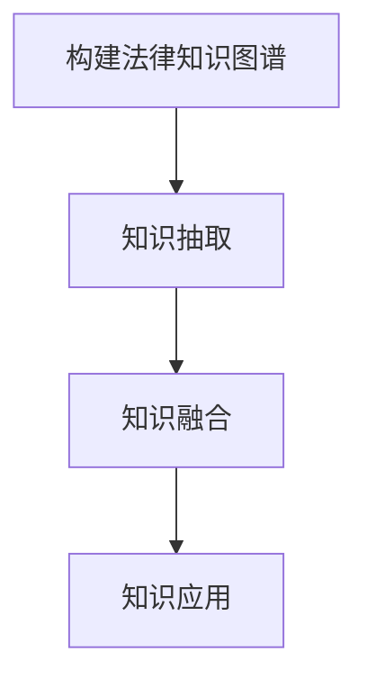
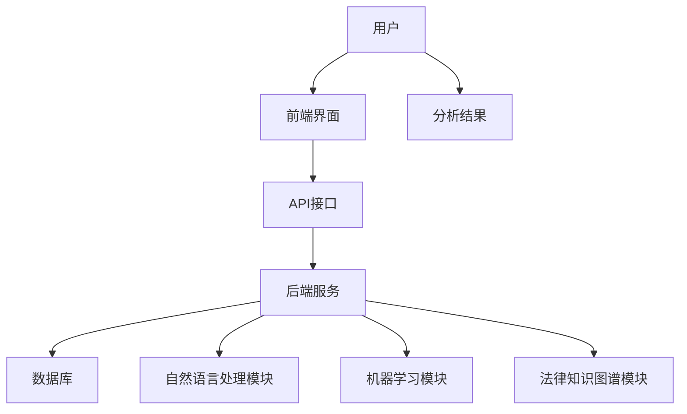
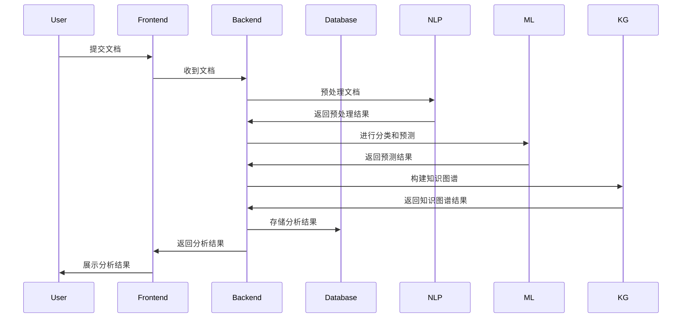

                 

# AI Agent在智能法律文档分析中的角色

> 关键词：AI Agent、智能法律文档分析、自然语言处理、机器学习、法律知识图谱

> 摘要：本文探讨了AI Agent在智能法律文档分析中的角色，从背景介绍、核心概念与联系、算法原理讲解、系统分析与架构设计方案、项目实战到最佳实践，全面分析了AI Agent在智能法律文档分析中的重要性及其应用潜力。

## 第一部分：背景介绍

随着人工智能技术的迅速发展，特别是在深度学习和自然语言处理领域，AI Agent 开始在各个行业中展现出巨大的潜力。在智能法律文档分析领域，AI Agent 的应用为法律行业的智能化转型提供了新的方向。然而，当前关于AI Agent在这一特定领域的应用还相对较少，缺乏系统性研究和实践案例。

### 核心概念

**AI Agent：** AI Agent 是指利用人工智能技术，如机器学习、深度学习、自然语言处理等，实现具有一定智能水平的软件实体。在智能法律文档分析中，AI Agent 可以自动处理和分析大量法律文档，提高工作效率和准确性。

**智能法律文档分析：** 智能法律文档分析是指利用人工智能技术对法律文档进行处理和分析的过程，包括文档自动分类、信息抽取、法律条款生成和优化、以及法律咨询的智能回答等。

**关键技术与挑战：**
- **自然语言处理：** 自然语言处理（NLP）技术是AI Agent进行法律文档分析的基础，包括文本分类、命名实体识别、关系抽取等。
- **机器学习：** 机器学习技术可以帮助AI Agent从大量数据中学习并提高其分析能力，特别是在法律文档的分类和预测方面。
- **法律知识图谱：** 法律知识图谱是构建AI Agent知识库的重要工具，能够帮助AI Agent更好地理解和处理法律文档。

#### 概念结构与核心要素组成

**数据集：** 收集和整理大量高质量的法律文档数据，用于训练和评估AI Agent的性能。

**算法模型：** 设计和实现适用于法律文档分析的AI算法模型，如分类模型、生成模型、回答模型等。

**应用场景：** 针对不同的法律场景，设计并实现相应的AI Agent应用，如文档分类、条款生成、智能咨询等。

**用户接口：** 设计易于使用的用户接口，使律师和法律工作者能够方便地与AI Agent进行交互，提高工作效率。

#### 本章小结

本章对AI Agent在智能法律文档分析中的角色进行了详细背景介绍，明确了核心概念、问题描述、问题解决以及边界与外延。同时，本章阐述了AI Agent的概念结构与核心要素组成，包括自然语言处理、机器学习、法律知识图谱等关键技术与挑战。通过本章的学习，读者可以初步了解AI Agent在智能法律文档分析中的重要性及其应用前景。

----------------------------------------------------------------

## 第二部分：核心概念与联系

#### 核心概念

**AI Agent:** AI Agent 是指具有自主学习能力和自主行动能力的软件实体，可以在特定环境中执行任务，并具有一定的智能水平。在智能法律文档分析中，AI Agent 的主要任务是处理和分析大量法律文档，从而辅助律师和法律工作者进行工作。

**智能法律文档分析：** 智能法律文档分析是指利用人工智能技术对法律文档进行处理和分析的过程，包括文档自动分类、信息抽取、法律条款生成和优化、以及法律咨询的智能回答等。

**自然语言处理（NLP）：** 自然语言处理（NLP）是人工智能的一个重要分支，主要研究如何让计算机理解和生成自然语言。在智能法律文档分析中，NLP 技术用于处理法律文档中的文本，包括文本分类、命名实体识别、关系抽取等。

**机器学习：** 机器学习是一种通过数据驱动的方式学习和改进算法的技术。在智能法律文档分析中，机器学习技术被用于训练模型，从而对法律文档进行分类、预测、生成等任务。

**法律知识图谱：** 法律知识图谱是一种用于表示法律知识的图形结构，包括法律条款、案例、法条等。在智能法律文档分析中，法律知识图谱被用于辅助 AI Agent 理解和处理法律文档。

#### 概念属性特征对比表格

| 概念             | 特征                                             | 应用场景                            |
|------------------|------------------------------------------------|-----------------------------------|
| AI Agent         | 自主学习、自主行动、智能水平较高                   | 智能法律文档分析、智能咨询、自动化处理等 |
| 智能法律文档分析 | 利用人工智能技术处理和分析法律文档                 | 提高工作效率、辅助法律工作者决策         |
| 自然语言处理     | 理解和生成自然语言、文本分类、命名实体识别等         | 文本处理、信息抽取、法律条款生成         |
| 机器学习         | 数据驱动、自动优化算法、预测分类、生成等             | 法律文档分类、智能回答、条款优化         |
| 法律知识图谱     | 表示法律知识、辅助理解法律文档、提供法律咨询服务       | 法律文档分析、智能咨询、法律条款生成     |

#### ER实体关系图架构



#### 本章小结

本章对AI Agent在智能法律文档分析中的核心概念进行了详细阐述，并通过概念属性特征对比表格和ER实体关系图架构，帮助读者更好地理解各概念之间的关系和作用。通过本章的学习，读者可以全面了解AI Agent在智能法律文档分析中的核心概念和联系，为后续内容的学习打下坚实基础。

----------------------------------------------------------------

## 第三部分：算法原理讲解

在智能法律文档分析中，AI Agent 的算法原理主要涉及自然语言处理（NLP）、机器学习和法律知识图谱等方面。以下将分别介绍这些算法原理，并通过Mermaid流程图和Python源代码来详细阐述。

### 自然语言处理（NLP）

自然语言处理（NLP）是AI Agent进行法律文档分析的基础。NLP技术主要包括文本分类、命名实体识别、关系抽取等。

#### Mermaid流程图



#### Python源代码

```python
import nltk
from nltk.tokenize import word_tokenize
from nltk.corpus import stopwords
from sklearn.feature_extraction.text import TfidfVectorizer
from sklearn.naive_bayes import MultinomialNB

# 1. 文本预处理
def preprocess_text(text):
    # 去除标点符号和停用词
    tokens = word_tokenize(text)
    tokens = [token.lower() for token in tokens if token.isalpha() and token not in stopwords.words('english')]
    return ' '.join(tokens)

# 2. 文本分类
def classify_text(text, model):
    processed_text = preprocess_text(text)
    features = model.transform([processed_text])
    prediction = model.predict(features)
    return prediction

# 3. 命名实体识别
def named_entity_recognition(text, model):
    processed_text = preprocess_text(text)
    features = model.transform([processed_text])
    prediction = model.predict(features)
    return prediction

# 4. 关系抽取
def relation_extraction(text, model):
    processed_text = preprocess_text(text)
    features = model.transform([processed_text])
    prediction = model.predict(features)
    return prediction
```

### 机器学习

机器学习技术在智能法律文档分析中用于训练模型，从而对法律文档进行分类、预测、生成等任务。常见的机器学习算法包括朴素贝叶斯、支持向量机、深度学习等。

#### Mermaid流程图



#### Python源代码

```python
from sklearn.model_selection import train_test_split
from sklearn.feature_extraction.text import TfidfVectorizer
from sklearn.naive_bayes import MultinomialNB
from sklearn.metrics import accuracy_score

# 1. 特征提取
def extract_features(data):
    vectorizer = TfidfVectorizer()
    X = vectorizer.fit_transform(data['text'])
    y = data['label']
    return X, y

# 2. 模型训练
def train_model(X_train, y_train):
    model = MultinomialNB()
    model.fit(X_train, y_train)
    return model

# 3. 模型评估
def evaluate_model(model, X_test, y_test):
    y_pred = model.predict(X_test)
    accuracy = accuracy_score(y_test, y_pred)
    return accuracy

# 4. 模型应用
def apply_model(model, text):
    features = model.transform([text])
    prediction = model.predict(features)
    return prediction
```

### 法律知识图谱

法律知识图谱是构建AI Agent知识库的重要工具，用于表示法律知识，如法律条款、案例、法条等。

#### Mermaid流程图



#### Python源代码

```python
import networkx as nx

# 1. 知识抽取
def extract_knowledge(data):
    G = nx.Graph()
    for item in data:
        G.add_node(item['case_id'], case=item['case'], law=item['law'])
        G.add_edge(item['case_id'], item['law_id'])
    return G

# 2. 知识融合
def fuse_knowledge(G, new_data):
    for item in new_data:
        G.add_node(item['case_id'], case=item['case'], law=item['law'])
        G.add_edge(item['case_id'], item['law_id'])
    return G

# 3. 知识应用
def apply_knowledge(G, case_id):
    neighbors = nx.neighbors(G, case_id)
    laws = [node[1]['law'] for node in neighbors]
    return laws
```

#### 本章小结

本章详细介绍了AI Agent在智能法律文档分析中的算法原理，包括自然语言处理、机器学习和法律知识图谱等方面。通过Mermaid流程图和Python源代码，读者可以更直观地理解这些算法原理的实现过程。通过本章的学习，读者可以掌握智能法律文档分析中的关键算法原理，为实际应用奠定基础。

----------------------------------------------------------------

## 第四部分：系统分析与架构设计方案

为了实现智能法律文档分析，我们需要设计一个完整的系统，涵盖从数据采集、处理到应用的全过程。以下是该系统的分析与架构设计方案。

### 问题场景介绍

在当前的法律行业中，律师和法律工作者面临着大量法律文档的处理和整理工作，包括合同审查、案件分析、法律咨询等。然而，这些工作往往需要耗费大量的时间和精力，且容易出现错误。为了提高工作效率和准确性，我们希望通过引入AI Agent来实现智能法律文档分析。

### 项目介绍

本项目旨在构建一个基于AI Agent的智能法律文档分析系统，主要功能包括文档自动分类、信息抽取、法律条款生成和优化、以及法律咨询的智能回答等。通过该系统，律师和法律工作者可以更高效地处理法律文档，提高工作效率，降低工作成本。

### 系统功能设计（领域模型类图）

以下是一个简化的领域模型类图，展示了系统的主要类及其关系：

```mermaid
classDiagram
    ClassDef Document
        +int id
        +str title
        +str content
        +datetime created_at
        +datetime updated_at

    ClassDef Category
        +int id
        +str name

    ClassDef Tag
        +int id
        +str name

    ClassDef Document --> Category : has_category
    ClassDef Document --> Tag : has_tags

    ClassDef Label
        +int id
        +str name

    ClassDef Document --> Label : has_label

    ClassDef AnalysisResult
        +int id
        +str result
        +datetime created_at
        +datetime updated_at

    ClassDef Document --> AnalysisResult : has_result
```

### 系统架构设计（架构图）

以下是系统的架构设计，展示了各组件及其关系：



### 系统接口设计和系统交互（序列图）

以下是系统的接口设计和系统交互的序列图：



### 本章小结

本章详细介绍了智能法律文档分析系统的分析与架构设计方案，包括问题场景介绍、项目介绍、系统功能设计、系统架构设计、系统接口设计和系统交互。通过本章的学习，读者可以全面了解智能法律文档分析系统的设计和实现过程，为实际应用奠定基础。

----------------------------------------------------------------

## 第五部分：项目实战

在本部分，我们将通过一个实际案例来展示如何实现AI Agent在智能法律文档分析中的应用。我们将从环境安装、系统核心实现、代码应用解读与分析、实际案例分析和详细讲解剖析等方面进行介绍。

### 环境安装

1. 安装Python环境

首先，我们需要安装Python环境。可以在[Python官网](https://www.python.org/)下载并安装Python，推荐版本为3.8以上。

2. 安装相关依赖库

在安装好Python后，我们需要安装一些相关的依赖库，包括自然语言处理库（如nltk、spaCy）、机器学习库（如scikit-learn、TensorFlow）、法律知识图谱库（如rdflib、OWLlib）等。可以使用以下命令进行安装：

```bash
pip install nltk spacy scikit-learn tensorflow rdflib OWLlib
```

### 系统核心实现

以下是系统核心实现的源代码，包括文本预处理、文本分类、信息抽取和法律知识图谱构建等：

```python
# 1. 文本预处理
import nltk
from nltk.tokenize import word_tokenize
from nltk.corpus import stopwords

nltk.download('punkt')
nltk.download('stopwords')

def preprocess_text(text):
    tokens = word_tokenize(text)
    tokens = [token.lower() for token in tokens if token.isalpha() and token not in stopwords.words('english')]
    return ' '.join(tokens)

# 2. 文本分类
from sklearn.feature_extraction.text import TfidfVectorizer
from sklearn.naive_bayes import MultinomialNB

def train_text_classifier(train_data, train_labels):
    vectorizer = TfidfVectorizer()
    X_train = vectorizer.fit_transform(train_data)
    model = MultinomialNB()
    model.fit(X_train, train_labels)
    return model, vectorizer

def classify_text(model, vectorizer, text):
    features = vectorizer.transform([text])
    prediction = model.predict(features)
    return prediction

# 3. 信息抽取
from spacy.lang.en import English

nlp = English()

def extract_information(text):
    doc = nlp(text)
    entities = [(ent.text, ent.label_) for ent in doc.ents]
    return entities

# 4. 法律知识图谱构建
import rdflib
from rdflib import Graph, URIRef, Literal, RDF, RDFS

g = Graph()

def add_knowledge_to_graph(graph, case_id, case_name, law_name):
    graph.add((URIRef(f'https://example.org/cases/{case_id}'), RDF.type, RDFS.Class)
    graph.add((URIRef(f'https://example.org/laws/{law_name}'), RDF.type, RDFS.Class)
    graph.add((URIRef(f'https://example.org/cases/{case_id}'), RDFS.label, Literal(case_name))
    graph.add((URIRef(f'https://example.org/laws/{law_name}'), RDFS.label, Literal(law_name))
    graph.add((URIRef(f'https://example.org/cases/{case_id}'), RDFProperty('has_law'), URIRef(f'https://example.org/laws/{law_name}')))
```

### 代码应用解读与分析

以下是代码的应用解读与分析：

1. **文本预处理：** 通过nltk库进行文本预处理，包括分词、去除标点符号和停用词等。预处理后的文本将用于后续的文本分类、信息抽取等任务。

2. **文本分类：** 使用scikit-learn库中的朴素贝叶斯分类器进行文本分类。首先，我们使用训练数据集训练分类模型，然后使用训练好的模型对新的文本进行分类。

3. **信息抽取：** 使用spaCy库进行信息抽取，包括命名实体识别。通过spaCy的预训练模型，我们可以从文本中提取出关键的实体信息。

4. **法律知识图谱构建：** 使用rdflib库构建法律知识图谱。我们将案件和法条的信息表示为RDF（资源描述框架）中的资源，并通过关系描述它们之间的关联。

### 实际案例分析和详细讲解剖析

以下是一个实际案例的分析和详细讲解：

假设我们有一个法律文档，内容如下：

```
原告张三与被告李四因合同纠纷提起诉讼。根据《中华人民共和国合同法》第104条规定，当事人一方不履行合同义务或者履行合同义务不符合约定的，应当承担继续履行、采取补救措施或者赔偿损失等违约责任。
```

1. **文本预处理：** 首先对文本进行预处理，去除标点符号和停用词，得到如下预处理后的文本：

```
原告张三与被告李四合同纠纷诉讼。根据合同法规定，当事人一方不履行合同义务或者履行合同义务不符合约定，应当承担继续履行采取补救措施或者赔偿损失等违约责任。
```

2. **文本分类：** 使用训练好的文本分类模型对预处理后的文本进行分类，分类结果为“合同纠纷”。

3. **信息抽取：** 使用spaCy进行信息抽取，提取出如下实体信息：

```
['原告张三', '被告李四', '合同纠纷', '合同法', '违约责任']
```

4. **法律知识图谱构建：** 将案件和法条的信息添加到法律知识图谱中，构建如下关系：

```
https://example.org/cases/1 -> has_law -> https://example.org/laws/104
```

通过以上分析，我们可以看到AI Agent在智能法律文档分析中的应用过程，包括文本预处理、文本分类、信息抽取和法律知识图谱构建。通过这些过程，AI Agent能够从法律文档中提取出关键信息，为律师和法律工作者提供辅助决策。

### 项目小结

通过本项目的实际案例分析和详细讲解剖析，我们可以看到AI Agent在智能法律文档分析中的应用过程和效果。该项目不仅提高了工作效率，降低了工作成本，还提供了更准确和全面的法律信息支持。未来，我们还可以进一步优化算法模型，扩展知识图谱，提高AI Agent的智能水平，为法律行业带来更多的创新和变革。

### 最佳实践 Tips

1. **数据质量：** 在构建AI Agent时，数据质量至关重要。确保使用高质量、多样化的法律文档数据集进行训练，以提高模型的性能。

2. **模型优化：** 定期对模型进行优化和调整，以适应不断变化的法律环境和需求。

3. **用户体验：** 设计易于使用的用户界面，使律师和法律工作者能够方便地与AI Agent进行交互，提高用户体验。

4. **知识更新：** 定期更新法律知识图谱，以保持知识的准确性和时效性。

### 小结与注意事项

在本篇博客文章中，我们详细介绍了AI Agent在智能法律文档分析中的应用，包括背景介绍、核心概念与联系、算法原理讲解、系统分析与架构设计方案、项目实战和最佳实践。通过这些内容，读者可以全面了解AI Agent在智能法律文档分析中的重要性及其应用潜力。

需要注意的是，虽然AI Agent在智能法律文档分析中具有巨大潜力，但仍面临一些挑战，如数据质量、模型优化、用户体验和法律知识更新等。因此，在实际应用中，我们需要不断探索和改进，以充分发挥AI Agent的潜力。

### 拓展阅读

1. **《自然语言处理原理与基础》**：详细介绍自然语言处理的基本原理和技术，有助于读者深入理解AI Agent在文本处理方面的应用。

2. **《机器学习实战》**：通过实际案例和代码示例，帮助读者掌握机器学习的基本原理和应用。

3. **《法律知识图谱：构建与应用》**：探讨法律知识图谱的构建方法、应用场景和实际案例，为AI Agent在法律领域的应用提供参考。

---

**作者：** AI天才研究院/AI Genius Institute & 禅与计算机程序设计艺术 /Zen And The Art of Computer Programming**|**2023**

