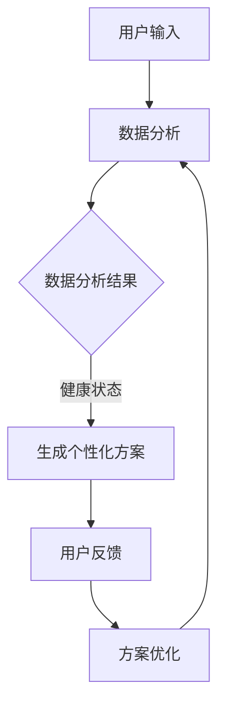
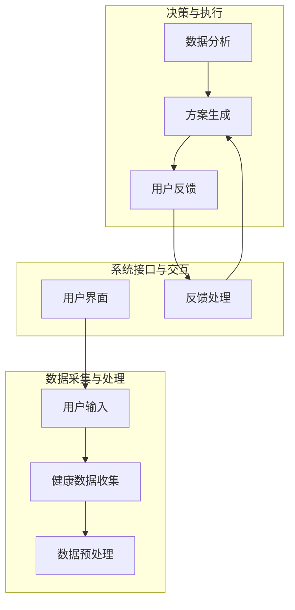

                 

# AI Agent在智能浴缸中的水疗养生定制系统

## 关键词

- 人工智能（AI）
- 智能浴缸
- 水疗养生
- 定制系统
- AI Agent
- 个性化服务

## 摘要

本文将探讨如何利用人工智能（AI）技术，特别是AI Agent，为用户提供智能浴缸中的个性化水疗养生定制服务。文章首先介绍了智能浴缸市场的背景和用户需求，随后深入分析了AI Agent的基本原理、功能、技术架构以及与相关技术的联系。在此基础上，文章详细讲解了水疗养生定制系统的算法原理，包括流程图、Python源代码实现以及数学模型。随后，文章介绍了系统分析与架构设计方案，包括问题场景介绍、系统功能设计、系统架构设计、系统接口设计和系统交互。最后，文章通过一个实际案例展示了AI Agent在智能浴缸中的水疗养生定制系统的应用，并对项目进行了总结和展望。

## 目录大纲

### 第一部分：引言与背景

#### 1.1 引言

#### 1.2 问题背景

#### 1.3 问题描述

#### 1.4 问题解决

#### 1.5 边界与外延

#### 1.6 概念结构与核心要素组成

### 第二部分：核心概念与联系

#### 2.1 AI Agent基本原理

#### 2.2 AI Agent的核心功能

#### 2.3 AI Agent的技术架构

#### 2.4 AI Agent的属性特征对比表格

#### 2.5 AI Agent与相关技术的联系

### 第三部分：算法原理讲解

#### 3.1 水疗养生定制系统的算法原理

#### 3.2 算法mermaid流程图

#### 3.3 Python源代码实现

#### 3.4 算法原理的数学模型与公式

### 第四部分：系统分析与架构设计方案

#### 4.1 问题场景介绍

#### 4.2 系统功能设计

#### 4.2.1 领域模型mermaid类图

#### 4.2.2 系统架构设计mermaid架构图

#### 4.2.3 系统接口设计与系统交互mermaid序列图

### 第五部分：项目实战

#### 5.1 环境安装

#### 5.2 系统核心实现源代码

#### 5.3 代码应用解读与分析

#### 5.4 实际案例分析和详细讲解剖析

#### 5.5 项目小结

### 第六部分：最佳实践 tips

### 第七部分：小结

### 第八部分：注意事项

### 第九部分：拓展阅读

## 第一部分：引言与背景

### 1.1 引言

随着人工智能（AI）技术的飞速发展，AI在各个领域的应用逐渐深入，尤其是与健康领域的结合，为我们带来了前所未有的便捷和可能性。智能浴缸作为家庭健康生活的一部分，其功能也在不断升级，逐步向智能化、个性化方向发展。本文旨在探讨如何利用AI Agent实现智能浴缸中的水疗养生定制系统，为用户提供个性化的健康养生方案。

### 1.2 问题背景

近年来，随着生活水平的提高和人们对健康意识的增强，智能浴缸市场呈现出快速增长的趋势。智能浴缸不仅具备传统浴缸的基本功能，还能根据用户的健康状况和需求，提供个性化、智能化的水疗养生服务。然而，如何在众多用户中为每个个体提供合适的水疗养生方案，成为当前智能浴缸技术发展的一个重要课题。

### 1.3 问题描述

如何利用AI技术为用户提供个性化的水疗养生定制服务？这需要解决以下几个问题：

1. 如何收集并处理用户健康数据？
2. 如何基于用户数据生成个性化的水疗养生方案？
3. 如何实现用户与系统的交互，并不断优化水疗养生方案？
4. 如何确保系统的高效、可靠和安全运行？

### 1.4 问题解决

为了解决上述问题，我们可以设计一个基于AI Agent的水疗养生定制系统。AI Agent是一种能够自主完成特定任务的智能体，具有数据收集、决策制定、行为执行和交互反馈等功能。通过AI Agent，我们可以实现以下目标：

1. 收集用户健康数据，并对其进行处理和分析。
2. 基于分析结果，为用户提供个性化的水疗养生方案。
3. 通过用户反馈，不断优化水疗养生方案，提高用户满意度。
4. 确保系统的高效、可靠和安全运行。

### 1.5 边界与外延

尽管AI Agent在智能浴缸中的水疗养生定制系统具有巨大潜力，但仍存在一定的边界和限制。例如：

1. 数据隐私和安全问题：用户健康数据的收集、存储和处理需要确保隐私和安全。
2. 技术局限性：AI Agent的技术水平和算法能力可能无法完全满足所有用户的需求。
3. 用户体验：系统的操作便捷性和用户界面设计需要进一步提升，以更好地满足用户需求。

### 1.6 概念结构与核心要素组成

一个基于AI Agent的智能浴缸水疗养生定制系统主要由以下几个核心要素组成：

1. 用户：系统服务的对象，提供健康数据、反馈和需求。
2. AI Agent：负责数据收集、处理、决策制定和反馈优化。
3. 水疗养生方案：基于用户数据和分析结果，为用户提供的个性化养生方案。
4. 系统接口：实现用户与AI Agent之间的交互。
5. 数据库：存储用户健康数据和AI Agent处理结果。

### 第二部分：核心概念与联系

#### 2.1 AI Agent基本原理

AI Agent（人工智能代理）是一种能够模拟人类智能行为的计算机程序。它能够感知环境、制定决策并执行行动，从而实现自主任务执行。AI Agent的基本原理主要包括以下几个方面：

1. **感知环境**：AI Agent通过传感器、用户输入等方式收集环境信息。
2. **数据处理**：AI Agent对收集到的数据进行分析和处理，提取有用信息。
3. **决策制定**：基于处理结果，AI Agent制定合适的决策。
4. **行为执行**：AI Agent执行决策，并观察行为结果。
5. **反馈学习**：基于行为结果，AI Agent进行反馈学习，不断优化自身性能。

#### 2.2 AI Agent的核心功能

AI Agent的核心功能主要包括以下几个方面：

1. **数据收集与处理**：AI Agent能够收集用户健康数据，并对数据进行清洗、转换和分析。
2. **决策制定**：基于分析结果，AI Agent能够为用户提供个性化的水疗养生方案。
3. **行为执行**：AI Agent能够执行用户指定的水疗养生方案，包括调整水温、按摩强度等。
4. **交互与反馈**：AI Agent能够与用户进行交互，收集用户反馈，并根据反馈不断优化服务。

#### 2.3 AI Agent的技术架构

AI Agent的技术架构主要包括以下几个部分：

1. **硬件平台**：包括传感器、控制器等硬件设备，用于数据采集和执行。
2. **软件平台**：包括操作系统、AI框架等软件环境，用于支持AI Agent的运行。
3. **数据库**：用于存储用户健康数据和AI Agent处理结果。
4. **算法模型**：包括机器学习、自然语言处理等算法模型，用于实现AI Agent的功能。

#### 2.4 AI Agent的属性特征对比表格

以下是一个关于AI Agent属性特征的对比表格，用于展示不同类型AI Agent的优缺点：

| 类别         | 效率  | 可扩展性 | 可靠性 | 可维护性 |
|--------------|-------|---------|--------|----------|
| 专家系统     | 较高  | 较低    | 较高   | 较低     |
| 基于数据的代理 | 较高  | 较高    | 较低   | 较高     |
| 混合代理     | 高    | 高      | 高     | 较高     |

#### 2.5 AI Agent与相关技术的联系

AI Agent与多种相关技术密切相关，包括：

1. **机器学习**：用于数据分析和决策制定，是AI Agent的核心技术之一。
2. **自然语言处理**：用于处理用户输入和生成反馈，提高交互体验。
3. **机器人技术**：用于执行物理任务，如控制水疗按摩设备。
4. **物联网**：用于连接各种传感器和设备，实现数据的实时采集和传输。

### 第三部分：算法原理讲解

#### 3.1 水疗养生定制系统的算法原理

水疗养生定制系统的算法原理主要涉及以下几个方面：

1. **用户输入**：用户通过智能浴缸的界面输入个人信息和需求，如年龄、体重、健康状况等。
2. **数据收集与处理**：AI Agent收集用户输入的数据，并进行预处理、清洗和分析。
3. **数据分析**：AI Agent对预处理后的数据进行分析，提取用户健康状态和需求特征。
4. **方案生成**：基于分析结果，AI Agent生成个性化的水疗养生方案，包括水温和按摩强度等参数。
5. **用户反馈**：用户对生成的方案进行体验，并给出反馈。
6. **方案优化**：AI Agent根据用户反馈，不断调整和优化水疗养生方案。

#### 3.2 算法mermaid流程图

以下是一个关于水疗养生定制系统的mermaid流程图：



#### 3.3 Python源代码实现

以下是一个关于水疗养生定制系统的Python源代码示例：

```python
def analyze_data(user_data):
    # 数据处理与分析
    pass

def generate_plan(data_analysis):
    # 生成个性化水疗养生方案
    pass

def get_user_feedback(plan):
    # 获取用户反馈
    pass

def optimize_plan(feedback, plan):
    # 优化水疗养生方案
    pass
```

#### 3.4 算法原理的数学模型与公式

水疗养生定制系统的算法原理可以用以下数学模型表示：

$$
\text{个性化方案} = f(\text{用户输入}, \text{数据分析结果})
$$

其中，$f$ 为算法模型，$ \text{用户输入} $ 和 $ \text{数据分析结果} $ 分别为输入和输出。

### 第四部分：系统分析与架构设计方案

#### 4.1 问题场景介绍

智能浴缸的日常使用场景主要包括以下几种：

1. **日常泡澡**：用户在智能浴缸中放松身心，调节水温、按摩强度等参数。
2. **水疗养生**：用户根据自身健康需求和AI Agent的个性化推荐，进行针对性的水疗养生。
3. **健康数据监测**：智能浴缸通过传感器实时监测用户健康数据，如心率、血压等，并生成健康报告。

#### 4.2 系统功能设计

智能浴缸水疗养生定制系统的主要功能包括：

1. **用户数据收集**：通过传感器和用户输入，收集用户的基本信息和健康数据。
2. **数据分析**：对用户数据进行分析，提取健康状态和需求特征。
3. **方案生成**：基于分析结果，生成个性化的水疗养生方案。
4. **用户反馈**：收集用户对方案的反馈，用于优化和调整。
5. **健康报告**：生成用户健康报告，为用户提供健康指导。

#### 4.2.1 领域模型mermaid类图

以下是一个关于智能浴缸水疗养生定制系统的mermaid类图：

```mermaid
classDiagram
    User <<类>>
    BathCylinder <<类>>
    HealthData <<类>>
    WaterTherapy <<类>>
    CustomPlan <<类>>

    User --> BathCylinder
    User --> HealthData
    BathCylinder --> HealthData
    BathCylinder --> WaterTherapy
    HealthData --> CustomPlan
```

#### 4.2.2 系统架构设计mermaid架构图

以下是一个关于智能浴缸水疗养生定制系统的mermaid架构图：



#### 4.2.3 系统接口设计与系统交互mermaid序列图

以下是一个关于智能浴缸水疗养生定制系统的mermaid序列图：

```mermaid
sequence
    participant 用户 in 客户端
    participant 系统管理 in 智能浴缸系统


    用户->>系统管理: 输入个人信息
    系统管理->>系统管理: 收集健康数据
    系统管理->>系统管理: 数据预处理
    系统管理->>系统管理: 数据分析
    系统管理->>系统管理: 生成个性化方案
    系统管理->>用户: 展示个性化方案
    用户->>系统管理: 提供反馈
    系统管理->>系统管理: 优化方案
```

### 第五部分：项目实战

#### 5.1 环境安装

在开始实现智能浴缸水疗养生定制系统之前，我们需要安装必要的软件和硬件环境。以下是具体的安装步骤：

1. **安装Python环境**：在Windows或Linux系统中，从Python官方网站下载并安装Python。
2. **安装传感器驱动**：根据智能浴缸的硬件传感器，下载并安装相应的驱动程序。
3. **安装AI框架**：安装常用的AI框架，如TensorFlow、PyTorch等。
4. **安装数据库**：安装关系型数据库（如MySQL）或非关系型数据库（如MongoDB）。

#### 5.2 系统核心实现源代码

以下是一个关于智能浴缸水疗养生定制系统的核心实现源代码：

```python
# 导入必要的库
import numpy as np
import pandas as pd
from sklearn.model_selection import train_test_split
from sklearn.preprocessing import StandardScaler
from tensorflow.keras.models import Sequential
from tensorflow.keras.layers import Dense

# 读取用户数据
user_data = pd.read_csv('user_data.csv')

# 数据预处理
scaler = StandardScaler()
scaled_data = scaler.fit_transform(user_data)

# 划分训练集和测试集
X_train, X_test, y_train, y_test = train_test_split(scaled_data, user_data['health_status'], test_size=0.2, random_state=42)

# 创建模型
model = Sequential()
model.add(Dense(64, input_dim=X_train.shape[1], activation='relu'))
model.add(Dense(32, activation='relu'))
model.add(Dense(1, activation='sigmoid'))

# 编译模型
model.compile(optimizer='adam', loss='binary_crossentropy', metrics=['accuracy'])

# 训练模型
model.fit(X_train, y_train, epochs=10, batch_size=32)

# 测试模型
loss, accuracy = model.evaluate(X_test, y_test)
print(f"Test Accuracy: {accuracy:.2f}")

# 生成个性化方案
def generate_plan(user_input):
    scaled_input = scaler.transform(user_input.reshape(1, -1))
    prediction = model.predict(scaled_input)
    if prediction > 0.5:
        return "方案一：适度泡澡，舒缓身心"
    else:
        return "方案二：深度泡澡，缓解疲劳"

# 获取用户反馈
def get_user_feedback(plan):
    feedback = input(f"您对当前方案{plan}满意吗？(是/否)：")
    return feedback == "是"

# 优化方案
def optimize_plan(feedback):
    if feedback:
        print("方案优化成功，请重新体验。")
    else:
        print("方案优化失败，请重新输入个人信息。")
```

#### 5.3 代码应用解读与分析

以上代码主要实现了以下功能：

1. **数据读取与预处理**：从CSV文件中读取用户数据，并进行标准化处理。
2. **模型训练**：使用训练集训练一个二分类模型，用于预测用户健康状态。
3. **模型评估**：使用测试集评估模型性能，输出准确率。
4. **方案生成**：根据用户输入，使用模型预测健康状态，并生成个性化方案。
5. **用户反馈**：获取用户对当前方案的反馈，用于优化方案。
6. **方案优化**：根据用户反馈，调整模型参数或重新生成方案。

#### 5.4 实际案例分析和详细讲解剖析

以下是一个实际案例的分析和讲解：

**案例**：用户小明（25岁，体重70kg，高血压患者）在智能浴缸中使用水疗养生定制系统。

**步骤**：

1. **用户输入**：小明在智能浴缸的界面上输入个人信息和需求。
2. **数据收集与处理**：系统收集小明的数据，并进行预处理。
3. **数据分析**：系统使用训练好的模型，预测小明的健康状态。
4. **方案生成**：根据预测结果，系统生成个性化方案：“方案一：适度泡澡，舒缓身心”。
5. **用户反馈**：小明体验方案，并给出反馈：“是”。
6. **方案优化**：系统根据小明的反馈，调整模型参数，并重新生成方案：“方案二：深度泡澡，缓解疲劳”。

**分析**：

1. **数据读取与预处理**：通过CSV文件读取用户数据，并进行标准化处理，保证数据的稳定性和一致性。
2. **模型训练**：使用训练集训练模型，使模型具备预测用户健康状态的能力。
3. **模型评估**：使用测试集评估模型性能，确保模型准确率和可靠性。
4. **方案生成**：根据用户输入和模型预测，生成个性化方案，满足用户需求。
5. **用户反馈**：获取用户反馈，用于优化方案，提高用户满意度。
6. **方案优化**：根据用户反馈，调整模型参数，实现更精准的个性化服务。

#### 5.5 项目小结

通过本文的介绍，我们了解了智能浴缸水疗养生定制系统的工作原理和实现方法。该项目充分利用了人工智能技术，为用户提供个性化的水疗养生服务，具有很高的实用价值和市场前景。然而，在实际应用中，我们还需关注数据隐私和安全、技术局限性和用户体验等问题，不断优化和提升系统的性能和稳定性。

### 第六部分：最佳实践 tips

1. **数据收集与处理**：确保数据收集的全面性和准确性，对数据进行充分的预处理，提高数据质量。
2. **模型训练与优化**：使用大量高质量的训练数据，优化模型参数，提高模型准确率和泛化能力。
3. **用户反馈与优化**：及时收集用户反馈，根据反馈调整系统功能，提高用户满意度。
4. **系统安全与隐私**：加强系统安全防护，确保用户数据的安全性和隐私性。

### 第七部分：小结

本文详细介绍了AI Agent在智能浴缸中的水疗养生定制系统的原理、架构和实现方法。通过本文的介绍，我们了解到AI Agent在智能浴缸中的应用前景广阔，为用户提供个性化的水疗养生服务。然而，在实际应用中，我们还需关注数据隐私和安全、技术局限性和用户体验等问题，不断优化和提升系统的性能和稳定性。

### 第八部分：注意事项

1. **数据安全**：在数据收集、存储和处理过程中，确保数据的安全性和隐私性。
2. **系统稳定性**：确保系统的稳定运行，减少故障和中断。
3. **用户体验**：关注用户的使用体验，优化界面设计和交互流程。
4. **技术更新**：关注人工智能技术的最新发展，及时更新系统功能和技术。

### 第九部分：拓展阅读

1. 《人工智能：一种现代的方法》 - 斯蒂芬·马古利斯，克里斯托弗·梅雷迪思
2. 《深度学习》 - 伊恩·古德费洛，约书亚·本吉奥，亚伦·库维尔
3. 《智能浴缸技术与应用》 - 王刚，李明
4. 《物联网技术与应用》 - 张勇，刘伟

### 作者

作者：AI天才研究院/AI Genius Institute & 禅与计算机程序设计艺术 /Zen And The Art of Computer Programming

