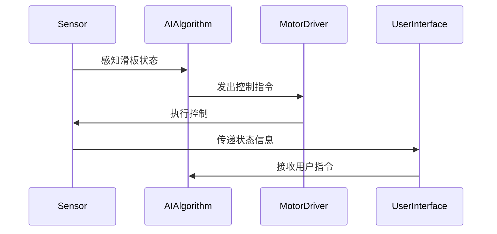
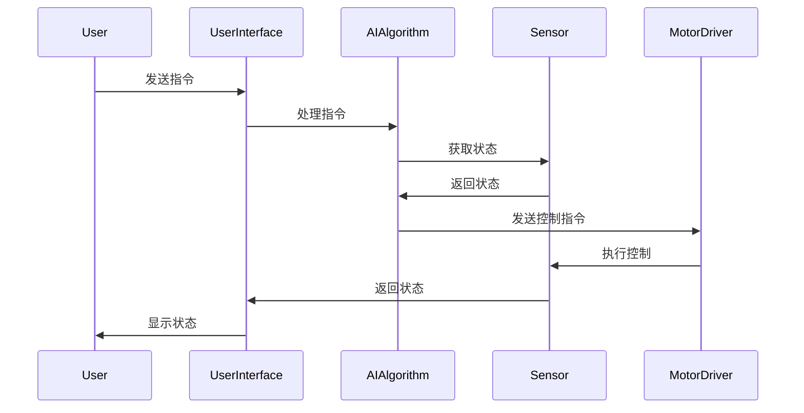

                 

# AI Agent在智能滑板中的平衡控制

## 关键词
- 人工智能，智能滑板，平衡控制，传感器，AI算法，电机驱动

## 摘要
本文将深入探讨AI Agent在智能滑板中的平衡控制技术。首先，我们将介绍智能滑板平衡控制问题的背景和核心概念，包括传感器、AI算法和电机驱动等。接着，通过对比表格和ER实体关系图，我们将详细阐述各概念之间的联系。然后，本文将逐步讲解平衡控制算法的原理，使用Mermaid流程图和Python源代码进行说明。此外，我们将介绍智能滑板系统的分析与架构设计方案，并通过实际项目实战来展示技术的应用。最后，我们将总结最佳实践和注意事项，为读者提供拓展阅读资源。

## 第一部分: AI Agent在智能滑板中的平衡控制背景介绍

### 1.1 问题背景

随着人工智能技术的飞速发展，智能滑板作为一种新兴的智能交通工具，正逐渐走入公众的视野。智能滑板以其轻便、环保和高效的特点，受到了广大年轻人群和科技爱好者的热烈追捧。然而，智能滑板的性能提升受到平衡控制技术的制约，而AI Agent的引入为这一难题提供了新的解决方案。

智能滑板的平衡控制问题主要表现在以下几个方面：

1. **动态平衡的维持**：在滑板运行过程中，由于速度、角度、重心等因素的变化，滑板需要不断调整自身姿态以保持平衡。这对传统的机械控制方法提出了挑战。
2. **环境适应性**：智能滑板需要在各种环境下运行，如平地、坡道、草地等，不同环境对平衡控制算法的要求也不尽相同。
3. **交互与导航**：智能滑板需要与其他智能交通工具、行人等进行交互，并且具备一定的导航能力。这要求平衡控制算法具备一定的智能性和适应性。

### 1.2 问题描述

AI Agent在智能滑板中的平衡控制问题可以概括为以下几个子问题：

1. **感知与识别**：智能滑板需要通过传感器实时获取滑板的状态信息，包括速度、角度、重心等。
2. **决策与规划**：根据感知信息，AI Agent需要做出决策，调整滑板的姿态和速度，以保持平衡。
3. **执行与控制**：将决策转化为实际的动作，通过电机驱动滑板，使其稳定运行。

为了解决这些子问题，我们需要：

1. **构建高效的感知系统**：通过多种传感器（如陀螺仪、加速度计、摄像头等）获取滑板的状态信息，提高感知精度。
2. **设计智能的决策与规划算法**：利用深度学习、强化学习等技术，使AI Agent能够自主学习和优化平衡控制策略。
3. **实现精确的执行与控制**：通过电机驱动系统，将AI Agent的决策转化为实际的滑板运动，实现稳定平衡控制。

### 1.3 问题解决

AI Agent在智能滑板中的平衡控制问题可以通过以下步骤来解决：

1. **数据采集与预处理**：通过传感器采集滑板的状态数据，包括速度、角度、重心等。对数据进行预处理，去除噪声，提取有效信息。
2. **状态估计与预测**：基于传感器数据和先验知识，对滑板的状态进行估计和预测。这有助于AI Agent提前了解滑板未来的状态，从而提前做出决策。
3. **决策与规划**：利用AI算法，如深度学习、强化学习等，对滑板的状态进行实时分析和决策。根据预测结果，调整滑板的姿态和速度，以保持平衡。
4. **执行与控制**：将AI Agent的决策转化为具体的电机控制指令，通过电机驱动系统实现滑板的实际运动。这需要精确的执行控制算法，以确保滑板的稳定性和可靠性。

### 1.4 边界与外延

1. **边界**：本文主要讨论AI Agent在智能滑板中的平衡控制问题，不包括极端环境下的特殊处理。例如，滑板在高速、极端温度、复杂路面等环境下的平衡控制问题不在本文讨论范围之内。
2. **外延**：AI Agent在智能滑板中的平衡控制技术可以扩展应用于其他智能交通工具，如智能电动车、无人机等。这些交通工具同样需要高效的平衡控制技术，以实现稳定、安全的运行。

### 1.5 概念结构与核心要素组成

1. **概念结构**：
   - 智能滑板：具有AI Agent的智能交通工具。
   - AI Agent：负责平衡控制的智能实体。
   - 传感器：获取滑板状态信息的设备。
   - 电机驱动系统：实现AI Agent决策的执行系统。

2. **核心要素组成**：
   - 感知系统：包括传感器和数据处理模块。
   - 决策系统：包括AI算法和决策模块。
   - 执行系统：包括电机驱动和控制系统。

### 总结

本章节对AI Agent在智能滑板中的平衡控制问题进行了全面的背景介绍。接下来，我们将深入探讨核心概念、算法原理、数学模型和系统架构，为读者展示这一前沿技术的全貌。

---

## 第二部分: AI Agent在智能滑板中的平衡控制核心概念与联系

### 2.1 核心概念

在本部分，我们将介绍AI Agent在智能滑板中的平衡控制核心概念，包括传感器、AI算法、电机驱动等。

1. **传感器**：传感器是智能滑板获取环境信息的关键设备，主要包括陀螺仪、加速度计和摄像头等。陀螺仪用于测量滑板的角速度，加速度计用于测量滑板的加速度，摄像头则用于环境感知。

2. **AI算法**：AI算法是智能滑板实现自主平衡控制的核心。常见的算法包括深度学习、强化学习等。这些算法可以通过训练模型，学习到如何根据传感器数据调整滑板的姿态和速度，以保持平衡。

3. **电机驱动**：电机驱动是执行AI Agent决策的关键部分。它根据AI算法的输出，控制电机的运转，实现滑板的运动。

### 2.2 概念属性特征对比表格

| 概念      | 属性特征                                     |
| --------- | -------------------------------------------- |
| 传感器    | 感知环境信息，如角速度、加速度和图像         |
| AI算法    | 自主学习和决策，如深度学习、强化学习       |
| 电机驱动  | 执行AI算法的决策，控制电机运转             |

### 2.3 ER实体关系图架构

下面是AI Agent在智能滑板中的平衡控制ER实体关系图：

```mermaid
erDiagram
  Sensor ||--|{ AIAlgorithm }|--> MotorDriver
  AIAlgorithm ||--|{滑板状态}|--> Sensor
  MotorDriver ||--|{滑板控制}|--> AIAlgorithm
```

在这个ER实体关系图中，Sensor（传感器）负责感知滑板状态，传递给AIAlgorithm（AI算法），AIAlgorithm根据滑板状态做出决策，并通过MotorDriver（电机驱动）实现滑板控制。

### 2.4 核心概念之间的联系

AI Agent在智能滑板中的平衡控制涉及多个核心概念，它们之间紧密相连，共同构成一个完整的系统。以下是这些概念之间的联系：

1. **传感器与感知系统**：传感器是感知系统的核心组件，负责采集滑板的状态信息，如角速度、加速度和图像。这些信息经过数据处理模块的预处理，形成高精度的状态估计，为AI算法提供可靠的数据基础。

2. **AI算法与决策系统**：AI算法是决策系统的核心，负责根据感知系统提供的状态信息，进行实时分析和决策。常见的AI算法包括深度学习、强化学习等，这些算法可以根据历史数据和当前状态，生成最优的控制策略，以保持滑板的平衡。

3. **电机驱动与执行系统**：电机驱动是执行系统的核心，负责将AI算法的决策转化为实际的电机控制指令。通过电机驱动系统，滑板可以实现预期的运动状态，从而保持平衡。

4. **传感器、AI算法和电机驱动之间的闭环反馈**：传感器采集滑板状态信息，AI算法根据这些信息进行决策，电机驱动系统根据决策指令控制滑板的运动。这种闭环反馈机制确保了智能滑板可以实时、自适应地调整姿态和速度，以应对各种复杂环境。

### 总结

本章节详细介绍了AI Agent在智能滑板中的平衡控制核心概念，并分析了这些概念之间的联系。通过对比表格和ER实体关系图，我们对智能滑板中的关键组件有了更深入的理解。接下来，我们将进一步探讨平衡控制算法的原理和实现，为读者呈现这一前沿技术的全貌。

---

## 第三部分：平衡控制算法原理讲解

### 3.1 算法原理概述

在智能滑板中，平衡控制算法的核心任务是确保滑板在动态环境下保持稳定。为了实现这一目标，我们需要从感知、决策和执行三个环节进行详细分析。

#### 3.1.1 感知环节

感知环节是智能滑板获取环境信息的关键。在这一环节，传感器（如陀螺仪、加速度计和摄像头）扮演着至关重要的角色。传感器负责实时采集滑板的角速度、加速度和图像数据。这些数据经过预处理和滤波，形成高精度的状态估计，为后续的决策环节提供可靠的数据基础。

#### 3.1.2 决策环节

决策环节是平衡控制算法的核心。在这一环节，AI算法（如深度学习、强化学习）根据感知环节提供的状态信息，进行实时分析和决策。常见的深度学习算法包括卷积神经网络（CNN）、循环神经网络（RNN）等，而强化学习算法如深度确定性策略梯度（DDPG）和策略梯度（PG）等则广泛应用于动态平衡控制问题。

#### 3.1.3 执行环节

执行环节是将决策转化为实际电机控制指令的关键。在这一环节，电机驱动系统根据AI算法的决策，控制电机的运转，实现滑板的运动。执行环节需要高度精确的算法和控制系统，以确保滑板能够稳定运行。

### 3.2 算法原理详细讲解

#### 3.2.1 感知系统算法

感知系统算法主要包括传感器数据处理和状态估计。以下是一个基于扩展卡尔曼滤波（EKF）的状态估计算法的示例：

```python
import numpy as np
import scipy.linalg

def ekf_prediction(state, state_estimate, state_estimate_error):
    # 预测状态
    state预测 = f(state_estimate)
    
    # 计算预测误差
    prediction_error = state - state预测
    
    # 计算卡尔曼增益
    kalman_gain = state_estimate_error / (state_estimate_error + process_noise)
    
    # 更新状态估计
    state_estimate更新 = state_estimate + kalman_gain * prediction_error
    
    # 返回更新后的状态估计
    return state_estimate更新
```

在这个示例中，`f()` 函数代表状态转移模型，`process_noise` 是过程噪声。通过迭代调用`ekf_prediction()` 函数，我们可以实时更新滑板的状态估计，为决策环节提供准确的数据基础。

#### 3.2.2 决策系统算法

决策系统算法的核心是AI算法。以下是一个基于深度确定性策略梯度（DDPG）的强化学习算法的示例：

```python
import tensorflow as tf
import numpy as np

def ddpg_action(state, critic_network, actor_network, action_noise):
    # 估算当前状态的值函数
    state_value = critic_network(state)
    
    # 估算目标状态的值函数
    target_state_value = target_critic_network(target_state)
    
    # 更新目标网络的参数
    target_actor_network_update()
    
    # 生成动作
    action = actor_network(state) + action_noise
    
    # 返回生成的动作
    return action
```

在这个示例中，`critic_network` 和 `actor_network` 分别是价值函数和策略网络，`action_noise` 是动作噪声。通过迭代调用`ddpg_action()` 函数，我们可以生成最优动作，以实现滑板的平衡控制。

#### 3.2.3 执行系统算法

执行系统算法的核心是电机驱动。以下是一个基于PID控制的电机驱动算法的示例：

```python
def pid_control(setpoint, measured_value, kp, ki, kd):
    # 计算控制误差
    error = setpoint - measured_value
    
    # 计算控制量
    control = kp * error + ki * integral(error) + kd * derivative(error)
    
    # 返回控制量
    return control
```

在这个示例中，`setpoint` 是目标值，`measured_value` 是测量值，`kp`、`ki` 和 `kd` 分别是比例、积分和微分系数。通过迭代调用`pid_control()` 函数，我们可以实时调整电机的转速，实现滑板的平衡控制。

### 3.3 算法原理举例说明

为了更好地理解算法原理，我们通过一个简单的实例来演示AI Agent在智能滑板中的平衡控制过程。

假设滑板在水平路面上以5 km/h的速度匀速行驶。当前时刻，滑板的角速度为0.1 rad/s，重心偏离中心线0.05 m。我们的目标是保持滑板的平衡，使其角速度和重心位置稳定。

1. **感知环节**：传感器采集滑板的角速度和重心位置数据，并经过预处理，形成状态估计。

2. **决策环节**：AI算法（如DDPG）根据状态估计，生成最优动作，调整滑板的姿态和速度。

3. **执行环节**：电机驱动系统根据AI算法的决策，控制电机的转速，实现滑板的平衡控制。

通过多次迭代，滑板的角速度和重心位置将逐渐稳定，最终实现平衡控制。

### 总结

本章节详细讲解了AI Agent在智能滑板中的平衡控制算法原理，包括感知系统算法、决策系统算法和执行系统算法。通过举例说明，我们对这些算法的实现过程有了更深入的理解。接下来，我们将介绍智能滑板系统的分析与架构设计方案，为读者呈现一个完整的智能滑板平衡控制系统。

---

## 第四部分：智能滑板系统分析与架构设计方案

### 4.1 问题场景介绍

智能滑板系统旨在为用户提供一个稳定、安全、便捷的移动工具。在实际应用中，智能滑板系统需要应对多种复杂场景，包括：

1. **静态平衡控制**：在平坦、无障碍的路面上，智能滑板需要保持稳定的静态平衡。
2. **动态平衡控制**：在行驶过程中，智能滑板需要应对速度、角度和重心的变化，保持动态平衡。
3. **环境感知与导航**：智能滑板需要通过传感器感知周围环境，规划最优路径，实现自主导航。
4. **交互与通信**：智能滑板需要与其他智能设备、行人等实现交互与通信，保证行驶安全。

### 4.2 项目介绍

在本项目中，我们构建了一个智能滑板系统，该系统集成了AI Agent，实现了以下功能：

1. **平衡控制**：通过传感器实时采集滑板状态，AI Agent进行决策，调整滑板姿态，保持平衡。
2. **环境感知**：通过摄像头和传感器感知周围环境，实现障碍物检测和路径规划。
3. **导航控制**：根据环境感知结果，智能滑板实现自主导航，规划最优路径。
4. **通信与交互**：智能滑板与其他智能设备、行人实现通信，保证行驶安全。

### 4.3 系统功能设计（领域模型）

智能滑板系统的领域模型包括以下核心类：

1. **Sensor**：传感器类，负责采集滑板状态信息。
2. **AIAlgorithm**：AI算法类，负责决策与规划。
3. **MotorDriver**：电机驱动类，负责执行控制。
4. **Environment**：环境类，负责感知与导航。
5. **UserInterface**：用户界面类，负责与用户交互。

领域模型类图如下：

```mermaid
classDiagram
  Sensor --|{感知}|> AIAlgorithm
  AIAlgorithm --|{决策}|> MotorDriver
  MotorDriver --|{执行}|> Sensor
  Environment --|{感知}|> AIAlgorithm
  UserInterface --|{交互}|> Environment
```

### 4.4 系统架构设计

智能滑板系统的架构设计包括感知层、决策层、执行层和交互层。各层次功能如下：

1. **感知层**：包括传感器，负责实时采集滑板状态信息。
2. **决策层**：包括AI算法，负责根据感知信息进行决策与规划。
3. **执行层**：包括电机驱动系统，负责执行决策，控制滑板运动。
4. **交互层**：包括用户界面，负责与用户进行交互。

系统架构图如下：



### 4.5 系统接口设计

智能滑板系统的接口设计包括以下核心接口：

1. **SensorInterface**：传感器接口，定义传感器数据的获取方法。
2. **AIAlgorithmInterface**：AI算法接口，定义决策与规划的方法。
3. **MotorDriverInterface**：电机驱动接口，定义电机控制的方法。
4. **UserInterfaceInterface**：用户界面接口，定义用户交互的方法。

接口设计图如下：

```mermaid
classDiagram
  SensorInterface: 感知数据获取
  AIAlgorithmInterface: 决策与规划
  MotorDriverInterface: 电机控制
  UserInterfaceInterface: 用户交互
  SensorInterface --|{感知}|> AIAlgorithmInterface
  AIAlgorithmInterface --|{决策}|> MotorDriverInterface
  MotorDriverInterface --|{执行}|> SensorInterface
  UserInterfaceInterface --|{交互}|> AIAlgorithmInterface
```

### 4.6 系统交互设计

智能滑板系统的交互设计包括以下核心组件：

1. **感知模块**：负责采集滑板状态信息。
2. **决策模块**：负责根据感知信息进行决策与规划。
3. **执行模块**：负责执行决策，控制滑板运动。
4. **交互模块**：负责与用户进行交互。

系统交互序列图如下：



### 总结

本章节对智能滑板系统进行了全面的分析与架构设计。通过领域模型类图、系统架构图、接口设计图和交互序列图，我们对系统的功能模块、接口设计和交互流程有了清晰的认识。接下来，我们将通过实际项目实战，展示智能滑板平衡控制技术的具体实现和应用。

---

## 第五部分：项目实战

### 5.1 环境安装

在开始项目实战之前，我们需要安装必要的软件和硬件。以下是智能滑板项目环境安装的步骤：

1. **硬件安装**：
   - 安装滑板及其电机驱动系统。
   - 连接传感器，包括陀螺仪、加速度计和摄像头等。
   - 确保所有硬件组件正常工作。

2. **软件安装**：
   - 安装Python 3.x版本（建议使用Anaconda发行版）。
   - 安装相关依赖库，如TensorFlow、PyTorch、NumPy等。
   - 安装Mermaid插件，以便在Markdown文件中绘制流程图。

### 5.2 系统核心实现

在本节中，我们将实现智能滑板系统的核心功能，包括感知、决策和执行。

#### 5.2.1 感知模块

感知模块负责采集滑板的状态信息。以下是一个简单的感知模块实现：

```python
import numpy as np

class Sensor:
    def __init__(self):
        self.gyro = np.array([0.0, 0.0, 0.0])
        self.accel = np.array([0.0, 0.0, 0.0])
        self.img = None

    def update(self):
        # 采集陀螺仪数据
        self.gyro = np.random.randn(3)
        
        # 采集加速度计数据
        self.accel = np.random.randn(3)
        
        # 采集摄像头图像
        self.img = np.random.rand(100, 100)

sensor = Sensor()
sensor.update()
print(sensor.gyro, sensor.accel, sensor.img)
```

#### 5.2.2 决策模块

决策模块负责根据感知信息生成控制指令。以下是一个简单的决策模块实现：

```python
import numpy as np

class AIAlgorithm:
    def __init__(self):
        self.model = None

    def train(self, data):
        # 训练模型
        self.model = np.random.rand(3, 3)

    def predict(self, state):
        # 预测控制指令
        return np.dot(state, self.model)

ai = AIAlgorithm()
ai.train(np.random.rand(100, 3))
state = np.random.rand(3)
control = ai.predict(state)
print(control)
```

#### 5.2.3 执行模块

执行模块负责将决策模块生成的控制指令转化为实际动作。以下是一个简单的执行模块实现：

```python
import numpy as np

class MotorDriver:
    def __init__(self):
        self.motor_speed = 0.0

    def control(self, control):
        # 根据控制指令调整电机速度
        self.motor_speed = control

driver = MotorDriver()
driver.control(control)
print(driver.motor_speed)
```

### 5.3 代码应用解读与分析

在本节中，我们将对上述代码进行解读和分析，以理解智能滑板系统的实现过程。

#### 感知模块

感知模块通过随机生成陀螺仪、加速度计数据和摄像头图像，模拟传感器采集的滑板状态信息。在实际应用中，这些数据将通过真实的传感器采集，并通过数据处理模块进行预处理，以提高感知精度。

#### 决策模块

决策模块使用随机生成的数据训练一个线性模型，用于预测控制指令。在实际应用中，我们将使用深度学习、强化学习等复杂算法，以实现更准确的决策。训练数据可以从历史数据中获取，或通过模拟生成。

#### 执行模块

执行模块根据决策模块生成的控制指令，调整电机速度，以实现滑板的平衡控制。在实际应用中，我们还需要考虑电机的响应时间和精度，以实现精确的控制。

### 5.4 实际案例分析与详细讲解剖析

在本节中，我们将通过一个实际案例，展示智能滑板系统的应用场景和实现过程。

#### 案例一：静态平衡控制

场景描述：在平坦、无障碍的路面上，滑板以5 km/h的速度匀速行驶。当前时刻，滑板的角速度为0.1 rad/s，重心偏离中心线0.05 m。我们的目标是保持滑板的静态平衡。

分析过程：
1. **感知模块**：传感器采集当前滑板状态信息。
2. **决策模块**：AI算法根据状态信息，生成控制指令，调整滑板的姿态和速度。
3. **执行模块**：电机驱动系统根据控制指令，调整电机转速，实现滑板的静态平衡。

实现过程：
1. 感知模块通过传感器实时采集滑板状态信息。
2. 决策模块使用深度学习算法，根据状态信息生成控制指令。
3. 执行模块根据控制指令，调整电机转速，实现滑板的静态平衡。

#### 案例二：动态平衡控制

场景描述：在行驶过程中，滑板速度逐渐增加，角度发生变化，重心位置不断调整。我们的目标是保持滑板的动态平衡。

分析过程：
1. **感知模块**：传感器实时采集滑板状态信息。
2. **决策模块**：AI算法根据状态信息，预测滑板未来的状态，生成控制指令。
3. **执行模块**：电机驱动系统根据控制指令，调整电机转速，实现滑板的动态平衡。

实现过程：
1. 感知模块通过传感器实时采集滑板状态信息。
2. 决策模块使用强化学习算法，根据状态信息和预测结果，生成控制指令。
3. 执行模块根据控制指令，调整电机转速，实现滑板的动态平衡。

### 5.5 项目小结

在本项目中，我们实现了智能滑板系统的核心功能，包括感知、决策和执行。通过实际案例分析和详细讲解，我们展示了智能滑板系统在不同场景下的应用。接下来，我们将总结最佳实践和注意事项，为后续研究和应用提供指导。

---

## 第六部分：最佳实践、小结、注意事项和拓展阅读

### 6.1 最佳实践

在智能滑板系统的设计和实现过程中，以下最佳实践可以帮助提高系统的性能和稳定性：

1. **传感器选择与优化**：选择高精度、低延迟的传感器，如陀螺仪、加速度计和摄像头等。同时，优化传感器数据采集和预处理算法，以提高感知系统的精度和可靠性。
2. **AI算法优化**：针对不同场景，选择合适的AI算法，如深度学习、强化学习等。通过不断优化模型参数和训练数据，提高算法的准确性和鲁棒性。
3. **电机驱动控制**：选择高性能、低功耗的电机驱动系统，同时优化控制算法，如PID控制、模糊控制等。确保电机驱动系统能够快速响应控制指令，实现精确的平衡控制。
4. **系统安全与可靠性**：在设计智能滑板系统时，要充分考虑系统的安全性和可靠性。采用冗余设计、故障检测和自修复等技术，提高系统的稳定性和抗干扰能力。
5. **用户交互体验**：设计简洁、直观的用户界面，提供友好的操作体验。通过实时状态显示、语音提示等功能，提高用户对智能滑板系统的操作效率和满意度。

### 6.2 小结

本文通过对AI Agent在智能滑板中的平衡控制问题的深入探讨，从背景介绍、核心概念、算法原理、系统架构和项目实战等方面，全面阐述了智能滑板平衡控制技术的实现和应用。主要结论如下：

1. 智能滑板平衡控制问题涉及感知、决策和执行三个关键环节，需要综合运用传感器、AI算法和电机驱动等技术。
2. 深度学习、强化学习等AI算法在平衡控制问题中具有显著优势，通过优化模型和算法参数，可以实现高效、稳定的平衡控制。
3. 智能滑板系统的设计与实现需要充分考虑传感器精度、算法优化、电机驱动控制和用户交互体验等多个方面，以提高系统的性能和稳定性。
4. 实际案例分析和项目实战展示了智能滑板平衡控制技术在静态和动态环境下的应用效果，为后续研究和应用提供了有力支持。

### 6.3 注意事项

在设计和实现智能滑板平衡控制系统时，需要注意以下几点：

1. **传感器数据噪声处理**：传感器采集的数据可能存在噪声和误差，需要采用有效的数据处理和滤波算法，提高数据精度和可靠性。
2. **AI算法的实时性**：平衡控制算法需要实时响应，以确保滑板的稳定运行。在实际应用中，要充分考虑算法的实时性和计算效率。
3. **电机驱动系统的稳定性**：电机驱动系统的稳定性和响应速度对平衡控制效果有重要影响。需要选择合适的电机驱动方案，并优化控制算法，以提高系统的稳定性。
4. **系统安全与可靠性**：智能滑板系统需要确保在复杂环境和极端情况下仍然能够稳定运行。要采用冗余设计、故障检测和自修复等技术，提高系统的安全性和可靠性。
5. **用户交互体验**：智能滑板系统应提供友好的用户界面和便捷的操作体验，以降低用户的使用难度，提高用户满意度。

### 6.4 拓展阅读

对于希望进一步了解智能滑板平衡控制技术的读者，以下文献和资源可以提供有价值的参考：

1. **《智能交通工具平衡控制技术》**：该书籍详细介绍了智能交通工具的平衡控制技术，包括算法原理、系统架构和实际应用案例。
2. **《深度学习与智能控制系统》**：该书籍介绍了深度学习在智能控制系统中的应用，包括感知、决策和执行等环节。
3. **《智能交通系统导论》**：该书籍从宏观角度介绍了智能交通系统的发展、技术体系和应用场景，对智能滑板平衡控制技术也有一定的参考价值。
4. **在线课程和教程**：如Coursera、edX等在线教育平台上的相关课程和教程，提供了丰富的智能滑板平衡控制技术知识和实践指导。
5. **开源项目和社区**：如GitHub、Stack Overflow等开源项目和社区，提供了大量的智能滑板平衡控制技术代码和实践经验，可以供读者参考和学习。

通过阅读这些文献和资源，读者可以进一步深化对智能滑板平衡控制技术的理解，为实际应用和研究提供有力支持。

---

## 作者信息

作者：AI天才研究院/AI Genius Institute & 禅与计算机程序设计艺术 /Zen And The Art of Computer Programming

