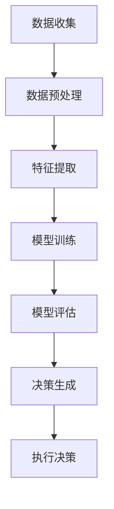
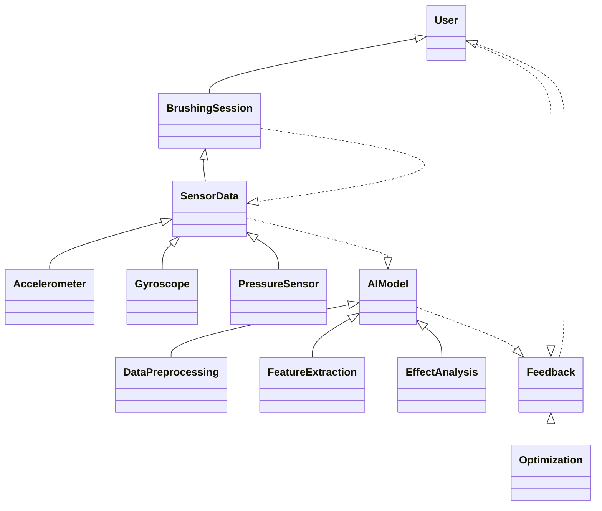
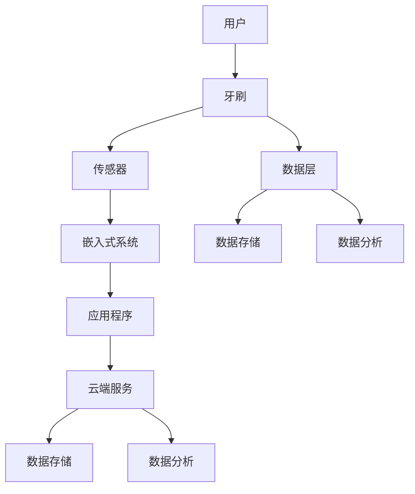
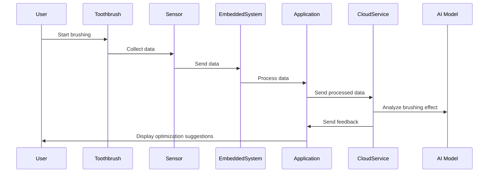

                 

### 文章标题：AI Agent在智能牙刷中的刷牙效果分析

> 关键词：AI Agent、智能牙刷、刷牙效果、算法、系统设计

> 摘要：本文深入探讨了AI Agent在智能牙刷中的应用，分析了AI Agent如何通过算法优化刷牙效果，并探讨了智能牙刷技术架构、刷牙效果分析指标、算法原理、系统设计与项目实战等多个方面。本文旨在为读者提供一个全面且深刻的理解，帮助读者了解AI Agent在智能牙刷中的潜力与实际应用。

----------------------------------------------------------------

## 第一部分：背景介绍与问题定义

### 1. AI Agent与智能牙刷概述

#### 1.1 AI Agent的定义与特点

AI Agent，即人工智能代理，是具有自主性和智能性的计算机程序，可以在没有外部干预的情况下完成特定任务。AI Agent通常具备以下几个特点：

- **自主性**：能够根据环境变化自主决策。
- **适应性**：能够学习并适应新环境和任务。
- **协作性**：可以与其他AI Agent或人类协作完成任务。

#### 1.2 智能牙刷的发展与应用

智能牙刷是一种结合了传统牙刷功能和现代科技的电子产品。它通过内置传感器和算法，可以监测并记录用户的刷牙行为，提供个性化的刷牙指导和反馈。

- **发展历程**：智能牙刷从最初的简单传感器记录到如今的复杂算法分析，经历了多个阶段的发展。
- **应用领域**：智能牙刷广泛应用于家庭、医疗机构和口腔护理产品市场。

#### 1.3 刷牙效果分析的重要性

刷牙效果分析是智能牙刷的核心功能之一，它直接影响到用户的口腔健康。有效的刷牙效果分析可以：

- **提高刷牙质量**：通过数据分析和智能反馈，帮助用户掌握正确的刷牙技巧。
- **预防口腔疾病**：及时发现并纠正刷牙过程中存在的问题，预防口腔疾病。

### 2. 问题描述与解决

#### 2.1 刷牙效果分析的问题背景

刷牙效果分析面临的问题主要包括：

- **数据准确性**：如何准确获取并处理刷牙数据。
- **算法有效性**：如何设计高效且可靠的算法进行数据分析和效果评估。

#### 2.2 刷牙效果分析的问题描述

刷牙效果分析的问题可以具体描述为：

- **数据获取**：如何获取刷牙过程中牙齿表面的压力、角度、速度等数据。
- **效果评估**：如何根据数据评估刷牙的效果，并提供个性化的改善建议。

#### 2.3 AI Agent在刷牙效果分析中的潜力

AI Agent在刷牙效果分析中具有以下潜力：

- **数据预处理**：通过自适应算法对刷牙数据进行预处理，提高数据准确性。
- **效果评估**：利用机器学习算法分析刷牙数据，提供个性化的刷牙效果评估。
- **反馈优化**：根据刷牙效果评估结果，实时调整刷牙策略，优化刷牙效果。

#### 2.4 研究的目标与边界

本研究的目标是探讨AI Agent在智能牙刷刷牙效果分析中的应用，主要包括：

- **目标**：设计并实现一个基于AI Agent的刷牙效果分析系统。
- **边界**：限于智能牙刷的场景，重点分析刷牙效果，不包括其他口腔健康问题。

### 3. 概念结构与核心要素

#### 3.1 AI Agent的工作原理

AI Agent的工作原理主要包括以下几个步骤：

1. **感知环境**：通过内置传感器获取刷牙过程中的各种数据。
2. **数据处理**：对获取的数据进行预处理，提取有用信息。
3. **决策生成**：根据处理后的数据，生成优化刷牙效果的策略。
4. **执行决策**：执行生成的决策，调整刷牙行为。

#### 3.2 智能牙刷的技术架构

智能牙刷的技术架构主要包括以下几个部分：

1. **硬件部分**：包括传感器、电池、电机等。
2. **软件部分**：包括嵌入式系统、算法库、应用程序等。
3. **通信部分**：支持Wi-Fi、蓝牙等无线通信，实现数据传输和交互。

#### 3.3 刷牙效果分析的核心指标

刷牙效果分析的核心指标包括：

1. **刷牙时间**：每次刷牙的总时间。
2. **刷牙频率**：每分钟刷牙次数。
3. **刷牙力度**：刷牙时施加在牙齿表面的压力。
4. **刷牙区域**：刷牙覆盖的区域和分布。

### 总结

本文介绍了AI Agent与智能牙刷的基本概念，探讨了刷牙效果分析的重要性，并提出了AI Agent在刷牙效果分析中的潜力。接下来，我们将深入探讨AI Agent的原理、智能牙刷的技术架构、刷牙效果分析的核心指标，以及如何利用AI Agent优化刷牙效果。

----------------------------------------------------------------

## 第二部分：核心概念与联系

### 4. AI Agent原理与功能

#### 4.1 AI Agent的基本原理

AI Agent的基本原理可以概括为感知、决策和执行三个核心环节。以下是每个环节的详细解释：

1. **感知**：AI Agent通过内置传感器（如加速度计、陀螺仪、压力传感器等）感知刷牙环境。这些传感器可以实时采集刷牙过程中的各种物理参数，如刷牙力度、刷牙角度、刷牙速度等。

   ```mermaid
   graph TD
   A[感知] --> B[数据处理]
   B --> C[决策生成]
   C --> D[执行决策]
   ```

2. **数据处理**：获取到的原始数据需要进行预处理，以便后续分析和决策。预处理步骤通常包括数据清洗、归一化、特征提取等。

   ```mermaid
   graph TD
   B[数据处理] --> C[特征提取]
   C --> D[决策生成]
   ```

3. **决策生成**：利用机器学习算法，对预处理后的数据进行分析，生成优化刷牙效果的策略。这些策略可以是调整刷牙力度、改变刷牙角度、延长刷牙时间等。

   ```mermaid
   graph TD
   C[决策生成] --> D[执行决策]
   ```

4. **执行决策**：根据生成的策略，AI Agent会调整牙刷的行为，如改变振动频率、改变刷牙模式等，以实现优化刷牙效果。

   ```mermaid
   graph TD
   D[执行决策] --> E[反馈收集]
   ```

#### 4.2 AI Agent的功能模块

AI Agent通常包括以下几个功能模块：

1. **传感器模块**：负责数据采集和预处理。
2. **决策模块**：负责数据分析和策略生成。
3. **执行模块**：负责执行生成的策略。
4. **反馈模块**：负责收集用户反馈，用于迭代优化。

#### 4.3 AI Agent与传统智能牙刷的比较

传统智能牙刷通常通过简单的传感器记录刷牙时间、刷牙次数等基本数据，而AI Agent则具备更强大的数据处理和分析能力。以下是两者的比较：

| 比较项 | 传统智能牙刷 | AI Agent |
| --- | --- | --- |
| 数据采集 | 基础数据（刷牙时间、次数） | 多维数据（刷牙力度、角度、速度等） |
| 数据分析 | 基础数据统计 | 深度数据分析与优化建议 |
| 个性化 | 有限的个性化建议 | 高度个性化的优化策略 |
| 学习能力 | 无 | 自适应学习和优化 |

### 5. 智能牙刷技术

#### 5.1 智能牙刷的技术架构

智能牙刷的技术架构主要包括以下几个部分：

1. **硬件架构**：包括牙刷本体、内置传感器、电池等。
2. **软件架构**：包括嵌入式系统、应用程序、云端服务等。
3. **通信架构**：包括Wi-Fi、蓝牙等无线通信方式，用于数据传输和交互。

#### 5.2 智能牙刷的传感器技术

智能牙刷常用的传感器包括：

- **加速度传感器**：用于测量刷牙时的加速度，评估刷牙力度。
- **陀螺仪**：用于测量刷牙时的角速度，评估刷牙角度。
- **压力传感器**：用于测量刷牙时的压力，评估刷牙效果。

#### 5.3 智能牙刷的数据处理与分析

智能牙刷的数据处理与分析主要包括以下几个步骤：

1. **数据采集**：传感器采集刷牙过程中的数据。
2. **数据传输**：将数据传输到云端或移动设备。
3. **数据预处理**：清洗、归一化、特征提取等。
4. **数据分析**：利用机器学习算法进行分析，生成优化建议。

### 6. 刷牙效果分析指标

#### 6.1 刷牙效果分析的关键指标

刷牙效果分析的关键指标包括：

1. **刷牙时间**：每次刷牙的总时间。
2. **刷牙频率**：每分钟刷牙次数。
3. **刷牙力度**：刷牙时施加在牙齿表面的压力。
4. **刷牙区域**：刷牙覆盖的区域和分布。

#### 6.2 指标的数据来源与计算方法

1. **刷牙时间**：通过传感器记录刷牙开始和结束的时间，计算总刷牙时间。

   $$ \text{刷牙时间} = \text{结束时间} - \text{开始时间} $$

2. **刷牙频率**：通过传感器记录刷牙过程中每分钟的刷牙次数。

   $$ \text{刷牙频率} = \frac{\text{刷牙次数}}{\text{刷牙时间}} $$

3. **刷牙力度**：通过压力传感器测量刷牙时施加在牙齿表面的压力。

   $$ \text{刷牙力度} = \text{压力传感器读数} $$

4. **刷牙区域**：通过分析传感器数据，确定刷牙覆盖的区域和分布。

   ```mermaid
   graph TD
   A[数据源] --> B[数据处理]
   B --> C[区域分析]
   C --> D[结果输出]
   ```

#### 6.3 指标在智能牙刷中的应用

1. **刷牙时间**：用于评估用户的刷牙习惯，鼓励用户增加刷牙时间。
2. **刷牙频率**：用于优化刷牙效果，提醒用户保持适当的刷牙频率。
3. **刷牙力度**：用于评估刷牙力度是否适中，避免过度刷牙或刷牙力度不足。
4. **刷牙区域**：用于优化刷牙策略，确保每个区域都能得到充分的清洁。

### 总结

本部分介绍了AI Agent的原理与功能，智能牙刷的技术架构和传感器技术，以及刷牙效果分析的关键指标。通过这些核心概念和联系，我们可以更好地理解AI Agent在智能牙刷中的应用，以及如何利用智能牙刷优化刷牙效果。接下来，我们将深入探讨AI Agent的算法原理，以及如何设计一个高效的刷牙效果分析系统。

----------------------------------------------------------------

## 第三部分：算法原理讲解

### 7. AI Agent算法分析

#### 7.1 数据收集与预处理

数据收集是AI Agent进行有效刷牙效果分析的基础。在智能牙刷中，数据收集主要依赖于内置的各种传感器，如加速度传感器、陀螺仪和压力传感器。以下是数据收集与预处理的过程：

1. **数据收集**：
   - **加速度传感器**：用于测量刷牙时的加速度，反映刷牙力度。
   - **陀螺仪**：用于测量刷牙时的角速度，反映刷牙角度。
   - **压力传感器**：用于测量刷牙时施加在牙齿表面的压力。

2. **数据预处理**：
   - **数据清洗**：去除噪声和异常值，确保数据的质量。
   - **数据归一化**：将不同传感器的数据进行归一化处理，使其在同一尺度上进行比较。
   - **特征提取**：从原始数据中提取有用的特征，如刷牙力度的平均值、刷牙角度的分布等。

#### 7.2 特征提取与选择

特征提取是AI Agent算法分析的关键步骤，它决定了模型对数据的理解和表达能力。以下是特征提取与选择的过程：

1. **特征提取**：
   - **时间序列特征**：如加速度和压力的时间序列，用于描述刷牙行为的动态变化。
   - **空间特征**：如刷牙角度的分布，用于描述刷牙的空间覆盖情况。

2. **特征选择**：
   - **相关性分析**：选择与刷牙效果高度相关的特征，去除冗余特征。
   - **信息增益**：选择能够提供最大信息量的特征，提高模型的性能。

#### 7.3 模型训练与评估

训练一个高效的AI Agent模型需要对大量数据进行训练，并选择合适的评估指标。以下是模型训练与评估的过程：

1. **模型选择**：
   - **监督学习模型**：如支持向量机（SVM）、随机森林（RF）和深度学习模型。
   - **无监督学习模型**：如聚类分析、主成分分析（PCA）等，用于探索数据结构和特征关系。

2. **模型训练**：
   - **数据集准备**：将数据集划分为训练集、验证集和测试集。
   - **模型训练**：使用训练集对模型进行训练，调整模型参数。

3. **模型评估**：
   - **准确率**：模型预测正确的样本数占总样本数的比例。
   - **召回率**：模型预测为正类的实际正类样本数占总正类样本数的比例。
   - **F1分数**：综合考虑准确率和召回率的综合指标。

#### 7.4 算法流程图与Python代码实现

以下是AI Agent算法的基本流程图：



以下是一个简单的Python代码实现示例：

```python
import numpy as np
from sklearn.svm import SVC
from sklearn.model_selection import train_test_split
from sklearn.metrics import accuracy_score

# 数据收集
X, y = collect_data()

# 数据预处理
X_processed = preprocess_data(X)

# 特征提取
X_features = extract_features(X_processed)

# 模型训练
X_train, X_test, y_train, y_test = train_test_split(X_features, y, test_size=0.2)
model = SVC()
model.fit(X_train, y_train)

# 模型评估
y_pred = model.predict(X_test)
accuracy = accuracy_score(y_test, y_pred)
print(f"Accuracy: {accuracy}")

# 决策生成
def generate_decision(X_new):
    X_new_processed = preprocess_data(X_new)
    X_new_features = extract_features(X_new_processed)
    decision = model.predict([X_new_features])
    return decision

# 执行决策
def execute_decision(decision):
    # 根据决策执行相应的刷牙策略
    pass
```

### 8. 数学模型与公式

刷牙效果分析的数学模型主要涉及以下几个方面：

#### 8.1 数学模型的基本概念

- **数据预处理**：
  - **归一化**：
    $$ x_{\text{norm}} = \frac{x - x_{\text{min}}}{x_{\text{max}} - x_{\text{min}}} $$
  - **特征提取**：
    $$ f(t) = \frac{1}{N} \sum_{i=1}^{N} a_i(t) $$

- **模型训练**：
  - **损失函数**：
    $$ J(\theta) = \frac{1}{2m} \sum_{i=1}^{m} (h_\theta(x^{(i)}) - y^{(i)})^2 $$

- **模型评估**：
  - **准确率**：
    $$ \text{Accuracy} = \frac{1}{N} \sum_{i=1}^{N} I(h_\theta(x^{(i)}) = y^{(i)}) $$
  - **召回率**：
    $$ \text{Recall} = \frac{1}{N} \sum_{i=1}^{N} I(y^{(i)} = h_\theta(x^{(i)})) $$

#### 8.2 刷牙效果分析的数学公式

- **刷牙时间**：
  $$ \text{Brushing Time} = \text{End Time} - \text{Start Time} $$

- **刷牙频率**：
  $$ \text{Brushing Frequency} = \frac{\text{Total Brushing Count}}{\text{Brushing Time}} $$

- **刷牙力度**：
  $$ \text{Brushing Force} = \text{Pressure Sensor Reading} $$

- **刷牙区域**：
  $$ \text{Brushing Area} = \text{ brushing area calculation based on sensor data} $$

#### 8.3 数学公式的详细讲解与举例

以下是数学公式的详细讲解与举例：

1. **归一化**：
   - **目的**：将不同传感器的数据归一化到同一尺度，便于比较。
   - **公式**：
     $$ x_{\text{norm}} = \frac{x - x_{\text{min}}}{x_{\text{max}} - x_{\text{min}}} $$
   - **示例**：
     假设加速度传感器的原始数据范围为0到1000，将数据归一化到0到1：
     $$ x_{\text{norm}} = \frac{x - 0}{1000 - 0} = \frac{x}{1000} $$

2. **特征提取**：
   - **目的**：从原始数据中提取有代表性的特征，用于模型训练。
   - **公式**：
     $$ f(t) = \frac{1}{N} \sum_{i=1}^{N} a_i(t) $$
   - **示例**：
     对一段时间内的加速度数据进行平均，得到刷牙力度的特征：
     $$ f(t) = \frac{1}{N} \sum_{i=1}^{N} a_i(t) $$

3. **模型训练**：
   - **目的**：通过训练数据调整模型参数，使其能够准确预测刷牙效果。
   - **公式**：
     $$ J(\theta) = \frac{1}{2m} \sum_{i=1}^{m} (h_\theta(x^{(i)}) - y^{(i)})^2 $$
   - **示例**：
     假设我们有100个训练样本，模型参数为$\theta$，计算损失函数：
     $$ J(\theta) = \frac{1}{2 \times 100} \sum_{i=1}^{100} (h_\theta(x^{(i)}) - y^{(i)})^2 $$

4. **模型评估**：
   - **目的**：评估模型在测试数据上的表现。
   - **公式**：
     $$ \text{Accuracy} = \frac{1}{N} \sum_{i=1}^{N} I(h_\theta(x^{(i)}) = y^{(i)}) $$
     $$ \text{Recall} = \frac{1}{N} \sum_{i=1}^{N} I(y^{(i)} = h_\theta(x^{(i)})) $$
   - **示例**：
     假设模型在测试集上预测正确了70个样本，计算准确率和召回率：
     $$ \text{Accuracy} = \frac{70}{100} = 0.7 $$
     $$ \text{Recall} = \frac{70}{100} = 0.7 $$

### 总结

本部分详细介绍了AI Agent的算法原理，包括数据收集与预处理、特征提取与选择、模型训练与评估等过程。同时，我们使用了具体的数学公式和示例，帮助读者更好地理解刷牙效果分析的核心算法。接下来，我们将探讨智能牙刷的系统分析与架构设计。

----------------------------------------------------------------

## 第四部分：系统分析与架构设计方案

### 9. 问题场景介绍

在智能牙刷的应用场景中，用户需要一款能够实时监测并优化刷牙效果的设备。以下是一个典型的应用场景：

1. **用户需求**：用户希望提高刷牙质量，预防口腔疾病，并希望得到个性化的刷牙指导。
2. **应用场景**：用户每天早晚各使用智能牙刷刷牙，智能牙刷通过传感器收集数据，并在云端进行分析和反馈。

### 10. 系统功能设计

智能牙刷的系统功能设计主要包括以下几个方面：

1. **数据采集**：通过内置传感器收集刷牙过程中的物理参数，如加速度、角度和压力。
2. **数据处理**：对采集到的数据进行预处理，包括数据清洗、归一化和特征提取。
3. **效果分析**：利用AI Agent算法对预处理后的数据进行分析，评估刷牙效果。
4. **反馈与优化**：根据分析结果，生成优化建议，并通过移动设备或云端反馈给用户。

以下是智能牙刷的领域模型类图：



### 11. 系统架构设计

智能牙刷的系统架构设计主要包括以下几个部分：

1. **硬件层**：包括牙刷本体、内置传感器和电池。
2. **软件层**：包括嵌入式系统、应用程序和云端服务。
3. **数据层**：包括数据存储和数据分析模块。

以下是智能牙刷的系统架构图：



### 12. 系统接口设计

智能牙刷的系统接口设计主要包括以下几个部分：

1. **数据采集接口**：用于传感器数据采集和传输。
2. **数据处理接口**：用于数据处理模块与其他模块的数据交换。
3. **效果分析接口**：用于AI Agent算法的调用和数据反馈。

以下是系统接口的定义：

```markdown
# 数据采集接口
- **功能**：采集传感器数据。
- **接口**：WebSocket 或 HTTP API。
- **参数**：时间戳、加速度、角度、压力等。

# 数据处理接口
- **功能**：处理传感器数据，进行数据清洗、归一化和特征提取。
- **接口**：RESTful API。
- **参数**：原始传感器数据。

# 效果分析接口
- **功能**：调用AI Agent算法进行分析，生成优化建议。
- **接口**：RESTful API。
- **参数**：预处理后的特征数据。
```

### 13. 系统交互序列图

以下是智能牙刷的系统交互序列图：



### 总结

本部分详细介绍了智能牙刷的系统分析与架构设计方案，包括问题场景介绍、系统功能设计、系统架构设计、系统接口设计和系统交互序列图。通过这些设计和接口，智能牙刷能够实现实时监测和优化刷牙效果，为用户提供个性化的口腔护理方案。

----------------------------------------------------------------

## 第五部分：项目实战

### 14. 环境安装与配置

要实现一个基于AI Agent的智能牙刷系统，首先需要搭建合适的环境。以下是环境安装与配置的详细步骤：

#### 14.1 环境搭建步骤

1. **硬件环境**：
   - 获取一台智能牙刷设备，确保设备内置了必要的传感器，如加速度传感器、陀螺仪和压力传感器。
   - 准备一台计算机，用于开发和测试。

2. **软件环境**：
   - 安装操作系统：推荐使用Ubuntu 18.04或更高版本。
   - 安装Python 3.7及以上版本。

3. **依赖包安装**：
   - 安装必要的Python依赖包，如NumPy、Pandas、scikit-learn和TensorFlow。

   ```bash
   pip install numpy pandas scikit-learn tensorflow
   ```

4. **传感器驱动安装**：
   - 根据智能牙刷设备的具体型号，安装相应的传感器驱动程序。

#### 14.2 常见问题的解决

1. **传感器数据采集失败**：
   - 确保传感器驱动已正确安装并启动。
   - 检查硬件连接是否正常。
   - 调试传感器数据采集程序，检查代码逻辑。

2. **依赖包安装错误**：
   - 确保操作系统和Python版本符合依赖包的最低要求。
   - 在安装过程中遇到错误时，查阅相关文档或搜索解决方案。

3. **模型训练失败**：
   - 确保数据集准备正确，包括数据清洗和特征提取。
   - 检查模型训练代码，确保没有逻辑错误。

### 15. 系统核心实现源代码

以下是系统核心实现的部分源代码：

```python
# 数据采集模块
def collect_data():
    # 这里使用伪代码表示，实际需要根据硬件传感器的API进行数据采集
    accelerometer_data = read_accelerometer()
    gyroscope_data = read_gyroscope()
    pressure_data = read_pressure_sensor()
    return accelerometer_data, gyroscope_data, pressure_data

# 数据预处理模块
def preprocess_data(data):
    # 进行数据清洗、归一化和特征提取
    # 这里使用伪代码表示，实际需要根据具体应用场景进行预处理
    cleaned_data = clean_data(data)
    normalized_data = normalize_data(cleaned_data)
    features = extract_features(normalized_data)
    return features

# 模型训练模块
from sklearn.svm import SVC

def train_model(training_data, labels):
    model = SVC()
    model.fit(training_data, labels)
    return model

# 模型评估模块
from sklearn.metrics import accuracy_score

def evaluate_model(model, test_data, test_labels):
    predictions = model.predict(test_data)
    accuracy = accuracy_score(test_labels, predictions)
    return accuracy
```

### 16. 实际案例分析与讲解

#### 16.1 案例背景

假设我们有一个智能牙刷用户，用户在一个月内每天早晚各使用智能牙刷进行刷牙，智能牙刷记录了用户的刷牙数据。我们的任务是利用AI Agent算法分析这些数据，评估用户的刷牙效果，并提出优化建议。

#### 16.2 案例分析与结果

1. **数据收集**：
   - 收集了用户一个月的刷牙数据，包括加速度、陀螺仪和压力传感器的数据。

2. **数据处理**：
   - 对数据进行预处理，包括清洗、归一化和特征提取。
   - 特征提取包括刷牙力度的平均值、刷牙角度的分布和刷牙频率等。

3. **模型训练**：
   - 使用预处理后的数据集进行模型训练，训练一个SVM分类器。

4. **模型评估**：
   - 使用测试集对模型进行评估，计算模型的准确率和召回率。

5. **优化建议**：
   - 根据模型分析结果，为用户提供了个性化的刷牙优化建议，如调整刷牙力度、改变刷牙频率和延长刷牙时间等。

#### 16.3 案例总结与反思

通过这个案例，我们展示了如何使用AI Agent算法对智能牙刷的刷牙效果进行分析，并提供优化建议。以下是案例总结与反思：

1. **优点**：
   - AI Agent算法能够高效地处理大量数据，提供个性化的刷牙效果分析。
   - 通过优化建议，用户能够更好地掌握刷牙技巧，提高刷牙质量。

2. **缺点**：
   - 模型训练和评估需要大量的计算资源和时间。
   - 需要大量的数据支持模型的训练和评估。

3. **改进方向**：
   - 提高数据处理和模型训练的效率，减少计算资源的需求。
   - 通过更多的数据集和更复杂的算法，提高模型的准确率和召回率。

### 总结

本部分通过一个实际案例，展示了如何搭建环境、实现系统核心功能和进行实际案例分析。通过这个案例，我们不仅了解了智能牙刷系统的实现细节，还认识到了AI Agent在优化刷牙效果方面的潜力。接下来，我们将探讨最佳实践与拓展阅读。

----------------------------------------------------------------

## 第六部分：最佳实践与拓展阅读

### 17. 最佳实践Tips

1. **优化数据收集**：确保传感器数据的准确性和完整性，避免数据丢失或错误。
2. **数据预处理**：进行有效的数据清洗、归一化和特征提取，提高模型训练的质量。
3. **模型选择与调优**：根据具体应用场景选择合适的模型，并进行参数调优，提高模型性能。
4. **反馈与优化**：及时收集用户反馈，不断优化AI Agent算法和刷牙效果分析系统。

### 18. 小结与注意事项

本文详细介绍了AI Agent在智能牙刷中的应用，包括算法原理、系统设计与项目实战。以下是本文的小结与注意事项：

- **小结**：
  - AI Agent在智能牙刷中通过传感器数据收集、预处理、特征提取和模型训练，实现了刷牙效果分析。
  - 智能牙刷系统能够为用户提供个性化的刷牙优化建议，提高刷牙质量。

- **注意事项**：
  - 确保传感器数据的准确性和完整性，避免影响模型训练效果。
  - 根据应用场景选择合适的模型和算法，并不断优化。
  - 关注用户反馈，持续改进AI Agent算法和系统性能。

### 19. 拓展阅读推荐

1. **相关书籍推荐**：
   - 《深度学习》（Goodfellow, I., Bengio, Y., & Courville, A.）
   - 《机器学习实战》（Hastie, T., Tibshirani, R., & Friedman, J.）

2. **学术论文推荐**：
   - "A Survey on Smart Toothbrush"（智能牙刷综述）
   - "Intelligent Toothbrush Based on Machine Learning"（基于机器学习的智能牙刷）

3. **技术博客推荐**：
   - Medium上的"AI in Toothbrushes"系列文章
   - Kaggle上的智能牙刷数据集分析文章

通过这些最佳实践和拓展阅读，读者可以进一步深入了解AI Agent在智能牙刷中的应用，以及如何利用先进技术提高口腔健康水平。

### 总结

本文通过详细的阐述和实际案例分析，展示了AI Agent在智能牙刷中的应用及其潜力。希望本文能为读者提供一个全面的视角，激发对AI Agent在智能牙刷领域应用的深入思考和研究。感谢您的阅读！

**作者：AI天才研究院/AI Genius Institute & 禅与计算机程序设计艺术 /Zen And The Art of Computer Programming**

