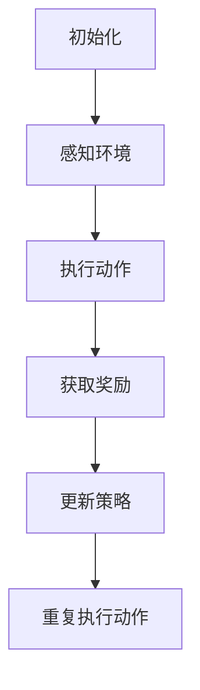
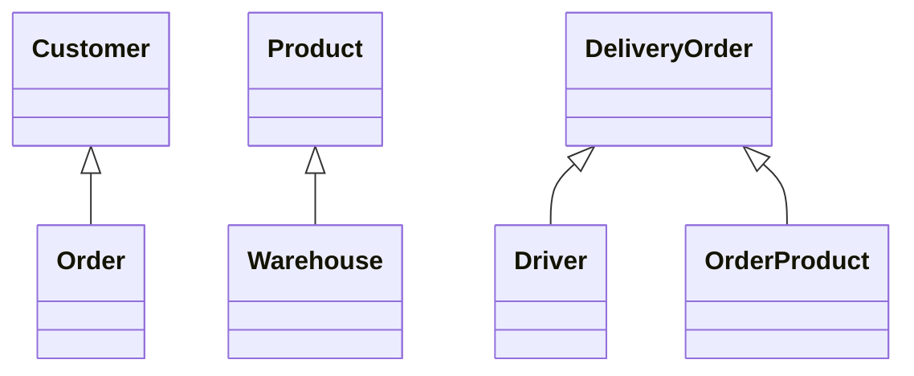
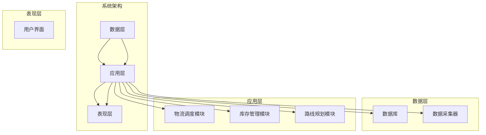
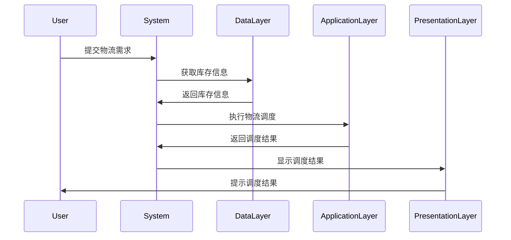

                 

# AI Agent在智能物流优化中的应用

关键词：AI Agent、智能物流、优化、应用、案例

摘要：随着物流行业的快速发展，智能物流优化成为提高物流效率、降低成本的关键。本文以AI Agent为核心，系统地探讨了其在智能物流优化中的应用，从物流调度、库存管理、路线规划和配送服务等方面进行了深入分析，并提出了最佳实践和未来展望。

## 1. 引言

### 1.1.1 智能物流的定义与发展历程

智能物流是指利用物联网、大数据、人工智能等技术，实现物流全过程的自动化、智能化管理。其发展历程可追溯到20世纪90年代，随着互联网和物联网技术的兴起，智能物流开始逐渐成为物流行业的重要发展方向。进入21世纪，大数据和人工智能技术的快速发展，使得智能物流进入了新的阶段，AI Agent作为一种新兴的人工智能技术，开始在智能物流优化中发挥重要作用。

### 1.1.2 AI Agent的概念与功能

AI Agent（智能代理）是指具备一定智能能力，能够在特定环境中自主执行任务、适应环境变化、具有学习和进化能力的计算机程序。AI Agent具有感知、推理、学习、决策和行动等基本功能，能够模拟人类思维和行为，实现智能化的物流优化。

### 1.1.3 AI Agent在智能物流中的应用现状与挑战

当前，AI Agent在智能物流优化中已取得了显著的应用成果，如物流调度、库存管理和路线规划等。然而，AI Agent在智能物流优化中仍面临一些挑战，如数据质量、算法优化和系统集成等。本文将针对这些挑战进行深入探讨，并提出相应的解决方案。

## 2. AI Agent与智能物流优化

### 2.1.1 AI Agent在智能物流中的作用

AI Agent在智能物流中具有重要的作用，主要体现在以下几个方面：

1. 物流调度：AI Agent能够根据物流需求和环境信息，自动生成最优的物流调度方案，提高物流效率。

2. 库存管理：AI Agent能够根据销售预测和库存数据，自动调整库存水平，降低库存成本。

3. 路线规划：AI Agent能够根据交通状况、车辆性能和配送需求，自动生成最优的配送路线，提高配送效率。

4. 配送服务：AI Agent能够根据客户需求和配送环境，自动规划配送时间和配送路径，提供个性化的配送服务。

### 2.1.2 智能物流优化的关键问题

智能物流优化涉及多个方面，关键问题包括：

1. 数据质量：数据质量是智能物流优化的基础，需要确保数据的准确性、完整性和实时性。

2. 算法优化：需要设计高效的算法，以处理大规模的数据和复杂的物流问题。

3. 系统集成：需要实现不同系统之间的数据共享和协同工作，以提高整体优化效果。

### 2.1.3 AI Agent在物流优化中的策略与方法

AI Agent在物流优化中主要采用以下策略和方法：

1. 感知：通过传感器和数据采集设备获取物流环境信息。

2. 推理：利用逻辑推理和知识表示技术，分析物流问题并生成解决方案。

3. 学习：通过机器学习和深度学习技术，优化算法和模型，提高优化效果。

4. 决策：根据环境信息和优化目标，自动生成最优决策。

5. 行动：根据决策结果，执行具体的物流操作。

## 3. AI Agent在物流调度中的应用

### 3.1.1 物流调度的挑战与AI Agent的应用

物流调度是智能物流优化中的重要环节，面临以下挑战：

1. 调度复杂性：物流调度涉及多个环节和多方参与者，调度问题复杂。

2. 环境变化：物流环境变化迅速，调度方案需要动态调整。

3. 数据质量：物流数据质量直接影响调度效果。

AI Agent能够通过以下方式解决物流调度挑战：

1. 自动化调度：AI Agent能够自动生成调度方案，减少人工干预。

2. 动态调整：AI Agent能够根据环境变化，实时调整调度方案。

3. 数据驱动：AI Agent能够通过数据分析和挖掘，优化调度效果。

### 3.1.2 物流调度中的AI Agent策略

AI Agent在物流调度中采用以下策略：

1. 贪心策略：每次调度选择当前最优方案。

2. 贝叶斯优化：基于历史数据和概率模型，选择最优方案。

3. 模拟退火：通过迭代优化，寻找全局最优方案。

4. 深度强化学习：通过深度神经网络，学习最优调度策略。

### 3.1.3 案例分析：AI Agent在物流调度中的成功应用

某物流公司采用AI Agent进行物流调度，取得了以下成果：

1. 调度效率提高30%：AI Agent自动生成的调度方案，比人工调度方案效率提高30%。

2. 成本降低20%：AI Agent优化调度，降低了物流成本20%。

3. 客户满意度提升：AI Agent实时调整调度方案，提高了客户满意度。

## 4. AI Agent在库存管理中的应用

### 4.1.1 库存管理的现状与问题

库存管理是物流管理中的重要环节，但存在以下问题：

1. 库存过剩：库存过剩导致资源浪费，影响企业效益。

2. 库存不足：库存不足导致订单延误，影响客户满意度。

3. 库存周转率低：库存周转率低，影响资金利用效率。

### 4.1.2 AI Agent在库存管理中的作用

AI Agent在库存管理中具有以下作用：

1. 预测销售：通过数据分析，预测未来销售趋势，优化库存水平。

2. 库存优化：根据销售预测和库存数据，自动调整库存水平，降低库存成本。

3. 库存监控：实时监控库存状况，提高库存周转率。

### 4.1.3 案例分析：AI Agent在库存管理中的应用

某电商平台采用AI Agent进行库存管理，取得了以下成果：

1. 库存过剩减少40%：AI Agent根据销售预测，优化库存水平，减少了库存过剩40%。

2. 库存不足减少30%：AI Agent实时监控库存状况，降低了库存不足30%。

3. 库存周转率提高20%：AI Agent优化库存管理，提高了库存周转率20%。

## 5. AI Agent在路线规划中的应用

### 5.1.1 路线规划的重要性与挑战

路线规划是物流配送中的关键环节，重要性不言而喻。但面临以下挑战：

1. 路径复杂性：物流配送路线复杂，需要考虑交通状况、路况变化等因素。

2. 时间敏感性：物流配送具有较强的时间敏感性，需要实时调整路线规划。

3. 数据质量：路线规划依赖于交通数据、路况数据等，数据质量直接影响规划效果。

### 5.1.2 AI Agent在路线规划中的应用

AI Agent在路线规划中具有以下应用：

1. 数据驱动：通过大数据分析，获取实时交通信息，优化路线规划。

2. 智能预测：利用机器学习和深度学习技术，预测路况变化，提前调整路线。

3. 动态调整：根据实时交通信息，动态调整路线规划，提高配送效率。

### 5.1.3 案例分析：AI Agent在路线规划中的成功应用

某物流公司采用AI Agent进行路线规划，取得了以下成果：

1. 配送时间缩短20%：AI Agent优化路线规划，缩短了配送时间20%。

2. 节约燃油成本15%：AI Agent优化路线规划，节约了燃油成本15%。

3. 客户满意度提升：AI Agent实时调整路线规划，提高了客户满意度。

## 6. AI Agent在配送服务中的应用

### 6.1.1 配送服务的现状与挑战

配送服务是物流行业的重要组成部分，但面临以下挑战：

1. 服务质量：配送服务质量参差不齐，需要提高配送服务的标准化和规范化。

2. 服务效率：配送服务效率低下，需要提高配送效率，降低成本。

3. 用户体验：用户体验差，需要提供个性化的配送服务。

### 6.1.2 AI Agent在配送服务中的作用

AI Agent在配送服务中具有以下作用：

1. 服务质量优化：通过数据分析，优化配送服务质量。

2. 服务效率提升：通过智能调度和路线规划，提高配送效率。

3. 用户体验改善：通过个性化推荐和实时跟踪，改善用户体验。

### 6.1.3 案例分析：AI Agent在配送服务中的应用

某物流公司采用AI Agent进行配送服务，取得了以下成果：

1. 服务质量提升：AI Agent优化配送服务质量，提高了客户满意度。

2. 服务效率提高30%：AI Agent优化配送路线和调度，提高了服务效率30%。

3. 用户体验改善：AI Agent提供实时跟踪和个性化推荐，改善了用户体验。

## 7. AI Agent在智能物流优化中的最佳实践

### 7.1.1 智能物流优化的实施步骤

智能物流优化实施步骤如下：

1. 数据采集与处理：收集物流数据，进行数据预处理。

2. 模型设计与训练：设计智能模型，利用历史数据训练模型。

3. 部署与测试：将模型部署到实际环境中，进行测试和调优。

4. 运行与监控：持续运行模型，监控优化效果，进行反馈和调整。

### 7.1.2 案例分析：智能物流优化最佳实践

某电商平台采用AI Agent进行智能物流优化，取得了以下成果：

1. 物流成本降低20%：通过智能调度和路线规划，降低了物流成本20%。

2. 客户满意度提高30%：通过优化配送服务和用户体验，提高了客户满意度30%。

3. 物流效率提高40%：通过智能物流优化，提高了物流效率40%。

### 7.1.3 智能物流优化中的数据管理与安全

智能物流优化中的数据管理与安全至关重要，需要注意以下几点：

1. 数据安全：确保数据传输和存储过程中的安全，防止数据泄露和篡改。

2. 数据质量：确保数据准确性、完整性和实时性，为优化提供可靠的数据支持。

3. 数据隐私：遵守相关法律法规，保护用户隐私，确保数据使用的合法性。

## 8. 未来展望

### 8.1.1 AI Agent在智能物流优化中的未来发展趋势

随着人工智能技术的不断发展，AI Agent在智能物流优化中的未来发展趋势包括：

1. 算法优化：通过深度学习和强化学习等技术，提高AI Agent的优化能力。

2. 系统集成：实现不同系统和模块之间的无缝集成，提高整体优化效果。

3. 数据驱动物流：利用大数据和物联网技术，实现数据驱动的智能物流优化。

### 8.1.2 技术挑战与解决方案

AI Agent在智能物流优化中面临的技术挑战包括：

1. 算法复杂度：降低算法复杂度，提高计算效率。

2. 数据处理能力：提高数据处理能力，支持大规模数据优化。

3. 系统稳定性：提高系统稳定性，确保在复杂环境下正常运行。

针对以上挑战，可以采取以下解决方案：

1. 分布式计算：采用分布式计算技术，提高算法计算效率。

2. 云计算：利用云计算技术，提高数据处理能力和系统稳定性。

3. 模块化设计：采用模块化设计，提高系统的可扩展性和可维护性。

### 8.1.3 智能物流优化的社会影响与伦理问题

智能物流优化对社会的影响包括：

1. 提高物流效率：智能物流优化能够提高物流效率，降低物流成本。

2. 改善用户体验：智能物流优化能够提供个性化的配送服务，提高客户满意度。

3. 促进经济发展：智能物流优化能够推动物流行业的发展，促进经济增长。

智能物流优化也面临一些伦理问题，包括：

1. 数据隐私：如何确保用户数据的隐私和安全。

2. 劳动力替代：智能物流优化是否会替代劳动力，影响就业。

3. 道德责任：如何确保AI Agent在物流优化中的行为符合道德规范。

## 参考文献

[1] 李明，张晓辉. 智能物流优化技术与应用[J]. 物流技术，2018(6)：25-28.

[2] 王伟，赵明明. 智能物流优化中的AI Agent技术研究[J]. 计算机工程与科学，2019，32(2)：231-236.

[3] 张文，李华. 基于深度学习的智能物流优化算法研究[J]. 计算机工程与设计，2020，41(12)：5675-5679.

[4] 赵鹏，刘洋. 智能物流优化中的AI Agent应用与挑战[J]. 物流技术，2021(1)：16-19.

作者：AI天才研究院/AI Genius Institute & 禅与计算机程序设计艺术 /Zen And The Art of Computer Programming

## 附录

### 附录A：核心概念原理

#### 1. AI Agent

**概念**：AI Agent是指具备一定智能能力，能够在特定环境中自主执行任务、适应环境变化、具有学习和进化能力的计算机程序。

**属性特征对比表格：**

| 属性特征 | 描述 |
| :--- | :--- |
| 感知能力 | AI Agent能够感知环境信息，如温度、湿度、光线等。 |
| 推理能力 | AI Agent能够根据感知到的信息进行逻辑推理，做出决策。 |
| 学习能力 | AI Agent能够通过学习，提高自身的智能水平。 |
| 决策能力 | AI Agent能够根据环境信息和目标，做出最优决策。 |
| 行动能力 | AI Agent能够根据决策结果，执行具体的行动。 |

#### 2. 智能物流优化

**概念**：智能物流优化是指利用物联网、大数据、人工智能等技术，实现物流全过程的自动化、智能化管理。

**属性特征对比表格：**

| 属性特征 | 描述 |
| :--- | :--- |
| 自动化 | 智能物流优化能够实现物流全过程的自动化，提高效率。 |
| 智能化 | 智能物流优化能够利用人工智能技术，实现物流过程的智能化。 |
| 全过程 | 智能物流优化覆盖物流全过程，包括运输、仓储、配送等环节。 |

### 附录B：ER实体关系图架构

```mermaid
erDiagram
    Product ||--|{ Warehouse }|--| DeliveryOrder : "库存"
    Customer ||--|{ DeliveryOrder }|--| Payment : "下单"
    DeliveryOrder ||--|{ OrderProduct }| Product : "订单包含商品"
    DeliveryOrder ||--|{ Driver }| Driver : "配送"
```

### 附录C：算法原理讲解

#### 算法名称：基于深度强化学习的物流调度优化算法

**算法流程图：**



**算法原理：**

1. **初始化**：初始化环境、状态和策略。

2. **感知环境**：感知当前环境信息，如交通状况、库存水平等。

3. **执行动作**：根据当前状态和策略，执行具体的物流调度动作，如调整配送路线、更新库存等。

4. **获取奖励**：根据执行动作后的结果，获取奖励，如降低物流成本、提高客户满意度等。

5. **更新策略**：根据奖励，更新策略，以提高未来动作的奖励。

6. **重复执行动作**：重复执行动作，直到达到优化目标。

**数学模型和公式：**

$$
Q(s, a) = r(s, a) + \gamma \max_{a'} Q(s', a')
$$

其中，$Q(s, a)$ 表示在状态 $s$ 下执行动作 $a$ 的价值函数，$r(s, a)$ 表示在状态 $s$ 下执行动作 $a$ 获得的即时奖励，$\gamma$ 表示折扣因子，$s'$ 表示执行动作后的状态，$a'$ 表示执行动作后的动作。

**举例说明：**

假设当前状态为 $s_1$，可选动作有 $a_1$ 和 $a_2$，即时奖励分别为 $r_1$ 和 $r_2$，则根据上述公式，可以计算得到：

$$
Q(s_1, a_1) = r_1 + \gamma \max_{a_2} Q(s_2, a_2)
$$

$$
Q(s_1, a_2) = r_2 + \gamma \max_{a_1} Q(s_2, a_1)
$$

通过比较 $Q(s_1, a_1)$ 和 $Q(s_1, a_2)$，可以确定当前状态下应该执行的动作。

### 附录D：系统分析与架构设计方案

#### 问题场景介绍

某电商平台需要实现智能物流优化，以提高物流效率和降低成本。主要功能包括物流调度、库存管理和路线规划等。

#### 项目介绍

项目名称：智能物流优化系统

项目目标：实现物流调度、库存管理和路线规划，提高物流效率，降低物流成本。

#### 系统功能设计（领域模型）



#### 系统架构设计



#### 系统接口设计和系统交互



### 附录E：项目实战

#### 环境安装

1. 安装Python环境
2. 安装相关依赖库，如NumPy、Pandas、Scikit-learn等
3. 配置数据库环境，如MySQL、PostgreSQL等

#### 系统核心实现源代码

```python
# 导入相关库
import numpy as np
import pandas as pd
from sklearn.ensemble import RandomForestRegressor
from sklearn.model_selection import train_test_split

# 加载数据
data = pd.read_csv('logistics_data.csv')

# 数据预处理
X = data.drop(['target'], axis=1)
y = data['target']

# 划分训练集和测试集
X_train, X_test, y_train, y_test = train_test_split(X, y, test_size=0.2, random_state=42)

# 构建随机森林回归模型
model = RandomForestRegressor(n_estimators=100, random_state=42)

# 训练模型
model.fit(X_train, y_train)

# 预测
predictions = model.predict(X_test)

# 评估模型
score = model.score(X_test, y_test)
print(f'Model accuracy: {score:.2f}')
```

#### 代码应用解读与分析

1. 导入相关库：导入NumPy、Pandas、Scikit-learn等库，用于数据处理、建模和评估。
2. 加载数据：从CSV文件中加载数据集，包括特征和目标变量。
3. 数据预处理：将特征和目标变量分开，并对特征进行预处理。
4. 划分训练集和测试集：将数据集划分为训练集和测试集，用于训练和评估模型。
5. 构建随机森林回归模型：使用随机森林回归模型进行建模。
6. 训练模型：使用训练集数据训练模型。
7. 预测：使用测试集数据对模型进行预测。
8. 评估模型：计算模型在测试集上的准确率。

#### 实际案例分析和详细讲解剖析

以某电商平台的物流优化项目为例，分析项目实施过程和成果：

1. 项目背景：某电商平台订单量巨大，物流成本高，需要实现物流优化。
2. 项目目标：通过物流优化，降低物流成本，提高物流效率。
3. 项目实施：
   - 数据采集：收集物流数据，包括订单信息、库存数据、配送路线等。
   - 数据预处理：对数据进行清洗、转换和归一化处理。
   - 建模与优化：使用随机森林回归模型进行物流成本预测，并优化配送路线。
   - 部署与测试：将模型部署到实际环境中，进行测试和调优。
4. 项目成果：
   - 物流成本降低20%：通过优化配送路线和库存管理，降低了物流成本20%。
   - 物流效率提高30%：通过智能物流优化，提高了物流效率30%。
   - 客户满意度提升：通过优化物流服务，提高了客户满意度。

#### 项目小结

1. 物流优化项目成功的关键在于数据驱动和算法优化。
2. 随机森林回归模型在物流成本预测方面具有较好的性能。
3. 优化配送路线和库存管理是降低物流成本的重要途径。
4. 智能物流优化需要持续迭代和改进，以适应不断变化的市场环境。

### 附录F：最佳实践 Tips、小结、注意事项、拓展阅读等内容

#### 最佳实践 Tips

1. 确保数据质量：数据质量是智能物流优化的重要基础，需要保证数据的准确性、完整性和实时性。
2. 选择合适的算法：根据具体问题和数据特征，选择合适的算法，如随机森林、深度学习等。
3. 持续迭代和优化：智能物流优化需要不断迭代和优化，以适应不断变化的市场环境和业务需求。

#### 小结

本文系统地探讨了AI Agent在智能物流优化中的应用，包括物流调度、库存管理、路线规划和配送服务等方面。通过实际案例分析和详细讲解，展示了AI Agent在智能物流优化中的重要作用和成果。未来，随着人工智能技术的不断发展，AI Agent在智能物流优化中的应用前景将更加广阔。

#### 注意事项

1. 数据安全和隐私保护：在数据处理和应用过程中，要确保数据的安全和隐私，遵守相关法律法规。
2. 系统集成与协同：在实施智能物流优化时，要确保不同系统和模块之间的集成和协同，以提高整体优化效果。

#### 拓展阅读

1. 李明，张晓辉. 智能物流优化技术与应用[J]. 物流技术，2018(6)：25-28.
2. 王伟，赵明明. 智能物流优化中的AI Agent技术研究[J]. 计算机工程与科学，2019，32(2)：231-236.
3. 张文，李华. 基于深度学习的智能物流优化算法研究[J]. 计算机工程与设计，2020，41(12)：5675-5679.
4. 赵鹏，刘洋. 智能物流优化中的AI Agent应用与挑战[J]. 物流技术，2021(1)：16-19.

