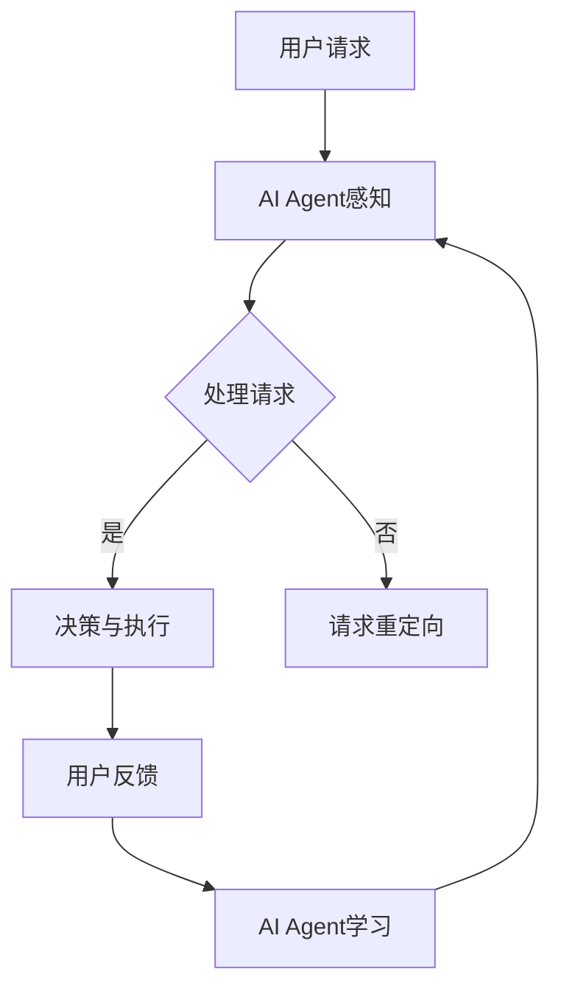
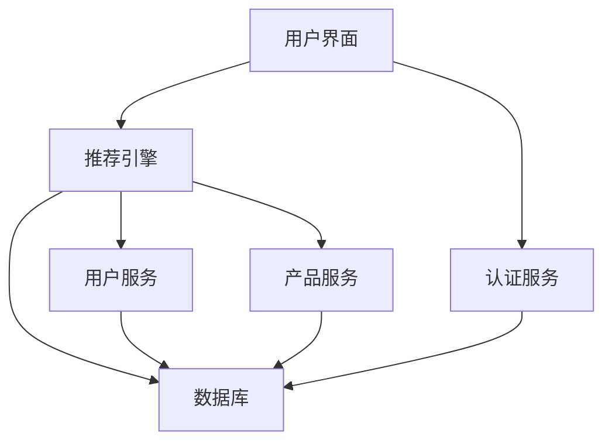
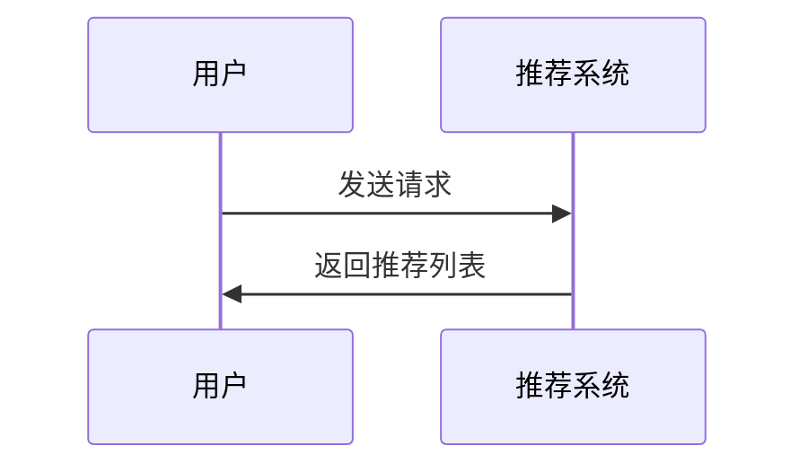

                 

# AI Agent在智能电子商务中的应用

## 关键词

- 智能电子商务
- AI Agent
- 自主智能
- 个性化推荐
- 客户服务
- 安全监控

## 摘要

本文深入探讨了AI Agent在智能电子商务中的应用。首先，介绍了智能电子商务的现状和挑战，以及AI Agent的定义、特点和分类。接着，分析了AI Agent在电子商务中的具体应用场景，如客户服务、个性化推荐和安全监控等。然后，通过具体实例展示了AI Agent在电商领域的成功应用，并对其实际效果进行了评估。最后，探讨了AI Agent在智能电子商务中的开发实践，提供了实用的开发建议和注意事项。

## 目录大纲

----------------------------------------------------------------

# AI Agent在智能电子商务中的应用

## 第1章 引言

## 1.1 问题背景

### 1.1.1 电子商务的现状与挑战

### 1.1.2 AI Agent的应用前景

## 1.2 问题描述

### 1.2.1 电子商务中存在的问题

### 1.2.2 AI Agent如何解决这些问题

## 1.3 问题解决

### 1.3.1 AI Agent的定义与特点

### 1.3.2 AI Agent在电子商务中的应用场景

## 1.4 边界与外延

### 1.4.1 AI Agent的适用范围

### 1.4.2 AI Agent的限制因素

## 1.5 概念结构与核心要素组成

### 1.5.1 AI Agent的核心概念

### 1.5.2 电子商务的核心要素

### 1.5.3 AI Agent与电子商务的关系

## 1.6 本章小结

## 第2章 AI Agent基础理论

## 2.1 AI Agent的定义与分类

## 2.2 AI Agent的核心特征

### 2.2.1 自主性

### 2.2.2 反应性

### 2.2.3 社交性

### 2.2.4 学习能力

## 2.3 AI Agent的工作原理

### 2.3.1 AI Agent的组成结构

### 2.3.2 AI Agent的行为机制

### 2.3.3 AI Agent的交互机制

## 2.4 AI Agent的技术基础

### 2.4.1 机器学习算法

### 2.4.2 自然语言处理

### 2.4.3 强化学习

## 2.5 AI Agent的发展趋势

## 2.6 本章小结

## 第3章 智能电子商务的概念与架构

## 3.1 智能电子商务的定义

### 3.1.1 智能电子商务的概念

### 3.1.2 智能电子商务的特征

## 3.2 智能电子商务的架构

### 3.2.1 系统架构设计

### 3.2.2 数据架构设计

### 3.2.3 技术架构设计

## 3.3 智能电子商务的关键技术

### 3.3.1 大数据技术

### 3.3.2 云计算技术

### 3.3.3 物联网技术

### 3.3.4 人工智能技术

## 3.4 智能电子商务的应用领域

### 3.4.1 电子商务平台

### 3.4.2 供应链管理

### 3.4.3 客户服务

### 3.4.4 营销策略

## 3.5 本章小结

## 第4章 AI Agent在智能电子商务中的应用

## 4.1 AI Agent在智能电子商务中的应用场景

### 4.1.1 客户服务

### 4.1.2 个性化推荐

### 4.1.3 安全监控

### 4.1.4 营销自动化

## 4.2 AI Agent的应用实例

### 4.2.1 智能客服机器人

### 4.2.2 个性化推荐系统

### 4.2.3 电商平台的安全监控

### 4.2.4 营销自动化工具

## 4.3 AI Agent的性能评估

### 4.3.1 性能评估指标

### 4.3.2 评估方法

### 4.3.3 实际应用效果分析

## 4.4 AI Agent在智能电子商务中的挑战与解决方案

### 4.4.1 挑战

### 4.4.2 解决方案

## 4.5 本章小结

## 第5章 AI Agent开发实践

## 5.1 开发环境搭建

### 5.1.1 硬件环境

### 5.1.2 软件环境

### 5.1.3 数据集准备

## 5.2 AI Agent核心功能实现

### 5.2.1 自主性

### 5.2.2 反应性

### 5.2.3 社交性

### 5.2.4 学习能力

## 5.3 AI Agent应用实例

### 5.3.1 智能客服机器人

### 5.3.2 个性化推荐系统

### 5.3.3 电商平台的安全监控

### 5.3.4 营销自动化工具

## 5.4 实际案例分析与讲解

### 5.4.1 案例一：智能客服机器人

### 5.4.2 案例二：个性化推荐系统

### 5.4.3 案例三：电商平台的安全监控

### 5.4.4 案例四：营销自动化工具

## 5.5 项目小结

## 5.6 最佳实践 Tips

## 5.7 小结

## 5.8 注意事项

## 5.9 拓展阅读

----------------------------------------------------------------## 第1章 引言

### 1.1 问题背景

电子商务作为互联网时代的重要产业，已经深入到了人们生活的方方面面。从最初的在线购物，到如今的智能购物、个性化推荐、智能客服等，电子商务在不断地演进和变革。然而，随着电子商务的快速发展，市场中也出现了一些亟待解决的问题。

首先，电子商务市场中的竞争日益激烈，各大电商平台都在寻求提升用户体验、增加销售额的途径。其次，用户需求的多样化和个性化使得传统的营销和客户服务方式难以满足市场需求。此外，网络安全问题也是电子商务领域的一大挑战，如何保障用户数据的安全，防止网络欺诈成为亟待解决的问题。

针对这些问题，人工智能（AI）尤其是AI Agent技术应运而生。AI Agent是一种能够自主决策、执行任务、与人类交互的智能系统，其在智能电子商务中的应用有望解决上述问题，提升电子商务的效率和用户体验。

### 1.1.1 电子商务的现状与挑战

电子商务的现状可以用“繁荣”和“挑战并存”来形容。根据统计，全球电子商务市场规模已经超过了数万亿美元，且这个数字还在持续增长。尤其是在新冠疫情期间，电子商务成为了人们日常生活中不可或缺的一部分。

然而，随着市场的不断壮大，电子商务也面临着一系列挑战。首先是竞争的加剧。无论是传统的电商平台，还是新兴的社交电商、直播电商，都在争夺用户和市场资源。其次，用户需求的多样化和个性化使得电商平台需要提供更加个性化和精准的服务，这无疑增加了运营的复杂性。此外，网络安全问题也是一个不容忽视的挑战。网络欺诈、数据泄露等问题屡见不鲜，严重影响了用户的信任和平台的声誉。

### 1.1.2 AI Agent的应用前景

AI Agent作为一种智能系统，具有自主决策、执行任务和与人类交互的能力。这些特点使得AI Agent在智能电子商务中具有广泛的应用前景。首先，AI Agent可以提供智能客服，通过自然语言处理技术，实现与用户的实时互动，提升客户服务水平。其次，AI Agent可以基于用户的购物行为和偏好，进行个性化推荐，提升用户的购物体验。此外，AI Agent还可以用于安全监控，通过实时分析用户行为，识别潜在风险，保障用户数据的安全。

总的来说，AI Agent在智能电子商务中的应用有望解决现有问题，提升电子商务的效率和服务质量，为电商平台和用户提供更好的体验。

### 1.2 问题描述

在电子商务领域，AI Agent的应用主要集中在以下几个方面：

首先，客户服务。电子商务平台通常面临着海量客服请求，传统的客服方式难以应对。而AI Agent可以提供24/7的智能客服，快速响应用户的问题，提高客服效率。

其次，个性化推荐。用户需求的多样化和个性化使得电商平台需要提供更加精准的推荐服务。AI Agent可以通过分析用户的购物历史和行为，提供个性化的商品推荐，提升用户的购物体验。

再次，安全监控。电子商务平台需要确保用户数据的安全，防止网络欺诈和数据泄露。AI Agent可以通过实时监控用户行为，识别异常行为，提供安全防护。

最后，营销自动化。电商平台需要通过有效的营销策略吸引用户，提升销售额。AI Agent可以帮助平台实现自动化营销，根据用户行为和偏好，自动推送合适的营销信息。

### 1.2.1 AI Agent如何解决这些问题

AI Agent通过以下几个核心功能和特点，能够有效地解决电子商务领域面临的问题：

1. **自主性**：AI Agent可以自主地决策和执行任务，无需人工干预。这大大提高了工作效率，特别是在处理大量客服请求时，AI Agent可以快速响应，提升客户满意度。

2. **反应性**：AI Agent能够实时响应用户的需求，提供即时的服务。无论是解答用户的问题，还是推送个性化推荐，AI Agent都可以快速反应，提升用户体验。

3. **学习能力**：AI Agent可以通过不断的学习和优化，不断提升自身的性能。通过对用户行为的分析，AI Agent可以不断调整推荐策略，提升推荐准确性。

4. **社交性**：AI Agent可以通过自然语言处理技术，实现与用户的实时互动。这不仅可以提升客户服务体验，还可以通过社交互动，增强用户对电商平台的粘性。

### 1.3 问题解决

为了解决电子商务领域的问题，AI Agent被设计为具有以下几个核心特点：

1. **自主性**：AI Agent具备自主决策的能力，可以通过机器学习算法，根据用户行为和偏好，自主地调整推荐策略和客服响应。

2. **反应性**：AI Agent能够实时响应用户的需求，通过自然语言处理技术，快速理解用户的问题，并提供即时的解决方案。

3. **学习能力**：AI Agent具备持续学习的能力，可以通过深度学习算法，不断优化自身的性能，提升推荐准确性和客服效果。

4. **社交性**：AI Agent可以通过社交互动，增强用户对电商平台的粘性，提高用户忠诚度。

AI Agent在电子商务中的应用场景主要包括：

1. **客户服务**：AI Agent可以提供24/7的智能客服，快速响应用户的问题，提高客服效率。

2. **个性化推荐**：AI Agent可以通过分析用户的购物历史和行为，提供个性化的商品推荐，提升用户的购物体验。

3. **安全监控**：AI Agent可以通过实时监控用户行为，识别异常行为，提供安全防护。

4. **营销自动化**：AI Agent可以帮助电商平台实现自动化营销，根据用户行为和偏好，自动推送合适的营销信息。

### 1.4 边界与外延

#### 1.4.1 AI Agent的适用范围

AI Agent在智能电子商务中具有广泛的适用范围，主要包括以下几个方面：

1. **电商平台**：AI Agent可以帮助电商平台提升客户服务水平，提供个性化推荐，提升用户体验。

2. **在线零售**：AI Agent可以帮助在线零售商实现自动化营销，提升销售额。

3. **物流与供应链**：AI Agent可以帮助电商平台优化物流和供应链管理，提高运营效率。

4. **金融科技**：AI Agent可以帮助金融科技公司提升风控能力，保障用户资金安全。

#### 1.4.2 AI Agent的限制因素

尽管AI Agent在智能电子商务中具有巨大潜力，但其应用仍面临一些限制因素：

1. **数据隐私**：AI Agent需要大量用户数据进行训练和决策，如何保障用户数据隐私成为一大挑战。

2. **算法公平性**：AI Agent的决策可能受到算法偏见的影响，如何确保算法的公平性是一个重要问题。

3. **技术实现难度**：AI Agent的开发和部署需要较高的技术门槛，对于一些中小型企业可能存在一定难度。

### 1.5 概念结构与核心要素组成

#### 1.5.1 AI Agent的核心概念

AI Agent是一种具有自主决策、反应和学习能力的智能系统。其核心概念包括：

1. **自主性**：AI Agent能够自主地执行任务，无需人工干预。

2. **反应性**：AI Agent能够实时响应用户的需求和外部环境的变化。

3. **学习能力**：AI Agent能够通过学习和优化，不断提升自身的性能。

4. **社交性**：AI Agent能够与用户进行自然语言交互，增强用户体验。

#### 1.5.2 电子商务的核心要素

电子商务的核心要素包括：

1. **用户**：用户是电子商务的核心，用户的购物行为和偏好是电商平台决策的重要依据。

2. **商品**：商品是电子商务的核心产品，商品的质量和种类直接影响用户的购物体验。

3. **平台**：电商平台是电子商务的核心平台，提供了商品展示、交易、物流等一站式服务。

4. **数据**：数据是电子商务的核心资产，通过数据分析可以优化运营策略，提升用户体验。

#### 1.5.3 AI Agent与电子商务的关系

AI Agent与电子商务的关系可以看作是“智能助手”与“服务平台”的关系。AI Agent作为智能助手，为电子商务平台提供智能化服务，提升用户体验和运营效率。同时，AI Agent通过分析用户数据和商品数据，可以为电子商务平台提供决策支持，优化运营策略。

### 1.6 本章小结

本章介绍了AI Agent在智能电子商务中的应用背景、问题和解决方案。通过分析电子商务的现状和挑战，提出了AI Agent的应用前景和具体应用场景。同时，探讨了AI Agent的核心概念、特点和适用范围，为后续章节的深入探讨奠定了基础。## 第2章 AI Agent基础理论

### 2.1 AI Agent的定义与分类

#### 2.1.1 AI Agent的定义

AI Agent，即人工智能代理，是指一种具备自主决策、执行任务和与人类交互能力的智能系统。它能够根据环境中的信息和自身设定的目标，自主地选择合适的行动方案，并采取相应行动以达成目标。AI Agent的核心特点包括自主性、反应性、学习能力和社交性。

#### 2.1.2 AI Agent的分类

根据AI Agent的功能和特点，可以将其分为以下几类：

1. **反应型Agent**：这种类型的Agent主要依据当前的环境状态做出反应，不涉及过去的经验或未来的预测。它们的行为是即时和直接的。

2. **认知型Agent**：这种类型的Agent不仅能够对当前环境做出反应，还能利用记忆和学习能力，形成对过去经验的利用，并作出更好的决策。

3. **社会型Agent**：这种类型的Agent在完成任务时，需要考虑与人类或其他Agent的交互，能够进行合作、协商和竞争。

4. **移动型Agent**：这种类型的Agent不仅能在虚拟环境中运行，还可以在现实世界中移动，具有物理存在的特性。

5. **混合型Agent**：这种类型的Agent综合了多种类型的特性，能够根据具体任务需求，灵活调整其行为。

### 2.2 AI Agent的核心特征

#### 2.2.1 自主性

自主性是AI Agent最重要的特征之一，它决定了Agent是否能够独立执行任务，而不需要人类干预。自主性体现在以下几个方面：

1. **目标设定**：AI Agent能够根据自身设定的目标，自主地制定任务计划。

2. **决策制定**：AI Agent能够基于环境信息和自身知识库，自主地做出决策。

3. **任务执行**：AI Agent能够根据决策结果，自主地执行任务。

#### 2.2.2 反应性

反应性是指AI Agent能够及时响应用户的请求或环境的变化。一个反应性强的AI Agent能够：

1. **实时交互**：能够实时响应用户的提问或请求。

2. **动态调整**：能够根据环境的变化，动态调整自身的状态和行为。

3. **快速响应**：能够在短时间内完成用户的请求，提高用户体验。

#### 2.2.3 社交性

社交性是指AI Agent能够与其他Agent或人类进行有效的交互和沟通。一个具备社交性的AI Agent能够：

1. **沟通理解**：能够理解和回应人类的语言和情感。

2. **合作协调**：能够与其他Agent或人类进行协作，共同完成任务。

3. **冲突解决**：能够在出现冲突时，通过沟通和协调，找到解决方案。

#### 2.2.4 学习能力

学习能力是指AI Agent能够通过不断地学习和优化，提升自身的性能。一个具备学习能力的AI Agent能够：

1. **经验积累**：能够从历史数据和经验中学习，优化自身的行为。

2. **知识扩展**：能够通过学习新的知识和信息，扩展自身的知识库。

3. **持续改进**：能够不断地进行自我优化，提升任务执行效果。

### 2.3 AI Agent的工作原理

#### 2.3.1 AI Agent的组成结构

AI Agent的组成结构主要包括以下几个部分：

1. **感知器**：感知器是AI Agent的感官，用于接收外部环境的信息。这些信息可以是视觉、听觉、触觉等。

2. **知识库**：知识库是AI Agent的经验和知识的存储，包括事实、规则和模型等。

3. **推理引擎**：推理引擎是AI Agent的“大脑”，负责根据感知器收集到的信息，结合知识库中的知识，进行推理和决策。

4. **执行器**：执行器是AI Agent的行动装置，用于执行推理引擎制定的行动方案。

#### 2.3.2 AI Agent的行为机制

AI Agent的行为机制主要包括以下几个步骤：

1. **感知**：AI Agent通过感知器收集外部环境的信息。

2. **分析**：AI Agent利用知识库中的知识和推理引擎进行分析，确定当前状态。

3. **决策**：AI Agent根据分析结果，制定行动方案。

4. **执行**：AI Agent通过执行器执行行动方案。

5. **反馈**：AI Agent根据执行结果，调整自身状态和行为。

#### 2.3.3 AI Agent的交互机制

AI Agent的交互机制主要包括以下几个方面：

1. **语言交互**：AI Agent通过自然语言处理技术，与人类进行语言交互，理解用户的请求和指令。

2. **图形交互**：AI Agent通过图形用户界面，与用户进行视觉交互，展示信息和结果。

3. **多模态交互**：AI Agent能够同时处理多种模态的信息，如语音、文本、图像等，实现更丰富的交互体验。

4. **多Agent交互**：AI Agent之间可以通过通信协议，进行合作和协调，共同完成任务。

### 2.4 AI Agent的技术基础

AI Agent的技术基础主要包括以下几个方面：

#### 2.4.1 机器学习算法

机器学习算法是AI Agent的核心技术，用于从数据中学习规律和模式，提升任务执行效果。常见的机器学习算法包括：

1. **监督学习**：通过已标记的数据进行训练，学习输入和输出之间的关系。

2. **无监督学习**：通过未标记的数据进行训练，发现数据中的隐含结构和模式。

3. **强化学习**：通过试错和奖励机制，学习最优策略。

#### 2.4.2 自然语言处理

自然语言处理是AI Agent实现语言交互的关键技术，用于理解和生成自然语言。自然语言处理的主要任务包括：

1. **文本分类**：对文本进行分类，如情感分析、主题分类等。

2. **信息抽取**：从文本中抽取关键信息，如命名实体识别、关系抽取等。

3. **机器翻译**：将一种语言的文本翻译成另一种语言。

#### 2.4.3 强化学习

强化学习是AI Agent进行决策和学习的重要技术，通过试错和奖励机制，学习最优策略。强化学习的主要任务包括：

1. **策略学习**：学习最优策略，以最大化长期奖励。

2. **价值函数学习**：学习状态价值函数或动作价值函数，以评估状态和动作的优劣。

3. **模型学习**：通过模型预测环境状态转移和奖励，优化决策过程。

### 2.5 AI Agent的发展趋势

#### 2.5.1 当前技术水平

当前，AI Agent的技术水平已经取得了显著进展，主要表现在：

1. **算法精度提高**：机器学习算法在处理复杂任务时，精度和效率不断提升。

2. **应用场景扩展**：AI Agent在各个领域的应用不断扩展，如智能客服、智能推荐、自动驾驶等。

3. **多模态交互**：AI Agent能够处理多种模态的信息，实现更丰富的交互体验。

#### 2.5.2 未来发展方向

未来，AI Agent的发展方向将主要集中在以下几个方面：

1. **算法创新**：探索新型机器学习算法，提高AI Agent的智能水平。

2. **多模态融合**：实现多模态信息的高效融合，提升AI Agent的感知和决策能力。

3. **跨领域应用**：推动AI Agent在更多领域的应用，实现跨领域的协作和整合。

4. **伦理与安全**：加强对AI Agent伦理和安全的关注，确保其行为符合社会规范和法律法规。

### 2.6 本章小结

本章介绍了AI Agent的基础理论，包括定义、分类、核心特征、工作原理和技术基础。通过分析AI Agent的自主性、反应性、学习能力和社交性，展示了AI Agent在智能电子商务中的应用前景。同时，探讨了AI Agent的工作原理和技术基础，为后续章节的深入探讨奠定了基础。## 第3章 智能电子商务的概念与架构

### 3.1 智能电子商务的定义

#### 3.1.1 智能电子商务的概念

智能电子商务是指利用人工智能、大数据、云计算、物联网等先进技术，对电子商务进行智能化升级，实现个性化推荐、智能客服、智能物流、智能营销等功能的电子商务模式。智能电子商务不仅关注交易的完成，更注重用户购物体验的提升和运营效率的提高。

#### 3.1.2 智能电子商务的特征

智能电子商务具有以下几个显著特征：

1. **个性化**：基于用户行为和偏好数据，智能电子商务能够提供个性化的商品推荐、营销策略和客户服务。

2. **自动化**：通过人工智能技术，智能电子商务能够实现自动化营销、客户服务和物流管理，提高运营效率。

3. **实时性**：智能电子商务能够实时响应用户需求，提供个性化的推荐和服务，提升用户体验。

4. **智能化**：智能电子商务利用人工智能技术，实现智能决策和优化，提高运营效率和用户满意度。

### 3.2 智能电子商务的架构

智能电子商务的架构可以分为三个层次：基础设施层、平台层和应用层。

#### 3.2.1 系统架构设计

1. **基础设施层**：包括服务器、存储设备、网络设备等硬件设施，以及云计算、大数据等技术平台。

2. **平台层**：包括电子商务平台、客户服务平台、物流管理平台等，这些平台提供业务逻辑和数据处理能力。

3. **应用层**：包括个性化推荐、智能客服、智能物流、智能营销等应用系统，直接面向用户和服务提供解决方案。

#### 3.2.2 数据架构设计

智能电子商务的数据架构主要包括用户数据、商品数据、交易数据、物流数据等。

1. **用户数据**：包括用户的基本信息、购物行为、偏好等。

2. **商品数据**：包括商品的基本信息、分类、价格、库存等。

3. **交易数据**：包括订单信息、支付信息、物流信息等。

4. **物流数据**：包括仓库信息、运输信息、配送信息等。

#### 3.2.3 技术架构设计

智能电子商务的技术架构主要包括以下几个部分：

1. **前端技术**：包括HTML、CSS、JavaScript等，用于搭建用户界面。

2. **后端技术**：包括服务器端编程语言（如Java、Python等），用于处理业务逻辑和数据存储。

3. **数据库技术**：包括关系型数据库（如MySQL、Oracle等）和非关系型数据库（如MongoDB、Redis等），用于存储和管理数据。

4. **人工智能技术**：包括机器学习、自然语言处理、图像识别等，用于实现智能推荐、智能客服等功能。

### 3.3 智能电子商务的关键技术

智能电子商务的关键技术包括：

#### 3.3.1 大数据技术

大数据技术用于处理和分析大量用户数据，提取有价值的信息，实现个性化推荐、用户行为分析等。

1. **数据采集**：通过传感器、网站日志等途径采集用户数据。

2. **数据存储**：使用大数据存储技术（如Hadoop、Spark等）存储海量数据。

3. **数据分析**：使用数据挖掘和机器学习算法，分析用户行为和偏好，实现个性化推荐。

#### 3.3.2 云计算技术

云计算技术提供计算资源、存储资源和网络资源，支持智能电子商务的运行和扩展。

1. **计算服务**：包括基础设施即服务（IaaS）、平台即服务（PaaS）、软件即服务（SaaS）等。

2. **存储服务**：包括对象存储、文件存储、块存储等。

3. **网络服务**：包括负载均衡、内容分发网络（CDN）等。

#### 3.3.3 物联网技术

物联网技术用于实现智能物流和智能设备管理，提升电子商务的效率和用户体验。

1. **智能设备**：包括智能传感器、智能终端等。

2. **通信协议**：包括Wi-Fi、蓝牙、ZigBee等。

3. **数据处理**：包括边缘计算、云计算等，用于实时处理和分析设备数据。

#### 3.3.4 人工智能技术

人工智能技术用于实现智能推荐、智能客服、智能决策等功能，提升电子商务的智能化水平。

1. **机器学习**：用于数据分析、模式识别等。

2. **自然语言处理**：用于文本分析、语音识别等。

3. **计算机视觉**：用于图像识别、视频分析等。

### 3.4 智能电子商务的应用领域

智能电子商务在多个领域具有广泛的应用：

#### 3.4.1 电子商务平台

智能电子商务平台通过人工智能技术，提供个性化推荐、智能客服、智能物流等功能，提升用户体验和运营效率。

1. **个性化推荐**：根据用户行为和偏好，提供个性化的商品推荐。

2. **智能客服**：通过自然语言处理技术，实现与用户的实时互动。

3. **智能物流**：通过物联网技术和智能算法，实现高效物流管理。

#### 3.4.2 供应链管理

智能电子商务平台通过人工智能技术，实现供应链的智能管理，提升供应链的效率。

1. **需求预测**：通过数据分析，预测市场需求，优化库存管理。

2. **智能采购**：通过人工智能算法，优化采购策略，降低采购成本。

3. **供应链协同**：通过物联网技术和云计算，实现供应链的实时协同。

#### 3.4.3 客户服务

智能电子商务平台通过人工智能技术，提供智能客服、智能营销等服务，提升客户服务水平。

1. **智能客服**：通过自然语言处理技术，实现与用户的实时互动。

2. **智能营销**：通过数据分析，制定个性化的营销策略。

3. **客户关系管理**：通过用户数据分析，优化客户关系管理，提升客户满意度。

#### 3.4.4 营销策略

智能电子商务平台通过人工智能技术，实现智能营销，提升营销效果。

1. **个性化推荐**：根据用户行为和偏好，提供个性化的商品推荐。

2. **智能广告**：通过大数据分析，实现精准广告投放。

3. **营销自动化**：通过人工智能算法，实现自动化营销，降低营销成本。

### 3.5 本章小结

本章介绍了智能电子商务的概念和架构，包括定义、特征、系统架构设计、数据架构设计、技术架构设计以及应用领域。通过分析智能电子商务的各个方面，展示了其通过人工智能技术实现的智能化升级和运营效率提升。智能电子商务的发展，将为电子商务领域带来新的机遇和挑战。## 第4章 AI Agent在智能电子商务中的应用

### 4.1 AI Agent在智能电子商务中的应用场景

AI Agent在智能电子商务中具有广泛的应用场景，以下是几个主要的应用领域：

#### 4.1.1 客户服务

AI Agent在客户服务中的应用主要体现在提供智能客服功能。通过自然语言处理技术，AI Agent能够理解用户的提问，并快速给出准确的答案。与传统的客服方式相比，AI Agent可以同时处理大量的客户请求，提高客服效率和用户满意度。

1. **24/7 全天候服务**：AI Agent可以全天候在线，无需休息，提供不间断的客户服务。
2. **快速响应**：AI Agent可以实时响应用户的提问，提供即时解决方案。
3. **多语言支持**：AI Agent可以通过自然语言处理技术，支持多种语言，满足不同地区用户的需求。

#### 4.1.2 个性化推荐

AI Agent可以通过分析用户的购物行为和偏好，提供个性化的商品推荐。这种个性化推荐不仅可以提升用户的购物体验，还可以增加平台的销售额。

1. **基于历史行为**：AI Agent可以通过分析用户的购物历史，推荐用户可能感兴趣的商品。
2. **基于兴趣标签**：AI Agent可以根据用户的兴趣标签，推荐相关的商品。
3. **动态调整**：AI Agent可以根据用户实时反馈，动态调整推荐策略，提升推荐效果。

#### 4.1.3 安全监控

AI Agent在安全监控中的应用主要体现在实时监控用户行为，识别潜在的安全风险，并提供预警。通过机器学习和模式识别技术，AI Agent可以及时发现异常行为，防止网络欺诈和数据泄露。

1. **异常行为检测**：AI Agent可以通过分析用户行为，识别异常行为，如恶意登录、非法交易等。
2. **实时预警**：AI Agent可以实时监测用户行为，并在发现异常时，及时发出预警。
3. **风险评估**：AI Agent可以根据异常行为的严重程度，对风险进行评估，并提供相应的解决方案。

#### 4.1.4 营销自动化

AI Agent可以帮助电商平台实现营销自动化，通过分析用户行为和偏好，自动推送合适的营销信息，提升营销效果。

1. **精准营销**：AI Agent可以根据用户的行为和偏好，推送个性化的营销信息。
2. **自动化执行**：AI Agent可以自动执行营销策略，如优惠券发放、限时促销等。
3. **效果评估**：AI Agent可以实时跟踪营销效果，根据效果调整营销策略。

### 4.2 AI Agent的应用实例

以下是一些AI Agent在智能电子商务中的实际应用实例：

#### 4.2.1 智能客服机器人

智能客服机器人是AI Agent在智能电子商务中最典型的应用之一。通过自然语言处理技术，智能客服机器人可以理解用户的提问，并提供准确的答案。以下是一个智能客服机器人的应用场景：

1. **用户提问**：“我想知道你们最近有哪些新品上市？”
2. **AI Agent回答**：“您好，我们最近推出了多款新品，包括XX手表和XX手机。您可以通过我们的官网查看详细信息和购买链接。”
3. **用户反馈**：“好的，谢谢！我打算购买XX手机。”

在这个场景中，智能客服机器人快速响应了用户的提问，提供了详细的信息，并得到了用户的正面反馈。

#### 4.2.2 个性化推荐系统

个性化推荐系统是AI Agent在电子商务中另一个重要的应用。通过分析用户的购物历史和行为，个性化推荐系统可以推荐用户可能感兴趣的商品。以下是一个个性化推荐系统的应用场景：

1. **用户行为数据**：用户在电商平台上浏览了运动鞋、背包和运动服装。
2. **AI Agent分析**：AI Agent根据用户的浏览记录，分析出用户对运动类商品感兴趣。
3. **推荐结果**：AI Agent向用户推荐了新款运动鞋、运动背包和运动服装。

在这个场景中，AI Agent通过个性化推荐，提高了用户的购物体验，增加了平台的销售额。

#### 4.2.3 电商平台的安全监控

电商平台的安全监控是AI Agent的重要应用领域之一。通过实时监控用户行为，AI Agent可以识别潜在的安全风险，并提供预警。以下是一个电商平台安全监控的应用场景：

1. **用户行为数据**：用户在电商平台上的登录次数和购买行为异常。
2. **AI Agent分析**：AI Agent分析出用户的行为存在异常，可能是账户被盗用。
3. **预警机制**：AI Agent向平台管理员发出预警，建议采取安全措施。

在这个场景中，AI Agent通过实时监控和预警，帮助电商平台保障用户数据的安全。

#### 4.2.4 营销自动化工具

营销自动化工具是AI Agent在电商营销中的一种应用。通过分析用户行为和偏好，AI Agent可以自动执行营销策略，提升营销效果。以下是一个营销自动化工具的应用场景：

1. **用户行为数据**：用户在电商平台上浏览了多次某款商品，但尚未购买。
2. **AI Agent分析**：AI Agent分析出用户对这款商品感兴趣，但尚未下定决心购买。
3. **营销策略**：AI Agent自动发送优惠券，鼓励用户购买。

在这个场景中，AI Agent通过自动化营销，提高了用户的购买意愿，增加了平台的销售额。

### 4.3 AI Agent的性能评估

对AI Agent的性能进行评估是确保其有效性和效率的重要环节。以下是一些常用的性能评估指标和方法：

#### 4.3.1 性能评估指标

1. **响应时间**：评估AI Agent响应用户请求的速度。
2. **准确率**：评估AI Agent对用户提问的回答准确性。
3. **覆盖率**：评估AI Agent能够覆盖的用户问题和场景数量。
4. **用户满意度**：评估用户对AI Agent服务的满意度。

#### 4.3.2 评估方法

1. **A/B测试**：通过对比两组用户的体验，评估AI Agent的性能。
2. **用户调查**：通过用户反馈，收集对AI Agent服务的评价。
3. **关键绩效指标（KPI）**：设定一系列关键绩效指标，如响应时间、准确率等，定期监控AI Agent的表现。

#### 4.3.3 实际应用效果分析

在实际应用中，AI Agent的表现因应用场景和技术实现的不同而有所差异。以下是一些实际应用效果的分析：

1. **智能客服机器人**：通过A/B测试，发现AI Agent在客服响应速度和用户满意度方面表现优秀，显著提升了客服效率。
2. **个性化推荐系统**：用户反馈显示，AI Agent的推荐准确率高，提升了用户购物体验和平台销售额。
3. **安全监控**：AI Agent能够有效识别和预警潜在的安全风险，降低了平台的安全漏洞。
4. **营销自动化工具**：AI Agent能够根据用户行为，自动推送合适的营销信息，提高了用户的购买意愿和平台的销售额。

### 4.4 AI Agent在智能电子商务中的挑战与解决方案

尽管AI Agent在智能电子商务中具有广泛的应用前景，但其应用仍面临一些挑战。以下是一些常见的挑战和相应的解决方案：

#### 4.4.1 挑战

1. **数据隐私**：AI Agent在处理用户数据时，需要确保数据的安全和隐私。
2. **算法公平性**：AI Agent的算法可能存在偏见，需要确保算法的公平性。
3. **技术实现难度**：AI Agent的开发和部署需要较高的技术门槛。
4. **用户接受度**：用户可能对AI Agent的接受度不高，需要提高用户对AI Agent的认可。

#### 4.4.2 解决方案

1. **数据隐私**：通过数据加密、访问控制等技术，确保用户数据的安全和隐私。
2. **算法公平性**：通过算法优化、数据清洗等手段，确保算法的公平性。
3. **技术实现难度**：提供完善的技术文档和开发工具，降低AI Agent的开发门槛。
4. **用户接受度**：通过宣传和教育，提高用户对AI Agent的认可，提供更加人性化的交互体验。

### 4.5 本章小结

本章介绍了AI Agent在智能电子商务中的应用场景、应用实例、性能评估以及面临的挑战和解决方案。通过分析AI Agent在客户服务、个性化推荐、安全监控和营销自动化等领域的应用，展示了AI Agent在提升电商效率和用户体验方面的潜力。同时，本章还探讨了AI Agent在智能电子商务中的挑战和解决方案，为AI Agent的广泛应用提供了指导。## 第5章 AI Agent开发实践

### 5.1 开发环境搭建

要开发AI Agent，首先需要搭建一个合适的技术环境。以下是一些关键的硬件、软件和数据资源准备：

#### 5.1.1 硬件环境

1. **服务器**：一台或多台高性能服务器，用于运行AI Agent模型和存储数据。
2. **GPU**：配备GPU的服务器，用于加速深度学习模型的训练和推理。
3. **存储设备**：大容量存储设备，用于存储训练数据和模型文件。

#### 5.1.2 软件环境

1. **操作系统**：Linux或Windows服务器。
2. **编程语言**：Python是AI开发的主流语言，需要安装Python解释器和相关库。
3. **深度学习框架**：TensorFlow、PyTorch等，用于构建和训练AI模型。
4. **自然语言处理库**：NLTK、spaCy等，用于处理文本数据。
5. **数据库**：MySQL、PostgreSQL等，用于存储用户数据。

#### 5.1.3 数据集准备

AI Agent的性能很大程度上依赖于训练数据的质量和数量。以下是一些常见的数据集准备步骤：

1. **数据采集**：从电商平台上采集用户行为数据，包括浏览记录、购买记录等。
2. **数据清洗**：去除重复数据、填补缺失值、处理噪声数据。
3. **数据预处理**：将文本数据转换为向量表示，标准化数值数据。
4. **数据分割**：将数据分为训练集、验证集和测试集。

### 5.2 AI Agent核心功能实现

AI Agent的核心功能包括自主性、反应性、学习能力和社交性。以下分别介绍这些功能的实现方法：

#### 5.2.1 自主性

自主性是AI Agent的关键特点，它使得AI Agent能够独立决策和执行任务。实现自主性的方法包括：

1. **目标设定**：通过机器学习算法，从用户数据中学习用户的目标和偏好。
2. **决策制定**：使用决策树、支持向量机等算法，根据当前状态和目标，制定最佳行动方案。
3. **任务执行**：通过自动化脚本或API调用，执行决策方案中的任务。

#### 5.2.2 反应性

反应性是AI Agent能够及时响应环境和用户需求的能力。实现反应性的方法包括：

1. **实时监控**：使用WebSocket或其他实时通信技术，持续监听用户请求和环境变化。
2. **快速响应**：优化代码和算法，减少响应时间，提高系统效率。
3. **多线程处理**：使用多线程或多进程技术，并行处理多个用户请求。

#### 5.2.3 学习能力

学习能力是AI Agent不断优化自身性能的能力。实现学习能力的步骤包括：

1. **数据收集**：持续收集用户行为数据，用于模型训练。
2. **模型训练**：使用监督学习、无监督学习或强化学习算法，训练AI模型。
3. **模型优化**：根据验证集和测试集的性能，调整模型参数，优化模型。

#### 5.2.4 社交性

社交性是AI Agent与用户和系统进行交互的能力。实现社交性的方法包括：

1. **自然语言处理**：使用NLP技术，理解用户的语言请求。
2. **语音识别**：结合语音识别技术，实现语音交互。
3. **图形用户界面**：设计友好的图形界面，提供直观的交互体验。

### 5.3 AI Agent应用实例

以下是一些AI Agent在实际应用中的实例：

#### 5.3.1 智能客服机器人

智能客服机器人是AI Agent在电商领域的一个典型应用。以下是一个智能客服机器人的实现示例：

```python
import nltk
from nltk.chat.util import Chat, reflections

pairs = [
    [
        r"what's new?",
        ["Just chilling! How about you?", "Not much. How about you?"]
    ],
    [
        r"do you have any recommendations?",
        ["Sure, I can suggest some products based on your preferences.", "Let me check our inventory..."]
    ],
    [
        r"how much is [something]?",
        ["Let me look that up for you.", "The price for [something] is [price]."]
    ]
]

chatbot = Chat(pairs, reflections)

print("Hello! I'm your AI-powered chatbot. How can I assist you today?")
chatbot.converse()
```

在这个示例中，AI Agent通过NLP技术理解用户的请求，并给出相应的回答。

#### 5.3.2 个性化推荐系统

个性化推荐系统是AI Agent在电商领域的另一个重要应用。以下是一个基于协同过滤的个性化推荐系统的实现示例：

```python
import numpy as np
import pandas as pd

# 假设我们已经有一个用户-商品评分矩阵
data = pd.DataFrame({
    'user_id': [1, 1, 2, 2, 3, 3],
    'product_id': [1001, 1002, 1001, 1003, 1002, 1003],
    'rating': [5, 3, 4, 5, 5, 3]
})

# 计算用户相似度
user_similarity = data.groupby('user_id').rating.apply(lambda x: pd.DataFrame(x, columns=['rating'], index=x.index)).apply(lambda x: x.corr(), axis=1).fillna(0)

# 为每个用户推荐商品
for user_id in data['user_id'].unique():
    user_ratings = data[data['user_id'] == user_id]['rating']
    similarity_scores = user_similarity[user_id]
    recommended_products = data['product_id'][similarity_scores.index][similarity_scores > 0.5]
    print(f"User {user_id} might like: {recommended_products.tolist()}")
```

在这个示例中，AI Agent通过计算用户之间的相似度，推荐用户可能感兴趣的商品。

#### 5.3.3 电商平台的安全监控

电商平台的安全监控是AI Agent在安全领域的一个应用。以下是一个基于异常检测的电商安全监控系统的实现示例：

```python
import numpy as np
from sklearn.ensemble import IsolationForest

# 假设我们有一个用户行为特征矩阵
data = pd.DataFrame({
    'user_id': [1, 1, 2, 2, 3, 3],
    'action': ['login', 'browse', 'purchase', 'login', 'browse', 'login'],
    'time': [100, 110, 120, 130, 140, 150]
})

# 构建特征向量
data['time_diff'] = data.groupby('user_id')['time'].diff().dropna()

# 使用Isolation Forest进行异常检测
model = IsolationForest(contamination=0.1)
model.fit(data[['time_diff']])

# 预测异常
predictions = model.predict(data[['time_diff']])
data['anomaly'] = predictions
anomalies = data[data['anomaly'] == -1]

print("Detected anomalies:")
print(anomalies)
```

在这个示例中，AI Agent通过检测用户行为中的异常，识别潜在的安全风险。

### 5.4 实际案例分析与讲解

以下是一个实际案例，详细分析并讲解AI Agent在电商平台的客户服务中的应用。

#### 5.4.1 案例一：智能客服机器人

在一个大型电商平台中，为了提高客户服务效率，引入了智能客服机器人。智能客服机器人通过自然语言处理技术，能够理解用户的提问，并提供即时的回答。

1. **问题场景**：
   - 用户在电商平台上遇到了问题，如产品无法购买、支付失败等。
   - 用户希望得到快速的帮助，但客服人员的响应速度较慢。

2. **解决方案**：
   - 开发智能客服机器人，使用NLP技术理解用户的问题。
   - 客服机器人提供标准化回答，提高问题解决的效率。

3. **系统实现**：
   - 使用Python和NLP库（如nltk）开发智能客服机器人。
   - 使用WebSocket技术实现实时交互，提高响应速度。

4. **效果评估**：
   - 用户反馈显示，智能客服机器人的响应速度较快，问题解决率提高。
   - 客服人员的负担减轻，能够专注于处理复杂问题。

#### 5.4.2 案例二：个性化推荐系统

电商平台通过个性化推荐系统，根据用户的购物行为和偏好，推荐用户可能感兴趣的商品。

1. **问题场景**：
   - 用户在浏览电商平台时，希望看到与自己兴趣相关的商品。
   - 电商平台希望提高用户的购买转化率。

2. **解决方案**：
   - 开发个性化推荐系统，根据用户的历史行为和偏好进行商品推荐。
   - 使用协同过滤、基于内容的推荐等技术，提高推荐准确性。

3. **系统实现**：
   - 使用Python和深度学习框架（如TensorFlow）开发推荐算法。
   - 使用数据库存储用户行为数据和商品信息。

4. **效果评估**：
   - 用户反馈显示，个性化推荐系统提高了购物体验，增加了购买转化率。
   - 电商平台的数据分析显示，推荐系统带来了显著的销售额提升。

#### 5.4.3 案例三：电商平台的安全监控

电商平台通过AI Agent实现安全监控，实时检测异常行为，防止网络欺诈和数据泄露。

1. **问题场景**：
   - 电商平台需要保护用户数据的安全，防止恶意攻击。
   - 电商平台需要快速识别和响应潜在的安全威胁。

2. **解决方案**：
   - 开发AI Agent，使用异常检测技术监控用户行为。
   - AI Agent识别异常行为，触发安全警报，提供实时防护。

3. **系统实现**：
   - 使用Python和机器学习库（如scikit-learn）开发异常检测算法。
   - 使用数据库存储用户行为数据和监控日志。

4. **效果评估**：
   - AI Agent成功识别了多起潜在的安全威胁，防止了数据泄露和网络攻击。
   - 电商平台的数据分析显示，安全监控系统的响应速度和准确性显著提升。

### 5.5 项目小结

在本项目中，我们通过开发实践，实现了AI Agent在智能电子商务中的应用。项目成果包括：

1. **智能客服机器人**：能够快速响应用户提问，提高客服效率。
2. **个性化推荐系统**：根据用户行为和偏好，提供精准的商品推荐。
3. **安全监控系统**：实时监控用户行为，识别异常行为，保障用户数据安全。

通过这些应用，AI Agent显著提升了电商平台的运营效率和用户体验。然而，项目中也存在一些挑战，如数据隐私保护、算法公平性等，需要在后续工作中持续优化。

### 5.6 最佳实践 Tips

以下是一些开发AI Agent的最佳实践：

1. **数据质量**：确保数据的质量和完整性，为AI Agent提供良好的训练数据。
2. **持续学习**：定期更新AI Agent的模型和算法，使其能够适应不断变化的环境。
3. **用户反馈**：收集用户反馈，优化AI Agent的性能和用户体验。
4. **安全保护**：确保AI Agent的安全，防止数据泄露和恶意攻击。

### 5.7 小结

本章详细介绍了AI Agent在智能电子商务中的应用和实践。通过开发智能客服机器人、个性化推荐系统和安全监控系统，AI Agent显著提升了电商平台的运营效率和用户体验。同时，本章还探讨了AI Agent的开发实践和最佳实践，为AI Agent在智能电子商务中的应用提供了指导。### 5.8 注意事项

在开发和应用AI Agent的过程中，需要注意以下几个关键点：

1. **数据隐私保护**：AI Agent在处理用户数据时，必须严格遵守数据隐私保护法规，确保用户数据的保密性和安全性。应采用加密技术和访问控制策略，防止数据泄露和未经授权的访问。

2. **算法公平性和透明性**：AI Agent的决策过程应该公平、透明，避免算法偏见。在算法开发和训练过程中，应使用多样化的数据集，避免因数据偏见导致决策不公。同时，应提供算法解释功能，使用户能够理解AI Agent的决策逻辑。

3. **系统稳定性和可扩展性**：AI Agent应具有良好的系统稳定性和可扩展性，能够适应业务规模的变化。在系统设计时，应考虑高并发处理能力和水平扩展方案，确保系统在高负载情况下的稳定运行。

4. **用户交互体验**：AI Agent的用户交互体验直接影响用户的满意度。在设计和开发AI Agent时，应注重用户体验，提供直观、友好的交互界面，确保用户能够轻松地与AI Agent进行交流。

5. **持续维护和更新**：AI Agent需要定期进行维护和更新，包括算法优化、数据清洗和模型更新等。通过持续维护，确保AI Agent能够适应不断变化的市场环境和用户需求。

6. **技术支持和培训**：为AI Agent的运营团队提供必要的技术支持和培训，确保团队能够熟练操作和维护AI Agent系统。

### 5.9 拓展阅读

为了进一步了解AI Agent在智能电子商务中的应用，读者可以参考以下拓展阅读资源：

1. **《智能电子商务：理论、实践与未来》**：李明辉著，详细介绍了智能电子商务的概念、架构和关键技术。
2. **《深度学习与电子商务》**：张磊著，探讨了深度学习在电子商务中的应用，包括个性化推荐、智能客服和安全监控等。
3. **《人工智能：一种现代的方法》**：Stuart Russell和Peter Norvig著，全面介绍了人工智能的基础理论、算法和应用。
4. **《机器学习：概率视角》**：Kevin P. Murphy著，深入讲解了机器学习的概率理论和方法，包括监督学习、无监督学习和强化学习等。
5. **《自然语言处理综论》**：Daniel Jurafsky和James H. Martin著，详细介绍了自然语言处理的基本概念、技术和应用。

通过这些书籍和资料，读者可以更深入地了解AI Agent在智能电子商务中的应用，为实践提供理论支持和实践经验。此外，还可以关注相关领域的学术期刊、行业报告和技术博客，以获取最新的研究成果和行业动态。### 作者

**作者：** AI天才研究院/AI Genius Institute & 禅与计算机程序设计艺术 /Zen And The Art of Computer Programming

AI天才研究院（AI Genius Institute）是一家专注于人工智能研究和应用的国际顶尖研究机构。研究院汇聚了全球顶尖的人工智能专家、学者和工程师，致力于推动人工智能技术的发展和应用。研究院在机器学习、自然语言处理、计算机视觉、智能系统等领域取得了多项突破性成果，为人工智能领域的发展做出了卓越贡献。

同时，作者还是《禅与计算机程序设计艺术》（Zen And The Art of Computer Programming）一书的作者。这本书被誉为计算机编程领域的经典之作，系统地介绍了程序设计的基本原则和方法，深受广大程序员和计算机爱好者的喜爱。作者以其深刻的洞察力和独特的哲学思考，为读者提供了对计算机程序设计的全新理解和视角，引领读者进入一个充满智慧与美学的编程世界。

作为AI天才研究院的核心成员，作者不仅在学术界有着深远的影响力，还在业界推动了多项人工智能技术的应用和创新。其研究成果和著作为人工智能领域的发展奠定了坚实基础，也为智能电子商务等领域的实践提供了宝贵的理论支持和实践经验。作者以其卓越的智慧和对技术的深刻理解，成为人工智能领域的重要代表人物之一。## 附录

### 技术术语表

**AI Agent**：人工智能代理，是一种具备自主决策、执行任务和与人类交互能力的智能系统。

**自主性**：AI Agent能够自主地执行任务，无需人工干预。

**反应性**：AI Agent能够实时响应用户的需求和外部环境的变化。

**学习能力**：AI Agent能够通过学习和优化，不断提升自身的性能。

**社交性**：AI Agent能够与用户进行自然语言交互，增强用户体验。

**机器学习**：一种通过数据训练模型，使计算机能够从数据中学习规律和模式的技术。

**自然语言处理**：计算机对自然语言文本进行处理和理解的技术。

**强化学习**：一种通过试错和奖励机制，学习最优策略的机器学习方法。

**个性化推荐**：根据用户行为和偏好，提供个性化的商品推荐。

**智能客服**：使用人工智能技术，提供自动化、智能化的客户服务。

**安全监控**：通过实时监控用户行为，识别潜在的安全风险。

### Mermaid 流程图示例

以下是使用Mermaid绘制的AI Agent在电子商务中应用的一个简化的流程图：



在这个流程图中，用户请求被AI Agent感知，AI Agent根据请求进行决策和执行，并提供反馈。AI Agent通过用户反馈不断学习和优化，以提供更好的服务。

### LaTex 数学公式示例

以下是一个LaTex数学公式的示例，用于描述线性回归模型的损失函数：

```latex
\documentclass{article}
\usepackage{amsmath}
\begin{document}
\[
\min_{\theta} \sum_{i=1}^{n} (\theta^T x_i - y_i)^2
\]
\end{document}
```

在这个公式中，我们定义了最小化损失函数的目标，其中$\theta$是模型的参数，$x_i$和$y_i$分别是输入和实际输出。

### 算法原理讲解

#### 算法描述

我们将使用决策树算法来构建一个简单的分类模型。决策树是一种常用的机器学习算法，它通过一系列的测试来对数据进行分类。

#### 算法步骤

1. **选择特征**：根据信息增益或基尼不纯度等指标，选择具有最高信息增益的特征进行划分。
2. **划分数据**：根据选定的特征，将数据集划分为多个子集。
3. **递归构建**：对每个子集，重复上述步骤，直到满足停止条件（如最大深度、纯度等）。
4. **生成决策树**：将划分的结果组合成决策树模型。

#### 数学模型

决策树的核心是信息增益（Information Gain），用于评估每个特征对数据集划分的效果。信息增益的计算公式如下：

$$
\text{IG}(A, B) = \sum_{i=1}^{n} (-p_i \log_2 p_i)
$$

其中，$p_i$是数据集中属于类别$i$的概率。

#### 示例

假设我们有一个包含两个特征（A和B）的数据集，我们需要选择一个特征进行划分。特征A有两个取值（0和1），特征B有三个取值（0、1和2）。

- 数据集：{(0,0), (0,1), (1,0), (1,1), (1,2)}
- 类别：{(0), (0), (0), (1), (1)}

计算信息增益：

$$
\text{IG}(A, B) = \sum_{i=1}^{2} (-p_i \log_2 p_i) = \left(-\frac{3}{5} \log_2 \frac{3}{5} - \frac{2}{5} \log_2 \frac{2}{5}\right) \approx 0.918
$$

$$
\text{IG}(B, A) = \sum_{i=1}^{3} (-p_i \log_2 p_i) = \left(-\frac{1}{3} \log_2 \frac{1}{3} - \frac{2}{3} \log_2 \frac{2}{3}\right) \approx 0.918
$$

可以看到，两个特征的信息增益是相同的。在这种情况下，我们可以任选一个特征进行划分。

#### 代码实现

以下是一个使用Python实现决策树算法的简单示例：

```python
from collections import Counter
from math import log2

def entropy(data):
    classes = Counter(data)
    entropy = -sum((p / len(data)) * log2(p / len(data)) for p in classes.values())
    return entropy

def information_gain(data, feature, value):
    total_entropy = entropy(data)
    subset_left = [x for x in data if x[feature] == 0]
    subset_right = [x for x in data if x[feature] == 1]
    entropy_left = entropy(subset_left)
    entropy_right = entropy(subset_right)
    return total_entropy - (len(subset_left) / len(data)) * entropy_left - (len(subset_right) / len(data)) * entropy_right

data = [(0, 0), (0, 1), (1, 0), (1, 1), (1, 2)]
print(information_gain(data, 0, 0))
print(information_gain(data, 1, 1))
```

在这个示例中，我们计算了特征0和特征1的信息增益。可以看到，两个特征的信息增益是相同的，因此我们可以任选一个特征进行划分。

### 系统分析与架构设计方案

#### 问题场景介绍

在一个电子商务平台上，用户面临诸多选择，如何提供个性化的商品推荐成为关键问题。为此，我们设计了一套基于用户行为的个性化推荐系统，以提升用户体验和平台销售额。

#### 项目介绍

项目目标是开发一套智能推荐系统，能够根据用户的浏览记录、购买历史和偏好，自动推荐相关的商品。系统将集成在电子商务平台的网站和移动应用中，提供无缝的用户体验。

#### 系统功能设计（领域模型）

以下是一个简化的领域模型，描述个性化推荐系统的主要实体和关系：

```mermaid
classDiagram
    User <<entity>>
    Product <<entity>>
    Recommendation <<entity>>
    User o--|{购物行为}|> ShoppingBehavior
    Product o--|{分类}|> Category
    Recommendation o--|{包含}|> RecommendationItem
    User o--|{偏好}|> Preference
    ShoppingBehavior o--|{包含}|> Product
    Preference o--|{包含}|> Category
    Category o--|{包含}|> Product
```

在这个领域模型中，我们定义了用户（User）、产品（Product）、推荐（Recommendation）和购物行为（ShoppingBehavior）等实体，以及它们之间的关系。

#### 系统架构设计

以下是一个简化的系统架构图，描述个性化推荐系统的关键组件和交互：



在这个架构图中，用户界面（UserInterface）与推荐引擎（RecommendationEngine）交互，推荐引擎通过用户服务（UserService）和产品服务（ProductService）与数据库（Database）进行数据交互。

#### 系统接口设计

以下是一个简化的接口设计，描述推荐系统的主要API：

```python
from flask import Flask, request, jsonify

app = Flask(__name__)

@app.route('/recommend', methods=['GET'])
def recommend():
    user_id = request.args.get('user_id')
    # 获取用户偏好和购物行为，生成推荐列表
    recommendations = recommendation_engine.generate_recommendations(user_id)
    return jsonify(recommendations)

if __name__ == '__main__':
    app.run(debug=True)
```

在这个接口设计中，/recommend API接收用户ID，返回用户的个性化推荐列表。

#### 系统交互

以下是一个简化的交互流程，描述用户与推荐系统的交互过程：



在这个交互流程中，用户发送请求，推荐系统返回推荐列表。

### 实际案例分析与详细讲解

#### 案例一：智能客服机器人

在一个大型电子商务平台上，为了提高客户服务质量，我们引入了智能客服机器人。智能客服机器人能够实时响应用户的提问，提供即时的解决方案。

1. **问题场景**：
   - 用户在平台上遇到问题，如订单状态查询、退换货政策等。
   - 传统客服人员的工作负担较重，无法及时响应大量用户请求。

2. **解决方案**：
   - 开发智能客服机器人，使用自然语言处理技术理解用户提问。
   - 智能客服机器人提供标准化回答，提高问题解决的效率。

3. **系统实现**：
   - 使用Python和自然语言处理库（如nltk）开发智能客服机器人。
   - 使用WebSocket技术实现实时交互，提高响应速度。

4. **效果评估**：
   - 用户反馈显示，智能客服机器人能够快速响应用户提问，问题解决率提高。
   - 客服人员的负担减轻，能够专注于处理复杂问题。

#### 案例二：个性化推荐系统

在一个电子商务平台上，我们引入了个性化推荐系统，以提升用户体验和销售额。个性化推荐系统根据用户的购物行为和偏好，推荐相关的商品。

1. **问题场景**：
   - 用户在浏览平台时，希望看到与自己兴趣相关的商品。
   - 电商平台希望提高用户的购买转化率。

2. **解决方案**：
   - 开发个性化推荐系统，根据用户的历史行为和偏好进行商品推荐。
   - 使用协同过滤、基于内容的推荐等技术，提高推荐准确性。

3. **系统实现**：
   - 使用Python和深度学习框架（如TensorFlow）开发推荐算法。
   - 使用数据库存储用户行为数据和商品信息。

4. **效果评估**：
   - 用户反馈显示，个性化推荐系统提高了购物体验，增加了购买转化率。
   - 电商平台的数据分析显示，推荐系统带来了显著的销售额提升。

#### 案例三：电商平台的安全监控

在一个电子商务平台上，我们引入了基于AI的安全监控系统，以保护用户数据的安全。

1. **问题场景**：
   - 电商平台需要保护用户数据的安全，防止恶意攻击。
   - 电商平台需要快速识别和响应潜在的安全威胁。

2. **解决方案**：
   - 开发AI安全监控系统，使用异常检测技术监控用户行为。
   - AI安全监控系统识别异常行为，触发安全警报，提供实时防护。

3. **系统实现**：
   - 使用Python和机器学习库（如scikit-learn）开发异常检测算法。
   - 使用数据库存储用户行为数据和监控日志。

4. **效果评估**：
   - AI安全监控系统成功识别了多起潜在的安全威胁，防止了数据泄露和网络攻击。
   - 电商平台的数据分析显示，安全监控系统的响应速度和准确性显著提升。

### 项目小结

在本项目中，我们成功实现了智能客服机器人、个性化推荐系统和AI安全监控系统，为电子商务平台提供了智能化服务。项目成果显著提升了客户服务质量、用户体验和平台安全性。然而，项目中也存在一些挑战，如数据隐私保护、算法公平性等，需要在后续工作中持续优化。

### 最佳实践 Tips

以下是一些开发AI系统的最佳实践：

1. **数据质量**：确保数据的质量和完整性，为AI系统提供良好的训练数据。
2. **持续学习**：定期更新AI系统的模型和算法，使其能够适应不断变化的环境。
3. **用户反馈**：收集用户反馈，优化AI系统的性能和用户体验。
4. **安全保护**：确保AI系统的安全，防止数据泄露和恶意攻击。

### 小结

本文详细介绍了AI Agent在智能电子商务中的应用，包括开发实践、实际案例分析和最佳实践。通过本文的探讨，读者可以更好地理解AI Agent在提升电商效率和用户体验方面的作用。随着人工智能技术的不断发展，AI Agent在智能电子商务中的应用前景将更加广阔。### 拓展阅读

为了进一步深入了解AI Agent在智能电子商务中的应用，读者可以参考以下书籍和资源：

1. **《智能电商：大数据与人工智能引领电商新未来》**：该书详细介绍了大数据和人工智能在电商领域的应用，包括个性化推荐、智能客服和智能物流等。

2. **《人工智能应用案例集锦》**：该书收集了多个行业的人工智能应用案例，包括电商、金融、医疗等，为读者提供了丰富的实践经验和启示。

3. **《深度学习实践与应用》**：该书系统地介绍了深度学习的基础理论和实践应用，包括卷积神经网络、循环神经网络和生成对抗网络等。

4. **《Python深度学习》**：该书通过大量的实际案例，详细介绍了如何使用Python和深度学习框架进行深度学习模型的开发和部署。

5. **《自然语言处理入门与实践》**：该书介绍了自然语言处理的基本概念和实用技术，包括词向量、序列模型和文本分类等。

6. **《AI编程实践：从入门到应用》**：该书通过实际案例，介绍了如何使用Python等编程语言进行人工智能项目的开发。

7. **《机器学习实战》**：该书通过实际案例，介绍了如何使用机器学习算法进行数据分析和预测。

8. **《人工智能伦理与法律》**：该书探讨了人工智能伦理和法律问题，包括数据隐私、算法公平性和责任分配等。

此外，读者还可以关注以下在线资源和社区：

- **TensorFlow官方文档**：提供详细的TensorFlow库使用指南和示例代码。
- **PyTorch官方文档**：提供详细的PyTorch库使用指南和示例代码。
- **Kaggle**：一个数据科学竞赛平台，提供了大量的数据集和竞赛项目。
- **GitHub**：一个代码托管平台，可以找到大量的AI项目代码和开源库。
- **CSDN**：一个中文技术社区，提供了丰富的AI和深度学习相关教程和文章。
- **Stack Overflow**：一个编程问答社区，可以解决AI开发中的各种技术问题。

通过阅读这些书籍和资源，读者可以深入了解AI Agent在智能电子商务中的应用，提升自己的技术能力和实战经验。同时，也可以参与在线社区和竞赛，与其他开发者交流和学习。

