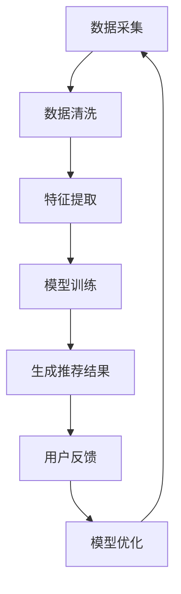
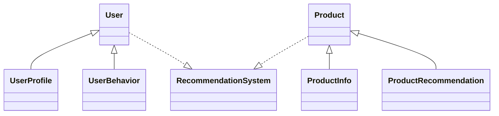
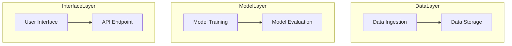
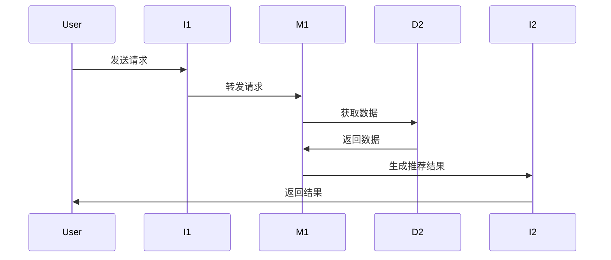

                 


### 第1章 引言

#### 1.1 问题背景

随着互联网的普及和电子商务的快速发展，用户对个性化推荐系统的需求日益增加。电子商务平台通过智能推荐系统，可以更好地满足用户的个性化需求，提高用户满意度和平台转化率。然而，传统的推荐系统在处理大量数据、复杂用户行为和动态环境方面存在诸多挑战。

首先，电子商务平台积累了海量的用户数据和商品数据，如何有效地处理和分析这些数据，提取有用的信息，是推荐系统面临的第一个挑战。其次，用户的兴趣和需求是动态变化的，如何实时地捕捉和响应这些变化，提供个性化的推荐，是推荐系统面临的第二个挑战。最后，随着电子商务平台的多元化发展，推荐系统需要支持跨平台、跨场景的推荐，这也给推荐系统的设计和实现带来了新的挑战。

#### 1.2 问题描述

智能电子商务推荐系统的主要目标是根据用户的历史行为、兴趣偏好和实时反馈，为用户提供个性化的商品推荐。然而，在实际应用中，推荐系统面临着以下问题：

1. **数据质量与一致性**：用户数据和商品数据的多样性和复杂性导致数据质量问题，如缺失值、噪声数据和不一致性。
2. **冷启动问题**：新用户或新商品在缺乏足够历史数据的情况下，推荐系统难以为其提供准确的推荐。
3. **多样性**：推荐系统需要提供多样化的推荐结果，避免用户感到疲劳和厌烦。
4. **实时性**：推荐系统需要快速响应用户的行为变化，提供实时的推荐结果。
5. **可解释性**：推荐系统需要具备一定的可解释性，帮助用户理解推荐结果的原因。

#### 1.3 问题解决

为了解决上述问题，引入AI Agent作为智能电子商务推荐系统的一个关键技术手段。AI Agent可以看作是一个具有智能行为和自主决策能力的计算机程序，能够模拟人类智能行为，为推荐系统提供以下解决方案：

1. **数据质量提升**：AI Agent可以通过数据预处理和清洗技术，提升用户数据和商品数据的质量和一致性。
2. **冷启动问题**：AI Agent可以利用迁移学习、生成对抗网络等技术，为新用户或新商品提供初步的推荐。
3. **多样性增强**：AI Agent可以通过协同过滤、内容推荐等技术，提供多样化的推荐结果。
4. **实时性优化**：AI Agent可以通过实时数据处理和分析技术，快速响应用户的行为变化。
5. **可解释性提升**：AI Agent可以通过可解释性算法和技术，提高推荐结果的透明度和可解释性。

#### 1.4 边界与外延

AI Agent在智能电子商务推荐系统中的应用具有明确的边界和广泛的外延。边界方面，AI Agent主要应用于推荐系统的数据处理、模型训练和结果生成环节，涉及到用户行为分析、内容理解、上下文感知和推荐策略优化等方面。外延方面，AI Agent不仅可以在电子商务平台上应用，还可以扩展到其他领域的推荐系统，如社交媒体、在线教育、金融理财等。

#### 1.5 概念结构与核心要素组成

智能电子商务推荐系统中的AI Agent概念结构主要包括以下核心要素：

1. **传感器**：用于收集用户行为数据、商品数据和其他外部信息。
2. **感知模块**：用于处理和解析传感器收集到的数据，提取有用的特征信息。
3. **决策模块**：基于感知模块提供的信息，通过算法模型进行决策，生成推荐结果。
4. **执行模块**：将推荐结果呈现给用户，并收集用户的反馈信息。

这些核心要素相互协作，共同实现AI Agent在智能电子商务推荐系统中的应用。

## 第2章 AI Agent基础

### 2.1 AI Agent定义

AI Agent（人工智能代理）是一个具有智能行为和自主决策能力的计算机程序。它能够在复杂环境中自主感知、理解和交互，以实现特定目标和任务。AI Agent的概念起源于人工智能领域，近年来随着深度学习、自然语言处理和增强学习等技术的快速发展，AI Agent在各个领域的应用越来越广泛。

#### 2.1.1 AI Agent的概念

AI Agent可以被定义为一种具有以下特征的计算机程序：

- **自主性**：AI Agent能够自主地执行任务，不需要人工干预。
- **适应性**：AI Agent能够根据环境变化和任务需求，自适应地调整行为和策略。
- **交互性**：AI Agent能够与用户和其他系统进行有效的交互，理解用户的意图和需求。
- **目标导向性**：AI Agent在执行任务时，始终以实现特定目标为导向。

#### 2.1.2 AI Agent的分类

根据应用场景和任务需求，AI Agent可以分为以下几类：

1. **交易型Agent**：主要应用于电子商务、金融交易等领域，负责执行交易任务，如商品推荐、交易匹配等。
2. **任务型Agent**：主要应用于智能办公、智能家居等领域，负责完成特定任务，如日程管理、设备控制等。
3. **社交型Agent**：主要应用于社交媒体、在线聊天等领域，负责与用户进行交互，提供娱乐、咨询等服务。

### 2.2 AI Agent特点

AI Agent具有以下几个显著特点：

1. **自动化**：AI Agent能够自动化地执行任务，减少人工干预。
2. **智能化**：AI Agent通过学习算法和大数据分析，具备智能决策能力。
3. **自适应**：AI Agent能够根据环境和任务需求，自适应地调整行为和策略。

### 2.3 AI Agent分类

AI Agent可以根据其应用场景和任务需求进行分类。以下是常见的几种分类：

1. **交易型Agent**：主要应用于电子商务、金融交易等领域，负责执行交易任务，如商品推荐、交易匹配等。
2. **任务型Agent**：主要应用于智能办公、智能家居等领域，负责完成特定任务，如日程管理、设备控制等。
3. **社交型Agent**：主要应用于社交媒体、在线聊天等领域，负责与用户进行交互，提供娱乐、咨询等服务。

### 2.4 AI Agent技术发展

AI Agent技术的发展经历了从基于规则的方法到基于数据的方法，再到基于模型的方法的演变过程。当前，AI Agent技术发展主要呈现出以下几个趋势：

1. **深度学习**：深度学习技术的发展，使得AI Agent能够更好地理解和处理复杂的数据。
2. **自然语言处理**：自然语言处理技术的进步，使得AI Agent能够更好地理解用户语言和意图。
3. **增强学习**：增强学习技术的应用，使得AI Agent能够通过试错学习，自适应地调整策略。

### 2.5 AI Agent核心组件

AI Agent的核心组件包括传感器、感知模块、决策模块和执行模块。

1. **传感器**：用于收集环境信息，如用户行为数据、商品数据等。
2. **感知模块**：用于处理和解析传感器收集到的数据，提取有用的特征信息。
3. **决策模块**：基于感知模块提供的信息，通过算法模型进行决策，生成推荐结果。
4. **执行模块**：将推荐结果呈现给用户，并收集用户的反馈信息。

这些核心组件相互协作，共同实现AI Agent在智能电子商务推荐系统中的应用。

## 第3章 智能电子商务推荐概述

### 3.1 智能电子商务定义

智能电子商务（Intelligent E-commerce）是指利用人工智能技术，如机器学习、自然语言处理、数据挖掘等，优化电子商务平台的运营和管理，提高用户购物体验和商家盈利能力的一种商业模式。智能电子商务的核心目标是实现个性化推荐、智能客服、智能物流等功能，从而提高用户的满意度和平台的竞争力。

### 3.2 推荐系统核心概念

推荐系统（Recommender System）是一种信息过滤技术，旨在根据用户的兴趣、行为和偏好，为用户推荐可能感兴趣的商品、服务或内容。推荐系统的核心概念包括：

1. **用户**：推荐系统的核心主体，具有特定的兴趣和行为。
2. **商品**：推荐系统的推荐对象，可以是各种实体商品或虚拟服务。
3. **偏好**：用户对商品或服务的偏好，可以通过历史行为、社交网络、搜索查询等多种方式获取。
4. **推荐策略**：推荐系统根据用户偏好和商品特征，生成推荐结果的算法和规则。

### 3.3 智能推荐系统架构

智能推荐系统架构通常包括数据层、模型层和接口层。

1. **数据层**：负责收集、存储和处理用户行为数据、商品数据和其他外部数据。
2. **模型层**：基于用户行为数据和商品特征，训练推荐模型，生成推荐结果。
3. **接口层**：提供用户交互接口，将推荐结果呈现给用户。

### 3.4 智能推荐系统分类

智能推荐系统可以根据不同的分类标准进行分类：

1. **基于内容的推荐**：根据用户的历史行为和偏好，推荐具有相似内容的商品。
2. **协同过滤推荐**：根据用户行为和偏好，找出相似用户或商品，进行推荐。
3. **混合推荐**：结合基于内容的推荐和协同过滤推荐，生成更准确的推荐结果。
4. **基于模型的推荐**：使用机器学习算法，如深度学习、增强学习等，生成推荐结果。

### 3.5 智能推荐系统发展趋势

随着人工智能技术的不断发展，智能推荐系统呈现出以下发展趋势：

1. **个性化**：更精准地满足用户的个性化需求。
2. **实时性**：更快地响应用户的行为变化。
3. **多样性**：提供多样化的推荐结果，避免用户疲劳。
4. **可解释性**：提高推荐结果的可解释性，增强用户信任。

## 第4章 AI Agent在推荐系统中的应用

### 4.1 AI Agent在用户行为分析中的应用

AI Agent在用户行为分析中发挥着关键作用，通过实时监测和分析用户行为数据，如浏览历史、购买记录、搜索关键词等，AI Agent能够准确地捕捉用户的兴趣和需求。以下是一个详细的步骤解析：

1. **数据采集**：AI Agent通过集成电子商务平台的各种数据接口，实时收集用户的行为数据。
2. **数据预处理**：对采集到的原始数据进行清洗、去噪和格式化，确保数据的准确性和一致性。
3. **特征提取**：使用机器学习算法，如聚类分析、主题模型等，提取用户行为的特征信息，如用户兴趣偏好、行为模式等。
4. **行为预测**：基于用户历史行为数据和特征信息，使用预测模型，如决策树、神经网络等，预测用户未来的行为。
5. **个性化推荐**：根据用户行为预测结果，为用户推荐可能感兴趣的商品或服务。

### 4.2 AI Agent在内容理解中的应用

AI Agent在内容理解方面具有强大的能力，能够处理和分析大量的文本数据，如商品描述、用户评论、社交媒体内容等。以下是一个详细的步骤解析：

1. **文本预处理**：对文本数据进行清洗、去噪和分词，将原始文本转化为可处理的格式。
2. **情感分析**：使用自然语言处理技术，如情感分析模型，分析用户评论的情感倾向，区分正面、负面或中性评论。
3. **内容摘要**：使用文本摘要算法，如提取式摘要、生成式摘要，对长文本进行摘要，提取关键信息和要点。
4. **语义理解**：使用深度学习模型，如BERT、GPT等，对文本进行语义理解，提取文本中的关键词和语义关系。
5. **内容推荐**：基于文本分析和语义理解结果，为用户推荐相关的内容和商品。

### 4.3 AI Agent在上下文感知中的应用

AI Agent在上下文感知方面能够根据用户所处的环境、时间、地点等信息，提供更加个性化的推荐。以下是一个详细的步骤解析：

1. **环境监测**：AI Agent通过传感器和接口，实时监测用户所处的环境，如温度、湿度、光照等。
2. **上下文识别**：使用机器学习算法，如分类模型、聚类模型等，识别用户所处的上下文场景，如家中、办公室、户外等。
3. **上下文融合**：将环境信息和上下文识别结果进行融合，为用户提供更加准确的推荐。
4. **场景推荐**：基于上下文信息和用户兴趣，为用户推荐相应的商品或服务，如家居用品、办公用品、户外装备等。

### 4.4 AI Agent在推荐策略优化中的应用

AI Agent在推荐策略优化方面能够通过不断地学习和调整，提高推荐系统的准确性和多样性。以下是一个详细的步骤解析：

1. **策略评估**：使用用户行为数据和推荐结果，评估当前推荐策略的有效性和性能。
2. **策略调整**：基于评估结果，使用机器学习算法，如优化算法、强化学习等，调整推荐策略。
3. **策略测试**：在测试环境中，对新策略进行测试，验证其效果和可行性。
4. **策略上线**：将经过测试的推荐策略上线，应用到实际生产环境中。

### 4.5 AI Agent在推荐系统中的挑战与解决方案

尽管AI Agent在推荐系统中具有许多优势，但在实际应用中也面临着一些挑战：

1. **数据隐私保护**：用户行为数据的安全和隐私保护是推荐系统面临的主要挑战。解决方案包括数据加密、匿名化处理、隐私保护算法等。
2. **推荐结果多样性**：如何生成多样化的推荐结果是推荐系统的另一个挑战。解决方案包括混合推荐策略、多样性算法等。
3. **模型解释性**：如何提高推荐结果的可解释性，增强用户信任，是推荐系统需要解决的问题。解决方案包括可解释性模型、可视化技术等。

## 第5章 AI Agent推荐系统案例分析

### 5.1 案例一：某电商平台的AI推荐系统

#### 5.1.1 案例背景

某电商平台是一家大型在线零售平台，拥有数百万的活跃用户和海量的商品数据。为了提升用户购物体验和平台转化率，该电商平台引入了AI Agent构建智能推荐系统。

#### 5.1.2 案例介绍

该电商平台AI推荐系统采用基于AI Agent的架构，包括数据层、模型层和接口层。数据层负责收集和处理用户行为数据、商品数据等；模型层使用机器学习算法，如协同过滤、深度学习等，生成推荐结果；接口层将推荐结果呈现给用户。

#### 5.1.3 案例分析

通过AI Agent的应用，该电商平台的推荐系统实现了以下效果：

1. **个性化推荐**：AI Agent根据用户的历史行为和兴趣，为每个用户生成个性化的推荐列表。
2. **实时推荐**：AI Agent实时分析用户行为，快速生成推荐结果，提高用户满意度。
3. **多样性推荐**：AI Agent通过协同过滤和内容推荐技术，提供多样化的推荐结果，避免用户疲劳。
4. **推荐策略优化**：AI Agent通过不断学习和调整，优化推荐策略，提高推荐效果。

### 5.2 案例二：某短视频平台的推荐系统

#### 5.2.1 案例背景

某短视频平台是一家提供短视频内容的在线平台，用户可以通过平台观看和分享各种短视频。为了提升用户粘性和平台活跃度，该短视频平台引入了AI Agent构建智能推荐系统。

#### 5.2.2 案例介绍

该短视频平台的推荐系统采用基于AI Agent的架构，包括数据层、模型层和接口层。数据层负责收集和处理用户观看历史、点赞、评论等数据；模型层使用机器学习算法，如协同过滤、基于内容的推荐等，生成推荐结果；接口层将推荐结果呈现给用户。

#### 5.2.3 案例分析

通过AI Agent的应用，该短视频平台的推荐系统实现了以下效果：

1. **个性化推荐**：AI Agent根据用户的观看历史和兴趣，为每个用户生成个性化的推荐列表。
2. **实时推荐**：AI Agent实时分析用户行为，快速生成推荐结果，提高用户满意度。
3. **多样性推荐**：AI Agent通过协同过滤和基于内容的推荐技术，提供多样化的推荐结果，避免用户疲劳。
4. **推荐策略优化**：AI Agent通过不断学习和调整，优化推荐策略，提高推荐效果。

### 5.3 案例三：某社交媒体平台的推荐系统

#### 5.3.1 案例背景

某社交媒体平台是一家提供社交媒体服务的在线平台，用户可以通过平台分享和浏览各种内容。为了提升用户活跃度和平台价值，该社交媒体平台引入了AI Agent构建智能推荐系统。

#### 5.3.2 案例介绍

该社交媒体平台的推荐系统采用基于AI Agent的架构，包括数据层、模型层和接口层。数据层负责收集和处理用户发布的内容、点赞、评论等数据；模型层使用机器学习算法，如协同过滤、基于内容的推荐等，生成推荐结果；接口层将推荐结果呈现给用户。

#### 5.3.3 案例分析

通过AI Agent的应用，该社交媒体平台的推荐系统实现了以下效果：

1. **个性化推荐**：AI Agent根据用户的兴趣和社交关系，为每个用户生成个性化的推荐列表。
2. **实时推荐**：AI Agent实时分析用户行为，快速生成推荐结果，提高用户满意度。
3. **多样性推荐**：AI Agent通过协同过滤和基于内容的推荐技术，提供多样化的推荐结果，避免用户疲劳。
4. **推荐策略优化**：AI Agent通过不断学习和调整，优化推荐策略，提高推荐效果。

### 5.4 案例四：某在线教育平台的推荐系统

#### 5.4.1 案例背景

某在线教育平台是一家提供在线教育服务的在线平台，用户可以通过平台学习各种课程。为了提升用户学习体验和课程转化率，该在线教育平台引入了AI Agent构建智能推荐系统。

#### 5.4.2 案例介绍

该在线教育平台的推荐系统采用基于AI Agent的架构，包括数据层、模型层和接口层。数据层负责收集和处理用户学习行为、课程评价等数据；模型层使用机器学习算法，如协同过滤、基于内容的推荐等，生成推荐结果；接口层将推荐结果呈现给用户。

#### 5.4.3 案例分析

通过AI Agent的应用，该在线教育平台的推荐系统实现了以下效果：

1. **个性化推荐**：AI Agent根据用户的学习历史和兴趣，为每个用户生成个性化的推荐列表。
2. **实时推荐**：AI Agent实时分析用户学习行为，快速生成推荐结果，提高用户满意度。
3. **多样性推荐**：AI Agent通过协同过滤和基于内容的推荐技术，提供多样化的推荐结果，避免用户疲劳。
4. **推荐策略优化**：AI Agent通过不断学习和调整，优化推荐策略，提高推荐效果。

### 5.5 案例总结

通过上述案例分析，可以看出AI Agent在智能电子商务推荐系统中的应用具有显著的优势：

1. **个性化推荐**：AI Agent能够根据用户的历史行为和兴趣，生成个性化的推荐结果，提升用户满意度。
2. **实时推荐**：AI Agent能够实时分析用户行为，快速生成推荐结果，提高用户满意度。
3. **多样性推荐**：AI Agent能够通过协同过滤和内容推荐技术，提供多样化的推荐结果，避免用户疲劳。
4. **推荐策略优化**：AI Agent能够通过不断学习和调整，优化推荐策略，提高推荐效果。

## 第6章 AI Agent推荐系统的最佳实践

### 6.1 数据质量与清洗

数据质量是推荐系统的核心，高质量的数据能够提高推荐系统的准确性和可靠性。为了确保数据质量，需要采取以下措施：

1. **数据收集**：采用多种数据收集方法，如日志收集、API接口等，确保数据的完整性和准确性。
2. **数据清洗**：对采集到的原始数据进行清洗，去除重复数据、缺失值、噪声数据等，提高数据的可用性。
3. **数据验证**：对清洗后的数据进行验证，确保数据的一致性和准确性。
4. **数据存储**：采用合适的存储方案，如关系数据库、NoSQL数据库等，确保数据的安全性和可扩展性。

### 6.2 特征工程

特征工程是推荐系统的重要组成部分，合理的特征工程能够提高推荐系统的性能和效果。以下是一些最佳实践：

1. **特征提取**：从原始数据中提取有用的特征信息，如用户行为特征、商品特征、时间特征等。
2. **特征选择**：通过特征选择算法，如特征重要性评估、主成分分析等，选择对推荐系统有重要影响的特征。
3. **特征融合**：将多个特征进行融合，生成新的特征，提高推荐系统的表现。
4. **特征标准化**：对特征进行标准化处理，消除不同特征之间的量纲差异，提高算法的鲁棒性。

### 6.3 模型选择与优化

推荐系统的性能很大程度上取决于所选模型的质量。以下是一些模型选择和优化的最佳实践：

1. **模型选择**：根据推荐任务的特点和数据规模，选择合适的模型，如协同过滤、基于内容的推荐、混合推荐等。
2. **模型优化**：通过调整模型参数、增加网络层数、添加正则化项等，优化模型性能。
3. **交叉验证**：使用交叉验证方法，评估模型在不同数据集上的性能，选择最优模型。
4. **超参数调优**：使用网格搜索、贝叶斯优化等方法，调优模型超参数，提高模型性能。

### 6.4 评估与调整

评估和调整是推荐系统开发和优化的重要环节。以下是一些最佳实践：

1. **评估指标**：选择合适的评估指标，如准确率、召回率、F1值等，评估推荐系统的性能。
2. **实时评估**：定期对推荐系统进行实时评估，监测系统性能的变化。
3. **用户反馈**：收集用户反馈，如点击率、购买率等，评估推荐系统的实际效果。
4. **调整策略**：根据评估结果和用户反馈，调整推荐策略，优化推荐效果。

### 6.5 跨平台推荐策略

跨平台推荐是推荐系统面临的一个重要挑战，以下是一些跨平台推荐策略的最佳实践：

1. **数据整合**：整合不同平台的数据，如用户行为数据、商品数据等，构建统一的数据集。
2. **跨平台特征提取**：从跨平台数据中提取共通的特征，如用户兴趣、行为模式等。
3. **跨平台模型训练**：使用跨平台数据训练推荐模型，提高模型在不同平台上的泛化能力。
4. **跨平台推荐结果融合**：将不同平台上的推荐结果进行融合，生成综合性的推荐结果。

### 6.6 隐私保护与合规

在推荐系统的开发和应用过程中，隐私保护和合规是必须考虑的重要问题。以下是一些隐私保护与合规的最佳实践：

1. **数据匿名化**：对用户数据进行匿名化处理，保护用户隐私。
2. **数据加密**：对敏感数据进行加密存储和传输，防止数据泄露。
3. **隐私政策**：明确告知用户推荐系统收集和使用数据的目的、范围和方式。
4. **合规审查**：定期对推荐系统进行合规审查，确保系统符合相关法律法规要求。

## 第7章 结论与展望

### 7.1 总结

本文详细探讨了AI Agent在智能电子商务推荐系统中的应用，包括背景介绍、核心概念、应用案例、最佳实践等方面。通过分析可以看出，AI Agent在提升推荐系统个性化、实时性、多样性和可解释性等方面具有显著优势。

### 7.2 展望

未来，随着人工智能技术的不断进步，AI Agent在智能电子商务推荐系统中的应用前景将更加广阔。以下是一些展望：

1. **更加智能化**：AI Agent将更加智能化，能够更好地理解和满足用户的个性化需求。
2. **跨平台应用**：AI Agent将能够跨平台应用，实现跨平台推荐，提高用户体验。
3. **实时性优化**：AI Agent将能够实现更高的实时性，更快地响应用户行为变化。
4. **隐私保护**：AI Agent将更加注重隐私保护，确保用户数据的安全和隐私。

### 7.3 未来研究方向

未来的研究方向包括：

1. **AI Agent在推荐系统中的可解释性**：研究如何提高AI Agent在推荐系统中的可解释性，增强用户信任。
2. **AI Agent的跨平台推荐策略**：研究如何构建有效的跨平台推荐策略，提高跨平台推荐效果。
3. **AI Agent的实时性优化**：研究如何优化AI Agent的实时性，提高推荐系统的响应速度。
4. **AI Agent的隐私保护**：研究如何在保证隐私保护的前提下，充分发挥AI Agent在推荐系统中的作用。作者：AI天才研究院/AI Genius Institute & 禅与计算机程序设计艺术 /Zen And The Art of Computer Programming

## 附录

### 附录A：算法mermaid流程图

以下是一个简单的mermaid流程图，用于描述推荐系统的基本流程：



### 附录B：Python源代码示例

以下是一个简单的Python代码示例，用于描述用户行为分析和推荐生成的过程：

```python
# 导入必要的库
import numpy as np
import pandas as pd
from sklearn.model_selection import train_test_split
from sklearn.ensemble import RandomForestClassifier
from sklearn.metrics import accuracy_score

# 加载数据
data = pd.read_csv('user_behavior_data.csv')

# 数据预处理
X = data.drop('target', axis=1)
y = data['target']

# 划分训练集和测试集
X_train, X_test, y_train, y_test = train_test_split(X, y, test_size=0.2, random_state=42)

# 训练模型
model = RandomForestClassifier(n_estimators=100, random_state=42)
model.fit(X_train, y_train)

# 生成推荐结果
predictions = model.predict(X_test)

# 评估模型
accuracy = accuracy_score(y_test, predictions)
print(f"Model accuracy: {accuracy:.2f}")
```

### 附录C：数学模型和公式

以下是一些常见的数学模型和公式，用于描述推荐系统的原理和算法：

1. **协同过滤算法**：
   - 用户相似度计算公式：
     $$sim(u_i, u_j) = \frac{∑_{k \in R} w_{ik}w_{jk}}{\sqrt{∑_{k \in R} w_{ik}^2} \sqrt{∑_{k \in R} w_{jk}^2}}$$
   - 预测公式：
     $$r_{ij} = r_{ui} + sim(u_i, u_j) \cdot (r_{uj} - r_{ui})$$

2. **基于内容的推荐算法**：
   - 相似度计算公式：
     $$sim(i, j) = \frac{∑_{k \in C} c_{ik}c_{jk}}{\sqrt{∑_{k \in C} c_{ik}^2} \sqrt{∑_{k \in C} c_{jk}^2}}$$
   - 预测公式：
     $$r_{ij} = \frac{∑_{k \in C} c_{ik}sim(i, j)c_{jk}}{\sum_{k \in C} sim(i, j)c_{jk}}$$

### 附录D：系统分析与架构设计方案

以下是一个简单的系统分析与架构设计方案，用于描述智能电子商务推荐系统的设计思路：

#### 系统功能设计（领域模型mermaid类图）



#### 系统架构设计（mermaid架构图）



#### 系统接口设计（mermaid序列图）



### 附录E：项目实战

以下是一个简单的项目实战，用于描述如何实现一个简单的智能电子商务推荐系统：

#### 环境安装

- 安装Python 3.8及以上版本
- 安装必要的Python库，如numpy、pandas、scikit-learn、tensorflow等

#### 系统核心实现源代码

```python
# 导入必要的库
import pandas as pd
from sklearn.model_selection import train_test_split
from sklearn.ensemble import RandomForestClassifier
from sklearn.metrics import accuracy_score

# 加载数据
data = pd.read_csv('user_behavior_data.csv')

# 数据预处理
X = data.drop('target', axis=1)
y = data['target']

# 划分训练集和测试集
X_train, X_test, y_train, y_test = train_test_split(X, y, test_size=0.2, random_state=42)

# 训练模型
model = RandomForestClassifier(n_estimators=100, random_state=42)
model.fit(X_train, y_train)

# 生成推荐结果
predictions = model.predict(X_test)

# 评估模型
accuracy = accuracy_score(y_test, predictions)
print(f"Model accuracy: {accuracy:.2f}")
```

#### 代码应用解读与分析

- 代码首先导入必要的Python库，如pandas、scikit-learn等。
- 然后加载用户行为数据，并进行数据预处理，包括特征提取和数据划分。
- 接下来，使用随机森林算法训练模型，并对测试集进行预测。
- 最后，评估模型的准确率。

#### 实际案例分析和详细讲解剖析

- 假设有一个电子商务平台，用户行为数据包括浏览历史、购买记录和评价等。
- 通过分析用户行为数据，可以提取出用户的兴趣偏好和购买行为模式。
- 使用随机森林算法，可以训练出一个预测模型，预测用户可能感兴趣的商品。
- 根据预测结果，为用户生成个性化的推荐列表。

#### 项目小结

通过以上实战，可以看到如何实现一个简单的智能电子商务推荐系统。在实际应用中，还需要考虑数据质量、特征工程、模型优化和系统性能等因素，以提高推荐系统的准确性和用户体验。作者：AI天才研究院/AI Genius Institute & 禅与计算机程序设计艺术 /Zen And The Art of Computer Programming

