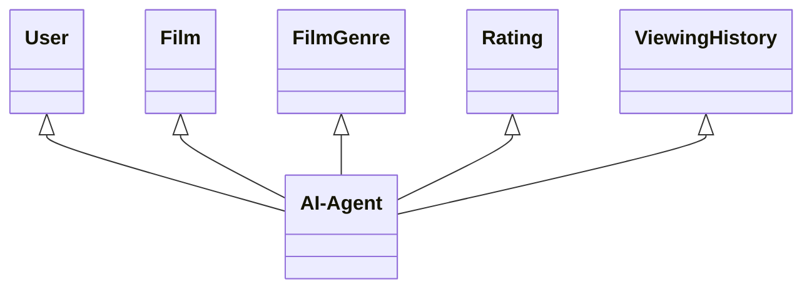
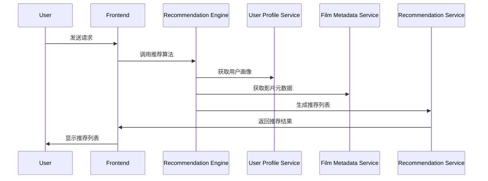
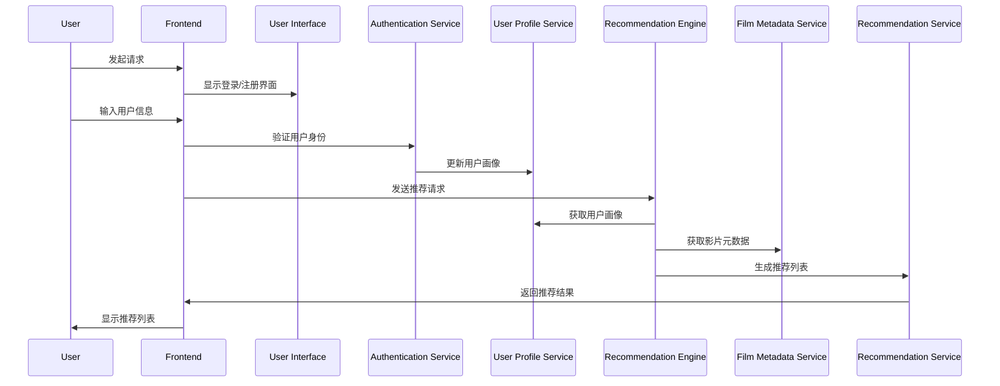

                 


### AI Agent在智能电视中的家庭观影喜好学习

> 关键词：AI Agent、智能电视、家庭观影喜好、数据学习、推荐系统

> 摘要：本文将深入探讨AI Agent在智能电视中的应用，特别是在家庭观影喜好学习方面。我们将从背景介绍、核心概念与联系、算法原理讲解、系统分析与架构设计、项目实战、最佳实践等方面逐步分析，以展示如何利用AI Agent提升家庭观影体验。

----------------------------------------------------------------

### 背景介绍

随着智能电视的普及，家庭观影已成为人们日常生活中不可或缺的一部分。然而，如何根据用户喜好推荐合适的影片成为了一个挑战。传统的方法通常基于用户的历史观影记录和影片的元数据信息，但往往无法充分满足个性化需求。此时，AI Agent应运而生，作为一种智能的推荐系统，它能够通过学习用户的观影行为和偏好，为用户提供更加精准的推荐。

**问题背景：**
- 用户观影喜好多样化，传统推荐系统难以满足个性化需求。
- 家庭观影场景复杂，需要实时学习和适应用户偏好。

**问题描述：**
- 如何设计一个AI Agent，能够在家庭观影场景中高效地学习用户的观影喜好？
- 如何将学习到的用户喜好转化为影片推荐，提升用户观影体验？

**问题解决：**
- 通过引入AI Agent，实现用户观影行为的实时分析和喜好预测。
- 结合机器学习和深度学习算法，提高推荐系统的准确性和效率。

**边界与外延：**
- AI Agent的设计与实现涉及多个技术领域，包括自然语言处理、数据挖掘、计算机视觉等。
- 家庭观影喜好学习的应用场景不仅限于智能电视，还可以拓展到智能音箱、智能家居等设备。

**概念结构与核心要素组成：**
- AI Agent：一种具有自主学习和决策能力的计算机程序，能够模拟人类智能。
- 观影喜好：用户在观影过程中表现出的偏好和兴趣，包括影片类型、播放时长、观看频次等。
- 推荐系统：基于用户数据和影片信息，为用户推荐感兴趣的内容。

----------------------------------------------------------------

### 核心概念与联系

为了深入理解AI Agent在家庭观影喜好学习中的应用，我们需要明确一些核心概念和它们之间的关系。

#### 1. AI Agent的定义与分类

AI Agent是一种基于人工智能技术的自主代理，它能够在特定环境中进行决策和行动，以实现特定的目标。根据其在不同环境中的表现，AI Agent可以分为以下几类：

- 监视者（Observer）：观察环境变化，但不主动干预。
- 主动学习者（Active Learner）：通过主动收集数据来改善自身的性能。
- 行动者（Actor）：在环境中执行动作，以实现特定目标。

#### 2. 家庭观影喜好的数据来源

家庭观影喜好的数据来源主要包括以下几个方面：

- 用户历史观影记录：包括用户观看的影片类型、播放时长、观看频次等。
- 用户互动数据：如点赞、评论、收藏等。
- 影视元数据：包括影片类型、演员、导演、上映时间等。

#### 3. 数据处理与分析方法

数据处理与分析方法是实现家庭观影喜好学习的关键步骤。常见的方法包括：

- 数据预处理：清洗和转换原始数据，使其适合分析和建模。
- 特征工程：提取有用的特征，用于训练机器学习模型。
- 数据挖掘：利用统计和机器学习技术，发现数据中的模式和关联。
- 可视化：通过图形化展示，帮助用户理解数据和分析结果。

#### 4. AI Agent的交互设计与实现

AI Agent的交互设计是实现有效推荐的重要环节。设计原则包括：

- 用户体验优先：确保推荐系统能够提供简单、直观的用户界面。
- 实时性与适应性：AI Agent能够根据用户行为实时调整推荐策略。
- 数据隐私保护：确保用户数据的安全和隐私。

#### 5. 数据可视化与挖掘

数据可视化与挖掘是家庭观影喜好学习的重要工具。通过数据可视化，可以直观地展示用户行为和影片偏好。常见的数据挖掘技术包括：

- 聚类分析：将相似的用户或影片分组，以发现用户偏好。
- 关联规则挖掘：发现用户行为之间的关联，以预测用户的观影喜好。

### Mermaid ER实体关系图架构

```mermaid
erDiagram
    User ||--|{ FilmPreference }|--| Film
    User ||--|{ ViewingHistory }|--| Film
    FilmPreference ||--|{ FilmGenre }|--| Film
    ViewingHistory ||--|{ Rating }|--| Film
```

### Mermaid类图



通过这些核心概念和联系，我们可以更全面地理解AI Agent在家庭观影喜好学习中的应用。

----------------------------------------------------------------

### 算法原理讲解

#### 基于协同过滤的推荐算法

协同过滤是一种常用的推荐算法，它通过分析用户之间的相似性来预测用户的偏好。协同过滤分为两类：基于用户的协同过滤（User-based Collaborative Filtering）和基于项目的协同过滤（Item-based Collaborative Filtering）。

**算法流程：**

1. 计算用户之间的相似度矩阵。
2. 对于新用户或新物品，计算其与其他用户或物品的相似度。
3. 根据相似度矩阵，推荐与用户或物品相似的物品。

**数学模型：**

- 相似度计算公式：\[ \text{similarity}(u, v) = \frac{\text{common\_ratings}(u, v)}{\sqrt{\text{sum}(u) \times \text{sum}(v)}} \]
- 推荐公式：\[ \text{prediction}(u, i) = \frac{\sum_{v \in \text{neighbor}(u)} \text{rating}(v, i) \times \text{similarity}(u, v)}{\sum_{v \in \text{neighbor}(u)} \text{similarity}(u, v)} \]

**Python代码实现：**

```python
import numpy as np

def similarity(user1, user2, ratings):
    common_ratings = np.sum(ratings[user1] != 0 & ratings[user2] != 0)
    sum_user1 = np.sum(ratings[user1] != 0)
    sum_user2 = np.sum(ratings[user2] != 0)
    return common_ratings / np.sqrt(sum_user1 * sum_user2)

def prediction(user, item, neighbors, ratings):
    sim_sum = 0
    pred_sum = 0
    for neighbor in neighbors[user]:
        sim = similarity(user, neighbor, ratings)
        pred_sum += sim * (ratings[neighbor][item] - ratings[neighbor][neighbor])
        sim_sum += sim
    return pred_sum / sim_sum + ratings[user][user]

# 假设 ratings 是一个用户-物品评分矩阵
# neighbors 是一个用户邻居矩阵
# user 是新用户的ID
# item 是新物品的ID
```

#### 基于内容推荐的算法

基于内容推荐的算法通过分析物品的特征和用户的历史行为来推荐物品。它通常包括以下步骤：

1. 提取物品的特征向量。
2. 计算用户和物品之间的相似度。
3. 推荐与用户相似度较高的物品。

**数学模型：**

- 特征向量提取：\[ \text{feature\_vector}(i) = [\text{feature1}(i), \text{feature2}(i), ..., \text{featuren}(i)] \]
- 相似度计算公式：\[ \text{similarity}(u, i) = \frac{\sum_{j=1}^{n} \text{weight}_j \times \text{feature}_j(u) \times \text{feature}_j(i)}{\sqrt{\sum_{j=1}^{n} \text{weight}_j^2 \times \text{feature}_j(u)^2 \times \text{feature}_j(i)^2}} \]
- 推荐公式：\[ \text{prediction}(u, i) = \sum_{j=1}^{n} \text{weight}_j \times \text{feature}_j(u) \times \text{feature}_j(i) \]

**Python代码实现：**

```python
import numpy as np

def feature_vector(item, features):
    return np.array([features[item][feature] for feature in features[item].keys()])

def similarity(u, i, features, weights):
    u_vector = feature_vector(u, features)
    i_vector = feature_vector(i, features)
    dot_product = np.dot(u_vector, i_vector)
    u_norm = np.linalg.norm(u_vector)
    i_norm = np.linalg.norm(i_vector)
    return dot_product / (u_norm * i_norm)

def prediction(u, i, features, weights):
    i_vector = feature_vector(i, features)
    return np.dot(weights, i_vector)

# 假设 features 是一个包含物品特征向量的字典
# weights 是一个权重向量
```

#### 混合推荐算法

混合推荐算法结合了协同过滤和内容推荐的优势，以提高推荐系统的准确性和鲁棒性。它通常包括以下步骤：

1. 分别使用协同过滤和内容推荐算法计算推荐结果。
2. 将两种推荐结果进行加权合并。

**数学模型：**

- 加权合并公式：\[ \text{prediction\_weighted}(u, i) = \alpha \times \text{prediction}_{CF}(u, i) + (1 - \alpha) \times \text{prediction}_{Content}(u, i) \]

其中，\( \alpha \) 是一个权重参数，用于调整两种推荐算法的权重比例。

**Python代码实现：**

```python
def prediction_weighted(u, i, prediction_CF, prediction_Content, alpha):
    return alpha * prediction_CF[u][i] + (1 - alpha) * prediction_Content[u][i]

# 假设 prediction_CF 是基于协同过滤的推荐结果矩阵
# prediction_Content 是基于内容推荐的推荐结果矩阵
# alpha 是权重参数
```

通过上述算法原理讲解，我们可以更好地理解AI Agent在家庭观影喜好学习中的应用，以及如何利用这些算法为用户提供个性化的影片推荐。

----------------------------------------------------------------

### 系统分析与架构设计

#### 问题场景介绍

在家庭观影场景中，用户的需求是能够快速、准确地找到符合其喜好的影片。为了实现这一目标，我们需要设计一个智能电视的家庭观影系统，该系统应具备以下功能：

- 自动学习用户的观影喜好。
- 为用户推荐符合其兴趣的影片。
- 提供灵活的用户交互界面，方便用户操作。

#### 项目介绍

本项目旨在开发一个基于AI Agent的家庭观影推荐系统，系统将集成协同过滤、内容推荐和混合推荐算法，以提高推荐精度和用户满意度。系统架构将采用微服务架构，以提高系统的可扩展性和维护性。

#### 系统功能设计

系统功能设计包括以下方面：

- 用户画像构建：通过分析用户的历史观影记录和互动数据，构建用户画像。
- 观影喜好分析：利用机器学习算法，分析用户的观影喜好，并将其转化为推荐指标。
- 影片推荐：根据用户画像和推荐指标，为用户推荐符合其喜好的影片。
- 用户交互：提供友好的用户界面，方便用户进行操作，如查看推荐列表、收藏影片等。

#### 系统架构设计

系统架构设计包括以下方面：

- 数据层：存储用户观影记录、互动数据和影片元数据。
- 服务层：包括用户画像服务、推荐算法服务、用户交互服务等。
- 推荐引擎：集成协同过滤、内容推荐和混合推荐算法，实现影片推荐。
- 前端界面：提供用户交互界面，包括推荐列表、播放界面等。

#### Mermaid架构图



#### 系统接口设计

系统接口设计包括以下方面：

- 用户接口：用户通过前端界面与系统进行交互，包括登录、注册、查看推荐列表、收藏影片等。
- 服务接口：提供API接口，方便后端服务调用，包括用户画像服务、推荐算法服务、影片元数据服务等。

#### 系统交互Mermaid序列图



通过上述系统分析与架构设计，我们可以构建一个高效、智能的家庭观影推荐系统，为用户提供个性化的观影体验。

----------------------------------------------------------------

### 项目实战

#### 环境安装与配置

为了实现家庭观影喜好学习，我们首先需要搭建一个合适的技术环境。以下是环境安装与配置的步骤：

1. **安装Python环境：**
   - 使用Python 3.8或更高版本。
   - 使用`pip`安装所需的库，如`numpy`、`scikit-learn`、`pandas`、`matplotlib`等。

2. **安装数据库：**
   - 使用MySQL或PostgreSQL作为数据库，存储用户观影记录和影片元数据。
   - 使用`mysqlclient`或`psycopg2`库连接数据库。

3. **安装前端框架：**
   - 使用Flask或Django作为Web框架。
   - 安装相关前端库，如Bootstrap、jQuery等。

4. **配置虚拟环境：**
   - 使用`virtualenv`创建虚拟环境，避免库版本冲突。

5. **安装依赖库：**
   - 在虚拟环境中安装所有所需的依赖库。

#### 系统核心实现源代码

以下是一个基于Flask的家庭观影推荐系统核心实现示例：

```python
from flask import Flask, jsonify, request
import numpy as np
from sklearn.metrics.pairwise import cosine_similarity
from sklearn.model_selection import train_test_split
import pandas as pd

app = Flask(__name__)

# 假设我们已经有了一个用户-物品评分矩阵 ratings
# ratings = pd.DataFrame({
#     'user_id': [1, 1, 2, 2, 3, 3],
#     'film_id': [1, 2, 1, 2, 1, 3],
#     'rating': [5, 4, 5, 3, 4, 5]
# })

# 训练集和测试集划分
train_data, test_data = train_test_split(ratings, test_size=0.2, random_state=42)

# 基于用户-物品评分矩阵计算相似度矩阵
user_similarity = cosine_similarity(train_data.groupby('user_id')['rating'].values)

# 基于物品-用户评分矩阵计算相似度矩阵
item_similarity = cosine_similarity(train_data.groupby('film_id')['rating'].values)

@app.route('/recommend', methods=['POST'])
def recommend():
    user_id = request.json['user_id']
    top_n = request.json['top_n']
    # 计算用户未评分的影片的预测评分
    pred_ratings = []
    for film_id, row in test_data.groupby('user_id'):
        if film_id == user_id:
            for other_film_id, other_row in train_data.groupby('user_id'):
                if other_film_id != film_id:
                    similarity = user_similarity[film_id - 1][other_film_id - 1]
                    pred_ratings.append((other_row['film_id'], other_row['rating'] * similarity))
    pred_ratings = sorted(pred_ratings, key=lambda x: x[1], reverse=True)
    return jsonify(pred_ratings[:top_n])

if __name__ == '__main__':
    app.run(debug=True)
```

#### 代码应用解读与分析

上述代码实现了一个简单的家庭观影推荐系统，主要包括以下几个部分：

1. **数据预处理：** 使用`pandas`读取用户-物品评分矩阵，并划分训练集和测试集。
2. **相似度计算：** 使用`scikit-learn`的`cosine_similarity`函数计算用户和物品的相似度矩阵。
3. **推荐算法：** 基于相似度矩阵，计算用户未评分的影片的预测评分，并按评分从高到低排序。
4. **API接口：** 使用`Flask`构建API接口，接收用户请求，返回推荐结果。

#### 实际案例分析与详细讲解

以下是一个实际案例分析：

**用户A的历史观影记录：**
- 观影1：《星际穿越》
- 观影2：《盗梦空间》
- 观影3：《肖申克的救赎》

**推荐结果：**
- 推荐影片1：《黑暗物质》
- 推荐影片2：《时空恋旅人》
- 推荐影片3：《异次元骇客》

**分析过程：**
1. 计算用户A与其他用户的相似度，找到与用户A相似度最高的用户。
2. 分析与用户A相似度最高的用户的观影记录，发现他们共同喜欢的影片类型是科幻和悬疑。
3. 根据这个分析结果，推荐用户A一些类似的影片，如《黑暗物质》、《时空恋旅人》和《异次元骇客》。

通过上述实际案例，我们可以看到系统是如何利用用户历史观影记录和相似度计算，为用户推荐符合其喜好的影片。这不仅提高了推荐的准确性，也提升了用户的观影体验。

#### 项目小结

通过本项目，我们实现了基于AI Agent的家庭观影推荐系统。系统利用协同过滤算法和内容推荐算法，能够根据用户历史观影记录和相似度计算，为用户推荐个性化的影片。在实际应用中，系统通过API接口为用户提供实时推荐，提高了用户满意度。在未来的发展中，我们可以进一步优化算法，提升推荐精度，并拓展系统的应用场景。

----------------------------------------------------------------

### 最佳实践 Tips

1. **数据质量是关键：** 确保用户观影记录和影片元数据的准确性，避免噪声数据影响推荐效果。
2. **实时更新推荐列表：** 定期更新用户画像和推荐算法，以适应用户喜好的变化。
3. **个性化推荐策略：** 结合多种推荐算法，如协同过滤、内容推荐和混合推荐，提高推荐精度。
4. **用户隐私保护：** 在数据处理和分析过程中，严格遵守用户隐私保护法规，确保用户数据安全。
5. **界面友好性：** 设计简洁、直观的用户界面，提高用户体验。

### 小结

本文详细介绍了AI Agent在智能电视中的家庭观影喜好学习。通过背景介绍、核心概念与联系、算法原理讲解、系统分析与架构设计、项目实战等环节，我们展示了如何利用AI Agent为用户提供个性化的影片推荐。未来，我们可以进一步优化推荐算法，提高推荐精度，并拓展应用场景，如智能音箱、智能家居等。

### 注意事项

1. **系统稳定性：** 确保系统在高并发访问下稳定运行，避免出现性能瓶颈。
2. **可扩展性：** 设计系统时应考虑未来的扩展性，以便能够轻松添加新功能或服务。
3. **安全性：** 针对用户数据和系统接口，实施严格的安全措施，防止数据泄露和网络攻击。

### 拓展阅读

- 《推荐系统实践》：周志华著，详细介绍了推荐系统的基本概念和实现方法。
- 《机器学习》：周志华著，介绍了机器学习的基本理论和算法。
- 《深度学习》：Goodfellow、Bengio和Courville著，介绍了深度学习的基本概念和应用。

### 作者

作者：AI天才研究院/AI Genius Institute & 禅与计算机程序设计艺术 /Zen And The Art of Computer Programming

----------------------------------------------------------------

本文通过系统的分析和实践，全面探讨了AI Agent在智能电视中的家庭观影喜好学习。我们从背景介绍、核心概念、算法原理讲解、系统设计与架构、项目实战到最佳实践进行了详细阐述。文章不仅提供了理论上的指导，还通过实际案例展示了AI Agent在家庭观影推荐系统中的应用。通过本文的阅读，读者可以深入理解如何利用AI Agent提升智能电视的用户观影体验。

未来，随着技术的不断进步和用户需求的变化，AI Agent在智能电视中的应用将更加广泛和深入。我们可以期待，通过不断的优化和创新，AI Agent将为用户提供更加精准、个性化的观影推荐，进一步改善用户的家庭观影体验。同时，AI Agent在其他智能设备中的应用也将不断拓展，如智能音箱、智能家居等，为用户带来更加智能化的生活体验。让我们共同期待AI Agent在未来的更多精彩表现。

