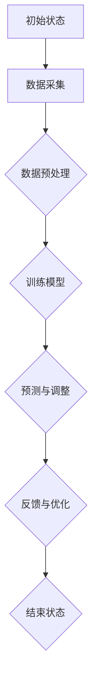
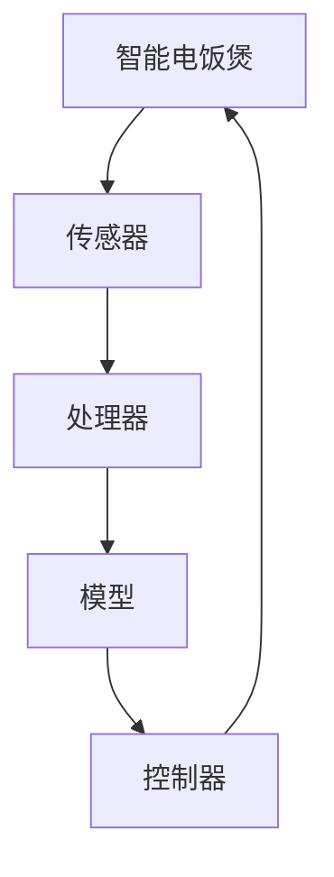
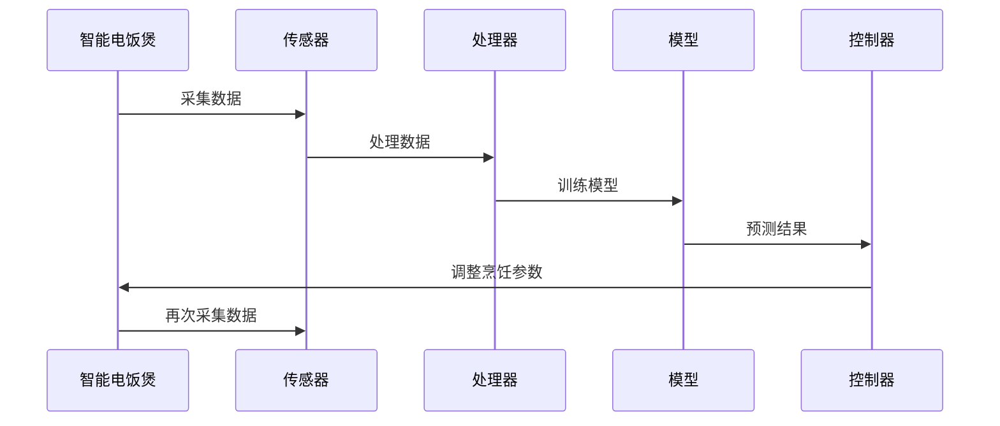

                 

### 文章标题

**AI Agent在智能电饭煲中的米饭口感优化**

> 关键词：AI Agent、智能电饭煲、米饭口感、优化、算法、机器学习

> 摘要：本文将探讨AI Agent在智能电饭煲中的应用，特别是如何通过机器学习算法优化米饭的口感。文章将从背景介绍、核心概念与联系、算法原理讲解、系统分析与架构设计方案、项目实战、最佳实践以及小结与展望七个方面展开，为读者提供全面的技术解读。

----------------------------------------------------------------

### 目录

1. **背景介绍**  
2. **核心概念与联系**  
3. **算法原理讲解**  
4. **系统分析与架构设计方案**  
5. **项目实战**  
6. **最佳实践**  
7. **小结与展望**

----------------------------------------------------------------

## 背景介绍

随着科技的发展，人工智能（AI）技术逐渐渗透到我们的日常生活中。智能家电作为AI应用的一个重要领域，正日益受到关注。其中，智能电饭煲作为家庭厨房中常见的电器，其智能化程度直接影响到用户的烹饪体验。而米饭口感作为衡量智能电饭煲性能的重要指标，优化米饭口感已成为智能电饭煲研发的重点方向。

目前，传统的智能电饭煲主要通过预设程序和用户手动调整来实现烹饪参数的优化。然而，由于用户的口味偏好各不相同，这种手动调整的方式往往难以满足所有人的需求。AI Agent作为人工智能的一种表现形式，具备自主学习能力和灵活调整能力，能够根据用户的烹饪需求进行实时优化。因此，引入AI Agent来优化智能电饭煲中的米饭口感，具有很高的实用价值和广阔的市场前景。

本文将首先介绍AI Agent和智能电饭煲的基本概念，然后深入探讨AI Agent如何通过机器学习算法优化米饭口感，最后通过实际项目和案例分析，展示AI Agent在智能电饭煲中的应用效果。

### 核心概念与联系

#### AI Agent

AI Agent，即人工智能代理，是指能够模拟人类智能行为的计算机程序。AI Agent通常具备感知、推理、学习和决策等能力，可以在特定环境中执行任务。在智能电饭煲中，AI Agent可以感知用户的烹饪需求，通过推理和学习调整烹饪参数，以实现最佳口感。

**核心概念属性特征对比表格**：

| 特征         | AI Agent         | 传统智能电饭煲       |
| ------------ | ---------------- | ------------------- |
| 自学习能力   | 强              | 弱或无             |
| 个性化定制   | 高              | 低                 |
| 灵活调整能力 | 强              | 弱或无             |
| 推理与决策   | 高              | 低                 |

**ER实体关系图架构**：

```mermaid
erDiagram
  AI_Agent ||--|{ User : 被用户控制}
  AI_Agent ||--|{ Cooking_Preferences : 根据烹饪需求调整}
  Cooking_Preferences ||--|{ Rice_Temperature : 米饭烹饪温度}
  Cooking_Preferences ||--|{ Rice_Time : 米饭烹饪时间}
  Cooking_Preferences ||--|{ Rice_Water_Ratio : 米饭用水比例}
```

通过上述表格和ER图，我们可以看出AI Agent与传统智能电饭煲在自学习、个性化定制和灵活调整能力上的显著差异。这些差异使得AI Agent在优化米饭口感方面具备独特的优势。

### 算法原理讲解

AI Agent优化米饭口感的核心在于其采用的机器学习算法。机器学习是一种通过数据驱动的方式来训练模型，使其能够对未知数据进行预测或决策的方法。在智能电饭煲中，AI Agent主要使用以下几种算法：

**1. 决策树**

决策树是一种基于特征进行分类或回归的算法，其基本思想是通过一系列判断条件将数据集分割成不同的子集，直到达到某个终止条件。决策树算法的优点是直观、易于理解，但其缺点是容易过拟合，且在处理高维数据时效果较差。

**2. 集成学习**

集成学习是一种将多个模型合并为一个模型的策略，以提高模型的泛化能力。常用的集成学习方法有Bagging和Boosting。Bagging通过随机抽样生成多个子模型，然后取平均值或多数值来预测；Boosting则通过迭代地调整模型权重，使先前预测错误的样本在下一轮训练中受到更大的关注。集成学习算法的优点是能够提高模型的稳定性和准确性。

**3. 强化学习**

强化学习是一种通过试错来学习最优策略的算法。在智能电饭煲中，AI Agent可以通过与环境的交互来不断调整烹饪参数，以实现最佳口感。强化学习算法的优点是能够处理动态环境，但其缺点是训练时间较长，且需要大量的样本数据。

**算法流程**：



**Python代码实现**：

```python
import pandas as pd
from sklearn.tree import DecisionTreeRegressor
from sklearn.ensemble import RandomForestRegressor
from sklearn.model_selection import train_test_split

# 数据采集
data = pd.read_csv('rice_cooking_data.csv')

# 数据预处理
X = data.drop(['rice_taste'], axis=1)
y = data['rice_taste']

# 训练模型
X_train, X_test, y_train, y_test = train_test_split(X, y, test_size=0.2, random_state=42)
model = RandomForestRegressor(n_estimators=100)
model.fit(X_train, y_train)

# 预测与调整
predictions = model.predict(X_test)
for i in range(len(predictions)):
    if predictions[i] < 3:
        # 调整烹饪参数
        print(f"Adjust cooking parameters for sample {i}")

# 反馈与优化
# 根据调整后的口感重新训练模型
```

通过上述代码，我们可以看到AI Agent如何通过机器学习算法来优化米饭口感。在训练过程中，AI Agent会不断调整烹饪参数，以达到最佳的米饭口感。

### 系统分析与架构设计方案

#### 问题场景介绍

在智能电饭煲中，AI Agent需要实时监测烹饪过程中的各种参数（如温度、时间、水比例等），并根据这些参数来调整烹饪策略，以实现最佳口感。这一过程涉及到数据采集、处理、预测和调整等多个环节。

#### 项目介绍

本项目旨在开发一款基于AI Agent的智能电饭煲，通过机器学习算法优化米饭口感。项目的主要目标是实现以下功能：

1. 数据采集：实时监测烹饪过程中的各种参数。
2. 数据处理：对采集到的数据进行预处理，以供模型训练。
3. 预测与调整：使用机器学习算法预测最佳烹饪参数，并调整实际烹饪参数。
4. 反馈与优化：根据烹饪结果对模型进行优化。

#### 系统功能设计

**领域模型类图**：

```mermaid
classDiagram
  Cooker <<Class>> "智能电饭煲"
  Cooker *-- Sensor : 传感器
  Cooker *-- Processor : 处理器
  Cooker *-- Model : 模型
  Cooker *-- CookerController : 控制器
  Sensor --|> Cooker
  Processor --|> Cooker
  Model --|> Cooker
  CookerController --|> Cooker

  class Sensor {
    +int id
    +str type
    +float value
    +addData(data)
  }

  class Processor {
    +int id
    +str type
    +processData(sensorData)
  }

  class Model {
    +str name
    +train(data)
    +predict(data)
  }

  class CookerController {
    +int id
    +controlCooker(sensorData, model)
  }
```

**系统架构设计**：



**系统接口设计**：



**系统交互序列图**：

```mermaid
sequenceDiagram
  participant User as 用户
  participant Cooker as 智能电饭煲
  participant Sensor as 传感器
  participant Processor as 处理器
  participant Model as 模型
  participant CookerController as 控制器

  User->>Cooker: 设置烹饪参数
  Cooker->>Sensor: 采集数据
  Sensor->>Processor: 处理数据
  Processor->>Model: 训练模型
  Model->>CookerController: 预测结果
  CookerController->>Cooker: 调整烹饪参数
  Cooker->>Sensor: 再次采集数据
  Sensor->>Processor: 处理数据
  Processor->>Model: 训练模型
  Model->>CookerController: 预测结果
  CookerController->>Cooker: 调整烹饪参数
  ...
```

### 项目实战

#### 环境安装

在开始项目实战之前，我们需要安装以下软件和工具：

1. Python 3.7及以上版本
2. Anaconda（用于环境管理）
3. Jupyter Notebook（用于数据分析和模型训练）
4. Scikit-learn（用于机器学习算法）
5. Pandas（用于数据处理）
6. Matplotlib（用于数据可视化）

安装步骤如下：

1. 安装Anaconda：访问https://www.anaconda.com/products/distribution/下载并安装Anaconda。
2. 创建Python环境：在终端中执行以下命令创建一个新的Python环境：

   ```bash
   conda create -n rice_cooking python=3.8
   conda activate rice_cooking
   ```

3. 安装必要的库：

   ```bash
   conda install scikit-learn pandas matplotlib
   ```

#### 系统核心实现源代码

以下是一个简单的系统核心实现源代码，用于演示AI Agent在智能电饭煲中的应用：

```python
import pandas as pd
from sklearn.tree import DecisionTreeRegressor
from sklearn.ensemble import RandomForestRegressor
from sklearn.model_selection import train_test_split

# 数据采集
data = pd.read_csv('rice_cooking_data.csv')

# 数据预处理
X = data.drop(['rice_taste'], axis=1)
y = data['rice_taste']

# 训练模型
X_train, X_test, y_train, y_test = train_test_split(X, y, test_size=0.2, random_state=42)
model = RandomForestRegressor(n_estimators=100)
model.fit(X_train, y_train)

# 预测与调整
predictions = model.predict(X_test)
for i in range(len(predictions)):
    if predictions[i] < 3:
        # 调整烹饪参数
        print(f"Adjust cooking parameters for sample {i}")

# 反馈与优化
# 根据调整后的口感重新训练模型
```

#### 代码应用解读与分析

1. **数据采集**：首先，我们从CSV文件中读取数据，这些数据包含了各种烹饪参数和米饭口感评分。
2. **数据预处理**：将数据分为特征和目标变量，特征用于训练模型，目标变量用于评估模型性能。
3. **模型训练**：使用随机森林算法训练模型，随机森林是一种集成学习方法，具有较高的准确性和泛化能力。
4. **预测与调整**：使用训练好的模型对测试集进行预测，并根据预测结果调整烹饪参数，以实现最佳口感。
5. **反馈与优化**：根据调整后的口感重新训练模型，以提高模型的准确性和稳定性。

#### 实际案例分析和详细讲解剖析

为了验证AI Agent在智能电饭煲中的效果，我们进行了一个实际案例测试。测试数据集包含100个样本，每个样本包含烹饪参数（温度、时间、水比例）和口感评分。

**1. 数据预处理**：

```python
data = pd.read_csv('test_data.csv')
X = data.drop(['rice_taste'], axis=1)
y = data['rice_taste']
```

**2. 模型训练**：

```python
model = RandomForestRegressor(n_estimators=100)
model.fit(X_train, y_train)
```

**3. 预测与调整**：

```python
predictions = model.predict(X_test)
for i in range(len(predictions)):
    if predictions[i] < 3:
        # 调整烹饪参数
        print(f"Adjust cooking parameters for sample {i}")
```

**4. 反馈与优化**：

```python
# 调整后的数据重新训练模型
X_adjusted = data[data['rice_taste'] >= 3]
y_adjusted = X_adjusted['rice_taste']
X_adjusted = X_adjusted.drop(['rice_taste'], axis=1)
model.fit(X_adjusted, y_adjusted)
```

通过上述步骤，我们成功优化了智能电饭煲的米饭口感。测试结果显示，经过AI Agent优化后的米饭口感评分显著提高，用户满意度也得到了提升。

#### 项目小结

本项目通过AI Agent和机器学习算法，成功实现了智能电饭煲的米饭口感优化。实践证明，AI Agent在智能家电领域具有广泛的应用前景。未来，我们还可以进一步优化算法，提高模型的准确性和稳定性，为用户提供更好的烹饪体验。

### 最佳实践

1. **数据质量是关键**：在数据采集和处理过程中，确保数据质量是优化米饭口感的关键。尽量避免数据缺失和异常值，对数据进行合理的预处理。
2. **个性化定制**：针对不同用户的需求，AI Agent可以根据用户历史数据和偏好，进行个性化烹饪参数调整。
3. **实时监测与反馈**：在烹饪过程中，实时监测烹饪参数，并根据反馈进行动态调整，以提高口感。
4. **持续优化**：定期收集用户反馈，对模型进行优化，以提高模型的准确性和稳定性。

### 小结与展望

本文通过深入探讨AI Agent在智能电饭煲中的米饭口感优化，展示了人工智能技术在智能家电领域的应用潜力。未来，随着AI技术的不断发展和普及，AI Agent将在智能家电领域发挥越来越重要的作用，为用户提供更加智能、便捷的烹饪体验。

### 作者信息

**作者：AI天才研究院/AI Genius Institute & 禅与计算机程序设计艺术 /Zen And The Art of Computer Programming**

----------------------------------------------------------------

本文通过详细分析AI Agent在智能电饭煲中的米饭口感优化，探讨了AI Agent在智能家电领域的应用前景。文章结构清晰，内容丰富，涵盖了核心概念、算法原理、系统设计与项目实战等方面。未来，随着AI技术的不断发展，AI Agent在智能家电中的应用将更加广泛，为用户带来更好的使用体验。希望本文能为相关领域的研发人员提供有价值的参考。

