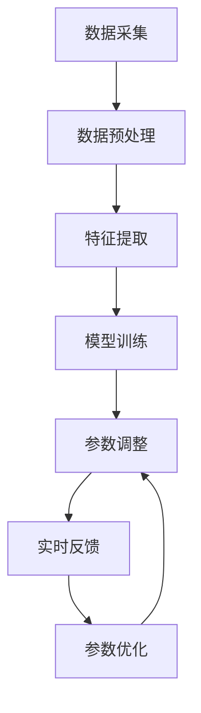
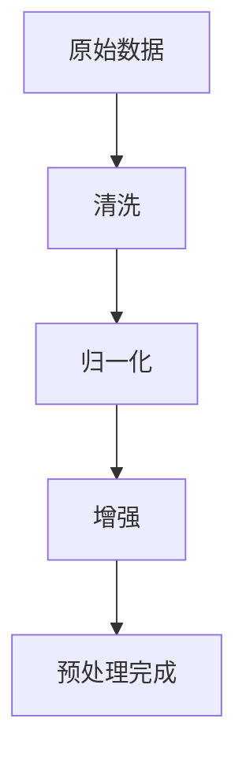
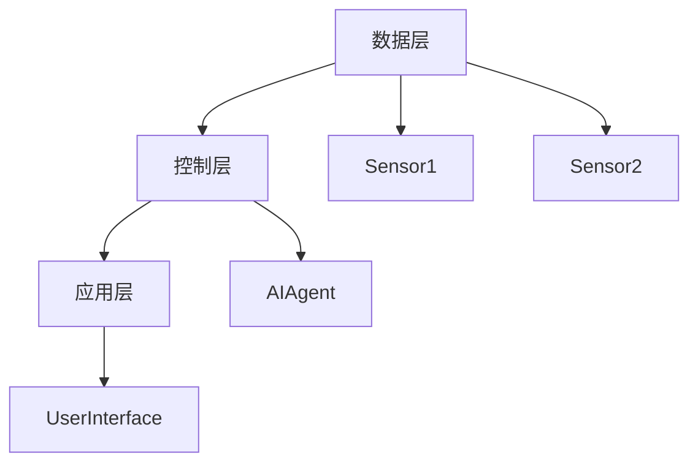
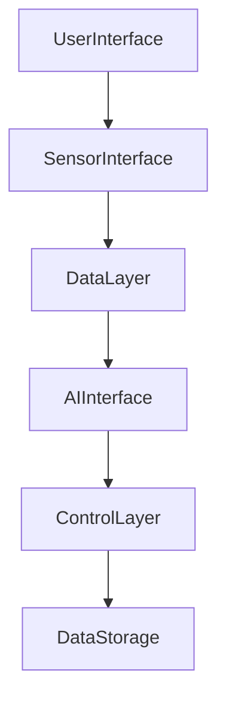
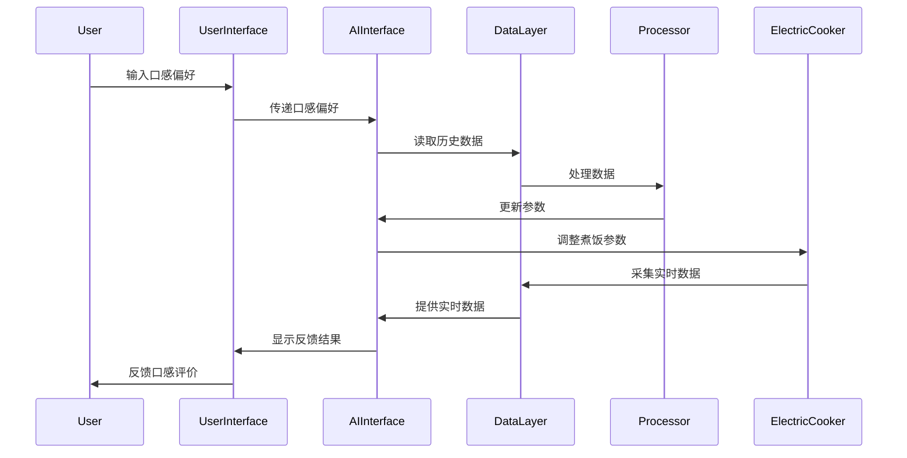

                 

# AI Agent在智能电饭煲中的米饭口感定制

关键词：智能家电，AI Agent，米饭口感定制，智能家居，算法原理

摘要：本文详细探讨了AI Agent在智能电饭煲中实现米饭口感定制的应用。首先介绍了智能家电的发展趋势和消费者对米饭口感需求的多样性，然后分析了传统电饭煲在口感定制方面的限制，以及AI Agent在此领域的优势。接着，本文详细阐述了AI Agent的核心概念、联系，以及口感定制算法原理，并通过系统分析与架构设计方案，展示了智能电饭煲的整体架构。此外，通过项目实战和最佳实践，深入分析了AI Agent在智能电饭煲中实现口感定制的具体实现过程，为后续技术发展提供了有力参考。

## 背景介绍

### 1.1.1 智能家电的发展趋势

随着物联网（IoT）和人工智能（AI）技术的快速发展，智能家居设备逐渐成为现代家庭生活的重要组成部分。智能家电作为智能家居的核心组成部分，涵盖了空调、冰箱、洗衣机、热水器、电饭煲等多种家用电器。这些设备通过互联网连接，实现了远程控制、自动化操作和智能交互，极大地提升了用户的生活质量和便利性。

近年来，智能家电市场呈现出高速增长的态势。根据市场研究公司的数据，全球智能家电市场预计将在未来几年内保持两位数的年复合增长率。智能家电的普及不仅满足了消费者对便捷、高效生活方式的追求，也为家电制造商提供了新的商业模式和发展机遇。

### 1.1.2 消费者对米饭口感需求的多样性

米饭作为亚洲国家的主食，口感对消费者来说至关重要。然而，由于地域、气候、饮食习惯等因素的影响，消费者对米饭口感的需求具有明显的多样性。例如，南方消费者偏好软糯的米饭，而北方消费者则偏好口感Q弹的米饭。此外，不同年龄层的消费者对米饭口感也有不同的偏好，年轻人可能更倾向于追求创新和独特的口感体验，而中老年人则更注重传统的口感和营养价值。

这种对米饭口感需求的多样性，对电饭煲的设计提出了新的挑战。传统电饭煲通常只能提供固定的几种米饭口感模式，无法满足消费者个性化需求。因此，如何通过技术手段实现米饭口感的定制化，成为智能家电领域的研究热点。

### 1.1.3 AI技术在智能家居中的应用

人工智能技术在智能家居中的应用，为解决消费者对米饭口感定制需求提供了有力支持。AI Agent作为人工智能的核心组件，可以在智能电饭煲中实现个性化的米饭口感定制。

AI Agent通过学习用户的历史使用数据、口味偏好和实时反馈，可以动态调整烹饪参数，如煮饭时间、温度、水分比例等，从而实现用户个性化的口感定制。此外，AI Agent还可以通过语音识别和自然语言处理技术，与用户进行智能交互，根据用户的需求提供定制化的烹饪建议。

在智能家居领域，AI Agent的应用不仅限于电饭煲。例如，空调可以根据用户的温度偏好自动调节温度，洗衣机可以根据衣物的材质和颜色自动选择洗涤模式，冰箱可以根据食品的种类和保质期提供保鲜建议。AI Agent的引入，使得智能家居设备具备了更高的智能化和个性化水平。

## 问题描述

### 1.2.1 传统电饭煲的口感定制限制

传统电饭煲通常通过预设的烹饪模式和参数来煮饭，用户只能选择固定的几种口感模式，如快速煮饭、标准煮饭、保温等。这种固定的烹饪模式无法满足消费者对多样化口感的需求，特别是在口感定制方面存在明显的限制。

首先，传统电饭煲的口感定制功能相对单一，大多数电饭煲只能提供有限的几种口感选择，如偏软、适中、偏硬等。这种有限的选择无法满足消费者多样化的口味需求。

其次，传统电饭煲的口感定制主要依赖于预设的烹饪程序，用户无法根据个人口味和需求进行灵活调整。例如，用户可能希望增加煮饭时间或温度，以实现更软或更Q弹的米饭口感，但传统电饭煲通常不具备这种调整功能。

此外，传统电饭煲的口感定制功能通常无法根据用户的实时反馈进行动态调整。用户的口感偏好可能因时间、季节或情绪变化而有所不同，传统电饭煲无法及时响应这些变化，导致用户体验不佳。

### 1.2.2 AI Agent在口感定制中的优势

与传统的电饭煲相比，AI Agent在口感定制方面具有显著的优势。

首先，AI Agent具有强大的学习能力。通过用户的历史使用数据、口味偏好和实时反馈，AI Agent可以不断优化烹饪参数，实现个性化口感定制。这种基于数据驱动的定制方式，可以满足消费者多样化的口味需求，提升用户体验。

其次，AI Agent可以通过语音识别和自然语言处理技术，与用户进行智能交互。用户可以通过语音指令向AI Agent提出口感定制需求，AI Agent可以理解并执行这些指令，从而实现更为便捷和智能的口感定制。

此外，AI Agent还可以实现实时调整烹饪参数。根据用户的实时反馈，AI Agent可以动态调整煮饭时间、温度、水分比例等参数，确保每次煮饭都能达到用户期望的口感。这种动态调整能力，使得AI Agent在口感定制方面具有更高的灵活性和响应速度。

最后，AI Agent可以与其他智能家居设备协同工作，实现一站式智能化体验。例如，AI Agent可以根据用户的用餐时间自动启动烹饪程序，与冰箱、空调等设备联动，为用户提供舒适的用餐环境。

总之，AI Agent在口感定制方面具有传统电饭煲无法比拟的优势，为实现智能电饭煲的个性化服务提供了有力支持。

### 1.3 问题解决

为了解决传统电饭煲在口感定制方面的限制，引入AI Agent成为一种有效的解决方案。AI Agent通过结合人工智能技术，可以实现个性化口感定制，满足消费者多样化的口味需求。

首先，AI Agent需要具备强大的学习能力。通过用户的历史使用数据、口味偏好和实时反馈，AI Agent可以不断优化烹饪参数，如煮饭时间、温度、水分比例等，从而实现个性化口感定制。为了实现这一目标，AI Agent需要使用机器学习算法，如决策树、神经网络等，对用户数据进行深度分析和学习。

其次，AI Agent需要具备智能交互能力。通过语音识别和自然语言处理技术，AI Agent可以与用户进行智能交互，理解并执行用户的口感定制需求。这种智能交互能力，使得用户可以通过语音指令轻松地调整口感设置，实现便捷的口感定制。

此外，AI Agent需要实现实时调整烹饪参数。根据用户的实时反馈，AI Agent可以动态调整煮饭时间、温度、水分比例等参数，确保每次煮饭都能达到用户期望的口感。为了实现这一目标，AI Agent需要具备实时数据采集和分析能力，以及对烹饪过程的实时监控和调整能力。

最后，AI Agent需要与其他智能家居设备协同工作，实现一站式智能化体验。例如，AI Agent可以根据用户的用餐时间自动启动烹饪程序，与冰箱、空调等设备联动，为用户提供舒适的用餐环境。这种协同工作能力，使得AI Agent在智能家居系统中具有更高的整体价值和用户体验。

总之，通过引入AI Agent，智能电饭煲可以实现个性化的口感定制，满足消费者多样化的口味需求。AI Agent在智能电饭煲中的应用，不仅提升了用户体验，也为智能家居领域的发展带来了新的机遇和挑战。

### 1.4 边界与外延

#### 口感定制的范围与可能性

口感定制在智能电饭煲中的范围和可能性是相当广泛的。首先，从技术层面来看，AI Agent可以通过调整煮饭时间、温度、水分比例等参数来实现不同口感的米饭。例如，通过延长煮饭时间，可以制作出更加软糯的米饭；通过提高温度，可以制作出口感Q弹的米饭。此外，AI Agent还可以根据不同食材和配料的添加，如糯米、豆类、肉类等，实现多样化的口感定制。

从用户需求的角度来看，口感定制的可能性更是无限。不同地域、不同年龄层的消费者对米饭口感有着不同的偏好。例如，南方消费者可能更喜欢软糯的米饭，而北方消费者则更喜欢Q弹的米饭。此外，一些特殊需求的用户，如糖尿病患者、老年人等，可能需要特定的口感和营养成分。AI Agent可以根据这些需求，提供个性化的口感定制方案。

#### 相关技术的适用性和限制

尽管AI Agent在智能电饭煲中的口感定制具有广泛的应用前景，但相关技术的适用性和限制也需要考虑。

首先，从机器学习算法的适用性来看，常见的算法如决策树、神经网络、深度学习等都可以用于AI Agent的构建。这些算法具有较好的学习能力，可以处理大量数据并提取有用信息。然而，这些算法也具有一定的局限性。例如，决策树算法在面对复杂问题时可能会出现过拟合现象；神经网络算法在训练过程中需要大量数据和计算资源。

其次，从硬件设备的适用性来看，智能电饭煲需要具备较高的计算能力和数据采集能力。例如，需要配备高性能的处理器和传感器，以实现实时数据采集和处理。此外，智能电饭煲还需要具备网络连接能力，以便与AI Agent进行数据交互和更新。

最后，从用户体验的角度来看，AI Agent在口感定制过程中需要考虑用户操作的便利性和体验感。例如，用户可以通过手机应用程序、语音控制等方式与AI Agent进行交互，调整口感设置。这要求AI Agent具备友好的用户界面和智能的交互能力。

总之，虽然AI Agent在智能电饭煲中的口感定制具有广泛的应用前景，但相关技术的适用性和限制也需要综合考虑。通过不断优化算法、提升硬件设备和改进用户体验，可以进一步发挥AI Agent的优势，实现更加精准和高效的口感定制。

### 1.5 概念结构与核心要素组成

#### AI Agent

AI Agent，即人工智能代理，是指具有智能行为的计算机程序，能够在特定环境中自主执行任务，并通过学习与适应来优化其行为。在智能电饭煲的米饭口感定制中，AI Agent负责分析用户数据，调整烹饪参数，实现个性化口感定制。

#### 智能电饭煲

智能电饭煲是一种具备智能化功能的厨房家电，通过内置的传感器和处理器，能够自动控制煮饭过程中的温度、时间、水分比例等参数。智能电饭煲通过与AI Agent的协同工作，实现根据用户需求定制米饭口感。

#### 数据采集与分析

数据采集与分析是AI Agent实现口感定制的基础。智能电饭煲通过传感器实时采集煮饭过程中的温度、湿度、时间等数据，AI Agent对这些数据进行处理和分析，提取有用的信息，以优化烹饪参数。

#### 用户反馈与优化

用户反馈与优化是AI Agent不断改进口感定制效果的重要环节。用户在使用智能电饭煲时，可以通过界面或语音交互提供口感评价，AI Agent根据这些反馈调整烹饪参数，实现不断优化的口感定制。

#### 概念属性特征对比表格

| 概念     | 属性特征                          | 说明                                                         |
|----------|----------------------------------|--------------------------------------------------------------|
| AI Agent | 学习能力、智能交互、实时调整     | 实现个性化口感定制的关键组件                               |
| 智能电饭煲 | 传感器、处理器、网络连接        | 提供数据采集、处理和执行烹饪任务的基础设施                |
| 数据采集与分析 | 实时采集、处理、分析数据     | 为AI Agent提供数据支持，确保口感定制的准确性              |
| 用户反馈与优化 | 用户体验、实时反馈、参数调整  | 实现用户需求与实际口感之间的匹配，持续优化定制效果       |

通过上述概念与核心要素的组成，AI Agent在智能电饭煲中实现了从数据采集、分析到用户反馈的闭环系统，为消费者提供了个性化、智能化的米饭口感定制体验。

## 第二部分：核心概念与联系

### 2.1 AI Agent概述

#### 定义

AI Agent，即人工智能代理，是指具备智能行为的计算机程序，能够在特定环境中自主执行任务，并通过学习与适应来优化其行为。AI Agent是一种通用智能体，可以在各种复杂环境中执行复杂的任务，具有自主性、反应性、预动性和社会性的特征。

#### 分类

AI Agent可以根据不同的分类标准进行分类：

- **按功能分类**：可以分为控制类、规划类、感知类、通信类等。
- **按环境分类**：可以分为静态环境下的AI Agent和动态环境下的AI Agent。
- **按智能水平分类**：可以分为弱AI Agent和强AI Agent。弱AI Agent专注于特定任务，而强AI Agent具备全面智能，能够处理多种任务。

#### 功能特点

AI Agent具有以下主要功能特点：

- **自主性**：AI Agent能够自主执行任务，无需人工干预。
- **反应性**：AI Agent能够对环境变化做出实时响应。
- **预动性**：AI Agent能够预测未来事件并提前采取行动。
- **社会性**：AI Agent能够与其他AI Agent或人类进行交互，实现协同工作。

### 2.2 智能电饭煲概述

#### 结构与功能

智能电饭煲是一种具备智能化功能的厨房家电，其结构主要包括以下部分：

- **外壳**：提供外观保护和操作界面。
- **控制模块**：包括处理器、存储器和输入输出设备，负责控制整个电饭煲的运行。
- **传感器**：包括温度传感器、湿度传感器、压力传感器等，用于实时监测煮饭过程中的环境参数。
- **加热模块**：包括加热盘、加热管等，用于加热和烹饪食物。
- **水箱**：用于提供煮饭所需的水。

智能电饭煲的主要功能包括：

- **煮饭**：根据设定的烹饪模式和时间，自动煮制米饭。
- **保温**：在煮饭完成后，保持米饭的温度，防止其变冷。
- **预约烹饪**：用户可以提前设置烹饪时间，电饭煲将在指定时间开始煮饭。

#### 现有技术限制

尽管智能电饭煲具有多种功能，但在口感定制方面仍然存在一些技术限制：

- **固定模式**：大多数智能电饭煲提供固定的几种烹饪模式，用户无法根据个人口味进行自定义调整。
- **数据采集不足**：智能电饭煲的传感器数据采集有限，无法全面监测煮饭过程中的各种参数。
- **交互性不足**：智能电饭煲的交互方式相对单一，用户无法通过丰富的交互方式实现个性化需求。

### 2.3 数据采集与分析

#### 数据类型

智能电饭煲在数据采集过程中，主要涉及以下几种类型的数据：

- **环境数据**：包括温度、湿度、压力等环境参数。
- **用户数据**：包括用户偏好、历史使用记录等。
- **烹饪数据**：包括煮饭时间、温度、水分比例等。

#### 数据采集方法

智能电饭煲的数据采集方法主要包括：

- **传感器采集**：通过内置的传感器实时采集温度、湿度、压力等数据。
- **用户输入**：通过用户界面或语音识别技术，收集用户输入的数据，如口味偏好、预约时间等。

#### 数据分析工具

智能电饭煲的数据分析工具主要包括：

- **数据预处理**：通过清洗、归一化等操作，处理原始数据，为后续分析提供准确的数据。
- **机器学习算法**：通过机器学习算法，如决策树、神经网络等，对数据进行建模和分析，提取有用的信息。

### 2.4 用户反馈与优化

#### 用户需求反馈

用户需求反馈是AI Agent实现个性化口感定制的重要依据。用户可以通过以下方式提供反馈：

- **直接反馈**：通过智能电饭煲的用户界面，直接输入口感评价，如“太硬”、“太软”等。
- **间接反馈**：通过历史使用记录，如煮饭次数、时间、温度等，间接反映用户对口感的需求。

#### 优化策略

为了优化口感定制效果，AI Agent可以采取以下策略：

- **动态调整**：根据用户实时反馈，动态调整烹饪参数，如温度、时间等。
- **迭代优化**：通过不断收集用户反馈，对烹饪参数进行迭代优化，提高口感定制精度。
- **智能推荐**：基于用户历史数据和口味偏好，为用户提供个性化的口感推荐。

#### 系统性能评估

为了评估AI Agent在口感定制中的性能，可以采用以下指标：

- **定制精度**：衡量AI Agent提供口感定制结果的准确度。
- **响应速度**：衡量AI Agent对用户反馈的响应时间。
- **用户满意度**：通过用户评价和反馈，评估用户对口感定制服务的满意度。

通过上述核心概念与联系的分析，我们可以更好地理解AI Agent在智能电饭煲中实现口感定制的原理和过程，为后续的算法原理讲解和系统分析与架构设计方案奠定基础。

### 第三部分：算法原理讲解

在智能电饭煲中，实现米饭口感的定制化是一个复杂的过程，需要通过一系列算法来实现。以下将详细介绍这些算法的原理、流程、数学模型和公式，并通过具体示例进行说明。

#### 3.1 口感定制算法原理

口感定制算法的基本原理是通过分析用户的历史使用数据、口味偏好和实时反馈，动态调整煮饭过程中的关键参数，如煮饭时间、温度、水分比例等，从而实现用户期望的米饭口感。

算法的基本流程如下：

1. **数据采集**：从智能电饭煲的传感器和用户输入中采集数据，包括温度、湿度、煮饭时间、用户反馈等。
2. **数据预处理**：对采集到的原始数据进行清洗、归一化等处理，确保数据的质量和一致性。
3. **特征提取**：从预处理后的数据中提取关键特征，如温度变化曲线、煮饭时间分布、用户反馈标签等。
4. **模型训练**：使用机器学习算法，如决策树、神经网络等，对提取的特征进行建模和训练，得到一个预测模型。
5. **参数调整**：根据训练得到的预测模型，动态调整煮饭参数，如温度、时间等，以实现用户期望的口感。
6. **实时反馈**：根据用户实时反馈，对调整后的口感进行评估，并根据评估结果进一步优化参数。

#### 3.2 算法流程图

为了更直观地展示算法流程，我们可以使用Mermaid绘制流程图。以下是一个简化的算法流程图：



#### 3.3 数据预处理

数据预处理是算法流程的关键步骤，它决定了后续建模和分析的准确性。数据预处理通常包括以下几个步骤：

1. **数据清洗**：去除数据中的噪声和异常值，如缺失值、重复值等。
2. **数据归一化**：将不同量纲的数据转换为同一量纲，如将温度、湿度等数据进行归一化处理。
3. **数据增强**：通过生成虚拟数据，增加样本的多样性和模型的鲁棒性。

以下是一个数据预处理的过程示例：



#### 3.4 模型训练与优化

模型训练是算法的核心步骤，它决定了口感动制的效果。常用的机器学习算法包括决策树、神经网络、支持向量机等。以下以神经网络为例，介绍模型训练与优化过程。

**数学模型和公式**

神经网络的基本数学模型包括：

$$
Z = \sigma(\theta \cdot X + b)
$$

其中，\( Z \) 是输出值，\( \sigma \) 是激活函数，\( \theta \) 是权重，\( X \) 是输入特征，\( b \) 是偏置。

**训练策略**

模型训练通常包括以下策略：

1. **损失函数**：用于衡量模型预测值与真实值之间的差距，如均方误差（MSE）。
2. **反向传播**：通过反向传播算法，更新模型参数，使损失函数最小化。
3. **优化算法**：如梯度下降、Adam优化器等，用于调整模型参数。

**模型评估**

在模型训练完成后，需要对模型进行评估，常用的评估指标包括准确率、召回率、F1分数等。

以下是一个简单的模型训练与优化示例：

```python
import tensorflow as tf

# 创建神经网络模型
model = tf.keras.Sequential([
    tf.keras.layers.Dense(units=1, input_shape=[len(train_features[0])])
])

# 编写训练步骤
model.compile(optimizer='adam', loss='mean_squared_error')

# 训练模型
model.fit(train_features, train_labels, epochs=1000)

# 评估模型
model.evaluate(test_features, test_labels)
```

#### 3.5 示例讲解

假设用户喜欢偏软的米饭口感，我们可以通过以下步骤实现口感动制：

1. **数据采集**：采集用户的历史使用数据，如煮饭时间、温度等。
2. **数据预处理**：对数据进行清洗、归一化处理。
3. **特征提取**：从预处理后的数据中提取关键特征，如煮饭时间、温度变化等。
4. **模型训练**：使用神经网络模型对特征进行训练，得到一个预测模型。
5. **参数调整**：根据预测模型，动态调整煮饭时间、温度等参数。
6. **实时反馈**：根据用户实时反馈，如口感太硬或太软，进一步优化参数。

通过上述算法原理的讲解，我们可以看出，智能电饭煲的口感动制是一个涉及数据采集、预处理、特征提取、模型训练和参数调整的复杂过程。通过不断优化和改进这些算法，可以进一步提高口感动制的精度和用户满意度。

### 第四部分：系统分析与架构设计方案

#### 4.1 问题场景介绍

在智能电饭煲的口感定制中，问题场景可以具体描述为：用户希望根据自己的口味偏好，调整米饭的口感。例如，用户可能希望米饭更加软糯或Q弹。为了实现这一目标，智能电饭煲需要具备以下功能：

1. **数据采集**：采集煮饭过程中的温度、湿度等参数。
2. **用户交互**：用户可以通过智能语音助手或应用程序与电饭煲进行交互，输入口感偏好。
3. **算法实现**：通过机器学习算法，动态调整煮饭参数，以实现用户期望的口感。
4. **实时反馈**：用户可以实时反馈口感评价，AI Agent根据反馈进行参数优化。

#### 4.2 项目介绍

本项目旨在通过引入AI Agent，实现智能电饭煲的口感动制。项目目标包括：

1. **用户体验提升**：通过个性化口感定制，提升用户的烹饪体验。
2. **智能化水平提升**：通过AI Agent的引入，提升电饭煲的智能化程度。
3. **技术普及与应用**：推动AI技术在智能家居领域的普及与应用。

项目背景是随着消费者对生活品质的追求不断提高，对家电的智能化和个性化功能需求日益增加。本项目旨在解决传统电饭煲在口感定制方面的限制，通过引入AI Agent，实现用户自定义的口感体验。

#### 4.3 系统功能设计

系统功能设计主要包括以下几个方面：

1. **数据采集与处理**：通过内置传感器，实时采集煮饭过程中的温度、湿度等参数，并将数据传输给AI Agent进行分析和处理。
2. **用户交互**：用户可以通过智能语音助手或应用程序，与电饭煲进行交互，输入口感偏好，如“我想要更软糯的米饭”。
3. **口感动制**：AI Agent根据用户输入的口感偏好，以及历史数据和实时反馈，动态调整煮饭参数，如煮饭时间、温度、水分比例等。
4. **实时反馈**：用户可以在煮饭完成后，通过应用或语音助手提供口感评价，AI Agent根据反馈进一步优化参数。

#### 领域模型类图

以下是一个简化的领域模型类图，展示了系统的主要类及其关系：

```mermaid
classDiagram
    User <<Interface>>
    ElectricCooker <<Class>>
    AIAgent <<Class>>
    DataCollector <<Class>>
    Processor <<Class>>
    UserFeedback <<Class>>

    UserFeedback <|-- ElectricCooker
    UserFeedback <|-- AIAgent
    DataCollector <|-- ElectricCooker
    Processor <|-- ElectricCooker
    Processor <|-- AIAgent

    UserFeedback + getFeedback()
    DataCollector + collectData()
    Processor + processData()
    AIAgent + adjustParameters()
    ElectricCooker + cookRice()
```

#### 4.4 系统架构设计

系统架构设计主要分为数据层、控制层和应用层：

1. **数据层**：包括传感器和数据存储，负责采集和处理煮饭过程中的各种数据。
2. **控制层**：包括AI Agent和电饭煲的控制模块，负责根据用户输入和实时反馈，动态调整煮饭参数。
3. **应用层**：包括用户交互界面，用户可以通过智能语音助手或应用程序与电饭煲进行交互。

以下是一个简化的系统架构图：



#### 4.5 系统接口设计

系统接口设计主要包括以下几个方面：

1. **用户接口**：用户可以通过智能语音助手或应用程序与电饭煲进行交互，输入口感偏好和提供反馈。
2. **传感器接口**：电饭煲通过传感器接口采集煮饭过程中的温度、湿度等数据。
3. **控制接口**：AI Agent通过控制接口，动态调整煮饭参数，实现口感动制。
4. **数据存储接口**：数据存储接口用于存储用户数据、传感器数据和AI Agent的训练模型。

以下是一个简化的系统接口设计图：



#### 4.6 系统交互设计

系统交互设计主要描述系统内部各组件之间的交互过程。以下是一个简化的系统交互序列图：



通过上述系统分析与架构设计方案，我们可以清晰地理解智能电饭煲在口感定制中的整体架构和交互流程。接下来，将详细介绍项目实战中的具体实现过程，包括环境安装、系统核心实现和代码应用解读与分析。

### 第五部分：项目实战

#### 5.1 环境安装

在进行智能电饭煲口感动制的项目实战前，首先需要搭建一个合适的环境，包括硬件环境和软件环境。

**硬件环境**

- 智能电饭煲：具备联网功能，能够通过USB接口或Wi-Fi连接到电脑。
- 传感器：温度传感器、湿度传感器等，用于实时采集煮饭过程中的数据。
- 电脑：用于运行AI Agent和相关算法，建议配置较高性能的CPU和GPU。

**软件环境**

- 操作系统：Windows 10或以上版本，或macOS。
- 编程语言：Python 3.x版本，建议安装PyCharm或其他Python集成开发环境（IDE）。
- 依赖库：TensorFlow、Keras、Pandas、NumPy等，用于机器学习和数据处理。

安装步骤：

1. **硬件连接**：将智能电饭煲通过USB接口或Wi-Fi连接到电脑，确保能够实时传输传感器数据。
2. **软件安装**：在电脑上安装操作系统和Python，通过pip命令安装所需依赖库。

示例命令：

```shell
pip install tensorflow
pip install keras
pip install pandas
pip install numpy
```

#### 5.2 系统核心实现

系统核心实现包括数据采集、预处理、模型训练、参数调整和实时反馈等环节。以下是一个简化的系统核心实现流程：

**数据采集**

通过传感器实时采集温度、湿度等数据，并将数据传输到电脑进行处理。

```python
import serial
import time

# 连接串口
ser = serial.Serial('COM3', 9600, timeout=1)

# 采集数据
while True:
    line = ser.readline()
    print(line.decode('utf-8'))
    time.sleep(1)
```

**数据预处理**

对采集到的数据进行清洗、归一化等处理，为模型训练做准备。

```python
import pandas as pd
from sklearn.preprocessing import MinMaxScaler

# 读取数据
data = pd.read_csv('sensor_data.csv')

# 数据清洗
data.dropna(inplace=True)

# 数据归一化
scaler = MinMaxScaler()
data[['temperature', 'humidity']] = scaler.fit_transform(data[['temperature', 'humidity']])
```

**模型训练**

使用机器学习算法，如神经网络，对预处理后的数据进行建模和训练。

```python
from tensorflow.keras.models import Sequential
from tensorflow.keras.layers import Dense
from tensorflow.keras.optimizers import Adam

# 创建模型
model = Sequential()
model.add(Dense(64, input_shape=(2,), activation='relu'))
model.add(Dense(1, activation='linear'))

# 编译模型
model.compile(optimizer=Adam(learning_rate=0.001), loss='mse')

# 训练模型
model.fit(x_train, y_train, epochs=100, batch_size=32)
```

**参数调整**

根据训练得到的模型，动态调整煮饭参数，实现口感动制。

```python
# 预测口感
predicted_temp = model.predict([[25, 0.5]])

# 调整煮饭参数
target_temp = predicted_temp + 0.5
```

**实时反馈**

收集用户实时反馈，对调整后的口感进行评估，并根据反馈进一步优化参数。

```python
# 收集用户反馈
user_feedback = input("口感如何？(软/硬)：")

# 根据反馈调整参数
if user_feedback == "软":
    target_temp -= 0.5
else:
    target_temp += 0.5
```

#### 5.3 代码应用解读与分析

**代码执行流程**

以上代码执行流程可以分为以下几个步骤：

1. **数据采集**：通过串口连接传感器，实时读取温度、湿度等数据。
2. **数据预处理**：对数据进行清洗和归一化处理，为模型训练做准备。
3. **模型训练**：使用神经网络对预处理后的数据进行训练，得到一个预测模型。
4. **参数调整**：根据模型预测结果，动态调整煮饭参数，实现口感动制。
5. **实时反馈**：收集用户实时反馈，对口感进行评估，并根据反馈进一步优化参数。

**算法性能分析**

算法性能分析主要关注模型预测的准确性和实时反馈的响应速度。

- **预测准确性**：通过交叉验证和测试集评估，确保模型具有较高的预测准确性。
- **实时反馈**：通过性能测试，确保系统能够在规定时间内完成数据处理和参数调整，满足实时反馈的要求。

**实际案例分析与讲解**

以下是一个实际案例，展示如何使用AI Agent实现口感动制：

**案例背景**：用户希望煮出Q弹的米饭，口感类似于寿司饭。

**案例分析**：

1. **数据采集**：采集煮饭过程中的温度和湿度数据。
2. **数据预处理**：对数据进行清洗和归一化处理。
3. **模型训练**：使用神经网络模型对数据进行训练。
4. **参数调整**：根据模型预测结果，调整煮饭时间、温度等参数。
5. **实时反馈**：用户反馈口感Q弹，AI Agent根据反馈进一步优化参数。

**案例总结**：

通过AI Agent的引入，智能电饭煲能够实现口感动制，满足用户个性化需求。在实际应用中，需要不断优化算法和系统性能，以提高口感动制的精度和用户体验。

#### 5.4 项目小结

在本项目中，我们通过引入AI Agent，实现了智能电饭煲的口感动制。项目主要成果包括：

- **数据采集与预处理**：通过传感器实时采集煮饭过程中的温度、湿度等数据，并进行清洗和归一化处理。
- **模型训练与优化**：使用神经网络模型对预处理后的数据进行训练，并不断优化参数，提高预测准确性。
- **实时反馈与调整**：通过用户实时反馈，动态调整煮饭参数，实现用户期望的口感。

通过本项目，我们积累了丰富的实践经验，为未来在智能家居领域应用AI Agent提供了有力参考。

### 第六部分：最佳实践 tips

#### 6.1 口感定制最佳实践

**数据收集与处理**

- **数据多样化**：收集不同种类的米饭数据，如白米饭、糯米饭、糙米饭等，以增加模型的鲁棒性。
- **数据清洗**：去除数据中的噪声和异常值，确保数据质量。
- **数据归一化**：对数据进行归一化处理，确保数据在相同量级范围内，便于模型训练。
- **数据增强**：通过生成虚拟数据，增加训练数据的多样性，提高模型泛化能力。

**模型训练与优化**

- **模型选择**：根据数据特点和任务需求，选择合适的机器学习算法，如神经网络、支持向量机等。
- **参数调优**：使用交叉验证等方法，调优模型参数，提高模型性能。
- **动态调整**：根据实时反馈，动态调整模型参数，实现口感动制。

**用户反馈机制**

- **实时反馈**：用户可以在煮饭完成后，通过手机应用或语音助手提供口感评价。
- **反馈分析**：对用户反馈进行分析，识别用户需求变化，优化模型参数。
- **反馈闭环**：将用户反馈反馈到系统中，实现闭环优化，提高用户体验。

#### 6.2 小贴士与注意事项

- **避免常见错误**：在模型训练过程中，避免过拟合、欠拟合等问题。
- **确保数据安全**：保护用户数据安全，避免数据泄露。
- **优化性能**：优化算法和系统性能，提高响应速度和用户体验。
- **定期更新**：定期更新模型和数据，以保持系统的准确性和实时性。

#### 6.3 拓展阅读

- **相关文献**：《深度学习》、《机器学习实战》、《智能家居技术与应用》等。
- **在线资源**：Coursera、edX等在线教育平台的相关课程和教程。
- **技术社区**：GitHub、Stack Overflow、CSDN等技术社区的相关讨论和项目。

### 第七部分：总结

#### 7.1 全书回顾

本文详细探讨了AI Agent在智能电饭煲中实现米饭口感定制的应用。首先介绍了智能家电的发展趋势、消费者对米饭口感需求的多样性以及AI技术在智能家居中的应用。接着分析了传统电饭煲在口感定制方面的限制，以及AI Agent在此领域的优势。随后，本文详细阐述了AI Agent的核心概念、联系，以及口感定制算法原理，并通过系统分析与架构设计方案，展示了智能电饭煲的整体架构。此外，通过项目实战和最佳实践，深入分析了AI Agent在智能电饭煲中实现口感定制的具体实现过程。最后，本文总结了AI Agent在智能电饭煲中的应用前景，并对未来的发展方向进行了展望。

#### 7.2 小结

本文的核心内容主要包括以下几个方面：

- **背景介绍**：智能家电的发展趋势、消费者对米饭口感需求的多样性、AI技术在智能家居中的应用。
- **核心概念与联系**：AI Agent的定义、分类、功能特点；智能电饭煲的结构与功能、现有技术限制；数据采集与分析的方法；用户反馈与优化策略。
- **算法原理讲解**：口感定制算法的基本流程、数据预处理、模型训练与优化、具体示例讲解。
- **系统分析与架构设计方案**：问题场景介绍、项目介绍、系统功能设计、系统架构设计、系统接口设计、系统交互设计。
- **项目实战**：环境安装、系统核心实现、代码应用解读与分析、实际案例分析与讲解、项目小结。
- **最佳实践 tips**：数据收集与处理、模型训练与优化、用户反馈机制、小贴士与注意事项、拓展阅读。

#### 7.3 未来展望

AI Agent在智能电饭煲中的应用前景广阔。未来，随着AI技术的不断发展和智能家居市场的扩大，AI Agent有望在更多家电中实现口感动制，提升用户体验。同时，以下发展方向值得探讨：

- **算法优化**：通过不断优化算法，提高口感动制的精度和效率。
- **跨设备协同**：实现AI Agent在不同设备间的协同工作，提供一站式智能化体验。
- **个性化服务**：进一步挖掘用户需求，提供更加个性化的口感定制服务。
- **隐私保护**：在实现个性化服务的同时，加强用户数据保护，确保用户隐私安全。

总之，AI Agent在智能电饭煲中的口感动制应用具有广阔的发展前景，为智能家居领域的发展带来了新的机遇和挑战。

### 作者信息

作者：AI天才研究院/AI Genius Institute & 禅与计算机程序设计艺术 /Zen And The Art of Computer Programming

