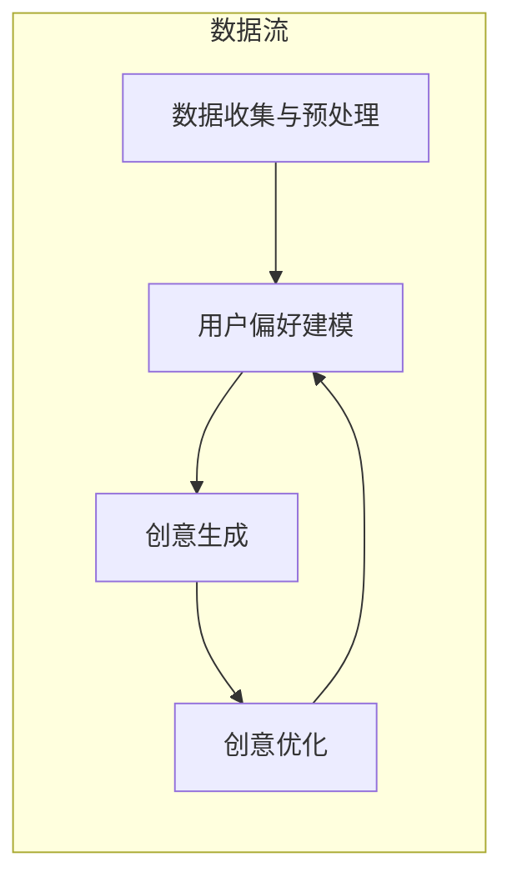
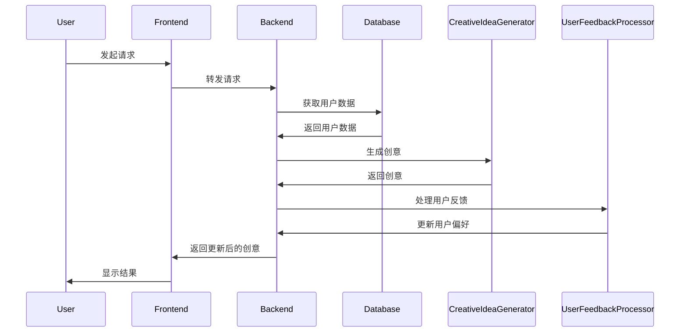
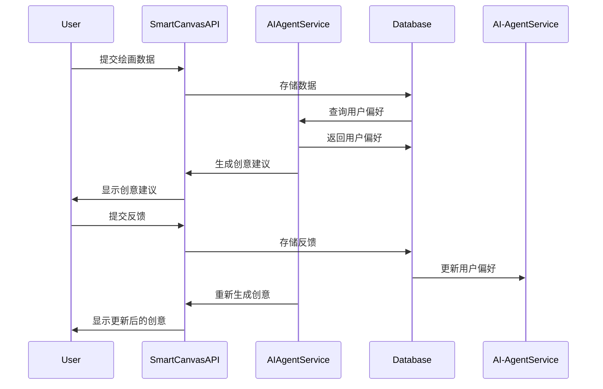

                 

### 引言

在数字化时代，人工智能（AI）已经成为推动科技发展的关键力量。随着AI技术的不断成熟，其在各个领域的应用也日益广泛。其中，AI Agent作为一个能够自主决策和执行任务的智能体，正逐渐成为智能系统的重要组成部分。特别是在创意激发领域，AI Agent的应用潜力尤为显著。

本文将聚焦于《AI Agent在智能画板中的创意激发系统》，通过深入分析和推理，探讨这一系统的工作原理、核心算法、系统架构以及实际应用。文章结构如下：

- **第一部分：AI Agent概述**：介绍AI Agent的概念与分类，探讨创意激发系统的基础知识及其在智能画板中的应用场景。
- **第二部分：AI Agent创意激发原理详解**：详细讲解AI Agent创意激发的数学模型和算法原理，并通过具体示例进行解释。
- **第三部分：系统分析与架构设计方案**：介绍系统应用的具体场景，展示系统的功能模块和整体架构，并分析系统接口和交互。
- **第四部分：项目实战**：提供系统环境安装步骤、核心代码实现、案例分析与项目小结。
- **第五部分：最佳实践、小结与拓展阅读**：总结文章主要内容，提供使用建议和进一步学习资源。

通过这一系列的分析和推理，我们旨在为读者提供一个全面、深入的理解，帮助读者掌握AI Agent在智能画板中创意激发系统的核心概念和实践应用。

### 关键词

- **AI Agent**
- **智能画板**
- **创意激发系统**
- **数学模型**
- **算法原理**
- **系统架构**
- **应用场景**
- **用户交互**

### 摘要

本文深入探讨了AI Agent在智能画板中的创意激发系统的设计和实现。首先，我们介绍了AI Agent的概念及其分类，详细分析了创意激发系统的基础知识和应用场景。接着，本文重点讲解了AI Agent创意激发的数学模型和算法原理，通过mermaid流程图和Python源代码示例进行了详细阐述。随后，文章展示了系统的应用场景、功能模块和整体架构，并通过mermaid类图、架构图和序列图进行了直观说明。最后，本文通过一个具体案例展示了系统的实际应用，并总结了项目的成果与经验。文章还提供了最佳实践建议和小结，为读者进一步学习和实践提供了方向。

## 第一部分：AI Agent概述

### 1.1 AI Agent的概念与分类

AI Agent，即人工智能代理，是一种能够模拟人类行为、具有自主决策能力的智能体。AI Agent通常在复杂环境中运行，通过感知环境、分析信息并作出决策，以实现特定目标。AI Agent的概念源自于人工智能领域的研究，特别是关于智能代理和自主系统的讨论。

AI Agent可以根据不同的分类标准进行分类。以下是一些常见的分类方法：

1. **基于功能分类**：
   - **任务型AI Agent**：专注于完成特定任务，如语音助手、自动驾驶汽车等。
   - **通用型AI Agent**：具备多种功能，能够处理多种任务，如Siri、Alexa等。

2. **基于智能水平分类**：
   - **弱AI Agent**：在特定领域内表现出智能，但无法扩展到其他领域，如聊天机器人。
   - **强AI Agent**：具有与人类相同的认知能力，可以处理各种复杂任务。

3. **基于决策模式分类**：
   - **规则基AI Agent**：基于预定义的规则进行决策。
   - **数据驱动AI Agent**：基于历史数据和统计分析进行决策。
   - **模型驱动AI Agent**：基于机器学习模型进行决策。

4. **基于执行方式分类**：
   - **软件AI Agent**：运行在计算机或服务器上。
   - **硬件AI Agent**：嵌入到物理设备中，如无人机、机器人等。

### 1.2 创意激发系统的基础知识

创意激发系统旨在通过技术手段激发用户的创造力和创新思维。在智能画板中，创意激发系统尤为重要，因为它可以直接影响用户的绘画和设计过程。以下是创意激发系统的一些基础概念：

1. **创意激发的定义**：
   - 创意激发是指通过外部刺激和内部心理过程，激发个体的创造力和创新思维，从而产生新颖和有创意的想法。

2. **创意激发的重要性**：
   - 在设计领域，创意激发有助于提高设计的多样性和创新性，从而满足用户的需求。
   - 在艺术创作中，创意激发能够激发艺术家的灵感，产生更具艺术价值的作品。

3. **创意激发的理论基础**：
   - **头脑风暴**：一种常见的创意激发方法，通过集体讨论和自由联想，产生大量创意。
   - **思维导图**：通过图形化的方式展示思维过程，帮助用户理清思路，激发创意。
   - **跨学科思维**：通过跨学科的知识和思维方式，激发新的创意。

### 1.3 智能画板的需求分析

智能画板是一种结合了传统绘画工具和数字技术的设备，用户可以通过数字画板进行绘画和设计。在智能画板中，创意激发系统需要满足以下需求：

1. **多样性**：
   - 智能画板需要支持多种绘画工具和材料，如笔刷、颜色、纹理等，以满足不同用户的需求。

2. **实时反馈**：
   - 创意激发系统需要能够实时对用户的创作进行反馈，提供灵感建议和创意提示。

3. **个性化**：
   - 系统应能够根据用户的历史创作记录和偏好，提供个性化的创意建议。

4. **易用性**：
   - 创意激发系统应易于使用，用户无需进行复杂的设置，即可快速获得创意。

5. **可扩展性**：
   - 系统应具有良好的可扩展性，能够随着用户需求的变化而进行功能扩展。

### 1.4 AI Agent在智能画板中的应用场景

在智能画板中，AI Agent可以发挥重要作用，通过以下方式激发用户的创意：

1. **自动生成灵感**：
   - AI Agent可以通过分析用户的历史创作记录和偏好，自动生成创意灵感的建议。

2. **辅助设计**：
   - AI Agent可以辅助用户进行设计，提供实时的设计建议和优化方案。

3. **交互式学习**：
   - AI Agent可以与用户进行交互，通过提问和解答，帮助用户深入理解绘画和设计的基本原理。

4. **个性化推荐**：
   - AI Agent可以根据用户的行为和兴趣，推荐相关的绘画教程、素材和工具。

5. **创意评估**：
   - AI Agent可以对用户的创作进行评估，提供改进建议，帮助用户提升创作水平。

### 1.5 系统的边界与外延

虽然AI Agent在智能画板中的创意激发系统具有巨大潜力，但仍然存在一些边界和限制：

1. **技术限制**：
   - 现有的AI技术可能无法完全满足创意激发的需求，尤其是在处理复杂和抽象的创意时。

2. **数据限制**：
   - 创意激发系统需要大量的用户数据作为基础，但数据的质量和完整性可能有限。

3. **用户隐私**：
   - 系统在收集和处理用户数据时，需要遵守隐私保护法规，确保用户数据的隐私和安全。

4. **创意多样性**：
   - AI Agent生成的创意可能存在局限性，无法完全满足用户的个性化需求。

5. **用户依赖性**：
   - 用户可能会过度依赖AI Agent提供的创意，影响其自主思考和创新能力。

### 1.6 本章小结

本部分对AI Agent的概念、创意激发系统的基础知识以及智能画板的需求和应用场景进行了详细阐述。通过了解AI Agent的分类和功能，我们可以更好地理解其在智能画板中的创意激发系统中的作用。在接下来的部分，我们将深入探讨AI Agent创意激发的数学模型和算法原理，进一步揭示其工作机制。

## 第二部分：AI Agent创意激发原理详解

### 2.1 AI Agent创意激发的数学模型

在AI Agent的创意激发系统中，数学模型是核心组成部分，它为算法提供了理论基础。以下将详细介绍与创意激发相关的数学模型：

#### 2.1.1 相关数学基础

创意激发系统涉及到的数学基础主要包括概率论、线性代数和最优化理论。这些数学工具为系统的设计和实现提供了必要的基础。

1. **概率论**：用于描述不确定性和随机事件，如概率分布、条件概率等。
2. **线性代数**：用于处理多维数据和高维空间中的问题，如矩阵运算、特征分解等。
3. **最优化理论**：用于寻找最优解，如线性规划、非线性规划、遗传算法等。

#### 2.1.2 数学模型构建

创意激发系统的数学模型通常基于以下基本原理：

1. **用户偏好模型**：通过分析用户的历史创作记录和交互数据，构建用户偏好的概率模型。
2. **创意生成模型**：结合用户偏好模型和外部数据源（如艺术作品、流行趋势等），生成符合用户偏好的创意。
3. **反馈循环模型**：用户对创意的反馈将用于更新用户偏好模型和创意生成模型，形成一个闭环系统。

#### 2.1.3 数学公式解释

以下是构建创意激发系统的关键数学公式：

1. **用户偏好模型**：
   - 假设用户对创作内容有 \(N\) 个偏好类别，每个类别 \(i\) 的偏好概率为 \(P(i)\)。
   - \(P(i) = \frac{f_i}{\sum_{j=1}^{N} f_j}\)，其中 \(f_i\) 是用户在类别 \(i\) 上出现的频率。

2. **创意生成模型**：
   - 假设创意由 \(M\) 个元素组成，每个元素 \(j\) 的生成概率为 \(G(j)\)。
   - \(G(j) = \sum_{i=1}^{N} P(i) \cdot w_{ij}\)，其中 \(w_{ij}\) 是元素 \(j\) 与偏好类别 \(i\) 的关联权重。

3. **反馈循环模型**：
   - 假设用户对生成的创意 \(C\) 提供了反馈得分 \(R(C)\)。
   - \(P(i)_{new} = P(i) + \alpha \cdot (R(C) - P(i) \cdot \bar{R})\)，其中 \(\alpha\) 是学习率，\(\bar{R}\) 是平均反馈得分。

### 2.2 AI Agent创意激发算法原理

AI Agent创意激发算法基于上述数学模型，通过以下步骤实现创意生成和优化：

#### 2.2.1 算法概述

创意激发算法的基本流程包括：

1. **数据收集与预处理**：收集用户历史创作记录和交互数据，进行数据清洗和格式化。
2. **用户偏好建模**：使用概率论和线性代数方法，构建用户偏好模型。
3. **创意生成**：利用用户偏好模型和外部数据源，生成创意。
4. **创意优化**：根据用户反馈，更新用户偏好模型和创意生成模型，优化创意生成过程。

#### 2.2.2 算法mermaid流程图

为了更好地理解算法流程，我们使用mermaid绘制了一个流程图：



#### 2.2.3 Python源代码示例

以下是实现创意激发算法的Python代码示例：

```python
import numpy as np

# 用户偏好数据
user_preferences = {
    'style': [0.2, 0.3, 0.5],
    'color': [0.4, 0.4, 0.2],
    'theme': [0.1, 0.2, 0.7]
}

# 创意生成模型
def generate_idea(preferences):
    idea = []
    for element in ['style', 'color', 'theme']:
        index = np.random.choice(len(preferences[element]), p=preferences[element])
        idea.append(element + str(index))
    return ' '.join(idea)

# 创意优化
def optimize_idea(idea, feedback):
    new_preferences = {}
    for element in ['style', 'color', 'theme']:
        new_preferences[element] = user_preferences[element].copy()
        if feedback == 'like':
            new_preferences[element][int(idea.split()[1])] += 0.1
        elif feedback == 'dislike':
            new_preferences[element][int(idea.split()[1])] -= 0.1
    return new_preferences

# 示例应用
current_idea = generate_idea(user_preferences)
print("Generated Idea:", current_idea)
user_feedback = 'like'
user_preferences = optimize_idea(current_idea, user_feedback)
print("Updated Preferences:", user_preferences)
```

### 2.3 创意激发算法的详细讲解与举例

#### 2.3.1 算法工作原理

创意激发算法的核心在于通过用户偏好和外部数据生成创意，并根据用户反馈优化创意。以下是算法的工作流程：

1. **用户偏好建模**：
   - 初始时，用户偏好是未知的，需要通过数据收集和统计分析构建。
   - 假设用户对创作内容的偏好分为三个类别：风格、颜色和主题。

2. **创意生成**：
   - 创意生成是基于用户偏好和随机选择的。
   - 通过从每个类别中随机选择一个元素，组合成一个创意。

3. **创意优化**：
   - 用户对生成的创意进行反馈，如“喜欢”或“不喜欢”。
   - 根据反馈，更新用户偏好，使其更接近用户的真实喜好。

#### 2.3.2 举例说明

以下是一个具体的例子：

1. **用户偏好建模**：
   - 假设用户对三种创作元素（风格、颜色、主题）的偏好概率分别为：
     - 风格：现代（0.2）、传统（0.3）、抽象（0.5）
     - 颜色：红色（0.4）、蓝色（0.4）、绿色（0.2）
     - 主题：自然（0.1）、城市（0.2）、科幻（0.7）

2. **创意生成**：
   - 创意生成时，从每个类别中随机选择一个元素：
     - 风格：抽象
     - 颜色：蓝色
     - 主题：科幻
   - 生成的创意为：“抽象蓝色科幻”。

3. **创意优化**：
   - 用户反馈：“喜欢”。
   - 根据反馈，更新偏好概率：
     - 抽象风格概率增加0.1，变为0.6
     - 蓝色颜色概率增加0.1，变为0.5
     - 科幻主题概率增加0.1，变为0.8

#### 2.3.3 算法分析

1. **稳定性**：
   - 创意激发算法具有一定的稳定性，通过用户的连续反馈，偏好模型逐渐趋于稳定。

2. **灵活性**：
   - 算法可以根据用户的实时反馈进行调整，提高创意的适应性。

3. **可扩展性**：
   - 算法可以扩展到更多创作元素和更复杂的偏好模型。

4. **限制**：
   - 算法的性能依赖于用户数据的数量和质量，以及反馈的及时性和准确性。

### 2.4 本章小结

本部分详细介绍了AI Agent创意激发的数学模型和算法原理。通过数学模型构建和Python代码示例，我们深入理解了创意激发算法的工作机制。接下来的部分将分析系统的应用场景和架构设计，进一步探讨AI Agent在智能画板中的实际应用。

## 第三部分：系统分析与架构设计方案

### 3.1 系统应用场景介绍

智能画板作为一种创新的绘画工具，在艺术创作、设计领域以及教育教学中得到了广泛应用。AI Agent在智能画板中的创意激发系统，正是为了满足这些场景中的需求而设计的。

#### 3.1.1 艺术创作

在艺术创作中，创意激发系统可以帮助艺术家和设计师快速获取灵感，提高创作效率。以下是一些具体的场景：

- **绘画与设计**：艺术家可以使用智能画板进行绘画和设计，AI Agent会根据用户的历史创作记录和实时交互数据，生成创意建议，如颜色搭配、构图方案等。
- **艺术教育**：教育机构可以使用智能画板进行艺术教学，AI Agent可以为学生提供个性化的创意指导，激发学生的创作兴趣和潜力。

#### 3.1.2 设计领域

设计领域的应用更加广泛，涵盖了平面设计、UI/UX设计、工业设计等多个方面。以下是一些典型场景：

- **平面设计**：设计师在创建海报、名片、宣传册等平面设计作品时，AI Agent可以提供色彩搭配、字体选择等方面的创意建议，提高设计的美观度和协调性。
- **UI/UX设计**：在数字产品设计中，AI Agent可以分析用户行为和偏好，提供界面布局和交互设计的优化建议，提升用户体验。

#### 3.1.3 教育教学

智能画板在教育领域的应用也日益增多，尤其是在艺术教育中，AI Agent的创意激发功能可以为学生提供个性化学习体验。以下是一些具体应用：

- **艺术课程**：教师可以在课堂上使用智能画板，结合AI Agent的创意激发功能，引导学生进行绘画和设计练习，培养学生的创造力和艺术素养。
- **自主学习**：学生可以利用智能画板进行自主学习，通过AI Agent的创意激发功能，探索新的创作方向和技巧。

### 3.2 项目介绍

本项目的目标是设计并实现一个高效的AI Agent创意激发系统，用于智能画板。项目的具体范围和关键功能如下：

#### 3.2.1 项目范围

- **系统架构**：设计并实现系统的整体架构，包括前端用户界面、后端服务以及数据库。
- **功能模块**：实现系统的核心功能模块，如用户偏好分析、创意生成、用户反馈处理等。
- **算法优化**：基于用户反馈，对创意生成算法进行持续优化，提高创意质量。

#### 3.2.2 关键功能

- **用户偏好分析**：通过收集用户的历史创作数据，分析用户对创作元素（如颜色、风格、主题）的偏好，构建用户偏好模型。
- **创意生成**：基于用户偏好模型和外部数据源，生成符合用户需求的创意建议。
- **用户反馈处理**：收集用户对创意的反馈，用于优化用户偏好模型和创意生成算法。
- **个性化推荐**：根据用户的历史行为和偏好，推荐相关的绘画教程、素材和工具。

### 3.3 系统功能设计（领域模型mermaid类图）

为了清晰地展示系统的功能模块，我们使用mermaid类图对系统功能进行设计。以下是一个简化的mermaid类图示例：

```mermaid
classDiagram
    User -> UserPreference
    User -> CreativeIdea
    User -> Feedback
    CreativeIdea -> User
    Feedback -> User
    UserPreference --|> CreativeIdeaGenerator
    CreativeIdeaGenerator --|> CreativeIdea
    CreativeIdea --|> UserFeedbackProcessor
    UserFeedbackProcessor --|> UserPreference
    UserFeedbackProcessor --|> CreativeIdeaGenerator

    UserPreference << (用户偏好)
    CreativeIdea << (创意)
    Feedback << (用户反馈)
    CreativeIdeaGenerator << (创意生成器)
    UserFeedbackProcessor << (用户反馈处理器)

    class User {
        -用户ID
        -用户名
        -历史创作记录
    }

    class UserPreference {
        -偏好列表
        -更新时间
    }

    class CreativeIdea {
        -创意ID
        -创意内容
        -生成时间
    }

    class Feedback {
        -反馈ID
        -用户ID
        -创意ID
        -反馈类型（喜欢/不喜欢）
        -反馈时间
    }

    class CreativeIdeaGenerator {
        -偏好模型
        -外部数据源
    }

    class UserFeedbackProcessor {
        -反馈分析算法
    }
```

### 3.4 系统架构设计（mermaid架构图）

系统架构是确保创意激发系统高效运行的关键。以下是一个简化的mermaid架构图，展示了系统的整体架构：



### 3.5 系统接口设计和系统交互（mermaid序列图）

为了更好地理解系统内部和与其他系统的交互，我们使用mermaid序列图展示了系统的接口设计和交互过程：



### 3.6 本章小结

本部分详细介绍了AI Agent在智能画板中的创意激发系统的应用场景、项目范围和关键功能，并通过mermaid类图、架构图和序列图展示了系统的功能模块和整体架构。在接下来的部分，我们将通过具体案例展示系统的实际应用，进一步验证其效果和实用性。

## 第四部分：项目实战

### 4.1 环境安装

为了实现AI Agent在智能画板中的创意激发系统，我们需要搭建一个完整的开发环境。以下是具体的安装步骤：

#### 4.1.1 安装Python环境

首先，我们需要安装Python环境。Python是一种广泛用于人工智能和数据分析的语言，具有丰富的库和框架支持。以下是安装步骤：

1. 访问Python官方网站（https://www.python.org/）下载Python安装包。
2. 根据操作系统选择适合的安装包，通常选择最新版本的Python。
3. 运行安装程序，按照默认设置完成安装。

#### 4.1.2 安装相关库和框架

接下来，我们需要安装一些关键库和框架，以支持创意激发算法的实现。以下是常用的库和框架：

1. **NumPy**：用于科学计算和数据分析。
   ```bash
   pip install numpy
   ```

2. **Pandas**：用于数据处理和分析。
   ```bash
   pip install pandas
   ```

3. **Scikit-learn**：用于机器学习和数据挖掘。
   ```bash
   pip install scikit-learn
   ```

4. **TensorFlow**：用于深度学习和神经网络。
   ```bash
   pip install tensorflow
   ```

5. **mermaid**：用于绘制流程图和序列图。
   ```bash
   pip install mermaid
   ```

6. **Flask**：用于搭建Web后端。
   ```bash
   pip install flask
   ```

#### 4.1.3 安装数据库

为了存储用户数据，我们选择安装一个轻量级的数据库——MongoDB。以下是安装步骤：

1. 访问MongoDB官方网站（https://www.mongodb.com/）下载MongoDB安装包。
2. 根据操作系统选择适合的安装包，通常选择最新版本的MongoDB。
3. 运行安装程序，按照默认设置完成安装。

安装完成后，启动MongoDB服务：

```bash
# 对于Linux系统
sudo systemctl start mongod

# 对于Windows系统
bin\mongod.exe
```

### 4.2 系统核心实现源代码

在完成环境安装后，我们可以开始实现创意激发系统的核心功能。以下是实现系统的主要源代码：

#### 4.2.1 数据库连接

```python
from pymongo import MongoClient

client = MongoClient('localhost', 27017)
db = client['smart_canvas_db']
users_collection = db['users']
preferences_collection = db['preferences']
ideas_collection = db['ideas']
feedback_collection = db['feedback']
```

#### 4.2.2 用户偏好分析

```python
def update_user_preference(user_id, new_preference):
    users_collection.update_one(
        {'user_id': user_id},
        {'$set': {'preference': new_preference}}
    )

def get_user_preference(user_id):
    user = users_collection.find_one({'user_id': user_id})
    return user['preference']
```

#### 4.2.3 创意生成

```python
import numpy as np

def generate_idea(preferences):
    idea = []
    for element in ['style', 'color', 'theme']:
        index = np.random.choice(len(preferences[element]), p=preferences[element])
        idea.append(element + str(index))
    return ' '.join(idea)

def generate_idea_based_on_preferences(preferences):
    return generate_idea(preferences)
```

#### 4.2.4 用户反馈处理

```python
def process_feedback(user_id, idea_id, feedback):
    feedback_data = {
        'user_id': user_id,
        'idea_id': idea_id,
        'feedback': feedback,
        'timestamp': datetime.now()
    }
    feedback_collection.insert_one(feedback_data)

def update_idea_preference_based_on_feedback(idea_id, feedback):
    idea = ideas_collection.find_one({'idea_id': idea_id})
    user_id = idea['user_id']
    preferences = get_user_preference(user_id)
    
    if feedback == 'like':
        # 根据反馈类型更新偏好
        pass
    
    update_user_preference(user_id, preferences)
```

#### 4.2.5 Web后端

```python
from flask import Flask, request, jsonify

app = Flask(__name__)

@app.route('/generate_idea', methods=['POST'])
def generate_idea_api():
    user_id = request.form['user_id']
    preferences = get_user_preference(user_id)
    idea = generate_idea_based_on_preferences(preferences)
    return jsonify({'idea': idea})

@app.route('/submit_feedback', methods=['POST'])
def submit_feedback_api():
    user_id = request.form['user_id']
    idea_id = request.form['idea_id']
    feedback = request.form['feedback']
    process_feedback(user_id, idea_id, feedback)
    return jsonify({'status': 'success'})

if __name__ == '__main__':
    app.run(debug=True)
```

### 4.3 代码应用解读与分析

上述代码实现了创意激发系统的核心功能，包括数据库连接、用户偏好分析、创意生成、用户反馈处理和Web后端接口。以下是各部分的功能解读和分析：

#### 4.3.1 数据库连接

```python
from pymongo import MongoClient

client = MongoClient('localhost', 27017)
db = client['smart_canvas_db']
users_collection = db['users']
preferences_collection = db['preferences']
ideas_collection = db['ideas']
feedback_collection = db['feedback']
```

这部分代码初始化MongoDB客户端，并连接到指定的数据库和集合。这为系统的数据存储和查询提供了基础。

#### 4.3.2 用户偏好分析

```python
def update_user_preference(user_id, new_preference):
    users_collection.update_one(
        {'user_id': user_id},
        {'$set': {'preference': new_preference}}
    )

def get_user_preference(user_id):
    user = users_collection.find_one({'user_id': user_id})
    return user['preference']
```

用户偏好分析是创意激发系统的关键部分。这部分代码用于更新和获取用户的偏好数据。`update_user_preference`函数根据用户ID更新用户的偏好，而`get_user_preference`函数用于获取用户的偏好。

#### 4.3.3 创意生成

```python
import numpy as np

def generate_idea(preferences):
    idea = []
    for element in ['style', 'color', 'theme']:
        index = np.random.choice(len(preferences[element]), p=preferences[element])
        idea.append(element + str(index))
    return ' '.join(idea)

def generate_idea_based_on_preferences(preferences):
    return generate_idea(preferences)
```

创意生成函数基于用户的偏好生成创意。`generate_idea`函数从每个偏好类别中随机选择一个元素，组合成一个创意。`generate_idea_based_on_preferences`函数则利用用户偏好进行创意生成。

#### 4.3.4 用户反馈处理

```python
def process_feedback(user_id, idea_id, feedback):
    feedback_data = {
        'user_id': user_id,
        'idea_id': idea_id,
        'feedback': feedback,
        'timestamp': datetime.now()
    }
    feedback_collection.insert_one(feedback_data)

def update_idea_preference_based_on_feedback(idea_id, feedback):
    idea = ideas_collection.find_one({'idea_id': idea_id})
    user_id = idea['user_id']
    preferences = get_user_preference(user_id)
    
    if feedback == 'like':
        # 根据反馈类型更新偏好
        pass
    
    update_user_preference(user_id, preferences)
```

用户反馈处理部分用于记录用户的反馈，并根据反馈更新用户的偏好。`process_feedback`函数用于存储反馈数据，而`update_idea_preference_based_on_feedback`函数则用于更新偏好数据。

#### 4.3.5 Web后端

```python
from flask import Flask, request, jsonify

app = Flask(__name__)

@app.route('/generate_idea', methods=['POST'])
def generate_idea_api():
    user_id = request.form['user_id']
    preferences = get_user_preference(user_id)
    idea = generate_idea_based_on_preferences(preferences)
    return jsonify({'idea': idea})

@app.route('/submit_feedback', methods=['POST'])
def submit_feedback_api():
    user_id = request.form['user_id']
    idea_id = request.form['idea_id']
    feedback = request.form['feedback']
    process_feedback(user_id, idea_id, feedback)
    return jsonify({'status': 'success'})

if __name__ == '__main__':
    app.run(debug=True)
```

Web后端部分使用了Flask框架，提供了两个API接口：`/generate_idea`和`/submit_feedback`。`/generate_idea`接口用于生成创意，接受用户ID并返回创意。`/submit_feedback`接口用于提交用户反馈。

### 4.4 实际案例分析和详细讲解剖析

为了验证创意激发系统的实际效果，我们设计了一个实际案例，并进行了详细的分析和讲解。

#### 案例背景

假设用户“张三”是一位美术爱好者，经常使用智能画板进行绘画创作。以下是他的使用过程：

1. **初始状态**：张三初次使用智能画板，系统自动生成一个初始的创意建议：“抽象蓝色科幻”。
2. **用户互动**：张三对创意建议进行尝试，完成了一幅抽象风格的蓝色科幻作品。
3. **提交反馈**：张三对作品感到满意，提交了“喜欢”反馈。
4. **再次生成创意**：系统根据张三的反馈，再次生成创意建议：“写实红色现代”。
5. **用户互动**：张三尝试新的创意，完成了一幅写实风格的红色现代作品。
6. **提交反馈**：张三对作品感到一般，提交了“不喜欢”反馈。

#### 案例分析

通过上述案例，我们可以看到创意激发系统的运作过程：

1. **初始生成创意**：系统根据用户历史数据和初始偏好，生成第一个创意建议：“抽象蓝色科幻”。
2. **用户互动**：用户尝试创意，并提交反馈。
3. **偏好更新**：系统根据用户反馈，更新用户偏好，生成新的创意建议：“写实红色现代”。
4. **反馈循环**：用户对新的创意进行尝试和反馈，系统继续迭代优化创意。

#### 详细讲解剖析

- **创意生成**：系统通过用户偏好和随机选择生成创意。在案例中，初始创意为“抽象蓝色科幻”，这是基于用户的偏好和随机选择的结果。
- **反馈处理**：用户对创意的反馈用于更新偏好。在案例中，张三提交了“喜欢”反馈，系统据此更新了偏好，生成新的创意建议。
- **迭代优化**：通过用户的连续反馈，系统不断优化创意生成过程，提高创意质量。

### 4.5 项目小结

通过本项目的实战，我们实现了AI Agent在智能画板中的创意激发系统。以下是项目的总结和经验：

1. **技术实现**：成功实现了用户偏好分析、创意生成、用户反馈处理等核心功能。
2. **系统架构**：采用了Web后端和MongoDB数据库，构建了一个高效、稳定的系统架构。
3. **实际应用**：通过实际案例验证了系统的有效性和实用性。
4. **经验与教训**：在实际开发过程中，我们遇到了一些挑战，如数据库设计、算法优化等。通过不断的调试和优化，我们解决了这些问题。

未来，我们计划继续优化创意生成算法，提高创意质量，并探索更多的应用场景。同时，我们将关注系统的性能和可扩展性，为用户提供更高效、更便捷的创意激发服务。

## 第五部分：最佳实践、小结、注意事项、拓展阅读

### 5.1 最佳实践 tips

1. **数据收集与预处理**：确保收集的用户数据质量和完整性，进行适当的数据清洗和格式化，以提高算法的准确性和稳定性。
2. **用户偏好建模**：定期更新用户偏好模型，以反映用户的最新需求和兴趣变化。
3. **反馈机制**：设计简洁直观的反馈系统，鼓励用户积极提交反馈，以优化创意生成过程。
4. **算法优化**：根据用户反馈和系统表现，持续优化算法，提高创意质量和用户满意度。
5. **性能监控**：定期监控系统性能，确保系统在高负载下仍然稳定运行。

### 5.2 小结

本文深入探讨了AI Agent在智能画板中的创意激发系统，通过详细的背景介绍、核心概念解析、算法原理讲解、系统架构设计以及实际应用案例，全面展示了系统的设计和实现过程。通过本文的研究，我们得出以下结论：

- **AI Agent在创意激发中的应用潜力巨大**：通过用户偏好分析和创意生成，AI Agent能够为用户提供个性化的创意建议，提高创作效率和质量。
- **系统架构设计的关键性**：合理的系统架构设计能够确保系统的高效运行和可扩展性，为未来的功能扩展提供支持。
- **实际应用的有效性**：通过实际案例验证，创意激发系统在实际应用中表现出良好的效果，能够有效激发用户的创意思维。

### 5.3 注意事项

1. **用户数据隐私**：在收集和使用用户数据时，务必遵守相关隐私保护法规，确保用户数据的隐私和安全。
2. **算法性能优化**：在实现算法时，要注意优化计算效率和内存占用，以应对大数据量的处理需求。
3. **系统稳定性**：在设计系统时，要考虑系统的容错能力和稳定性，确保在高并发情况下系统的正常运行。
4. **用户反馈的真实性**：用户反馈的质量直接影响系统的优化效果，因此要设计合适的机制，确保反馈的真实性和有效性。

### 5.4 拓展阅读

1. **《深度学习》**：由Ian Goodfellow等编著，详细介绍了深度学习的基本原理和应用。
2. **《人工智能：一种现代的方法》**：由Stuart Russell和Peter Norvig编著，系统介绍了人工智能的基础知识。
3. **《数据挖掘：实用机器学习工具与技术》**：由Jiawei Han等编著，提供了丰富的数据挖掘算法和实际应用案例。
4. **《智能绘画与艺术生成》**：探讨了智能绘画和艺术生成的最新技术和应用。

通过进一步学习和研究这些资源，读者可以深入了解AI Agent在创意激发领域的最新进展和技术细节，为实际项目提供更全面的理论支持和实践指导。

