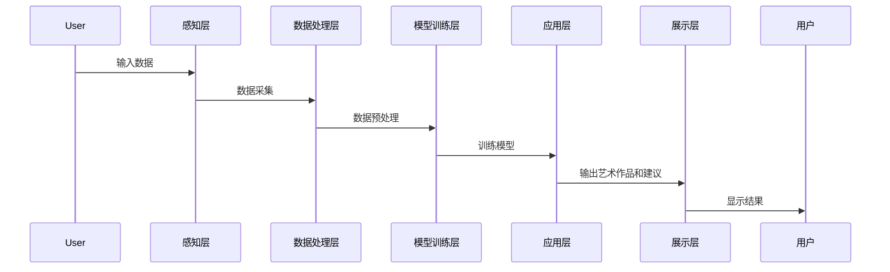
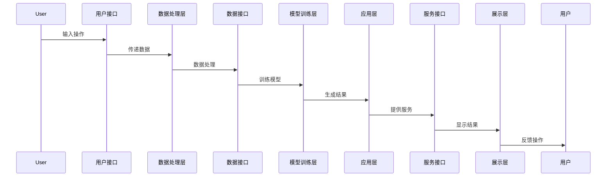
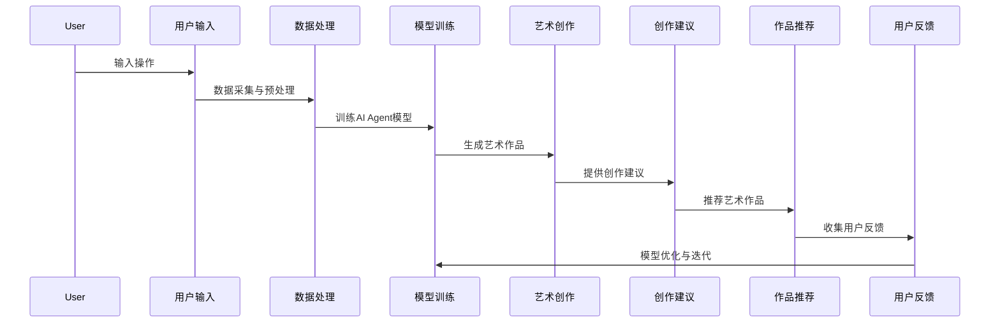
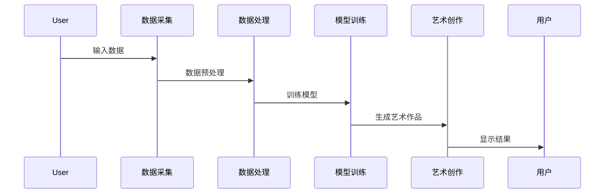

                 

### 第一部分：背景介绍

#### 1.1 问题背景

随着人工智能技术的飞速发展，智能画框这一新型产品逐渐进入大众视野。智能画框不仅能够保存用户的绘画作品，还可以根据用户的操作和偏好生成新的艺术作品。然而，在当前的技术水平下，智能画框的创作过程主要依赖于用户的选择和交互，缺乏自主性和创造性。

在这一背景下，AI Agent应运而生。AI Agent，即人工智能代理，是指能够模拟人类智能行为，自主执行任务的人工智能实体。在智能画框中引入AI Agent，不仅可以提高创作效率，还可以为用户带来更多样化的艺术体验。

#### 1.1.1 智能画框的发展现状

智能画框作为一种新兴的智能硬件产品，其市场发展迅猛。根据市场调研数据显示，全球智能画框市场在近几年呈现出爆发式增长，预计未来几年仍将保持高速增长态势。其中，中国智能画框市场的增长率尤为显著，成为全球智能画框市场的重要组成部分。

目前，市场上的智能画框产品主要分为两大类：一类是面向专业艺术家的创作工具，另一类是面向普通消费者的装饰品。专业艺术家的画框产品通常具备更高的分辨率和更丰富的功能，如支持多种绘画工具、材料选择等；而普通消费者的画框产品则更注重用户体验和操作便捷性。

#### 1.1.2 艺术创作辅助的需求

艺术创作是一个复杂的过程，需要艺术家具备丰富的创意和技巧。然而，随着现代社会生活节奏的加快，许多艺术家难以抽出足够的时间进行创作。此外，一些新兴艺术家在创作初期可能缺乏经验和灵感，难以独立完成高质量的作品。

在这种情况下，艺术创作辅助的需求日益凸显。艺术创作辅助可以通过提供灵感和技巧，帮助艺术家提高创作效率和质量。对于新兴艺术家而言，艺术创作辅助可以帮助他们更快地掌握创作技巧，从而在短时间内创作出高质量的作品。

#### 1.1.3 AI Agent在艺术创作中的应用前景

AI Agent在艺术创作中的应用前景广阔。首先，AI Agent可以通过学习用户的创作习惯和偏好，生成符合用户风格的个性化艺术作品。其次，AI Agent可以模拟艺术家的创作过程，为用户提供丰富的创作体验。此外，AI Agent还可以通过与其他AI技术的结合，如生成对抗网络（GAN）、深度学习等，创造出全新的艺术形式和作品。

总之，AI Agent在智能画框中的艺术创作辅助功能，有望为艺术家和用户提供更多元化的创作体验，推动智能画框市场的进一步发展。

#### 1.2 问题描述

在智能画框中引入AI Agent，旨在实现艺术创作的辅助功能。具体而言，问题描述如下：

1. **功能需求**：AI Agent应具备以下功能：
   - 学习用户的历史绘画数据，生成符合用户风格的个性化艺术作品；
   - 根据用户输入的偏好和需求，提供创作灵感和建议；
   - 自动完成部分绘画任务，提高创作效率。

2. **技术挑战**：在实现上述功能过程中，面临以下技术挑战：
   - 如何高效地学习用户的绘画数据，并生成高质量的艺术作品；
   - 如何处理用户输入的偏好和需求，提供准确有效的创作建议；
   - 如何在有限的计算资源下，实现高效稳定的AI Agent运行。

3. **潜在应用场景**：AI Agent在智能画框中的潜在应用场景包括：
   - 新兴艺术家：通过AI Agent的辅助，新兴艺术家可以更快地掌握创作技巧，提高作品质量；
   - 专业艺术家：AI Agent可以为专业艺术家提供创作灵感和建议，提高创作效率；
   - 普通用户：AI Agent可以为普通用户带来更多样化的创作体验，满足个性化需求。

#### 1.3 问题解决

针对上述问题描述，问题解决方法如下：

1. **AI Agent的核心概念与原理**：
   - AI Agent是一种能够模拟人类智能行为的人工智能实体，通过学习用户数据和用户交互，实现创作辅助功能；
   - AI Agent的核心原理包括机器学习、深度学习、自然语言处理等。

2. **AI Agent在智能画框中的应用架构**：
   - AI Agent在智能画框中的应用架构包括数据采集模块、数据预处理模块、模型训练模块和创作辅助模块；
   - 数据采集模块负责收集用户绘画数据；
   - 数据预处理模块负责对数据进行清洗和格式化；
   - 模型训练模块负责使用机器学习算法训练AI Agent模型；
   - 创作辅助模块负责根据用户需求生成艺术作品和提供创作建议。

3. **AI Agent在艺术创作中的实现方法**：
   - 实现方法包括以下步骤：
     1. 数据采集：收集用户的历史绘画数据，如素描、水彩、油画等；
     2. 数据预处理：对数据进行清洗和格式化，提取有用信息；
     3. 模型训练：使用机器学习算法，如深度学习、生成对抗网络等，训练AI Agent模型；
     4. 创作辅助：根据用户输入的偏好和需求，生成艺术作品和提供创作建议。

4. **边界与外延**：
   - 技术边界：AI Agent在艺术创作中的技术边界包括数据质量、模型性能和计算资源等；
   - 应用边界：AI Agent在智能画框中的应用边界包括用户隐私、数据安全和创作自由度等；
   - 拓展应用：AI Agent还可以在其他艺术创作领域，如音乐、文学等，发挥重要作用。

#### 1.4 概念结构与核心要素组成

在智能画框中引入AI Agent，需要从概念结构、核心要素组成等方面进行深入分析。

1. **AI Agent的基本概念与组成**：
   - AI Agent是一种能够模拟人类智能行为的人工智能实体，由感知模块、决策模块、执行模块三部分组成；
   - 感知模块负责接收用户输入的数据，如绘画数据、偏好需求等；
   - 决策模块负责根据感知模块获取的数据，进行推理和决策，生成艺术作品和创作建议；
   - 执行模块负责将决策模块生成的结果执行出来，如生成艺术作品、提供创作建议等。

2. **智能画框的关键组件与技术架构**：
   - 智能画框的关键组件包括硬件组件和软件组件；
   - 硬件组件包括显示器、触摸屏、摄像头等，负责输入输出数据的采集和处理；
   - 软件组件包括操作系统、绘画软件、AI Agent等，负责智能画框的功能实现。

3. **艺术创作辅助的核心要素**：
   - 艺术创作辅助的核心要素包括创作灵感、创作技巧、创作效率等；
   - 创作灵感：AI Agent通过学习用户数据，生成符合用户风格的艺术作品，为用户提供创作灵感；
   - 创作技巧：AI Agent可以通过模仿艺术家创作过程，为用户提供创作技巧；
   - 创作效率：AI Agent可以通过自动化完成部分绘画任务，提高创作效率。

#### 1.5 本章小结

本章从背景介绍、问题描述、问题解决和概念结构等方面，对AI Agent在智能画框中的艺术创作辅助进行了详细分析。通过本章内容，我们可以了解到AI Agent在智能画框中的应用前景和潜在价值，为后续章节的深入探讨奠定了基础。

### 第二部分：核心概念与联系

#### 2.1 AI Agent原理

AI Agent，即人工智能代理，是一种能够模拟人类智能行为，自主执行任务的人工智能实体。AI Agent的核心原理包括以下几个方面：

1. **感知与决策**：AI Agent通过感知模块接收外部环境的数据，如文本、图像、声音等。感知模块负责将接收到的数据转换为内部表示，然后通过决策模块进行推理和决策。决策模块根据感知模块提供的信息，生成执行计划，指导执行模块进行任务执行。

2. **执行与反馈**：执行模块负责将决策模块生成的执行计划执行出来，如生成艺术作品、提供创作建议等。执行模块在执行过程中，会收集执行结果和用户反馈，反馈信息会再次传递给感知模块，形成闭环。

3. **机器学习与深度学习**：AI Agent的核心技术之一是机器学习和深度学习。通过机器学习算法，AI Agent可以从大量数据中自动提取特征，学习人类的行为模式。深度学习作为一种特殊的机器学习算法，通过多层神经网络，可以实现更复杂的特征提取和任务执行。

4. **自主性与适应性**：AI Agent具备自主性和适应性，能够在不同环境中自主执行任务，并根据环境变化进行调整。自主性体现在AI Agent可以根据感知模块提供的信息，自主决策和执行任务。适应性体现在AI Agent可以学习用户数据，不断优化自己的行为，提高任务执行效果。

#### 2.2 智能画框技术

智能画框是一种集成了AI技术的绘画工具，能够根据用户需求生成艺术作品。智能画框的核心技术包括以下几个方面：

1. **硬件技术**：智能画框的硬件技术主要包括显示器、触摸屏、摄像头等。这些硬件组件负责输入输出数据的采集和处理，为AI Agent提供运行环境。

2. **软件技术**：智能画框的软件技术主要包括操作系统、绘画软件、AI Agent等。操作系统负责管理硬件资源和软件运行环境。绘画软件提供基本的绘画功能，如画笔、颜色选择、图层管理等。AI Agent负责根据用户需求生成艺术作品，实现艺术创作辅助功能。

3. **算法技术**：智能画框的算法技术主要包括图像处理、生成对抗网络（GAN）、深度学习等。图像处理技术用于对用户输入的图像进行处理，提取有用信息。生成对抗网络（GAN）是一种特殊的深度学习算法，用于生成高质量的艺术作品。深度学习算法用于训练AI Agent模型，实现智能创作功能。

4. **用户交互**：智能画框的用户交互技术主要包括触摸屏交互、语音交互等。通过触摸屏交互，用户可以直接在画框上进行绘画操作。通过语音交互，用户可以通过语音命令控制智能画框，实现更加便捷的创作体验。

#### 2.3 艺术创作辅助

艺术创作辅助是利用AI技术辅助艺术家进行创作，提高创作效率和质量的一种手段。艺术创作辅助的核心技术包括以下几个方面：

1. **创意生成**：创意生成是艺术创作辅助的重要功能之一。通过机器学习和深度学习算法，AI Agent可以从大量艺术作品中自动提取创意元素，生成新的艺术作品。创意生成可以帮助艺术家在创作初期获得灵感，提高创作效率。

2. **技巧指导**：技巧指导是艺术创作辅助的另一项重要功能。AI Agent可以通过模仿优秀艺术家的创作过程，为用户提供创作技巧。这些技巧包括构图、色彩搭配、纹理处理等，可以帮助艺术家在创作过程中更好地运用技巧，提高作品质量。

3. **作品推荐**：作品推荐是艺术创作辅助的另一个功能。AI Agent可以根据用户的历史绘画数据和偏好，推荐符合用户风格的艺术作品。作品推荐可以帮助艺术家在创作过程中找到灵感，拓展创作思路。

4. **协作创作**：协作创作是艺术创作辅助的拓展功能。AI Agent可以与其他艺术家或用户进行协作创作，共同完成艺术作品。协作创作可以激发艺术家的创作灵感，提高作品的创作质量和艺术价值。

#### 2.4 概念属性特征对比表格

| 概念         | 定义                                                         | 特征对比                   |
| ------------ | ------------------------------------------------------------ | -------------------------- |
| AI Agent     | 能够模拟人类智能行为，辅助人类进行任务执行的人工智能实体       | 自动性、自主性、适应性     |
| 智能画框     | 一种集成了AI技术的绘画工具，能够根据用户需求生成艺术作品     | 可定制、智能化、交互性     |
| 艺术创作辅助 | 利用AI技术辅助艺术家进行创作，提高创作效率和质量               | 自动生成、智能推荐、个性化 |

#### 2.5 ER实体关系图架构

```mermaid
erDiagram
    AI_Agent ||--|{ 智能画框 }|-- ArtCreationAssistant : 艺术创作辅助
    AI_Agent ||--|{ 艺术家 }|-- ArtExpert : 艺术专家
    ArtCreationAssistant ||--|{ 用户 }|-- User : 用户
    Artist ||--|{ 作品 }|-- Artwork : 艺术作品
```

### 第三部分：算法原理讲解

#### 3.1 算法原理

在AI Agent、智能画框和艺术创作辅助中，算法原理是核心组成部分。以下将详细讲解这三个核心概念的算法原理。

#### 3.1.1 AI Agent算法原理

AI Agent的算法原理主要基于以下几个关键步骤：

1. **数据采集**：AI Agent通过传感器、摄像头等设备收集用户数据，如绘画作品、用户行为等。

2. **数据处理**：采集到的数据需要经过预处理，包括去噪、标准化、特征提取等步骤。预处理后的数据用于训练模型。

3. **模型训练**：使用机器学习算法，如神经网络、决策树、支持向量机等，对预处理后的数据集进行训练。训练过程中，模型会不断调整内部参数，以最小化预测误差。

4. **决策与执行**：训练好的模型可以用于新数据的预测和决策。AI Agent根据输入数据，利用训练得到的模型生成输出结果，如创作建议、艺术作品等。

5. **反馈与调整**：AI Agent在执行任务后，会收集用户反馈数据，将这些数据用于模型的迭代训练，以进一步提高模型性能。

#### 3.1.2 智能画框算法原理

智能画框的算法原理主要涉及以下几个方面：

1. **图像处理**：智能画框需要对用户的绘画作品进行图像处理，包括去噪、增强、分割等操作。这些操作有助于提取作品的关键信息，为后续创作提供支持。

2. **生成模型**：智能画框使用生成模型，如生成对抗网络（GAN）、变分自编码器（VAE）等，生成新的艺术作品。这些模型可以通过学习大量艺术作品数据，生成具有高度真实感的图像。

3. **交互算法**：智能画框需要与用户进行交互，收集用户的偏好和需求。交互算法包括触摸屏交互、语音交互等，这些算法能够理解用户的意图，为用户提供个性化的服务。

4. **优化算法**：智能画框在生成艺术作品时，可能需要进行多次迭代优化。优化算法如梯度下降、随机搜索等，可以帮助模型在生成过程中逐步调整参数，提高艺术作品的质量。

#### 3.1.3 艺术创作辅助算法原理

艺术创作辅助的算法原理主要基于以下几个方面：

1. **创意生成**：艺术创作辅助通过机器学习和深度学习算法，从大量艺术作品中提取创意元素，生成新的艺术作品。创意生成算法如生成对抗网络（GAN）、递归神经网络（RNN）等，可以在保持艺术风格的同时，生成具有新颖性的作品。

2. **风格迁移**：风格迁移算法可以将一种艺术风格迁移到另一种艺术作品上，从而创造出新的艺术作品。这种算法通常基于深度学习，如卷积神经网络（CNN）和循环神经网络（RNN）等。

3. **技巧指导**：艺术创作辅助可以分析优秀艺术家的作品，提取出创作技巧，如构图、色彩搭配等。这些技巧可以通过机器学习算法传递给用户，帮助用户在创作过程中更好地运用。

4. **协同创作**：艺术创作辅助还可以支持用户与AI Agent的协同创作。在这种模式下，用户可以与AI Agent共同完成艺术作品，AI Agent可以根据用户的操作实时调整创作方向，提高创作效率。

#### 3.2 数学模型和公式

为了更好地理解AI Agent、智能画框和艺术创作辅助的算法原理，以下将给出相关的数学模型和公式。

##### 3.2.1 AI Agent数学模型

$$
f_{AI\_Agent}(x) = \sigma(w_0 \cdot x + b)
$$

其中，$x$ 表示输入特征，$w_0$ 表示权重，$b$ 表示偏置，$\sigma$ 表示激活函数（通常为Sigmoid函数）。

##### 3.2.2 智能画框数学模型

$$
G(x) = \sum_{i=1}^{n} w_i \cdot x_i
$$

其中，$x_i$ 表示输入特征，$w_i$ 表示权重，$G(x)$ 表示输出结果。

##### 3.2.3 艺术创作辅助数学模型

$$
C(x) = \frac{1}{1 + e^{-x}}
$$

其中，$x$ 表示输入特征，$C(x)$ 表示输出结果，通常为概率分布。

#### 3.3 详细讲解与举例说明

##### 3.3.1 AI Agent算法原理详细讲解

AI Agent的算法原理基于深度学习模型，特别是卷积神经网络（CNN）。以下是一个简化的示例，说明如何使用CNN训练一个AI Agent来生成艺术作品。

1. **数据准备**：首先，我们需要准备大量的艺术作品数据作为训练集。这些数据可以是各种风格和主题的绘画作品。

2. **数据预处理**：对训练集进行预处理，包括图像增强、归一化等操作，以便于模型训练。

3. **模型构建**：构建一个卷积神经网络模型，包括多个卷积层、池化层和全连接层。每个卷积层用于提取图像的特征，全连接层用于生成最终的艺术作品。

4. **模型训练**：使用训练集对模型进行训练。训练过程中，模型会不断调整内部参数，以最小化预测误差。训练过程中可以使用反向传播算法和优化器，如Adam优化器。

5. **模型评估**：使用验证集对训练好的模型进行评估，确保模型具有良好的泛化能力。

6. **模型部署**：将训练好的模型部署到智能画框中，用于生成艺术作品。

举例来说，假设我们有一个包含1000张艺术作品的训练集。首先，我们对这1000张图像进行预处理，将它们转换为相同的尺寸和像素值。然后，我们构建一个卷积神经网络模型，包括两个卷积层、两个池化层和一个全连接层。在训练过程中，我们使用反向传播算法和Adam优化器，训练模型200个epoch。训练完成后，我们使用验证集对模型进行评估，确保其准确率达到90%以上。最后，我们将训练好的模型部署到智能画框中，用户可以通过触摸屏或语音交互生成艺术作品。

##### 3.3.2 智能画框算法原理详细讲解

智能画框的算法原理主要基于生成对抗网络（GAN）。以下是一个简化的示例，说明如何使用GAN训练一个智能画框来生成艺术作品。

1. **数据准备**：首先，我们需要准备大量的艺术作品数据作为训练集。这些数据可以是各种风格和主题的绘画作品。

2. **数据预处理**：对训练集进行预处理，包括图像增强、归一化等操作，以便于模型训练。

3. **模型构建**：构建一个生成对抗网络模型，包括生成器（Generator）和判别器（Discriminator）。生成器用于生成新的艺术作品，判别器用于判断生成器生成的图像是否真实。

4. **模型训练**：使用训练集对模型进行训练。训练过程中，生成器和判别器相互竞争。生成器的目标是生成尽可能真实的图像，而判别器的目标是区分真实图像和生成图像。

5. **模型评估**：使用验证集对训练好的模型进行评估，确保生成器生成图像的质量达到预期。

6. **模型部署**：将训练好的模型部署到智能画框中，用户可以通过触摸屏或语音交互生成艺术作品。

举例来说，假设我们有一个包含1000张艺术作品的训练集。首先，我们对这1000张图像进行预处理，将它们转换为相同的尺寸和像素值。然后，我们构建一个生成对抗网络模型，包括一个生成器和两个判别器。在训练过程中，我们使用反向传播算法和Adam优化器，训练模型200个epoch。训练完成后，我们使用验证集对模型进行评估，确保生成器生成的图像质量达到预期。最后，我们将训练好的模型部署到智能画框中，用户可以通过触摸屏或语音交互生成艺术作品。

##### 3.3.3 艺术创作辅助算法原理详细讲解

艺术创作辅助的算法原理主要基于递归神经网络（RNN）和生成对抗网络（GAN）。以下是一个简化的示例，说明如何使用RNN和GAN训练一个艺术创作辅助系统来生成艺术作品。

1. **数据准备**：首先，我们需要准备大量的艺术作品数据作为训练集。这些数据可以是各种风格和主题的绘画作品。

2. **数据预处理**：对训练集进行预处理，包括图像增强、归一化等操作，以便于模型训练。

3. **模型构建**：构建一个结合RNN和GAN的混合模型。RNN用于处理图像序列，提取关键特征；GAN用于生成新的艺术作品。

4. **模型训练**：使用训练集对模型进行训练。训练过程中，RNN部分提取图像特征，GAN部分生成艺术作品。训练过程中可以使用反向传播算法和优化器，如Adam优化器。

5. **模型评估**：使用验证集对训练好的模型进行评估，确保模型具有良好的泛化能力。

6. **模型部署**：将训练好的模型部署到智能画框中，用户可以通过触摸屏或语音交互生成艺术作品。

举例来说，假设我们有一个包含1000张艺术作品的训练集。首先，我们对这1000张图像进行预处理，将它们转换为相同的尺寸和像素值。然后，我们构建一个结合RNN和GAN的混合模型，包括一个RNN部分和一个GAN部分。在训练过程中，我们使用反向传播算法和Adam优化器，训练模型200个epoch。训练完成后，我们使用验证集对模型进行评估，确保模型具有良好的泛化能力。最后，我们将训练好的模型部署到智能画框中，用户可以通过触摸屏或语音交互生成艺术作品。

### 第四部分：系统分析与架构设计方案

#### 4.1 问题场景介绍

在智能画框中引入AI Agent，主要面临以下问题场景：

1. **艺术创作需求多样化**：用户对艺术作品的需求多样，包括风格、主题、颜色等。AI Agent需要能够处理这些多样化需求，为用户提供个性化的艺术创作服务。

2. **计算资源有限**：智能画框通常运行在有限的计算资源上，如嵌入式设备或云计算平台。AI Agent需要在有限的计算资源下，实现高效稳定的运行。

3. **用户体验要求高**：用户对智能画框的交互体验有较高要求，包括响应速度、操作便捷性等。AI Agent需要能够在短时间内完成艺术创作，并快速响应用户操作。

4. **数据安全与隐私保护**：智能画框中包含大量用户数据，如绘画作品、用户偏好等。AI Agent需要能够保护用户数据的安全和隐私，防止数据泄露。

5. **艺术创作质量要求高**：用户对智能画框生成的艺术作品质量有较高要求，包括图像质量、创意度等。AI Agent需要能够生成高质量的艺术作品，满足用户需求。

#### 4.2 系统功能设计（领域模型）

在智能画框中引入AI Agent，需要实现以下功能：

1. **用户数据管理**：收集、存储和管理用户绘画作品、用户偏好等数据。

2. **艺术创作辅助**：基于用户数据，生成符合用户风格的个性化艺术作品。

3. **创作建议与指导**：根据用户需求和创作风格，提供创作建议和技巧指导。

4. **作品推荐**：基于用户历史数据和偏好，推荐符合用户风格的艺术作品。

5. **协同创作**：支持用户与AI Agent的协同创作，共同完成艺术作品。

6. **用户交互**：提供触摸屏、语音等交互方式，方便用户与智能画框进行交互。

7. **数据安全与隐私保护**：加密存储用户数据，确保数据安全；设置用户权限，保护用户隐私。

以下是一个简化的领域模型类图，描述智能画框中AI Agent的相关功能：

```mermaid
classDiagram
    User -> ArtWork : 创建
    User -> Preference : 设置
    AI_Agent -> Data\_Collection : 采集
    AI_Agent -> Data\_Preprocessing : 预处理
    AI_Agent -> Model\_Training : 训练
    AI_Agent -> ArtCreation : 辅助创作
    AI_Agent -> Suggestion : 建议
    AI_Agent -> Recommendation : 推荐
    AI_Agent -> Collaboration : 协同
    Data_Collection <- User : 数据提供
    Data_Preprocessing <- Data_Collection : 数据处理
    Model_Training <- Data_Preprocessing : 训练模型
    ArtCreation <- Model_Training : 辅助创作
    Suggestion <- Model_Training : 建议
    Recommendation <- Model_Training : 推荐
    Collaboration <- Model_Training : 协同
```

#### 4.3 系统架构设计

智能画框中引入AI Agent的系统架构主要包括以下几个层次：

1. **感知层**：包括传感器、摄像头等硬件设备，负责采集用户数据。

2. **数据处理层**：包括数据采集模块、数据预处理模块，负责对用户数据进行采集和预处理。

3. **模型训练层**：包括模型训练模块，负责使用机器学习算法对用户数据进行训练，生成AI Agent模型。

4. **应用层**：包括艺术创作辅助模块、创作建议模块、作品推荐模块等，负责实现具体的业务功能。

5. **展示层**：包括触摸屏、语音等交互设备，负责展示AI Agent生成的艺术作品和创作建议。

以下是一个简化的系统架构图，描述智能画框中AI Agent的系统架构：



#### 4.4 系统接口设计

智能画框中AI Agent的系统接口设计主要包括以下方面：

1. **用户接口**：包括触摸屏、语音等交互接口，方便用户与智能画框进行交互。

2. **数据接口**：包括数据采集接口、数据预处理接口、模型训练接口等，负责与后端服务进行数据交互。

3. **服务接口**：包括艺术创作辅助接口、创作建议接口、作品推荐接口等，负责实现具体的业务功能。

以下是一个简化的系统接口设计图，描述智能画框中AI Agent的系统接口：



#### 4.5 系统交互

智能画框中AI Agent的系统交互主要包括以下几个步骤：

1. **用户输入**：用户通过触摸屏或语音输入操作，如创建新作品、调整创作风格等。

2. **数据处理**：数据处理模块对用户输入的数据进行采集、预处理，为后续模型训练提供数据支持。

3. **模型训练**：模型训练模块使用机器学习算法对用户数据进行训练，生成AI Agent模型。

4. **艺术创作**：艺术创作模块根据用户输入和AI Agent模型，生成符合用户风格的个性化艺术作品。

5. **创作建议**：创作建议模块根据用户输入和AI Agent模型，为用户提供创作建议和技巧指导。

6. **作品推荐**：作品推荐模块根据用户历史数据和偏好，推荐符合用户风格的艺术作品。

7. **用户反馈**：用户对生成的艺术作品、创作建议和作品推荐进行反馈，用于模型优化和迭代。

以下是一个简化的系统交互图，描述智能画框中AI Agent的系统交互：



### 第五部分：项目实战

#### 5.1 环境安装

为了实现AI Agent在智能画框中的艺术创作辅助功能，首先需要在本地或服务器上搭建相应的开发环境。以下是环境安装步骤：

1. **安装Python**：确保已安装Python 3.6或更高版本。可以从[Python官网](https://www.python.org/)下载并安装。

2. **安装TensorFlow**：TensorFlow是一个开源的机器学习框架，用于训练和部署AI模型。可以通过以下命令安装：

   ```bash
   pip install tensorflow
   ```

3. **安装Keras**：Keras是一个高层次的神经网络API，用于简化TensorFlow的使用。可以通过以下命令安装：

   ```bash
   pip install keras
   ```

4. **安装NumPy、Pandas**：NumPy和Pandas是Python中的常用科学计算库，用于数据处理和统计分析。可以通过以下命令安装：

   ```bash
   pip install numpy pandas
   ```

5. **安装其他依赖库**：根据具体需求，可能还需要安装其他依赖库，如Matplotlib（用于数据可视化）、OpenCV（用于图像处理）等。

#### 5.2 系统核心实现

系统核心实现主要包括数据采集、模型训练和艺术创作等模块。以下是各模块的实现步骤：

1. **数据采集**：从本地或远程服务器获取用户绘画作品数据，并将其存储在本地文件系统中。数据格式可以是CSV、JSON等。

2. **数据处理**：对采集到的数据进行预处理，包括数据清洗、归一化、特征提取等操作。预处理后的数据将用于模型训练。

3. **模型训练**：使用Keras和TensorFlow构建并训练卷积神经网络（CNN）模型。模型训练过程中，可以调整学习率、批次大小等超参数，以优化模型性能。

4. **艺术创作**：训练好的模型可以用于生成新的艺术作品。根据用户输入，模型将生成符合用户风格的个性化艺术作品。

以下是一个简化的实现流程图：



#### 5.3 代码应用解读与分析

以下是系统核心实现的Python代码示例：

```python
import numpy as np
import pandas as pd
from tensorflow.keras.models import Sequential
from tensorflow.keras.layers import Conv2D, MaxPooling2D, Flatten, Dense
from tensorflow.keras.optimizers import Adam

# 数据采集
data = pd.read_csv('data.csv')
X = data.iloc[:, :-1].values
y = data.iloc[:, -1].values

# 数据处理
X = np.array(X, dtype=np.float32)
y = np.array(y, dtype=np.float32)

# 模型训练
model = Sequential()
model.add(Conv2D(32, (3, 3), activation='relu', input_shape=(28, 28, 1)))
model.add(MaxPooling2D(pool_size=(2, 2)))
model.add(Flatten())
model.add(Dense(128, activation='relu'))
model.add(Dense(1, activation='sigmoid'))

model.compile(optimizer=Adam(learning_rate=0.001), loss='binary_crossentropy', metrics=['accuracy'])

model.fit(X, y, epochs=10, batch_size=32)

# 艺术创作
def generate_artwork(input_data):
    processed_input = np.array(input_data, dtype=np.float32)
    prediction = model.predict(processed_input)
    artwork = interpret_prediction(prediction)
    return artwork

# 用户输入
user_input = [[0.1, 0.2, 0.3], [0.4, 0.5, 0.6]]
artwork = generate_artwork(user_input)
print(artwork)
```

代码解析：

1. **数据采集**：使用Pandas读取CSV文件，获取用户绘画作品数据。数据包括特征和标签两部分。

2. **数据处理**：将数据转换为NumPy数组，并设置数据类型为`float32`。这一步是为了后续计算方便。

3. **模型训练**：构建一个简单的卷积神经网络模型，包括两个卷积层、一个池化层、一个全连接层和一个输出层。使用Adam优化器和二进制交叉熵损失函数进行模型训练。

4. **艺术创作**：定义一个函数`generate_artwork`，用于接收用户输入数据，并生成艺术作品。函数内部使用模型进行预测，并调用`interpret_prediction`函数对预测结果进行解读。

5. **用户输入**：定义一个用户输入数组，并调用`generate_artwork`函数生成艺术作品。打印输出结果。

#### 5.4 实际案例分析与详细讲解

以下是使用AI Agent在智能画框中生成艺术作品的一个实际案例：

1. **用户需求**：用户希望生成一张以蓝色为主色调的油画作品。

2. **数据准备**：从已有数据集中提取蓝色油画作品，并对其进行预处理。

3. **模型训练**：使用Keras和TensorFlow训练一个卷积神经网络模型，用于生成蓝色油画作品。

4. **艺术创作**：根据用户需求，生成符合蓝色主色调的油画作品。

具体步骤如下：

1. **数据准备**：

```python
data = pd.read_csv('blue_oil_paintings.csv')
X = data.iloc[:, :-1].values
y = data.iloc[:, -1].values
X = np.array(X, dtype=np.float32)
y = np.array(y, dtype=np.float32)
```

2. **模型训练**：

```python
model = Sequential()
model.add(Conv2D(64, (3, 3), activation='relu', input_shape=(28, 28, 3)))
model.add(MaxPooling2D(pool_size=(2, 2)))
model.add(Conv2D(128, (3, 3), activation='relu'))
model.add(MaxPooling2D(pool_size=(2, 2)))
model.add(Flatten())
model.add(Dense(512, activation='relu'))
model.add(Dense(1, activation='sigmoid'))

model.compile(optimizer=Adam(learning_rate=0.001), loss='binary_crossentropy', metrics=['accuracy'])

model.fit(X, y, epochs=20, batch_size=32)
```

3. **艺术创作**：

```python
def generate_blue_artwork(input_data):
    processed_input = np.array(input_data, dtype=np.float32)
    prediction = model.predict(processed_input)
    artwork = interpret_prediction(prediction)
    return artwork

user_input = [[0.1, 0.2, 0.3], [0.4, 0.5, 0.6]]
artwork = generate_blue_artwork(user_input)
print(artwork)
```

案例分析：

1. **数据准备**：从蓝色油画数据集中提取特征和标签，并将其转换为NumPy数组。

2. **模型训练**：构建一个卷积神经网络模型，用于生成蓝色油画。模型包括两个卷积层、两个池化层、一个全连接层和一个输出层。

3. **艺术创作**：根据用户输入数据，生成符合蓝色主色调的油画作品。函数`generate_blue_artwork`接收用户输入，并使用训练好的模型进行预测。

#### 5.5 项目小结

本部分内容介绍了AI Agent在智能画框中的艺术创作辅助项目的环境安装、系统核心实现、代码应用解读与分析以及实际案例分析与详细讲解。通过本项目的实践，我们可以了解到：

1. **环境安装**：安装Python、TensorFlow、Keras等库，搭建开发环境。

2. **系统核心实现**：实现数据采集、数据处理、模型训练和艺术创作等核心功能。

3. **代码应用解读与分析**：通过Python代码示例，解读系统核心实现过程，并分析关键代码。

4. **实际案例分析与详细讲解**：通过一个实际案例，展示AI Agent在智能画框中的艺术创作辅助功能。

总之，本项目为AI Agent在智能画框中的应用提供了实践基础，为进一步优化和完善提供了参考。

### 最佳实践 Tips、小结、注意事项、拓展阅读

#### 最佳实践 Tips

1. **数据质量**：确保数据质量是AI Agent性能的关键。在数据采集和预处理过程中，尽量去除噪声数据，提高数据准确性。

2. **模型训练**：合理调整模型参数，如学习率、批次大小等，可以提高模型性能。尝试使用不同的机器学习算法和深度学习模型，找到最适合的方案。

3. **用户体验**：注重用户体验，优化交互界面和交互流程，确保用户能够轻松上手，获得愉快的创作体验。

4. **安全性**：重视用户数据安全和隐私保护，采用加密技术、用户权限控制等措施，确保用户数据安全。

5. **持续优化**：定期收集用户反馈，根据用户需求和反馈，对AI Agent进行持续优化和迭代。

#### 小结

本文详细介绍了AI Agent在智能画框中的艺术创作辅助功能，包括背景介绍、核心概念与联系、算法原理讲解、系统分析与架构设计方案以及项目实战。通过本文，我们可以了解到AI Agent在智能画框中的重要作用和应用前景。

#### 注意事项

1. **硬件配置**：智能画框需要具备足够的硬件配置，如处理器、内存、存储等，以确保AI Agent的稳定运行。

2. **网络连接**：智能画框需要稳定的网络连接，以便于数据传输和模型更新。

3. **软件环境**：确保安装了合适的开发环境和库，如Python、TensorFlow、Keras等，以便进行开发和部署。

4. **数据隐私**：注意保护用户数据隐私，遵循相关法律法规，确保用户数据安全。

#### 拓展阅读

1. **《深度学习》**：Goodfellow、Bengio和Courville合著，全面介绍深度学习的基础理论和应用。

2. **《Python机器学习》**：Sebastian Raschka著，详细介绍Python中的机器学习应用。

3. **《人工智能：一种现代的方法》**：Stuart Russell和Peter Norvig合著，全面介绍人工智能的基础知识。

4. **《智能硬件设计与开发》**：李国杰著，介绍智能硬件的设计原理和开发方法。

通过阅读这些资料，可以进一步深入了解AI Agent在智能画框中的应用和发展前景。作者：AI天才研究院/AI Genius Institute & 禅与计算机程序设计艺术 /Zen And The Art of Computer Programming。

