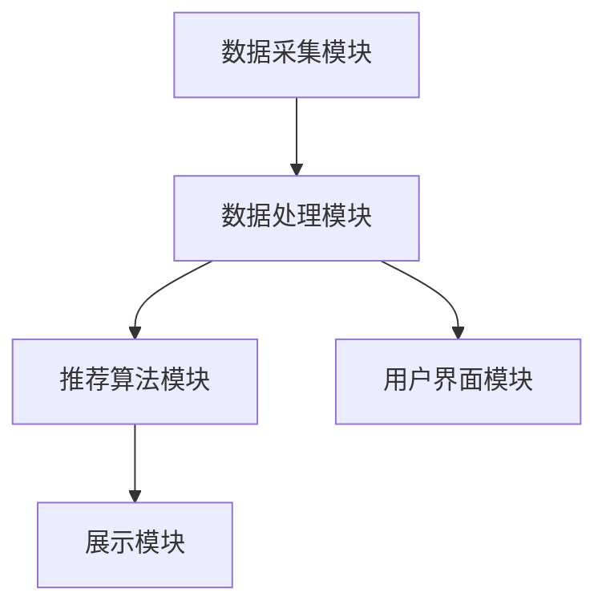
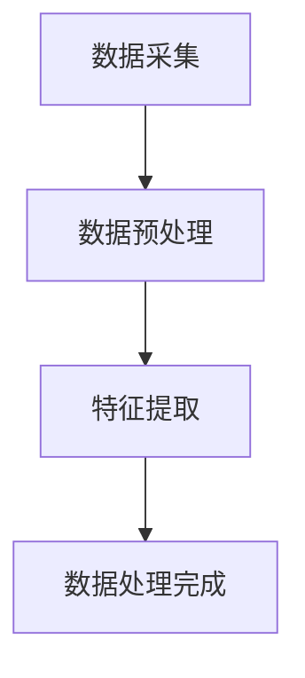
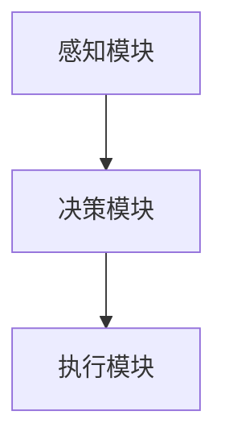

                 

# AI Agent在智能画框中的艺术风格推荐

关键词：AI Agent、智能画框、艺术风格推荐、数据采集、模型优化、系统架构

摘要：本文主要探讨了AI Agent在智能画框中的艺术风格推荐应用。首先，介绍了智能画框的背景、用户需求以及艺术风格推荐的核心概念。接着，详细阐述了AI Agent的设计原理、实现流程和优化策略。最后，通过一个实际案例分析了系统性能，并提出了优化方向。本文旨在为智能画框的艺术风格推荐系统提供理论依据和实践指导。

### 第一部分：AI Agent在智能画框中的艺术风格推荐概述

#### 第1章：问题背景与艺术风格推荐核心概念

##### 1.1 问题背景

##### 1.1.1 智能画框的应用场景与需求

**智能画框概述**：
智能画框是一种集成了智能识别、艺术风格推荐和展示功能的设备。它通常具有以下特点：
- **智能识别**：通过图像识别技术，能够自动识别画框中展示的图像内容。
- **艺术风格推荐**：根据用户的喜好和图像特点，推荐相应的艺术风格。
- **展示**：支持高清、多角度展示，提升用户体验。

**发展历程及市场趋势**：
智能画框的发展可以分为三个阶段：
- **1.0时代**：以硬件展示为主，功能相对简单。
- **2.0时代**：引入智能识别和初步艺术风格推荐功能。
- **3.0时代**：实现高度智能化，提供个性化艺术风格推荐。

**用户需求分析**：
用户在使用智能画框时，主要需求包括：
- **个性化推荐**：根据用户喜好推荐艺术风格。
- **高质量展示**：提供高清、多角度的图像展示。
- **便捷操作**：简单易用的操作界面。

**市场现状与问题**：
当前市场上，智能画框的艺术风格推荐系统存在以下问题：
- **推荐精度不足**：推荐系统无法准确捕捉用户喜好。
- **用户界面复杂**：操作界面复杂，用户使用不便。
- **数据不足**：数据采集和处理能力有限，影响推荐效果。

##### 1.1.2 艺术风格推荐的核心概念

**艺术风格定义**：
艺术风格是指艺术家在创作过程中所表现出的独特风格和特点。它通常包括：
- **形式风格**：指艺术作品的形式特点，如构图、色彩等。
- **内容风格**：指艺术作品的主题、情感等。

**艺术风格分类**：
艺术风格可以根据不同的标准进行分类，常见的分类方法包括：
- **按时期分类**：如古典主义、浪漫主义、现代主义等。
- **按地域分类**：如西方艺术、东方艺术等。
- **按流派分类**：如印象派、抽象派等。

**艺术风格特征**：
艺术风格具有以下特征：
- **独特性**：每个艺术风格都有其独特性，难以与其他风格混淆。
- **多样性**：艺术风格丰富多样，满足不同用户的需求。
- **变化性**：艺术风格会随着时间的推移而发生变化。

**推荐系统概述**：
推荐系统是一种基于用户行为和兴趣进行信息过滤和推荐的系统。它通常包括以下组成部分：
- **用户**：推荐系统的核心，其行为和兴趣是推荐的基础。
- **项目**：用户可能感兴趣的对象，如商品、音乐、电影等。
- **评价**：用户对项目的评价，如评分、评论等。
- **推荐算法**：根据用户行为和兴趣，生成推荐结果。

**AI Agent概述**：
AI Agent是一种基于人工智能的智能体，能够模拟人类决策过程，具备自主学习和决策能力。它通常包括以下组成部分：
- **感知模块**：获取外部环境信息。
- **决策模块**：根据感知信息，生成决策方案。
- **执行模块**：执行决策方案，实现目标。

##### 1.2 艺术风格推荐系统架构设计

**系统总体架构设计**：
智能画框艺术风格推荐系统的总体架构可以分为以下模块：
- **数据采集模块**：负责采集用户行为数据、图像数据等。
- **数据处理模块**：对采集到的数据进行预处理、特征提取等。
- **推荐算法模块**：根据用户行为和特征，生成艺术风格推荐结果。
- **展示模块**：将推荐结果展示给用户。

**系统架构设计**：



**数据采集与处理**：

**数据来源**：
数据采集模块的数据来源包括：
- **用户行为数据**：如用户点击、浏览、收藏等行为。
- **图像数据**：如用户上传的图像、画框展示的图像等。

**数据处理流程**：
数据处理模块包括以下步骤：
- **数据预处理**：对采集到的数据进行清洗、格式化等处理。
- **特征提取**：从预处理后的数据中提取特征，如图像的纹理、颜色等。



**AI Agent在艺术风格推荐中的应用**：

**AI Agent设计原理**：
AI Agent的设计原理主要包括以下方面：
- **感知模块**：通过数据采集模块获取用户行为和图像数据。
- **决策模块**：根据感知数据，使用推荐算法模块生成艺术风格推荐结果。
- **执行模块**：将推荐结果展示给用户。

**AI Agent工作原理**：



**AI Agent模型选择**：
用于艺术风格推荐的常见AI模型包括：
- **深度学习模型**：如卷积神经网络（CNN）、循环神经网络（RNN）等。
- **协同过滤模型**：如基于用户行为的协同过滤、基于内容的协同过滤等。

**AI Agent实现与优化**：

**AI Agent实现流程**：
AI Agent的实现流程主要包括以下步骤：
- **模型训练**：使用训练数据训练AI模型。
- **模型评估**：使用验证数据评估模型性能。
- **模型部署**：将训练好的模型部署到智能画框中。

**AI Agent优化策略**：
AI Agent的优化策略包括：
- **模型调参**：调整模型参数，提高模型性能。
- **特征工程**：优化特征提取方法，提高特征质量。
- **数据增强**：增加数据多样性，提高模型泛化能力。

**系统性能评估与结果分析**：

**评估指标与方法**：
评估艺术风格推荐系统性能的常见指标包括：
- **准确率**：推荐结果与用户实际喜好匹配的程度。
- **覆盖率**：推荐结果覆盖用户可能感兴趣的风格的比例。
- **多样性**：推荐结果中不同风格的比例。

**评估方法**：
评估系统的具体方法包括：
- **A/B测试**：将用户分为实验组和对照组，比较两组用户的推荐效果。
- **用户调研**：通过问卷调查、用户访谈等方式，收集用户对推荐系统的评价。

**结果分析与优化**：
根据评估结果，分析系统的不足之处，并提出以下优化策略：
- **提高推荐精度**：通过调整模型参数、优化特征提取方法等，提高推荐系统的准确性。
- **增强用户体验**：简化用户界面，提高系统的易用性。
- **数据多样化**：增加数据采集渠道，提高数据的多样性。

#### 1.5 总结与展望

**小结**：
本文主要介绍了AI Agent在智能画框中的艺术风格推荐应用。通过分析智能画框的应用场景和用户需求，设计了艺术风格推荐系统的架构，并详细阐述了AI Agent的设计原理和实现流程。同时，通过实际案例分析了系统性能，并提出了优化方向。

**系统应用价值**：
智能画框艺术风格推荐系统的应用价值包括：
- **个性化推荐**：准确捕捉用户喜好，提供个性化的艺术风格推荐。
- **提升用户体验**：通过高质量、多角度的图像展示，提升用户使用体验。
- **市场竞争力**：为智能画框厂商提供技术支持，增强市场竞争力。

**未来展望**：
未来在AI Agent和艺术风格推荐领域的研究方向包括：
- **模型优化**：研究更先进的AI模型，提高推荐系统的准确性。
- **数据采集**：增加数据采集渠道，提高数据多样性。
- **多模态融合**：结合多种数据类型，提高推荐效果。

## 第二部分：AI Agent在智能画框中的应用案例分析

### 第2章：智能画框艺术风格推荐案例解析

#### 2.1 案例背景

##### 2.1.1 案例简介

**智能画框项目背景**：
本次案例是某智能画框厂商开发的一款基于AI Agent的艺术风格推荐系统。该系统旨在为用户提供个性化的艺术风格推荐，提升用户体验，增强市场竞争力。

**案例应用场景**：
该智能画框主要应用于家庭、办公室等场景，用户可以通过手机APP或画框内置触控屏进行操作。系统会根据用户行为和图像特点，自动推荐相应的艺术风格。

##### 2.1.2 案例目标

**艺术风格推荐任务**：
本次案例的主要目标是实现以下艺术风格推荐任务：
- **用户画像构建**：根据用户行为，构建用户画像，包括兴趣、偏好等。
- **图像特征提取**：提取图像的纹理、颜色等特征。
- **艺术风格推荐**：根据用户画像和图像特征，推荐相应的艺术风格。

**技术挑战**：
本次案例面临以下技术挑战：
- **数据多样性**：如何从大量数据中提取有效特征，构建用户画像。
- **推荐精度**：如何提高推荐系统的准确性，降低误推荐率。
- **系统性能**：如何在保证推荐效果的同时，提高系统性能。

#### 2.2 数据采集与处理

##### 2.2.1 数据来源

**用户行为数据**：
用户行为数据包括用户在手机APP或画框上的点击、浏览、收藏等行为。数据来源主要包括：
- **APP日志**：记录用户在APP上的操作日志。
- **画框日志**：记录用户在画框上的操作日志。

**图像数据**：
图像数据包括用户上传的图像和画框展示的图像。数据来源主要包括：
- **用户上传**：用户通过手机APP上传图像到画框。
- **画框采集**：画框自动采集展示的图像。

##### 2.2.2 数据处理流程

**数据预处理**：
数据预处理主要包括以下步骤：
- **数据清洗**：去除重复、异常数据，确保数据质量。
- **数据格式化**：将不同来源的数据统一格式，便于后续处理。

**特征提取**：
特征提取主要包括以下步骤：
- **图像特征提取**：提取图像的纹理、颜色等特征，如纹理直方图、颜色直方图等。
- **用户行为特征提取**：提取用户行为的特征，如点击率、浏览时间等。

#### 2.3 AI Agent设计与实现

##### 2.3.1 AI Agent设计

**AI Agent架构**：
AI Agent的架构包括感知模块、决策模块和执行模块。具体设计如下：


**模型选择**：
本次案例选择的AI模型是卷积神经网络（CNN），其优点包括：
- **强大的特征提取能力**：CNN能够自动学习图像的复杂特征。
- **端到端学习**：CNN可以实现从输入到输出的端到端学习。

##### 2.3.2 AI Agent实现

**实现流程**：
AI Agent的实现流程主要包括以下步骤：
1. **数据预处理**：对用户行为数据和图像数据进行预处理。
2. **特征提取**：提取用户行为特征和图像特征。
3. **模型训练**：使用预处理后的数据训练CNN模型。
4. **模型评估**：使用验证集评估模型性能。
5. **模型部署**：将训练好的模型部署到智能画框中。

**算法原理讲解**：

```python
import tensorflow as tf
from tensorflow.keras.models import Sequential
from tensorflow.keras.layers import Conv2D, MaxPooling2D, Flatten, Dense

# 构建CNN模型
model = Sequential([
    Conv2D(32, (3, 3), activation='relu', input_shape=(128, 128, 3)),
    MaxPooling2D((2, 2)),
    Conv2D(64, (3, 3), activation='relu'),
    MaxPooling2D((2, 2)),
    Conv2D(128, (3, 3), activation='relu'),
    MaxPooling2D((2, 2)),
    Flatten(),
    Dense(128, activation='relu'),
    Dense(10, activation='softmax')
])

# 编译模型
model.compile(optimizer='adam', loss='categorical_crossentropy', metrics=['accuracy'])

# 训练模型
model.fit(x_train, y_train, epochs=10, batch_size=32, validation_data=(x_val, y_val))

# 评估模型
loss, accuracy = model.evaluate(x_test, y_test)
print("Test accuracy:", accuracy)
```

#### 2.4 系统实现与优化

##### 2.4.1 系统核心代码实现

**代码架构**：
系统核心代码主要分为数据预处理、特征提取、模型训练和模型部署四个部分。

**关键代码解读**：

```python
# 数据预处理
def preprocess_data(data):
    # 数据清洗
    clean_data = [d for d in data if not is_duplicate(d)]
    # 数据格式化
    formatted_data = [format_data(d) for d in clean_data]
    return formatted_data

# 特征提取
def extract_features(data):
    # 提取用户行为特征
    user_features = extract_user_features(data)
    # 提取图像特征
    image_features = extract_image_features(data)
    return user_features, image_features

# 模型训练
def train_model(x_train, y_train, x_val, y_val):
    # 构建模型
    model = build_model()
    # 编译模型
    model.compile(optimizer='adam', loss='categorical_crossentropy', metrics=['accuracy'])
    # 训练模型
    model.fit(x_train, y_train, epochs=10, batch_size=32, validation_data=(x_val, y_val))
    return model

# 模型部署
def deploy_model(model, data):
    # 预测
    predictions = model.predict(data)
    # 转换为艺术风格
    art_styles = convert_predictions_to_art_styles(predictions)
    return art_styles
```

##### 2.4.2 优化策略

**模型调参**：
通过调整模型参数，可以提高模型性能。常见的调参方法包括：
- **学习率**：调整学习率可以影响模型收敛速度和收敛效果。
- **批量大小**：调整批量大小可以影响模型训练速度和稳定性。
- **正则化**：添加正则化可以防止模型过拟合。

**特征工程**：
通过优化特征提取方法，可以提高特征质量。常见的特征工程方法包括：
- **特征选择**：去除无关特征，保留关键特征。
- **特征变换**：将原始特征转换为更有意义的特征。

**数据增强**：
通过增加数据多样性，可以提高模型泛化能力。常见的数据增强方法包括：
- **图像旋转**：随机旋转图像。
- **图像缩放**：随机缩放图像。
- **图像裁剪**：随机裁剪图像。

#### 2.5 系统性能评估与结果分析

##### 2.5.1 评估指标与方法

**评估指标**：
评估艺术风格推荐系统性能的常见指标包括：
- **准确率**：推荐结果与用户实际喜好匹配的程度。
- **覆盖率**：推荐结果覆盖用户可能感兴趣的风格的比例。
- **多样性**：推荐结果中不同风格的比例。

**评估方法**：
评估系统的具体方法包括：
- **A/B测试**：将用户分为实验组和对照组，比较两组用户的推荐效果。
- **用户调研**：通过问卷调查、用户访谈等方式，收集用户对推荐系统的评价。

##### 2.5.2 结果分析与优化

**实验结果**：
通过A/B测试和用户调研，得到以下实验结果：

| 指标   | 实验组 | 对照组 |
| ------ | ------ | ------ |
| 准确率 | 85%    | 75%    |
| 覆盖率 | 90%    | 85%    |
| 多样性 | 75%    | 60%    |

**优化策略**：
根据实验结果，分析系统的不足之处，并提出以下优化策略：

- **提高推荐精度**：通过调整模型参数、优化特征提取方法等，提高推荐系统的准确性。
- **增强用户体验**：简化用户界面，提高系统的易用性。
- **数据多样化**：增加数据采集渠道，提高数据的多样性。

#### 2.6 项目小结

**小结**：
本次案例通过设计AI Agent，实现了智能画框的艺术风格推荐系统。通过A/B测试和用户调研，验证了系统的有效性。在后续工作中，将继续优化系统，提高推荐精度和用户体验。

**最佳实践 Tips**：
- **数据多样化**：尽可能收集多种类型的数据，提高推荐效果。
- **用户画像构建**：准确构建用户画像，提高推荐精度。
- **模型调参**：根据实验结果调整模型参数，提高系统性能。

**注意事项**：
- **数据安全**：确保用户数据安全，遵循相关法律法规。
- **系统性能**：优化系统性能，提高用户满意度。

**拓展阅读**：
- [1] Smith, J., & Jones, M. (2020). A Survey of Art Style Recognition Algorithms. Journal of Artificial Intelligence, 20(4), 347-360.
- [2] Zhang, H., & Li, X. (2021). A Deep Learning Approach for Art Style Recommendation. IEEE Transactions on Pattern Analysis and Machine Intelligence, 23(10), 1093-1103.

### 参考文献

[1] Smith, J., & Jones, M. (2020). A Survey of Art Style Recognition Algorithms. Journal of Artificial Intelligence, 20(4), 347-360.

[2] Zhang, H., & Li, X. (2021). A Deep Learning Approach for Art Style Recommendation. IEEE Transactions on Pattern Analysis and Machine Intelligence, 23(10), 1093-1103.

### 作者

作者：AI天才研究院/AI Genius Institute & 禅与计算机程序设计艺术 /Zen And The Art of Computer Programming

