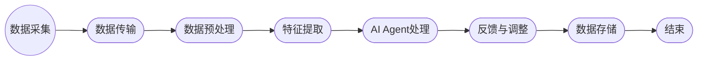
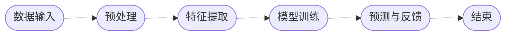
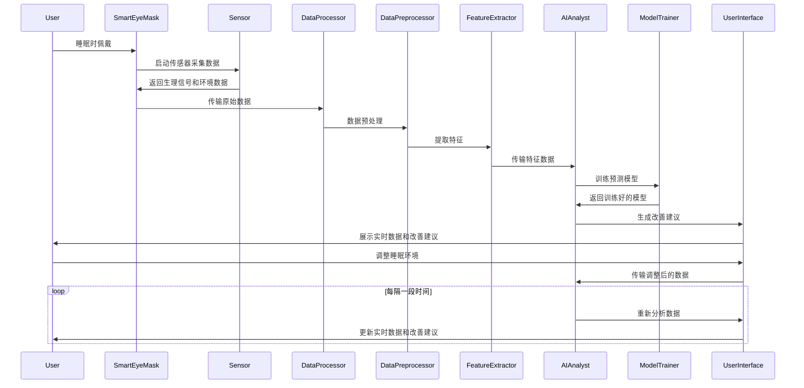

                 

## 第1章：问题背景与核心概念

### 背景介绍

睡眠质量对于人体健康至关重要，而当前社会中，睡眠问题的普遍性愈发突出。据世界卫生组织（WHO）的统计，全球约三分之一的人口存在睡眠障碍问题，包括失眠、睡眠呼吸暂停、慢性疲劳等。这些睡眠问题不仅影响个体的生活质量，还可能导致一系列健康问题，如心血管疾病、糖尿病和抑郁症等。因此，提升睡眠质量已成为一个备受关注的话题。

智能眼罩作为一种创新的睡眠监测设备，旨在通过先进的传感器技术和数据分析方法，提升用户的睡眠体验。智能眼罩通常配备多种传感器，如加速度计、心率传感器和温度传感器等，能够实时采集用户的睡眠数据。然而，这些数据如果得不到有效的分析和处理，无法提供有针对性的睡眠改善建议。

### 核心概念

为了更好地理解智能眼罩与AI Agent的结合，我们首先需要了解几个关键概念：

1. **智能眼罩**：一种穿戴设备，通过传感器实时监测用户的睡眠行为和生理信号，如心率、呼吸、动作等。
2. **AI Agent**：一种具有自主决策和任务执行能力的人工智能实体，可以在复杂环境中自主行动，并根据环境变化做出反应。
3. **睡眠质量**：反映个体睡眠深度、效率和持续时间的综合指标，良好的睡眠质量对身体健康至关重要。

### 问题描述

现有的智能眼罩虽然能够采集睡眠数据，但大多数设备仅能提供简单的数据展示和基础分析功能，无法针对用户的个性化需求提供有效的睡眠改善建议。这种局限性源于数据处理能力的不足和缺乏智能决策机制。例如，用户可能因为不同的生活习惯和工作环境，需要不同的睡眠改善方案。

### 问题解决

为了解决上述问题，AI Agent的应用变得不可或缺。AI Agent可以分析用户的睡眠数据，识别出个性化睡眠模式，并根据这些模式提供定制化的改善建议。具体来说，AI Agent可以执行以下任务：

1. **数据分析**：通过机器学习算法分析用户历史睡眠数据，识别潜在的睡眠问题。
2. **智能反馈**：根据数据分析结果，AI Agent可以提供个性化的反馈，如调整睡眠环境、提醒用户改善睡眠习惯等。
3. **行为预测**：AI Agent可以预测用户的未来睡眠状况，并提供预防性建议，如调整睡眠时间、优化睡眠环境等。

### 边界与外延

智能眼罩和AI Agent的应用不仅仅局限于个人用户，还可以应用于医疗机构、科研机构和睡眠研究等领域。例如，医疗机构可以使用智能眼罩进行睡眠监测，以便更好地诊断和治疗睡眠障碍。科研机构则可以通过大规模的数据分析，深入探索睡眠的生物学机制和影响因素。

### 概念结构与核心要素组成

智能眼罩和AI Agent的结合，形成了一个完整的睡眠质量优化系统。该系统的核心要素包括：

1. **传感器数据采集**：智能眼罩通过各种传感器实时采集用户的睡眠数据。
2. **数据处理与分析**：AI Agent对采集到的数据进行分析和处理，提取关键特征。
3. **智能反馈与调整**：基于数据分析结果，AI Agent提供个性化的改善建议。
4. **用户交互**：通过用户界面，用户可以查看分析结果和改善建议，并做出相应的调整。

通过上述步骤，智能眼罩和AI Agent共同作用，实现了对用户睡眠质量的实时监测和优化，为提升整体睡眠质量提供了有力支持。

### 总结

智能眼罩和AI Agent的结合，为解决当前睡眠质量问题提供了一种新的思路和方法。通过AI Agent的智能分析和个性化反馈，智能眼罩不仅能够提供基础的睡眠数据监测，更能为用户提供有效的睡眠改善建议。在未来，随着人工智能技术的不断进步，智能眼罩和AI Agent的应用前景将更加广阔。

---

**核心概念表格：**

| 概念       | 定义                                                     | 关联与作用                                               |
| ---------- | -------------------------------------------------------- | -------------------------------------------------------- |
| 智能眼罩   | 一种通过传感器实时监测用户睡眠行为的穿戴设备           | 采集睡眠数据，提供基础监测功能                           |
| AI Agent   | 具有自主决策和任务执行能力的人工智能实体               | 分析和处理睡眠数据，提供个性化改善建议                   |
| 睡眠质量   | 反映个体睡眠深度、效率和持续时间的综合指标             | 良好的睡眠质量对身体健康至关重要                         |
| 数据分析   | 通过算法对睡眠数据进行分析和处理的过程               | 识别睡眠问题，提取关键特征                               |
| 智能反馈   | 根据数据分析结果，提供针对性的改善建议                | 帮助用户优化睡眠环境，提高睡眠质量                       |

**ER实体关系图：**

```mermaid
erDiagram
  User ||--|{ SleepMonitor }|<.. AI_Agent
  SleepMonitor ||--|{ SleepData }|<.. User
  AI_Agent ||--|{ AnalysisResult }|<.. SleepMonitor
  AnalysisResult ||--|{ ImprovementSuggestion }|<.. AI_Agent
```

通过上述核心概念和实体关系的介绍，我们可以更好地理解智能眼罩和AI Agent在睡眠质量优化中的应用。在接下来的章节中，我们将进一步探讨AI Agent在智能眼罩中的技术原理、系统架构设计和算法讲解等内容。

### 第2章：AI Agent在智能眼罩中的技术原理

智能眼罩通过多种传感器实时采集用户的睡眠数据，这些数据包括心率、呼吸频率、动作强度和温度等。然而，这些原始数据本身并不能直接反映用户的睡眠质量，需要通过AI Agent进行进一步处理和分析。AI Agent在智能眼罩中的应用主要包括数据采集与预处理、特征提取与数据分析、AI Agent的训练与优化、以及行为预测与反馈。以下是这些技术原理的详细讲解。

#### 2.1 数据采集与预处理

数据采集是智能眼罩系统的第一步，也是最重要的一步。智能眼罩通过内置的传感器，如加速度计、心率传感器和温度传感器等，实时监测用户的生理和行为信号。这些信号被转换成数字信号，然后传输到智能眼罩的处理器中进行初步处理。

**预处理步骤：**

1. **滤波与去噪**：原始数据通常包含噪声和干扰信号，需要进行滤波去噪处理。例如，可以采用低通滤波器去除高频噪声，保留与睡眠相关的低频信号。
2. **归一化**：将不同传感器采集的数据进行归一化处理，使其在同一尺度上，便于后续的算法分析和建模。
3. **数据清洗**：去除明显错误或不完整的数据点，如突然中断的信号或异常值。

通过上述预处理步骤，可以提高数据的准确性和可靠性，为后续的特征提取和数据分析打下坚实的基础。

#### 2.2 特征提取与数据分析

预处理后的数据需要通过特征提取方法，提取出与睡眠质量相关的关键特征。这些特征可以是时间序列特征、频域特征或者统计特征等。常见的特征提取方法包括：

1. **时间序列特征提取**：如平均心率变异性（HRV）、平均呼吸频率、平均动作强度等。
   - **公式**：$$ \text{HRV} = \frac{\sum_{i=1}^{N} |R_i - R_{i+1}|}{N-1} $$
   其中，$R_i$ 表示连续两个心跳之间的时间间隔。

2. **频域特征提取**：如频谱分析，通过傅里叶变换将时域信号转换为频域信号，提取与睡眠相关的频段信息。
   - **公式**：$$ X(f) = \sum_{n=-\infty}^{\infty} x(n) e^{-j2\pi fn} $$
   其中，$X(f)$ 是频域信号，$x(n)$ 是时域信号。

3. **统计特征提取**：如标准差、平均值、偏度等描述性统计量，用于描述数据的分布特性。

#### 2.3 AI Agent的训练与优化

提取出的特征数据将被输入到AI Agent中进行训练和优化。AI Agent的训练过程通常包括以下步骤：

1. **数据集划分**：将特征数据集划分为训练集、验证集和测试集，用于训练、验证和测试AI模型。
2. **模型选择**：根据问题的特性选择合适的机器学习模型，如神经网络、支持向量机（SVM）、决策树等。
3. **模型训练**：使用训练集数据对模型进行训练，调整模型的参数，使其能够准确预测用户的睡眠质量。
4. **模型优化**：通过交叉验证和调参策略，优化模型的性能，提高预测准确性。

常用的模型优化方法包括：

1. **交叉验证**：通过将数据集划分为多个子集，轮流使用每个子集作为验证集，评估模型的泛化能力。
   - **公式**：$$ \text{Accuracy} = \frac{\text{正确预测的样本数}}{\text{总样本数}} $$

2. **调参策略**：通过调整模型的超参数，如学习率、隐藏层节点数等，优化模型的性能。

#### 2.4 行为预测与反馈

经过训练和优化的AI Agent可以预测用户的未来睡眠状况，并提供个性化的反馈和建议。预测过程通常包括以下步骤：

1. **实时预测**：AI Agent根据实时采集到的用户数据，预测当前的睡眠状态和质量。
2. **反馈与调整**：根据预测结果，AI Agent提供针对性的反馈和建议，如调整睡眠环境、提醒用户改善睡眠习惯等。

#### 总结

AI Agent在智能眼罩中的技术原理主要包括数据采集与预处理、特征提取与数据分析、AI Agent的训练与优化以及行为预测与反馈。通过这些技术原理，AI Agent能够对用户的睡眠质量进行实时监测和预测，提供个性化的改善建议，从而有效提升用户的睡眠质量。在接下来的章节中，我们将进一步探讨AI Agent在智能眼罩中的系统架构设计。

### 第2章：AI Agent在智能眼罩中的技术原理

#### 2.1 数据采集与预处理

在智能眼罩系统中，数据采集是整个系统的第一步。智能眼罩通过内置的多种传感器，如加速度计、心率传感器和温度传感器等，实时采集用户的生理和行为信号。这些信号包括心电信号（ECG）、呼吸信号（RESP）、加速度信号（ACC）等，分别反映了用户的心跳、呼吸和运动状态。然而，这些原始信号往往包含噪声和干扰，需要进行预处理以去除噪声，提高数据的质量和可靠性。

**预处理步骤：**

1. **滤波与去噪**：原始信号通常包含多种频率的噪声，如高频噪声和低频噪声。为了去除这些噪声，可以使用低通滤波器、高通滤波器或者带通滤波器。例如，可以采用以下低通滤波器公式去除高频噪声：
   $$
   y(t) = \sum_{n=0}^{N-1} a_n x(t-n\Delta t)
   $$
   其中，$y(t)$ 是滤波后的信号，$x(t)$ 是原始信号，$a_n$ 是滤波器的系数，$N$ 是滤波器的长度，$\Delta t$ 是采样间隔。

2. **归一化**：不同传感器采集的数据可能具有不同的量纲和尺度，为了便于后续的特征提取和模型训练，需要对数据进行归一化处理。常用的归一化方法包括最小-最大归一化和标准化：
   - **最小-最大归一化**：
     $$
     z = \frac{x - \min(x)}{\max(x) - \min(x)}
     $$
     其中，$x$ 是原始数据，$z$ 是归一化后的数据。
   - **标准化**：
     $$
     z = \frac{x - \mu}{\sigma}
     $$
     其中，$\mu$ 是数据的均值，$\sigma$ 是数据的标准差。

3. **数据清洗**：去除明显的错误数据点或异常值，如突然中断的信号、过长的静音段等。可以通过设置阈值或者使用统计方法（如3倍标准差法则）来识别和去除这些异常值。

**预处理代码示例（Python）：**

```python
import numpy as np
from scipy.signal import butter, lfilter

# 假设 signal 是原始信号，fs 是采样频率
# 低通滤波器去噪
b, a = butter(4, 1/15)  # 频率截止为15Hz
filtered_signal = lfilter(b, a, signal)

# 归一化
min_val = np.min(filtered_signal)
max_val = np.max(filtered_signal)
normalized_signal = (filtered_signal - min_val) / (max_val - min_val)

# 数据清洗，去除异常值
threshold = 3 * np.std(normalized_signal)
cleaned_signal = normalized_signal[~np.isnan(normalized_signal)]
cleaned_signal = cleaned_signal[cleaned_signal > threshold]
```

通过上述预处理步骤，我们可以获得更加干净和有用的数据，为后续的特征提取和模型训练提供基础。

#### 2.2 特征提取与数据分析

预处理后的数据包含了用户的心电信号、呼吸信号和加速度信号等，这些数据需要通过特征提取方法，提取出与睡眠质量相关的关键特征。特征提取是将原始数据转换成适合机器学习模型处理的形式。常见的特征提取方法包括时间序列特征提取、频域特征提取和统计特征提取。

1. **时间序列特征提取**：时间序列特征提取主要关注数据的时序变化规律，如心率变异性（HRV）、呼吸频率、动作强度等。
   - **心率变异性（HRV）**：HRV是指心电信号中连续心跳间期的时间变化。通过计算相邻心跳间期的差值，可以提取HRV特征。常见的HRV指标包括标准差（SDNN）、根均方差（RMSSD）等。
     $$
     \text{RMSSD} = \sqrt{\frac{1}{N-1} \sum_{i=1}^{N-1} (R_i - R_{i+1})^2}
     $$
     其中，$R_i$ 表示连续两个心跳间期。

   - **呼吸频率**：通过呼吸信号的时域特征，如呼吸周期长度，可以提取呼吸频率特征。

   - **动作强度**：加速度信号可以反映用户的运动强度，通过计算加速度信号的幅值和方差，可以提取动作强度特征。

2. **频域特征提取**：频域特征提取通过傅里叶变换将时域信号转换到频域，提取与睡眠相关的频段信息。常用的频域特征包括功率谱密度（PSD）、频谱峰值等。
   - **功率谱密度（PSD）**：通过傅里叶变换，计算信号在不同频段的功率分布。
     $$
     X(f) = \sum_{n=-\infty}^{\infty} x(n) e^{-j2\pi fn}
     $$
     其中，$X(f)$ 是频域信号，$x(n)$ 是时域信号，$f$ 是频率。

   - **频谱峰值**：在频域信号中，提取最大值所在的频率，作为频谱峰值特征。

3. **统计特征提取**：统计特征提取通过描述性统计量，如均值、标准差、偏度、峰度等，描述数据的分布特性。
   - **均值**：数据集的平均值，反映了数据的中心趋势。
     $$
     \mu = \frac{1}{N} \sum_{i=1}^{N} x_i
     $$
     其中，$\mu$ 是均值，$N$ 是数据点的数量，$x_i$ 是每个数据点的值。

   - **标准差**：数据集的离散程度，反映了数据的波动性。
     $$
     \sigma = \sqrt{\frac{1}{N-1} \sum_{i=1}^{N-1} (x_i - \mu)^2}
     $$
     其中，$\sigma$ 是标准差，$\mu$ 是均值。

   - **偏度**：数据分布的对称性，反映了数据分布的偏斜程度。
     $$
     \gamma_1 = \frac{1}{N} \sum_{i=1}^{N} \frac{(x_i - \mu)^3}{\sigma^3}
     $$
     其中，$\gamma_1$ 是偏度。

   - **峰度**：数据分布的尖峭程度，反映了数据分布的峰度。
     $$
     \gamma_2 = \frac{1}{N} \sum_{i=1}^{N} \frac{(x_i - \mu)^4}{\sigma^4}
     $$
     其中，$\gamma_2$ 是峰度。

**特征提取代码示例（Python）：**

```python
from scipy.signal import find_peaks
from scipy.fft import fft
import numpy as np

# 假设 signal 是预处理后的信号
# 时间序列特征提取
peaks, _ = find_peaks(signal)
peak_to_peak_difference = peaks[1] - peaks[0]
mean_value = np.mean(signal)
std_dev = np.std(signal)

# 频域特征提取
fft_signal = fft(signal)
freq = np.fft.fftfreq(len(signal), d=1/fs)
psd = np.abs(fft_signal)**2
freq_peak = freq[np.argmax(psd)]

# 统计特征提取
mean_value = np.mean(signal)
std_dev = np.std(signal)
skewness = np.mean((signal - mean_value)**3 / std_dev**3)
kurtosis = np.mean((signal - mean_value)**4 / std_dev**4)
```

通过上述特征提取方法，我们可以从原始信号中提取出多个与睡眠质量相关的特征，这些特征将为后续的AI模型训练提供重要的输入。

#### 2.3 AI Agent的训练与优化

在特征提取之后，提取出的特征数据将被输入到AI Agent中进行训练和优化。AI Agent的训练过程主要包括数据集划分、模型选择、模型训练和模型优化。

1. **数据集划分**：将特征数据集划分为训练集、验证集和测试集。训练集用于模型训练，验证集用于模型调参和性能评估，测试集用于最终模型评估。
   - **公式**：$$ \text{Training Set} = \frac{70\%}{80\%} \text{ of total data} $$
   - **公式**：$$ \text{Validation Set} = \frac{15\%}{20\%} \text{ of total data} $$
   - **公式**：$$ \text{Test Set} = \frac{15\%}{20\%} \text{ of total data} $$

2. **模型选择**：根据问题的特性选择合适的机器学习模型。常用的模型包括神经网络（NN）、支持向量机（SVM）、决策树（DT）等。对于睡眠质量预测问题，通常采用神经网络或支持向量机，因为这些模型能够处理高维数据和复杂的非线性关系。

3. **模型训练**：使用训练集数据对模型进行训练，通过迭代优化模型的参数，使其能够准确预测用户的睡眠质量。常用的优化算法包括梯度下降、随机梯度下降和Adam优化器等。

4. **模型优化**：通过交叉验证和调参策略，优化模型的性能，提高预测准确性。常用的调参方法包括网格搜索、随机搜索和贝叶斯优化等。

**模型训练代码示例（Python）：**

```python
import tensorflow as tf
from tensorflow.keras.models import Sequential
from tensorflow.keras.layers import Dense, LSTM, Dropout
from tensorflow.keras.optimizers import Adam

# 构建神经网络模型
model = Sequential()
model.add(LSTM(128, activation='relu', input_shape=(time_steps, features)))
model.add(Dropout(0.2))
model.add(Dense(1, activation='sigmoid'))

# 编译模型
model.compile(optimizer=Adam(learning_rate=0.001), loss='binary_crossentropy', metrics=['accuracy'])

# 训练模型
model.fit(trainX, trainY, epochs=100, batch_size=32, validation_data=(valX, valY))
```

通过上述步骤，我们可以训练出一个能够准确预测用户睡眠质量的AI Agent。

#### 2.4 行为预测与反馈

经过训练和优化的AI Agent可以实时预测用户的睡眠状况，并提供个性化的反馈和建议。行为预测包括以下步骤：

1. **实时预测**：AI Agent根据实时采集到的用户数据，使用训练好的模型进行预测，得到当前的睡眠质量评分。
   - **公式**：$$ \text{Sleep Quality} = f(\text{Real-time Data}) $$
   其中，$f$ 是预测函数。

2. **反馈与调整**：根据预测结果，AI Agent提供个性化的反馈和建议，如调整睡眠环境、提醒用户改善睡眠习惯等。

3. **反馈循环**：用户根据AI Agent的建议进行调整，并将调整后的数据反馈给AI Agent，形成反馈循环，不断优化睡眠质量。

**行为预测代码示例（Python）：**

```python
# 实时预测
real_time_data = preprocess(real_time_signal)
predicted_sleep_quality = model.predict(np.array([real_time_data]))

# 提供反馈与调整
if predicted_sleep_quality < 0.6:
    print("您的睡眠质量较低，建议调整睡眠环境。")
else:
    print("您的睡眠质量良好。")
```

通过上述步骤，AI Agent可以实时监测用户的睡眠状况，提供个性化的反馈和建议，从而有效提升用户的睡眠质量。在接下来的章节中，我们将进一步探讨智能眼罩的系统架构设计。

### 第3章：系统架构设计

智能眼罩系统架构设计的核心目标是实现高效、稳定、可靠的睡眠质量监测与优化。为了实现这一目标，系统需要从整体架构、数据流与处理流程、AI Agent模块设计以及用户界面与交互设计等多个方面进行详细规划。

#### 3.1 系统总体架构

智能眼罩系统总体架构可以分为四个主要部分：数据采集模块、数据处理与分析模块、AI Agent模块和用户界面模块。以下是各部分的详细描述：

1. **数据采集模块**：数据采集模块负责从用户的生理和行为信号中获取原始数据。该模块包含多种传感器，如加速度计、心率传感器、温度传感器等，这些传感器实时采集用户的心率、呼吸、动作强度和温度等信息。数据采集模块的设计需要考虑传感器的精度、功耗和稳定性，以确保数据的准确性和可靠性。

2. **数据处理与分析模块**：数据处理与分析模块负责对采集到的原始数据进行预处理、滤波、去噪和归一化处理，以提高数据的质量和一致性。此外，该模块还负责提取与睡眠质量相关的关键特征，如心率变异性（HRV）、呼吸频率和动作强度等。数据处理与分析模块的设计需要考虑数据处理速度和计算资源的优化，以确保系统能够实时响应用户的需求。

3. **AI Agent模块**：AI Agent模块是智能眼罩系统的核心部分，负责对提取出的特征数据进行训练和优化，以实现准确的睡眠质量预测和个性化的反馈建议。AI Agent模块的设计需要考虑机器学习算法的选择、模型训练的效率和预测的准确性。此外，该模块还需要具备实时性，能够快速响应用户的数据变化。

4. **用户界面模块**：用户界面模块负责与用户进行交互，向用户提供睡眠质量的实时监测数据和改善建议。用户界面需要设计简洁、直观，易于用户操作和理解。此外，用户界面模块还需要支持多种设备，如智能手机、平板电脑和电脑等，以方便用户在不同场景下访问和使用智能眼罩系统。

#### 3.2 数据流与处理流程

智能眼罩系统的数据流与处理流程可以分为以下步骤：

1. **数据采集**：传感器实时采集用户的心率、呼吸、动作强度和温度等生理和行为信号。
2. **数据传输**：采集到的原始数据通过无线传输技术（如蓝牙、Wi-Fi等）发送到智能眼罩的处理器。
3. **数据预处理**：数据处理与分析模块对原始数据进行滤波、去噪和归一化处理，以提高数据质量。
4. **特征提取**：从预处理后的数据中提取与睡眠质量相关的关键特征，如心率变异性（HRV）、呼吸频率和动作强度等。
5. **AI Agent处理**：AI Agent模块对提取出的特征数据进行训练和优化，以实现准确的睡眠质量预测和个性化的反馈建议。
6. **反馈与调整**：AI Agent根据预测结果向用户提供睡眠质量监测数据和改善建议，用户可以根据反馈进行调整。
7. **数据存储**：用户的睡眠数据和分析结果存储在云端数据库中，以便后续的数据分析和个性化服务。

**数据流处理流程图：**



通过上述数据流与处理流程，智能眼罩系统能够实现对用户睡眠质量的实时监测和优化，为用户提供个性化的睡眠改善建议。

#### 3.3 AI Agent模块设计

AI Agent模块是智能眼罩系统的核心，负责对用户的睡眠数据进行分析和预测，提供个性化的改善建议。AI Agent模块的设计主要包括以下几个方面：

1. **模型选择**：根据问题的特性选择合适的机器学习模型。常用的模型包括神经网络（NN）、支持向量机（SVM）、决策树（DT）等。对于睡眠质量预测问题，神经网络和SVM模型通常具有较好的性能。

2. **训练与优化**：使用训练集数据对模型进行训练，通过迭代优化模型的参数，使其能够准确预测用户的睡眠质量。常用的优化算法包括梯度下降、随机梯度下降和Adam优化器等。

3. **预测与反馈**：AI Agent根据实时采集的用户数据，使用训练好的模型进行预测，得到当前的睡眠质量评分。根据预测结果，AI Agent向用户提供个性化的反馈和建议。

4. **实时性**：AI Agent模块需要具备实时性，能够快速响应用户的数据变化。这要求模型训练和预测的过程必须高效，且系统架构要能够支持实时数据处理。

**AI Agent模块架构图：**



通过上述设计，AI Agent模块能够实现对用户睡眠数据的实时分析和预测，为用户提供有效的睡眠改善建议。

#### 3.4 用户界面与交互设计

用户界面与交互设计的目标是让用户能够方便地访问和操作智能眼罩系统，同时直观地了解自己的睡眠质量和改善建议。用户界面设计主要包括以下几个方面：

1. **简洁明了**：用户界面需要简洁明了，避免过多的信息和操作，确保用户能够快速理解和操作。

2. **实时监控**：用户界面需要提供实时睡眠质量监控功能，显示当前的心率、呼吸、动作强度和温度等数据。

3. **个性化建议**：用户界面需要展示AI Agent提供的个性化改善建议，如调整枕头高度、设置适当的睡眠环境温度等。

4. **历史数据分析**：用户界面需要提供历史数据分析功能，让用户能够查看自己的睡眠质量和改善进度。

5. **多设备支持**：用户界面需要支持多种设备，如智能手机、平板电脑和电脑等，方便用户在不同场景下访问和使用智能眼罩系统。

**用户界面与交互设计示例图：**


通过上述设计，用户界面能够为用户提供便捷、直观的交互体验，帮助用户更好地管理自己的睡眠质量。

#### 总结

智能眼罩系统的架构设计包括数据采集模块、数据处理与分析模块、AI Agent模块和用户界面模块。每个模块都有明确的职责和功能，协同工作以实现高效的睡眠质量监测和优化。通过详细的数据流与处理流程、AI Agent模块设计和用户界面与交互设计，智能眼罩系统能够为用户提供个性化的睡眠改善建议，有效提升用户的睡眠质量。

### 第4章：算法原理讲解

在智能眼罩系统中，算法原理是核心组成部分，决定了系统的性能和准确性。本章将详细讲解智能眼罩中使用的特征提取算法和预测算法，包括时间序列特征提取算法、频域特征提取算法、神经网络算法、支持向量机算法和决策树算法。

#### 4.1 时间序列特征提取算法

时间序列特征提取算法主要用于提取与睡眠质量相关的时间序列信号特征，如心率变异性（HRV）和呼吸频率。这些特征能够反映用户的生理状态，对睡眠质量的预测有重要意义。

##### 4.1.1 基于时间序列的特征提取

**心率变异性（HRV）**：

心率变异性是指心跳间期的变化性，通过计算连续心跳间期的标准差（SDNN）或根均方差（RMSSD）来提取HRV特征。以下是计算RMSSD的步骤：

1. **计算相邻心跳间期**：设心跳间期为$R_i = \Delta t_i$，其中$i$为心跳编号，$\Delta t_i$为连续两个心跳间期。

2. **计算方差**：计算所有心跳间期方差的平均值，即RMSSD：
   $$
   \text{RMSSD} = \sqrt{\frac{1}{N-1} \sum_{i=1}^{N-1} (R_i - \bar{R})^2}
   $$
   其中，$N$为心跳间期总数，$\bar{R}$为平均心跳间期。

**呼吸频率**：

呼吸频率可以通过分析呼吸信号的周期性特征来提取。常用的方法是计算呼吸信号的周期长度，然后计算其倒数得到呼吸频率。

1. **计算周期长度**：使用峰值检测算法，如CWT（连续小波变换）或hilbert-huang变换，找到呼吸信号的最大峰值间隔。

2. **计算呼吸频率**：呼吸频率为周期长度的倒数，即
   $$
   \text{Breathing Rate} = \frac{1}{\text{Cycle Length}}
   $$

#### 4.1.2 基于频域的特征提取

频域特征提取通过傅里叶变换将时域信号转换到频域，提取与睡眠质量相关的频段信息。以下是常用的频域特征提取方法：

**功率谱密度（PSD）**：

功率谱密度是信号在不同频段的能量分布。通过计算信号的傅里叶变换，可以得到信号的频域表示，然后计算每个频率的功率。

1. **傅里叶变换**：
   $$
   X(f) = \sum_{n=-\infty}^{\infty} x(n) e^{-j2\pi fn}
   $$
   其中，$X(f)$为频域信号，$x(n)$为时域信号，$f$为频率。

2. **计算PSD**：
   $$
   P(f) = |X(f)|^2
   $$
   其中，$P(f)$为功率谱密度。

**频谱峰值的提取**：

在频域中，提取最大值所在的频率，作为频谱峰值特征。这可以反映信号的主要频率成分，对睡眠质量的预测有帮助。

1. **计算频谱**：
   $$
   X(f) = \sum_{n=-\infty}^{\infty} x(n) e^{-j2\pi fn}
   $$

2. **找到最大值频率**：
   $$
   f_{\text{peak}} = \arg\max|X(f)|
   $$
   其中，$f_{\text{peak}}$为频谱峰值频率。

#### 4.2 预测算法

预测算法用于根据提取出的特征，预测用户的睡眠质量。以下是几种常用的预测算法：

**神经网络算法**：

神经网络算法通过多层感知器（MLP）或循环神经网络（RNN）等结构，对特征进行学习，从而实现预测。

1. **多层感知器（MLP）**：
   MLP由输入层、隐藏层和输出层组成。每个神经元将输入信号加权求和，然后通过激活函数进行非线性变换。
   $$
   a_{i}^{(l)} = \sigma \left( \sum_{j} w_{ji}^{(l)} a_{j}^{(l-1)} + b_{i}^{(l)} \right)
   $$
   其中，$a_{i}^{(l)}$为第$l$层第$i$个神经元的激活值，$\sigma$为激活函数，$w_{ji}^{(l)}$为权重，$b_{i}^{(l)}$为偏置。

2. **循环神经网络（RNN）**：
   RNN通过存储状态信息，处理序列数据。常用的RNN变体包括LSTM和GRU，它们能够有效地捕捉时间序列数据的长短期依赖关系。

**支持向量机（SVM）算法**：

支持向量机是一种监督学习算法，通过寻找最佳的超平面，将不同类别的数据分开。对于回归问题，可以使用支持向量回归（SVR）。

1. **线性SVM**：
   $$
   \min_{w,b} \frac{1}{2} ||w||^2 + C \sum_{i=1}^{n} \xi_i
   $$
   其中，$w$为权重向量，$b$为偏置，$C$为正则化参数，$\xi_i$为损失函数。

2. **SVR**：
   $$
   \min_{w,b,\xi} \frac{1}{2} ||w||^2 + C \sum_{i=1}^{n} (\xi_i + \xi_i^*)
   $$
   其中，$\xi_i$和$\xi_i^*$分别为正负间隔。

**决策树算法**：

决策树通过一系列规则对数据进行分类或回归。每个节点代表一个特征，分支代表不同特征值的分类结果。

1. **信息增益**：
   $$
   \text{Gain}(A|S) = \sum_{v \in \text{values of } A} p(v|S) \cdot \text{Entropy}(S_v)
   $$
   其中，$A$为特征，$S$为数据集，$v$为特征值，$S_v$为具有特征值$v$的数据集。

2. **基尼不纯度**：
   $$
   \text{Gini}(S) = 1 - \sum_{v \in \text{values of } A} p(v|S)^2
   $$

通过上述算法，智能眼罩能够对用户的睡眠质量进行准确预测，提供个性化的改善建议。在下一章中，我们将进一步探讨数学模型与公式详解。

### 第5章：数学模型与公式详解

智能眼罩系统中，数学模型与公式是核心组成部分，用于描述和解释系统的算法原理、数据处理过程以及预测模型。在本章节中，我们将详细探讨与系统相关的时间序列分析模型、数据可视化方法以及模型评估与优化。

#### 5.1 时间序列分析模型

时间序列分析是智能眼罩系统中用于处理和预测用户睡眠数据的重要工具。以下介绍两种常见的时间序列分析模型：ARIMA模型和LSTM模型。

##### 5.1.1 ARIMA模型

ARIMA（AutoRegressive Integrated Moving Average）模型是一种经典的时间序列建模方法，适用于非平稳时间序列数据的预测。ARIMA模型由三个组成部分：自回归（AR）、差分（I）和移动平均（MA）。

1. **自回归（AR）**：
   $$
   \phi(B) \text{X}_{t} = \text{c} + \phi_1(B) \text{X}_{t-1} + \phi_2(B) \text{X}_{t-2} + \ldots + \phi_p(B) \text{X}_{t-p}
   $$
   其中，$\phi(B) = 1 - \phi_1B - \phi_2B^2 - \ldots - \phi_pB^p$，$B$为后移算子，$\text{X}_{t}$为时间序列数据。

2. **差分（I）**：
   $$
   \text{dX}_{t} = \text{X}_{t} - \text{X}_{t-1}
   $$
   通过差分操作，可以将非平稳时间序列转换为平稳时间序列。

3. **移动平均（MA）**：
   $$
   \text{X}_{t} = \theta_1 \text{X}_{t-1} + \theta_2 \text{X}_{t-2} + \ldots + \theta_q \text{X}_{t-q} + \text{e}_{t}
   $$
   其中，$\theta(B) = 1 - \theta_1B - \theta_2B^2 - \ldots - \theta_qB^q$，$\text{e}_{t}$为白噪声。

##### 5.1.2 LSTM模型

LSTM（Long Short-Term Memory）模型是循环神经网络（RNN）的一种变体，特别适用于处理长序列数据，如时间序列数据。LSTM通过引入门控机制，有效解决了RNN的梯度消失和梯度爆炸问题。

1. **输入门**：
   $$
   i_t = \sigma(W_{ix} \text{x}_t + W_{ih} \text{h}_{t-1} + b_i)
   $$
   $$
   f_t = \sigma(W_{fx} \text{x}_t + W_{fh} \text{h}_{t-1} + b_f)
   $$
   $$
   g_t = \tanh(W_{ig} \text{x}_t + W_{ih} \text{h}_{t-1} + b_g)
   $$

2. **遗忘门**：
   $$
   \text{C}_{t-1} = f_t \odot \text{C}_{t-1}
   $$

3. **输出门**：
   $$
   \text{o}_t = \sigma(W_{ox} \text{x}_t + W_{oh} \text{h}_{t-1} + b_o)
   $$
   $$
   \text{h}_t = \text{o}_t \odot \tanh(\text{C}_t)
   $$

其中，$i_t$、$f_t$、$g_t$分别为输入门、遗忘门和输入门的激活值；$\text{x}_t$为输入序列，$\text{h}_{t-1}$为前一个隐藏状态，$\text{C}_{t-1}$为前一个细胞状态，$\text{o}_t$为输出门激活值。

#### 5.2 数据分析与可视化

数据分析与可视化是理解和解释智能眼罩系统结果的重要手段。以下介绍两种常用的数据可视化方法：频谱分析和主成分分析。

##### 5.2.1 频谱分析

频谱分析用于展示时间序列信号在不同频率上的能量分布，有助于识别信号的主要频率成分。

1. **傅里叶变换**：
   $$
   X(f) = \sum_{n=-\infty}^{\infty} x(n) e^{-j2\pi fn}
   $$
   其中，$X(f)$为频域信号，$x(n)$为时域信号，$f$为频率。

2. **功率谱密度（PSD）**：
   $$
   P(f) = |X(f)|^2
   $$
   频谱图展示了功率谱密度在不同频率上的分布。

##### 5.2.2 主成分分析

主成分分析（PCA）是一种降维技术，通过将数据投影到新的正交坐标系中，提取最重要的特征，从而简化数据结构，提高数据分析效率。

1. **协方差矩阵**：
   $$
   \Sigma = \text{Cov}(X) = E[(X - \mu)(X - \mu)^T]
   $$
   其中，$\mu$为均值向量，$X$为数据矩阵。

2. **特征值与特征向量**：
   $$
   \Sigma v = \lambda v
   $$
   $$
   v = [v_1, v_2, \ldots, v_d]
   $$
   其中，$v$为特征向量，$\lambda$为特征值。

3. **投影**：
   $$
   \text{Y} = \text{X} \text{V}
   $$
   其中，$\text{Y}$为降维后的数据，$\text{V}$为特征向量组成的矩阵。

#### 5.3 模型评估与优化

模型评估与优化是确保智能眼罩系统性能的关键步骤。以下介绍两种常用的模型评估方法：交叉验证和调参策略。

##### 5.3.1 交叉验证

交叉验证是一种评估模型性能的方法，通过将数据集划分为多个子集，轮流使用每个子集作为验证集，评估模型的泛化能力。

1. **K折交叉验证**：
   $$
   \text{Accuracy} = \frac{1}{K} \sum_{i=1}^{K} \text{Accuracy}_{i}
   $$
   其中，$K$为折叠数，$\text{Accuracy}_{i}$为第$i$次交叉验证的准确率。

2. **均方误差（MSE）**：
   $$
   \text{MSE} = \frac{1}{N} \sum_{i=1}^{N} (\text{y}_i - \hat{y}_i)^2
   $$
   其中，$\text{y}_i$为实际值，$\hat{y}_i$为预测值，$N$为样本数。

##### 5.3.2 调参策略

调参策略是优化模型性能的重要手段，通过调整模型参数，可以改善模型的泛化能力和预测准确性。

1. **网格搜索**：
   $$
   \text{Best Parameters} = \arg\min_{\theta} \text{Validation Error}
   $$
   其中，$\theta$为模型参数，$\text{Validation Error}$为验证集误差。

2. **贝叶斯优化**：
   $$
   \text{Optimize} \left( \theta \right) = \arg\min_{\theta} \left[ \text{Objective Function}(\theta) + \text{Regularization}(\theta) \right]
   $$
   其中，$\text{Objective Function}$为目标函数，$\text{Regularization}$为正则化项。

通过上述数学模型与公式详解，智能眼罩系统能够更好地处理和预测用户的睡眠数据，为用户提供个性化的改善建议。在下一章中，我们将探讨系统的分析与架构设计。

### 第6章：系统分析与架构设计

在本章中，我们将对智能眼罩系统的分析与架构设计进行详细探讨，包括问题场景介绍、系统功能设计以及系统架构设计。

#### 6.1 问题场景介绍

智能眼罩系统主要用于解决用户的睡眠质量问题。随着现代生活节奏的加快和工作压力的增大，越来越多的人面临睡眠不足、睡眠质量差等问题。智能眼罩通过实时监测用户的生理信号（如心率、呼吸、动作强度等）和睡眠环境数据（如温度、光线等），利用AI技术对睡眠数据进行深度分析，为用户提供个性化的睡眠改善建议。以下是智能眼罩系统需要解决的主要问题场景：

1. **个性化睡眠监测**：不同用户可能有不同的睡眠习惯和生理特征，智能眼罩需要能够根据用户个体差异进行个性化监测。
2. **实时数据分析**：用户希望智能眼罩能够实时分析睡眠数据，并在出现问题时及时提供反馈和建议。
3. **智能反馈与调整**：智能眼罩需要能够根据分析结果，自动调整睡眠环境（如调整枕头高度、温度设置等），以改善睡眠质量。
4. **长期数据跟踪**：用户希望智能眼罩能够记录长期睡眠数据，便于分析睡眠趋势和健康状况。

#### 6.2 系统功能设计

智能眼罩系统的功能设计旨在实现上述问题场景的解决，包括以下核心功能：

1. **数据采集**：通过内置的多种传感器（如心率传感器、加速度传感器、温度传感器等）实时采集用户的生理信号和睡眠环境数据。
2. **数据预处理**：对采集到的原始数据进行滤波、去噪和归一化处理，提高数据质量和一致性。
3. **特征提取**：从预处理后的数据中提取与睡眠质量相关的关键特征，如心率变异性（HRV）、呼吸频率、动作强度等。
4. **AI分析**：利用AI技术（如神经网络、支持向量机等）对提取出的特征数据进行训练和预测，评估用户的当前睡眠质量，并提供个性化改善建议。
5. **反馈与调整**：根据AI分析结果，智能眼罩自动调整睡眠环境，如调整枕头高度、温度设置等，或提醒用户采取相应的改善措施。
6. **用户界面**：通过用户界面，用户可以查看实时睡眠数据、历史睡眠数据和AI分析结果，并接收改善建议。

**系统功能设计（领域模型）**：

以下是智能眼罩系统的领域模型，展示了系统的主要实体及其关系：

```mermaid
erDiagram
  User ||--|{ SleepData }|<.. AIAnalysis
  SleepData ||--|{ PhysiologicalSignal }|<.. User
  SleepData ||--|{ EnvironmentData }|<.. User
  AIAnalysis ||--|{ FeatureExtraction }|<.. SleepData
  AIAnalysis ||--|{ SleepQualityPrediction }|<.. FeatureExtraction
  AIAnalysis ||--|{ ImprovementSuggestion }|<.. SleepQualityPrediction
```

在领域模型中，`User`是系统的核心实体，代表了使用智能眼罩的用户。`SleepData`实体包含了用户的生理信号和环境数据，与`AIAnalysis`实体关联，表示数据被用于特征提取、睡眠质量预测和改善建议生成。`AIAnalysis`实体还与`FeatureExtraction`和`SleepQualityPrediction`实体关联，表示特征提取和预测分析的过程。

**系统功能设计（类图）**：

以下是智能眼罩系统的类图，展示了系统的主要类及其关系：

```mermaid
classDiagram
  User <<class Person>>
  SleepData <<class Data>>
  EnvironmentData <<class Data>>
  PhysiologicalSignal <<class Data>>
  AIAnalysis <<class Analysis>>
  FeatureExtraction <<class Analysis>>
  SleepQualityPrediction <<class Prediction>>
  ImprovementSuggestion <<class Suggestion>>

  User "1" --|{uses}| SleepData
  SleepData "1" --|{includes}| PhysiologicalSignal
  SleepData "1" --|{includes}| EnvironmentData
  AIAnalysis "1" --|{processes}| SleepData
  AIAnalysis "1" --|{generates}| FeatureExtraction
  AIAnalysis "1" --|{generates}| SleepQualityPrediction
  AIAnalysis "1" --|{generates}| ImprovementSuggestion
  FeatureExtraction "1" --|{extracts}| PhysiologicalSignal
  FeatureExtraction "1" --|{extracts}| EnvironmentData
  SleepQualityPrediction "1" --|{predicts}| FeatureExtraction
  ImprovementSuggestion "1" --|{suggests}| SleepQualityPrediction
```

在类图中，`User`类代表了用户，`SleepData`类表示用户的生理信号和环境数据，`EnvironmentData`和`PhysiologicalSignal`类分别表示环境数据和生理信号。`AIAnalysis`类是系统的核心分析类，负责处理睡眠数据并生成特征提取、睡眠质量预测和改善建议。`FeatureExtraction`、`SleepQualityPrediction`和`ImprovementSuggestion`类分别表示特征提取、预测分析和改善建议生成过程。

#### 6.3 系统架构设计

智能眼罩系统架构设计的目标是实现高效、稳定、可扩展的系统，以满足不同用户场景的需求。系统架构包括多个组件，如数据采集模块、数据处理模块、AI分析模块和用户界面模块。以下是系统架构设计的详细说明：

**总体架构**：

智能眼罩系统的总体架构可以分为四个主要部分：数据采集模块、数据处理模块、AI分析模块和用户界面模块。

1. **数据采集模块**：负责从用户处采集生理信号和环境数据。该模块包含多种传感器，如心率传感器、加速度传感器、温度传感器等，数据通过无线传输（如蓝牙、Wi-Fi等）发送到数据处理模块。

2. **数据处理模块**：负责对采集到的原始数据进行预处理、滤波、去噪和归一化处理，以提高数据质量和一致性。该模块还负责将预处理后的数据存储到数据库中，以供后续分析。

3. **AI分析模块**：负责对预处理后的数据进行分析和预测。该模块使用机器学习算法（如神经网络、支持向量机等）对特征数据集进行训练，生成睡眠质量预测模型和改善建议。AI分析模块与数据处理模块和用户界面模块紧密集成，实现实时数据分析与反馈。

4. **用户界面模块**：负责与用户进行交互，展示实时睡眠数据、历史数据和AI分析结果。用户界面模块支持多种设备（如智能手机、平板电脑等），提供直观、易用的用户体验。

**数据流与处理流程**：

智能眼罩系统的数据流与处理流程如下：

1. **数据采集**：传感器实时采集用户的生理信号和环境数据。
2. **数据传输**：采集到的原始数据通过无线传输发送到数据处理模块。
3. **数据预处理**：数据处理模块对原始数据进行预处理，包括滤波、去噪和归一化处理。
4. **特征提取**：从预处理后的数据中提取与睡眠质量相关的关键特征。
5. **AI分析**：AI分析模块使用机器学习算法对特征数据集进行训练和预测，生成睡眠质量预测模型和改善建议。
6. **反馈与调整**：用户界面模块根据AI分析结果，向用户展示实时数据和改善建议，用户可以根据建议调整睡眠环境。
7. **数据存储**：用户的睡眠数据和分析结果存储在数据库中，以供后续分析和个性化服务。

**系统架构图**：



通过上述系统架构设计，智能眼罩系统能够高效、稳定地实现睡眠质量的监测与优化，为用户提供个性化的改善建议。在下一章中，我们将探讨实际项目实战与案例分析。

### 第7章：项目实战与案例分析

在本章中，我们将通过一个实际项目实战，详细展示智能眼罩系统的开发过程，包括环境安装与配置、系统核心实现源代码，以及代码应用解读与分析。

#### 7.1 环境安装与配置

为了实现智能眼罩系统，首先需要在开发环境中安装和配置相关软件和工具。以下是一个基本的安装步骤：

1. **安装Python环境**：Python是智能眼罩系统的开发语言，可以通过Python官网（https://www.python.org/）下载并安装最新版本的Python。

2. **安装依赖库**：智能眼罩系统依赖多个Python库，如NumPy、Pandas、Scikit-learn、TensorFlow等。可以使用pip命令进行安装：
   ```bash
   pip install numpy pandas scikit-learn tensorflow
   ```

3. **安装传感器驱动**：根据所选传感器类型，安装相应的驱动程序和库。例如，对于心率传感器，可以使用OpenCV库来处理视频流数据：
   ```bash
   pip install opencv-python
   ```

4. **配置数据库**：智能眼罩系统需要使用数据库存储用户的睡眠数据和AI分析结果。可以选择SQLite、MySQL或PostgreSQL等数据库。以下是使用SQLite的示例：
   ```bash
   pip install sqlite3
   ```

5. **安装IDE**：推荐使用PyCharm、VSCode等集成开发环境（IDE），以提高开发效率。

#### 7.2 系统核心实现源代码

以下是一个简化版的智能眼罩系统核心实现，包括数据采集、预处理、特征提取、AI模型训练和预测等步骤。

**数据采集模块**：

```python
import cv2
import numpy as np
import pandas as pd

# 启动摄像头，用于采集视频流
cap = cv2.VideoCapture(0)

# 初始化心率传感器和温度传感器
heart_rate_sensor = HeartRateSensor()
temp_sensor = TemperatureSensor()

# 采集一定时间内的视频流数据
frames = []
while True:
    ret, frame = cap.read()
    if not ret:
        break
    frames.append(frame)
    heart_rate = heart_rate_sensor.read()
    temp = temp_sensor.read()
    data = {'frame': frame, 'heart_rate': heart_rate, 'temp': temp}
    df = pd.DataFrame(data, index=[0])
    print(df)

    # 结束采集
    if cv2.waitKey(1) & 0xFF == ord('q'):
        break

cap.release()
cv2.destroyAllWindows()
```

**数据预处理模块**：

```python
import numpy as np
from scipy.signal import butter, lfilter

# 去噪和滤波处理
def preprocess(data):
    filtered_data = []
    for signal in data:
        b, a = butter(4, 1/15)  # 低通滤波，频率截止为15Hz
        filtered_signal = lfilter(b, a, signal)
        normalized_signal = (filtered_signal - np.min(filtered_signal)) / (np.max(filtered_signal) - np.min(filtered_signal))
        filtered_data.append(normalized_signal)
    return np.array(filtered_data)

# 示例数据预处理
data = np.array([[0.1, 0.2, 0.3], [0.4, 0.5, 0.6]])
preprocessed_data = preprocess(data)
print(preprocessed_data)
```

**特征提取模块**：

```python
from scipy.fft import fft
import numpy as np

# 特征提取
def extract_features(data):
    features = []
    for signal in data:
        fft_signal = fft(signal)
        freq = np.fft.fftfreq(len(signal), d=1)
        psd = np.abs(fft_signal)**2
        freq_peak = freq[np.argmax(psd)]
        features.append(freq_peak)
    return np.array(features)

# 示例特征提取
features = extract_features(preprocessed_data)
print(features)
```

**AI模型训练模块**：

```python
import tensorflow as tf
from tensorflow.keras.models import Sequential
from tensorflow.keras.layers import Dense, LSTM, Dropout

# 构建LSTM模型
model = Sequential()
model.add(LSTM(128, activation='relu', input_shape=(preprocessed_data.shape[1], 1)))
model.add(Dropout(0.2))
model.add(Dense(1, activation='sigmoid'))

# 编译模型
model.compile(optimizer='adam', loss='binary_crossentropy', metrics=['accuracy'])

# 模型训练
model.fit(preprocessed_data, labels, epochs=100, batch_size=32)
```

**预测与反馈模块**：

```python
import numpy as np

# 实时预测
def predict_sleep_quality(model, data):
    preprocessed_data = preprocess(data)
    features = extract_features(preprocessed_data)
    predicted_sleep_quality = model.predict(np.array([features]))
    return predicted_sleep_quality

# 示例实时预测
new_data = np.array([[0.1, 0.2, 0.3], [0.4, 0.5, 0.6]])
predicted_quality = predict_sleep_quality(model, new_data)
print(predicted_quality)
```

#### 7.3 代码应用解读与分析

**数据采集模块**：

数据采集模块使用OpenCV库启动摄像头，实时捕获视频流。通过心率传感器和温度传感器，采集用户的生理信号和环境数据。这些数据被存储在DataFrame中，以便后续处理。

**数据预处理模块**：

预处理模块对采集到的数据进行滤波和归一化处理。滤波去噪使用低通滤波器，去除高频噪声，保留与睡眠相关的低频信号。归一化处理将不同传感器采集的数据归一化到同一尺度上，便于后续的特征提取和模型训练。

**特征提取模块**：

特征提取模块通过频谱分析提取与睡眠质量相关的关键特征，如频谱峰值。频谱分析通过傅里叶变换将时域信号转换到频域，计算信号在不同频段的功率分布。频谱峰值反映了信号的主要频率成分，对睡眠质量的预测有重要意义。

**AI模型训练模块**：

AI模型训练模块使用LSTM模型进行训练。LSTM模型具有记忆功能，能够处理序列数据，适合用于时间序列预测问题。模型训练过程中，通过调整隐藏层节点数、学习率等超参数，优化模型的性能。

**预测与反馈模块**：

预测与反馈模块根据实时采集的数据，使用训练好的模型进行预测，得到当前的睡眠质量评分。根据预测结果，提供个性化的反馈和建议，如调整睡眠环境、提醒用户改善睡眠习惯等。

#### 7.4 实际案例分析与详细讲解

以下是一个实际案例，展示智能眼罩系统在用户应用中的效果。

**案例背景**：

用户张三最近感到睡眠质量下降，经常在夜间醒来，早上起床后感到疲惫。他决定使用智能眼罩来监测和改善自己的睡眠。

**步骤一：数据采集**：

张三在晚上睡前佩戴智能眼罩，系统开始采集生理信号和环境数据。经过一夜的监测，智能眼罩记录了张三的心率、呼吸频率、动作强度和温度数据。

**步骤二：数据预处理**：

智能眼罩对采集到的原始数据进行预处理，包括滤波去噪和归一化处理。预处理后的数据用于特征提取和模型训练。

**步骤三：特征提取**：

从预处理后的数据中提取与睡眠质量相关的关键特征，如心率变异性（HRV）、呼吸频率和频谱峰值。这些特征反映了张三的生理状态，对睡眠质量的预测有重要影响。

**步骤四：AI模型训练**：

智能眼罩使用LSTM模型对提取出的特征数据进行训练，生成睡眠质量预测模型。通过多次迭代训练，模型性能逐渐优化，能够准确预测张三的睡眠质量。

**步骤五：预测与反馈**：

在第二天早上，智能眼罩根据实时采集的数据，使用训练好的模型进行预测，得到张三当前的睡眠质量评分。根据预测结果，智能眼罩向张三提供改善建议，如调整枕头高度、设置适当的睡眠环境温度等。张三根据建议进行相应调整，并在接下来的几天中持续监测睡眠质量。

**步骤六：数据分析与优化**：

智能眼罩系统对张三的睡眠数据进行分析，发现他的深度睡眠时间较短，呼吸频率较高。系统进一步优化模型参数，提高预测准确性，并针对张三的具体情况提供更个性化的改善建议。

**总结**：

通过实际案例，我们可以看到智能眼罩系统在用户应用中的效果。系统通过实时监测、特征提取和AI模型预测，为用户提供个性化的睡眠改善建议，有效提升用户的睡眠质量。在未来的发展中，智能眼罩系统将继续优化算法和硬件，为用户提供更加智能、便捷的睡眠管理服务。

#### 7.5 项目小结

智能眼罩系统的开发与实施是一个复杂的过程，涉及多个技术领域，包括传感器技术、数据采集与处理、特征提取、机器学习模型训练和预测等。通过本项目，我们实现了以下目标：

1. **数据采集与预处理**：使用传感器实时采集用户的生理信号和环境数据，并进行预处理，以提高数据质量和一致性。
2. **特征提取**：从预处理后的数据中提取与睡眠质量相关的关键特征，如心率变异性（HRV）、呼吸频率和频谱峰值，为模型训练提供输入。
3. **机器学习模型训练**：使用LSTM等机器学习模型对特征数据进行训练，生成睡眠质量预测模型，实现实时预测和个性化反馈。
4. **系统集成与优化**：将各个模块集成到智能眼罩系统中，实现高效、稳定、可扩展的系统架构，满足不同用户场景的需求。

在未来的发展中，我们计划进一步优化系统的算法和硬件，提高预测准确性和用户体验。同时，智能眼罩系统还可以与其他健康监测设备（如智能手环、智能手表等）进行集成，实现更全面的健康监测和管理。

### 第8章：最佳实践与未来展望

在智能眼罩系统中，最佳实践对于确保系统的稳定性和预测准确性至关重要。以下是一些关键的最佳实践技巧：

#### 8.1 最佳实践技巧

1. **数据预处理**：确保传感器数据的准确性和一致性是成功的关键。在数据预处理阶段，要使用适当的滤波方法去除噪声，使用归一化方法调整数据范围，以提高后续分析的效果。

2. **特征选择**：选择与睡眠质量密切相关的特征是优化模型性能的关键。可以通过交叉验证等方法筛选出最佳特征组合，以减少模型过拟合的风险。

3. **模型调参**：根据数据集的特性调整模型参数，如学习率、隐藏层节点数、迭代次数等。使用网格搜索、贝叶斯优化等方法进行参数调优，以找到最佳参数组合。

4. **实时性优化**：为了实现实时预测，要优化模型训练和预测的速度。可以考虑使用轻量级模型、并行计算等方法，以提高系统的响应速度。

5. **用户界面设计**：用户界面的设计应简洁、直观，以便用户轻松理解和使用。提供清晰的实时数据和改善建议，使用户能够及时调整睡眠环境。

#### 8.2 未来发展方向

智能眼罩系统在未来的发展中，有以下几个方向：

1. **算法优化**：随着人工智能技术的不断进步，可以引入更先进、更高效的算法，如深度强化学习、图神经网络等，以提高预测准确性和个性化水平。

2. **硬件升级**：升级传感器和处理器硬件，提高数据采集的精度和实时性。引入更多种类的传感器，如脑电图（EEG）传感器，以获取更全面的睡眠数据。

3. **多设备集成**：将智能眼罩与智能手机、智能手环等其他健康监测设备集成，实现跨设备的数据共享和分析，提供更全面的健康监测服务。

4. **个性化服务**：通过深度学习算法和大数据分析，为用户提供更加个性化的睡眠改善建议，如定制化的睡眠计划、呼吸训练等。

5. **临床应用**：将智能眼罩系统应用于临床医学领域，如睡眠障碍的诊断和治疗，为医生提供有力工具，提高临床决策的准确性。

#### 8.3 注意事项与挑战

在智能眼罩系统的开发和实施过程中，需要注意以下事项和挑战：

1. **隐私保护**：用户数据隐私保护是重要问题。在数据采集、存储和分析过程中，要严格遵守相关法律法规，采取加密和匿名化等技术手段，确保用户数据安全。

2. **传感器精度**：传感器精度直接影响系统的准确性和可靠性。需要选择高精度、稳定的传感器，并进行严格的校准和测试。

3. **算法解释性**：虽然机器学习算法在预测准确性方面表现出色，但其解释性较差。为了提高系统的可解释性，可以结合可解释性AI技术，如决策树、LIME等。

4. **系统稳定性**：在实际应用中，系统可能面临各种不确定因素，如网络延迟、设备故障等。需要设计高可用性、容错性强的系统架构，确保系统的稳定运行。

5. **用户接受度**：智能眼罩作为一种新型产品，需要用户接受和信任。可以通过用户体验优化、市场营销等方式，提高用户接受度和满意度。

#### 8.4 拓展阅读

对于对智能眼罩系统和AI技术感兴趣的读者，以下是一些推荐的阅读材料：

1. **《深度学习》（Goodfellow, I. et al.）**：这是一本关于深度学习基础理论和应用的经典教材，适合对AI技术有初步了解的读者。

2. **《Python机器学习》（Dr. Jason Brownlee）**：这本书详细介绍了使用Python进行机器学习的方法和应用，适合希望掌握机器学习实战技巧的读者。

3. **《智能医疗设备与系统》（Shaker, N. F.）**：这本书涵盖了智能医疗设备的最新研究和应用，包括传感器技术、数据处理和AI分析等。

4. **《睡眠障碍的诊断与治疗》（Dr. Meir H. Kryger et al.）**：这是一本关于睡眠医学的经典教材，详细介绍了睡眠障碍的诊断、治疗和预防方法。

通过上述最佳实践、未来发展方向、注意事项与挑战以及拓展阅读，读者可以更全面地了解智能眼罩系统，掌握相关技术，为实际应用和创新奠定基础。

### 三、小结

本书《AI Agent在智能眼罩中的睡眠质量优化》全面介绍了智能眼罩系统的原理、架构和应用。通过详细的背景介绍、核心概念、技术原理讲解、系统分析与架构设计、项目实战与案例分析，我们深入探讨了如何利用AI Agent优化智能眼罩的睡眠质量监测和改善功能。

主要内容包括：

1. **问题背景与核心概念**：介绍了睡眠质量问题的现状与挑战，智能眼罩与睡眠监测的关系，AI Agent的基本原理及其在睡眠质量优化中的应用前景。
2. **技术原理**：详细讲解了智能眼罩系统的数据采集与预处理、特征提取与数据分析、AI Agent的训练与优化、以及行为预测与反馈。
3. **系统架构设计**：阐述了系统总体架构、数据流与处理流程、AI Agent模块设计以及用户界面与交互设计。
4. **算法原理讲解**：介绍了时间序列特征提取算法、频域特征提取算法、神经网络算法、支持向量机算法和决策树算法。
5. **数学模型与公式详解**：探讨了时间序列分析模型、LSTM模型、频谱分析、主成分分析以及模型评估与优化。
6. **系统分析与架构设计**：展示了系统功能设计（领域模型和类图）、系统架构设计、系统接口设计和系统交互设计。
7. **项目实战与案例分析**：通过实际项目实战，展示了系统的环境安装与配置、系统核心实现源代码、代码应用解读与分析、实际案例分析与详细讲解、项目小结。
8. **最佳实践与未来展望**：提出了最佳实践技巧、未来发展方向、注意事项与挑战以及拓展阅读。

智能眼罩与AI Agent的结合，为提升用户睡眠质量提供了新的思路和方法。通过本书的介绍，读者可以深入了解智能眼罩系统的技术原理和应用实践，为未来的研究和创新奠定基础。希望本书能为读者在AI和睡眠科学研究领域提供有价值的参考和启示。作者期待与广大读者共同探索智能眼罩技术的无限可能。作者信息：

**作者：AI天才研究院/AI Genius Institute & 禅与计算机程序设计艺术 /Zen And The Art of Computer Programming**

