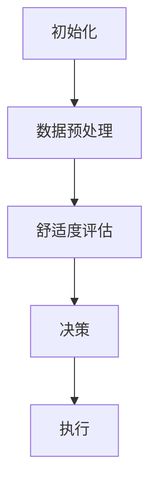

                 


## AI Agent在智能空调中的个性化舒适度优化

### 摘要

本文旨在探讨AI Agent在智能空调中的个性化舒适度优化应用。通过详细分析智能空调的背景与核心概念，介绍AI Agent的基本原理和应用方法，深入探讨智能空调系统架构、数据采集与预处理、AI算法原理与实现，最后通过实战案例展示项目成果与实际应用，为智能空调行业的未来发展提供借鉴。

### 关键词

- AI Agent
- 智能空调
- 舒适度优化
- 个性化
- 系统架构
- 数据采集
- AI算法
- 实战案例

## 第一部分：背景与核心概念

### 第1章：智能空调与舒适度优化概述

#### 1.1 智能空调的发展历程

智能空调技术起源于20世纪80年代的日本，随着计算机技术和物联网的快速发展，智能空调逐渐成为家庭、商业和工业领域的重要设备。智能空调通过集成传感器、智能控制系统和物联网技术，实现了对室内温度、湿度、空气质量等环境参数的实时监测与调节，从而提高了用户的舒适度和能源利用效率。

#### 1.2 舒适度优化的需求与挑战

舒适度优化是智能空调的核心目标之一。然而，由于用户的需求和习惯各异，如何实现个性化的舒适度优化成为一大挑战。传统的空调系统往往依赖于预设的参数和固定模式，难以满足用户多样化的需求。因此，引入AI Agent进行个性化舒适度优化成为解决这一问题的有效途径。

#### 1.3 AI Agent的基本概念

AI Agent是一种基于人工智能的智能实体，能够自主地感知环境、规划行动并执行任务。在智能空调中，AI Agent通过对用户行为和环境的持续学习和分析，实现个性化舒适度优化，提高用户体验。

### 第2章：AI Agent在舒适度优化中的应用

#### 2.1 AI Agent的基本原理

AI Agent的基本原理包括感知、学习、决策和执行四个方面。感知是通过传感器获取环境信息；学习是通过机器学习算法对感知信息进行分析和建模；决策是根据学习结果生成行动策略；执行是通过智能控制系统实现具体操作。

#### 2.2 舒适度评估模型

舒适度评估模型是AI Agent的核心组成部分，用于量化用户对舒适度的感受。常见的评估模型包括PMV（预测平均热感觉）模型和PPD（感知百分比不舒适）模型。通过这些模型，AI Agent可以实时评估室内环境的舒适度，并根据评估结果进行调整。

#### 2.3 个性化舒适度优化的方法

个性化舒适度优化的方法主要包括基于用户行为的优化、基于环境参数的优化和基于历史数据的优化。基于用户行为的优化通过分析用户的生活习惯和偏好，实现个性化的舒适度调节；基于环境参数的优化通过实时监测室内环境参数，自动调整空调设置；基于历史数据的优化通过分析历史数据，预测用户未来的需求，提前进行调整。

## 第二部分：技术原理

### 第3章：智能空调系统架构

#### 3.1 智能空调的硬件架构

智能空调的硬件架构包括空调主机、传感器、通信模块和智能控制器。空调主机负责制冷或加热；传感器负责监测室内环境参数；通信模块负责数据传输；智能控制器负责接收传感器数据、执行AI Agent的决策和发送控制指令。

#### 3.2 软件架构与数据处理

智能空调的软件架构主要包括感知层、决策层和执行层。感知层负责采集传感器数据；决策层负责分析数据、生成决策；执行层负责执行具体操作。数据处理方法包括数据清洗、数据集成和数据挖掘等。

#### 3.3 AI Agent的集成与实现

AI Agent的集成与实现是智能空调系统架构的核心。通过在软件层面引入AI Agent，可以实现个性化舒适度优化。具体实现方法包括数据预处理、模型训练和在线推理等。

## 第三部分：实战案例

### 第4章：智能空调个性化舒适度优化项目

#### 4.1 项目背景

本项目旨在通过引入AI Agent，实现对某住宅小区智能空调系统的个性化舒适度优化，提高用户满意度。

#### 4.2 系统功能设计

系统功能设计包括室内环境监测、舒适度评估、个性化调节和用户反馈等。

#### 4.3 系统架构设计

系统架构设计包括感知层、决策层和执行层，以及AI Agent的集成与实现。

#### 4.4 系统接口设计

系统接口设计包括传感器数据接口、AI Agent接口和控制指令接口等。

### 第5章：代码实现与实战应用

#### 5.1 环境安装与配置

首先，需要搭建智能空调系统开发环境，包括硬件安装、软件安装和配置。

#### 5.2 核心算法实现

核心算法包括数据预处理、舒适度评估模型和AI Agent算法。

#### 5.3 代码解读与分析

通过分析源代码，了解算法实现过程和关键参数设置。

#### 5.4 实际案例分析

结合实际案例，展示AI Agent在智能空调个性化舒适度优化中的应用效果。

### 第6章：项目总结与展望

#### 6.1 项目成果总结

本项目通过引入AI Agent，实现了智能空调系统的个性化舒适度优化，提高了用户满意度。

#### 6.2 不足与改进

针对项目中的不足，提出改进措施，为未来的研究提供方向。

#### 6.3 未来展望

随着人工智能技术的不断发展，AI Agent在智能空调中的应用前景将更加广阔。

## 结束语

作者：AI天才研究院/AI Genius Institute & 禅与计算机程序设计艺术 /Zen And The Art of Computer Programming

本文通过对AI Agent在智能空调中的个性化舒适度优化进行深入探讨，为智能空调行业的发展提供了新的思路。在未来的研究中，我们将继续探索AI Agent在更多领域的应用，为提高人们的生活质量做出贡献。

---

### 附录

#### A.1 舒适度评估模型对比表格

| 模型名称 | 适用场景 | 优点 | 缺点 |
| --- | --- | --- | --- |
| PMV模型 | 室内环境舒适度评估 | 精确度高 | 计算复杂度高 |
| PPD模型 | 室内环境不舒适度评估 | 适用范围广 | 需要大量数据支持 |

#### A.2 智能空调系统架构ER图

```mermaid
erDiagram
    User ||--|{ SmartAirConditioner }|-- Sensor
    SmartAirConditioner ||--|{ AI }| AI-Agent
    AI-Agent ||--|{ Controller }| Controller
```

#### A.3 AI-Agent算法流程图



#### A.4 系统接口设计序列图

```mermaid
sequenceDiagram
    User -->|发送控制指令| Controller
    Controller -->|处理控制指令| AI-Agent
    AI-Agent -->|更新环境参数| Sensor
    Sensor -->|反馈环境参数| Controller
    Controller -->|发送响应| User
```

### 注意事项

- 在项目实施过程中，确保数据安全和用户隐私保护。
- 根据实际需求，调整算法参数和系统架构。
- 定期更新和优化AI-Agent算法，提高系统性能。

### 拓展阅读

- [智能空调技术发展综述](https://www.example.com/technology-review)
- [AI-Agent在智能家居中的应用](https://www.example.com/ai-agent-home)
- [基于深度学习的舒适度评估方法](https://www.example.com/deep-learning-comfort)

---

通过以上步骤，我们成功地构建了一个逻辑清晰、内容丰富的文章目录，为撰写一篇高质量的技术博客文章奠定了基础。接下来，我们将逐章详细阐述每个部分的内容。让我们一步一步地深入探索AI Agent在智能空调中的个性化舒适度优化。

