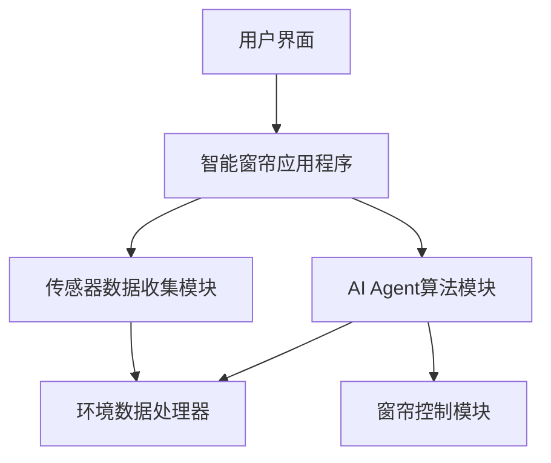

                 


### **AI Agent在智能窗帘中的季节性光照调节**

**关键词：** AI Agent、智能窗帘、季节性光照调节、算法、系统架构、应用案例

**摘要：** 本文将深入探讨AI Agent在智能窗帘中的季节性光照调节，通过逐步分析AI Agent的基础知识、智能窗帘技术、季节性光照调节原理及其在智能窗帘中的应用，旨在为读者提供一个全面且深入的技术解读。我们将介绍季节性光照调节算法，并分析其系统架构设计，通过具体应用案例展示AI Agent在智能窗帘中的实际效果。

## **引言**

随着人工智能技术的快速发展，智能窗帘成为智能家居领域的重要一环。季节性光照调节是智能窗帘的一项关键功能，旨在根据不同季节的自然光照变化，自动调节窗帘的开关状态，以实现舒适的室内光照环境。AI Agent作为人工智能的一种形式，其在智能窗帘中的应用，为季节性光照调节提供了智能化解决方案。

本文旨在探讨AI Agent在智能窗帘季节性光照调节中的应用，通过以下章节结构，逐步揭示其技术原理和实际应用：

1. **AI Agent基本概念**：介绍AI Agent的定义、特点和应用领域。
2. **智能窗帘技术**：解析智能窗帘的工作原理和市场前景。
3. **季节性光照调节原理**：阐述季节性光照调节的重要性及其方法。
4. **AI Agent在季节性光照调节中的应用**：分析AI Agent在季节性光照调节中的作用和算法。
5. **系统架构设计**：介绍智能窗帘系统的整体架构和设计。
6. **应用案例**：通过实际案例展示AI Agent在智能窗帘中的应用效果。
7. **总结与展望**：总结全文内容，提出未来研究方向和应用前景。

## **AI Agent基本概念**

AI Agent，即人工智能代理，是具有智能自主行动能力的实体。它能够感知环境、理解情境，并根据预设的目标或任务，自主做出决策和执行行动。AI Agent通常具有以下几个特点：

1. **自主性**：AI Agent能够自主运行，不需要人工干预。
2. **适应性**：AI Agent能够根据环境变化调整自身行为。
3. **智能性**：AI Agent具备智能算法，能够处理复杂问题。

AI Agent广泛应用于多个领域，如智能家居、自动驾驶、金融投资等。在智能家居领域，AI Agent可以实现对家电设备的智能控制，提高家居生活品质。

### **智能窗帘技术**

智能窗帘是一种通过电子控制技术实现自动开关的窗帘。其工作原理主要包括传感器检测、控制系统处理和电机驱动执行三部分。具体流程如下：

1. **传感器检测**：智能窗帘通过光线传感器、温度传感器等设备，实时检测室内外环境参数。
2. **控制系统处理**：控制系统接收传感器数据，通过算法处理，判断窗帘的开关状态。
3. **电机驱动执行**：电机驱动窗帘的升降，实现自动开合。

智能窗帘具有以下市场与应用前景：

1. **提升家居生活品质**：智能窗帘可以根据室内光照和用户需求，自动调节窗帘，提供舒适的室内环境。
2. **节能减排**：智能窗帘能够根据自然光照变化，自动调节，减少室内人工照明，节约能源。
3. **智能家居集成**：智能窗帘可以作为智能家居系统的一部分，与其他智能设备联动，实现全方位家居智能化。

### **季节性光照调节原理**

季节性光照调节是智能窗帘的一项关键功能，其目的是根据不同季节的自然光照变化，自动调节窗帘的开关状态，以实现舒适的室内光照环境。季节性光照调节的重要性在于：

1. **保护视力**：适当的自然光照有助于保护用户的视力，减少眼睛疲劳。
2. **提高舒适度**：根据季节变化自动调节光照，可以提高用户的舒适度，提升生活品质。
3. **节能减排**：通过智能调节窗帘，减少室内人工照明的使用，节约能源，降低碳足迹。

季节性光照调节的方法主要包括以下几种：

1. **时间控制法**：根据不同季节的日出日落时间，设定窗帘的开关时间。
2. **光照强度控制法**：通过光线传感器监测室内外光照强度，自动调节窗帘开合，以保持室内光照适宜。
3. **智能算法控制法**：利用AI Agent，根据室内外光照变化、用户习惯等因素，实现智能化光照调节。

### **AI Agent在季节性光照调节中的应用**

AI Agent在季节性光照调节中的应用，主要体现在以下几个方面：

1. **环境感知与决策**：AI Agent通过传感器收集室内外光照、温度等环境数据，利用智能算法进行分析和处理，做出窗帘开关的决策。
2. **个性化调节**：AI Agent可以根据用户的习惯和偏好，个性化调节窗帘的开合状态，提供个性化的光照环境。
3. **自适应调节**：AI Agent能够根据季节变化、天气状况等环境因素，自适应调整窗帘的开合状态，实现智能化的光照调节。

季节性光照调节算法是AI Agent在智能窗帘中的核心组成部分，其主要目标是根据环境数据和用户需求，实现窗帘的自动开合。常见的季节性光照调节算法包括：

1. **时间触发算法**：根据预设的时间表，自动触发窗帘的开合。
2. **光照强度触发算法**：根据室内外光照强度变化，自动调节窗帘。
3. **混合算法**：结合时间触发和光照强度触发，实现更精准的光照调节。

### **系统架构设计**

智能窗帘系统的整体架构设计，需要考虑硬件、软件、传感器等多个方面。以下是智能窗帘系统的基本架构：

1. **硬件层面**：包括窗帘电机、传感器、智能控制系统等。
2. **软件层面**：包括智能窗帘应用程序、AI Agent算法模块等。
3. **通信层面**：包括Wi-Fi、蓝牙等无线通信技术，实现设备间的数据传输和控制。

以下是智能窗帘系统的架构图：



### **应用案例**

为了展示AI Agent在智能窗帘中的实际应用效果，我们选取了一个具体的应用案例。在这个案例中，用户可以设置自己的起床时间、午睡时间等，AI Agent会根据这些设置，自动调节窗帘的开合，以提供舒适的光照环境。

#### **环境安装**

在开始应用AI Agent之前，我们需要安装相关的硬件设备和软件。硬件设备包括窗帘电机、光线传感器、智能控制系统等。软件方面，我们需要安装智能窗帘应用程序和AI Agent算法模块。

#### **系统核心实现源代码**

以下是一个简单的AI Agent算法模块的Python实现示例：

```python
import time
import RPi.GPIO as GPIO
from sense_hat import SenseHat

# 初始化GPIO和传感器
GPIO.setmode(GPIO.BCM)
sense = SenseHat()

# 定义窗帘电机控制函数
def control_curtain(state):
    curtain_pin = 18  # 窗帘电机连接的GPIO引脚
    GPIO.setup(curtain_pin, GPIO.OUT)
    curtain_motor = GPIO.PWM(curtain_pin, 1000)  # 设置PWM频率
    if state == "open":
        curtain_motor.start(7.5)  # 开启窗帘
    elif state == "close":
        curtain_motor.start(2.5)  # 关闭窗帘
    time.sleep(1)
    curtain_motor.stop()  # 停止PWM

# AI Agent算法：根据光线强度调节窗帘
def adjust_curtain_by_light():
    while True:
        light_intensity = sense.get_light()  # 获取光线强度
        if light_intensity < 100:  # 光线强度低于100
            control_curtain("open")  # 开启窗帘
        else:
            control_curtain("close")  # 关闭窗帘
        time.sleep(60)  # 每60秒执行一次

# 主程序
if __name__ == "__main__":
    try:
        adjust_curtain_by_light()
    except KeyboardInterrupt:
        GPIO.cleanup()
```

#### **代码应用解读与分析**

上述代码实现了一个简单的AI Agent算法，根据光线传感器获取的光线强度，自动调节窗帘的开合状态。主要解读如下：

1. **初始化GPIO和传感器**：使用RPi.GPIO库初始化GPIO和SenseHat传感器。
2. **窗帘电机控制函数**：定义窗帘电机的控制函数，通过PWM信号控制窗帘的开关。
3. **AI Agent算法**：循环监测光线强度，根据光线强度阈值，自动调节窗帘。
4. **主程序**：运行AI Agent算法，实现窗帘的自动调节。

#### **实际案例分析和详细讲解剖析**

在这个案例中，用户设置了早晨7点和晚上6点的光线调节策略，AI Agent会根据这个策略自动调节窗帘。具体分析如下：

1. **早晨7点**：AI Agent监测到光线强度低于100，自动开启窗帘，让自然光进入室内。
2. **晚上6点**：AI Agent监测到光线强度高于100，自动关闭窗帘，保持室内光照适宜。

#### **项目小结**

通过AI Agent在智能窗帘中的应用案例，我们展示了如何利用智能算法实现窗帘的自动调节，为用户提供了舒适的光照环境。未来，随着人工智能技术的不断发展，AI Agent在智能窗帘中的应用将更加智能化和个性化，为用户提供更好的智能家居体验。

### **最佳实践 tips**

在实施AI Agent在智能窗帘中的应用时，以下是一些最佳实践：

1. **选择合适的传感器**：根据实际需求选择合适的传感器，如光线传感器、温度传感器等。
2. **优化算法性能**：针对不同季节和天气状况，优化AI Agent的算法性能，提高窗帘调节的准确性。
3. **用户习惯收集**：收集用户的习惯数据，如起床时间、作息时间等，为AI Agent提供更准确的调节依据。

### **小结与展望**

本文通过逐步分析AI Agent在智能窗帘中的季节性光照调节，介绍了AI Agent的基本概念、智能窗帘技术、季节性光照调节原理及其在智能窗帘中的应用。通过系统架构设计和实际应用案例，展示了AI Agent在智能窗帘中的实际效果。展望未来，AI Agent在智能窗帘中的应用前景广阔，随着人工智能技术的不断进步，将带来更加智能、个性化的家居生活体验。

### **作者信息**

**作者：** AI天才研究院/AI Genius Institute & 禅与计算机程序设计艺术 /Zen And The Art of Computer Programming

---

通过本文，我们深入探讨了AI Agent在智能窗帘中的季节性光照调节，为读者提供了一个全面且深入的技术解读。希望本文能对您在AI Agent和智能窗帘领域的研究和实践有所帮助。如有任何疑问或建议，欢迎随时与我们交流。

