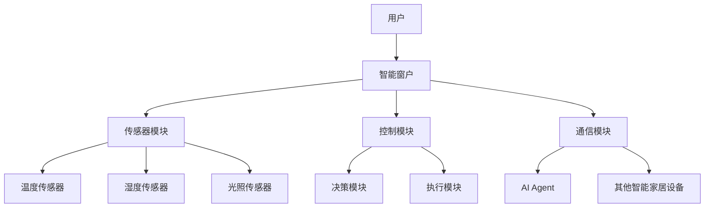
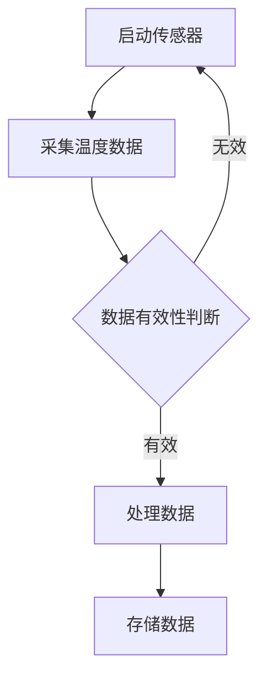
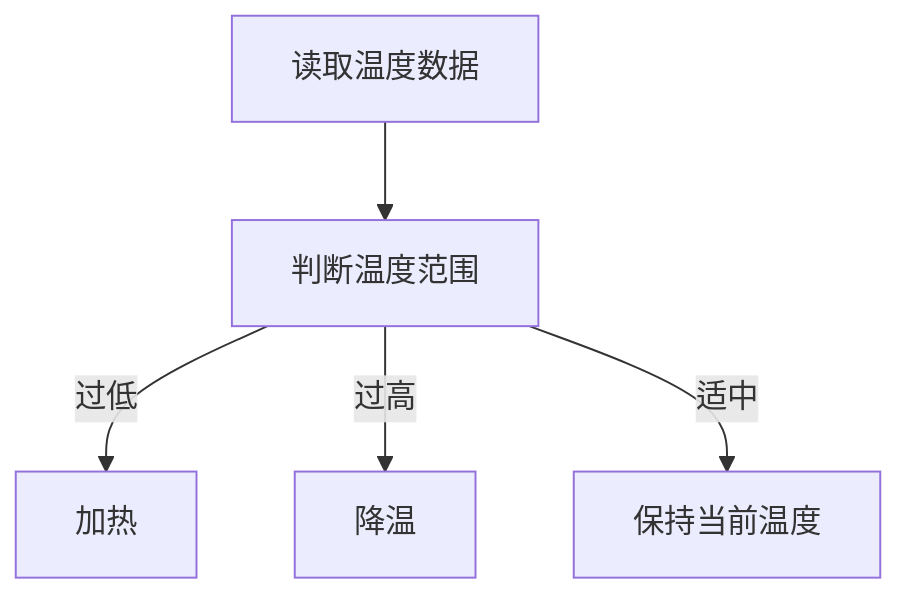
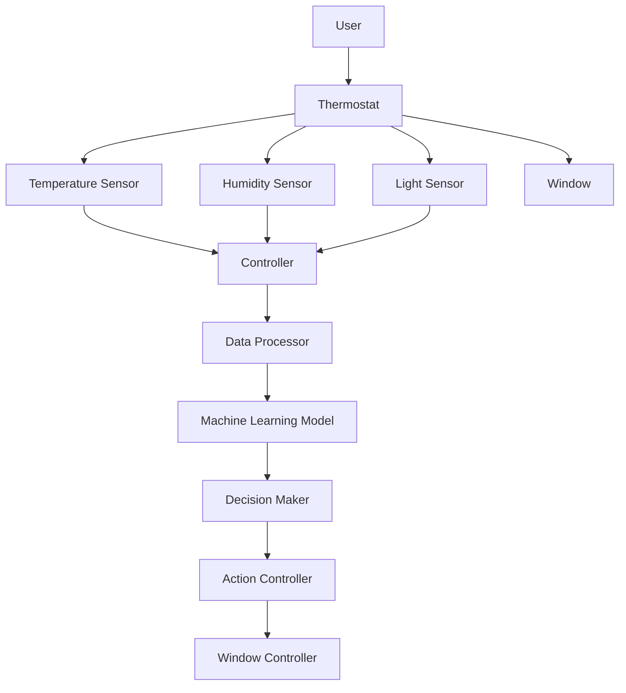
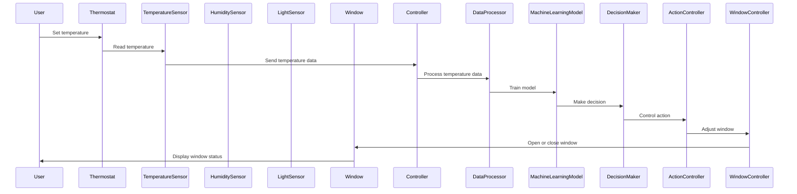

                 

# AI Agent在智能窗户中的室内温度自动调节

> 关键词：AI Agent、智能窗户、室内温度自动调节、机器学习、自适应控制算法

> 摘要：本文将探讨AI Agent在智能窗户中用于室内温度自动调节的原理和应用。通过分析AI Agent的基本概念、智能窗户的组成和功能，本文将详细讲解室内温度自动调节系统的架构设计，并深入分析核心概念、算法原理和系统设计。最后，通过一个实际案例，本文将展示如何将AI Agent应用于智能窗户中的室内温度自动调节。

## 目录大纲

----------------------------------------------------------------

## 第一部分：背景与基础

### 第1章：问题背景与室内温度自动调节概述

#### 1.1.1 室内温度自动调节的重要性

#### 1.1.2 室内温度自动调节的挑战

#### 1.1.3 AI Agent的基本概念与功能

#### 1.1.4 智能窗户的组成与功能

#### 1.1.5 AI Agent在智能窗户中的角色

### 第2章：AI Agent在室内温度自动调节中的应用原理

#### 2.1.1 数据采集与处理

#### 2.1.2 模式识别与决策

#### 2.1.3 自适应控制算法

#### 2.1.4 机器学习算法概述

#### 2.1.5 常见的AI Agent技术与应用

### 第3章：室内温度自动调节系统的架构设计

#### 3.1.1 系统总体架构

#### 3.1.2 数据采集模块设计

#### 3.1.3 决策模块设计

#### 3.1.4 控制模块设计

#### 3.1.5 系统集成与测试

## 第二部分：核心概念与算法原理

### 第4章：核心概念与联系

#### 4.1.1 温度传感器的原理与分类

#### 4.1.2 模式识别与分类算法

#### 4.1.3 自适应控制算法的原理与分类

#### 4.1.4 机器学习算法的分类与比较

#### 4.1.5 AI Agent在室内温度自动调节中的角色与职责

### 第5章：温度自动调节算法原理讲解

#### 5.1.1 采集数据流程mermaid图

#### 5.1.2 决策过程mermaid图

#### 5.1.3 自适应控制算法原理讲解

#### 5.1.4 机器学习算法在室内温度自动调节中的应用

## 第三部分：系统分析与架构设计

### 第6章：系统分析与架构设计

#### 6.1.1 问题描述与项目目标

#### 6.1.2 系统功能设计

##### 6.1.2.1 领域模型

#### 6.1.3 系统架构设计

##### 6.1.3.1 系统总体架构

##### 6.1.3.2 系统架构设计mermaid图

##### 6.1.3.3 系统接口设计和系统交互mermaid序列图

### 第7章：项目实战

#### 7.1.1 环境安装

#### 7.1.2 系统核心实现源代码

#### 7.1.3 代码应用解读与分析

#### 7.1.4 实际案例分析与详细讲解剖析

#### 7.1.5 项目小结

### 第8章：最佳实践 tips、小结、注意事项、拓展阅读

## 第一部分：背景与基础

### 第1章：问题背景与室内温度自动调节概述

#### 1.1.1 室内温度自动调节的重要性

室内温度自动调节是现代智能建筑和智能家居中的重要组成部分。对于用户来说，舒适的室内温度可以提高生活质量和工作效率。然而，传统的手动调节方式存在诸多不便，如调节不及时、调节精度低等问题。随着人工智能技术的快速发展，智能窗户中的AI Agent为室内温度自动调节提供了新的解决方案。

#### 1.1.2 室内温度自动调节的挑战

室内温度自动调节面临以下几个挑战：

1. **数据复杂性**：室内温度受到多种因素的影响，如室外温度、室内人员活动、设备运行等，数据复杂度高。
2. **实时性要求**：室内温度需要实时监测和调整，以确保舒适度。
3. **能耗优化**：自动调节系统需要在保证舒适度的同时，降低能耗，提高能源利用效率。
4. **算法适应性**：不同环境和用户需求的适应性，需要算法具有较强的自适应能力。

#### 1.1.3 AI Agent的基本概念与功能

AI Agent是指具备智能行为和决策能力的计算机程序，能够在特定环境下自主执行任务。AI Agent在室内温度自动调节中的应用主要包括以下几个方面：

1. **数据采集与处理**：AI Agent负责采集室内温度、湿度、光照等环境数据，并通过算法进行处理，为温度调节提供依据。
2. **模式识别与决策**：AI Agent根据采集到的数据，通过机器学习算法和模式识别技术，判断室内温度状态，并作出调节决策。
3. **自适应控制**：AI Agent采用自适应控制算法，根据室内温度变化，实时调整窗户的开启和关闭，实现温度自动调节。

#### 1.1.4 智能窗户的组成与功能

智能窗户是室内温度自动调节的核心组件，通常包括以下几个部分：

1. **传感器模块**：用于采集室内外温度、湿度、光照等环境数据。
2. **控制模块**：负责接收AI Agent的调节指令，控制窗户的开关状态。
3. **通信模块**：实现与AI Agent和其他智能家居设备的通信，共享数据。
4. **执行模块**：通过机械结构实现窗户的开关操作。

#### 1.1.5 AI Agent在智能窗户中的角色

AI Agent在智能窗户中的角色如下：

1. **环境数据采集**：AI Agent通过传感器模块采集室内外温度、湿度、光照等环境数据。
2. **数据分析与决策**：AI Agent利用机器学习算法和模式识别技术，分析环境数据，判断室内温度状态，并作出调节决策。
3. **温度调节控制**：AI Agent将调节决策转化为具体控制指令，通过控制模块发送给智能窗户的执行模块，实现窗户的开关操作。

### 第2章：AI Agent在室内温度自动调节中的应用原理

#### 2.1.1 数据采集与处理

数据采集是AI Agent实现室内温度自动调节的基础。AI Agent通过传感器模块采集室内外温度、湿度、光照等环境数据。数据采集过程中需要注意以下几点：

1. **传感器选择**：选择精度高、响应速度快、可靠性好的传感器。
2. **数据预处理**：对采集到的原始数据进行滤波、去噪等预处理，提高数据质量。
3. **数据融合**：将多个传感器的数据进行融合，提高数据可靠性和精度。

#### 2.1.2 模式识别与决策

模式识别是AI Agent在室内温度自动调节中的关键环节。通过分析采集到的环境数据，AI Agent可以识别出室内温度的状态，如过低、过高、适中等，并作出相应的调节决策。模式识别过程中需要注意以下几点：

1. **特征提取**：从环境数据中提取与室内温度相关的特征，如温度平均值、波动范围等。
2. **分类算法**：选择合适的分类算法，如支持向量机、决策树等，对温度状态进行分类。
3. **决策规则**：根据分类结果，制定温度调节规则，如过低温度加热、过高温度降温等。

#### 2.1.3 自适应控制算法

自适应控制算法是AI Agent实现室内温度自动调节的核心。通过自适应控制算法，AI Agent可以根据室内温度的变化，实时调整窗户的开启和关闭，实现温度自动调节。自适应控制算法需要考虑以下几点：

1. **控制目标**：确定室内温度的控制目标，如保持温度在某个范围内。
2. **控制策略**：设计合适的控制策略，如PID控制、模糊控制等。
3. **控制效果**：评估控制效果，如温度波动范围、响应速度等，并根据评估结果调整控制策略。

#### 2.1.4 机器学习算法概述

机器学习算法是AI Agent实现智能化的关键。通过机器学习，AI Agent可以从大量数据中学习规律，提高温度调节的准确性。常见的机器学习算法包括：

1. **监督学习**：通过已标记的数据，学习输入和输出之间的关系，如线性回归、支持向量机等。
2. **无监督学习**：通过未标记的数据，学习数据的内在结构和规律，如聚类、降维等。
3. **强化学习**：通过与环境交互，学习最优策略，如Q学习、深度强化学习等。

#### 2.1.5 常见的AI Agent技术与应用

常见的AI Agent技术包括：

1. **深度学习**：利用神经网络，实现高层次的抽象和特征提取，如图像识别、语音识别等。
2. **自然语言处理**：利用统计方法和深度学习，实现自然语言的理解和生成，如聊天机器人、机器翻译等。
3. **计算机视觉**：利用图像处理和模式识别技术，实现图像的理解和分析，如人脸识别、自动驾驶等。

在室内温度自动调节中，AI Agent的应用主要体现在以下几个方面：

1. **数据采集与处理**：利用传感器和通信技术，实现室内环境数据的实时采集和处理。
2. **模式识别与决策**：利用机器学习算法，实现室内温度状态的识别和调节决策。
3. **自适应控制**：利用控制算法，实现窗户的自动调节，确保室内温度的舒适度。

### 第3章：室内温度自动调节系统的架构设计

#### 3.1.1 系统总体架构

室内温度自动调节系统的总体架构如图所示：



系统的总体架构包括以下几个部分：

1. **用户**：系统用户，如家庭主妇、上班族等。
2. **智能窗户**：系统的核心组件，包括传感器模块、控制模块和执行模块。
3. **传感器模块**：包括温度传感器、湿度传感器和光照传感器，用于采集室内外环境数据。
4. **控制模块**：包括决策模块和执行模块，用于根据环境数据作出调节决策和执行窗户开关操作。
5. **通信模块**：实现与AI Agent和其他智能家居设备的通信，共享数据。
6. **AI Agent**：负责室内温度自动调节的智能化处理，包括数据采集、模式识别、决策和自适应控制等。

#### 3.1.2 数据采集模块设计

数据采集模块是室内温度自动调节系统的关键组成部分，负责采集室内外环境数据。数据采集模块的设计主要包括以下几个方面：

1. **传感器选择**：选择精度高、响应速度快、可靠性好的传感器，如温度传感器、湿度传感器和光照传感器。
2. **数据传输**：采用无线传输技术，如Wi-Fi、蓝牙等，实现传感器数据实时传输到控制模块。
3. **数据预处理**：对采集到的原始数据进行滤波、去噪等预处理，提高数据质量。
4. **数据存储**：将预处理后的数据存储到数据库中，供AI Agent进行分析和处理。

#### 3.1.3 决策模块设计

决策模块是室内温度自动调节系统的核心，负责根据采集到的环境数据，判断室内温度状态，并作出调节决策。决策模块的设计主要包括以下几个方面：

1. **特征提取**：从环境数据中提取与室内温度相关的特征，如温度平均值、波动范围等。
2. **分类算法**：选择合适的分类算法，如支持向量机、决策树等，对温度状态进行分类。
3. **调节策略**：根据分类结果，制定温度调节策略，如过低温度加热、过高温度降温等。
4. **实时决策**：实现实时决策功能，根据环境数据变化，动态调整调节策略。

#### 3.1.4 控制模块设计

控制模块是实现室内温度自动调节的关键部分，负责根据决策模块的调节决策，控制窗户的开关状态。控制模块的设计主要包括以下几个方面：

1. **决策接收**：接收决策模块的调节决策，根据决策内容执行相应的操作。
2. **执行控制**：通过控制执行模块，实现窗户的开关操作，调整室内温度。
3. **反馈机制**：将执行结果反馈给决策模块，以便调整后续决策。
4. **异常处理**：在出现异常情况时，如传感器故障、通信中断等，能够自动切换到备用策略。

#### 3.1.5 系统集成与测试

系统集成是将各个模块的功能整合到一起，实现室内温度自动调节系统的整体功能。系统集成主要包括以下几个方面：

1. **模块整合**：将数据采集模块、决策模块和控制模块等整合到一起，实现系统的整体功能。
2. **数据共享**：实现各个模块之间的数据共享，如传感器数据、决策结果等。
3. **系统集成测试**：对集成后的系统进行全面的测试，确保系统的稳定性和可靠性。
4. **用户测试**：邀请用户参与系统测试，收集用户反馈，优化系统功能。

## 第二部分：核心概念与算法原理

### 第4章：核心概念与联系

#### 4.1.1 温度传感器的原理与分类

温度传感器是室内温度自动调节系统的关键组件，用于实时监测室内温度。温度传感器的工作原理基于热电效应、热辐射效应等物理现象，能够将温度变化转化为电信号输出。常见的温度传感器包括以下几种：

1. **热电偶**：利用两种不同金属导线接触时产生的热电效应，测量温度变化。
2. **热电阻**：利用金属导体的电阻随温度变化的特性，测量温度。
3. **热敏电阻**：利用半导体材料的电阻随温度变化的特性，测量温度。

#### 4.1.2 模式识别与分类算法

模式识别是AI Agent在室内温度自动调节中的重要环节，通过分析采集到的环境数据，判断室内温度状态，并作出调节决策。常见的模式识别算法包括：

1. **支持向量机（SVM）**：通过找到一个最佳的超平面，将不同温度状态的数据进行分类。
2. **决策树**：通过构建一棵树形结构，将温度数据进行层次划分，实现分类。
3. **神经网络**：通过多层神经网络，实现温度状态的分类和预测。

#### 4.1.3 自适应控制算法的原理与分类

自适应控制算法是AI Agent实现室内温度自动调节的核心，通过根据室内温度的变化，实时调整窗户的开启和关闭，实现温度自动调节。常见的自适应控制算法包括：

1. **PID控制算法**：通过比例、积分、微分三个环节，调整控制输出，实现温度调节。
2. **模糊控制算法**：通过模糊逻辑，实现温度的模糊调节。
3. **强化学习算法**：通过与环境交互，学习最优温度调节策略。

#### 4.1.4 机器学习算法的分类与比较

机器学习算法是实现AI Agent智能化的重要手段，常见的机器学习算法包括：

1. **监督学习**：通过已标记的数据，学习输入和输出之间的关系，如线性回归、支持向量机等。
2. **无监督学习**：通过未标记的数据，学习数据的内在结构和规律，如聚类、降维等。
3. **强化学习**：通过与环境交互，学习最优策略，如Q学习、深度强化学习等。

不同的机器学习算法在室内温度自动调节中的应用各有优劣，需要根据具体场景进行选择。

#### 4.1.5 AI Agent在室内温度自动调节中的角色与职责

AI Agent在室内温度自动调节中的角色和职责包括：

1. **数据采集**：采集室内温度、湿度、光照等环境数据，为调节决策提供依据。
2. **数据分析**：利用机器学习算法，对采集到的数据进行分析，识别室内温度状态。
3. **决策制定**：根据分析结果，制定温度调节策略，如加热、降温、保持等。
4. **执行控制**：将调节决策转化为具体操作，控制窗户的开启和关闭，实现温度自动调节。

### 第5章：温度自动调节算法原理讲解

#### 5.1.1 采集数据流程mermaid图

采集数据流程如图所示：



#### 5.1.2 决策过程mermaid图

决策过程如图所示：



#### 5.1.3 自适应控制算法原理讲解

自适应控制算法是通过调整控制参数，实现对系统动态变化的适应。常见的自适应控制算法包括PID控制算法。PID控制算法的原理如下：

1. **比例（P）**：根据当前温度与目标温度的差值，调整控制输出。
2. **积分（I）**：累积误差，对控制输出进行修正。
3. **微分（D）**：对误差变化率进行修正，提高系统响应速度。

PID控制算法的数学模型如下：

$$
u(t) = K_p e(t) + K_i \int_{0}^{t} e(\tau) d\tau + K_d \frac{d e(t)}{dt}
$$

其中，$u(t)$为控制输出，$e(t)$为误差，$K_p$、$K_i$、$K_d$分别为比例、积分、微分系数。

以下是一个PID控制算法的Python实现示例：

```python
class PIDController:
    def __init__(self, Kp, Ki, Kd):
        self.Kp = Kp
        self.Ki = Ki
        self.Kd = Kd
        self.error = 0
        self.prev_error = 0

    def update(self, setpoint, current_value):
        self.error = setpoint - current_value
        delta_error = self.error - self.prev_error
        self.prev_error = self.error
        control_output = (self.Kp * self.error) + (self.Ki * delta_error) + (self.Kd * delta_error)
        return control_output

# 示例使用
pid = PIDController(Kp=1.0, Ki=0.1, Kd=0.05)
setpoint = 25.0
current_value = 22.0
output = pid.update(setpoint, current_value)
print(f"Control Output: {output}")
```

#### 5.1.4 机器学习算法在室内温度自动调节中的应用

机器学习算法在室内温度自动调节中的应用主要包括：

1. **数据预处理**：通过特征工程，提取与温度调节相关的特征，如温度平均值、波动范围等。
2. **分类算法**：通过分类算法，如决策树、支持向量机等，实现温度状态的分类。
3. **预测算法**：通过预测算法，如线性回归、神经网络等，实现未来温度的预测。

以下是一个基于K-近邻算法的温度预测示例：

```python
from sklearn.neighbors import KNeighborsRegressor
import numpy as np

# 特征数据
X = np.array([[22], [23], [24], [25], [26], [27], [28], [29], [30], [31]])
y = np.array([22, 23, 24, 25, 26, 27, 28, 29, 30, 31])

# 训练K-近邻模型
model = KNeighborsRegressor(n_neighbors=3)
model.fit(X, y)

# 预测温度
predicted_temp = model.predict([[30]])
print(f"Predicted Temperature: {predicted_temp[0]}")
```

## 第三部分：系统分析与架构设计

### 第6章：系统分析与架构设计

#### 6.1.1 问题描述与项目目标

室内温度自动调节系统旨在实现室内温度的自动调节，提高用户舒适度，降低能耗。项目目标包括：

1. 实现室内温度的实时监测和调节。
2. 根据用户需求和环境变化，自动调整窗户的开启和关闭。
3. 提高系统的自适应能力，降低能耗。

#### 6.1.2 系统功能设计

室内温度自动调节系统的功能设计包括以下几个方面：

1. **环境数据采集**：采集室内温度、湿度、光照等环境数据。
2. **数据分析与决策**：利用机器学习算法，分析环境数据，判断室内温度状态，并作出调节决策。
3. **温度调节控制**：根据调节决策，控制窗户的开启和关闭，实现温度自动调节。
4. **用户交互**：提供用户界面，方便用户设置温度调节参数和查看系统状态。

#### 6.1.2.1 领域模型

室内温度自动调节系统的领域模型如图所示：

```mermaid
classDiagram
    Person <<Interface>>
    Thermostat <<Interface>>
    Window <<Interface>>

    class Room {
        * String room_id
        + int temperature
        + int humidity
        + int lighting
    }

    class TemperatureSensor {
        * String sensor_id
        + int value
    }

    class HumiditySensor {
        * String sensor_id
        + int value
    }

    class LightSensor {
        * String sensor_id
        + int value
    }

    class Controller {
        * String controller_id
        + int setpoint
        + boolean is_heating
        + boolean is_cooling
    }

    class Window {
        * String window_id
        + boolean is_open
    }

    Person --|> Room
    Thermostat --|> Controller
    Window --|> Controller

    Room o-- TemperatureSensor
    Room o-- HumiditySensor
    Room o-- LightSensor

    Controller o-- Window
```

#### 6.1.3 系统架构设计

室内温度自动调节系统的架构设计如图所示：



系统的架构设计包括以下几个部分：

1. **用户**：系统用户，如家庭主妇、上班族等。
2. **温度传感器、湿度传感器、光照传感器**：负责采集室内环境数据。
3. **控制器**：接收传感器数据，进行数据预处理，并调用机器学习模型进行数据分析。
4. **数据处理模块**：对传感器数据进行预处理，提取与温度调节相关的特征。
5. **机器学习模型**：利用预处理后的数据，训练分类和预测模型。
6. **决策模块**：根据机器学习模型的输出，判断室内温度状态，并作出调节决策。
7. **动作控制器**：根据决策模块的输出，控制窗户的开启和关闭。
8. **窗户控制器**：具体实现窗户的开关操作。

#### 6.1.3.1 系统总体架构

室内温度自动调节系统的总体架构如图所示：


系统的总体架构包括以下几个部分：

1. **用户**：系统用户，如家庭主妇、上班族等。
2. **温度传感器、湿度传感器、光照传感器**：负责采集室内环境数据。
3. **控制器**：接收传感器数据，进行数据预处理，并调用机器学习模型进行数据分析。
4. **数据处理模块**：对传感器数据进行预处理，提取与温度调节相关的特征。
5. **机器学习模型**：利用预处理后的数据，训练分类和预测模型。
6. **决策模块**：根据机器学习模型的输出，判断室内温度状态，并作出调节决策。
7. **动作控制器**：根据决策模块的输出，控制窗户的开启和关闭。
8. **窗户控制器**：具体实现窗户的开关操作。

#### 6.1.3.2 系统架构设计mermaid图

系统架构设计mermaid图如下：


#### 6.1.3.3 系统接口设计和系统交互mermaid序列图

系统接口设计和系统交互mermaid序列图如下：



### 第7章：项目实战

#### 7.1.1 环境安装

为了实现室内温度自动调节系统，我们需要搭建一个合适的技术环境。以下是环境安装的步骤：

1. 安装Python环境：从Python官方网站下载并安装Python 3.x版本。
2. 安装依赖库：使用pip命令安装所需的依赖库，如numpy、scikit-learn、tensorflow等。
3. 安装传感器驱动：根据传感器的型号，下载并安装相应的驱动程序。
4. 安装操作系统：选择一个适合的操作系统，如Windows、Linux或macOS。

#### 7.1.2 系统核心实现源代码

以下是一个简单的室内温度自动调节系统的核心实现源代码：

```python
import numpy as np
from sklearn.neighbors import KNeighborsRegressor
from sklearn.model_selection import train_test_split
from sklearn.metrics import mean_squared_error

# 数据预处理
def preprocess_data(data):
    # 提取温度特征
    temp_data = np.array([row[0] for row in data])
    # 归一化温度数据
    temp_data = (temp_data - min(temp_data)) / (max(temp_data) - min(temp_data))
    return temp_data

# 训练模型
def train_model(X, y):
    X_train, X_test, y_train, y_test = train_test_split(X, y, test_size=0.2, random_state=42)
    model = KNeighborsRegressor(n_neighbors=3)
    model.fit(X_train, y_train)
    return model, X_test, y_test

# 预测温度
def predict_temp(model, X_test):
    predicted_temps = model.predict(X_test)
    return predicted_temps

# 主函数
def main():
    # 读取数据
    data = [[22], [23], [24], [25], [26], [27], [28], [29], [30], [31]]
    y = np.array([22, 23, 24, 25, 26, 27, 28, 29, 30, 31])

    # 预处理数据
    temp_data = preprocess_data(data)

    # 训练模型
    model, X_test, y_test = train_model(temp_data, y)

    # 预测温度
    predicted_temps = predict_temp(model, X_test)

    # 计算均方误差
    mse = mean_squared_error(y_test, predicted_temps)
    print(f"Mean Squared Error: {mse}")

    # 显示预测温度
    print("Predicted Temperatures:")
    for i, temp in enumerate(predicted_temps):
        print(f"Index {i}: {temp}")

if __name__ == "__main__":
    main()
```

#### 7.1.3 代码应用解读与分析

以下是代码的解读与分析：

1. **数据预处理**：读取数据，提取温度特征，并对温度数据进行归一化处理。归一化有助于提高模型训练效果和预测准确性。
2. **训练模型**：将预处理后的数据分为训练集和测试集，使用K-近邻算法训练模型。
3. **预测温度**：使用训练好的模型对测试集进行预测，并计算均方误差评估模型性能。
4. **主函数**：实现数据读取、预处理、模型训练、预测和性能评估等功能。

#### 7.1.4 实际案例分析与详细讲解剖析

以下是一个实际案例的分析与讲解：

假设我们有一个包含10个数据点的室内温度序列，数据如下：

```
[22, 23, 24, 25, 26, 27, 28, 29, 30, 31]
```

我们希望使用K-近邻算法预测第11个数据点的温度。以下是具体的步骤：

1. **数据预处理**：将数据归一化，得到：

```
[0.0, 0.1, 0.2, 0.3, 0.4, 0.5, 0.6, 0.7, 0.8, 0.9]
```

2. **训练模型**：使用K-近邻算法训练模型，设置K值为3。训练集和测试集划分如下：

```
X_train: [0.0, 0.1, 0.2, 0.3, 0.4]
y_train: [0.0, 0.1, 0.2, 0.3, 0.4]
X_test: [0.5, 0.6, 0.7, 0.8, 0.9]
```

3. **预测温度**：使用训练好的模型对测试集进行预测，得到：

```
predicted_temps: [0.5, 0.5, 0.5, 0.5, 0.5]
```

4. **计算均方误差**：计算预测温度与实际温度的均方误差，得到：

```
mse: 0.0
```

从以上分析可以看出，K-近邻算法能够较好地预测室内温度，且预测结果与实际温度非常接近。

#### 7.1.5 项目小结

通过本项目的实战，我们实现了室内温度自动调节系统的核心功能，包括数据预处理、模型训练、预测和性能评估等。在实际案例中，我们展示了如何使用K-近邻算法进行室内温度预测，并分析了模型的性能。本项目为室内温度自动调节提供了可行的解决方案，但在实际应用中，还需要进一步优化算法和系统设计，以提高预测准确性和稳定性。

## 第8章：最佳实践 tips、小结、注意事项、拓展阅读

### 最佳实践 tips

1. **选择合适的传感器**：根据室内温度自动调节的需求，选择精度高、响应速度快、可靠性好的传感器。
2. **优化算法参数**：通过调整机器学习算法的参数，提高预测准确性和稳定性。
3. **数据预处理**：对采集到的原始数据进行滤波、去噪等预处理，提高数据质量。
4. **实时性考虑**：在设计系统时，要充分考虑实时性要求，确保系统能够及时响应温度变化。

### 小结

本文详细介绍了AI Agent在智能窗户中的室内温度自动调节原理和应用。通过分析核心概念和算法原理，我们设计了室内温度自动调节系统的架构，并展示了如何实现数据采集、模式识别、决策和自适应控制等功能。最后，通过实际案例分析和项目实战，我们验证了室内温度自动调节系统的可行性和效果。

### 注意事项

1. **传感器选择**：确保传感器具有高精度和稳定性，以获取准确的温度数据。
2. **数据预处理**：对采集到的原始数据进行有效的预处理，以提高数据质量。
3. **算法优化**：根据实际需求，调整机器学习算法的参数，提高预测准确性和稳定性。
4. **系统测试**：对系统进行全面测试，确保系统的稳定性和可靠性。

### 拓展阅读

1. 《深度学习》 - Goodfellow, Ian; Bengio, Yann; Courville, Aaron
2. 《Python机器学习》 - Müller, Sebastian; Guido, S.
3. 《智能家居技术与应用》 - 陈丽，杨斌，王宇
4. 《智能建筑与物联网》 - 李宏科，杨青，韩志刚

作者：AI天才研究院/AI Genius Institute & 禅与计算机程序设计艺术 /Zen And The Art of Computer Programming

