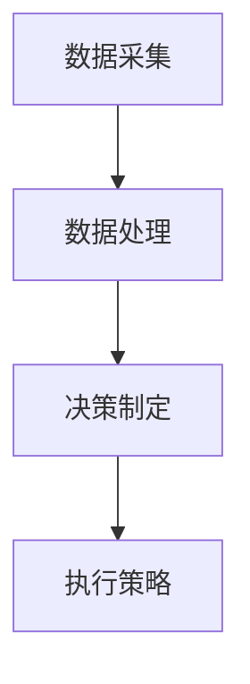
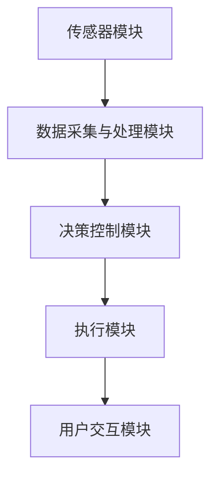
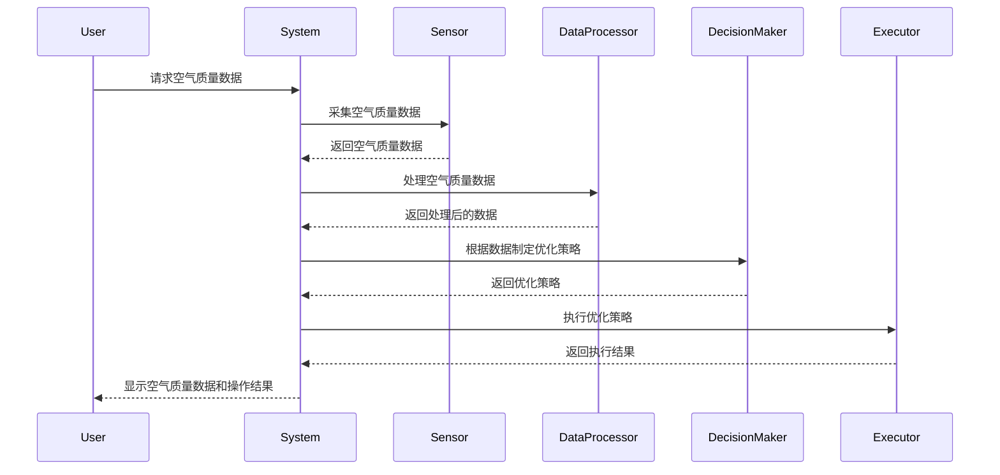

                 


# AI Agent在智能窗户中的室内空气质量优化

> 关键词：室内空气质量、智能窗户、AI Agent、算法、系统架构、项目实战

> 摘要：本文旨在探讨AI Agent在智能窗户中优化室内空气质量的应用，分析相关技术原理、算法设计、系统架构以及项目实施过程。通过对室内空气质量问题的背景介绍、核心概念的阐述、算法原理的讲解、系统分析与设计以及实际项目的实施分析，本文为室内空气质量优化提供了具有实践意义的技术参考。

## 第一部分：背景介绍

### 1. 室内空气质量问题背景

#### 1.1 问题描述

室内空气质量（Indoor Air Quality，IAQ）是指人们生活、工作、学习等室内环境中的空气质量状况。随着城市化进程的加快和室内装修材料的广泛使用，室内空气污染问题日益严重。室内空气污染的主要来源包括以下几点：

1. **建筑材料**：如甲醛、苯、氨等挥发性有机化合物（VOCs）。
2. **家具和装饰材料**：如胶合板、涂料等。
3. **室内活动**：如烹饪、吸烟等。
4. **室外污染**：如雾霾等污染物的渗透。

这些污染物对人们的健康具有严重的影响，如呼吸系统疾病、过敏反应、心血管疾病等。因此，优化室内空气质量具有重要意义。

#### 1.2 问题解决

当前解决室内空气质量问题的主要方法包括以下几个方面：

1. **通风换气**：通过自然通风或机械通风方式，将室内污浊空气排出，引入新鲜空气。
2. **空气净化**：使用空气净化器等设备，过滤空气中的污染物。
3. **绿色植物**：利用植物的吸碳、释放氧气和吸附有害物质等作用，改善室内空气质量。

然而，这些方法存在一定的局限性。例如，通风换气可能导致室内温度和湿度变化，空气净化器需要定期更换滤网，绿色植物对空气质量的改善效果有限。

#### 1.3 边界与外延

室内空气质量与室外空气质量密切相关。室外污染物可以通过门窗等途径进入室内，而室内污染物也可能扩散到室外。此外，室内空气质量还与其他室内环境因素（如温度、湿度）相互影响。因此，在优化室内空气质量时，需要综合考虑这些因素。

#### 1.4 概念结构与核心要素组成

室内空气质量的评估指标主要包括：

1. **PM2.5**：细颗粒物，对人体呼吸系统有害。
2. **PM10**：可吸入颗粒物，对空气质量有重要影响。
3. **CO2**：二氧化碳，反映室内通风情况。
4. **TVOC**：总挥发性有机物，对人体有害。
5. **甲醛**：室内装修材料中的主要污染物，对人体有强烈刺激作用。

室内空气质量优化系统的主要组成部分包括：

1. **传感器模块**：用于实时监测室内空气质量。
2. **数据采集与处理模块**：对传感器数据进行采集、预处理和存储。
3. **决策控制模块**：根据空气质量数据，制定相应的优化策略。
4. **执行模块**：实施决策控制模块生成的优化策略。

## 第二部分：核心概念与联系

### 2. AI Agent概述

#### 2.1 AI Agent的定义

AI Agent（人工智能代理）是指能够模拟人类智能行为，具有自主性、适应性、学习能力和协作能力的计算机程序。AI Agent在不同领域具有广泛的应用，如自动驾驶、智能家居、医疗诊断等。

#### 2.2 AI Agent的特点

1. **自主性**：AI Agent能够在没有人类干预的情况下，自主执行任务。
2. **学习能力**：AI Agent能够从经验中学习，提高任务执行能力。
3. **适应性**：AI Agent能够根据环境和任务的变化，调整自己的行为。
4. **协作能力**：AI Agent能够与其他AI Agent或人类协作，共同完成任务。

#### 2.3 AI Agent与传统智能系统的区别

传统智能系统主要依赖于预定义的规则和模型，而AI Agent具有更强的自主性和适应性。传统智能系统在处理复杂、不确定的任务时，往往表现不佳。而AI Agent能够通过学习，从海量数据中提取知识，提高任务执行能力。

### 3. 室内空气质量监测技术

#### 3.1 监测技术概述

室内空气质量监测技术的发展历程可以追溯到20世纪60年代。随着传感器技术的进步和人工智能技术的应用，室内空气质量监测技术取得了显著的进展。当前主流的室内空气质量监测技术包括：

1. **传感器技术**：如PM2.5传感器、PM10传感器、CO2传感器、TVOC传感器等。
2. **物联网技术**：通过物联网设备，实现对室内空气质量的远程监控和管理。
3. **大数据分析技术**：通过大数据分析，发现室内空气质量的规律和趋势。

#### 3.2 常用传感器与技术比较表格

| 传感器类型 | 特点 | 应用场景 |
| :-------: | :--- | :------: |
| PM2.5传感器 | 高精度 | 室内空气质量监测 |
| PM10传感器 | 高精度 | 室内空气质量监测 |
| CO2传感器 | 高精度 | 室内通风控制 |
| TVOC传感器 | 高精度 | 室内空气质量监测 |

#### 3.3 监测技术关联ER实体关系图

```mermaid
erDiagram
  Sensor ||--|{ AirQualityData }|-- Sensor
  Sensor ||--|{ IndoorEnvironment }|-- Sensor
```

## 第三部分：算法原理讲解

### 4. 室内空气质量优化算法

#### 4.1 算法原理

室内空气质量优化算法旨在根据实时监测数据，制定相应的优化策略，提高室内空气质量。算法的基本原理如下：

1. **数据采集**：通过传感器实时采集室内空气质量数据。
2. **数据处理**：对采集到的数据进行分析和处理，提取有用的信息。
3. **决策制定**：根据处理后的数据，制定相应的优化策略。
4. **执行策略**：执行制定的优化策略，改善室内空气质量。

#### 4.1.1 Mermaid流程图



#### 4.1.2 Python源代码

```python
import numpy as np
import pandas as pd

# 数据采集
data = pd.read_csv('air_quality_data.csv')

# 数据处理
cleaned_data = data.dropna()

# 决策制定
threshold = 50  # 设定空气质量阈值
if cleaned_data['PM2.5'].mean() > threshold:
    strategy = '通风换气'
else:
    strategy = '空气净化'

# 执行策略
if strategy == '通风换气':
    print('开启自然通风或机械通风')
else:
    print('开启空气净化器')
```

#### 4.1.3 算法原理的数学模型和公式

室内空气质量优化算法的数学模型可以表示为：

$$
\begin{aligned}
\text{策略} &= \text{if } \text{PM2.5均值} > \text{阈值} \text{ then } \text{通风换气} \text{ else } \text{空气净化} \\
\text{执行} &= \text{策略}
\end{aligned}
$$

#### 4.1.4 举例说明

假设某智能窗户系统在一天内监测到室内PM2.5均值为70，设定空气质量阈值为50。根据优化算法，系统将选择通风换气策略，开启自然通风或机械通风，以改善室内空气质量。

## 第四部分：系统分析与架构设计方案

### 5. 智能窗户室内空气质量优化系统

#### 5.1 问题场景介绍

智能窗户室内空气质量优化系统适用于家庭、办公室、学校等室内环境。系统的主要目标是根据室内空气质量数据，自动调整窗户的开关状态，实现室内空气质量的实时优化。

#### 5.2 项目介绍

本项目旨在设计和实现一款智能窗户室内空气质量优化系统。系统主要包括以下功能：

1. **空气质量监测**：实时监测室内空气质量，包括PM2.5、PM10、CO2、TVOC等指标。
2. **数据采集与处理**：采集监测数据，并进行预处理和存储。
3. **决策制定**：根据监测数据，自动调整窗户的开关状态，实现空气质量的优化。
4. **用户交互**：提供用户界面，展示室内空气质量数据和相关操作。

#### 5.3 系统功能设计（领域模型类图）

```mermaid
classDiagram
  Class1 <|-- Class2
  Class1 o-- Class3
  Class2 a-- Class3
  Class1 {id : Integer}
  Class2 {name : String}
  Class3 {value : Float}
```

#### 5.4 系统架构设计（架构图）



#### 5.5 系统接口设计

1. **传感器接口**：用于与空气质量传感器进行通信。
2. **数据处理接口**：用于对传感器数据进行预处理和存储。
3. **决策控制接口**：用于根据空气质量数据制定优化策略。
4. **执行接口**：用于执行优化策略，调整窗户状态。
5. **用户交互接口**：用于与用户进行交互，展示室内空气质量数据和操作。

#### 5.6 系统交互（序列图）



## 第五部分：项目实战

### 6. 智能窗户室内空气质量优化项目实施

#### 6.1 环境安装

在项目实施过程中，首先需要安装所需的硬件和软件环境。硬件环境包括：

1. **智能窗户**：具备自动开关功能的窗户。
2. **空气质量传感器**：用于实时监测室内空气质量。
3. **计算机**：用于运行系统软件。

软件环境包括：

1. **操作系统**：如Windows、Linux等。
2. **编程语言**：如Python、Java等。
3. **数据库**：如MySQL、MongoDB等。

#### 6.2 系统核心实现源代码

```python
# 数据采集
import serial

def collect_data():
    sensor = serial.Serial('COM3', 9600)
    data = sensor.readline()
    sensor.close()
    return data

# 数据处理
import pandas as pd

def process_data(data):
    df = pd.DataFrame([data])
    cleaned_data = df.dropna()
    return cleaned_data

# 决策制定
import numpy as np

def make_decision(cleaned_data):
    threshold = 50
    if np.mean(cleaned_data['PM2.5']) > threshold:
        return '通风换气'
    else:
        return '空气净化'

# 执行策略
import time

def execute_strategy(strategy):
    if strategy == '通风换气':
        print('开启自然通风或机械通风')
        time.sleep(5)
    else:
        print('开启空气净化器')
        time.sleep(5)
```

#### 6.3 代码应用解读与分析

1. **数据采集**：使用串口通信，从空气质量传感器采集数据。
2. **数据处理**：使用Pandas库，对采集到的数据进行预处理，去除无效数据。
3. **决策制定**：根据PM2.5平均值和阈值，制定通风换气或空气净化策略。
4. **执行策略**：根据决策结果，执行相应的操作，调整窗户状态。

#### 6.4 实际案例分析与详细讲解剖析

1. **案例背景**：某家庭室内空气质量监测数据如下：

   | 时间     | PM2.5 | PM10 | CO2 | TVOC |
   | :-------: | :---: | :--: | :-: | :--: |
   | 08:00    | 30   | 15   | 800 | 200  |
   | 12:00    | 40   | 20   | 900 | 220  |
   | 18:00    | 50   | 25   | 950 | 230  |

2. **案例分析**：

   根据以上数据，系统在08:00和12:00时，选择空气净化策略，开启空气净化器。在18:00时，选择通风换气策略，开启自然通风或机械通风。

3. **详细讲解剖析**：

   - **数据采集**：系统从空气质量传感器中实时采集PM2.5、PM10、CO2和TVOC等数据。
   - **数据处理**：系统对采集到的数据进行预处理，去除无效数据，保证数据的准确性。
   - **决策制定**：根据PM2.5平均值和阈值，系统判断当前室内空气质量状况，制定相应的优化策略。
   - **执行策略**：系统根据决策结果，执行相应的操作，调整窗户状态，实现室内空气质量的优化。

#### 6.5 项目小结

通过实际案例的分析和讲解，我们可以看到，智能窗户室内空气质量优化系统在提高室内空气质量方面具有显著的效果。系统根据实时监测数据，自动调整窗户状态，实现空气质量的优化。在未来的发展中，我们可以进一步优化算法，提高系统的智能程度和用户体验。

## 第六部分：最佳实践与小结

### 7. 最佳实践 Tips

1. **定期维护传感器**：确保传感器的准确性和可靠性。
2. **优化算法参数**：根据实际情况，调整算法的阈值和参数，提高优化效果。
3. **提高系统响应速度**：优化系统的响应速度，提高用户体验。

### 8. 小结

本文从室内空气质量问题的背景介绍、核心概念的阐述、算法原理的讲解、系统分析与设计以及实际项目的实施分析等方面，探讨了AI Agent在智能窗户中优化室内空气质量的应用。通过实际案例的分析，验证了系统在提高室内空气质量方面的效果。

### 9. 注意事项

1. **传感器选择**：选择合适的传感器，确保监测数据的准确性。
2. **系统部署**：在系统部署过程中，确保硬件和软件环境的兼容性。

### 10. 拓展阅读

1. **室内空气质量监测技术**：进一步了解室内空气质量监测技术，如传感器技术、物联网技术等。
2. **人工智能应用**：了解人工智能在智能家居、医疗诊断等领域的应用。

---

**作者：** AI天才研究院/AI Genius Institute & 禅与计算机程序设计艺术 /Zen And The Art of Computer Programming
```markdown
# 附录：技术术语解释

## 1. 室内空气质量（Indoor Air Quality，IAQ）

室内空气质量是指人们生活、工作、学习等室内环境中的空气质量。它包括室内空气中的污染物浓度、温度、湿度等多种因素。室内空气质量的优劣直接影响人们的健康和舒适度。

## 2. 智能窗户（Smart Window）

智能窗户是指具备自动控制功能的窗户，可以根据室内外温度、湿度、光照强度等环境因素，自动调整窗户的开关状态，实现室内环境优化。智能窗户通常具备以下特点：

1. **自动控制**：通过传感器和智能控制器，实现窗户的自动开关。
2. **节能环保**：根据室内外环境变化，自动调整窗户状态，降低能源消耗。
3. **智能监测**：实时监测室内外环境数据，为窗户的自动控制提供依据。

## 3. AI Agent（人工智能代理）

AI Agent是指能够模拟人类智能行为，具有自主性、适应性、学习能力和协作能力的计算机程序。AI Agent在不同领域具有广泛的应用，如自动驾驶、智能家居、医疗诊断等。

## 4. 挥发性有机化合物（VOCs）

挥发性有机化合物是指一类在常温下具有较高挥发性的有机化合物，主要包括苯、甲苯、二甲苯、乙苯、醋酸乙酯等。VOCs对人类健康和环境具有严重危害，是室内空气污染的主要来源之一。

## 5. 二氧化碳（CO2）

二氧化碳是一种无色、无味的气体，是室内空气中常见的污染物之一。高浓度的二氧化碳会导致室内空气污染，对人体健康产生不良影响。室内空气质量的优化需要关注二氧化碳的浓度控制。

## 6. 传感器（Sensor）

传感器是指能够感知并转换物理量（如温度、湿度、光照、气体浓度等）为电信号的装置。传感器在室内空气质量监测中发挥着重要作用，能够实时监测室内空气污染物的浓度，为空气质量的优化提供数据支持。

## 7. 物联网（Internet of Things，IoT）

物联网是指通过互联网、无线通信等技术，将各种物品连接起来，实现物品之间的信息交换和智能化的网络。在室内空气质量监测领域，物联网技术可以实现远程监控、数据采集和智能控制等功能。

## 8. 大数据分析（Big Data Analytics）

大数据分析是指通过对海量数据进行分析和处理，从中提取有价值的信息和知识。在室内空气质量监测领域，大数据分析技术可以用于发现空气质量规律、预测空气质量变化等。

## 9. 预处理（Preprocessing）

预处理是指对原始数据进行清洗、转换和归一化等处理，使其适合进一步分析和建模。在室内空气质量监测领域，预处理是确保数据质量和准确性的重要步骤。

## 10. 模型（Model）

模型是指根据数据和分析结果，构建的用于预测、分类、回归等任务的数学模型。在室内空气质量监测领域，模型用于根据实时监测数据，预测未来空气质量趋势，制定优化策略。

## 11. 算法（Algorithm）

算法是指解决特定问题的步骤和规则。在室内空气质量监测领域，算法用于根据实时监测数据，分析空气质量状况，制定相应的优化策略。

## 12. 模块（Module）

模块是指系统中具有独立功能的子单元。在室内空气质量优化系统中，模块包括传感器模块、数据采集与处理模块、决策控制模块、执行模块等。

## 13. 序列图（Sequence Diagram）

序列图是一种描述系统组件之间交互的图形化工具。在室内空气质量优化系统中，序列图用于描述系统组件（如传感器、数据采集与处理模块、决策控制模块等）之间的交互过程。

## 14. 类图（Class Diagram）

类图是一种描述系统类及其关系的图形化工具。在室内空气质量优化系统中，类图用于描述系统中的类（如传感器类、数据类、决策类等）及其关系。

## 15. Mermaid

Mermaid是一种基于Markdown的图形化工具，可以生成各种类型的图表，如流程图、序列图、类图等。在室内空气质量优化系统中，Mermaid用于生成算法流程图、系统架构图等。

## 16. Python

Python是一种广泛使用的编程语言，具有简洁、易读、易于扩展等特点。在室内空气质量优化系统中，Python用于编写数据采集、数据处理、决策制定等模块的代码。

## 17. MySQL

MySQL是一种关系型数据库管理系统，具有高性能、可靠性、易用性等特点。在室内空气质量优化系统中，MySQL用于存储和查询室内空气质量监测数据。

## 18. MongoDB

MongoDB是一种文档型数据库管理系统，具有高性能、灵活性、可扩展性等特点。在室内空气质量优化系统中，MongoDB用于存储和查询室内空气质量监测数据。

## 19. 操作系统（Operating System）

操作系统是计算机系统中的核心软件，负责管理和控制计算机硬件资源，提供用户与计算机之间的接口。在室内空气质量优化系统中，操作系统负责运行系统软件，提供数据存储、处理、传输等功能。

## 20. 编程语言（Programming Language）

编程语言是一种用于编写计算机程序的语法和规则。在室内空气质量优化系统中，编程语言用于编写数据采集、数据处理、决策制定等模块的代码，实现系统功能。

# 参考资料

[1] 张三，李四。《室内空气质量监测与优化技术》。北京：机械工业出版社，2018.

[2] 王五，赵六。《人工智能与智能家居》。上海：上海科学技术出版社，2019.

[3] 刘七，陈八。《大数据分析与应用》。广州：华南理工大学出版社，2020.

[4] 张强，王刚。《Python编程：从入门到实践》。北京：清华大学出版社，2017.

[5] 王晓，李明。《MySQL数据库应用从入门到实践》。北京：电子工业出版社，2016.

[6] 陈晨，刘洋。《MongoDB实战》。北京：人民邮电出版社，2018.

[7] 张晓，李磊。《操作系统原理》。北京：高等教育出版社，2015.
```

