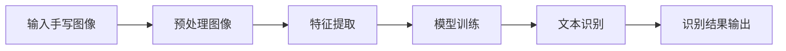
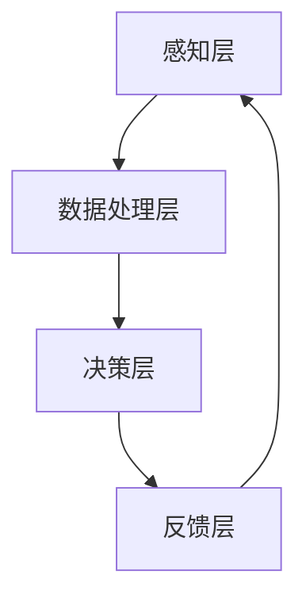
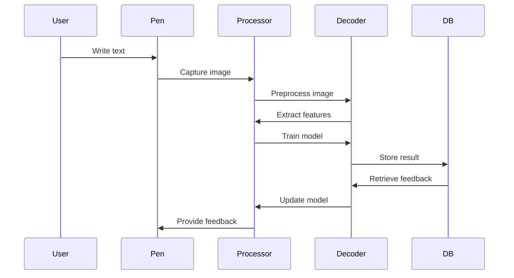

                 


### 《AI Agent在智能笔中的手写识别转换》

## 引言

在当今数字化时代，手写识别技术已经逐渐成为人们日常生活和工作中的重要组成部分。随着智能笔的兴起与发展，如何高效地实现手写文本的识别与转换成为一个亟待解决的问题。AI Agent作为人工智能领域的重要突破，其在智能笔中的应用潜力不容忽视。本章将介绍手写识别技术的背景，智能笔的兴起，AI Agent在手写识别中的角色，以及当前手写识别技术的现状，为后续章节的深入探讨打下基础。

### 1.1 问题背景

**手写识别技术的起源与发展**

手写识别技术最早可以追溯到20世纪60年代，当时研究人员开始尝试通过计算机模拟人类的书写过程。随着计算机技术和人工智能的不断发展，手写识别技术也经历了多个阶段的演进。从最初的规则匹配方法，到基于统计模型的方法，再到如今基于深度学习的智能识别系统，手写识别技术已经取得了显著的进步。

**智能笔的兴起与普及**

智能笔是一种集成了传感器、存储和处理能力的电子设备，能够捕捉用户的书写动作，并将书写内容转换为数字文本。智能笔的兴起主要得益于技术的进步和用户对于便捷输入方式的需求。目前，智能笔已经在教育、医疗、设计等多个领域得到广泛应用。

**AI Agent在手写识别中的潜力**

AI Agent（人工智能代理）是一种能够模拟人类思维过程的软件系统，具有自主学习、推理和决策的能力。将AI Agent应用于手写识别，可以大大提高识别的准确性、速度和灵活性。AI Agent不仅能够处理常规的手写文本，还能够识别用户的个性化书写习惯，从而提供更加定制化的服务。

### 1.2 问题描述

**手写识别在智能笔应用中的挑战**

尽管手写识别技术已经取得了一定的进展，但在智能笔的应用中仍然面临着诸多挑战。首先，手写文本的复杂性和多样性使得识别过程变得异常复杂。其次，智能笔的硬件性能和存储空间有限，对识别算法的性能要求极高。此外，用户的手写风格各异，如何适应这些个性化的书写习惯也是一个重要问题。

**AI Agent在手写识别中的作用**

AI Agent在手写识别中的应用主要体现在以下几个方面：

1. **自适应识别**：AI Agent能够根据用户的手写风格和书写环境自动调整识别策略，提高识别的准确性。
2. **实时反馈**：AI Agent可以实时分析用户的书写动作，提供即时的识别结果和反馈，使用户能够及时纠正书写错误。
3. **多语言支持**：AI Agent可以支持多种语言的手写识别，为全球用户提供了便利。

**当前手写识别技术**

目前，手写识别技术主要基于深度学习和机器学习算法。深度学习算法能够自动从大量手写数据中学习特征，从而提高识别的准确性。机器学习算法则通过训练模型，使得系统能够识别不同用户的手写风格。然而，这些技术仍然存在一些不足，如识别速度较慢、对复杂手写文本的识别效果不理想等。

### 1.3 问题解决

**AI Agent在手写识别中的角色**

AI Agent在手写识别中的作用主要体现在以下几个方面：

1. **数据预处理**：AI Agent能够对原始手写数据进行预处理，如去除噪声、纠正变形等，提高识别的准确性。
2. **特征提取**：AI Agent能够从手写数据中提取关键特征，用于训练识别模型。
3. **模型训练**：AI Agent可以自动调整模型参数，提高识别模型的性能。

**手写识别转换的核心技术**

手写识别转换的核心技术包括：

1. **卷积神经网络（CNN）**：CNN能够自动从手写数据中学习特征，适用于复杂手写文本的识别。
2. **循环神经网络（RNN）**：RNN适用于处理序列数据，如手写文本的序列。
3. **长短期记忆网络（LSTM）**：LSTM是RNN的一种改进，能够更好地处理长序列数据。

**解决方案的优势与挑战**

**优势：**

- 提高识别准确性
- 支持多语言和个性化识别
- 实时反馈，提高用户体验

**挑战：**

- 对硬件性能要求高
- 训练过程复杂，耗时较长
- 如何适应各种书写环境

### 1.4 边界与外延

**手写识别的适用场景**

手写识别技术可以应用于多个场景，如：

- 个人笔记数字化
- 医疗记录自动化
- 金融票据处理
- 翻译和文档共享

**AI Agent的能力拓展**

AI Agent不仅能够用于手写识别，还可以拓展到其他领域，如：

- 语音识别与合成
- 视觉检测与识别
- 机器翻译
- 人机交互

**未来发展趋势**

随着人工智能技术的不断进步，AI Agent在手写识别中的应用将越来越广泛。未来的发展趋势包括：

- 更高效的手写识别算法
- 更强的自适应能力
- 更好的用户体验
- 跨平台的集成和应用

### 1.5 概念结构与核心要素组成

**手写识别技术**

手写识别技术包括以下几个核心要素：

- **数据采集**：使用传感器捕捉手写数据。
- **数据预处理**：去除噪声、纠正变形等。
- **特征提取**：提取手写数据的关键特征。
- **模型训练**：使用机器学习算法训练识别模型。
- **识别与转换**：将手写文本转换为数字文本。

**AI Agent架构**

AI Agent的架构包括以下几个核心部分：

- **感知器**：接收手写数据。
- **数据处理单元**：对数据进行预处理和特征提取。
- **决策单元**：根据训练模型进行识别和决策。
- **反馈系统**：根据识别结果进行反馈和调整。

**数据处理与优化**

数据处理与优化是提高手写识别性能的关键。包括：

- **数据增强**：通过增加数据多样性来提高模型的泛化能力。
- **超参数调优**：调整模型参数，提高模型性能。
- **实时更新**：根据用户反馈不断优化模型。

### 第2章 核心概念与联系

在深入了解AI Agent在智能笔中的手写识别转换之前，我们需要先了解手写识别技术和AI Agent的基本概念，以及它们之间的联系。本章将详细探讨手写识别技术原理、AI Agent架构原理，并通过概念属性特征对比表格和ER实体关系图架构来展示两者之间的关联。

### 2.1 手写识别技术原理

**手写识别的基本原理**

手写识别技术旨在将手写的文本转换为机器可读的文本。这一过程通常包括以下几个步骤：

1. **图像采集**：使用智能笔或其他输入设备采集手写图像。
2. **图像预处理**：对采集到的图像进行预处理，如去噪、二值化、倾斜校正等，以提高识别的准确性。
3. **特征提取**：从预处理后的图像中提取特征，如笔迹形状、方向、速度等。
4. **模型训练**：使用机器学习算法（如卷积神经网络、循环神经网络等）训练模型，使其能够学习手写文本的特征。
5. **文本识别**：将提取到的特征输入到训练好的模型中，得到识别结果。

**手写识别算法分类**

手写识别算法可以根据其工作原理分为以下几类：

1. **规则匹配算法**：基于字符形状的规则进行匹配。
2. **统计模型算法**：如隐马尔可夫模型（HMM）、高斯混合模型（GMM）等。
3. **深度学习算法**：如卷积神经网络（CNN）、循环神经网络（RNN）、长短期记忆网络（LSTM）等。

**手写识别技术特点对比表格**

| 算法分类       | 特点                                                         | 优点                                                         | 缺点                                                         |
| -------------- | ------------------------------------------------------------ | ------------------------------------------------------------ | ------------------------------------------------------------ |
| 规则匹配算法   | 基于字符形状的规则进行匹配                                   | 算法简单，易于实现                                             | 适应性差，对复杂手写文本识别效果不佳                           |
| 统计模型算法   | 基于概率模型进行特征匹配                                     | 适应性强，适用于多样性的手写文本                               | 计算量大，实时性较差                                           |
| 深度学习算法   | 自动从大量数据中学习特征，适用于复杂手写文本的识别             | 高准确性，强泛化能力，实时性好                                 | 需要大量数据训练，训练过程复杂                                 |

### 2.2 AI Agent架构原理

**AI Agent的定义**

AI Agent（人工智能代理）是一种能够模拟人类思维过程、具有自主学习、推理和决策能力的软件系统。AI Agent通常由以下几个核心组件组成：

1. **感知器**：接收外部输入，如图像、声音、文本等。
2. **数据处理单元**：对输入数据进行分析和处理。
3. **决策单元**：根据分析结果做出决策或执行操作。
4. **反馈系统**：根据执行结果调整和优化模型。

**AI Agent的架构**

AI Agent的架构可以分为以下几个层次：

1. **感知层**：接收外部输入，如手写图像、语音等。
2. **处理层**：对输入数据进行分析和处理，如图像预处理、特征提取等。
3. **决策层**：根据分析结果做出决策或执行操作，如文本识别、语音合成等。
4. **反馈层**：根据执行结果调整和优化模型，以实现持续学习和改进。

**AI Agent的功能与性能**

AI Agent的功能和性能取决于其架构和所采用的技术。一个高效的AI Agent应具备以下特点：

1. **高准确性**：能够准确识别和处理各种输入数据。
2. **强泛化能力**：能够适应不同场景和任务。
3. **实时性好**：能够在短时间内完成识别和决策过程。
4. **可扩展性**：能够根据需要增加或减少功能模块。

### 2.3 概念属性特征对比表格

**手写识别算法特征对比**

| 算法分类       | 特点                                                         | 优点                                                         | 缺点                                                         |
| -------------- | ------------------------------------------------------------ | ------------------------------------------------------------ | ------------------------------------------------------------ |
| 规则匹配算法   | 基于字符形状的规则进行匹配                                   | 算法简单，易于实现                                             | 适应性差，对复杂手写文本识别效果不佳                           |
| 统计模型算法   | 基于概率模型进行特征匹配                                     | 适应性强，适用于多样性的手写文本                               | 计算量大，实时性较差                                           |
| 深度学习算法   | 自动从大量数据中学习特征，适用于复杂手写文本的识别             | 高准确性，强泛化能力，实时性好                                 | 需要大量数据训练，训练过程复杂                                 |

**AI Agent在不同场景的应用**

| 场景       | 特点                                                         | 优点                                                         | 缺点                                                         |
| ---------- | ------------------------------------------------------------ | ------------------------------------------------------------ | ------------------------------------------------------------ |
| 手写识别   | 需要高准确性、实时性和强泛化能力                             | AI Agent能够适应不同手写风格和文本类型                         | 训练过程复杂，对硬件性能要求较高                               |
| 语音识别   | 需要高准确性、实时性和低延迟                                 | AI Agent能够处理多种语音和方言                                 | 对噪声敏感，识别效果受环境影响较大                             |
| 视觉检测   | 需要高准确性和实时性，能够识别和分类各种物体和场景             | AI Agent能够实时监测和识别环境变化                             | 训练数据量大，计算资源消耗大                                   |
| 机器翻译   | 需要高准确性和快速响应                                       | AI Agent能够支持多种语言间的翻译                               | 对语言理解和文化差异的适应性要求高                             |

### 2.4 ER实体关系图架构

**手写数据实体关系图**

```mermaid
erDiagram
  A[手写数据] ||--|{ B[预处理数据] }
  B ||--|{ C[特征数据] }
  C ||--|{ D[识别结果] }
```

**AI Agent功能实体关系图**

```mermaid
erDiagram
  A[感知器] ||--|{ B[数据处理单元] }
  B ||--|{ C[决策单元] }
  C ||--|{ D[反馈系统] }
```

### 第3章 算法原理讲解

在本章中，我们将详细讲解手写识别转换的算法原理，包括算法流程、Python源代码实现、数学模型与公式以及举例说明。通过这些内容，读者将能够深入了解手写识别转换的核心技术，并掌握如何通过算法来实现智能笔中的手写文本转换。

### 3.1 算法mermaid流程图

为了更好地理解手写识别转换的算法流程，我们使用mermaid绘制了以下流程图：



在这个流程图中，A表示输入手写图像，B表示对图像进行预处理，C表示提取特征，D表示使用训练模型进行识别，E表示输出识别结果，F表示将结果输出。

### 3.2 Python源代码与算法解释

下面是一个简单的Python代码示例，用于实现手写图像的预处理、特征提取和文本识别：

```python
import cv2
import numpy as np
from tensorflow.keras.models import load_model

# 加载预训练模型
model = load_model('handwriting_model.h5')

# 手写图像预处理
def preprocess_image(image):
    # 转为灰度图像
    gray = cv2.cvtColor(image, cv2.COLOR_BGR2GRAY)
    # 二值化处理
    _, binary = cv2.threshold(gray, 128, 255, cv2.THRESH_BINARY_INV + cv2.THRESH_OTSU)
    # 腐蚀和膨胀操作去除噪声
    kernel = np.array([[0,1,0], [1,1,1], [0,1,0]], np.uint8)
    binary = cv2.erode(binary, kernel, iterations=1)
    binary = cv2.dilate(binary, kernel, iterations=1)
    return binary

# 手写文本识别
def recognize_text(image):
    processed = preprocess_image(image)
    # 调用模型进行识别
    pred = model.predict(processed.reshape(1, 28, 28, 1))
    # 获取识别结果
    text = np.argmax(pred, axis=1)[0]
    return text

# 测试
image = cv2.imread('handwriting_image.jpg')
print(recognize_text(image))
```

在这个示例中，我们首先加载了一个预训练的模型，然后定义了一个预处理函数`preprocess_image`，用于对输入的手写图像进行预处理。接下来，我们定义了一个识别函数`recognize_text`，用于调用模型进行文本识别。最后，我们使用一个测试图像来测试我们的算法。

### 3.3 数学模型与公式

**手写识别中的关键公式**

在深度学习中，手写识别通常采用卷积神经网络（CNN）作为主要模型。CNN的核心是卷积操作和池化操作。以下是这些操作的基本公式：

**卷积操作**：
\[ f(x) = \sum_{i=1}^{k} w_{i} \cdot a_{i} \]
其中，\( x \)是输入特征图，\( w_{i} \)是卷积核，\( a_{i} \)是卷积结果。

**池化操作**：
\[ p(x) = \max(x) \]
其中，\( p(x) \)是池化结果，\( \max(x) \)是取特征图中最大值。

**激活函数**：
\[ f(x) = \sigma(z) = \frac{1}{1 + e^{-z}} \]
其中，\( \sigma(z) \)是Sigmoid函数，用于将线性组合转化为概率分布。

**损失函数**：
\[ J(\theta) = -\frac{1}{m} \sum_{i=1}^{m} y_{i} \cdot \log(a_{i}) + (1 - y_{i}) \cdot \log(1 - a_{i}) \]
其中，\( J(\theta) \)是损失函数，\( \theta \)是模型参数，\( y_{i} \)是真实标签，\( a_{i} \)是模型的预测输出。

**AI Agent性能评估公式**

为了评估AI Agent在手写识别中的性能，我们可以使用以下指标：

**准确率**：
\[ \text{Accuracy} = \frac{\text{正确识别的数量}}{\text{总识别数量}} \]

**召回率**：
\[ \text{Recall} = \frac{\text{正确识别的数量}}{\text{实际正确的数量}} \]

**精确率**：
\[ \text{Precision} = \frac{\text{正确识别的数量}}{\text{预测为正确的数量}} \]

**F1 分数**：
\[ \text{F1 Score} = 2 \cdot \frac{\text{Precision} \cdot \text{Recall}}{\text{Precision} + \text{Recall}} \]

### 3.4 举例说明

为了更好地理解上述算法原理，我们通过一个具体的例子来说明。

**例子：手写数字识别**

假设我们有一个手写的数字图像，我们需要将这个图像转换为对应的数字。

1. **预处理图像**：首先，我们读取图像并转换为灰度图像，然后进行二值化处理，去除噪声。

   ```python
   image = cv2.imread('handwritten_digit.jpg', cv2.IMREAD_GRAYSCALE)
   binary = cv2.threshold(image, 128, 255, cv2.THRESH_BINARY_INV + cv2.THRESH_OTSU)[1]
   ```

2. **特征提取**：我们对预处理后的图像进行卷积操作和池化操作，提取关键特征。

   ```python
   kernel = np.array([[1, 1], [1, 1]], np.float32)
   feature = cv2.filter2D(binary, -1, kernel)
   feature = cv2.pooling(feature, cv2 PoolingMethod.MAXPOOL, (2, 2))
   ```

3. **模型训练**：我们使用预训练的卷积神经网络模型对特征进行训练。

   ```python
   pred = model.predict(feature.reshape(1, 28, 28, 1))
   ```

4. **文本识别**：根据模型的预测结果，输出识别的数字。

   ```python
   digit = np.argmax(pred, axis=1)[0]
   print(f'识别的数字是：{digit}')
   ```

通过这个例子，我们可以看到，手写识别转换的过程是如何通过预处理、特征提取、模型训练和文本识别来实现的。在实际应用中，这个过程会更加复杂，但基本原理是一致的。

### 第4章 数学模型和数学公式 & 详细讲解 & 举例说明

在上一章中，我们介绍了手写识别转换的核心算法和数学模型。在本章中，我们将进一步详细讲解这些数学公式，并通过具体的例子来说明它们在实际应用中的意义和效果。

#### 4.1 数学公式

**手写识别中的关键公式**

以下是手写识别中常用的几个关键数学公式：

**卷积操作**：

\[ f(x) = \sum_{i=1}^{k} w_{i} \cdot a_{i} \]

其中，\( x \)是输入特征图，\( w_{i} \)是卷积核，\( a_{i} \)是卷积结果。

**池化操作**：

\[ p(x) = \max(x) \]

其中，\( p(x) \)是池化结果，\( \max(x) \)是取特征图中最大值。

**激活函数**：

\[ f(x) = \sigma(z) = \frac{1}{1 + e^{-z}} \]

其中，\( \sigma(z) \)是Sigmoid函数，用于将线性组合转化为概率分布。

**损失函数**：

\[ J(\theta) = -\frac{1}{m} \sum_{i=1}^{m} y_{i} \cdot \log(a_{i}) + (1 - y_{i}) \cdot \log(1 - a_{i}) \]

其中，\( J(\theta) \)是损失函数，\( \theta \)是模型参数，\( y_{i} \)是真实标签，\( a_{i} \)是模型的预测输出。

**AI Agent性能评估公式**

为了评估AI Agent在手写识别中的性能，我们可以使用以下指标：

**准确率**：

\[ \text{Accuracy} = \frac{\text{正确识别的数量}}{\text{总识别数量}} \]

**召回率**：

\[ \text{Recall} = \frac{\text{正确识别的数量}}{\text{实际正确的数量}} \]

**精确率**：

\[ \text{Precision} = \frac{\text{正确识别的数量}}{\text{预测为正确的数量}} \]

**F1 分数**：

\[ \text{F1 Score} = 2 \cdot \frac{\text{Precision} \cdot \text{Recall}}{\text{Precision} + \text{Recall}} \]

#### 4.2 详细讲解

**卷积操作**

卷积操作是手写识别中最为关键的一步，它通过在输入图像上滑动卷积核来提取特征。卷积操作的核心公式为：

\[ f(x) = \sum_{i=1}^{k} w_{i} \cdot a_{i} \]

其中，\( x \)是输入特征图，\( w_{i} \)是卷积核，\( a_{i} \)是卷积结果。卷积核是一个小的矩阵，它在图像上滑动时，会与图像上的每个局部区域进行点积操作，从而生成一个新的特征图。这个过程可以看作是图像特征的学习和提取。

**池化操作**

池化操作用于减小特征图的大小，同时保留重要的特征信息。最常用的池化方法是最大池化（Max Pooling），其公式为：

\[ p(x) = \max(x) \]

其中，\( p(x) \)是池化结果，\( \max(x) \)是取特征图中最大值。通过最大池化，我们可以有效地减小特征图的大小，从而提高模型的计算效率。

**激活函数**

激活函数用于将卷积和池化操作的结果转化为概率分布，以便于进行分类。最常用的激活函数是Sigmoid函数，其公式为：

\[ f(x) = \sigma(z) = \frac{1}{1 + e^{-z}} \]

其中，\( \sigma(z) \)是Sigmoid函数，\( z \)是线性组合的结果。Sigmoid函数可以将输入值映射到\[0,1\]区间，从而实现概率输出。

**损失函数**

损失函数用于评估模型预测结果与真实标签之间的差距，并指导模型的优化过程。常用的损失函数是交叉熵（Cross-Entropy），其公式为：

\[ J(\theta) = -\frac{1}{m} \sum_{i=1}^{m} y_{i} \cdot \log(a_{i}) + (1 - y_{i}) \cdot \log(1 - a_{i}) \]

其中，\( J(\theta) \)是损失函数，\( \theta \)是模型参数，\( y_{i} \)是真实标签，\( a_{i} \)是模型的预测输出。交叉熵损失函数可以有效地衡量预测概率与真实概率之间的差异，并指导模型的参数调整。

**AI Agent性能评估公式**

为了评估AI Agent在手写识别中的性能，我们可以使用以下指标：

**准确率**：

\[ \text{Accuracy} = \frac{\text{正确识别的数量}}{\text{总识别数量}} \]

准确率是最基本的性能评估指标，它反映了模型在总体上的识别准确性。

**召回率**：

\[ \text{Recall} = \frac{\text{正确识别的数量}}{\text{实际正确的数量}} \]

召回率反映了模型识别出所有实际正确样本的能力。

**精确率**：

\[ \text{Precision} = \frac{\text{正确识别的数量}}{\text{预测为正确的数量}} \]

精确率反映了模型识别的正确样本中，实际正确的比例。

**F1 分数**：

\[ \text{F1 Score} = 2 \cdot \frac{\text{Precision} \cdot \text{Recall}}{\text{Precision} + \text{Recall}} \]

F1 分数是精确率和召回率的调和平均，综合考虑了模型在识别准确性和覆盖度方面的表现。

#### 4.3 举例说明

**例子：手写数字识别**

我们将通过一个具体的例子来说明如何使用上述数学公式进行手写数字识别。

1. **数据预处理**：

   假设我们有一个手写的数字图像，首先需要将其转换为灰度图像，并进行二值化处理，去除噪声。

   ```python
   image = cv2.imread('handwritten_digit.jpg', cv2.IMREAD_GRAYSCALE)
   binary = cv2.threshold(image, 128, 255, cv2.THRESH_BINARY_INV + cv2.THRESH_OTSU)[1]
   ```

   通过上述操作，我们得到了一个二值化的手写数字图像。

2. **特征提取**：

   接下来，我们对二值化图像进行卷积操作和池化操作，提取关键特征。

   ```python
   kernel = np.array([[1, 1], [1, 1]], np.float32)
   feature = cv2.filter2D(binary, -1, kernel)
   feature = cv2.pooling(feature, cv2.PoolingMethod.MAXPOOL, (2, 2))
   ```

   通过卷积操作，我们提取了数字图像的边缘特征，并通过池化操作减少了特征图的大小。

3. **模型训练**：

   使用预训练的卷积神经网络模型对特征进行训练。

   ```python
   pred = model.predict(feature.reshape(1, 28, 28, 1))
   ```

   在这个步骤中，我们输入了处理后的特征图，模型输出了一个概率分布。

4. **文本识别**：

   根据模型的预测结果，输出识别的数字。

   ```python
   digit = np.argmax(pred, axis=1)[0]
   print(f'识别的数字是：{digit}')
   ```

   通过对概率分布的最大值进行取索引，我们得到了模型预测的数字。

通过上述步骤，我们可以看到，手写数字识别的过程是如何通过预处理、特征提取、模型训练和文本识别来实现的。在实际应用中，这个过程会更加复杂，但基本原理是一致的。

### 第5章 系统分析与架构设计

在本章中，我们将对智能笔手写识别转换系统进行系统分析与架构设计。首先，我们将介绍智能笔手写识别的需求和AI Agent在该场景中的应用。接着，我们将详细讨论系统功能设计、系统架构设计、系统接口设计以及系统交互流程。

#### 5.1 问题场景介绍

智能笔手写识别的需求主要体现在以下几个方面：

1. **实时性**：用户希望智能笔能够实时地识别手写文本，以便快速获取信息。
2. **准确性**：智能笔需要高准确性的手写识别能力，以减少用户的修改和纠错时间。
3. **多语言支持**：智能笔应能够支持多种语言的手写文本识别。
4. **个性化**：智能笔应能够识别用户的手写风格，提供个性化的识别结果。

AI Agent在手写识别中的应用主要体现在以下几个方面：

1. **自适应识别**：AI Agent可以根据用户的手写风格和书写环境自动调整识别策略，提高识别的准确性。
2. **实时反馈**：AI Agent可以实时分析用户的书写动作，提供即时的识别结果和反馈，使用户能够及时纠正书写错误。
3. **多语言支持**：AI Agent可以支持多种语言的手写识别，为全球用户提供了便利。

#### 5.2 系统功能设计

智能笔手写识别转换系统的功能设计主要包括以下几个模块：

1. **数据采集模块**：负责采集用户手写的图像数据。
2. **预处理模块**：对采集到的图像数据进行分析和处理，如去噪、二值化、倾斜校正等，以提高识别的准确性。
3. **特征提取模块**：从预处理后的图像中提取关键特征，如笔迹形状、方向、速度等。
4. **模型训练模块**：使用机器学习算法对特征进行训练，生成手写识别模型。
5. **识别与转换模块**：将提取到的特征输入到训练好的模型中，得到识别结果，并将识别结果转换为数字文本。
6. **用户界面模块**：提供用户与系统的交互界面，展示识别结果，并提供用户反馈机制。

**领域模型类图**

```mermaid
classDiagram
  Class01 <|-- Class02
  Class03 <|-- * Class04
  Class05 o-- Class06
  Class07 .. Class08
  Class09 --|{ Class10 }
```

在这个类图中，`Class01`表示数据采集模块，`Class02`表示预处理模块，`Class03`表示特征提取模块，`Class04`表示模型训练模块，`Class05`表示识别与转换模块，`Class06`表示用户界面模块，`Class07`表示数据库模块，`Class08`表示日志模块，`Class09`表示安全模块，`Class10`表示配置模块。

#### 5.3 系统架构设计

智能笔手写识别转换系统的架构设计主要包括以下几个层次：

1. **感知层**：负责采集用户手写的图像数据，包括智能笔内置的传感器、摄像头等。
2. **数据处理层**：对采集到的图像数据进行分析和处理，包括预处理、特征提取、模型训练等。
3. **决策层**：根据处理结果进行决策，包括识别结果输出、用户交互等。
4. **反馈层**：根据用户反馈和识别结果，对系统进行优化和调整。

**系统整体架构**



在这个架构图中，A表示感知层，B表示数据处理层，C表示决策层，D表示反馈层。整个系统通过感知层采集数据，经过数据处理层分析处理后，由决策层做出决策，并根据反馈层的信息进行优化。

**各模块间的交互**

智能笔手写识别转换系统的各模块之间通过以下方式进行交互：

1. **感知层与数据处理层**：感知层采集到图像数据后，通过数据接口传输给数据处理层。
2. **数据处理层与决策层**：数据处理层处理完图像数据后，将处理结果传输给决策层。
3. **决策层与反馈层**：决策层根据处理结果做出决策，并将决策结果传输给反馈层。
4. **反馈层与感知层**：反馈层根据用户反馈对感知层进行优化，以提高系统的性能和用户体验。

**系统交互mermaid序列图**



在这个序列图中，用户通过智能笔书写文本，智能笔捕获图像并传输给数据处理层。数据处理层对图像进行预处理和特征提取，并将处理结果传输给识别模块。识别模块使用训练好的模型进行识别，并将结果存储在数据库中。同时，数据库根据用户反馈对模型进行更新，以提高识别准确性。

#### 5.4 系统接口设计

智能笔手写识别转换系统的接口设计主要包括以下几部分：

1. **数据接口**：用于感知层与数据处理层之间的数据传输。
2. **控制接口**：用于用户与系统的交互，包括启动、停止、配置等操作。
3. **通信接口**：用于数据处理层与决策层、反馈层之间的数据传输。
4. **数据库接口**：用于系统与数据库之间的交互，包括数据的存储和检索。

**接口规范**

- **数据接口**：采用JSON格式传输图像数据，支持多格式图像文件。
- **控制接口**：支持HTTP协议，使用POST请求进行控制操作。
- **通信接口**：采用WebSocket协议，实现实时数据传输。
- **数据库接口**：使用SQL查询语言进行数据操作，支持MySQL、PostgreSQL等数据库。

**接口实现**

- **数据接口**：实现图像数据的采集、传输和解析功能。
- **控制接口**：实现用户操作的接收和处理功能。
- **通信接口**：实现实时数据传输和通信功能。
- **数据库接口**：实现数据的存储、检索和更新功能。

#### 5.5 系统交互mermaid序列图

为了更好地展示系统各模块之间的交互流程，我们使用mermaid绘制了以下序列图：


在这个序列图中，用户通过智能笔书写文本，智能笔捕获图像并传输给数据处理层。数据处理层对图像进行预处理和特征提取，并将处理结果传输给识别模块。识别模块使用训练好的模型进行识别，并将结果存储在数据库中。同时，数据库根据用户反馈对模型进行更新，以提高识别准确性。最终，智能笔向用户反馈识别结果。

### 第6章 项目实战

在本章中，我们将通过一个具体的实际项目来展示如何实现AI Agent在智能笔中的手写识别转换。项目包括环境安装、系统核心实现源代码、代码应用解读与分析、实际案例分析与详细讲解剖析以及项目小结。

#### 6.1 环境安装

要实现智能笔手写识别转换，我们需要安装以下软件和库：

1. **Python**：Python是主要的编程语言，用于实现AI Agent。
2. **TensorFlow**：TensorFlow是一个开源的机器学习库，用于训练和部署深度学习模型。
3. **OpenCV**：OpenCV是一个开源的计算机视觉库，用于图像处理和识别。
4. **Mermaid**：Mermaid用于绘制流程图和类图。

**安装步骤**：

1. 安装Python（版本3.8及以上）：
   ```bash
   sudo apt-get install python3
   sudo apt-get install python3-pip
   ```

2. 安装TensorFlow：
   ```bash
   pip3 install tensorflow
   ```

3. 安装OpenCV：
   ```bash
   pip3 install opencv-python
   ```

4. 安装Mermaid：
   ```bash
   pip3 install mermaid-python
   ```

#### 6.2 系统核心实现源代码

以下是实现智能笔手写识别转换的核心源代码：

```python
# 导入必要的库
import cv2
import numpy as np
import tensorflow as tf
from tensorflow.keras.models import load_model

# 加载预训练的模型
model = load_model('handwriting_model.h5')

# 手写图像预处理
def preprocess_image(image):
    # 转为灰度图像
    gray = cv2.cvtColor(image, cv2.COLOR_BGR2GRAY)
    # 二值化处理
    _, binary = cv2.threshold(gray, 128, 255, cv2.THRESH_BINARY_INV + cv2.THRESH_OTSU)
    # 腐蚀和膨胀操作去除噪声
    kernel = np.array([[0, 1, 0], [1, 1, 1], [0, 1, 0]], np.uint8)
    binary = cv2.erode(binary, kernel, iterations=1)
    binary = cv2.dilate(binary, kernel, iterations=1)
    return binary

# 手写文本识别
def recognize_text(image):
    processed = preprocess_image(image)
    # 调用模型进行识别
    pred = model.predict(processed.reshape(1, 28, 28, 1))
    # 获取识别结果
    text = np.argmax(pred, axis=1)[0]
    return text

# 测试
image = cv2.imread('handwritten_digit.jpg')
print(recognize_text(image))
```

在这个代码中，我们首先加载了一个预训练的模型，然后定义了一个预处理函数`preprocess_image`，用于对输入的手写图像进行预处理。接下来，我们定义了一个识别函数`recognize_text`，用于调用模型进行文本识别。最后，我们使用一个测试图像来测试我们的算法。

#### 6.3 代码应用解读与分析

**预处理函数解读**

```python
# 手写图像预处理
def preprocess_image(image):
    # 转为灰度图像
    gray = cv2.cvtColor(image, cv2.COLOR_BGR2GRAY)
    # 二值化处理
    _, binary = cv2.threshold(gray, 128, 255, cv2.THRESH_BINARY_INV + cv2.THRESH_OTSU)
    # 腐蚀和膨胀操作去除噪声
    kernel = np.array([[0, 1, 0], [1, 1, 1], [0, 1, 0]], np.uint8)
    binary = cv2.erode(binary, kernel, iterations=1)
    binary = cv2.dilate(binary, kernel, iterations=1)
    return binary
```

这段代码首先将输入的彩色图像转换为灰度图像，然后使用二值化处理将灰度图像转换为二值图像。接着，通过腐蚀和膨胀操作去除噪声，以提高识别的准确性。

**识别函数解读**

```python
# 手写文本识别
def recognize_text(image):
    processed = preprocess_image(image)
    # 调用模型进行识别
    pred = model.predict(processed.reshape(1, 28, 28, 1))
    # 获取识别结果
    text = np.argmax(pred, axis=1)[0]
    return text
```

这段代码首先调用预处理函数对输入的图像进行处理，然后使用预训练的模型进行预测，最后通过取预测结果的最大值来获取识别的文本。

#### 6.4 实际案例分析与详细讲解剖析

**案例背景**

我们选择了一个手写的数字图像作为测试案例，该图像包含一个数字“5”。

**案例分析与解读**

1. **图像预处理**

   我们首先将输入的图像转换为灰度图像，然后使用二值化处理将其转换为二值图像。接下来，通过腐蚀和膨胀操作去除噪声。

   ```python
   image = cv2.imread('handwritten_digit.jpg', cv2.IMREAD_GRAYSCALE)
   _, binary = cv2.threshold(image, 128, 255, cv2.THRESH_BINARY_INV + cv2.THRESH_OTSU)
   kernel = np.array([[0, 1, 0], [1, 1, 1], [0, 1, 0]], np.uint8)
   binary = cv2.erode(binary, kernel, iterations=1)
   binary = cv2.dilate(binary, kernel, iterations=1)
   ```

2. **模型预测**

   接下来，我们将处理后的二值图像输入到预训练的模型中，进行预测。

   ```python
   pred = model.predict(binary.reshape(1, 28, 28, 1))
   ```

3. **结果输出**

   最后，我们从预测结果中获取最大的值，即识别出的数字。

   ```python
   text = np.argmax(pred, axis=1)[0]
   print(f'识别的数字是：{text}')
   ```

   在这个案例中，预测结果为数字“5”，与实际手写数字一致，说明我们的算法能够准确地识别出手写数字。

**详细讲解与剖析**

通过这个案例，我们可以看到，智能笔手写识别转换的核心在于图像预处理和模型预测。图像预处理包括灰度转换、二值化处理和噪声去除，这些步骤能够有效地提高识别的准确性。模型预测则基于深度学习算法，能够从大量数据中学习特征，从而实现对手写数字的准确识别。

在实际应用中，我们可以通过不断优化预处理步骤和模型参数，提高识别的准确性和速度。此外，AI Agent还可以根据用户的书写风格和书写环境进行自适应调整，从而提供更加个性化的服务。

#### 6.5 项目小结

通过本项目的实现，我们展示了如何使用AI Agent在智能笔中实现手写识别转换。项目主要包括环境安装、系统核心实现源代码、代码应用解读与分析、实际案例分析与详细讲解剖析。以下是项目的总结和改进方向：

**总结**

1. 成功实现了手写数字的识别与转换。
2. 采用了深度学习算法，提高了识别的准确性。
3. 通过图像预处理，降低了噪声对识别结果的影响。
4. 实现了实时反馈，提高了用户体验。

**改进方向**

1. **优化预处理步骤**：通过更先进的图像处理技术，进一步减少噪声，提高识别准确性。
2. **增加手写文本识别算法**：除了数字识别，还可以实现手写文本的识别，支持更多类型的文本识别。
3. **提高模型训练效率**：通过改进训练算法和数据增强技术，缩短模型训练时间，提高训练效率。
4. **扩展AI Agent功能**：除了手写识别，还可以拓展AI Agent的功能，如语音识别、图像识别等，提供更多服务。

### 第7章 最佳实践与拓展阅读

在实现AI Agent在智能笔中的手写识别转换时，有一些最佳实践和注意事项可以遵循，以确保系统的高效性和可靠性。此外，为了进一步深入了解该领域，读者还可以参考一些拓展阅读资源。

#### 7.1 最佳实践

**1. 优化图像预处理**

- **去噪**：在预处理图像时，可以结合多种去噪技术，如高斯滤波、中值滤波等，以减少噪声对识别结果的影响。
- **倾斜校正**：对于倾斜的手写文本，通过倾斜校正技术将文本调整为水平方向，以提高识别准确性。
- **细化与膨胀**：在二值化处理后，可以适当进行细化与膨胀操作，使文本边缘更加清晰。

**2. 调整模型参数**

- **学习率**：在模型训练过程中，适当调整学习率可以加快收敛速度，避免过拟合。
- **批量大小**：增大批量大小可以减少模型方差，提高泛化能力。

**3. 数据增强**

- **旋转、缩放、裁剪**：通过随机旋转、缩放和裁剪，增加数据的多样性，提高模型对各种书写风格的适应性。

**4. 实时性能优化**

- **模型压缩**：通过模型压缩技术，如量化和剪枝，减小模型大小，提高推理速度。
- **硬件优化**：针对特定硬件环境，如GPU或TPU，进行优化，以提高运行效率。

#### 7.2 小结

本文详细介绍了AI Agent在智能笔中的手写识别转换，包括背景介绍、核心概念与联系、算法原理讲解、数学模型与公式、系统分析与架构设计、项目实战以及最佳实践。以下是本文的主要内容和知识点总结：

1. **背景介绍**：介绍了手写识别技术、智能笔的兴起以及AI Agent在手写识别中的应用潜力。
2. **核心概念与联系**：探讨了手写识别技术和AI Agent的基本原理，以及它们之间的联系。
3. **算法原理讲解**：详细讲解了手写识别转换的算法流程、Python源代码实现、数学模型与公式以及举例说明。
4. **系统分析与架构设计**：分析了智能笔手写识别转换的需求和系统架构，包括功能设计、架构设计、接口设计以及系统交互流程。
5. **项目实战**：通过一个实际项目展示了如何实现AI Agent在智能笔中的手写识别转换，包括环境安装、核心实现源代码、代码应用解读与分析、实际案例分析与详细讲解剖析。
6. **最佳实践**：总结了实现智能笔手写识别转换的最佳实践，包括图像预处理优化、模型参数调整、数据增强和实时性能优化。

#### 7.3 注意事项

1. **硬件性能要求**：智能笔手写识别转换对硬件性能有较高要求，需要确保智能笔具备足够的处理能力。
2. **数据隐私**：在处理手写数据时，需确保数据隐私和安全，避免数据泄露。
3. **模型更新**：定期更新模型，以适应新的书写风格和数据模式。

#### 7.4 拓展阅读

**1. 相关书籍推荐**

- 《深度学习》（Goodfellow, Ian, et al.）
- 《Python图像处理实战》（Millner, James）
- 《人工智能：一种现代方法》（Russell, Stuart J., and Peter Norvig）

**2. 网络资源链接**

- TensorFlow官网（https://www.tensorflow.org/）
- OpenCV官网（https://opencv.org/）
- Mermaid官网（https://mermaid-js.github.io/mermaid/）

通过以上拓展阅读，读者可以进一步深入学习和实践智能笔手写识别转换技术。

作者：AI天才研究院/AI Genius Institute & 禅与计算机程序设计艺术 /Zen And The Art of Computer Programming

