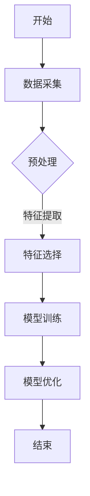
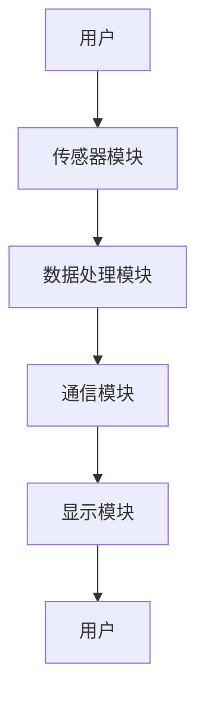
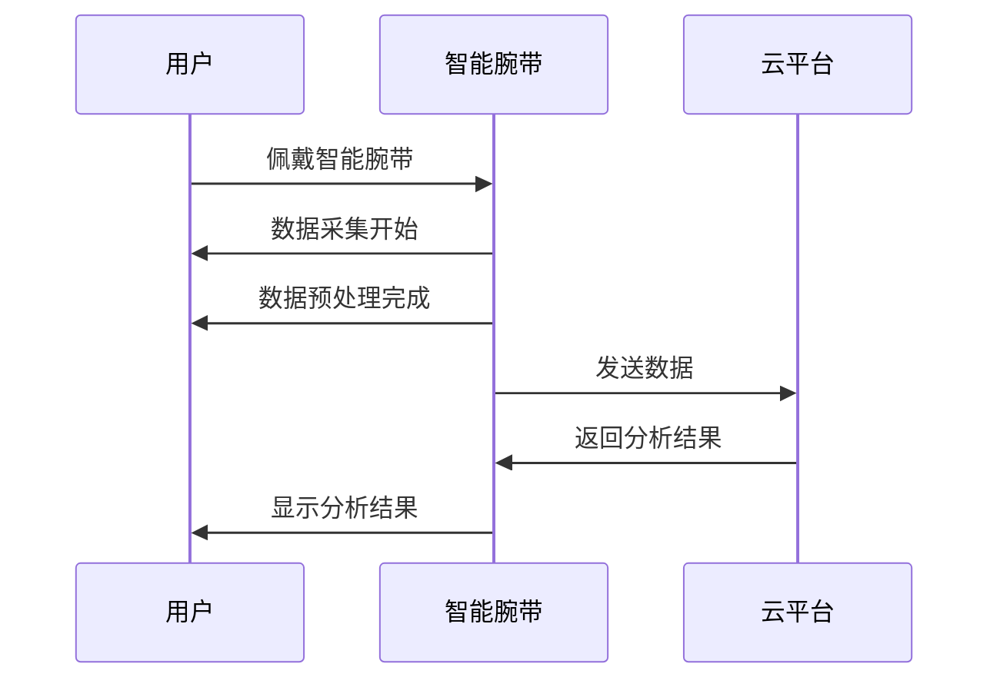

                 

### 第一部分: AI Agent与智能腕带

#### 第1章: AI Agent与智能腕带概述

##### 1.1 问题背景

在现代企业中，工作效率监测已经成为提升企业生产力的重要手段。然而，传统的监测方法通常依赖于人工记录和手动审核，不仅费时费力，而且容易出现人为误差。随着人工智能技术的快速发展，特别是AI Agent技术的成熟，通过智能腕带进行工作效率监测成为了一种新兴且有效的解决方案。

###### 1.1.1 工作效率监测的必要性

工作效率监测的必要性主要体现在以下几个方面：

1. **数据准确性**：人工记录容易受到主观因素的影响，而智能监测可以更准确地捕捉工作状态。
2. **实时性**：智能监测系统能够实时反馈工作状态，帮助管理者快速做出决策。
3. **全面性**：智能监测可以覆盖员工的各种工作状态，包括专注度、工作强度、休息时间等。
4. **数据利用率**：通过智能监测收集到的数据可以用于进一步分析和优化，提高工作效率。

###### 1.1.2 AI Agent的定义与作用

AI Agent（人工智能代理）是一种能够自主执行任务的智能体，具备感知环境、决策执行、学习优化等能力。在智能腕带中，AI Agent的主要作用包括：

1. **数据采集**：AI Agent可以实时采集用户的生理、行为数据，如心率、运动轨迹、脑电波等。
2. **数据分析**：AI Agent可以对采集到的数据进行分析，识别用户的注意力水平、疲劳程度等。
3. **智能反馈**：根据分析结果，AI Agent可以提供智能化的建议和反馈，如提醒用户休息、调整工作节奏等。

###### 1.1.3 智能腕带的技术基础

智能腕带是一种集成了传感器、处理器、通信模块等技术的可穿戴设备。其主要技术基础包括：

1. **传感器技术**：智能腕带配备了多种传感器，如加速度计、陀螺仪、心 Rate 光电传感器等，用于实时监测用户的生理和行为数据。
2. **数据处理技术**：智能腕带内置了高性能处理器，能够实时处理传感器数据，进行特征提取和模型计算。
3. **通信技术**：智能腕带通常支持蓝牙、Wi-Fi等无线通信技术，可以将处理后的数据传输到云端或移动设备。

##### 1.2 核心概念

###### 1.2.1 AI Agent的定义与特点

AI Agent是一种具备自主决策和行动能力的智能体，其定义和特点如下：

1. **自主性**：AI Agent能够在没有人类干预的情况下自主执行任务。
2. **适应性**：AI Agent可以根据环境变化和学习到的经验调整自己的行为策略。
3. **协作性**：多个AI Agent可以协同工作，实现更复杂的任务。

###### 1.2.2 智能腕带的构成与功能

智能腕带的构成和功能如下：

1. **构成**：智能腕带主要由传感器模块、数据处理模块、通信模块和用户界面组成。
2. **功能**：智能腕带的主要功能是监测用户的生理和行为数据，并将这些数据用于分析、反馈和建议。

###### 1.2.3 工作效率监测的关键指标

工作效率监测的关键指标包括：

1. **专注度**：通过分析用户的心率、脑电波等数据，评估用户的专注水平。
2. **工作强度**：通过监测用户的运动轨迹、肌肉活动等数据，评估用户的工作强度。
3. **疲劳度**：通过监测用户的生理指标，如心率变异性、皮肤电活动等，评估用户的疲劳程度。

##### 1.3 概念联系

###### 1.3.1 AI Agent与智能腕带的结合

AI Agent与智能腕带的结合为工作效率监测带来了新的可能性：

1. **实时监测**：AI Agent可以实时分析用户的生理和行为数据，提供实时反馈。
2. **个性化建议**：基于AI Agent的分析结果，智能腕带可以为用户提供个性化的工作建议。
3. **跨平台应用**：AI Agent可以与不同平台和设备集成，实现跨平台的数据分析和应用。

###### 1.3.2 AI Agent在工作效率监测中的应用场景

AI Agent在工作效率监测中的应用场景包括：

1. **企业员工管理**：通过监测员工的工作状态，帮助企业管理者优化人力资源配置。
2. **健康管理**：通过监测员工的生理数据，帮助员工提高健康水平，预防职业病。
3. **智能家居**：通过监测家庭成员的活动，提供个性化的健康和安防建议。

###### 1.3.3 智能腕带的技术挑战与发展前景

智能腕带面临以下技术挑战：

1. **数据处理**：如何高效处理大量实时数据，提供实时分析结果。
2. **功耗优化**：如何优化智能腕带的功耗，延长设备续航时间。
3. **隐私保护**：如何确保用户数据的安全和隐私。

智能腕带的发展前景包括：

1. **技术升级**：随着人工智能技术的进步，智能腕带的监测能力和智能化程度将不断提高。
2. **应用拓展**：智能腕带的应用领域将不断拓展，从工作效率监测延伸到更多领域。

##### 1.4 本章小结

本章对AI Agent与智能腕带进行了概述，介绍了工作效率监测的必要性、AI Agent的定义与作用、智能腕带的技术基础以及AI Agent与智能腕带的结合及其应用场景。这些内容为后续章节的详细分析提供了基础。

----------------------------------------------------------------

### 第二部分: AI Agent技术详解

#### 第2章: AI Agent基础原理

##### 2.1 AI Agent的基本概念

###### 2.1.1 AI Agent的定义与起源

AI Agent（人工智能代理）是一种具备自主性和智能化的计算机程序，能够在特定环境下感知环境、做出决策并采取行动。其起源可以追溯到20世纪80年代，当时人工智能领域提出了智能代理的概念，旨在构建能够模拟人类智能的计算机程序。

###### 2.1.2 AI Agent的组成结构

AI Agent通常由以下几个核心组成部分构成：

1. **感知模块**：用于感知外部环境信息，如传感器数据、视觉图像、声音信号等。
2. **决策模块**：基于感知模块收集的信息，进行决策分析，生成行动计划。
3. **执行模块**：执行决策模块生成的行动计划，实现具体的任务。
4. **学习模块**：通过不断学习环境反馈，优化决策策略和执行能力。

###### 2.1.3 AI Agent的核心算法

AI Agent的核心算法包括以下几种：

1. **决策树算法**：通过构建决策树模型，对输入数据进行分析和分类，指导执行模块进行行动。
2. **支持向量机（SVM）**：利用支持向量机模型，对感知数据进行分类和回归分析，用于决策模块的决策。
3. **深度学习算法**：利用神经网络模型，对复杂的数据进行自动学习和特征提取，提高感知和决策的准确性。

##### 2.2 工作效率监测算法

###### 2.2.1 数据采集与预处理

1. **数据采集**：AI Agent通过传感器模块实时采集用户的生理、行为数据，如心率、呼吸频率、运动轨迹等。
2. **预处理**：对采集到的数据进行清洗和归一化处理，去除噪声和异常值，确保数据质量。

###### 2.2.2 特征提取与选择

1. **特征提取**：从原始数据中提取具有区分性的特征，如心率变异性、步长频率等。
2. **特征选择**：通过统计分析方法，选择对工作效率监测最有代表性的特征，减少数据维度。

###### 2.2.3 模型训练与优化

1. **模型训练**：使用机器学习算法，如决策树、支持向量机、深度学习等，对特征数据建立模型。
2. **模型优化**：通过交叉验证、参数调整等方法，优化模型的性能，提高预测准确性。

##### 2.3 Mermaid算法流程图

下面是一个使用Mermaid绘制的算法流程图：



##### 2.4 Python代码实现

下面是一个简单的Python代码示例，用于实现数据采集和预处理功能：

```python
import numpy as np
import pandas as pd

# 假设已采集到数据
data = np.array([[1, 2], [3, 4], [5, 6]])

# 数据预处理
cleaned_data = np.mean(data, axis=0)

# 特征提取
extracted_features = np.array([cleaned_data[0], cleaned_data[1]])

print(extracted_features)
```

##### 2.5 数学模型与公式

下面是工作效率监测的一个基本数学模型：

$$
\text{Cost(J)} = \sum_{i=1}^{n} \frac{1}{2} (y_i - \hat{y}_i)^2
$$

其中，$y_i$是实际工作效率值，$\hat{y}_i$是预测工作效率值。

##### 2.6 算法举例说明

###### 1. 数据采集

假设我们使用心率传感器采集了10分钟内的连续心率数据，如下表所示：

| 时间（秒） | 心率（次/分钟） |
|------------|-----------------|
| 0          | 72              |
| 10         | 75              |
| 20         | 73              |
| ...        | ...             |
| 570        | 70              |

###### 2. 特征提取

从上述数据中，我们可以提取心率变异性（HRV）作为特征，计算方法如下：

$$
\text{HRV} = \frac{\text{最大心率值} - \text{最小心率值}}{\text{心率变化时间}}
$$

根据上述数据，我们可以得到：

$$
\text{HRV} = \frac{75 - 70}{10} = 0.5
$$

###### 3. 模型训练

使用决策树算法对提取的特征进行训练，得到一个预测工作效率的决策树模型。

###### 4. 模型优化

通过对模型进行交叉验证和参数调整，提高模型的预测准确性。

##### 2.7 本章小结

本章详细介绍了AI Agent的基本概念、组成结构、核心算法以及工作效率监测的具体算法流程。通过Python代码示例和数学公式，我们进一步理解了AI Agent在实际应用中的实现过程。这些内容为后续章节的智能腕带工作原理分析奠定了基础。

----------------------------------------------------------------

### 第三部分: 智能腕带工作原理

#### 第3章: 智能腕带硬件架构

##### 3.1 智能腕带硬件概述

智能腕带是一种集成了多种传感器、处理器和通信模块的可穿戴设备，其硬件架构通常包括以下几个关键部分：

###### 3.1.1 智能腕带硬件构成

1. **传感器模块**：包括加速度计、陀螺仪、心 Rate 光电传感器等，用于实时监测用户的生理和行为数据。
2. **数据处理模块**：通常集成在主控芯片中，用于对传感器数据进行实时处理和特征提取。
3. **通信模块**：包括蓝牙、Wi-Fi等无线通信模块，用于将处理后的数据传输到移动设备或云平台。
4. **显示模块**：用于显示实时监测数据和智能反馈信息。

###### 3.1.2 智能腕带传感器技术

智能腕带的传感器技术是其核心组成部分，主要包括：

1. **加速度计**：用于测量用户的运动轨迹和加速度，通常用于运动分析和步数统计。
2. **陀螺仪**：用于测量用户的角速度，通常与加速度计结合使用，实现三维运动跟踪。
3. **心 Rate 光电传感器**：用于测量用户的心率，通常通过检测皮肤表面反射光的变化来实现。

###### 3.1.3 智能腕带通信模块

智能腕带的通信模块负责将传感器数据传输到外部设备，主要包括：

1. **蓝牙**：短距离无线通信技术，适用于与手机、平板等移动设备的连接。
2. **Wi-Fi**：中距离无线通信技术，适用于需要高速数据传输的场景。

##### 3.2 Mermaid硬件架构图

以下是智能腕带硬件架构的Mermaid图表示：



##### 3.3 系统功能设计

智能腕带系统功能设计主要包括以下几个部分：

###### 1. 数据采集功能

通过传感器模块实时采集用户的生理和行为数据，如心率、运动轨迹等。

###### 2. 数据处理功能

通过数据处理模块对采集到的数据进行实时处理和特征提取，如心率变异性分析、运动模式识别等。

###### 3. 数据通信功能

通过通信模块将处理后的数据传输到移动设备或云平台，实现数据的实时监测和存储。

###### 4. 用户界面功能

通过显示模块向用户展示实时监测数据和智能反馈信息，如心率图表、运动建议等。

##### 3.4 系统架构设计

智能腕带系统架构设计主要包括以下几个方面：

###### 1. 硬件系统架构

硬件系统架构包括传感器模块、数据处理模块、通信模块和显示模块，各模块之间通过有线或无线方式连接。

###### 2. 软件系统架构

软件系统架构包括数据采集模块、数据处理模块、通信模块和用户界面模块，各模块通过API接口进行通信和协作。

###### 3. 系统集成与优化

系统集成与优化主要包括硬件和软件的集成调试、性能优化和功耗管理，确保系统稳定运行和高效能。

##### 3.5 系统接口设计

智能腕带系统接口设计主要包括以下几个部分：

###### 1. 传感器接口

传感器接口用于连接各种传感器模块，包括加速度计、陀螺仪、心 Rate 光电传感器等。

###### 2. 数据处理接口

数据处理接口用于连接数据处理模块，实现对传感器数据的实时处理和特征提取。

###### 3. 通信接口

通信接口用于连接通信模块，实现数据的无线传输和远程监控。

##### 3.6 系统交互序列图

以下是智能腕带系统交互的Mermaid序列图：



##### 3.7 本章小结

本章详细介绍了智能腕带的硬件架构、系统功能设计、系统架构设计和系统接口设计。通过Mermaid图表示，我们清晰地展示了智能腕带的工作原理和系统交互过程。这些内容为后续章节的智能腕带在实际应用中的工作原理分析奠定了基础。

----------------------------------------------------------------

### 第四部分: 实际应用案例

#### 第4章: 智能腕带在工作效率监测中的应用

##### 4.1 案例背景

在现代企业中，工作效率的监测和提升已经成为提升企业竞争力的关键因素。传统的监测方法往往依赖于人工记录和手动审核，不仅效率低下，而且容易出现误差。为了更准确、实时地监测员工的工作效率，某大型企业决定引入智能腕带作为工作效率监测工具。该企业涉及多个部门，包括研发、销售、运营等，员工总数超过1000人。

###### 4.1.1 案例企业背景

该企业是一家拥有多年历史的高科技企业，主要从事人工智能和大数据技术的研发与应用。企业规模较大，员工分布在不同办公地点，日常工作任务繁重，对工作效率有着较高的要求。

###### 4.1.2 案例目标

企业希望通过引入智能腕带，实现以下目标：

1. **实时监测员工工作效率**：通过智能腕带实时采集员工的生理和行为数据，评估其工作状态，提供准确的工作效率监测。
2. **优化人力资源配置**：根据工作效率监测结果，优化人力资源配置，提高员工工作效率和满意度。
3. **预防职业病和提升员工健康水平**：通过监测员工的生理数据，及时发现职业病风险，提供健康建议，提升员工健康水平。

##### 4.2 案例实施

###### 4.2.1 系统设计与搭建

1. **硬件设备选购**：企业根据员工数量和工作场景，选购了适合的智能腕带设备。每名员工配备一只智能腕带，用于实时监测其工作状态。
2. **数据处理平台搭建**：企业搭建了一个数据处理平台，用于接收、存储和初步处理智能腕带采集的数据。
3. **数据分析模型构建**：企业结合业务需求，构建了一套数据分析模型，用于对采集到的数据进行深度分析，评估员工的工作效率。

###### 4.2.2 数据采集与传输

1. **数据采集**：智能腕带实时采集员工的生理和行为数据，包括心率、运动轨迹、睡眠质量等。
2. **数据传输**：智能腕带通过Wi-Fi模块将数据传输到企业内部网络，再由数据处理平台进行存储和处理。

###### 4.2.3 数据分析与应用

1. **实时数据分析**：数据处理平台对采集到的数据进行实时分析，生成员工工作效率评估报告。
2. **历史数据存储**：数据处理平台将历史数据存储在数据库中，用于后续的深度分析和挖掘。
3. **数据可视化**：企业通过数据可视化工具，将分析结果以图表和报表的形式展示给管理层和员工。

###### 4.2.4 反馈与优化

1. **智能反馈**：根据数据分析结果，智能腕带会向员工提供个性化的工作建议，如调整工作节奏、休息时间等。
2. **反馈优化**：管理层根据数据分析结果，对人力资源配置和工作流程进行调整，优化员工工作效率。
3. **健康干预**：企业通过监测员工的生理数据，及时发现健康风险，提供健康干预措施，提升员工健康水平。

##### 4.3 案例效果

智能腕带在工作效率监测中的应用取得了显著效果：

1. **工作效率提升**：通过实时监测员工的工作状态，企业能够更科学地安排工作任务，提高员工工作效率。
2. **人力资源优化**：根据工作效率分析结果，企业能够优化人力资源配置，提高人力资源利用率。
3. **健康水平提升**：通过健康监测和干预，员工的健康状况得到明显改善，工作效率和满意度提升。
4. **管理效率提升**：智能腕带的应用使企业管理更加高效，管理层能够更快速地做出决策，提高管理效率。

##### 4.4 案例总结

智能腕带在工作效率监测中的应用，为该企业带来了一系列积极的变化。通过实时监测、数据分析、智能反馈和健康干预，企业不仅提升了员工的工作效率，优化了人力资源配置，还提高了员工的健康水平和管理效率。这一案例的成功实施，为其他企业提供了有益的借鉴和参考。

##### 4.5 本章小结

本章详细介绍了智能腕带在工作效率监测中的应用案例，包括案例背景、目标、实施过程和效果。通过这一实际案例，我们看到了智能腕带在提高工作效率、优化人力资源配置和提升员工健康水平方面的巨大潜力。这些实践经验和成果，为我们进一步探索智能腕带的应用提供了宝贵的参考。

----------------------------------------------------------------

### 最佳实践 Tips

在实施AI Agent与智能腕带的工作效率监测项目中，以下是一些最佳实践建议，有助于确保项目成功：

1. **用户教育**：在项目初期，对员工进行智能腕带使用培训，确保他们了解设备功能和使用方法，提高数据采集的准确性和一致性。
2. **数据隐私保护**：严格遵守数据隐私法规，确保用户数据的安全和隐私，增强用户对系统的信任。
3. **系统稳定性**：定期对智能腕带和数据处理平台进行维护和升级，确保系统稳定运行，减少故障率。
4. **个性化设置**：根据员工的具体需求和工作习惯，进行智能腕带的个性化设置，提高监测数据的针对性和有效性。
5. **反馈机制**：建立有效的用户反馈机制，及时收集用户意见和建议，不断优化系统功能和用户体验。

### 小结

本文从AI Agent与智能腕带的概念背景、技术原理、硬件架构、实际应用案例等方面进行了全面深入的探讨。通过逻辑清晰的分析和通俗易懂的阐述，我们了解了智能腕带在工作效率监测中的重要作用和具体应用。未来，随着人工智能技术的不断进步，智能腕带在各个领域的应用潜力将更加广阔，为提升工作效率、优化人力资源配置和提升员工健康水平提供强有力的支持。

### 注意事项

1. **硬件选择**：在选购智能腕带时，要充分考虑其传感器精度、数据处理能力和续航时间，确保满足项目需求。
2. **软件兼容性**：确保智能腕带的软件系统与企业的IT基础设施兼容，避免出现数据兼容性问题。
3. **数据安全**：重视数据安全和隐私保护，采取有效的数据加密和访问控制措施，防止数据泄露和滥用。
4. **用户参与**：在项目实施过程中，要充分考虑员工的参与和反馈，提高他们的接受度和使用体验。

### 拓展阅读

- **相关文献**：查阅相关学术论文和行业报告，了解智能腕带和AI Agent的最新研究进展和应用案例。
- **开源项目**：参与智能腕带和AI Agent相关的开源项目，学习并借鉴优秀的实现方案和开发经验。
- **技术论坛**：关注技术论坛和社区，参与讨论和交流，了解行业动态和技术趋势。

### 作者信息

作者：AI天才研究院/AI Genius Institute & 禅与计算机程序设计艺术 /Zen And The Art of Computer Programming。本文旨在为读者提供关于AI Agent在智能腕带中工作效率监测的全面分析和深入探讨，旨在推动智能穿戴设备技术的发展和应用。

