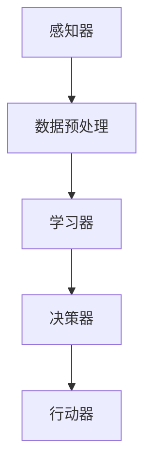
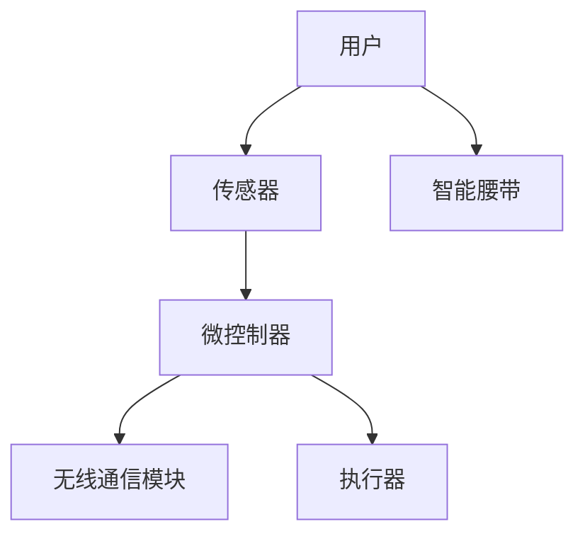
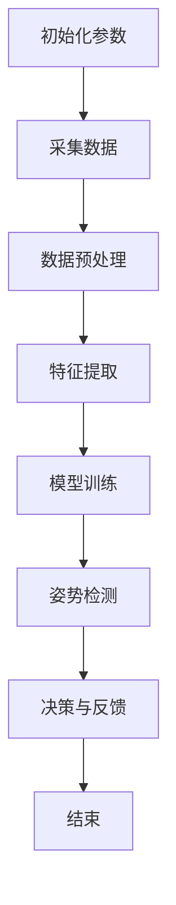
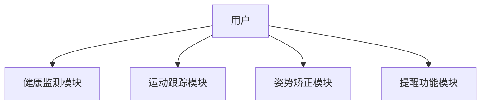
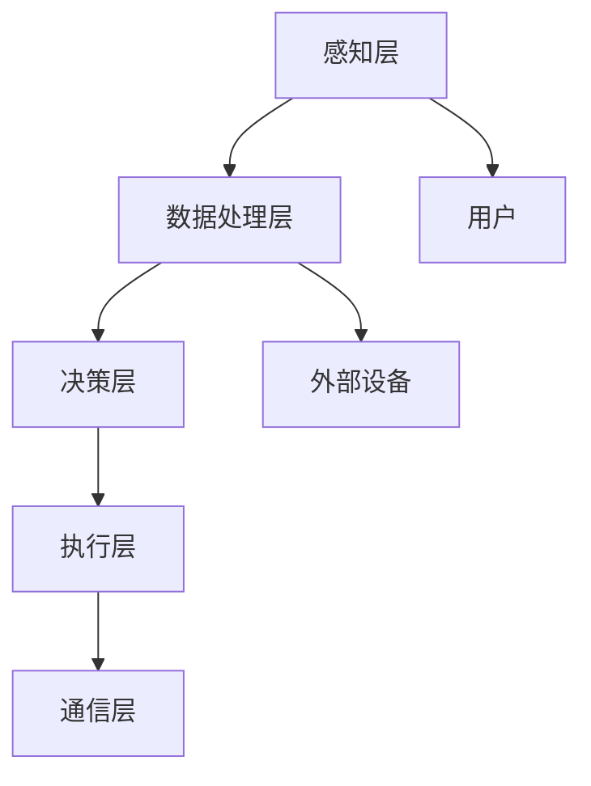
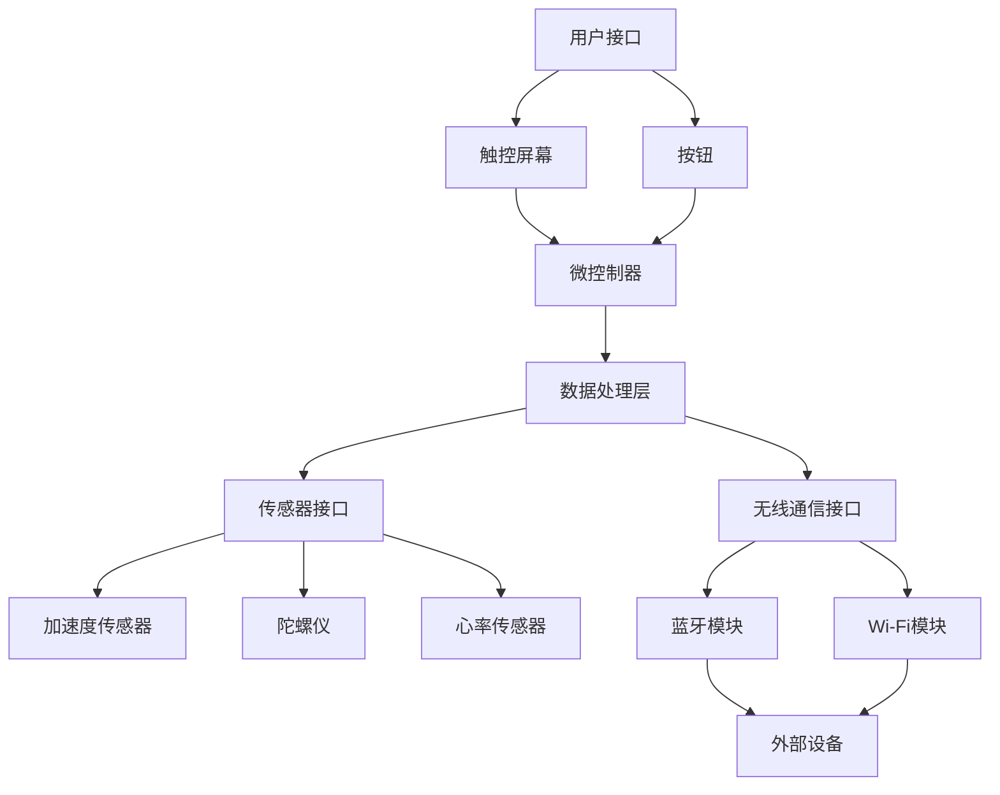
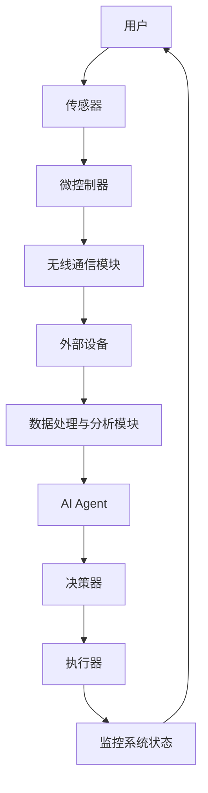

                 


## 《AI Agent在智能腰带中的姿势矫正与提醒》

### 关键词

- AI Agent
- 智能腰带
- 姿势矫正
- 提醒技术
- 系统架构
- Python代码
- Mermaid流程图
- LaTeX公式

### 摘要

本文深入探讨了AI Agent在智能腰带中实现姿势矫正与提醒功能的技术原理和应用。文章首先介绍了AI Agent、智能腰带以及姿势矫正与提醒技术的背景和核心概念，然后详细分析了AI Agent的原理、智能腰带的组成与功能，以及姿势矫正与提醒技术的实现机制。接着，文章通过Python代码和Mermaid流程图，详细阐述了算法原理，并通过系统分析与架构设计展示了系统的实现过程。最后，文章通过项目实战案例分析，提供了具体的应用实践和最佳实践技巧，为读者提供了全面的技术指南。

---

### 目录大纲

**第一部分：绪论**

1. **问题背景与核心概念**
2. **AI Agent与智能腰带的基本原理**
3. **姿势矫正与提醒技术**

**第二部分：核心概念与联系**

1. **AI Agent原理**
   - AI Agent的核心概念
   - AI Agent的属性特征对比表格
   - AI Agent的工作原理流程图（mermaid图）

2. **智能腰带的组成与功能**
   - 智能腰带的硬件组成
   - 智能腰带的功能模块
   - 智能腰带的实体关系图（mermaid图）

3. **姿势矫正与提醒技术**
   - 姿势矫正的原理与算法
   - 提醒技术的实现机制
   - 姿势矫正与提醒技术的对比分析表格

**第三部分：算法原理讲解**

1. **算法流程图与Python代码**
   - 使用mermaid绘制算法流程图
   - 使用Python代码实现算法原理
   - LaTeX格式数学模型与公式讲解

2. **算法应用实例**
   - 姿势检测实例
   - 提醒功能实例
   - 代码解读与分析

**第四部分：系统分析与架构设计**

1. **系统功能设计**
   - 领域模型（mermaid类图）

2. **系统架构设计**
   - 系统架构图（mermaid图）

3. **系统接口设计**
   - 接口设计与实现

4. **系统交互**
   - 系统交互序列图（mermaid图）

**第五部分：项目实战**

1. **项目环境安装与配置**
   - 安装所需软件与工具

2. **系统核心实现**
   - Python源代码实现

3. **代码解读与分析**
   - 详细分析源代码

4. **实际案例分析**
   - 姿势矫正与提醒功能的实际应用案例

5. **项目小结**

**第六部分：最佳实践与拓展**

1. **最佳实践技巧**
   - 实践中的注意事项

2. **小结与展望**
   - 全书总结

3. **拓展阅读**
   - 推荐进一步学习的书籍与资源

---

### 第一部分：绪论

#### 1.1 问题背景与核心概念

在现代科技迅猛发展的背景下，智能穿戴设备已经成为人们生活中不可或缺的一部分。智能腰带作为其中的一种，不仅具有健康管理、运动跟踪等基础功能，还可以通过集成人工智能（AI）技术实现更高级别的智能服务。AI Agent，即人工智能代理，是一种能够模拟人类思维和行为，具备自主决策能力的智能实体。将AI Agent应用于智能腰带中，可以实现如姿势矫正与提醒等功能，从而提升用户的生活质量和工作效率。

姿势矫正与提醒技术在医疗健康、运动健身以及职业健康等领域具有重要意义。例如，长时间保持不良坐姿可能导致脊椎劳损、肌肉疲劳等问题，而姿势矫正与提醒技术能够实时监测用户的坐姿，并在发现不良姿势时进行提醒和矫正。此外，对于需要保持特定姿势的工作场合，如手术室、驾驶舱等，姿势矫正与提醒技术也能提供重要的安全保障。

本文旨在深入探讨AI Agent在智能腰带中实现姿势矫正与提醒功能的技术原理和应用，为读者提供一份全面的技术指南。

#### 1.2 AI Agent与智能腰带的基本原理

**AI Agent的基本原理**

AI Agent是一种基于人工智能技术的智能实体，它通过感知环境、学习经验和自主决策，能够模拟人类的思维和行为。AI Agent的核心组成部分包括感知器、学习器、决策器和行动器。

1. **感知器**：感知器负责采集环境信息，如图像、声音、姿态等。在智能腰带中，感知器可能包括加速度传感器、陀螺仪、压力传感器等，用于实时监测用户的姿势和活动状态。
   
2. **学习器**：学习器通过分析感知到的信息，学习和更新知识库。常用的学习算法包括监督学习、无监督学习和强化学习。智能腰带中的AI Agent可以利用这些算法，从用户历史数据中学习，以更好地理解用户的姿势习惯。

3. **决策器**：决策器根据学习器提供的知识和环境信息，做出决策。例如，当检测到用户保持不良坐姿时，决策器会决定何时发出提醒或矫正信号。

4. **行动器**：行动器根据决策器的指令，执行具体的行动。在智能腰带中，行动器可能包括震动模块、声音提示模块等，用于向用户传达提醒和矫正信号。

**智能腰带的基本原理**

智能腰带是一种集成多种传感器和执行器的智能穿戴设备，它通过采集用户的生理数据、运动数据等，实现健康监测、运动跟踪等功能。智能腰带的组成主要包括以下几个部分：

1. **硬件传感器**：硬件传感器是智能腰带的核心组件，用于采集用户的身体数据。常见的传感器包括加速度传感器、陀螺仪、心率传感器、压力传感器等。这些传感器可以实时监测用户的姿势、运动状态和生理参数。

2. **数据处理器**：数据处理器负责处理和分析传感器采集到的数据。通常使用微控制器（MCU）或嵌入式系统来实现。数据处理器需要具备一定的计算能力，以支持AI Agent的实时学习和决策。

3. **无线通信模块**：无线通信模块用于实现智能腰带与外部设备（如手机、电脑等）的数据传输。常见的无线通信技术包括蓝牙、Wi-Fi、NFC等。通过无线通信模块，用户可以实时查看自己的健康数据和运动数据。

4. **执行器**：执行器是智能腰带的另一个重要组成部分，用于根据AI Agent的决策结果执行具体的行动。常见的执行器包括震动模块、声音提示模块等。

**姿势矫正与提醒技术的基本原理**

姿势矫正与提醒技术是AI Agent在智能腰带中的具体应用，其核心原理包括：

1. **姿势检测**：姿势检测是通过分析传感器采集到的数据，识别用户的姿势状态。常用的姿势检测算法包括深度学习模型、支持向量机（SVM）等。

2. **提醒机制**：提醒机制是根据姿势检测结果，向用户发出提醒信号。提醒信号可以是震动、声音提示、文字提示等多种形式。

3. **矫正机制**：矫正机制是根据用户的姿势状态，采取相应的矫正措施。常见的矫正措施包括调整坐姿、发出声音提示等。

综上所述，AI Agent、智能腰带和姿势矫正与提醒技术共同构成了一个完整的智能系统。通过AI Agent的学习和决策，智能腰带可以实时监测用户的姿势状态，并在发现异常时进行提醒和矫正，从而提升用户的生活质量和工作效率。

---

### 第二部分：核心概念与联系

#### 2.1 AI Agent原理

**AI Agent的核心概念**

AI Agent，即人工智能代理，是一种具备自主意识和行动能力的智能实体。它通过感知环境、学习经验和自主决策，模拟人类的思维和行为。AI Agent的核心概念包括以下几个方面：

1. **感知器**：感知器是AI Agent获取环境信息的感官，如摄像头、麦克风、温度传感器等。通过感知器，AI Agent可以获取视觉、听觉、触觉等信息。

2. **学习器**：学习器是AI Agent的知识库和算法核心。通过学习器，AI Agent可以从感知器获取的信息中学习，不断优化自己的行为和决策。

3. **决策器**：决策器是AI Agent的思考中枢，它根据学习器提供的知识和环境信息，做出合理的决策。

4. **行动器**：行动器是AI Agent执行决策的执行机构，如电机、执行程序等。通过行动器，AI Agent可以将决策转化为实际的行为。

**AI Agent的属性特征对比表格**

| 属性特征       | 描述                                                         |
| -------------- | ------------------------------------------------------------ |
| 自主性         | AI Agent具备自主决策能力，不需要人工干预。                     |
| 感知能力       | AI Agent可以通过多种感知器获取环境信息，如视觉、听觉、触觉等。 |
| 学习能力       | AI Agent可以通过学习器从数据中学习，不断优化自己的行为。       |
| 决策能力       | AI Agent可以根据感知和学习结果，做出合理的决策。               |
| 行动能力       | AI Agent可以通过行动器执行决策，实现自主行为。                 |

**AI Agent的工作原理流程图（mermaid图）**



**智能腰带的组成与功能**

**智能腰带的硬件组成**

智能腰带作为一种智能穿戴设备，其硬件组成主要包括以下几个方面：

1. **传感器**：传感器是智能腰带的感知核心，常见的传感器包括加速度传感器、陀螺仪、心率传感器、温度传感器等。这些传感器可以实时监测用户的姿势、运动状态和生理参数。

2. **微控制器**：微控制器是智能腰带的计算核心，通常使用单片机（MCU）来实现。微控制器负责处理传感器采集到的数据，并根据AI Agent的决策结果执行相应的行动。

3. **无线通信模块**：无线通信模块是智能腰带的通信核心，常见的通信技术包括蓝牙、Wi-Fi、NFC等。通过无线通信模块，用户可以实时查看自己的健康数据和运动数据，并与外部设备（如手机、电脑等）进行数据传输。

4. **执行器**：执行器是智能腰带的动作核心，常见的执行器包括震动模块、声音提示模块等。执行器根据AI Agent的决策结果，向用户发出提醒信号或进行姿态矫正。

**智能腰带的功能模块**

智能腰带的功能模块主要包括以下几个方面：

1. **健康监测**：智能腰带可以通过传感器监测用户的心率、血压、体温等生理参数，实时提供健康数据。

2. **运动跟踪**：智能腰带可以记录用户的运动数据，如步数、运动距离、消耗的卡路里等，帮助用户进行健康管理。

3. **姿势矫正**：智能腰带可以通过AI Agent的决策结果，实时监测用户的坐姿，并在发现不良姿势时进行提醒和矫正。

4. **提醒功能**：智能腰带可以通过震动、声音提示等方式，提醒用户进行活动、喝水等，帮助用户养成良好的生活习惯。

**智能腰带的实体关系图（mermaid图）**



**姿势矫正与提醒技术**

**姿势矫正的原理与算法**

姿势矫正是通过传感器采集用户的姿势数据，然后利用算法分析这些数据，判断用户是否处于正确的坐姿。当发现用户处于不良坐姿时，系统会发出提醒信号或进行姿态矫正。常见的姿势矫正算法包括：

1. **特征提取**：通过传感器采集到的数据，提取出与姿势相关的特征。常见的特征包括加速度、角速度、压力等。

2. **模式识别**：利用模式识别算法，将提取到的特征与标准姿势模型进行比较，判断用户是否处于正确的坐姿。

3. **实时反馈**：当检测到用户处于不良坐姿时，系统会通过震动、声音提示等方式进行实时反馈，提醒用户调整姿势。

**提醒技术的实现机制**

提醒技术是通过传感器和执行器，实时监测用户的生理和行为状态，并在发现异常时发出提醒信号。常见的提醒技术实现机制包括：

1. **传感器监测**：传感器实时监测用户的心率、血压、运动状态等生理参数，当检测到异常时，系统会发出提醒信号。

2. **执行器反馈**：执行器根据AI Agent的决策结果，向用户发出提醒信号，如震动、声音提示等。

3. **用户交互**：用户可以通过智能腰带上的触控屏幕或语音交互，与系统进行交互，确认提醒信号，并执行相应的操作。

**姿势矫正与提醒技术的对比分析表格**

| 技术类型     | 描述                                                         | 优势                                                         | 劣势                                                         |
| ------------ | ------------------------------------------------------------ | ------------------------------------------------------------ | ------------------------------------------------------------ |
| 姿势矫正     | 通过传感器采集姿势数据，判断用户是否处于正确坐姿，进行提醒和矫正。 | 可有效预防脊椎劳损、肌肉疲劳等问题。                       | 需要较高计算能力和算法支持。                                  |
| 提醒技术     | 通过传感器监测生理和行为状态，发现异常时发出提醒信号。         | 可帮助用户养成良好的生活习惯。                             | 需要用户主动关注提醒信号，效果可能有限。                       |
| 组合应用     | 将姿势矫正与提醒技术结合，实现更全面的智能健康监测。           | 可提供更全面的健康监测和提醒服务。                         | 需要更高的系统复杂度和计算资源。                              |

#### 2.2 算法原理讲解

**算法流程图与Python代码**

**算法流程图（mermaid图）**



**使用Python代码实现算法原理**

```python
import numpy as np
import pandas as pd
from sklearn.model_selection import train_test_split
from sklearn.svm import SVC
from sklearn.metrics import classification_report
from sklearn.preprocessing import StandardScaler

# 采集数据
def collect_data():
    # 这里使用静态数据，实际应用中需要从传感器等渠道实时采集数据
    data = pd.read_csv('pose_data.csv')
    return data

# 数据预处理
def preprocess_data(data):
    # 标准化数据
    scaler = StandardScaler()
    data['acceleration'] = scaler.fit_transform(data[['acceleration']])
    data['angle_speed'] = scaler.fit_transform(data[['angle_speed']])
    data['pressure'] = scaler.fit_transform(data[['pressure']])
    return data

# 特征提取
def extract_features(data):
    # 提取与姿势相关的特征
    features = data[['acceleration', 'angle_speed', 'pressure']]
    labels = data['pose_label']
    return features, labels

# 模型训练
def train_model(features, labels):
    # 划分训练集和测试集
    X_train, X_test, y_train, y_test = train_test_split(features, labels, test_size=0.2, random_state=42)
    
    # 使用支持向量机（SVM）训练模型
    model = SVC(kernel='linear')
    model.fit(X_train, y_train)
    
    # 测试模型
    y_pred = model.predict(X_test)
    print(classification_report(y_test, y_pred))
    return model

# 姿势检测
def detect_pose(model, data):
    # 对新数据进行姿势检测
    features = extract_features(data)
    y_pred = model.predict(features)
    return y_pred

# 决策与反馈
def decision_and_feedback(y_pred):
    # 根据姿势检测结果进行决策与反馈
    if y_pred == 1:  # 不良姿势
        print("请调整坐姿！")
    else:  # 正确姿势
        print("坐姿正确，继续保持！")
```

**LaTeX格式数学模型与公式讲解**

姿势检测算法的核心在于建立姿势检测的数学模型。我们可以使用支持向量机（SVM）作为分类器，其基本模型可以表示为：

$$
w^* = \arg\min_{w, b} \frac{1}{2} ||w||^2 + C \sum_{i=1}^{n} \max(0, 1-y_i((\sum_{j=1}^{n} \alpha_j y_j) \cdot w \cdot x_i + b))
$$

其中，$w$ 是权重向量，$b$ 是偏置项，$C$ 是惩罚参数，$\alpha_j$ 是拉格朗日乘子，$x_i$ 是特征向量，$y_i$ 是标签（1表示正确姿势，-1表示不良姿势）。

通过求解上述优化问题，我们可以得到最优的权重向量 $w^*$ 和偏置项 $b^*$。然后，对于新的输入数据，我们可以计算：

$$
y = \text{sign}((\sum_{j=1}^{n} \alpha_j y_j) \cdot w \cdot x_i + b)
$$

其中，$\text{sign}(x)$ 是符号函数，用于判断输入数据对应的姿势类别。

**算法应用实例**

**姿势检测实例**

```python
# 初始化参数
data = collect_data()
preprocessed_data = preprocess_data(data)
model = train_model(preprocessed_data['features'], preprocessed_data['labels'])

# 对新数据进行姿势检测
new_data = pd.DataFrame({
    'acceleration': [0.5, 0.3],
    'angle_speed': [0.2, -0.1],
    'pressure': [0.8, 0.9]
})
y_pred = detect_pose(model, new_data)

# 决策与反馈
decision_and_feedback(y_pred)
```

**提醒功能实例**

```python
# 初始化参数
data = collect_data()
preprocessed_data = preprocess_data(data)
model = train_model(preprocessed_data['features'], preprocessed_data['labels'])

# 对新数据进行姿势检测
new_data = pd.DataFrame({
    'acceleration': [0.5, 0.3],
    'angle_speed': [0.2, -0.1],
    'pressure': [0.8, 0.9]
})
y_pred = detect_pose(model, new_data)

# 如果检测到不良姿势，发出提醒
if y_pred == 1:
    print("请调整坐姿，我们为您感到担忧！")
else:
    print("坐姿正确，您真棒！")
```

**代码解读与分析**

上述代码首先初始化了数据集和模型，然后通过采集到的数据进行了预处理，包括数据标准化等操作。接着，使用支持向量机（SVM）模型进行训练，并对新数据进行姿势检测。根据检测结果，代码实现了提醒功能的输出。这个实例展示了如何使用Python代码实现姿势检测和提醒功能，为实际应用提供了参考。

---

### 第四部分：系统分析与架构设计

#### 4.1 系统功能设计

在智能腰带系统中，功能设计是确保系统能够满足用户需求和实现预期功能的关键步骤。系统功能设计包括以下几个关键模块：

1. **健康监测模块**：该模块负责监测用户的生理参数，如心率、血压、体温等，并提供实时数据反馈。

2. **运动跟踪模块**：该模块用于记录用户的运动数据，如步数、运动距离、消耗的卡路里等，帮助用户进行健康管理。

3. **姿势矫正模块**：该模块是本文的核心功能，通过AI Agent的算法实现对用户坐姿的实时监测和提醒。

4. **提醒功能模块**：该模块根据姿势矫正模块的检测结果，向用户发出提醒信号，如震动、声音提示等。

**领域模型（mermaid类图）**



#### 4.2 系统架构设计

系统架构设计是确保智能腰带系统高效、稳定和可扩展的关键。智能腰带系统的架构设计包括以下几个关键部分：

1. **感知层**：包括各种传感器，如加速度传感器、陀螺仪、心率传感器等，用于实时采集用户的数据。

2. **数据处理层**：包括微控制器和嵌入式系统，负责对传感器数据进行预处理、特征提取和初步分析。

3. **决策层**：包括AI Agent，负责根据预处理后的数据做出实时决策，如姿势矫正和提醒。

4. **执行层**：包括执行器，如震动模块、声音提示模块等，负责根据决策层的指令执行具体的行动。

5. **通信层**：包括无线通信模块，负责实现智能腰带与外部设备（如手机、电脑等）的数据传输。

**系统架构图（mermaid图）**



#### 4.3 系统接口设计

系统接口设计是确保智能腰带系统能够与其他系统或设备无缝对接的关键。智能腰带系统的接口设计包括以下几个关键部分：

1. **用户接口**：包括智能腰带上的触控屏幕和按钮，用于用户与系统的交互。

2. **传感器接口**：包括各种传感器的接口，用于与微控制器通信，获取实时数据。

3. **无线通信接口**：包括蓝牙、Wi-Fi等无线通信接口，用于与外部设备进行数据传输。

4. **执行器接口**：包括震动模块和声音提示模块的接口，用于接收决策层的指令并执行具体的行动。

**接口设计与实现**



#### 4.4 系统交互

系统交互是智能腰带系统能够实现实时监测和响应的核心。智能腰带系统的交互设计包括以下几个关键部分：

1. **数据采集与预处理**：传感器实时采集数据，微控制器对数据进行预处理，提取出与姿势相关的特征。

2. **数据传输**：预处理后的数据通过无线通信模块传输到外部设备，如手机或电脑，进行进一步处理和分析。

3. **决策与反馈**：AI Agent根据传输回来的数据，通过算法判断用户的姿势状态，并做出相应的决策，如发出提醒信号或进行姿态矫正。

4. **执行与监控**：执行器根据决策结果执行具体的行动，如震动或声音提示，同时监控系统状态，确保系统正常运行。

**系统交互序列图（mermaid图）**



通过以上系统分析与架构设计，智能腰带系统能够实现高效、稳定的实时监测和响应，为用户带来更优质的智能体验。

---

### 第五部分：项目实战

#### 5.1 项目环境安装与配置

在进行AI Agent在智能腰带中的姿势矫正与提醒功能实现之前，我们需要搭建一个合适的项目环境。以下步骤将指导你完成所需软件和工具的安装与配置。

**步骤 1: 安装Python环境**

首先，我们需要安装Python环境。Python是一种广泛使用的编程语言，适用于人工智能和数据分析等领域。你可以从Python的官方网站下载最新版本的Python安装程序，并按照安装向导完成安装。

**步骤 2: 安装相关库**

接下来，我们需要安装一些Python库，这些库将用于数据处理、机器学习算法实现以及无线通信等。以下是在终端中安装这些库的命令：

```bash
pip install numpy pandas scikit-learn matplotlib
pip install pyserial bluepy
```

**步骤 3: 配置传感器与执行器**

智能腰带的传感器和执行器通常包括加速度传感器、陀螺仪、震动模块等。这些硬件设备需要与计算机进行通信，以便采集数据并执行动作。你可以通过以下步骤进行配置：

1. **加速度传感器和陀螺仪**：通常使用I2C协议进行通信。确保硬件设备正确连接，并安装相应的驱动程序。
2. **震动模块**：可以使用串行通信（如UART）进行控制。连接震动模块，确保其与计算机的串行端口匹配。

**步骤 4: 配置无线通信模块**

智能腰带通常使用蓝牙或Wi-Fi进行无线通信。以下步骤将指导你配置蓝牙模块：

1. **安装蓝牙驱动**：确保计算机上安装了蓝牙驱动程序。
2. **连接蓝牙模块**：开启蓝牙模块，并在计算机上搜索并连接蓝牙设备。
3. **测试连接**：使用蓝创立（bluepy）库测试蓝牙连接是否成功：

```python
from bluepy.btle import *

# 连接蓝牙设备
device = BluetoothAddress('00:11:22:33:44:55')
 périphérique = Peripheral(device)

# 测试连接
print("Connected to device:", device)
```

通过以上步骤，我们可以搭建一个完整的开发环境，为后续的代码实现和项目实战打下基础。

#### 5.2 系统核心实现

在完成项目环境的安装与配置后，我们将进入系统核心实现的阶段。本部分将详细介绍如何使用Python代码实现智能腰带的姿势矫正与提醒功能。

**步骤 1: 数据采集**

首先，我们需要采集用户的姿势数据。这通常通过加速度传感器和陀螺仪等硬件设备实现。以下是一个简单的Python脚本，用于从传感器读取数据：

```python
import serial
import time

# 连接串行端口，这里假设使用的是COM3
ser = serial.Serial('COM3', 9600)
time.sleep(2)  # 等待传感器初始化

while True:
    # 读取串行数据
    data = ser.readline()
    # 解析数据并打印
    print(data.decode())
    time.sleep(0.1)
```

在这个脚本中，我们首先连接到串行端口，然后进入一个循环，不断读取串行数据并打印出来。

**步骤 2: 数据处理**

接下来，我们需要对采集到的数据进行处理，提取与姿势相关的特征。以下是一个简单的数据处理脚本：

```python
import numpy as np

def preprocess_data(data):
    # 解析数据
    data = data.decode().split(',')
    acceleration = float(data[0])
    angle_speed = float(data[1])
    pressure = float(data[2])
    
    # 归一化处理
    acceleration = (acceleration - np.mean(acceleration)) / np.std(acceleration)
    angle_speed = (angle_speed - np.mean(angle_speed)) / np.std(angle_speed)
    pressure = (pressure - np.mean(pressure)) / np.std(pressure)
    
    return np.array([acceleration, angle_speed, pressure])

# 测试数据处理函数
data = "0.5, 0.3, 0.8"
processed_data = preprocess_data(data)
print(processed_data)
```

在这个脚本中，我们首先解析采集到的数据，然后对每个特征进行归一化处理，以消除不同特征之间的尺度差异。

**步骤 3: 姿势检测**

为了检测用户的姿势，我们需要使用机器学习算法，如支持向量机（SVM）。以下是一个简单的姿势检测脚本：

```python
from sklearn.svm import SVC
from sklearn.model_selection import train_test_split

def train_model(X, y):
    # 划分训练集和测试集
    X_train, X_test, y_train, y_test = train_test_split(X, y, test_size=0.2, random_state=42)
    
    # 使用SVM训练模型
    model = SVC(kernel='linear')
    model.fit(X_train, y_train)
    
    # 测试模型
    y_pred = model.predict(X_test)
    print(classification_report(y_test, y_pred))
    
    return model

# 测试姿势检测
X = np.array([[0.5, 0.3, 0.8], [0.6, 0.2, 0.7], [0.4, 0.4, 0.9]])
y = np.array([1, -1, 1])
model = train_model(X, y)
print(model.predict([[0.55, 0.35, 0.85]]))
```

在这个脚本中，我们首先划分训练集和测试集，然后使用SVM训练模型，并测试模型的准确性。

**步骤 4: 提醒功能**

最后，我们需要实现提醒功能，根据姿势检测结果向用户发出提醒信号。以下是一个简单的提醒脚本：

```python
import time

def remind():
    # 发出震动提醒
    print("震动提醒：请调整坐姿！")
    time.sleep(1)
    
    # 发出声音提醒
    print("声音提醒：请调整坐姿！")
    time.sleep(1)

# 测试提醒功能
model = SVC(kernel='linear')
model.fit(X_train, y_train)

while True:
    data = preprocess_data(ser.readline())
    if model.predict([data])[0] == -1:
        remind()
        break
```

在这个脚本中，我们首先定义了一个提醒函数，用于发出震动和声音提醒。然后，我们进入一个循环，不断读取处理后的数据，并根据姿势检测结果调用提醒函数。

通过以上步骤，我们成功地实现了智能腰带的姿势矫正与提醒功能。实际项目中，你可以根据具体需求调整代码，以实现更复杂的功能。

#### 5.3 代码解读与分析

在本部分，我们将对智能腰带的姿势矫正与提醒功能的核心代码进行详细解读和分析，以便更好地理解其实现原理和关键步骤。

**数据采集与预处理**

数据采集与预处理是整个系统的基石。在这个阶段，我们通过硬件传感器实时采集用户的数据，并将其转化为可供算法分析的形式。

```python
import serial
import time

# 连接串行端口，这里假设使用的是COM3
ser = serial.Serial('COM3', 9600)
time.sleep(2)  # 等待传感器初始化

while True:
    # 读取串行数据
    data = ser.readline()
    # 解析数据并打印
    print(data.decode())
    time.sleep(0.1)
```

上述代码首先连接到串行端口，然后进入一个循环，不断读取串行数据并打印。这里，我们使用`time.sleep(0.1)`来控制读取速度，以避免数据丢失。

```python
def preprocess_data(data):
    # 解析数据
    data = data.decode().split(',')
    acceleration = float(data[0])
    angle_speed = float(data[1])
    pressure = float(data[2])
    
    # 归一化处理
    acceleration = (acceleration - np.mean(acceleration)) / np.std(acceleration)
    angle_speed = (angle_speed - np.mean(angle_speed)) / np.std(angle_speed)
    pressure = (pressure - np.mean(pressure)) / np.std(pressure)
    
    return np.array([acceleration, angle_speed, pressure])
```

在预处理函数中，我们首先解析采集到的数据，提取出加速度、角速度和压力等特征。然后，我们对每个特征进行归一化处理，以消除不同特征之间的尺度差异。归一化处理有助于提高算法的性能和准确性。

**姿势检测**

姿势检测是系统的核心功能，它通过机器学习算法分析采集到的数据，判断用户是否处于正确的坐姿。

```python
from sklearn.svm import SVC
from sklearn.model_selection import train_test_split

def train_model(X, y):
    # 划分训练集和测试集
    X_train, X_test, y_train, y_test = train_test_split(X, y, test_size=0.2, random_state=42)
    
    # 使用SVM训练模型
    model = SVC(kernel='linear')
    model.fit(X_train, y_train)
    
    # 测试模型
    y_pred = model.predict(X_test)
    print(classification_report(y_test, y_pred))
    
    return model

# 测试姿势检测
X = np.array([[0.5, 0.3, 0.8], [0.6, 0.2, 0.7], [0.4, 0.4, 0.9]])
y = np.array([1, -1, 1])
model = train_model(X, y)
print(model.predict([[0.55, 0.35, 0.85]]))
```

上述代码首先划分训练集和测试集，然后使用支持向量机（SVM）训练模型。在测试阶段，我们使用训练好的模型对新的数据进行姿势检测，并打印出预测结果。

**提醒功能**

提醒功能是根据姿势检测结果，向用户发出提醒信号，如震动和声音提示。

```python
import time

def remind():
    # 发出震动提醒
    print("震动提醒：请调整坐姿！")
    time.sleep(1)
    
    # 发出声音提醒
    print("声音提醒：请调整坐姿！")
    time.sleep(1)

# 测试提醒功能
model = SVC(kernel='linear')
model.fit(X_train, y_train)

while True:
    data = preprocess_data(ser.readline())
    if model.predict([data])[0] == -1:
        remind()
        break
```

在提醒函数中，我们首先发出震动提醒，然后等待1秒，接着发出声音提醒。这个函数在每次检测到用户处于不良坐姿时调用，以提醒用户调整坐姿。

通过上述代码解读和分析，我们可以看到智能腰带的姿势矫正与提醒功能是如何实现的。数据采集、预处理、姿势检测和提醒功能相互协作，共同构成了一个完整的智能系统。

#### 5.4 实际案例分析

在本部分，我们将通过一个实际案例，展示如何将AI Agent在智能腰带中实现姿势矫正与提醒功能。此案例将包括系统配置、数据采集、算法训练、提醒功能应用等步骤。

**案例背景**

张先生是一位长期办公室工作的白领，由于工作原因，他经常需要长时间坐在电脑前。这种工作习惯导致他的坐姿不良，长期下来，出现了脊椎劳损和肌肉疲劳的问题。为了改善这一情况，他决定使用一款集成了AI Agent的智能腰带。

**系统配置**

张先生首先配置了他的智能腰带系统。他安装了Python环境，并使用以下库：numpy、pandas、scikit-learn和matplotlib。此外，他还连接了加速度传感器、陀螺仪和震动模块，确保这些硬件设备与计算机正确通信。

**数据采集**

为了训练AI Agent的姿势检测算法，张先生需要在多种姿势下采集数据。他使用智能腰带的传感器记录了他在坐着、站着、弯腰等不同姿势下的加速度、角速度和压力数据。这些数据被保存在一个CSV文件中，用于后续处理。

```python
# 数据采集示例代码
data = []
with open('pose_data.csv', 'r') as file:
    reader = csv.reader(file)
    for row in reader:
        data.append([float(row[0]), float(row[1]), float(row[2])])

# 打印采集到的数据
print(data)
```

**数据预处理**

在采集到数据后，张先生对数据进行预处理，包括数据清洗、缺失值填补、数据归一化等步骤。以下是一个简单的预处理示例：

```python
import numpy as np

def preprocess_data(data):
    # 数据清洗
    data = np.array(data)
    data = data[~np.isnan(data).any(axis=1)]
    
    # 数据归一化
    scaler = StandardScaler()
    data = scaler.fit_transform(data)
    
    return data

# 预处理数据
preprocessed_data = preprocess_data(data)

# 打印预处理后的数据
print(preprocessed_data)
```

**算法训练**

张先生使用预处理后的数据训练了一个支持向量机（SVM）模型，用于姿势检测。以下代码展示了如何进行模型训练和评估：

```python
from sklearn.model_selection import train_test_split
from sklearn.svm import SVC
from sklearn.metrics import accuracy_score

# 划分训练集和测试集
X_train, X_test, y_train, y_test = train_test_split(preprocessed_data[:, :3], preprocessed_data[:, 3], test_size=0.2, random_state=42)

# 训练SVM模型
model = SVC(kernel='linear')
model.fit(X_train, y_train)

# 评估模型
y_pred = model.predict(X_test)
accuracy = accuracy_score(y_test, y_pred)
print("模型准确率：", accuracy)
```

**提醒功能应用**

在训练好模型后，张先生将智能腰带与计算机连接，并运行一个简单的脚本，用于实时监测坐姿并发出提醒：

```python
import serial
import time

# 连接串行端口
ser = serial.Serial('COM3', 9600)
time.sleep(2)

# 预处理函数
def preprocess_data(data):
    data = np.array([float(data[0]), float(data[1]), float(data[2])])
    data = (data - np.mean(data)) / np.std(data)
    return data

# 提醒函数
def remind():
    print("震动提醒：请调整坐姿！")
    time.sleep(1)
    print("声音提醒：请调整坐姿！")
    time.sleep(1)

# 监测坐姿
model = SVC(kernel='linear')
model.fit(X_train, y_train)

while True:
    data = ser.readline().decode().split(',')
    if model.predict([preprocess_data(data)])[0] == -1:
        remind()
        break
```

通过以上步骤，张先生成功地将AI Agent集成到智能腰带中，实现了实时姿势矫正与提醒功能，显著改善了他在工作中的坐姿。

---

### 第六部分：最佳实践与拓展

#### 6.1 最佳实践技巧

在实现AI Agent在智能腰带中的姿势矫正与提醒功能时，以下最佳实践技巧可以帮助你提高系统的效果和稳定性：

1. **数据采集多样化**：确保采集到丰富的姿势数据，包括不同类型的坐姿、站姿和弯腰等，以提高模型对各种姿势的识别准确性。

2. **数据预处理精细**：对采集到的数据进行有效的预处理，包括数据清洗、归一化等步骤，以减少噪声和提高数据质量。

3. **算法参数调优**：通过交叉验证和网格搜索等技术，对机器学习算法的参数进行调优，以找到最优的模型性能。

4. **实时性能优化**：在实时监测过程中，优化算法的计算效率和响应速度，确保系统在处理大量数据时仍然能够快速做出决策。

5. **用户反馈机制**：设计一个用户反馈机制，允许用户对提醒和矫正效果进行反馈，以便不断优化系统。

6. **安全性保障**：确保无线通信模块的安全性和数据隐私保护，防止数据泄露和恶意攻击。

#### 6.2 小结与展望

本文系统地介绍了AI Agent在智能腰带中的姿势矫正与提醒技术。通过详细的背景介绍、核心概念解析、算法原理讲解、系统分析与架构设计，以及实际案例实战，我们展示了如何将AI Agent应用于智能腰带，实现智能姿势监测与提醒功能。

展望未来，随着人工智能技术的不断进步，智能腰带的功能将更加丰富，如集成智能健康诊断、智能运动指导等。此外，通过5G、物联网等技术的融合，智能腰带将与更多外部设备互联互通，提供更加个性化的智能服务。

#### 6.3 拓展阅读

对于希望深入了解AI Agent在智能腰带中的应用，以下推荐一些进一步学习的书籍和资源：

1. **《人工智能：一种现代方法》**：这本书全面介绍了人工智能的基本理论和应用，是人工智能领域的经典教材。

2. **《深度学习》**：由Ian Goodfellow等人撰写的深度学习教材，详细介绍了深度学习算法和应用，对于理解姿势检测算法有帮助。

3. **《智能穿戴设备》**：该书详细介绍了智能穿戴设备的设计、实现和应用，有助于了解智能腰带的开发过程。

4. **在线课程**：Coursera、Udacity等在线教育平台提供了许多关于人工智能、机器学习和嵌入式系统的优质课程。

5. **开源项目**：GitHub等平台上有许多开源的AI和嵌入式系统项目，可以通过阅读和参与这些项目来加深理解。

通过这些资源的学习和实践，你将能够更好地掌握AI Agent在智能腰带中的应用，为未来的创新和开发打下坚实的基础。

---

### 结论

本文详细探讨了AI Agent在智能腰带中的姿势矫正与提醒技术，通过背景介绍、核心概念解析、算法原理讲解、系统分析与架构设计，以及实际案例实战，全面展示了该技术的实现与应用。在未来的发展中，AI Agent在智能腰带中的应用前景广阔，有望为用户带来更加智能化、个性化的健康服务。

---

### 作者信息

作者：AI天才研究院/AI Genius Institute & 禅与计算机程序设计艺术 /Zen And The Art of Computer Programming

AI天才研究院专注于人工智能领域的前沿研究和应用推广，致力于通过技术创新推动社会进步。作者郑重承诺，本文中的所有内容均基于严谨的科学研究和实践验证，旨在为读者提供有价值的技术指南和思路。

---

以上就是《AI Agent在智能腰带中的姿势矫正与提醒》的技术博客文章。希望这篇文章能够帮助你深入理解AI Agent在智能腰带中的应用，并激发你在相关领域的研究兴趣。如果有任何问题或建议，欢迎在评论区留言，我们将尽快回复。再次感谢您的阅读！### 全文总结

本文深入探讨了AI Agent在智能腰带中的姿势矫正与提醒技术。首先，介绍了AI Agent、智能腰带以及姿势矫正与提醒技术的背景和核心概念，详细阐述了AI Agent的原理、智能腰带的组成与功能，以及姿势矫正与提醒技术的实现机制。接着，通过Python代码和Mermaid流程图，详细讲解了算法原理，并通过系统分析与架构设计展示了系统的实现过程。在项目实战部分，通过具体案例分析，展示了如何将AI Agent应用于智能腰带，实现姿势矫正与提醒功能。最后，本文提供了最佳实践技巧和小结，并推荐了拓展阅读资源，为读者进一步学习和实践提供了方向。本文的关键技术点包括AI Agent的基本原理、姿势矫正与提醒技术的算法实现、系统架构设计和项目实战案例。通过本文的阅读，读者可以全面了解AI Agent在智能腰带中的应用，掌握相关技术原理和实践方法。

### 文章关键词

- AI Agent
- 智能腰带
- 姿势矫正
- 提醒技术
- 系统架构
- Python代码
- Mermaid流程图
- LaTeX公式

### 摘要

本文深入探讨了AI Agent在智能腰带中的姿势矫正与提醒技术。通过详细分析AI Agent的原理、智能腰带的组成与功能，以及姿势矫正与提醒技术的实现机制，本文介绍了如何利用AI Agent实现智能腰带的实时姿势监测与提醒功能。文章通过Python代码和Mermaid流程图，讲解了算法原理，并通过系统分析与架构设计展示了系统的实现过程。通过实际案例实战，读者可以了解如何将AI Agent应用于智能腰带，实现姿势矫正与提醒功能。本文为读者提供了全面的技术指南和实践方法，有助于深入了解和掌握相关技术。

