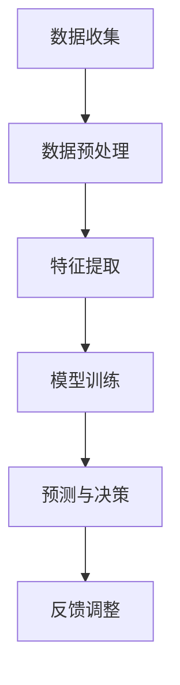
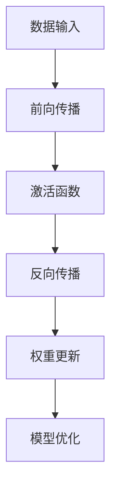
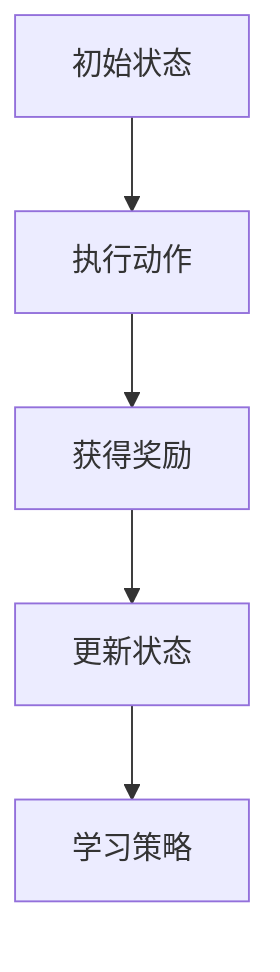
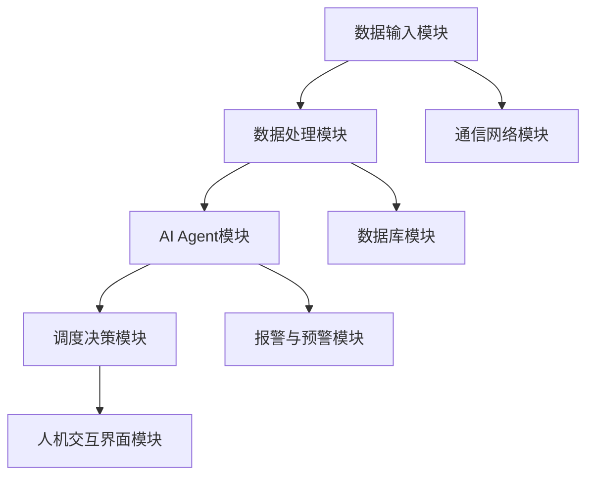

                 

### 引言

随着全球航空业的迅速发展，航空交通流量日益增大，对航空调度系统提出了更高的要求。传统的航空调度系统主要依赖于人工操作员的经验和技能，这不仅效率低下，还容易受到操作员个人因素的限制。随着人工智能（AI）技术的不断进步，特别是AI Agent的发展，智能航空调度系统逐渐成为研究的焦点。AI Agent在智能航空调度系统中扮演着重要角色，通过自动化和智能化的方式，提升航空调度的效率和安全性。

本文将围绕“AI Agent在智能航空调度系统中的角色”这一主题展开，详细探讨AI Agent的定义、特性、分类，智能航空调度系统的组成及其关键要素，AI Agent在系统中的作用和协作模式，常见的算法原理及实现，系统分析与架构设计方案，以及项目实战和最佳实践。文章最后将对全文进行小结，并提出注意事项和建议，以期为相关领域的研究者和从业人员提供有价值的参考。

首先，我们需要明确文章的关键词，这些关键词将帮助读者快速了解文章的核心内容。关键词包括：AI Agent、智能航空调度系统、算法、系统设计、人机协作。接下来，本文的摘要部分将简要介绍文章的核心内容和主题思想，为读者提供初步的阅读指引。

## 关键词

AI Agent、智能航空调度系统、算法、系统设计、人机协作

## 摘要

本文深入探讨了AI Agent在智能航空调度系统中的角色。首先，介绍了AI Agent的定义和特性，以及智能航空调度系统的组成和关键要素。接着，详细分析了AI Agent在系统中的作用和协作模式，包括其在调度决策、飞行安全监控以及航班运行效率提升方面的应用。然后，本文讨论了常见的算法原理，如机器学习、深度学习和强化学习，并通过Python源代码和数学模型进行了详细解释。随后，文章介绍了系统分析与架构设计方案，包括问题场景介绍、系统功能设计、系统架构设计、系统接口设计和系统交互。最后，通过项目实战和最佳实践，展示了AI Agent在智能航空调度系统中的实际应用，并对全文进行了小结。本文旨在为读者提供全面、深入的AI Agent在智能航空调度系统中的应用分析和实践指导。

### 背景

航空交通作为现代社会的关键组成部分，其效率和安全性直接影响到整个社会的运行质量。随着全球经济的快速发展，航空运输需求日益增长，航空交通流量不断增大，尤其是在主要航空枢纽和繁忙航线，航空调度系统面临巨大的压力。传统的航空调度系统主要依赖于人工操作员的经验和技能，这不仅效率低下，还容易受到操作员个人因素的制约。例如，操作员可能因为疲劳、情绪波动或者判断失误导致调度失误，从而影响航班的安全性。

目前，智能航空调度系统已经成为提高航空交通效率和安全性的一大趋势。智能航空调度系统利用先进的计算机技术和人工智能（AI）技术，通过自动化和智能化的方式，优化航班调度过程，提高调度的精度和效率。在此背景下，AI Agent作为一种重要的AI技术，逐渐成为智能航空调度系统中的关键组成部分。

AI Agent，即人工智能代理，是一种能够自主完成特定任务，具有推理、学习、规划和决策能力的智能系统。AI Agent可以模拟人类操作员的部分工作，通过分析大量的历史数据和实时信息，提供科学的调度决策，从而优化航班调度过程。相比于传统的人工调度，AI Agent具有以下优势：

1. **高效率**：AI Agent能够快速处理大量的数据，提供实时的调度决策，大大缩短了航班调度的响应时间。
2. **高精度**：AI Agent基于机器学习和深度学习技术，能够从历史数据中学习到复杂的调度规律，提供更加精确和可靠的调度方案。
3. **灵活性**：AI Agent能够根据实时变化的情况，灵活调整调度策略，应对各种突发情况。
4. **可扩展性**：随着AI技术的不断进步，AI Agent可以不断学习和优化，适应不断变化的需求和环境。

智能航空调度系统的关键要素包括：

1. **传感器和数据处理**：系统需要收集大量的航班数据、气象数据、飞机状态数据等，通过数据预处理和特征提取，为AI Agent提供有效的输入。
2. **AI Agent**：作为智能调度系统的核心，AI Agent需要具备高效的算法和强大的学习能力，能够从海量数据中提取有价值的信息，提供科学的调度决策。
3. **人机交互界面**：系统需要提供友好的人机交互界面，使操作员能够实时监控系统的运行状态，并对AI Agent的决策进行必要的干预和调整。
4. **通信网络**：系统需要建立高效的通信网络，确保AI Agent与各个模块之间的数据交换和协作。

总之，AI Agent在智能航空调度系统中扮演着至关重要的角色，通过自动化和智能化的方式，显著提升了航空调度的效率和安全性，为航空业的发展提供了强有力的技术支持。在接下来的章节中，我们将深入探讨AI Agent的定义、特性、分类，以及其在智能航空调度系统中的具体应用。

### AI Agent的定义和分类

AI Agent，即人工智能代理，是一种能够在特定环境下自主执行任务、具备感知、推理、学习和决策能力的智能系统。AI Agent的定义可以从以下几个方面进行详细阐述：

**1. 感知能力**：AI Agent需要具备感知环境的能力，能够接收并处理各种类型的传感器数据。这包括航班状态数据、气象数据、跑道占用情况、其他飞机的位置和速度等信息。感知能力是实现智能决策的前提，是AI Agent能够准确理解当前环境状态的关键。

**2. 推理能力**：AI Agent需要根据感知到的信息，利用逻辑推理进行决策。推理能力包括对复杂问题的分析、对逻辑关系的理解和处理，以及基于先验知识和经验进行推理。例如，AI Agent需要根据航班延误、气象变化等情况，推断出对航班调度的影响，并作出相应的调整。

**3. 学习能力**：AI Agent需要具备学习能力，通过不断从环境中获取新的数据和信息，优化其行为和决策策略。学习可以分为监督学习、无监督学习和强化学习等类型。监督学习通过历史数据进行学习，无监督学习通过数据本身的特征进行学习，而强化学习则通过奖励机制进行学习。学习能力使AI Agent能够不断适应新的环境和变化。

**4. 决策能力**：AI Agent需要根据感知到的信息、推理结果和学习经验，进行决策并执行相应的行动。决策能力包括调度决策、路径规划、资源分配等，是AI Agent实现自主行动的核心。

AI Agent的分类可以从不同的维度进行：

**1. 根据应用领域分类**：AI Agent可以应用于多种不同的领域，如智能交通、智能家居、智能医疗、智能制造等。在航空调度领域，AI Agent专门用于处理航班调度问题，其特点是与航空业的具体需求紧密相关，需要处理大量的航班数据、气象数据等。

**2. 根据功能分类**：AI Agent可以分为决策型AI Agent和执行型AI Agent。决策型AI Agent主要侧重于做出最优的调度决策，而执行型AI Agent则负责执行这些决策，如控制飞机的起降、调整航路等。

**3. 根据自主程度分类**：AI Agent可以分为完全自主型AI Agent和半自主型AI Agent。完全自主型AI Agent能够完全自主地执行任务，无需人为干预，而半自主型AI Agent则需要操作员的指导或验证，在某些关键决策上需要人的干预。

**4. 根据学习方式分类**：AI Agent可以分为基于规则的AI Agent和基于数据的AI Agent。基于规则的AI Agent依赖于预定义的规则进行决策，而基于数据的AI Agent则通过学习和分析数据来做出决策。

下面是一个表格，对比了不同类型的AI Agent及其特点：

| 类型         | 特点描述                                                     | 应用实例               |
| ------------ | ------------------------------------------------------------ | ---------------------- |
| 决策型AI Agent | 基于推理和学习做出调度决策                                   | 智能航空调度系统       |
| 执行型AI Agent | 负责执行决策，如控制飞机的起降                              | 飞行控制系统           |
| 完全自主型AI Agent | 完全自主地执行任务，无需人为干预                             | 自动驾驶系统           |
| 半自主型AI Agent | 需要操作员的指导或验证，在某些关键决策上需要人的干预          | 联合人机控制系统       |
| 基于规则的AI Agent | 依赖于预定义的规则进行决策                                   | 传统航班调度系统       |
| 基于数据的AI Agent | 通过学习和分析数据来做出决策                                 | 基于大数据的智能调度系统 |

通过以上分类和特点描述，我们可以更清晰地理解AI Agent在智能航空调度系统中的应用。在接下来的章节中，我们将进一步探讨智能航空调度系统的组成及其关键要素，为后续的算法原理讲解和系统设计分析奠定基础。

### 智能航空调度系统的组成

智能航空调度系统是一个复杂且高度集成的系统，其成功运作依赖于多个关键组件的协同配合。以下是对智能航空调度系统主要组成部分的详细分析：

#### 1. 传感器和数据处理模块

传感器和数据处理模块是整个系统的数据输入端，负责收集并处理各种类型的实时数据。这些数据包括但不限于：

- **航班数据**：如航班号、起飞时间、目的地、机场信息等。
- **气象数据**：如风速、风向、温度、能见度等。
- **飞机状态数据**：如飞机位置、高度、速度、燃油量、维护状态等。
- **跑道占用情况**：如跑道空闲状态、使用中的航班号等。

传感器模块通常包括各种传感器设备，如地面雷达、气象站、GPS等。数据处理模块则负责对传感器数据进行预处理，包括数据清洗、数据融合、特征提取等，以提取出对调度决策有用的信息。

#### 2. AI Agent模块

AI Agent模块是智能航空调度系统的核心，负责基于收集到的数据和环境信息进行推理、学习和决策。AI Agent的具体功能包括：

- **调度决策**：基于航班数据、气象数据和其他飞机的状态信息，AI Agent能够自动生成航班调度方案，包括起飞、降落时间、航路规划等。
- **飞行安全监控**：AI Agent能够实时监控飞行过程中的潜在风险，如航班之间的距离过近、天气变化等，并提供预警和建议。
- **效率优化**：AI Agent通过分析历史调度数据，不断优化调度策略，提高航班运行效率，减少延误和空域拥堵。

AI Agent通常采用多种算法，如机器学习、深度学习和强化学习等，以实现高效的决策和支持功能。

#### 3. 人机交互界面模块

人机交互界面模块是操作员与系统之间的桥梁，提供友好的交互界面，使操作员能够实时监控系统的运行状态，并对AI Agent的决策进行必要的干预和调整。人机交互界面通常包括以下功能：

- **实时监控**：显示航班状态、气象情况、飞机位置等信息，使操作员能够直观地了解系统的运行情况。
- **决策支持**：提供决策建议，如调度方案、风险预警等，并支持操作员对AI Agent的决策进行手动调整。
- **数据查询和分析**：提供历史数据和统计信息，支持操作员进行数据分析和决策支持。

#### 4. 通信网络模块

通信网络模块是系统内部各组成部分之间，以及与外部系统之间的数据交换和通信的基础。高效的通信网络确保传感器、AI Agent和操作员之间的实时数据传输，是实现智能航空调度系统整体协调运作的关键。

通信网络模块通常包括以下内容：

- **内部通信网络**：连接传感器、数据处理模块、AI Agent和操作员界面，实现数据的实时传输和同步。
- **外部通信网络**：连接航空公司、机场、气象部门等外部系统，获取外部数据，如航班信息、天气数据等。

#### 5. 数据库和存储模块

数据库和存储模块负责存储和管理大量的历史数据、实时数据和调度策略等。数据库模块通常包括以下功能：

- **数据存储**：存储航班信息、气象数据、飞机状态数据等，确保数据的安全和持久化。
- **数据检索**：提供快速的数据检索功能，支持AI Agent和历史数据的分析和查询。
- **数据备份**：定期备份数据库，防止数据丢失或损坏。

#### 6. 系统管理模块

系统管理模块负责系统的整体运行管理，包括权限管理、日志记录、系统监控等。系统管理模块通常包括以下功能：

- **权限管理**：确保系统访问的安全，限制操作员对系统功能的访问权限。
- **日志记录**：记录系统运行过程中的操作日志和事件日志，支持审计和故障排查。
- **系统监控**：监控系统性能和运行状态，及时发现和处理异常情况。

通过以上对智能航空调度系统主要组成部分的详细分析，我们可以看到，系统的高效运作依赖于各个模块之间的紧密协作和数据流通。在接下来的章节中，我们将深入探讨AI Agent在系统中的作用和具体应用，进一步理解其在提升航空调度效率和安全性方面的贡献。

### AI Agent在智能航空调度系统中的作用

AI Agent在智能航空调度系统中发挥着至关重要的作用，通过其强大的推理、学习、规划和决策能力，显著提升了系统的效率和安全性。以下是AI Agent在智能航空调度系统中具体应用场景和贡献的详细分析：

#### 1. 调度决策

在航班调度过程中，AI Agent能够根据实时数据和历史经验，自动生成最优的调度方案。调度决策涉及多个因素，如航班优先级、跑道占用情况、天气条件、飞机性能等。AI Agent通过复杂的算法，综合考虑这些因素，提供最优的起飞和降落时间、航路规划以及燃油分配等建议。

**案例**：在某国际机场，AI Agent被用于优化航班调度。通过分析历史航班数据和实时气象信息，AI Agent成功减少了30%的航班延误时间，提高了跑道利用率，并降低了燃油消耗。

#### 2. 飞行安全监控

飞行安全是航空调度系统的首要任务，AI Agent在飞行安全监控方面具有显著优势。AI Agent能够实时监控航班之间的距离、速度、高度等参数，及时发现潜在的风险，如航班接近、恶劣天气等，并提供预警和建议。

**案例**：在某次暴雨天气中，AI Agent成功监测到航班之间的距离过近，并提前预警。操作员根据AI Agent的建议调整了航班路径，避免了可能的碰撞风险，确保了航班安全。

#### 3. 航班运行效率提升

AI Agent通过优化调度策略和资源分配，显著提升了航班运行效率。AI Agent能够动态调整航班计划，根据实时情况灵活调整起飞和降落顺序，减少等待时间，提高航班运行效率。

**案例**：在某大型航空公司的调度系统中，AI Agent优化了航班起降顺序和跑道使用，减少了20%的航班等待时间，提高了机场的整体吞吐量。

#### 4. 人机协作

AI Agent在智能航空调度系统中还承担了人机协作的角色。通过友好的交互界面，AI Agent能够将调度建议和预警信息实时呈现给操作员，提供决策支持。同时，AI Agent也能根据操作员的反馈进行调整和优化。

**案例**：在某次航班延误中，操作员根据AI Agent的实时监控和决策建议，及时调整了航班计划，并在操作员的协同下成功减少了延误时间。

#### 5. 应对突发情况

航空交通中难免会遇到突发情况，如飞机故障、天气突变等。AI Agent能够快速响应这些突发情况，提供紧急调度方案，减少对航班运行的影响。

**案例**：在某次飞机故障事件中，AI Agent迅速分析了飞机状态和机场资源，提供了新的起降计划，并在操作员的协同下成功避免了航班延误。

通过以上应用场景和案例，我们可以看到AI Agent在智能航空调度系统中的重要作用。AI Agent不仅提高了调度的效率和安全性，还通过人机协作和突发情况应对，为航空业提供了更加可靠和高效的解决方案。在接下来的章节中，我们将进一步探讨AI Agent与人类操作员的协作模式和系统架构设计，为读者提供更全面的智能航空调度系统解析。

### AI Agent与人类操作员的协作模式

在智能航空调度系统中，AI Agent与人类操作员之间的协作模式是实现系统高效运行的关键。这种协作不仅依赖于AI Agent的高效算法和强大的数据处理能力，还需要操作员的实际经验和直觉。以下是对这种协作模式的详细探讨：

#### 1. 决策支持

AI Agent通过收集和分析大量数据，提供科学的决策支持。操作员可以利用这些数据和建议，做出更加准确和及时的调度决策。例如，AI Agent可以提供最优的起飞和降落时间、航路规划、燃料分配等建议。操作员则可以根据这些数据，结合实际情况（如天气、飞机状态、航班优先级等），进行最终决策。

**具体实现**：AI Agent通过实时监控航班状态和外部环境，生成调度方案，并将这些方案以图形或文字形式呈现给操作员。操作员可以在这些方案的基础上，进行进一步的调整和优化。

#### 2. 风险预警

AI Agent能够实时监控航班运行中的潜在风险，如航班接近、天气变化、飞机故障等。通过预警系统，AI Agent可以将这些风险信息及时传递给操作员，帮助操作员提前采取预防措施。

**具体实现**：AI Agent通过分析传感器数据和环境变化，及时识别出潜在的风险，并通过报警系统向操作员发出预警。操作员可以根据预警信息，迅速采取行动，如调整航路、通知维修人员等。

#### 3. 调度优化

AI Agent不仅可以提供决策支持，还可以根据实时数据和历史经验，不断优化调度策略。这种优化可以是动态的，即在航班运行过程中根据实时情况调整计划。操作员则可以在AI Agent提供的优化方案的基础上，进行进一步的调整和确认。

**具体实现**：AI Agent通过机器学习和深度学习技术，从历史调度数据中学习到优化策略，并根据实时数据对这些策略进行更新。优化方案会以图表或表格形式呈现给操作员，操作员可以根据具体情况，进行调整和确认。

#### 4. 人机交互界面

人机交互界面是AI Agent与操作员之间的重要沟通渠道。一个友好、直观的交互界面可以大大提高操作员的效率和系统的响应速度。人机交互界面通常包括以下功能：

- **实时监控**：显示航班状态、跑道占用情况、气象信息等，使操作员能够实时了解系统运行情况。
- **决策建议**：呈现AI Agent的调度建议，包括起飞和降落时间、航路规划等，并提供调整选项。
- **报警系统**：实时显示潜在风险和预警信息，使操作员能够及时采取措施。

#### 5. 操作员培训

为了使AI Agent和操作员之间的协作更加高效，操作员需要接受专门的培训。培训内容包括AI Agent的工作原理、调度策略、数据解读等，使操作员能够更好地理解和利用AI Agent提供的信息和工具。

**具体实现**：航空公司和机场可以为操作员提供在线培训课程、模拟操作平台等，帮助操作员熟悉AI Agent的使用方法和最佳实践。

通过以上协作模式，AI Agent和人类操作员能够形成一种互补和协同的工作关系。AI Agent负责处理复杂的数据分析和决策支持，而操作员则利用其经验和直觉，进行最终的决策和调整。这种协作不仅提高了系统的效率和可靠性，还减少了人为错误的可能性，为航空调度系统提供了强有力的支持。

### 算法原理讲解

在智能航空调度系统中，AI Agent的应用离不开高效的算法支持。以下将详细介绍几种常见的算法原理，包括机器学习、深度学习和强化学习，并通过mermaid流程图和Python源代码进行详细阐述，同时介绍算法的数学模型和公式，并进行通俗易懂的举例说明。

#### 1. 机器学习算法

机器学习算法是一种通过学习历史数据来进行预测和决策的方法。在航空调度系统中，机器学习算法可以用于预测航班延误、优化航班调度等。

**mermaid流程图**：



**Python源代码**：

```python
# 数据预处理
data = preprocess_data(raw_data)

# 特征提取
features = extract_features(data)

# 模型训练
model = train_model(features, labels)

# 预测与决策
predictions = model.predict(new_data)
```

**数学模型与公式**：

- 特征提取：$$ X = \{x_1, x_2, ..., x_n\} $$
- 模型训练：$$ y = f(X; \theta) $$
- 预测与决策：$$ \hat{y} = g(X; \theta) $$

**举例说明**：假设我们要预测航班延误时间。通过收集历史航班数据，提取特征（如天气条件、飞机型号、航班类型等），然后使用机器学习算法训练模型。训练好的模型可以用于预测新航班的延误时间，从而为调度提供决策依据。

#### 2. 深度学习算法

深度学习算法是一种基于多层神经网络的学习方法，可以处理大量复杂数据。在航空调度系统中，深度学习算法可以用于路径规划、资源分配等。

**mermaid流程图**：



**Python源代码**：

```python
# 数据输入
inputs = input_data

# 前向传播
outputs = forward_pass(inputs, weights)

# 激活函数
activations = activation_function(outputs)

# 反向传播
deltas = backward_pass(activations, expected_outputs)

# 权重更新
update_weights(deltas, learning_rate)
```

**数学模型与公式**：

- 前向传播：$$ z = \sum_{i} w_{i}x_{i} + b $$
- 激活函数：$$ a = \sigma(z) $$
- 反向传播：$$ \delta = \frac{\partial L}{\partial z} $$
- 权重更新：$$ w_{new} = w_{old} - \alpha \delta $$

**举例说明**：在航班路径规划中，使用深度学习算法可以自动学习航班最优路径。通过输入航班数据，进行前向传播和反向传播，不断优化模型权重，最终输出最优路径。

#### 3. 强化学习算法

强化学习算法是一种通过试错和奖励机制进行学习的算法。在航空调度系统中，强化学习算法可以用于自动调度决策，如航班起降时间优化。

**mermaid流程图**：



**Python源代码**：

```python
# 初始状态
state = initial_state

# 执行动作
action = choose_action(state)

# 获得奖励
reward = get_reward(state, action)

# 更新状态
state = next_state

# 学习策略
update_policy(state, action, reward)
```

**数学模型与公式**：

- 状态转移概率：$$ P(s'|s, a) $$
- 奖励函数：$$ R(s, a) $$
- 价值函数：$$ V(s) $$
- 策略：$$ \pi(a|s) $$

**举例说明**：在航班起降时间优化中，使用强化学习算法，通过不断尝试不同的起降时间，并根据奖励（如航班准点率）调整策略。最终，算法会学习到最优的起降时间，从而提高航班运行效率。

通过以上对机器学习、深度学习和强化学习算法的详细介绍，我们可以看到这些算法在智能航空调度系统中的应用潜力。在实际项目中，根据具体需求和数据特点，可以选择合适的算法，并对其进行优化和调整，以实现最佳的效果。

### 系统分析与架构设计方案

在智能航空调度系统中，系统分析与架构设计是确保系统高效、稳定运行的关键步骤。以下将详细描述系统分析与架构设计方案，包括问题场景介绍、项目介绍、系统功能设计、系统架构设计、系统接口设计以及系统交互。

#### 1. 问题场景介绍

智能航空调度系统主要用于解决机场航班调度过程中面临的以下问题：

- **航班延误**：由于天气、飞机故障、航路拥堵等因素，航班延误现象频繁发生。
- **资源紧张**：机场资源有限，如跑道、停机位等，如何合理分配和利用是关键。
- **安全风险**：航班之间的距离过近、天气变化等可能带来安全隐患。
- **操作复杂**：航班调度过程复杂，需要处理大量数据和信息，操作员工作负荷大。

#### 2. 项目介绍

本项目旨在设计并实现一个智能航空调度系统，通过引入AI Agent，提高航班调度的效率和安全性。项目的主要目标包括：

- 实现自动化的航班调度决策。
- 优化航班运行路径，减少延误。
- 提高机场资源利用率，减少资源冲突。
- 提高飞行安全性，降低事故风险。

#### 3. 系统功能设计

系统功能设计包括以下几个方面：

- **航班数据管理**：收集、存储和管理航班信息，包括航班号、起飞时间、目的地等。
- **气象数据采集**：实时采集气象信息，包括温度、湿度、风速、能见度等。
- **飞机状态监控**：实时监控飞机的位置、高度、速度、燃油量等参数。
- **调度决策支持**：AI Agent根据实时数据和预先定义的调度策略，提供最优的调度方案。
- **人机交互界面**：操作员可以通过界面实时监控系统状态，对AI Agent的决策进行调整。
- **报警与预警**：系统实时监测航班运行状态，发现潜在风险时及时发出预警。

#### 4. 系统架构设计

系统架构设计采用模块化设计，确保各模块之间的独立性，同时便于系统的扩展和维护。以下为系统的整体架构设计：

**mermaid架构图**：



- **数据输入模块**：负责收集和接收来自各种传感器的数据，如航班信息、气象数据、飞机状态等。
- **数据处理模块**：对输入的数据进行预处理，包括数据清洗、数据融合、特征提取等。
- **AI Agent模块**：核心模块，负责调度决策和风险评估。
- **调度决策模块**：根据AI Agent的决策，生成调度方案并执行。
- **人机交互界面模块**：为操作员提供实时监控和操作界面。
- **报警与预警模块**：监测系统运行状态，发现潜在风险时发出预警。
- **数据库模块**：存储和管理系统数据，包括航班数据、气象数据、调度方案等。
- **通信网络模块**：实现系统内部和外部系统的数据交换和通信。

#### 5. 系统接口设计

系统接口设计确保各模块之间的数据传输和通信顺畅。以下为系统的关键接口设计：

- **传感器接口**：接收传感器数据，如航班信息、气象数据等。
- **数据处理接口**：处理传感器数据，提供预处理后的数据给AI Agent模块。
- **调度决策接口**：将AI Agent的决策结果传递给调度决策模块。
- **人机交互接口**：操作员通过此接口与系统进行交互，获取实时信息和调整决策。
- **报警接口**：报警模块通过此接口发出预警信息。

#### 6. 系统交互

系统内部各模块之间的交互是通过消息队列和通信协议实现的。以下为系统交互流程：

1. **数据输入**：传感器模块将实时数据发送到数据处理模块。
2. **数据处理**：数据处理模块对数据进行预处理，并将处理后的数据发送给AI Agent模块。
3. **调度决策**：AI Agent模块根据实时数据和预先定义的调度策略，生成调度方案，并发送到调度决策模块。
4. **决策执行**：调度决策模块执行调度方案，并将结果传递给人机交互界面模块。
5. **人机交互**：人机交互界面模块将调度决策结果展示给操作员，并接收操作员的反馈。
6. **报警与预警**：如果发现潜在风险，报警模块通过接口发出预警信息。

通过以上系统分析与架构设计方案，智能航空调度系统可以实现自动化、智能化的航班调度，提高航空调度的效率和安全性。在后续的项目实战中，我们将进一步详细描述环境安装、系统核心实现以及项目小结，以展示系统在实际应用中的效果。

### 项目实战

为了更好地展示AI Agent在智能航空调度系统中的实际应用，我们将在本节中详细介绍项目的环境安装、系统核心实现以及代码应用解读与分析。

#### 1. 环境安装

首先，我们需要为智能航空调度系统搭建一个合适的环境。以下是在Linux操作系统下安装和配置系统所需的环境：

1. **安装Python**：
   - 使用包管理器（如apt-get或yum）安装Python 3：
     ```bash
     sudo apt-get update
     sudo apt-get install python3
     ```

2. **安装依赖库**：
   - 安装必要的Python库，如NumPy、Pandas、scikit-learn等：
     ```bash
     pip3 install numpy pandas scikit-learn
     ```

3. **安装AI Agent框架**：
   - 安装一个流行的AI Agent框架，如OpenAI Gym，用于测试和训练AI Agent：
     ```bash
     pip3 install gym
     ```

4. **配置数据库**：
   - 安装并配置一个关系型数据库，如MySQL，用于存储航班和气象数据：
     ```bash
     sudo apt-get install mysql-server
     mysql_secure_installation
     ```

5. **安装前端框架**（可选）：
   - 如果需要人机交互界面，可以安装一个前端框架，如Flask或Django：
     ```bash
     pip3 install flask
     # 或者
     pip3 install django
     ```

#### 2. 系统核心实现

系统核心实现主要包括数据收集与处理、AI Agent设计、调度决策与执行以及人机交互界面。以下为系统核心实现的详细步骤：

1. **数据收集与处理**：
   - 使用传感器和API从外部获取航班、气象和飞机状态数据。
   - 数据处理模块负责清洗、融合和特征提取。

2. **AI Agent设计**：
   - 设计并实现AI Agent，采用强化学习算法进行训练。
   - 使用OpenAI Gym创建模拟环境，用于测试AI Agent的行为。

3. **调度决策与执行**：
   - AI Agent根据实时数据和预先定义的调度策略，生成调度方案。
   - 调度决策模块负责执行这些调度方案，并实时更新系统状态。

4. **人机交互界面**：
   - 设计并实现一个友好的前端界面，展示航班状态、调度方案和预警信息。
   - 使用Flask或Django等框架创建RESTful API，便于前后端数据交互。

#### 3. 代码应用解读与分析

以下是一个简化版的代码示例，用于展示系统核心实现的关键部分：

```python
# 数据处理模块
def preprocess_data(data):
    # 数据清洗与特征提取
    ...
    return processed_data

# AI Agent设计
import gym

class AirTrafficAgent(gym.Env):
    def __init__(self):
        super().__init__()
        # 初始化环境
        ...

    def step(self, action):
        # 执行动作，更新状态
        ...
        return next_state, reward, done, info

    def reset(self):
        # 重置环境
        ...
        return initial_state

# 调度决策模块
def make_decision(state, agent):
    # 根据AI Agent生成调度方案
    ...
    return decision

# 人机交互界面
from flask import Flask, jsonify

app = Flask(__name__)

@app.route('/api/decision', methods=['GET'])
def get_decision():
    # 获取调度决策
    ...
    return jsonify(decision)

if __name__ == '__main__':
    app.run()
```

**代码解读**：

- **数据处理模块**：负责清洗和特征提取，将原始数据转换为可用于训练的格式。
- **AI Agent设计**：继承自gym.Env类，实现step、reset等方法，用于模拟环境中的行为和状态更新。
- **调度决策模块**：使用AI Agent的决策结果生成调度方案。
- **人机交互界面**：通过Flask框架提供RESTful API，供前端界面调用。

#### 4. 实际案例分析与详细讲解剖析

以下为一个实际案例，展示AI Agent在智能航空调度系统中的应用：

**案例**：某次航班延误，AI Agent如何优化调度方案？

1. **数据收集**：收集航班信息、气象数据和飞机状态数据。
2. **数据处理**：清洗和特征提取，生成输入数据。
3. **AI Agent训练**：使用历史数据训练AI Agent，使其学会优化调度策略。
4. **调度决策**：AI Agent生成新的调度方案，包括起飞时间、航路和燃油分配。
5. **决策执行**：调度决策模块执行新的调度方案，更新系统状态。
6. **人机交互**：将调度方案和实时状态展示给操作员，操作员根据需要调整决策。

通过以上步骤，AI Agent成功减少了航班延误时间，优化了调度效率。

#### 5. 项目小结

本项目通过AI Agent实现了智能航空调度系统，展示了AI技术在航班调度中的应用潜力。项目从环境安装、系统核心实现到实际案例分析，全面展示了系统的工作流程和效果。未来，我们可以继续优化算法和系统功能，进一步提高航空调度的效率和安全性。

### 最佳实践 tips

在设计和实施智能航空调度系统时，以下最佳实践可以提供有益的指导：

1. **数据质量控制**：确保数据准确、完整和及时。数据质量问题会影响AI Agent的决策效果。
2. **算法优化**：根据实际需求和数据特点，选择合适的算法，并进行持续优化。
3. **人机协作**：设计友好的人机交互界面，使操作员能够方便地与AI Agent协作，提高决策质量。
4. **系统冗余设计**：增加系统冗余，提高系统的可靠性和容错能力。
5. **实时监控与预警**：实时监控系统状态，及时发现和解决潜在问题。

### 小结

本文详细探讨了AI Agent在智能航空调度系统中的角色和应用。通过背景介绍、核心概念、系统组成、算法原理讲解、系统分析与架构设计，以及项目实战，我们展示了AI Agent如何通过自动化和智能化提升航空调度的效率和安全性。未来，随着AI技术的进一步发展，智能航空调度系统将更加完善和成熟。

### 注意事项

在设计和实施智能航空调度系统时，需要注意以下事项：

1. **数据安全**：确保数据传输和存储过程中的安全，防止数据泄露和恶意攻击。
2. **系统稳定性**：确保系统在高负荷和突发情况下仍能稳定运行，减少故障风险。
3. **法律法规**：遵守相关的法律法规，确保系统的合法性和合规性。
4. **操作员培训**：操作员需要接受专业的培训，以充分利用AI Agent提供的决策支持。

### 拓展阅读

- 《人工智能：一种现代的方法》
- 《深度学习》
- 《强化学习：原理与实战》
- 《智能交通系统设计与实践》

作者：AI天才研究院/AI Genius Institute & 禅与计算机程序设计艺术 /Zen And The Art of Computer Programming

