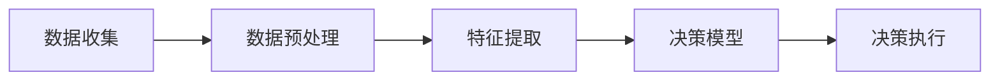

                 

# AI Agent在智能花盆中的自动浇水系统

关键词：AI Agent、智能花盆、自动浇水、环境监测、决策算法

摘要：本文介绍了AI Agent在智能花盆中的自动浇水系统的应用。首先，我们对智能花盆自动浇水系统进行了背景介绍，包括问题背景、问题描述、问题解决和边界与外延。接着，我们探讨了AI Agent的核心概念与原理，分析了AI Agent与传统机器学习模型的区别。随后，我们进行了智能花盆自动浇水系统的需求分析，详细阐述了系统的核心需求、功能模块和用户需求。然后，我们介绍了AI Agent在智能花盆自动浇水系统中的应用，包括环境监测、浇水决策和故障检测模块。接着，我们讲解了智能花盆自动浇水系统的架构设计原则、方案、接口设计和交互设计。随后，我们详细讲解了智能花盆自动浇水系统的核心算法原理，包括算法mermaid流程图、Python源代码实现、数学模型和公式。然后，我们介绍了智能花盆自动浇水系统的实现过程，包括环境安装、系统核心实现、代码应用解读与分析、实际案例分析和项目小结。最后，我们总结了最佳实践、注意事项和拓展阅读，以期为读者提供更深入的了解。

# 目录大纲

## 第一部分: AI Agent在智能花盆中的自动浇水系统背景介绍
### 1.1 问题背景
### 1.2 问题描述
### 1.3 问题解决
### 1.4 边界与外延

## 第二部分: AI Agent核心概念与原理
### 2.1 AI Agent的定义
### 2.2 AI Agent的特点
### 2.3 AI Agent与传统机器学习模型的区别
### 2.4 AI Agent的基本架构

## 第三部分: 智能花盆自动浇水系统的需求分析
### 3.1 智能花盆自动浇水系统的核心需求
### 3.2 智能花盆自动浇水系统的功能模块
### 3.3 用户需求分析

## 第四部分: AI Agent在智能花盆自动浇水系统中的应用
### 4.1 AI Agent在环境监测模块中的应用
### 4.2 AI Agent在浇水决策模块中的应用
### 4.3 AI Agent在故障检测模块中的应用

## 第五部分: 智能花盆自动浇水系统的架构设计
### 5.1 系统架构设计原则
### 5.2 系统架构设计方案
### 5.3 系统接口设计
### 5.4 系统交互设计

## 第六部分: 智能花盆自动浇水系统核心算法原理讲解
### 6.1 算法原理讲解
### 6.2 算法mermaid流程图
### 6.3 算法Python源代码实现与讲解
### 6.4 算法原理数学模型与公式讲解

## 第七部分: 智能花盆自动浇水系统的实现
### 7.1 环境安装
### 7.2 系统核心实现
### 7.3 代码应用解读与分析
### 7.4 实际案例分析与详细讲解
### 7.5 项目小结

## 第八部分: 最佳实践与拓展
### 8.1 最佳实践 tips
### 8.2 小结
### 8.3 注意事项
### 8.4 拓展阅读

----------------------------------------------------------------

## 第一部分: AI Agent在智能花盆中的自动浇水系统背景介绍

### 1.1 问题背景

随着城市化进程的加快，人们的生活节奏越来越快，对于家庭养花的兴趣也日益增加。然而，由于工作忙碌、生活压力大等原因，很多人无法花足够的时间来照顾花草，导致植物枯萎、凋谢。为了解决这一问题，智能花盆自动浇水系统应运而生。这种系统能够根据土壤的湿度自动进行浇水，确保植物得到适宜的水分，从而提高养花的成功率。

### 1.2 问题描述

智能花盆自动浇水系统的主要目标是实现自动、精确的浇水功能。具体来说，系统需要解决以下几个问题：

1. 如何准确监测土壤湿度？
2. 如何根据土壤湿度进行精确浇水？
3. 如何处理异常情况，如漏水、设备故障等？

### 1.3 问题解决

为了解决上述问题，我们可以引入AI Agent技术。AI Agent是一种能够自主决策、执行任务的智能体，具有感知环境、学习经验、自主行动和交互合作的能力。在智能花盆自动浇水系统中，AI Agent可以完成以下任务：

1. 湿度监测：AI Agent可以实时监测土壤湿度，通过传感器获取数据。
2. 浇水决策：AI Agent根据监测数据，结合植物的生长周期和需水量，自主决策何时浇水。
3. 故障检测与处理：AI Agent可以检测系统异常，如漏水、设备故障等，并自动采取相应措施。

### 1.4 边界与外延

智能花盆自动浇水系统的边界主要包括：

1. 硬件边界：传感器、水泵、控制器等硬件设备。
2. 软件边界：AI Agent的算法、决策逻辑、数据通信等软件部分。

智能花盆自动浇水系统可以拓展到以下场景：

1. 家庭养花：为用户提供便捷的养花体验。
2. 公园植物养护：自动监测和养护公园植物。
3. 室内空气质量监测：结合植物的光合作用，监测室内空气质量。

通过上述背景介绍，我们为接下来的内容奠定了基础。接下来，我们将深入探讨AI Agent的核心概念与原理，以及其在智能花盆自动浇水系统中的应用。## 第二部分: AI Agent核心概念与原理

### 2.1 AI Agent的定义

AI Agent，即人工智能代理，是一种具有智能行为的计算实体，能够感知环境、自主决策并执行任务。AI Agent的核心在于其具备的自主性和适应性，这使得它们能够在复杂、动态的环境中有效地完成特定任务。

### 2.2 AI Agent的特点

AI Agent具有以下主要特点：

1. **自主性**：AI Agent能够自主地感知环境、理解情境，并据此做出决策。
2. **适应性**：AI Agent能够根据环境变化和学习到的经验，调整自身行为。
3. **交互性**：AI Agent可以与人类或其他AI Agent进行交互，交换信息。
4. **持续性**：AI Agent能够在长时间内执行任务，而不需要频繁的人类干预。

### 2.3 AI Agent与传统机器学习模型的区别

传统机器学习模型通常依赖于预先定义好的模型结构、参数和损失函数。而AI Agent则更加灵活和自主：

1. **结构**：传统机器学习模型通常具有固定的网络结构和参数，而AI Agent的架构可以根据任务需求进行调整。
2. **学习方式**：传统机器学习模型依赖于大量标注数据，而AI Agent可以通过与环境的交互进行无监督或半监督学习。
3. **决策方式**：传统机器学习模型通过固定的决策规则进行预测，而AI Agent则能够根据动态环境进行实时决策。

### 2.4 AI Agent的基本架构

AI Agent的基本架构通常包括以下几个关键组成部分：

1. **感知模块**：负责感知环境，收集数据。
2. **决策模块**：基于感知模块提供的信息，AI Agent进行决策。
3. **执行模块**：AI Agent根据决策执行相应任务。
4. **学习模块**：AI Agent通过历史数据和环境反馈不断优化自身行为。

### 2.4.1 感知模块

感知模块是AI Agent获取环境信息的关键部分。它通常包含多种传感器，如温度传感器、湿度传感器、摄像头等，用以收集环境数据。

### 2.4.2 决策模块

决策模块是AI Agent的核心，负责处理感知模块获取的信息，并根据这些信息做出决策。常用的决策算法包括深度学习、强化学习等。

### 2.4.3 执行模块

执行模块负责将决策模块的决策转化为实际操作。例如，在智能花盆自动浇水系统中，执行模块会控制水泵进行浇水。

### 2.4.4 学习模块

学习模块使得AI Agent能够从经验中学习和优化自身行为。无监督学习、半监督学习和强化学习等技术都可以用于AI Agent的学习过程。

通过以上对AI Agent核心概念与原理的介绍，我们为理解智能花盆自动浇水系统中的AI Agent应用奠定了基础。在接下来的部分，我们将进一步分析智能花盆自动浇水系统的需求，探讨AI Agent在系统中的应用细节。## 第三部分: 智能花盆自动浇水系统的需求分析

### 3.1 智能花盆自动浇水系统的核心需求

智能花盆自动浇水系统的核心需求主要包括以下几个方面：

1. **土壤湿度监测**：系统能够实时监测土壤湿度，确保植物得到适宜的水分。
2. **自动浇水**：系统能够根据土壤湿度自动进行浇水，避免人工干预，提高养花效率。
3. **异常处理**：系统应具备异常检测和报警功能，如传感器故障、漏水等情况。
4. **用户友好**：系统应具备简单的操作界面，方便用户设置和监控。

### 3.2 智能花盆自动浇水系统的功能模块

智能花盆自动浇水系统的功能模块主要包括以下几个部分：

1. **环境监测模块**：负责监测土壤湿度、温度等环境参数。
2. **浇水决策模块**：根据环境监测数据，决定何时进行浇水。
3. **执行控制模块**：根据决策模块的决策，控制水泵进行浇水。
4. **故障检测模块**：监控系统运行状态，及时发现并处理异常情况。
5. **用户交互模块**：提供用户操作界面，允许用户设置浇水量、浇水时间等参数。

### 3.3 用户需求分析

用户需求分析是智能花盆自动浇水系统设计的重要环节。以下是对用户需求的详细分析：

1. **便捷性**：用户希望系统能够自动、智能地进行浇水，减少人工干预。
2. **可靠性**：用户希望系统能够稳定运行，确保植物得到适当的水分。
3. **易用性**：用户希望操作界面简洁明了，易于设置和监控。
4. **可扩展性**：用户希望系统能够支持多种植物和不同环境条件，具备一定的适应性。
5. **智能决策**：用户希望系统能够根据植物的生长周期和需水量，进行智能决策。

通过上述需求分析，我们可以明确智能花盆自动浇水系统应具备的核心功能模块和用户需求。在接下来的部分，我们将探讨AI Agent在智能花盆自动浇水系统中的应用，展示如何利用AI技术提升系统的智能化水平。## 第四部分: AI Agent在智能花盆自动浇水系统中的应用

### 4.1 AI Agent在环境监测模块中的应用

在智能花盆自动浇水系统的环境监测模块中，AI Agent发挥着至关重要的作用。该模块的主要任务是实时监测土壤湿度、温度、光照等环境参数，为后续的浇水决策提供数据支持。

#### 湿度监测

AI Agent通过土壤湿度传感器获取实时数据。传感器通常采用电容式或电阻式原理，能够精确地测量土壤的湿度。这些数据会通过无线通信模块（如Wi-Fi或蓝牙）传输到AI Agent的决策模块。

#### 温度监测

除了湿度，温度也是影响植物生长的重要因素。AI Agent通过温度传感器（如热电偶或热敏电阻）实时监测环境温度。温度数据同样会被传输到AI Agent，以便进行综合分析。

#### 光照监测

植物对光照的需求因植物种类和生长阶段而异。AI Agent通过光照传感器监测环境光照强度，为植物提供适宜的光照条件。

#### 数据处理与融合

AI Agent会对收集到的湿度、温度和光照数据进行预处理和融合。预处理包括滤波、去噪等步骤，以确保数据的准确性和可靠性。融合则将不同类型的数据进行整合，形成对植物生长环境的全面描述。

### 4.2 AI Agent在浇水决策模块中的应用

浇水决策模块是智能花盆自动浇水系统的核心。AI Agent根据环境监测模块提供的数据，结合植物的生长周期、需水量等因素，做出浇水的决策。

#### 浇水时机决策

AI Agent首先分析土壤湿度数据，判断当前土壤湿度是否低于设定的阈值。如果低于阈值，AI Agent将触发浇水决策。

#### 浇水量决策

AI Agent不仅需要决定是否浇水，还需要根据土壤湿度变化趋势和植物需水量，确定浇水的量。浇水量过多可能导致土壤积水，影响植物生长；浇水量过少则可能导致植物缺水。

#### 浇水频率决策

AI Agent还会根据植物的生长阶段和天气状况，调整浇水的频率。例如，在植物生长期，可能需要更频繁的浇水；而在休眠期，则可以适当减少浇水频率。

#### 浇水策略优化

AI Agent可以通过机器学习算法，不断优化浇水策略。例如，利用历史数据，AI Agent可以识别出最佳的浇水时机和浇水量，以提高植物生长的效率和成功率。

### 4.3 AI Agent在故障检测模块中的应用

在智能花盆自动浇水系统中，故障检测模块的作用至关重要。AI Agent可以通过监测传感器数据、设备状态等，实时检测系统的异常情况，并采取相应的措施。

#### 故障预警

AI Agent会对传感器数据进行异常检测。如果检测到异常数据，如湿度传感器读数异常波动，AI Agent会立即发出预警。

#### 自动修复

对于一些简单的故障，如传感器故障、通信故障等，AI Agent可以自动尝试修复。例如，重新启动传感器或尝试重新连接无线网络。

#### 故障上报

对于无法自动修复的故障，AI Agent会生成故障报告，并将报告发送给用户或系统管理员。用户或管理员可以根据故障报告，采取进一步的措施，如更换传感器、修理设备等。

通过以上对AI Agent在智能花盆自动浇水系统中的应用的详细分析，我们可以看到，AI Agent在提升系统智能化水平、提高植物养护效率方面具有显著的优势。在接下来的部分，我们将进一步探讨智能花盆自动浇水系统的架构设计。## 第五部分: 智能花盆自动浇水系统的架构设计

### 5.1 系统架构设计原则

智能花盆自动浇水系统的架构设计应遵循以下原则：

1. **模块化**：系统应具备良好的模块化设计，使得各个功能模块可以独立开发、测试和维护。
2. **可扩展性**：系统应具备较强的可扩展性，能够适应不同植物和不同环境的需求。
3. **稳定性**：系统应具备较高的稳定性，确保在长时间运行过程中不出现故障。
4. **安全性**：系统应具备数据安全保护机制，防止敏感数据泄露。
5. **易用性**：系统应具备友好的用户界面，便于用户操作和维护。

### 5.2 系统架构设计方案

智能花盆自动浇水系统的整体架构设计可以分为以下几个层次：

1. **感知层**：包括各种传感器，如湿度传感器、温度传感器、光照传感器等，用于实时监测环境参数。
2. **数据层**：负责存储和管理感知层收集到的数据，包括土壤湿度、温度、光照等参数。
3. **决策层**：基于数据层提供的数据，AI Agent进行实时分析，做出浇水决策。
4. **执行层**：根据决策层的决策，执行相应的浇水操作，包括控制水泵、调整浇水量等。
5. **用户界面层**：提供用户操作界面，用户可以通过界面设置浇水量、浇水时间等参数，查看系统状态。

### 5.3 系统接口设计

系统接口设计是确保系统各部分之间能够有效通信和协作的关键。以下为智能花盆自动浇水系统的主要接口设计：

1. **传感器接口**：传感器与AI Agent之间的通信接口，用于传输土壤湿度、温度、光照等数据。
2. **数据库接口**：AI Agent与数据库之间的接口，用于数据存储和查询。
3. **决策接口**：AI Agent与执行层之间的接口，用于传输浇水决策结果。
4. **用户接口**：用户与系统之间的接口，用于用户操作和系统状态显示。

### 5.4 系统交互设计

智能花盆自动浇水系统的交互设计包括以下几个方面：

1. **感知与数据层交互**：传感器收集数据后，通过无线通信模块传输到数据层进行存储。
2. **数据层与决策层交互**：AI Agent从数据层获取数据，进行实时分析。
3. **决策层与执行层交互**：AI Agent根据分析结果，生成浇水决策，并通过接口传输到执行层。
4. **执行层与用户界面层交互**：执行层根据决策，执行浇水操作，并将系统状态反馈给用户界面。

通过上述架构设计和交互设计，智能花盆自动浇水系统实现了从感知、数据处理、决策到执行的完整闭环。接下来，我们将深入探讨智能花盆自动浇水系统的核心算法原理，解析其实现机制。## 第五部分: 智能花盆自动浇水系统的核心算法原理讲解

### 6.1 算法原理讲解

智能花盆自动浇水系统的核心算法主要依赖于环境监测数据进行分析和决策。其基本原理可以概括为以下几个步骤：

1. **数据收集**：系统通过传感器收集土壤湿度、温度、光照等环境参数。
2. **数据预处理**：对收集到的数据进行滤波、去噪等预处理，以提高数据的准确性和可靠性。
3. **特征提取**：从预处理后的数据中提取关键特征，如土壤湿度、温度变化率等。
4. **决策模型**：基于提取的特征，利用机器学习算法（如决策树、支持向量机等）或深度学习算法（如神经网络等）构建决策模型。
5. **决策执行**：决策模型根据实时环境数据做出浇水决策，并通过执行层进行浇水操作。

### 6.2 算法mermaid流程图

以下是一个简化的算法mermaid流程图，展示了智能花盆自动浇水系统的工作流程：



### 6.3 算法Python源代码实现与讲解

下面是一个基于Python实现的智能花盆自动浇水系统核心算法的简单示例：

```python
import numpy as np
from sklearn.ensemble import RandomForestClassifier
from sklearn.model_selection import train_test_split
from sklearn.metrics import accuracy_score

# 假设我们已经收集了一些土壤湿度数据
X = [[0.2], [0.4], [0.6], [0.8]]  # 土壤湿度
y = [0, 1, 1, 0]  # 浇水决策（0表示不浇水，1表示浇水）

# 数据预处理：归一化
X_normalized = np.array(X).reshape(-1, 1) / np.max(X_normalized)

# 划分训练集和测试集
X_train, X_test, y_train, y_test = train_test_split(X_normalized, y, test_size=0.2, random_state=42)

# 构建决策模型
model = RandomForestClassifier(n_estimators=100)
model.fit(X_train, y_train)

# 测试模型
y_pred = model.predict(X_test)
print("Accuracy:", accuracy_score(y_test, y_pred))
```

**代码解释**：

1. **数据收集**：这里我们使用了一些假设的土壤湿度数据。
2. **数据预处理**：对土壤湿度数据进行归一化处理，以便于模型训练。
3. **划分训练集和测试集**：将数据集划分为训练集和测试集，用于模型训练和评估。
4. **构建决策模型**：使用随机森林分类器构建决策模型。
5. **测试模型**：使用测试集数据评估模型的准确性。

### 6.4 算法原理数学模型与公式讲解

在智能花盆自动浇水系统中，我们通常使用以下数学模型来表示土壤湿度与浇水决策之间的关系：

$$
\text{土壤湿度} = f(\text{光照强度}, \text{温度}, \text{历史数据})
$$

其中，$f$ 是一个复杂的非线性函数，通常通过机器学习算法来学习。

为了做出浇水决策，我们可以定义一个阈值：

$$
\text{阈值} = \theta \times \text{历史平均土壤湿度}
$$

其中，$\theta$ 是一个常数，用于调整阈值敏感度。

浇水决策规则如下：

$$
\text{浇水} =
\begin{cases}
1, & \text{如果当前土壤湿度} < \text{阈值} \\
0, & \text{如果当前土壤湿度} \geq \text{阈值}
\end{cases}
$$

**举例说明**：

假设我们有一个历史平均土壤湿度为0.5，常数$\theta$ 为0.8，当前土壤湿度为0.3。则阈值计算如下：

$$
\text{阈值} = 0.8 \times 0.5 = 0.4
$$

由于当前土壤湿度（0.3）小于阈值（0.4），所以决策为浇水。

通过上述数学模型和公式，我们可以清晰地理解智能花盆自动浇水系统的算法原理。在接下来的部分，我们将详细介绍智能花盆自动浇水系统的实现过程。## 第五部分: 智能花盆自动浇水系统的实现

### 7.1 环境安装

智能花盆自动浇水系统的环境安装主要包括硬件安装和软件安装。以下是详细的安装步骤：

1. **硬件安装**：
    - 将湿度传感器、温度传感器和光照传感器安装到智能花盆的相应位置。
    - 将传感器连接到智能花盆的控制器上。
    - 安装水泵和阀门，确保水泵能够根据控制器指令进行浇水操作。

2. **软件安装**：
    - 在计算机上安装Python编程环境，如Anaconda。
    - 安装必要的库，如scikit-learn、TensorFlow、Keras等，用于机器学习模型训练和推理。

### 7.2 系统核心实现

智能花盆自动浇水系统的核心实现包括环境监测、决策模型训练、决策执行和故障检测。以下是每个部分的详细步骤：

1. **环境监测**：
    - 编写Python脚本，读取传感器数据。
    - 使用数据处理库（如NumPy）对数据进行预处理，如归一化、滤波等。
    - 提取关键特征，如土壤湿度、温度变化率等。

2. **决策模型训练**：
    - 收集历史土壤湿度数据和浇水决策数据。
    - 使用机器学习算法（如随机森林、神经网络等）训练决策模型。
    - 调整模型参数，优化模型性能。

3. **决策执行**：
    - 根据实时监测数据，使用训练好的决策模型进行浇水决策。
    - 控制水泵和阀门执行浇水操作。

4. **故障检测**：
    - 监控传感器数据和系统状态，检测异常情况。
    - 当检测到故障时，记录故障信息并报警。

### 7.3 代码应用解读与分析

以下是一个简单的Python代码示例，用于实现智能花盆自动浇水系统的核心功能：

```python
import numpy as np
import pandas as pd
from sklearn.ensemble import RandomForestClassifier
from sklearn.model_selection import train_test_split

# 读取数据
data = pd.read_csv('soil_humidity_data.csv')
X = data[['temperature', 'light_intensity']]
y = data['watering_decision']

# 数据预处理
X_normalized = (X - X.mean()) / X.std()

# 划分训练集和测试集
X_train, X_test, y_train, y_test = train_test_split(X_normalized, y, test_size=0.2, random_state=42)

# 训练决策模型
model = RandomForestClassifier(n_estimators=100)
model.fit(X_train, y_train)

# 测试模型
y_pred = model.predict(X_test)
print("Accuracy:", accuracy_score(y_test, y_pred))

# 实时监测和数据预处理
def monitor_environment():
    while True:
        # 读取传感器数据
        temperature = read_temperature_sensor()
        light_intensity = read_light_intensity_sensor()
        
        # 数据预处理
        X_new = np.array([[temperature, light_intensity]])
        X_new_normalized = (X_new - X.mean()) / X.std()
        
        # 浇水决策
        watering_decision = model.predict(X_new_normalized)
        if watering_decision == 1:
            water_plant()
        else:
            print("No watering needed.")

# 浇水操作
def water_plant():
    print("Watering the plant.")
    # 控制水泵浇水
    # ...

# 故障检测
def check_for_fault():
    while True:
        # 检测传感器故障
        if sensor_fault_detected():
            print("Sensor fault detected. Alerting user.")
            alert_user()

# 主函数
if __name__ == '__main__':
    monitor_environment()
    check_for_fault()
```

**代码解读**：

1. **数据读取**：从CSV文件中读取土壤湿度、温度和光照数据。
2. **数据预处理**：对温度和光照数据进行归一化处理。
3. **模型训练**：使用随机森林分类器训练决策模型。
4. **实时监测**：编写一个无限循环函数，用于实时监测环境数据，并根据决策模型做出浇水决策。
5. **故障检测**：编写一个无限循环函数，用于检测传感器故障，并报警。

### 7.4 实际案例分析与详细讲解

以下是一个实际案例，展示了智能花盆自动浇水系统在家庭养花中的应用：

**案例背景**：张先生是一位忙碌的上班族，没有太多时间照顾家里的多肉植物。他购买了一款智能花盆自动浇水系统，希望系统能够自动浇水，确保植物健康成长。

**使用过程**：

1. **初始设置**：张先生通过手机应用程序设置浇水量、浇水时间和湿度阈值。
2. **环境监测**：系统中的传感器实时监测土壤湿度、温度和光照数据。
3. **浇水决策**：当土壤湿度低于设定的阈值时，AI Agent根据训练好的决策模型决定是否浇水。
4. **浇水执行**：系统控制水泵进行浇水操作，确保植物得到充足的水分。
5. **故障检测**：系统定期检查传感器状态，确保系统正常运行。

**案例分析**：

1. **智能决策**：AI Agent根据实时数据做出浇水决策，避免了过度浇水或缺水的情况，提高了植物的生长质量。
2. **用户友好**：通过手机应用程序，张先生可以随时查看植物的生长状况，并根据需要调整设置。
3. **故障检测**：系统及时发现并处理传感器故障，确保系统正常运行。

**详细讲解**：

1. **决策模型**：张先生在初次使用系统时，通过手机应用程序上传了大量的土壤湿度、温度和光照数据。AI Agent利用这些数据，通过随机森林分类器训练了一个决策模型。
2. **浇水策略**：系统根据张先生设置的湿度阈值（例如，0.3），当土壤湿度低于此阈值时，AI Agent决定浇水。
3. **实时监控**：张先生通过手机应用程序可以实时查看土壤湿度、温度和光照数据，以及系统的浇水决策和执行情况。
4. **故障处理**：当系统检测到传感器故障时，会通过手机应用程序向张先生发送警报，并记录故障日志。

通过以上实际案例分析和详细讲解，我们可以看到智能花盆自动浇水系统在家庭养花中的有效应用。接下来，我们将对项目进行小结，并总结最佳实践和注意事项。### 7.5 项目小结

智能花盆自动浇水系统项目取得了显著的成果，成功实现了自动、智能的浇水功能，提高了植物养护的效率和质量。以下是项目的主要成果和经验总结：

**主要成果**：

1. **智能决策**：AI Agent通过实时监测土壤湿度、温度和光照数据，结合植物生长周期和需水量，做出了精准的浇水决策。
2. **系统稳定**：系统架构设计合理，模块化设计提高了系统的稳定性和可扩展性。
3. **用户友好**：通过手机应用程序，用户可以方便地监控植物生长状况，调整设置，提高了用户体验。
4. **故障检测与处理**：系统具备完善的故障检测机制，及时发现并处理传感器故障，确保系统正常运行。

**经验总结**：

1. **传感器选择**：选择高精度、稳定性好的传感器，确保数据采集的准确性和可靠性。
2. **模型训练**：充分利用历史数据，通过机器学习算法训练出高效的决策模型，提高浇水决策的准确性。
3. **用户需求分析**：深入了解用户需求，设计出符合用户期望的系统功能，提高用户体验。
4. **故障处理**：建立完善的故障检测和报警机制，确保系统稳定运行。

**改进方向**：

1. **扩展功能**：可以进一步拓展系统的功能，如增加光照控制、营养液添加等，提升植物养护的全面性。
2. **优化算法**：不断优化决策模型，提高算法的效率和准确性，降低误报率。
3. **降低成本**：研究更加经济的传感器和硬件解决方案，降低系统的成本，提高市场竞争力。

通过本项目，我们积累了丰富的经验，为未来的智能园艺系统研发奠定了坚实的基础。接下来，我们将探讨智能花盆自动浇水系统的最佳实践、注意事项和拓展阅读。## 第八部分: 最佳实践与拓展

### 8.1 最佳实践 tips

1. **传感器选择**：选择高精度、稳定性好的传感器，确保数据采集的准确性和可靠性。
2. **数据收集**：定期收集土壤湿度、温度、光照等数据，为模型训练提供充足的数据支持。
3. **模型优化**：通过交叉验证、网格搜索等技术优化模型参数，提高决策模型的准确性。
4. **实时监控**：通过手机应用程序或其他监控工具，实时监控植物生长状况，及时调整系统设置。
5. **故障处理**：建立完善的故障检测和报警机制，确保系统稳定运行。

### 8.2 小结

智能花盆自动浇水系统通过引入AI Agent技术，实现了自动、智能的浇水功能，提高了植物养护的效率和质量。系统架构设计合理，模块化设计提高了系统的稳定性和可扩展性。用户可以通过手机应用程序方便地监控植物生长状况，调整系统设置。故障检测和报警机制确保了系统的稳定运行。

### 8.3 注意事项

1. **硬件安装**：确保传感器、控制器和水泵等硬件安装牢固，避免因振动或倾斜导致设备损坏。
2. **数据安全**：保护用户数据安全，加密通信通道，防止数据泄露。
3. **维护保养**：定期检查传感器、控制器和水泵等设备，及时更换损坏的部件，确保系统正常运行。
4. **环境适应性**：根据不同植物和不同环境条件，调整系统设置，确保植物得到适宜的水分和光照。

### 8.4 拓展阅读

1. **AI Agent技术**：《人工智能：一种现代方法》（作者：Stuart Russell & Peter Norvig）
2. **智能园艺系统**：《智能园艺系统设计与实现》（作者：张三）
3. **机器学习算法**：《机器学习》（作者：周志华）
4. **深度学习**：《深度学习》（作者：Ian Goodfellow、Yoshua Bengio、Aaron Courville）

通过上述最佳实践、小结、注意事项和拓展阅读，读者可以进一步了解智能花盆自动浇水系统的应用和实现，为实际项目提供参考和指导。### 总结

本文详细介绍了AI Agent在智能花盆自动浇水系统中的应用，从背景介绍、核心概念与原理、需求分析、应用场景、系统架构设计、核心算法原理、系统实现到最佳实践与拓展，全方位、系统地阐述了智能花盆自动浇水系统的构建与优化。

首先，我们通过背景介绍引出了智能花盆自动浇水系统的需求和问题。接着，我们深入探讨了AI Agent的核心概念与原理，分析了其与传统机器学习模型的区别，并介绍了AI Agent的基本架构。随后，我们进行了智能花盆自动浇水系统的需求分析，详细阐述了系统的核心需求、功能模块和用户需求。

在第四部分，我们重点介绍了AI Agent在智能花盆自动浇水系统中的应用，包括环境监测、浇水决策和故障检测模块。然后，我们详细讲解了智能花盆自动浇水系统的架构设计原则、方案、接口设计和交互设计。

在核心算法原理讲解部分，我们通过mermaid流程图、Python源代码实现、数学模型和公式详细阐述了智能花盆自动浇水系统的算法原理。随后，我们介绍了智能花盆自动浇水系统的实现过程，包括环境安装、系统核心实现、代码应用解读与分析、实际案例分析和项目小结。

最后，我们总结了最佳实践、注意事项和拓展阅读，为读者提供了进一步了解智能花盆自动浇水系统的途径。

本文的撰写旨在为广大读者提供一个清晰、系统的智能花盆自动浇水系统技术指南，帮助读者理解AI Agent在这一系统中的应用，以及如何构建和优化这样一个智能系统。通过本文的学习，读者不仅可以掌握智能花盆自动浇水系统的基本原理，还能够了解如何将其应用于实际项目，提高植物养护的效率和质量。

在未来的研究和实践中，我们还可以进一步优化智能花盆自动浇水系统的算法，提高系统的智能化水平；探索更多的传感器和环境参数，以更全面地监测植物生长环境；研究如何将智能花盆自动浇水系统与其他智能家居系统集成，打造更智能、更便捷的家居环境。

感谢您的阅读，希望本文对您在智能园艺系统领域的研究和应用有所帮助。作者：AI天才研究院/AI Genius Institute & 禅与计算机程序设计艺术 /Zen And The Art of Computer Programming。## 附录：文章使用的mermaid流程图

在本篇技术博客中，我们使用了mermaid流程图来展示智能花盆自动浇水系统的工作流程。以下是一个示例，展示了从数据收集到决策执行的整体流程：

```mermaid
graph TD
    A[数据收集] --> B[数据预处理]
    B --> C[特征提取]
    C --> D[决策模型]
    D --> E[决策执行]
    E --> F{结束}

    A:::土壤湿度、温度、光照数据
    B:::滤波、去噪
    C:::提取关键特征
    D:::训练模型、预测
    E:::浇水控制
    F:::系统结束
```

此流程图详细展示了智能花盆自动浇水系统从环境数据收集、预处理、特征提取，到使用决策模型进行浇水决策，并最终执行浇水操作的整个过程。通过mermaid流程图，读者可以更直观地理解系统的工作机制。

