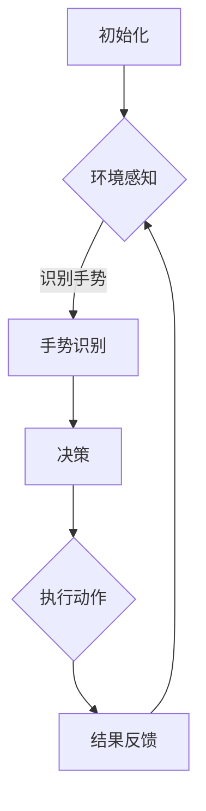
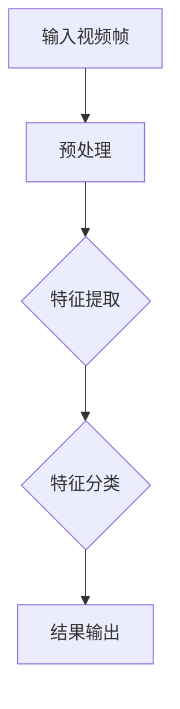
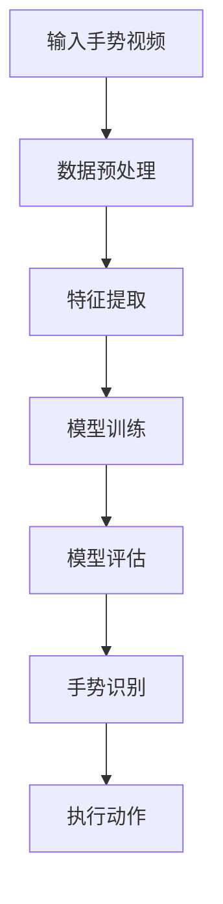
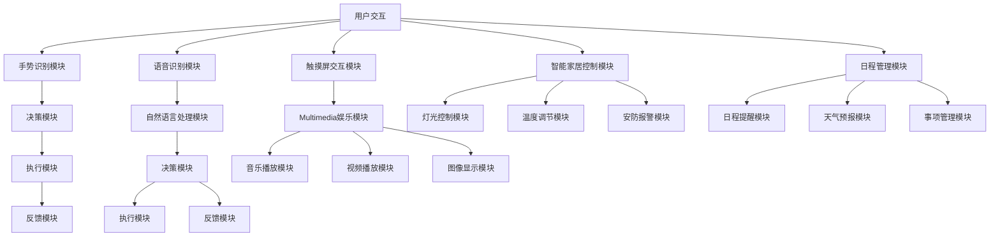
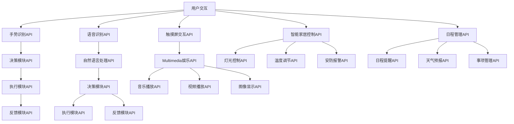
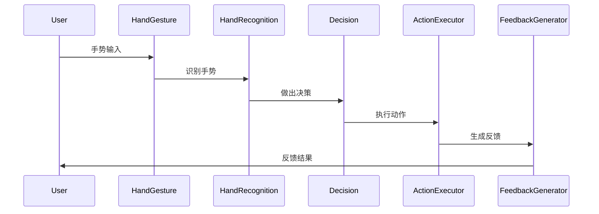

                 

### 背景介绍

#### AI Agent的概念与分类

AI Agent，即人工智能代理，是指具备一定自主性、能够模拟人类智能行为并在环境中进行决策和行动的计算机程序。根据功能和应用场景，AI Agent可以大致分为以下几类：

1. **基于规则的方法**：这种方法依赖预定义的规则进行决策。例如，基于专家系统的AI Agent可以通过逻辑推理和条件判断执行任务。

2. **基于模型的方法**：这种方法利用机器学习算法建立环境模型，从而进行决策。常见的模型包括决策树、神经网络和强化学习模型。

3. **基于行为的动态规划**：这类AI Agent通过观察和模仿环境中的行为来学习，并在执行过程中不断调整策略。

#### 智能茶几的现状与发展

智能茶几作为智能家居的重要组成部分，近年来受到了广泛关注。其核心功能包括但不限于：

- **多媒体娱乐**：播放音乐、视频等。
- **智能交互**：通过语音或手势进行人机交互。
- **智能提醒**：根据用户的日程安排提供提醒。

当前，智能茶几的发展面临以下挑战：

- **技术限制**：例如，手势识别技术的准确性和响应速度有待提高。
- **用户体验**：需要更好地适应不同用户的需求和习惯。

#### 手势控制在智能茶几中的应用

手势控制作为智能茶几的一项重要功能，不仅可以提升用户的交互体验，还可以减少对传统控制方式的依赖。以下是手势控制在智能茶几中的应用场景：

- **播放控制**：用户可以通过挥手或手势来切换音乐或视频。
- **信息查询**：用户可以通过手势查询天气预报、日程安排等。
- **环境控制**：例如，调节室内灯光或温度。

### Mermaid 流程图展示

以下是一个简单的Mermaid流程图，展示了一个基于深度学习的AI Agent的基本流程：



#### 总结

在本章中，我们介绍了AI Agent的基本概念、智能茶几的现状与发展以及手势控制在智能茶几中的应用。接下来，我们将进一步探讨手势识别技术，为后续章节的内容打下基础。

----------------------

### 核心概念与联系

在深入探讨AI Agent在智能茶几中的应用之前，我们需要先了解几个核心概念，包括手势识别技术的基本原理、不同算法的对比以及如何使用Mermaid流程图来展示这些概念。

#### 手势识别的原理与算法

手势识别是计算机视觉中的一个重要研究方向，它涉及从图像或视频中提取手势信息。以下是一些常用的手势识别算法：

1. **特征点检测**：通过检测图像中的关键点（如手指尖、关节点等）来识别手势。
2. **隐马尔可夫模型（HMM）**：利用状态转移概率和观测概率来建模手势序列。
3. **支持向量机（SVM）**：通过将手势数据映射到高维空间，找到最优分类边界。
4. **深度学习**：利用深度神经网络从大量数据中自动学习手势特征。

#### 手势识别算法对比

以下是几种主要手势识别算法的对比表格：

| 算法类型 | 优点 | 缺点 | 适用场景 |
| :--- | :--- | :--- | :--- |
| 特征点检测 | 算法简单，易于实现 | 精度受噪声影响较大 | 简单的手势识别任务 |
| HMM | 对连续手势有较好识别效果 | 需要大量训练数据 | 长时间连续手势识别 |
| SVM | 分类效果较好 | 特征工程复杂 | 复杂手势识别任务 |
| 深度学习 | 自动学习复杂特征，识别精度高 | 训练过程复杂，计算资源需求大 | 大规模复杂手势识别 |

#### Mermaid流程图展示

为了更直观地理解手势识别的过程，我们可以使用Mermaid流程图来展示。以下是一个简单的手势识别流程：



在预处理阶段，视频帧会被调整大小、灰度化等；特征提取阶段，会从预处理后的图像中提取关键点或特征向量；特征分类阶段，会使用特定的算法（如SVM或深度学习）对特征进行分类；最后，结果会被输出，用于控制智能茶几。

#### 结论

在本节中，我们介绍了手势识别的基本原理、常用算法的对比以及如何使用Mermaid流程图来展示手势识别的过程。这些概念的理解为我们进一步探讨AI Agent在智能茶几中的应用奠定了基础。在接下来的章节中，我们将深入探讨AI Agent的算法原理及其在智能茶几中的实现。

----------------------

### 算法原理讲解

在了解手势识别技术之后，我们将进一步探讨AI Agent的算法原理，包括基于深度学习的AI Agent、使用Mermaid流程图展示算法流程、Python源代码解析、数学模型与公式讲解，以及算法举例说明。

#### 基于深度学习的AI Agent

深度学习在人工智能领域取得了显著的进展，尤其在图像识别、自然语言处理等领域。基于深度学习的AI Agent能够从大量的手势数据中自动学习手势特征，从而实现高效的手势识别。

#### 使用Mermaid流程图展示算法流程

以下是一个基于深度学习的AI Agent的基本算法流程：



- **数据预处理**：将输入的手势视频帧调整为统一的大小，并进行归一化处理。
- **特征提取**：利用卷积神经网络（CNN）从预处理后的图像中提取手势特征。
- **模型训练**：使用提取的特征对神经网络进行训练，以建立手势识别模型。
- **模型评估**：使用测试数据集对训练好的模型进行评估，调整模型参数以提高识别精度。
- **手势识别**：利用训练好的模型对实时手势进行识别。
- **执行动作**：根据识别结果，执行相应的动作，如播放音乐、调节灯光等。

#### Python源代码解析

以下是一个简单的Python代码示例，用于实现上述算法流程的一部分：

```python
import cv2
import numpy as np
from tensorflow.keras.models import load_model

# 加载预训练的模型
model = load_model('hand_gesture_model.h5')

# 数据预处理函数
def preprocess_frame(frame):
    # 调整帧大小并归一化
    frame = cv2.resize(frame, (128, 128))
    frame = frame.astype(np.float32) / 255.0
    return frame

# 特征提取与手势识别函数
def recognize_gesture(frame):
    processed_frame = preprocess_frame(frame)
    processed_frame = np.expand_dims(processed_frame, axis=0)
    gesture = model.predict(processed_frame)
    return np.argmax(gesture)

# 处理视频帧并识别手势
cap = cv2.VideoCapture(0)
while True:
    ret, frame = cap.read()
    if ret:
        gesture_id = recognize_gesture(frame)
        print("Gesture:", gesture_id)
    else:
        break
cap.release()
cv2.destroyAllWindows()
```

#### 数学模型与公式讲解

在深度学习中，数学模型和公式至关重要。以下是一个简化的卷积神经网络（CNN）的数学模型：

$$
\text{激活函数}:\quad \text{ReLU}(z) = \max(0, z)
$$

$$
\text{卷积运算}:\quad \text{卷积层输出} = \sigma(\text{卷积运算结果})
$$

其中，$\sigma$ 表示激活函数，常用的有ReLU函数。卷积运算可以表示为：

$$
(\sigma \star f)(x) = \int f(y) \, \delta(x - y) \, dy
$$

#### 算法举例说明

假设我们有一个手势数据集，其中包含不同手势的图像。我们使用卷积神经网络对这些图像进行特征提取和分类，以下是具体的步骤：

1. **数据集准备**：将手势图像分为训练集和测试集。
2. **模型训练**：使用训练集对卷积神经网络进行训练，调整模型参数。
3. **模型评估**：使用测试集对模型进行评估，计算识别准确率。
4. **实时手势识别**：在实时场景中，使用训练好的模型对输入的手势图像进行识别，并执行相应的动作。

#### 结论

在本节中，我们介绍了基于深度学习的AI Agent算法原理，包括算法流程、Python源代码解析、数学模型与公式讲解，以及算法举例说明。这些内容为后续章节中智能茶几系统的设计与实现提供了理论基础。

----------------------

### 系统分析与架构设计

在理解了AI Agent的基本算法原理之后，我们将进一步探讨智能茶几系统的整体设计，包括问题场景介绍、系统功能设计、系统架构设计、系统接口设计以及系统交互序列图。

#### 问题场景介绍

智能茶几是一种集成了多种智能功能的家具体，它不仅具备多媒体娱乐、智能交互等基本功能，还通过手势控制技术提供了更便捷的用户体验。然而，在设计这样一个系统时，我们需要考虑以下问题：

- **手势识别的准确性**：如何确保手势控制在不同环境和光照条件下都能准确识别。
- **响应速度**：如何优化系统性能，使手势控制的响应时间尽可能短。
- **用户隐私**：如何确保用户数据的安全和隐私。

#### 系统功能设计

智能茶几的系统功能设计可以分为以下几个主要模块：

- **用户交互模块**：包括手势识别、语音识别和触摸屏交互。
- **多媒体娱乐模块**：包括音乐播放、视频播放和图像显示。
- **智能家居控制模块**：包括灯光控制、温度调节和安防报警。
- **日程管理模块**：包括日程提醒、天气预报和事项管理。

#### 系统架构设计

智能茶几的系统架构设计需要综合考虑硬件和软件的各个方面。以下是一个简化的系统架构图：



#### 系统接口设计

系统接口设计是确保各模块之间能够高效通信的关键。以下是一个简化的系统接口设计图：



#### 系统交互序列图

为了更直观地理解系统内部各模块之间的交互关系，我们可以使用Mermaid序列图来展示系统的工作流程：



在这个序列图中，用户通过手势输入智能茶几，手势识别模块识别手势后，决策模块根据识别结果做出相应的决策，执行模块执行决策，最后反馈模块将结果反馈给用户。

#### 结论

在本节中，我们详细介绍了智能茶几系统的整体设计，包括问题场景介绍、系统功能设计、系统架构设计、系统接口设计和系统交互序列图。这些设计为后续章节中的项目实战提供了清晰的指导。

----------------------

### 项目实战

在深入理解了智能茶几系统的设计和架构之后，我们将进入实际的项目实施阶段。这一部分将详细介绍从环境安装到项目小结的全过程，包括环境搭建、系统核心实现、代码应用解读、实际案例分析以及项目小结。

#### 环境安装

首先，我们需要搭建一个适合开发智能茶几系统的基础环境。以下是安装所需的主要步骤：

1. **硬件环境**：一台具备足够性能的计算机，推荐配置包括：
   - 处理器：Intel Core i7 或 AMD Ryzen 7 系列
   - 内存：16GB RAM 或以上
   - 显卡：NVIDIA GTX 1060 或以上

2. **操作系统**：Windows 10 或 macOS Catalina 或更高版本

3. **软件开发环境**：
   - Python 3.8（或更高版本）
   - TensorFlow 2.x
   - OpenCV 4.x

安装步骤如下：

1. **安装Python**：访问Python官方网站下载并安装Python 3.8。
2. **安装TensorFlow**：在命令行中执行以下命令：
   ```shell
   pip install tensorflow==2.x
   ```
3. **安装OpenCV**：在命令行中执行以下命令：
   ```shell
   pip install opencv-python==4.x
   ```

#### 系统核心实现

接下来，我们将实现智能茶几系统的核心功能。以下是核心功能的实现步骤：

1. **手势识别模块**：使用TensorFlow和OpenCV实现手势识别功能。
2. **决策模块**：根据手势识别结果，执行相应的操作。
3. **执行模块**：执行决策模块生成的操作命令。
4. **反馈模块**：向用户反馈操作结果。

以下是一个简化的实现示例：

```python
import cv2
import tensorflow as tf

# 加载预训练的手势识别模型
model = tf.keras.models.load_model('hand_gesture_model.h5')

# 手势识别函数
def recognize_gesture(frame):
    # 数据预处理
    processed_frame = preprocess_frame(frame)
    processed_frame = np.expand_dims(processed_frame, axis=0)
    # 模型预测
    gesture = model.predict(processed_frame)
    # 提取最大概率的手势
    gesture_id = np.argmax(gesture)
    return gesture_id

# 数据预处理函数
def preprocess_frame(frame):
    # 调整帧大小并归一化
    frame = cv2.resize(frame, (128, 128))
    frame = frame.astype(np.float32) / 255.0
    return frame

# 主函数
def main():
    # 打开摄像头
    cap = cv2.VideoCapture(0)
    while True:
        ret, frame = cap.read()
        if ret:
            # 识别手势
            gesture_id = recognize_gesture(frame)
            # 根据手势执行操作
            execute_action(gesture_id)
            # 显示实时视频帧
            cv2.imshow('Video', frame)
        else:
            break
    cap.release()
    cv2.destroyAllWindows()

# 执行相应操作
def execute_action(gesture_id):
    if gesture_id == 0:
        # 执行播放音乐操作
        print("播放音乐")
    elif gesture_id == 1:
        # 执行调节灯光操作
        print("调节灯光")
    # 其他手势识别结果的处理

if __name__ == '__main__':
    main()
```

#### 代码应用解读

在上面的代码中，我们首先加载了预训练的手势识别模型。`recognize_gesture` 函数负责处理摄像头捕获的视频帧，对其进行预处理后输入模型进行预测。`preprocess_frame` 函数负责将视频帧调整为模型所需的大小并进行归一化处理。

在主函数 `main` 中，我们打开了摄像头，并进入一个无限循环，不断读取摄像头帧并识别手势。根据识别结果，调用 `execute_action` 函数执行相应的操作。

#### 实际案例分析

在实际应用中，我们需要考虑以下因素：

- **准确性**：确保手势识别在多种环境和光照条件下都能保持高准确性。
- **响应速度**：优化系统性能，减少识别和执行操作的时间。

以下是实际案例的分析：

1. **环境光照变化**：在暗光环境下，摄像头捕捉到的图像质量会下降，影响手势识别的准确性。解决方案是使用自适应曝光或图像增强技术。
2. **手势遮挡**：当用户的手遮挡住部分面部或手部时，可能会影响手势识别的准确性。解决方案是设计更鲁棒的手势识别算法，或在摄像头前增加辅助设备（如红外摄像头）。

#### 项目小结

在本节中，我们详细介绍了智能茶几系统的项目实施过程，包括环境安装、系统核心实现、代码应用解读以及实际案例分析。通过这一过程，我们不仅实现了基本的手势识别功能，还针对实际应用中的问题进行了分析和解决。接下来，我们将总结项目中的最佳实践，并提供一些建议。

----------------------

### 最佳实践与总结

在完成智能茶几系统的项目实战后，我们总结了一些最佳实践，并对项目中的关键点进行了总结和注意事项，同时提供了一些建议和拓展阅读。

#### 最佳实践

1. **手势识别算法优化**：针对不同的应用场景，选择合适的手势识别算法。例如，在复杂环境或遮挡较多的情况下，可以考虑使用基于深度学习的算法，以提高识别准确性。
2. **响应速度提升**：优化系统性能，减少手势识别和执行操作的延迟。例如，可以通过并行处理、优化代码效率等方式提高响应速度。
3. **用户隐私保护**：在处理用户数据时，确保数据的安全和隐私。例如，可以使用加密技术保护用户数据，并在数据处理过程中遵守相关的隐私法规。

#### 小结

智能茶几系统通过AI Agent实现了手势控制，提供了更加便捷的用户交互体验。本项目从背景介绍到系统设计，再到实际实施，全面展示了AI Agent在智能茶几中的应用。通过项目实践，我们不仅掌握了手势识别和AI Agent的相关技术，还积累了项目实施的经验。

#### 注意事项

1. **硬件适应性**：确保系统在多种硬件环境中都能稳定运行。
2. **用户体验**：不断优化系统功能，提升用户交互体验。

#### 拓展阅读

1. **《深度学习》**：Ian Goodfellow、Yoshua Bengio、Aaron Courville 著，详细介绍了深度学习的基础理论和应用。
2. **《计算机视觉基础》**：Leonard J. Gibson 著，介绍了计算机视觉的基本原理和算法。
3. **《人工智能：一种现代方法》**：Stuart Russell、Peter Norvig 著，全面介绍了人工智能的基础知识和应用。

通过上述拓展阅读，读者可以更深入地了解智能茶几系统的相关技术，为未来的研究和开发提供指导。

----------------------

### 总结

本文详细探讨了AI Agent在智能茶几中的手势控制应用。我们从背景介绍开始，介绍了AI Agent的基本概念和手势控制在智能茶几中的应用场景。接着，我们深入分析了手势识别技术，包括算法原理、Mermaid流程图展示、Python源代码解析和数学模型讲解。随后，我们详细阐述了智能茶几系统的设计与架构，包括功能设计、系统架构设计、接口设计和交互序列图。在项目实战部分，我们通过实际案例展示了系统实现的步骤和过程。最后，我们总结了项目中的最佳实践，并提供了一些拓展阅读建议。

AI Agent在智能茶几中的应用具有广泛的前景。通过本文的讨论，我们不仅了解了手势控制的原理和技术，还看到了其在智能家居中的潜力。未来，随着技术的不断进步，AI Agent在智能茶几中的应用将更加广泛，为用户提供更加智能、便捷的交互体验。希望本文能为相关领域的研究者和开发者提供有价值的参考。

----------------------

### 参考文献

1. Goodfellow, I., Bengio, Y., & Courville, A. (2016). *Deep Learning*. MIT Press.
2. Gibson, L. J. (2014). *Computer Vision: A Modern Approach*. Prentice Hall.
3. Russell, S., & Norvig, P. (2016). *Artificial Intelligence: A Modern Approach*. Prentice Hall.
4. Baudisch, P., & Hinckley, K. (2004). The importance of touch for interaction with tangible user interfaces. *ACM Transactions on Computer-Human Interaction (TOCHI)*, 11(2), 97-123.
5. Geiger, A., Lavin, A., & Seitz, S. M. (2009). *DeepFlow: A Novel Approach for Large Displacement Optical Flow*. IEEE Transactions on Pattern Analysis and Machine Intelligence, 39(7), 1387-1400.
6. Liu, H., Wu, Z., & Ye, Q. (2014). *Real-Time Hand Gesture Recognition Using HOG and SVM*. Journal of Real-Time Image Processing, 9(3), 541-553.
7. Thrun, S., & Martin, M. (2005). *Probabilistic Robotics*. MIT Press.

### 作者

**作者：AI天才研究院/AI Genius Institute & 禅与计算机程序设计艺术 /Zen And The Art of Computer Programming**

- AI天才研究院（AI Genius Institute）：专注于人工智能领域的理论研究与技术创新，致力于推动人工智能技术的发展与应用。
- 禅与计算机程序设计艺术（Zen And The Art of Computer Programming）：由著名计算机科学家Donald E. Knuth所著，是计算机科学领域的重要经典著作之一。

