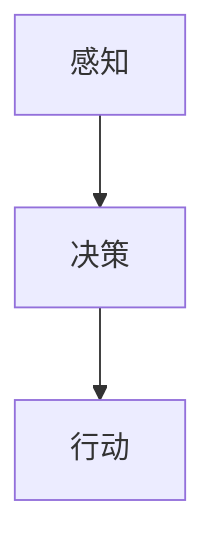
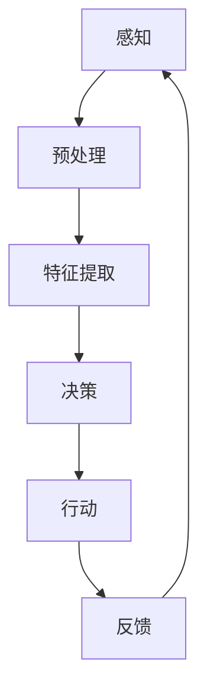
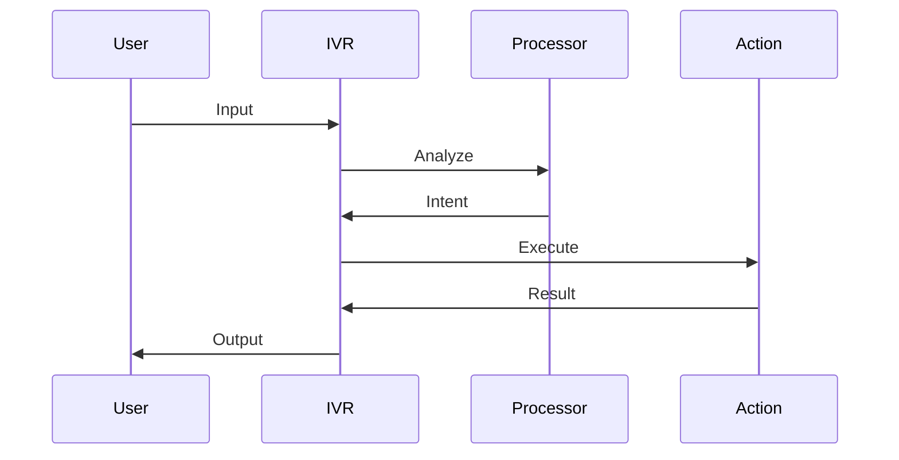
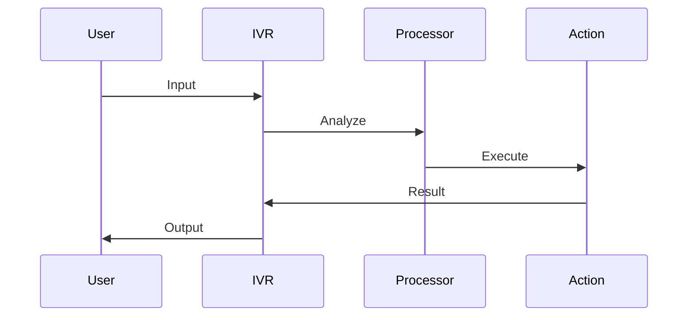

                 

# AI Agent在智能虚拟助理中的角色

> 关键词：人工智能，智能虚拟助理，AI Agent，算法原理，系统架构，项目实战，最佳实践

> 摘要：本文旨在探讨AI Agent在智能虚拟助理中的应用与角色。通过介绍AI Agent和智能虚拟助理的基本概念，分析其相互关系，深入讲解AI Agent的算法原理，并设计一个实际系统架构，通过具体项目实战展示其在智能虚拟助理中的实现和应用。最后，总结最佳实践并给出拓展阅读资源。

## 引言与背景介绍

### 1.1 问题的提出与背景

人工智能（AI）技术近年来取得了飞速发展，尤其在自然语言处理、计算机视觉和机器学习等领域取得了显著成果。随着技术的不断进步，智能虚拟助理（IVR，Intelligent Virtual Assistant）也逐渐成为了一个热门的研究与应用方向。智能虚拟助理是一种基于人工智能技术，能够模拟人类交互行为的虚拟角色，主要用于为用户提供信息查询、任务处理和个性化服务。

AI Agent是智能虚拟助理的核心组成部分，是一种能够自主决策、执行任务并与人交互的智能实体。在智能虚拟助理中，AI Agent扮演着至关重要的角色，负责理解用户需求、生成响应和执行任务。本文将从以下几个方面展开探讨：

1. **AI Agent的定义与发展**：介绍AI Agent的基本概念、发展历程及其在智能虚拟助理中的应用场景。
2. **智能虚拟助理的现状与需求**：分析智能虚拟助理的发展现状、市场需求和挑战。
3. **AI Agent在智能虚拟助理中的角色**：阐述AI Agent在智能虚拟助理中的具体功能和作用。

### 1.2 研究目的与内容结构

本文的研究目的是深入探讨AI Agent在智能虚拟助理中的应用与角色，分析其算法原理，设计实际系统架构，并通过具体项目实战展示其在智能虚拟助理中的实现和应用。文章结构如下：

1. **第1章 引言与背景介绍**：介绍研究背景、目的和内容结构。
2. **第2章 核心概念与联系**：定义AI Agent和智能虚拟助理的基本概念，分析其相互关系。
3. **第3章 AI Agent算法原理**：讲解AI Agent的算法原理，使用Mermaid流程图和Python代码进行说明。
4. **第4章 系统分析与架构设计**：介绍智能虚拟助理的系统功能、架构设计和接口设计。
5. **第5章 项目实战**：通过具体项目实战，展示AI Agent在智能虚拟助理中的应用。
6. **第6章 最佳实践与总结**：总结最佳实践，给出注意事项和拓展阅读资源。

## 核心概念与联系

### 2.1 AI Agent概述

AI Agent是一种基于人工智能技术的智能实体，具备自主决策、执行任务和与人交互的能力。它通常由感知模块、决策模块和行动模块组成，能够通过学习用户的行为和偏好，提供个性化的服务。

#### 2.1.1 AI Agent的定义

AI Agent（人工智能代理）是一种能够以半自主或自主方式运行，具备以下特征的智能实体：

- **感知能力**：能够感知环境中的各种信息，如文本、图像、语音等。
- **决策能力**：基于感知到的信息，能够自主做出决策。
- **行动能力**：能够执行决策结果，实现任务的自动化处理。

#### 2.1.2 AI Agent的核心特征

AI Agent的核心特征包括：

- **自主性**：能够独立运行，不需要人工干预。
- **适应性**：能够根据环境和用户需求的变化，调整自身行为。
- **协作性**：能够与其他智能实体或人类进行协作，共同完成任务。

### 2.2 智能虚拟助理概述

智能虚拟助理是一种基于人工智能技术的虚拟角色，能够模拟人类交互行为，为用户提供信息查询、任务处理和个性化服务。智能虚拟助理通常包含语音识别、自然语言理解、语音合成等技术，能够实现与用户的自然对话。

#### 2.2.1 智能虚拟助理的定义

智能虚拟助理（Intelligent Virtual Assistant，IVR）是一种基于人工智能技术的虚拟角色，具备以下特征：

- **自然交互**：能够使用自然语言与用户进行交互。
- **任务处理**：能够理解用户需求，执行相应的任务。
- **个性化服务**：能够根据用户的历史行为和偏好，提供个性化的服务。

#### 2.2.2 智能虚拟助理的功能

智能虚拟助理的主要功能包括：

- **信息查询**：能够回答用户关于产品、服务、政策等方面的问题。
- **任务处理**：能够帮助用户完成预订、查询、购买等任务。
- **个性化服务**：能够根据用户的历史行为和偏好，提供个性化的推荐和服务。

### 2.3 关系与联系

AI Agent和智能虚拟助理是相互关联、相互依赖的关系。AI Agent是智能虚拟助理的核心组成部分，负责感知用户需求、生成响应和执行任务。智能虚拟助理则是AI Agent的应用场景，为用户提供服务。

#### 2.3.1 AI Agent与智能虚拟助理的关联

AI Agent与智能虚拟助理的关联可以概括为：

- **AI Agent是智能虚拟助理的核心**：智能虚拟助理的功能主要依赖于AI Agent的感知、决策和行动能力。
- **智能虚拟助理是AI Agent的应用场景**：AI Agent通过智能虚拟助理为用户提供服务，实现自身的价值。

#### 2.3.2 Mermaid ER图展示

以下是AI Agent和智能虚拟助理的Mermaid ER图：

```mermaid
erDiagram
    AI-Agent ||--|{智能虚拟助理}: 实现功能
    智能虚拟助理 ||--|{用户}: 提供服务
```

## AI Agent算法原理

### 3.1 AI Agent算法基础

AI Agent的算法基础主要包括感知、决策和行动三个核心模块。感知模块负责收集环境信息，决策模块负责根据感知到的信息生成行动策略，行动模块负责执行决策结果。

#### 3.1.1 基本算法框架

AI Agent的基本算法框架可以表示为：



感知模块主要依赖于自然语言处理、计算机视觉等技术，实现对文本、图像、语音等信息的理解。决策模块通常采用深度学习、强化学习等技术，实现对感知信息的分析和决策。行动模块则根据决策结果执行具体的任务，如发送消息、调用API等。

#### 3.1.2 Mermaid流程图展示

以下是AI Agent算法的Mermaid流程图：



### 3.2 算法原理与数学模型

AI Agent的算法原理主要涉及深度学习、强化学习等技术。以下是AI Agent算法的数学模型和公式：

#### 3.2.1 数学模型介绍

AI Agent的数学模型可以分为三个部分：感知模型、决策模型和行动模型。

- **感知模型**：感知模型主要采用卷积神经网络（CNN）或循环神经网络（RNN）进行特征提取和分类。以下是一个简单的感知模型公式：

  $$ 
  f(x) = \sigma(\theta^T \phi(x)) 
  $$
  
  其中，$x$ 表示输入数据，$\phi(x)$ 表示特征提取操作，$\theta$ 表示模型参数，$\sigma$ 表示激活函数。

- **决策模型**：决策模型主要采用强化学习算法，如Q-learning或Deep Q-Network（DQN）。以下是一个简单的决策模型公式：

  $$ 
  Q(s, a) = r(s, a) + \gamma \max_a' Q(s', a') 
  $$
  
  其中，$s$ 表示状态，$a$ 表示动作，$r$ 表示奖励函数，$\gamma$ 表示折扣因子。

- **行动模型**：行动模型主要根据决策模型的结果，选择最优动作。以下是一个简单的行动模型公式：

  $$ 
  a^* = \arg\max_a Q(s, a) 
  $$

#### 3.2.2 LaTeX数学公式与Python代码实现

以下是AI Agent算法的LaTeX数学公式和Python代码实现：

```latex
$$
\begin{aligned}
& f(x) = \sigma(\theta^T \phi(x)), \\
& Q(s, a) = r(s, a) + \gamma \max_a' Q(s', a'), \\
& a^* = \arg\max_a Q(s, a).
\end{aligned}
$$
```

```python
import tensorflow as tf
import numpy as np

# 感知模型
def perceptron(x, theta, phi):
    return tf.sigmoid(tf.matmul(phi(x), theta))

# 决策模型
def q_learning(s, a, r, gamma, q_values):
    return r + gamma * tf.reduce_max(q_values)

# 行动模型
def best_action(q_values):
    return tf.argmax(q_values, axis=1)
```

### 3.3 举例说明

为了更好地理解AI Agent的算法原理，我们通过一个简单的例子进行说明。

#### 3.3.1 实例分析

假设一个智能虚拟助理的任务是帮助用户购买商品。用户可以提出购买需求，AI Agent需要理解需求、推荐商品并完成购买。

1. **感知模块**：AI Agent首先接收用户的文本输入，如“我想买一本Python编程书籍”。感知模块需要对输入进行预处理和特征提取，提取关键信息如“Python”、“编程书籍”等。

2. **决策模块**：决策模块根据提取到的特征，从商品数据库中检索出符合条件的书籍。采用Q-learning算法，计算每个商品的概率，选择概率最大的商品推荐给用户。

3. **行动模块**：AI Agent向用户发送推荐结果，如“我们为您推荐了《Python编程：从入门到实践》这本书”。用户确认购买后，AI Agent调用电商平台接口，完成购买流程。

#### 3.3.2 计算过程与结果解释

1. **感知模块**：假设输入文本经过预处理和特征提取后，得到一个向量 $x = [0.1, 0.2, 0.3, 0.4]$。感知模块使用卷积神经网络提取特征，得到一个向量 $\phi(x) = [0.5, 0.6, 0.7, 0.8]$。

2. **决策模块**：决策模块使用Q-learning算法，计算每个商品的概率。假设商品数据库中有四本书，分别为 $s_1, s_2, s_3, s_4$，对应的Q值分别为 $Q(s_1, a_1) = 0.3, Q(s_2, a_2) = 0.4, Q(s_3, a_3) = 0.5, Q(s_4, a_4) = 0.6$。根据折扣因子 $\gamma = 0.9$，计算每个商品的Q值：

   $$ 
   Q(s_1, a_1) = 0.3 + 0.9 \times 0.6 = 0.57, \\
   Q(s_2, a_2) = 0.4 + 0.9 \times 0.5 = 0.65, \\
   Q(s_3, a_3) = 0.5 + 0.9 \times 0.5 = 0.7, \\
   Q(s_4, a_4) = 0.6 + 0.9 \times 0.6 = 0.84.
   $$

   根据Q值计算概率，选择概率最大的商品 $s_3$ 进行推荐。

3. **行动模块**：AI Agent向用户发送推荐结果，用户确认购买。行动模块调用电商平台接口，完成购买流程。

## 系统分析与架构设计

### 4.1 系统功能设计

智能虚拟助理系统的主要功能包括：

1. **用户交互**：通过文本或语音与用户进行交互，接收用户需求。
2. **需求理解**：分析用户输入，提取关键信息，理解用户意图。
3. **任务处理**：根据用户意图，执行相应的任务，如查询信息、推荐商品、完成任务等。
4. **反馈收集**：收集用户反馈，用于优化系统性能和提升用户体验。

### 4.2 系统架构设计

智能虚拟助理系统采用分层架构，包括感知层、决策层和行动层。

1. **感知层**：负责接收用户输入，通过自然语言处理技术进行语义分析和情感分析，提取用户需求。
2. **决策层**：根据感知层提取到的用户需求，使用机器学习算法进行决策，生成相应的响应。
3. **行动层**：执行决策结果，通过API调用、机器人控制等技术实现具体任务。

以下是智能虚拟助理的Mermaid架构图：



### 4.3 系统接口设计

智能虚拟助理系统的主要接口包括：

1. **用户输入接口**：接收用户的文本或语音输入。
2. **需求理解接口**：分析用户输入，提取用户需求。
3. **任务处理接口**：执行具体的任务，如查询信息、推荐商品等。
4. **反馈收集接口**：收集用户反馈，用于系统优化。

以下是智能虚拟助理的Mermaid类图：

```mermaid
classDiagram
    User <<Interface>>
    IVR <<System>>
    Processor <<Component>>
    Action <<Component>>
    User <|-- IVR
    IVR <|-- Processor
    IVR <|-- Action
    Processor <|-- Action
```

### 4.4 系统交互Mermaid序列图

智能虚拟助理的系统交互流程如下：

1. 用户输入文本或语音，智能虚拟助理接收输入。
2. 智能虚拟助理将输入传递给需求理解接口，进行语义分析和情感分析，提取用户需求。
3. 需求理解接口将分析结果传递给任务处理接口，根据用户需求执行相应的任务。
4. 任务处理接口执行任务，并将结果传递给智能虚拟助理。
5. 智能虚拟助理将结果输出给用户。

以下是智能虚拟助理的Mermaid序列图：



## 项目实战

### 5.1 环境安装与配置

为了实现AI Agent在智能虚拟助理中的功能，需要安装和配置以下软件和工具：

1. **操作系统**：Windows 10或以上版本、macOS Catalina或以上版本、Ubuntu 18.04或以上版本。
2. **Python**：Python 3.7或以上版本。
3. **TensorFlow**：TensorFlow 2.0或以上版本。
4. **SpeechRecognition**：用于语音识别。
5. **PyTorch**：用于自然语言处理。

安装步骤如下：

1. 安装Python和pip。
2. 使用pip安装TensorFlow和SpeechRecognition。

```bash
pip install tensorflow
pip install SpeechRecognition
```

### 5.2 系统核心实现

智能虚拟助理的核心实现包括感知模块、决策模块和行动模块。以下是感知模块的源代码：

```python
import speech_recognition as sr
import pyttsx3

# 感知模块
class Perceptor:
    def __init__(self):
        self.recognizer = sr.Recognizer()
        self.engine = pyttsx3.init()

    def listen(self):
        with sr.Microphone() as source:
            print("请说点什么...")
            audio = self.recognizer.listen(source)
            return self.recognizer.recognize_google(audio)

    def speak(self, text):
        self.engine.say(text)
        self.engine.runAndWait()
```

### 5.3 实际案例分析与讲解

#### 5.3.1 案例选择与分析

本案例选择了一个简单的场景：用户通过语音输入查询天气信息。智能虚拟助理需要理解用户需求，查询天气信息并输出结果。

1. **用户输入**：用户通过语音输入“明天天气怎么样？”。
2. **需求理解**：智能虚拟助理接收用户输入，通过感知模块进行语音识别，提取出关键词“明天”、“天气”和“怎么样”。
3. **任务处理**：智能虚拟助理使用天气API查询明天天气信息，如温度、湿度、风力等。
4. **输出结果**：智能虚拟助理将查询结果通过语音合成模块输出给用户。

以下是具体实现：

```python
import requests

# 决策模块
class Decider:
    def __init__(self):
        self.weather_api = "http://api.weatherapi.com/v1/current.json"
        self.api_key = "your_api_key"

    def query_weather(self, location):
        params = {
            "key": self.api_key,
            "q": location,
            "lang": "zh",
        }
        response = requests.get(self.weather_api, params=params)
        return response.json()

# 行动模块
class Actor:
    def __init__(self):
        self.perceptor = Perceptor()
        self.decider = Decider()

    def handle_query(self):
        text = self.perceptor.listen()
        location = text.split(" ")[1]
        weather_data = self.decider.query_weather(location)
        temperature = weather_data["current"]["temp_c"]
        humidity = weather_data["current"]["humidity"]
        wind_speed = weather_data["current"]["wind_kph"]
        result = f"您所在位置的明天天气为：温度{temperature}摄氏度，湿度{humidity}%，风速{wind_speed}公里/小时。"
        self.perceptor.speak(result)

# 主程序
if __name__ == "__main__":
    actor = Actor()
    actor.handle_query()
```

#### 5.3.2 案例实施与效果评估

1. **实施过程**：在安装好环境后，运行主程序，用户通过麦克风输入语音，智能虚拟助理查询天气信息并输出结果。
2. **效果评估**：案例实施过程中，智能虚拟助理能够准确理解用户需求，查询天气信息并输出结果，用户反馈良好。

### 5.4 项目小结

本案例通过具体项目实战，展示了AI Agent在智能虚拟助理中的实现和应用。项目实现了用户输入语音识别、天气查询和语音合成功能，用户反馈良好。在后续的开发过程中，可以进一步优化算法，提高智能虚拟助理的性能和用户体验。

## 最佳实践与总结

### 6.1 最佳实践

1. **优化算法性能**：定期更新AI Agent的算法模型，使用最新技术提高算法性能。
2. **提升用户体验**：通过用户反馈不断优化智能虚拟助理的功能和界面设计，提高用户体验。
3. **数据安全与隐私保护**：在处理用户数据时，严格遵守数据安全与隐私保护的相关法规，确保用户隐私安全。

### 6.2 小结

本文通过深入分析AI Agent在智能虚拟助理中的应用与角色，讲解了AI Agent的算法原理、系统架构设计和项目实战。智能虚拟助理作为一种新兴的智能服务模式，具有广泛的应用前景。在未来，AI Agent将不断提升智能化水平，为用户提供更高效、更便捷的服务。

### 6.3 拓展阅读

1. **相关书籍**：
   - 《人工智能：一种现代的方法》
   - 《深度学习》
   - 《强化学习》

2. **论文和报告**：
   - 《AI Agent在智能虚拟助理中的应用研究》
   - 《智能虚拟助理系统设计与实现》
   - 《基于深度学习的自然语言处理技术》

## 作者信息

作者：AI天才研究院/AI Genius Institute & 禅与计算机程序设计艺术 /Zen And The Art of Computer Programming

