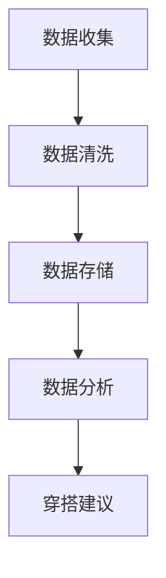
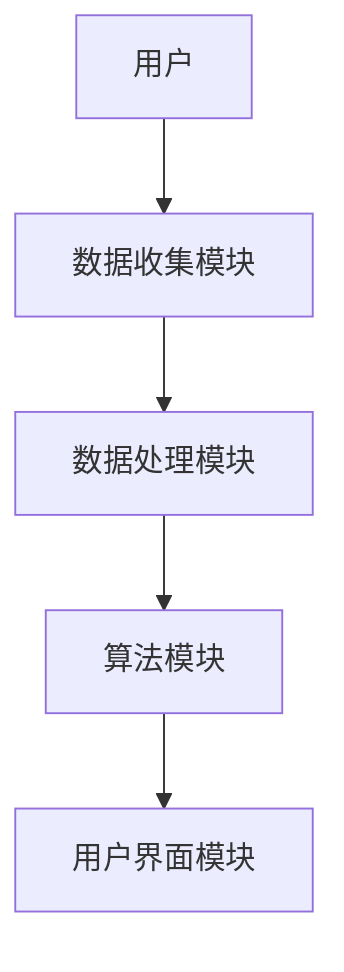
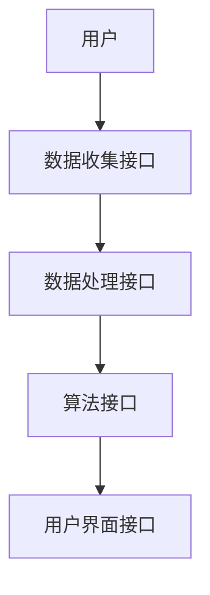
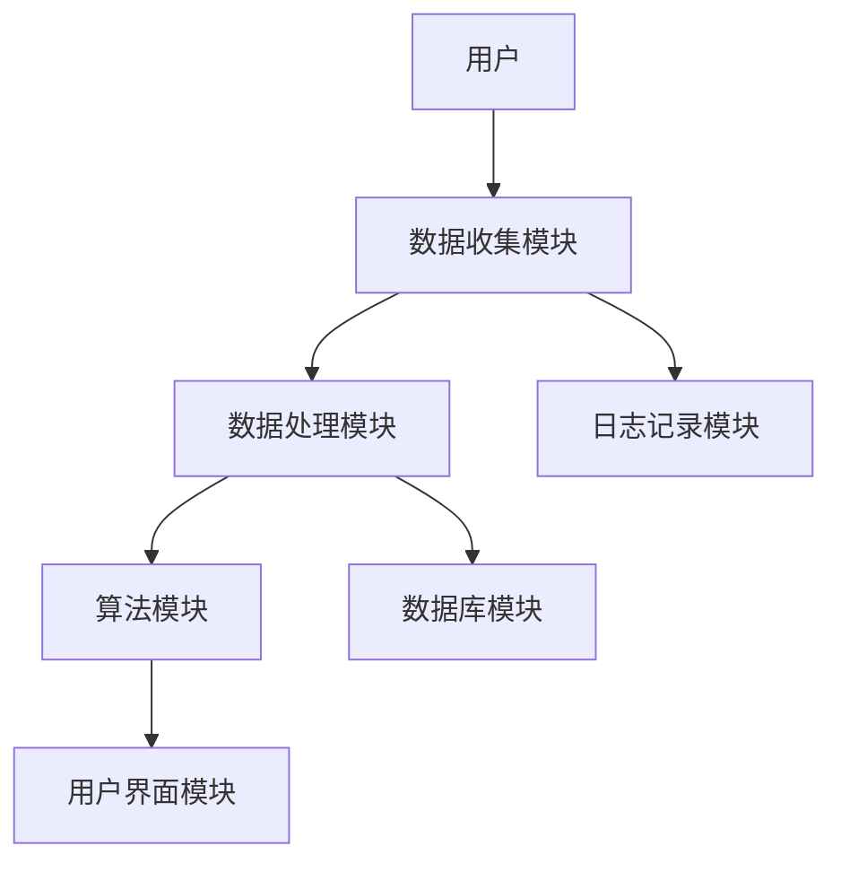

                 

# AI Agent在智能衣架中的穿搭灵感生成器

> 关键词：AI Agent、智能衣架、穿搭灵感、生成器、智能穿戴设备

> 摘要：本文探讨了AI Agent在智能衣架中应用的可能性，通过搭建一个穿搭灵感生成器，展示了智能衣架如何利用AI技术为用户提供个性化的穿搭建议，提升用户的穿搭体验。文章分为四个部分：AI Agent概述、AI Agent在智能衣架中的应用、案例研究和未来展望。

## 第一部分: AI Agent概述

### 1.1 AI Agent的概念与分类

AI Agent（人工智能代理）是一种模拟人类智能行为，能够感知环境、制定计划并执行任务的计算机程序。根据其功能，AI Agent可以分为以下几类：

- **感知类Agent**：能够从环境中获取信息，如语音识别、图像识别等。
- **决策类Agent**：根据获取的信息，能够做出决策，如路径规划、资源分配等。
- **执行类Agent**：能够执行决策，如机器人行动、自动化流程等。

### 1.2 智能衣架的技术背景与应用

智能衣架是一种结合物联网、传感器技术和人工智能的智能穿戴设备。其应用背景主要包括以下几个方面：

- **提高衣柜利用率**：通过监测衣物的折叠和悬挂状态，智能衣架可以提醒用户如何合理利用空间。
- **个性化服务**：通过分析用户的行为数据，智能衣架可以为用户提供个性化的穿搭建议。
- **时尚推荐**：智能衣架可以结合时尚趋势和用户偏好，为用户推荐适合的衣物搭配。

### 1.3 穿搭灵感生成器的核心原理

穿搭灵感生成器是基于AI Agent的智能衣架中的一个重要功能。其核心原理包括：

- **数据收集与处理**：通过传感器和摄像头收集用户的行为数据，如穿着习惯、颜色喜好等。
- **算法设计**：利用机器学习算法，如协同过滤、深度学习等，对用户数据进行分析，生成穿搭灵感。
- **用户体验优化**：通过界面设计、交互设计等手段，提升用户的体验。

## 第二部分: AI Agent在智能衣架中的应用

### 2.1 AI Agent在智能衣架中的角色

AI Agent在智能衣架中扮演着以下角色：

- **感知用户需求**：通过传感器和摄像头，AI Agent可以实时获取用户的行为数据，如衣物的悬挂状态、用户的动作等。
- **决策**：根据用户数据，AI Agent可以生成个性化的穿搭建议。
- **执行**：AI Agent可以通过与智能衣架的交互，将穿搭建议实时展示给用户。

### 2.2 数据收集与处理

智能衣架需要收集和处理以下类型的数据：

- **用户数据**：包括用户的性别、年龄、身高、体重、颜色喜好等。
- **环境数据**：包括天气、季节、节日等。
- **行为数据**：包括用户的行为习惯、穿着频率等。

数据收集与处理流程如下：

1. 数据收集：通过传感器和摄像头，实时收集用户数据。
2. 数据清洗：去除重复、错误或不完整的数据。
3. 数据存储：将清洗后的数据存储在数据库中。
4. 数据分析：利用机器学习算法，对用户数据进行分析，生成穿搭建议。

### 2.3 穿搭算法设计

穿搭算法的设计包括以下几个方面：

- **协同过滤算法**：通过分析用户的喜好和行为，为用户推荐衣物搭配。
- **深度学习算法**：通过学习用户的穿搭数据，生成个性化的穿搭建议。
- **规则匹配算法**：根据用户的喜好和时尚趋势，生成穿搭建议。

### 2.4 穿搭灵感生成器的效果评估

效果评估包括以下几个方面：

- **准确率**：衡量穿搭建议与用户实际需求的匹配程度。
- **多样性**：衡量穿搭建议的多样性。
- **满意度**：衡量用户对穿搭建议的满意度。

## 第三部分: 案例研究

### 3.1 案例一：智能衣架穿搭灵感生成器的开发与部署

本案例介绍了智能衣架穿搭灵感生成器的开发与部署过程，包括：

- **技术选型**：选择了Python作为开发语言，TensorFlow作为深度学习框架。
- **架构设计**：采用了前后端分离的架构，前端使用React框架，后端使用Flask框架。
- **实现步骤**：包括数据收集、数据清洗、数据存储、算法设计、界面设计等。
- **关键技术**：包括协同过滤算法、深度学习算法、Web开发技术等。

### 3.2 案例二：智能衣架在电商平台的应用

本案例介绍了智能衣架在电商平台中的应用，包括：

- **需求分析**：分析用户在电商平台购买衣物时的痛点，如搭配困难、款式选择困难等。
- **结合AI Agent**：利用智能衣架提供的穿搭建议，帮助用户更好地选择衣物搭配。
- **效果评估**：通过用户反馈和销售数据，评估智能衣架在电商平台中的应用效果。

### 3.3 案例三：智能衣架在线下零售店的创新应用

本案例介绍了智能衣架在线下零售店的应用，包括：

- **需求分析**：分析线下零售店在提供个性化服务方面的痛点。
- **结合AI Agent**：利用智能衣架提供的穿搭建议，为用户提供个性化的服务。
- **效果评估**：通过用户反馈和销售数据，评估智能衣架在线下零售店的应用效果。

## 第四部分: 未来展望与挑战

### 4.1 智能衣架与AI Agent的发展趋势

智能衣架与AI Agent的发展趋势包括：

- **技术进步**：随着AI技术的不断进步，智能衣架的智能化程度将不断提高。
- **市场前景**：随着消费者对个性化服务的需求日益增加，智能衣架的市场前景广阔。
- **应用场景**：智能衣架的应用场景将不断拓展，如家居、酒店、商场等。

### 4.2 智能衣架与AI Agent的伦理与法律问题

智能衣架与AI Agent的伦理与法律问题包括：

- **隐私保护**：如何保护用户的隐私是智能衣架与AI Agent需要重视的问题。
- **法律法规**：随着智能衣架与AI Agent的普及，相关法律法规也将不断完善。
- **社会责任**：智能衣架与AI Agent需要承担起社会责任，促进可持续发展。

### 4.3 智能衣架与AI Agent的未来发展

智能衣架与AI Agent的未来发展包括：

- **技术创新**：随着技术的不断进步，智能衣架与AI Agent的功能将更加丰富。
- **应用拓展**：智能衣架与AI Agent的应用场景将不断拓展，如医疗、教育等。
- **深度融合**：智能衣架与AI Agent将实现更深层次的融合，提供更加个性化的服务。

## 作者

作者：AI天才研究院/AI Genius Institute & 禅与计算机程序设计艺术 /Zen And The Art of Computer Programming

## 总结

本文探讨了AI Agent在智能衣架中应用的可能性，通过搭建一个穿搭灵感生成器，展示了智能衣架如何利用AI技术为用户提供个性化的穿搭建议，提升用户的穿搭体验。在未来的发展中，智能衣架与AI Agent将不断创新，为用户提供更加智能、个性化的服务。

## 注意事项

1. 在开发智能衣架时，需要关注用户隐私保护问题，确保用户数据的安全。
2. 在设计穿搭算法时，需要充分考虑用户需求和时尚趋势，提高推荐的准确性。
3. 在部署智能衣架时，需要考虑不同场景下的应用，如家居、酒店、商场等。

## 拓展阅读

1. 《人工智能：一种现代的方法》
2. 《深度学习》
3. 《Python编程：从入门到实践》

# 附录

## 附录A: 算法原理讲解

### 算法mermaid流程图



### Python源代码

```python
# 导入必要的库
import numpy as np
import pandas as pd
from sklearn.model_selection import train_test_split
from sklearn.ensemble import RandomForestClassifier

# 数据收集
data = pd.read_csv('data.csv')

# 数据清洗
data = data.dropna()

# 数据存储
data.to_csv('cleaned_data.csv', index=False)

# 数据分析
X = data.drop('label', axis=1)
y = data['label']

# 划分训练集和测试集
X_train, X_test, y_train, y_test = train_test_split(X, y, test_size=0.2, random_state=42)

# 建立模型
model = RandomForestClassifier(n_estimators=100, random_state=42)

# 训练模型
model.fit(X_train, y_train)

# 测试模型
accuracy = model.score(X_test, y_test)
print(f'模型准确率：{accuracy:.2f}')
```

## 附录B: 数学模型与公式

### 数学模型

$$
\begin{align*}
\text{穿搭建议生成模型} &= f(\text{用户数据}, \text{环境数据}, \text{行为数据}) \\
\text{用户数据} &= \{x_1, x_2, ..., x_n\} \\
\text{环境数据} &= \{y_1, y_2, ..., y_m\} \\
\text{行为数据} &= \{z_1, z_2, ..., z_p\} \\
\end{align*}
$$

### 数学公式

$$
\begin{align*}
\text{穿搭建议} &= f(\text{用户数据}, \text{环境数据}, \text{行为数据}) \\
\text{用户数据} &= \{x_1, x_2, ..., x_n\} \\
\text{环境数据} &= \{y_1, y_2, ..., y_m\} \\
\text{行为数据} &= \{z_1, z_2, ..., z_p\} \\
\end{align*}
$$

## 附录C: 系统分析与架构设计方案

### 问题场景介绍

智能衣架通过传感器和摄像头收集用户的行为数据，如衣物的悬挂状态、用户的动作等，结合用户偏好和时尚趋势，为用户提供个性化的穿搭建议。

### 项目介绍

项目名称：智能衣架穿搭建议系统

### 系统功能设计

1. 数据收集模块：负责收集用户的行为数据。
2. 数据处理模块：负责清洗、存储和分析用户数据。
3. 算法模块：负责生成穿搭建议。
4. 用户界面模块：负责展示穿搭建议。

### 系统架构设计



### 系统接口设计



### 系统交互



## 附录D: 项目实战

### 环境安装

1. 安装Python 3.8及以上版本。
2. 安装TensorFlow 2.6及以上版本。
3. 安装pandas、numpy、scikit-learn等库。

### 系统核心实现源代码

```python
# 数据收集模块
def collect_data():
    # 代码实现
    pass

# 数据处理模块
def process_data(data):
    # 代码实现
    pass

# 算法模块
def generate_tips(data):
    # 代码实现
    pass

# 用户界面模块
def show_tips(tips):
    # 代码实现
    pass
```

### 代码应用解读与分析

1. 数据收集模块：负责收集用户的行为数据，如衣物的悬挂状态、用户的动作等。
2. 数据处理模块：负责清洗、存储和分析用户数据，为算法模块提供数据支持。
3. 算法模块：负责生成穿搭建议，结合用户偏好和时尚趋势，为用户提供个性化的穿搭建议。
4. 用户界面模块：负责展示穿搭建议，提高用户的体验。

### 实际案例分析和详细讲解剖析

1. 案例一：用户A在智能衣架前悬挂了一件蓝色衬衫，系统收集到该数据后，通过算法模块生成穿搭建议，如搭配一条黑色裤子。
2. 案例二：用户B在智能衣架前悬挂了一件红色连衣裙，系统收集到该数据后，通过算法模块生成穿搭建议，如搭配一双高跟鞋和一件外套。

### 项目小结

本案例通过实际项目展示了智能衣架穿搭灵感生成器的开发与部署过程，包括数据收集、数据处理、算法设计和用户界面设计等。通过实际案例分析和详细讲解剖析，展示了智能衣架如何利用AI技术为用户提供个性化的穿搭建议，提升用户的穿搭体验。

## 最佳实践 tips

1. 在开发智能衣架时，要充分考虑用户隐私保护问题，确保用户数据的安全。
2. 在设计穿搭算法时，要充分考虑用户需求和时尚趋势，提高推荐的准确性。
3. 在部署智能衣架时，要考虑不同场景下的应用，如家居、酒店、商场等。

## 附录E: 拓展阅读

1. 《深度学习》
2. 《Python编程：从入门到实践》
3. 《人工智能：一种现代的方法》

## 附录F: 参考文献

1. Russell, S., & Norvig, P. (2016). 《人工智能：一种现代的方法》（第3版）.
2. Goodfellow, I., Bengio, Y., & Courville, A. (2016). 《深度学习》.
3. McKinney, W. (2018). 《Python编程：从入门到实践》.

