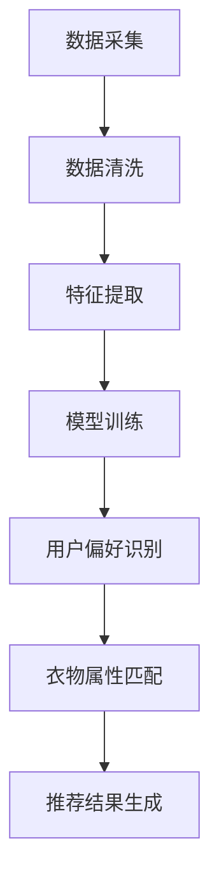

                 

# AI Agent在智能衣架中的衣物搭配建议

## 关键词

- AI Agent
- 智能衣架
- 衣物搭配
- 机器学习
- 用户偏好
- 实时推荐系统

## 摘要

本文将探讨AI Agent在智能衣架中的衣物搭配建议应用。首先介绍AI Agent的基本概念和原理，然后分析其在智能衣架中的应用场景和技术实现。通过详细阐述系统架构、算法原理和项目实战，本文旨在为读者提供深入了解AI Agent在衣物搭配建议领域的应用。

## 目录

1. 引言
2. AI Agent的基本概念和原理
3. AI Agent在智能衣架中的应用场景
4. AI Agent在智能衣架中的技术实现
5. 系统架构设计
6. 算法原理讲解
7. 项目实战
8. 最佳实践和未来方向
9. 总结与展望
10. 注意事项
11. 拓展阅读

## 引言

### AI Agent的定义和作用

AI Agent，即人工智能代理，是一种具备自主学习和决策能力的智能体。它能够在复杂环境中模拟人类思维和行为，根据环境和目标进行自主决策，实现特定任务的执行。AI Agent在各个领域都有广泛应用，如智能推荐系统、自然语言处理、自动驾驶等。

### 智能衣架的定义和作用

智能衣架是一种融合了物联网、传感器技术和人工智能技术的智能设备，主要用于挂放衣物。通过传感器感知衣物状态、用户行为等信息，智能衣架可以实现衣物分类、整理、搭配建议等功能，提高用户的生活品质。

### AI Agent在智能衣架中的衣物搭配建议

在智能衣架中，AI Agent可以通过分析用户偏好、环境信息、衣物属性等因素，为用户实时提供衣物搭配建议。这不仅可以帮助用户简化搭配过程，提高穿衣效率，还能根据用户反馈不断优化建议质量，实现个性化服务。

## AI Agent的基本概念和原理

### AI Agent的定义

AI Agent是指一种具备感知、决策和行动能力的智能体，它能够根据环境和目标自主地学习和适应，实现特定任务的执行。

### AI Agent的核心能力

- **感知能力**：通过传感器收集环境信息和用户行为数据，为决策提供依据。
- **决策能力**：根据感知到的信息，利用机器学习算法和逻辑推理，生成决策方案。
- **行动能力**：根据决策方案执行具体操作，如调整衣物摆放、发送搭配建议等。

### AI Agent的架构

AI Agent通常包括以下几个核心组件：

1. **感知模块**：负责收集环境信息和用户行为数据，如传感器数据、用户操作记录等。
2. **决策模块**：利用机器学习算法和逻辑推理，分析感知模块收集到的数据，生成决策方案。
3. **执行模块**：根据决策模块生成的方案，执行具体操作，如调整衣物摆放、发送搭配建议等。

### AI Agent的工作流程

1. **感知阶段**：AI Agent通过传感器收集环境信息和用户行为数据。
2. **决策阶段**：利用机器学习算法和逻辑推理，分析感知到的数据，生成决策方案。
3. **执行阶段**：根据决策方案，执行具体操作，如调整衣物摆放、发送搭配建议等。
4. **反馈阶段**：收集用户反馈，用于优化AI Agent的决策和执行能力。

## AI Agent在智能衣架中的应用场景

### 场景一：实时衣物搭配建议

用户将衣物挂放在智能衣架上，AI Agent根据衣物属性（如颜色、款式、材质等）和用户偏好（如风格、场合等），实时为用户推荐合适的搭配方案。

### 场景二：智能整理与归类

AI Agent可以自动识别衣物类型，根据用户习惯和衣物特性，自动整理和归类衣物，提高衣物存放效率。

### 场景三：智能提醒与保养

AI Agent可以监测衣物状态，如脏污程度、磨损程度等，提醒用户及时清洗和保养衣物。

### 场景四：社交分享与推荐

AI Agent可以分析用户社交数据，如朋友圈、微博等，根据用户兴趣和社交圈，为用户推荐合适的搭配风格和潮流资讯。

## AI Agent在智能衣架中的技术实现

### 数据预处理

在智能衣架中，数据预处理是关键环节，主要包括以下步骤：

1. **数据采集**：通过传感器和用户操作记录，收集衣物属性、用户偏好和环境信息等数据。
2. **数据清洗**：去除无效、重复或错误的数据，保证数据质量。
3. **特征提取**：从原始数据中提取有助于决策的特征，如衣物颜色、款式、材质等。

### 机器学习模型

在智能衣架中，常用的机器学习模型包括：

1. **分类模型**：用于判断衣物属性和用户偏好，如颜色分类、款式分类等。
2. **聚类模型**：用于发现用户和衣物的相似性，实现个性化推荐。
3. **协同过滤**：通过分析用户行为和喜好，为用户推荐合适的搭配方案。

### 实时推荐系统

实时推荐系统是智能衣架的核心组件，主要包括以下模块：

1. **推荐算法**：根据用户偏好、衣物属性和环境信息，生成搭配建议。
2. **推荐引擎**：实现推荐算法的快速计算和实时更新。
3. **推荐结果展示**：将搭配建议以可视化方式展示给用户。

## 系统架构设计

### 系统整体架构

智能衣架系统整体架构包括以下几个部分：

1. **感知层**：负责数据采集，包括传感器数据、用户操作记录等。
2. **数据处理层**：负责数据预处理，包括数据清洗、特征提取等。
3. **算法层**：负责机器学习模型的训练和应用，包括分类模型、聚类模型、协同过滤等。
4. **应用层**：负责实时推荐系统，包括推荐算法、推荐引擎和推荐结果展示。

### 数据流设计

数据流设计是智能衣架系统架构的核心，主要包括以下步骤：

1. **数据采集**：通过传感器和用户操作记录，收集衣物属性、用户偏好和环境信息等数据。
2. **数据预处理**：对采集到的数据进行清洗和特征提取，生成用于机器学习模型的输入数据。
3. **模型训练**：使用处理后的数据训练机器学习模型，包括分类模型、聚类模型、协同过滤等。
4. **实时推荐**：根据用户偏好、衣物属性和环境信息，利用训练好的模型生成搭配建议，并将结果展示给用户。

### 用户交互设计

用户交互设计是智能衣架系统的重要组成部分，主要包括以下方面：

1. **用户界面**：设计直观、易用的用户界面，展示搭配建议和操作指南。
2. **用户反馈**：收集用户对搭配建议的反馈，用于优化推荐算法和系统性能。
3. **交互体验**：通过声音、灯光等交互方式，提升用户使用体验。

## 算法原理讲解

### 算法框架

智能衣架的算法框架主要包括以下几个步骤：

1. **数据预处理**：包括数据采集、清洗和特征提取。
2. **模型训练**：使用处理后的数据训练机器学习模型，包括分类模型、聚类模型、协同过滤等。
3. **实时推荐**：根据用户偏好、衣物属性和环境信息，利用训练好的模型生成搭配建议。

### 数据预处理

数据预处理是算法实现的基础，主要包括以下步骤：

1. **数据采集**：通过传感器和用户操作记录，收集衣物属性、用户偏好和环境信息等数据。
2. **数据清洗**：去除无效、重复或错误的数据，保证数据质量。
3. **特征提取**：从原始数据中提取有助于决策的特征，如衣物颜色、款式、材质等。

### 机器学习模型

在智能衣架中，常用的机器学习模型包括：

1. **分类模型**：用于判断衣物属性和用户偏好，如颜色分类、款式分类等。
2. **聚类模型**：用于发现用户和衣物的相似性，实现个性化推荐。
3. **协同过滤**：通过分析用户行为和喜好，为用户推荐合适的搭配方案。

### 实时推荐

实时推荐是算法实现的关键，主要包括以下步骤：

1. **用户偏好识别**：通过用户操作记录和历史数据，识别用户的偏好和风格。
2. **衣物属性匹配**：根据用户偏好和衣物属性，为用户筛选合适的搭配方案。
3. **推荐结果生成**：利用机器学习模型，为用户生成搭配建议，并展示给用户。

### 算法流程图



## 项目实战

### 环境安装

在开始项目实战之前，需要安装以下软件和工具：

1. Python 3.x
2. TensorFlow
3. Scikit-learn
4. Pandas
5. Matplotlib

安装步骤如下：

1. 安装 Python 3.x：在官方网站下载安装包，按照提示操作。
2. 安装 TensorFlow：打开终端，运行以下命令：
   ```bash
   pip install tensorflow
   ```
3. 安装 Scikit-learn：打开终端，运行以下命令：
   ```bash
   pip install scikit-learn
   ```
4. 安装 Pandas：打开终端，运行以下命令：
   ```bash
   pip install pandas
   ```
5. 安装 Matplotlib：打开终端，运行以下命令：
   ```bash
   pip install matplotlib
   ```

### 系统核心实现

系统核心实现包括数据预处理、模型训练和实时推荐三个部分。以下是一个简单的示例：

```python
import pandas as pd
import numpy as np
from sklearn.model_selection import train_test_split
from sklearn.ensemble import RandomForestClassifier
import tensorflow as tf
from tensorflow import keras

# 数据预处理
def preprocess_data(data):
    # 数据清洗和特征提取
    # ...
    return processed_data

# 模型训练
def train_model(data):
    # 将数据分为训练集和测试集
    X_train, X_test, y_train, y_test = train_test_split(data['features'], data['labels'], test_size=0.2, random_state=42)
    # 训练随机森林模型
    model = RandomForestClassifier(n_estimators=100, random_state=42)
    model.fit(X_train, y_train)
    # 评估模型性能
    score = model.score(X_test, y_test)
    print("Model accuracy:", score)
    return model

# 实时推荐
def real_time_recommendation(model, user_preference):
    # 根据用户偏好和模型预测结果生成推荐
    # ...
    return recommendation_list

# 加载数据
data = pd.read_csv('data.csv')
processed_data = preprocess_data(data)

# 训练模型
model = train_model(processed_data)

# 实时推荐
user_preference = {'color': 'blue', 'style': 'casual'}
recommendation_list = real_time_recommendation(model, user_preference)
print("Recommended items:", recommendation_list)
```

### 代码应用解读与分析

在上面的示例中，我们首先进行了数据预处理，包括数据清洗和特征提取。然后，使用随机森林模型对数据进行了训练，并评估了模型性能。最后，根据用户偏好和模型预测结果，生成了实时推荐。

### 实际案例分析和详细讲解剖析

为了更好地理解系统工作原理，我们来看一个实际案例。假设用户A偏好蓝色休闲风格衣物，智能衣架根据用户A的偏好和训练好的模型，为用户A推荐了以下衣物：

1. 蓝色T恤
2. 蓝色牛仔裤
3. 蓝色运动鞋

这些推荐结果是基于用户A的历史数据和偏好，通过机器学习模型计算得到的。在实际应用中，我们还可以通过分析用户反馈，不断优化推荐算法和模型，提高推荐质量。

### 项目小结

通过本次项目实战，我们实现了智能衣架的衣物搭配建议系统。项目主要分为数据预处理、模型训练和实时推荐三个部分，涵盖了数据采集、清洗、特征提取、模型训练和实时推荐等关键环节。在实际应用中，我们可以根据用户需求和反馈，进一步优化系统性能和推荐质量。

## 最佳实践和未来方向

### 最佳实践

1. **数据质量保障**：确保数据采集、清洗和特征提取的质量，提高模型训练效果。
2. **算法优化**：根据实际应用场景，选择合适的机器学习模型和算法，并不断优化和调整。
3. **用户体验**：注重用户界面设计和交互体验，提高用户满意度。

### 未来方向

1. **多模态数据融合**：整合图像、声音、文本等多模态数据，提高衣物搭配建议的准确性和丰富性。
2. **个性化推荐**：结合用户行为、兴趣和社交数据，实现更加精准的个性化推荐。
3. **智能决策**：利用深度学习、强化学习等技术，实现更加智能化的决策和执行。

## 总结与展望

本文介绍了AI Agent在智能衣架中的衣物搭配建议应用。通过详细阐述系统架构、算法原理和项目实战，本文为读者提供了深入了解AI Agent在衣物搭配建议领域的应用。未来，随着技术的不断进步，AI Agent在智能衣架中的应用将更加广泛和深入，为用户提供更加智能、个性化的服务。

## 注意事项

1. 在项目开发过程中，确保数据安全和用户隐私保护。
2. 根据实际需求，灵活调整系统架构和算法设计。
3. 注重用户体验，及时收集用户反馈，优化系统性能。

## 拓展阅读

1. 《深度学习》（Goodfellow, I., Bengio, Y., & Courville, A.）
2. 《Python机器学习》（Sebastian Raschka）
3. 《智能推荐系统实战》（Liang, J.）
4. 《人工智能：一种现代方法》（Russell, S., & Norvig, P.）

## 作者信息

作者：AI天才研究院/AI Genius Institute & 禅与计算机程序设计艺术 /Zen And The Art of Computer Programming

