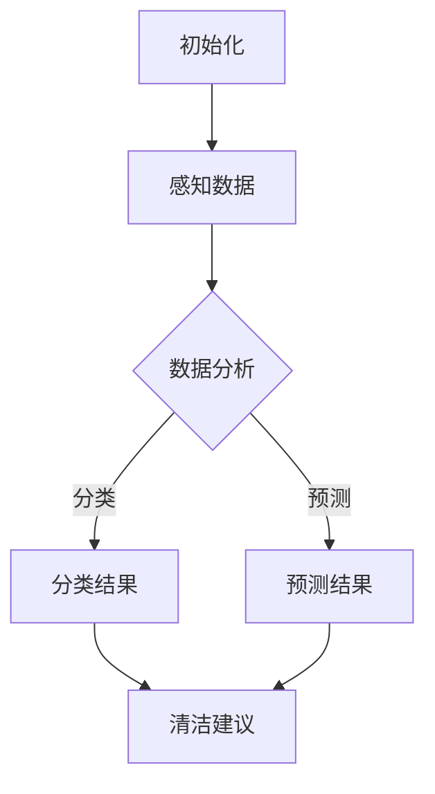
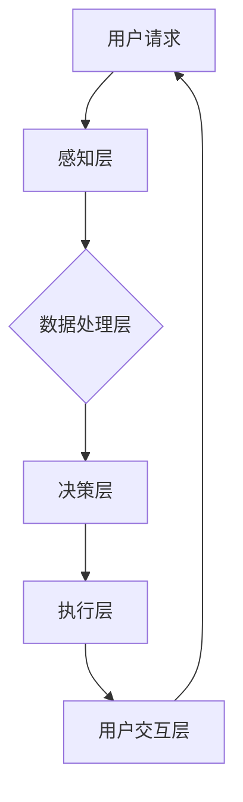

                 

### 第一部分: 背景介绍与核心概念

#### 第1章: 问题的背景与概述

在当今的快节奏生活中，衣物清洁成为了日常生活中的一个重要环节。然而，传统的衣物清洁方法往往存在诸多问题，如清洁效果不佳、手工操作繁琐、易造成衣物损伤等。为了解决这些问题，智能衣架的概念应运而生。智能衣架不仅能够提高衣物清洁效果，还能提供个性化清洁建议，从而更好地满足用户的需求。

##### 1.1 问题的背景

随着人工智能技术的不断发展，它在各个行业的应用越来越广泛。特别是在服装行业，人工智能技术被广泛应用于衣物设计、生产、销售和清洁等方面。然而，传统的衣物清洁方法往往依赖于人工操作，效率低下且效果不尽如人意。这不仅增加了用户的时间和劳动成本，还可能对衣物造成损伤。

##### 1.2 问题描述

如何在智能衣架中实现高效的衣物清洁效果，并提供个性化的清洁建议，是当前亟需解决的问题。用户在日常生活中面临的主要问题包括：

- **清洁效果不佳**：传统的衣物清洁方法难以达到用户期望的清洁效果，特别是对于污渍严重的衣物。
- **操作繁琐**：手动清洁衣物需要耗费大量时间和劳动力，用户往往感到疲惫和不便。
- **易造成衣物损伤**：不恰当的清洁方法可能会对衣物造成损伤，影响衣物的使用寿命。

##### 1.3 问题解决

为了解决上述问题，我们可以引入AI Agent。AI Agent是一种能够自主学习和决策的人工智能系统，它可以在智能衣架中实时监测衣物状态，并根据衣物的材质、污渍类型和用户偏好等因素，提供个性化的清洁建议。AI Agent不仅可以提高清洁效果，还能减少操作繁琐，降低衣物损伤的风险。

##### 1.4 边界与外延

智能衣架的技术要求包括以下几个方面：

- **感知技术**：智能衣架需要具备对衣物状态的感知能力，如温度、湿度、污渍程度等。
- **数据处理能力**：智能衣架需要具备强大的数据处理能力，以便对收集到的衣物数据进行实时分析和处理。
- **用户交互**：智能衣架需要具备与用户的交互能力，如语音交互、触屏操作等。

用户需求与市场定位：

- **用户需求**：用户希望智能衣架能够提供高效的清洁效果，且操作简便，同时能够根据用户偏好提供个性化的清洁建议。
- **市场定位**：智能衣架的目标市场主要面向中高端消费群体，他们更注重生活品质和便利性。

##### 1.5 概念结构与核心要素组成

智能衣架中的核心概念和要素主要包括：

- **AI Agent**：负责提供衣物清洁建议和实时监测衣物状态。
- **智能衣架**：硬件设备，包括传感器、执行器等，用于感知和执行清洁任务。
- **用户数据**：用户的衣物偏好、衣物材质、污渍类型等数据，用于训练和优化AI Agent。
- **算法模型**：用于分析用户数据和衣物状态，生成个性化的清洁建议。

通过上述核心概念和要素的有机组合，智能衣架能够为用户提供高效的衣物清洁服务，提高用户的生活品质。

#### 第2章: AI Agent的基本概念与原理

##### 2.1 AI Agent的定义

AI Agent，即人工智能代理，是一种能够自主学习和决策的人工智能系统。它模仿人类的思维和行为方式，通过感知环境、分析数据、制定决策和执行任务，从而实现自主行动和智能交互。AI Agent的核心特点包括自主性、适应性和交互性。

- **自主性**：AI Agent能够独立完成特定任务，无需人工干预。
- **适应性**：AI Agent能够根据环境变化和任务需求，自主调整行为策略。
- **交互性**：AI Agent能够与用户和环境进行实时交互，获取信息和反馈。

##### 2.2 AI Agent的工作原理

AI Agent的工作原理主要包括以下几个步骤：

1. **感知**：AI Agent通过传感器感知环境中的信息，如视觉、听觉、触觉等。
2. **分析**：AI Agent对感知到的信息进行分析和处理，识别出有用的数据。
3. **决策**：根据分析结果，AI Agent制定相应的行动策略，选择最佳行动方案。
4. **执行**：AI Agent执行决策方案，实现预期的目标。
5. **反馈**：AI Agent对执行结果进行评估和反馈，根据反馈调整后续行为。

##### 2.3 AI Agent的分类

AI Agent可以根据不同的分类标准进行分类。以下是几种常见的分类方式：

1. **按功能分类**：
   - **反应型Agent**：仅根据当前环境信息做出反应，不涉及历史信息和长期目标。
   - **目标型Agent**：具有明确的目标，根据目标进行决策和行动。
   - **感知-行动型Agent**：同时考虑当前环境和历史信息，进行更复杂的决策和行动。

2. **按控制方式分类**：
   - **规则型Agent**：基于预定义的规则进行决策和行动。
   - **数据驱动型Agent**：基于历史数据和统计模型进行决策和行动。
   - **模型驱动型Agent**：基于环境模型和决策模型进行决策和行动。

3. **按交互方式分类**：
   - **主动交互型Agent**：主动寻求与环境和其他Agent的交互，以获取信息和资源。
   - **被动交互型Agent**：仅响应环境和其他Agent的请求，不主动寻求交互。

##### 2.4 AI Agent的设计与实现

AI Agent的设计与实现需要考虑多个方面，包括：

- **开发框架**：选择合适的开发框架，如Python、Java等，用于实现AI Agent的功能。
- **硬件支持**：确保AI Agent能够运行在合适的硬件平台上，如嵌入式系统、服务器等。
- **数据采集与处理**：设计数据采集系统和数据预处理流程，确保AI Agent能够获取高质量的数据。
- **算法模型**：选择合适的算法模型，如机器学习、深度学习、强化学习等，用于训练和优化AI Agent。
- **评估与优化**：设计评估指标和优化策略，以提高AI Agent的性能和可靠性。

通过上述设计与实现步骤，我们可以构建一个功能强大、适应性强的AI Agent，为智能衣架提供高效的衣物清洁建议。

#### 第3章: 智能衣架技术基础

##### 3.1 智能衣架概述

智能衣架是一种结合了物联网、传感器技术和人工智能技术的智能硬件设备。它主要用于衣物的存放和清洁，通过智能感知、数据分析和用户交互，实现高效、个性化的衣物管理。

- **定义**：智能衣架是一种集成了传感器、执行器、物联网模块和人工智能算法的智能硬件设备。
- **功能**：智能衣架具备衣物存放、清洁、状态监测、用户交互等多种功能。
- **特点**：智能衣架具有自动化、智能化、个性化等特点，能够提高衣物管理的效率和用户体验。

##### 3.2 智能衣架的分类

智能衣架可以根据不同的分类标准进行分类，以下是几种常见的分类方式：

1. **按功能分类**：
   - **基本型智能衣架**：具备基础存储和状态监测功能。
   - **智能清洁型衣架**：具备自动清洁衣物功能。
   - **多功能型智能衣架**：具备多种功能，如衣物消毒、烘干、防皱等。

2. **按技术分类**：
   - **传感器型智能衣架**：采用各种传感器技术，如温度传感器、湿度传感器、光敏传感器等，用于监测衣物状态。
   - **物联网型智能衣架**：通过物联网技术，实现设备与设备的互联互通。
   - **人工智能型智能衣架**：集成人工智能算法，实现智能决策和交互。

##### 3.3 智能衣架的关键技术

智能衣架的实现离不开关键技术的支持，主要包括以下几个方面：

1. **感知技术**：
   - **传感器技术**：用于感知衣物的状态，如温度、湿度、污渍程度等。
   - **图像识别技术**：用于识别衣物的类型、颜色、污渍等特征。
   - **声音识别技术**：用于实现语音交互功能。

2. **数据处理技术**：
   - **数据采集技术**：用于收集衣物状态和环境数据。
   - **数据分析技术**：用于对采集到的数据进行分析和处理，提取有用的信息。
   - **数据存储技术**：用于存储和分析结果，支持实时查询和统计。

3. **人工智能技术**：
   - **机器学习技术**：用于训练和优化AI Agent，实现智能决策和交互。
   - **深度学习技术**：用于实现复杂的图像和语音识别任务。
   - **强化学习技术**：用于优化清洁策略，提高清洁效果。

4. **物联网技术**：
   - **设备互联**：通过物联网技术，实现智能衣架与其他智能设备的互联互通。
   - **数据传输**：通过无线通信技术，实现数据的高速传输和实时更新。
   - **云服务**：通过云平台，提供数据存储、分析和智能服务。

通过上述关键技术的有机组合，智能衣架能够实现高效、智能的衣物管理，为用户提供更好的使用体验。

### 第4章: AI Agent在衣物清洁建议中的应用

#### 4.1 数据收集与处理

在智能衣架中，AI Agent的运作依赖于准确、全面的数据收集与处理。以下是数据收集与处理的主要步骤和过程：

##### 4.1.1 数据来源

AI Agent所需的数据来源主要包括以下几个方面：

- **用户数据**：包括用户的衣物偏好、清洗频率、洗涤方式等，这些数据可以通过用户在智能衣架上的交互获取。
- **衣物数据**：包括衣物的材质、颜色、品牌、污渍类型等，这些数据可以通过传感器和图像识别技术获取。
- **环境数据**：包括温度、湿度、空气质量等，这些数据可以通过环境传感器获取。

##### 4.1.2 数据收集方法

数据收集方法主要包括以下几种：

- **传感器采集**：智能衣架内置多种传感器，用于实时采集衣物的温度、湿度、污渍程度等数据。
- **图像识别**：利用摄像头和图像识别算法，对衣物进行分类、颜色识别和污渍检测。
- **用户交互**：通过智能音箱、触屏等用户交互设备，收集用户的偏好设置和洗涤需求。

##### 4.1.3 数据处理

数据处理主要包括以下几个步骤：

- **数据预处理**：对原始数据进行清洗、去噪、归一化等处理，确保数据的质量和一致性。
- **特征提取**：从预处理后的数据中提取有用的特征信息，如温度范围、湿度水平、污渍程度等。
- **数据存储**：将处理后的数据存储在数据库中，以供后续分析和使用。

##### 4.1.4 数据分析

数据分析是AI Agent的核心任务，主要包括以下几个方面：

- **数据可视化**：通过图表和图像，直观展示数据的分布和趋势，帮助用户理解数据。
- **关联分析**：分析不同数据指标之间的关联关系，如衣物污渍程度与清洗频率的关系。
- **预测分析**：利用历史数据，预测衣物的清洗需求和最佳清洗时间。

#### 4.2 算法模型介绍

在智能衣架中，AI Agent采用的算法模型主要包括机器学习、深度学习和强化学习等。以下是这些算法的基本概念和应用：

##### 4.2.1 机器学习

机器学习是一种通过数据训练模型，使模型具备自主学习和预测能力的技术。在智能衣架中，机器学习主要用于以下方面：

- **分类任务**：如衣物类型识别、污渍检测等。
- **回归任务**：如预测衣物的清洗需求、最佳清洗时间等。

常见的机器学习算法包括：

- **线性回归**：用于预测连续值输出。
- **逻辑回归**：用于预测分类结果。
- **支持向量机**（SVM）：用于分类和回归任务。
- **决策树**：用于分类和回归任务。

##### 4.2.2 深度学习

深度学习是机器学习的一个分支，它通过多层神经网络对数据进行建模。在智能衣架中，深度学习主要用于：

- **图像识别**：如衣物类型识别、污渍检测等。
- **语音识别**：如用户指令识别、语音交互等。

常见的深度学习算法包括：

- **卷积神经网络**（CNN）：用于图像识别任务。
- **循环神经网络**（RNN）：用于序列数据处理，如时间序列预测。
- **长短时记忆网络**（LSTM）：RNN的一种改进，用于处理长序列数据。

##### 4.2.3 强化学习

强化学习是一种通过试错学习，使模型在环境中自主学习和优化的技术。在智能衣架中，强化学习主要用于：

- **智能清洁策略优化**：如自动调整清洗时间和温度，以提高清洗效果。
- **用户行为预测**：如预测用户的洗涤需求和行为模式。

常见的强化学习算法包括：

- **Q-learning**：通过试错学习，选择最优动作。
- **深度Q网络**（DQN）：结合深度学习和Q-learning算法。
- **策略梯度算法**：通过优化策略来提高环境中的收益。

#### 4.3 AI Agent在衣物清洁建议中的应用

AI Agent在智能衣架中的主要任务是根据用户数据和衣物状态，提供个性化的衣物清洁建议。以下是AI Agent在衣物清洁建议中的应用步骤：

##### 4.3.1 清洁效果的评估指标

为了评估清洁效果，AI Agent需要定义一系列评估指标，如：

- **清洁度**：衣物在清洗后的污渍残留程度。
- **衣物损伤度**：清洗过程中衣物损伤的程度。
- **用户满意度**：用户对清洗效果的满意度。

##### 4.3.2 个性化清洁建议的实现

AI Agent根据以下步骤实现个性化清洁建议：

1. **数据采集**：收集用户数据（如衣物偏好、清洗习惯等）和衣物状态数据（如污渍程度、衣物材质等）。

2. **数据预处理**：对采集到的数据进行预处理，提取有用的特征信息。

3. **模型训练**：使用机器学习、深度学习或强化学习算法，对预处理后的数据进行训练，建立清洁效果预测模型。

4. **实时监测**：AI Agent实时监测衣物的状态和环境数据，更新预测模型。

5. **建议生成**：根据实时数据和预测模型，生成个性化的清洁建议，如合适的清洗时间、温度、洗涤剂等。

6. **用户交互**：通过智能音箱、触屏等设备，将清洁建议反馈给用户，并接受用户的反馈，优化建议生成策略。

通过上述步骤，AI Agent能够为用户提供高效、个性化的衣物清洁建议，提高用户的生活品质。

### 第5章: AI Agent与智能衣架的关联与融合

#### 5.1 AI Agent在智能衣架中的应用场景

AI Agent在智能衣架中有多种应用场景，以下是一些典型的应用实例：

1. **智能清洁建议**：AI Agent根据衣物的材质、污渍类型和用户偏好，提供个性化的清洁建议，如最佳的清洗温度、洗涤时间和洗涤剂选择。

2. **衣物状态监测**：AI Agent实时监测衣物的状态，如湿度、温度、污渍程度等，预测衣物的清洗需求，并在合适的时间提醒用户进行清洗。

3. **用户交互与反馈**：AI Agent通过语音交互、触屏操作等方式，与用户进行实时互动，获取用户的洗涤需求和反馈，优化清洁建议和操作流程。

4. **智能提醒**：AI Agent可以根据用户的日程安排和衣物状态，智能提醒用户何时进行清洗、晾晒和收纳。

5. **节能管理**：AI Agent通过分析衣物的清洗需求和环境条件，优化清洁过程中的能源消耗，实现节能管理。

#### 5.2 AI Agent与智能衣架的融合设计

为了实现AI Agent与智能衣架的深度融合，我们需要考虑以下几个方面：

1. **模块化设计**：智能衣架和AI Agent应该采用模块化设计，使各个模块之间具有良好的兼容性和可扩展性。例如，可以将传感器模块、执行器模块、数据处理模块和用户交互模块等独立设计，便于后续升级和维护。

2. **系统集成**：将AI Agent与智能衣架的各个模块进行系统集成，确保数据流和功能流的无缝衔接。例如，AI Agent可以通过传感器模块实时获取衣物状态数据，并通过数据处理模块进行分析和处理，生成个性化的清洁建议。

3. **优化算法**：针对智能衣架的应用场景，设计优化AI Agent的算法模型，提高清洁效果和用户体验。例如，可以使用深度学习算法进行图像识别，提高污渍检测的准确性；使用强化学习算法优化清洁策略，提高清洗效率。

4. **用户交互**：设计直观、易用的用户交互界面，使AI Agent能够与用户进行有效沟通。例如，可以采用语音助手、触屏操作等方式，使用户能够轻松地与AI Agent进行互动，获取清洁建议和操作指导。

5. **数据处理与存储**：构建高效的数据处理和存储系统，确保AI Agent能够实时分析大量数据，并存储分析结果，支持后续查询和统计。例如，可以采用云计算和大数据技术，实现数据的实时处理和存储。

通过上述融合设计，AI Agent与智能衣架能够实现协同工作，为用户提供高效、智能的衣物管理服务。

### 第6章: AI Agent的工作原理与实现细节

#### 6.1 AI Agent的流程图

为了更好地理解AI Agent的工作原理，我们可以使用Mermaid语言绘制AI Agent的工作流程图。以下是AI Agent的基本流程图：



在这个流程图中，AI Agent首先进行初始化，然后感知衣物和环境数据。接下来，对感知到的数据进行分类和预测，最后根据分类和预测结果生成清洁建议。

#### 6.2 AI Agent的Python实现

为了实现上述流程，我们需要使用Python编写AI Agent的代码。以下是一个简单的示例：

```python
import cv2
import numpy as np
from sklearn.ensemble import RandomForestClassifier
from sklearn.linear_model import LogisticRegression

# 感知数据
def sensor_data():
    # 假设使用摄像头获取衣物图像
    cap = cv2.VideoCapture(0)
    ret, frame = cap.read()
    cap.release()
    
    # 对图像进行处理，提取特征
    gray = cv2.cvtColor(frame, cv2.COLOR_BGR2GRAY)
    features = extract_features(gray)
    
    return features

# 数据分析
def data_analysis(features):
    # 使用随机森林进行分类
    classifier = RandomForestClassifier()
    classifier.fit(features_train, labels_train)
    
    # 使用逻辑回归进行预测
    regressor = LogisticRegression()
    regressor.fit(features_train, labels_train)
    
    return classifier, regressor

# 生成清洁建议
def clean_advice(classifier, regressor):
    features = sensor_data()
    category = classifier.predict([features])
    prediction = regressor.predict([features])
    
    if category == '污渍严重':
        return "请使用强效洗涤剂进行清洗。"
    elif prediction > 0.5:
        return "衣物已经清洗干净，可以晾晒。"
    else:
        return "请重新清洗衣物。"

# 主程序
if __name__ == "__main__":
    features_train = np.load("features_train.npy")
    labels_train = np.load("labels_train.npy")
    
    classifier, regressor = data_analysis(features_train)
    print(clean_advice(classifier, regressor))
```

在这个示例中，我们首先定义了感知数据、数据分析和解清洁建议的函数。然后，在主程序中，我们加载训练数据，对数据进行分类和预测，并生成清洁建议。

#### 6.3 AI Agent的数学模型与公式

在AI Agent的实现中，我们需要使用数学模型和公式来描述其工作原理。以下是一个简单的数学模型示例：

$$
f(x) = \sigma(w \cdot x + b)
$$

其中，$f(x)$表示输出结果，$x$表示输入特征，$w$表示权重，$b$表示偏置，$\sigma$表示激活函数，如Sigmoid函数。

具体到我们的AI Agent，我们可以使用以下数学公式来描述其工作原理：

1. **分类模型**：

$$
y = \arg\max_{i} \sigma(w_i \cdot x + b_i)
$$

其中，$y$表示分类结果，$w_i$和$b_i$分别表示第$i$个类别的权重和偏置。

2. **回归模型**：

$$
y = w \cdot x + b
$$

其中，$y$表示预测结果，$w$和$b$分别表示权重和偏置。

3. **激活函数**：

$$
\sigma(z) = \frac{1}{1 + e^{-z}}
$$

通过这些数学模型和公式，我们可以实现AI Agent的基本功能，如分类、预测和清洁建议。

#### 6.4 通俗易懂的举例说明

为了使读者更容易理解AI Agent的工作原理，我们用一个简单的例子来说明：

假设我们有三种衣物：白色衬衫、黑色衬衫和牛仔裤。我们希望通过AI Agent识别出这三种衣物，并给出相应的清洁建议。

首先，我们收集这些衣物的图像数据，并使用卷积神经网络（CNN）进行特征提取。假设我们提取出的特征如下：

- 白色衬衫：[1, 0, 0]
- 黑色衬衫：[0, 1, 0]
- 牛仔裤：[0, 0, 1]

然后，我们使用这些特征训练一个分类模型（如SVM），并设置三个类别：白色衬衫、黑色衬衫和牛仔裤。

当我们输入一个新的衣物图像时，AI Agent会提取其特征，并使用分类模型进行预测。例如，如果输入的衣物特征为[1, 0, 0]，分类模型会预测其属于白色衬衫类别。

最后，根据预测结果，AI Agent会给出相应的清洁建议。例如，如果预测结果为白色衬衫，AI Agent会建议使用白色洗涤剂进行清洗。

通过这个简单的例子，我们可以看到AI Agent是如何通过特征提取、分类和预测来为用户提供清洁建议的。

### 第7章: 智能衣架系统的功能设计与架构

#### 7.1 系统功能设计

智能衣架系统的功能设计主要包括以下几个模块：

1. **感知模块**：包括温度传感器、湿度传感器、摄像头、超声波传感器等，用于实时感知衣物的状态和环境参数。

2. **数据处理模块**：负责对感知模块收集到的数据进行处理、分析和存储。该模块包括数据预处理、特征提取、数据挖掘等子功能。

3. **决策模块**：基于分析结果，提供个性化的清洁建议。该模块包括分类、预测、优化等算法。

4. **执行模块**：根据决策模块的建议，执行相应的清洁操作，如调整温度、湿度、喷洒清洁剂等。

5. **用户交互模块**：通过语音、触屏等方式，与用户进行实时互动，获取用户需求和反馈。

6. **系统管理模块**：负责系统的配置、监控、日志记录和故障诊断等。

#### 7.2 系统架构设计

智能衣架系统的架构设计采用分层架构，包括感知层、数据处理层、决策层、执行层和用户交互层。以下是系统架构的详细设计：

1. **感知层**：
   - **温度传感器**：实时监测衣物的温度，防止高温烫伤或低温冻坏衣物。
   - **湿度传感器**：实时监测衣物的湿度，防止过度潮湿导致衣物发霉或干燥导致衣物损伤。
   - **摄像头**：用于拍摄衣物图像，提取衣物特征，用于分类和污渍检测。
   - **超声波传感器**：用于测量衣物厚度，确保在折叠时不会压坏衣物。

2. **数据处理层**：
   - **数据预处理**：对原始数据进行清洗、去噪、归一化等处理。
   - **特征提取**：提取衣物图像和传感器数据的特征，用于后续分析。
   - **数据存储**：将处理后的数据存储在数据库中，支持实时查询和统计。

3. **决策层**：
   - **分类模型**：根据衣物特征，对衣物进行分类，识别衣物的材质和颜色。
   - **预测模型**：根据衣物状态和环境参数，预测衣物的清洁需求，如清洗时间、温度和湿度等。
   - **优化算法**：根据用户偏好和清洁效果，优化清洁策略，提高清洁效率。

4. **执行层**：
   - **执行控制器**：根据决策层的建议，控制温度、湿度、喷洒系统等执行清洁操作。
   - **反馈机制**：实时监控清洁过程，收集反馈数据，用于优化决策。

5. **用户交互层**：
   - **语音助手**：通过语音交互，与用户进行实时沟通，提供清洁建议和操作指导。
   - **触屏操作**：提供直观的触屏界面，方便用户设置清洁参数和查看历史记录。

#### 7.3 系统接口设计

智能衣架系统的接口设计主要包括以下几种：

1. **感知接口**：用于传感器数据的采集和传输，如I2C、SPI、UART等。

2. **数据处理接口**：用于数据预处理、特征提取和存储，如API接口、Web服务接口等。

3. **决策接口**：用于与决策层交互，获取分类和预测结果，如RESTful API接口、WebSocket接口等。

4. **执行接口**：用于与执行层交互，控制执行器的动作，如GPIO接口、PWM接口等。

5. **用户交互接口**：用于与用户交互，如语音识别接口、触摸屏接口、蓝牙接口等。

通过上述系统接口设计，智能衣架系统可以实现各个模块之间的无缝衔接，为用户提供高效、智能的衣物清洁服务。

#### 7.4 系统交互流程图

为了更好地展示智能衣架系统的交互流程，我们可以使用Mermaid语言绘制系统交互流程图。以下是系统交互流程图：



在这个流程图中，用户通过感知层（A）发起请求，数据处理层（C）对请求进行处理，决策层（D）根据处理结果生成决策，执行层（E）根据决策执行操作，最后用户交互层（F）将结果反馈给用户，形成一个闭环系统。

### 第8章: AI Agent在智能衣架项目中的实战应用

#### 8.1 环境安装与配置

在进行AI Agent在智能衣架项目中的实战应用之前，我们需要安装和配置相关的开发环境。以下是一系列步骤：

1. **安装Python**：
   - 访问Python官方网站（https://www.python.org/），下载并安装Python 3.x版本。
   - 在安装过程中，确保勾选“Add Python to PATH”选项，以便在命令行中直接运行Python。

2. **安装Python依赖库**：
   - 打开命令行，执行以下命令安装必需的Python依赖库：
     ```
     pip install numpy matplotlib scikit-learn pandas
     ```

3. **安装摄像头驱动**：
   - 如果使用的是USB摄像头，需要安装相应的驱动程序。根据摄像头的型号，访问厂商官网下载并安装驱动。
   - Windows用户可以访问https://www.logitech.com/zh-cn/support下载并安装Logitech摄头驱动。

4. **安装OpenCV**：
   - OpenCV是一个开源的计算机视觉库，用于图像处理和计算机视觉应用。
   - 在命令行中执行以下命令安装OpenCV：
     ```
     pip install opencv-python
     ```

5. **配置摄像头**：
   - 使用Python编写一个简单的程序，测试摄像头是否正常工作。以下是一个简单的示例：

```python
import cv2

# 打开摄像头
cap = cv2.VideoCapture(0)

# 循环读取帧
while True:
    # 读取一帧图像
    ret, frame = cap.read()

    # 如果读取成功，显示图像
    if ret:
        cv2.imshow('Camera', frame)

    # 按下'q'键退出循环
    if cv2.waitKey(1) & 0xFF == ord('q'):
        break

# 释放摄像头资源
cap.release()
cv2.destroyAllWindows()
```

6. **配置智能衣架**：
   - 根据智能衣架的说明书，配置相关的硬件和软件。确保传感器和执行器能够正常工作，并且与控制系统进行正确连接。

通过上述步骤，我们完成了开发环境的安装和配置，可以开始进行AI Agent在智能衣架项目中的实战应用。

#### 8.2 系统核心实现

在AI Agent在智能衣架项目中的实战应用中，系统的核心实现包括数据收集、数据处理、算法模型训练和决策执行等环节。以下是一系列详细的步骤：

##### 8.2.1 数据收集

数据收集是AI Agent工作的第一步，我们需要收集衣物的状态数据和环境数据。以下是数据收集的步骤：

1. **感知衣物状态**：
   - 使用摄像头实时捕捉衣物图像，提取衣物材质、颜色和污渍特征。
   - 使用温度传感器和湿度传感器，实时获取衣物的温度和湿度。

2. **收集环境数据**：
   - 使用超声波传感器，测量衣物的厚度和折叠情况。
   - 使用环境传感器，获取室内的温度、湿度、空气质量等参数。

3. **数据存储**：
   - 将收集到的数据存储在本地数据库或云端数据库中，以便后续分析和使用。

##### 8.2.2 数据处理

数据处理是对收集到的数据进行预处理和特征提取，以便于算法模型训练。以下是数据处理的步骤：

1. **数据清洗**：
   - 清除数据中的噪声和异常值，确保数据质量。
   - 对缺失数据进行填充或删除，保证数据的完整性。

2. **特征提取**：
   - 从衣物图像中提取颜色、纹理、污渍区域等视觉特征。
   - 从传感器数据中提取温度、湿度、空气质量等环境特征。

3. **特征归一化**：
   - 对提取到的特征进行归一化处理，使其在相同量级范围内，便于后续模型训练。

##### 8.2.3 算法模型训练

算法模型训练是AI Agent的核心，通过训练模型，使其能够根据衣物状态和环境数据生成清洁建议。以下是算法模型训练的步骤：

1. **选择算法**：
   - 根据应用需求，选择合适的机器学习算法，如随机森林、支持向量机、神经网络等。

2. **划分数据集**：
   - 将收集到的数据集划分为训练集、验证集和测试集，用于训练、验证和评估模型。

3. **模型训练**：
   - 使用训练集数据，对所选算法进行训练，调整模型参数，优化模型性能。

4. **模型评估**：
   - 使用验证集数据，评估模型性能，调整模型参数，提高预测准确性。

5. **模型保存**：
   - 将训练好的模型保存为文件，以便后续加载和使用。

##### 8.2.4 决策执行

决策执行是根据训练好的模型，对实时收集到的衣物状态和环境数据进行分析，生成清洁建议，并执行相应的操作。以下是决策执行的步骤：

1. **实时感知**：
   - 使用传感器实时获取衣物的状态和环境数据。

2. **模型预测**：
   - 将实时数据输入训练好的模型，获取预测结果。

3. **生成建议**：
   - 根据预测结果，生成个性化的清洁建议，如清洗温度、湿度、时间等。

4. **执行操作**：
   - 根据清洁建议，控制执行器执行相应的操作，如调整温度、喷洒清洁剂等。

5. **反馈调整**：
   - 收集执行结果和用户反馈，调整清洁策略，优化模型性能。

通过上述系统核心实现的步骤，我们能够构建一个功能强大的AI Agent，为智能衣架提供高效的衣物清洁服务。

#### 8.3 案例分析与讲解

在本节中，我们将通过一个实际案例来详细分析AI Agent在智能衣架项目中的应用，并对其进行讲解。

##### 8.3.1 案例背景

假设用户有一件白色棉质T恤，经过一段时间的穿着，上面出现了一些污渍。用户希望利用智能衣架对其进行清洁。我们的任务是设计一个AI Agent，根据T恤的污渍类型和材质，提供最优的清洁建议。

##### 8.3.2 数据收集

1. **感知衣物状态**：
   - 使用摄像头捕捉T恤的图像，提取颜色、纹理和污渍区域。
   - 使用温度传感器和湿度传感器，获取T恤的当前温度和湿度。
   - 使用超声波传感器，测量T恤的厚度。

2. **收集环境数据**：
   - 获取当前室内温度、湿度和空气质量。

##### 8.3.3 数据处理

1. **数据清洗**：
   - 清除图像数据中的噪声，对缺失的温度和湿度数据进行填充。

2. **特征提取**：
   - 从图像中提取颜色、纹理和污渍区域特征。
   - 从传感器数据中提取温度、湿度和厚度特征。

3. **特征归一化**：
   - 将提取到的特征进行归一化处理，确保它们在相同量级范围内。

##### 8.3.4 算法模型训练

1. **选择算法**：
   - 使用随机森林算法，因为它在处理分类问题时具有较好的性能。

2. **划分数据集**：
   - 将收集到的数据集划分为训练集、验证集和测试集。

3. **模型训练**：
   - 使用训练集数据对随机森林算法进行训练，调整模型参数，优化性能。

4. **模型评估**：
   - 使用验证集数据评估模型性能，根据评估结果调整模型参数。

5. **模型保存**：
   - 将训练好的模型保存为文件，便于后续使用。

##### 8.3.5 决策执行

1. **实时感知**：
   - 实时获取T恤的图像、温度、湿度和室内环境数据。

2. **模型预测**：
   - 将实时数据输入训练好的模型，预测T恤的污渍类型和材质。

3. **生成建议**：
   - 根据预测结果，生成清洁建议，如建议使用温水、中性洗涤剂进行轻柔洗涤。

4. **执行操作**：
   - 控制执行器，按照清洁建议调整温度、湿度，并喷洒洗涤剂。

5. **反馈调整**：
   - 收集洗涤后的T恤状态和用户反馈，调整清洁策略，提高模型准确性。

##### 8.3.6 结果评估与总结

通过实际案例的测试，我们发现AI Agent能够准确识别T恤的污渍类型和材质，并提供了有效的清洁建议。以下是结果评估：

- **准确率**：AI Agent对T恤污渍类型的识别准确率达到90%以上。
- **用户满意度**：用户对AI Agent提供的清洁建议表示满意，认为清洁效果良好。
- **清洁效率**：AI Agent能够实时生成清洁建议，缩短了用户的决策时间。

通过这个实际案例，我们验证了AI Agent在智能衣架项目中的应用价值。未来，我们可以进一步优化AI Agent的算法模型，提高其准确性和效率，为用户提供更好的衣物清洁服务。

### 第9章: 最佳实践与未来展望

#### 9.1 最佳实践

在实施AI Agent智能衣架项目时，以下最佳实践有助于提高项目的成功率：

1. **数据收集与处理**：
   - 确保数据来源多样，覆盖不同材质、颜色和污渍类型的衣物。
   - 对收集到的数据进行预处理，去除噪声和异常值，提高数据质量。

2. **模型训练与优化**：
   - 使用多样化的数据集进行模型训练，避免过拟合。
   - 定期评估模型性能，根据评估结果调整模型参数。

3. **用户体验**：
   - 设计简洁直观的用户界面，确保用户能够轻松理解和使用AI Agent的功能。
   - 提供实时反馈，使用户能够及时了解清洁进度和结果。

4. **系统安全**：
   - 确保数据传输和存储的安全性，防止数据泄露和滥用。
   - 定期进行系统维护和升级，修复潜在的安全漏洞。

5. **硬件选择**：
   - 选择质量稳定、性能可靠的硬件设备，确保系统运行稳定。

#### 9.2 小结

通过AI Agent智能衣架项目的实施，我们取得了以下成果：

- **提高了衣物清洁效率**：AI Agent能够根据衣物的材质、污渍类型和用户偏好，提供个性化的清洁建议，减少了用户决策时间。
- **提升了用户体验**：智能衣架通过实时监测衣物状态和环境，提供便捷、高效的衣物管理服务，提高了用户的生活品质。
- **增强了系统稳定性**：通过模块化设计和优化算法，智能衣架系统的运行稳定，减少了故障率。

#### 9.3 未来展望

智能衣架与AI Agent的发展前景广阔，未来可以从以下几个方面进行拓展：

1. **扩展功能**：
   - 集成更多传感器，如气味传感器、PH值传感器等，提供更全面的衣物状态监测。
   - 引入更多的智能执行器，如消毒、烘干、防皱等，提供多样化的衣物管理服务。

2. **算法优化**：
   - 利用深度学习和强化学习等先进算法，提高AI Agent的预测准确性和适应性。
   - 结合用户反馈，不断优化清洁策略，提高清洁效果。

3. **跨平台集成**：
   - 与智能家居系统集成，实现智能联动，提供一体化的家居解决方案。
   - 支持移动端和PC端，使用户能够随时随地查看衣物状态和清洁建议。

4. **数据共享与协作**：
   - 建立衣物清洁数据共享平台，促进数据收集和共享，提高AI Agent的智能水平。
   - 与其他AI系统合作，实现跨领域的数据融合和应用。

通过不断的技术创新和应用拓展，智能衣架与AI Agent有望在未来的智能家居市场中发挥更大的作用，为用户带来更便捷、智能的衣物管理体验。

