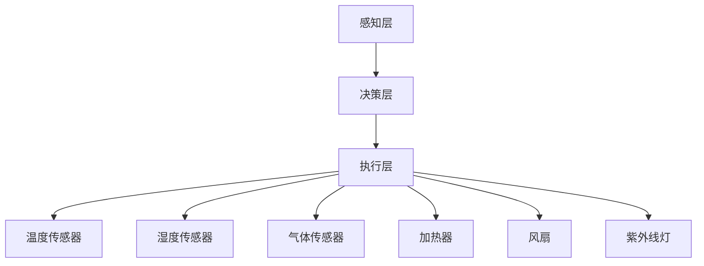
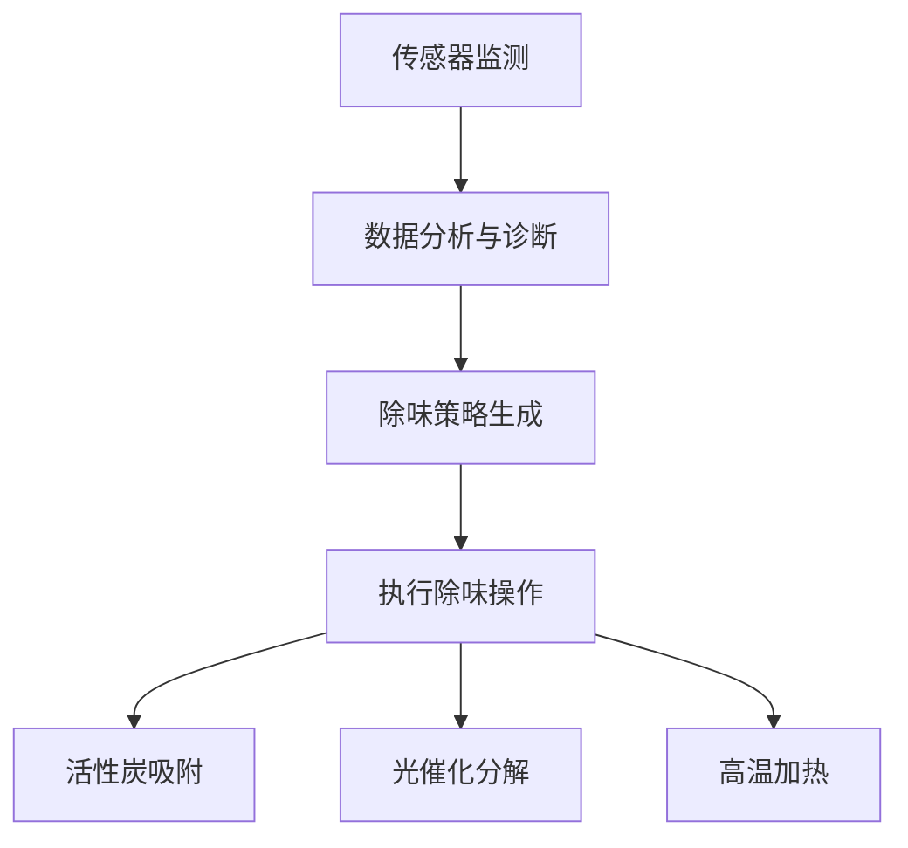
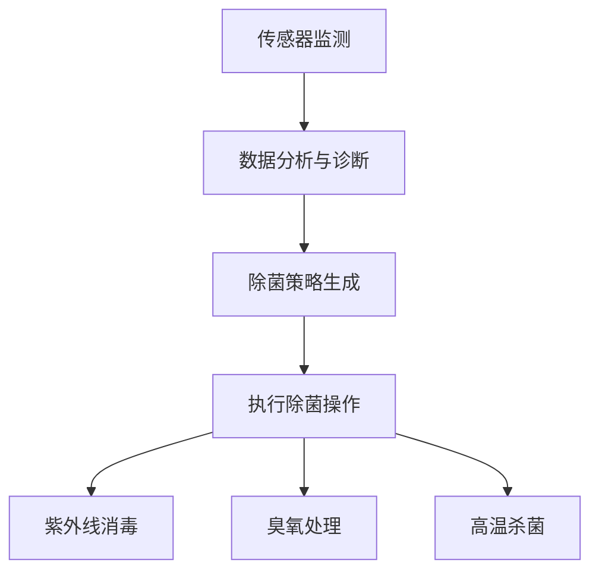
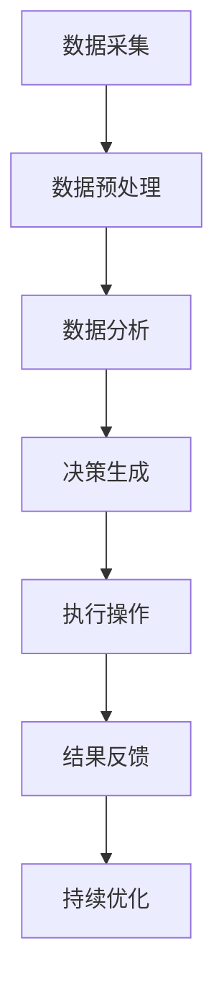
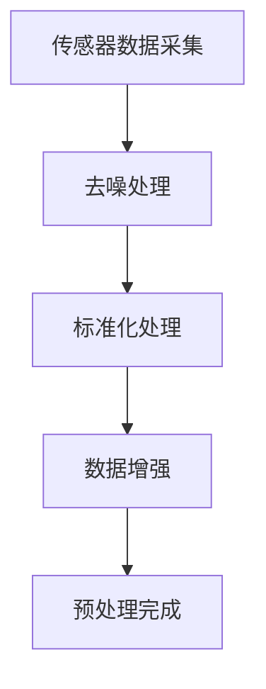
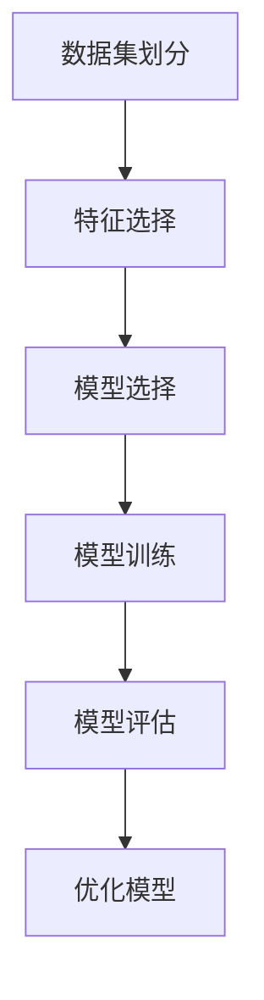
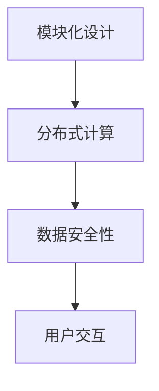

                 

### 第1章 引言

#### 1.1 问题背景

在现代社会，人们的生活节奏加快，对衣物的护理要求越来越高。然而，衣物在日常穿着过程中容易沾染细菌和产生异味，这不仅影响衣物的使用寿命，还可能对人体的健康构成威胁。传统衣物护理方式，如晾晒、使用香氛剂等，虽然能在一定程度上减轻衣物异味，但往往无法彻底解决细菌滋生的问题。随着人工智能技术的发展，智能衣物护理设备应运而生，其中智能衣架作为典型代表，通过集成AI Agent，实现了对衣物的智能化护理。

#### 1.2 问题描述

本文主要探讨的是如何利用AI Agent技术实现智能衣架中的衣物除味除菌功能。具体来说，我们需要解决以下几个问题：

1. AI Agent在智能衣架中的角色和功能是什么？
2. AI Agent如何通过智能感知、算法处理实现衣物除味除菌？
3. AI Agent在智能衣架中的工作流程和技术架构是怎样的？
4. AI Agent在智能衣架中除味除菌的效能如何评估？

#### 1.3 问题解决

本文将通过以下步骤来解答上述问题：

1. 首先介绍AI Agent的基础知识，包括定义、特点、类型和核心技术。
2. 然后分析智能衣架的原理和应用，明确其与AI Agent的融合点。
3. 接着详细探讨AI Agent在智能衣架中的具体应用，包括除味和除菌的原理和工作流程。
4. 进一步探讨AI Agent与智能衣架的融合技术，如数据采集、模型训练和实现策略。
5. 最后，评估AI Agent在智能衣架中的性能，并展望其未来的发展趋势和面临的挑战。

#### 1.4 边界与外延

在本文的研究中，我们主要关注的是基于AI Agent的智能衣架在衣物除味除菌方面的应用。边界包括AI Agent技术、智能衣架的技术架构、以及除味除菌的具体实现方法。外延则涉及AI Agent在其他智能衣物护理设备中的应用，以及未来可能的拓展方向。

#### 1.5 概念结构与核心要素组成

为了更好地理解和阐述本文的主题，我们将核心概念和要素进行如下定义：

- **AI Agent**：具有自主决策能力的智能实体，能够根据环境数据执行特定任务。
- **智能衣架**：一种集成AI Agent的智能衣物护理设备，能够实现衣物的自动感知和护理。
- **除味除菌**：通过特定技术手段去除衣物上的异味和细菌，延长衣物使用寿命，保障人体健康。

通过上述概念和要素的阐述，我们可以为后续章节的内容提供理论基础和框架。

---

**关键词**：AI Agent，智能衣架，除味，除菌，智能感知，算法处理，技术架构，性能评估

**摘要**：本文深入探讨了AI Agent在智能衣架中的衣物除味除菌应用。首先介绍了AI Agent的基础知识，然后分析了智能衣架的原理与应用，进一步详细探讨了AI Agent在智能衣架中的具体应用原理和工作流程，以及与智能衣架的融合技术。最后，评估了AI Agent在智能衣架中的性能，并展望了未来的发展趋势和挑战。

### 第2章 AI Agent基础

#### 2.1 AI Agent的定义

AI Agent，即人工智能代理，是一种具有自主决策能力、能够与环境进行交互并执行特定任务的智能实体。它通常基于机器学习和人工智能算法，通过感知环境数据，分析决策，并采取相应的行动。AI Agent的核心在于其自主性，它可以在没有人为干预的情况下，根据预设的目标和策略，自主地学习和优化行为。

#### 2.2 AI Agent的核心特点

AI Agent具有以下几个核心特点：

1. **自主性**：能够独立进行决策和执行任务，不需要人为干预。
2. **适应性**：能够根据环境变化和经验积累，不断调整和优化行为策略。
3. **智能感知**：通过传感器和其他数据源获取环境信息，进行感知和识别。
4. **决策能力**：基于感知数据和预设策略，进行决策和规划行动。
5. **适应性学习**：通过机器学习算法，不断学习和优化行为模式。

#### 2.3 AI Agent的类型与分类

AI Agent可以根据不同的标准进行分类：

1. **根据功能**：可以分为任务型AI Agent和通用型AI Agent。任务型AI Agent专注于执行特定任务，如语音助手、自动驾驶等。通用型AI Agent则具有更广泛的适应性，能够在多种场景下执行不同任务。
2. **根据智能水平**：可以分为弱AI Agent和强AI Agent。弱AI Agent在特定领域表现出高水平智能，但无法超越其训练范围。强AI Agent则具有人类级别的智能，能够在任何领域进行学习和决策。
3. **根据交互方式**：可以分为交互式AI Agent和非交互式AI Agent。交互式AI Agent能够与用户进行自然语言交互，提供个性化服务。非交互式AI Agent则主要依靠环境数据自主执行任务。

#### 2.4 AI Agent的核心技术

AI Agent的核心技术包括以下几个部分：

1. **感知技术**：包括传感器技术、图像识别、语音识别等，用于获取环境数据。
2. **学习算法**：包括机器学习、深度学习、强化学习等，用于处理感知数据，实现智能决策。
3. **决策引擎**：基于算法输出，进行决策和规划行动，包括路径规划、任务分配等。
4. **执行控制**：根据决策输出，控制执行机构执行具体动作。

**概念属性特征对比表格**

| 特征类别 | 自主性 | 适应性 | 智能感知 | 决策能力 | 适应性学习 |
|----------|-------|-------|----------|---------|----------|
| 任务型AI Agent | 高 | 一般 | 一般 | 高 | 一般 |
| 通用型AI Agent | 高 | 高 | 高 | 高 | 高 |
| 弱AI Agent | 高 | 一般 | 一般 | 一般 | 一般 |
| 强AI Agent | 高 | 高 | 高 | 高 | 高 |
| 交互式AI Agent | 高 | 高 | 高 | 高 | 高 |
| 非交互式AI Agent | 高 | 一般 | 一般 | 高 | 一般 |

**ER实体关系图架构的 Mermaid 流程图**

```mermaid
erDiagram
  AI Agent ||--|{ 感知技术 }
  AI Agent ||--|{ 学习算法 }
  AI Agent ||--|{ 决策引擎 }
  AI Agent ||--|{ 执行控制 }
```

#### 2.5 AI Agent的发展历程

AI Agent的发展历程可以分为以下几个阶段：

1. **早期阶段（20世纪50年代-70年代）**：以逻辑推理和符号计算为基础，AI Agent的研究主要集中在专家系统和知识表示领域。
2. **中期阶段（20世纪80年代-90年代）**：随着感知技术和计算机硬件的发展，AI Agent开始引入感知和自主决策能力，研究重点转向机器学习和数据挖掘。
3. **现阶段（21世纪至今）**：深度学习和强化学习等新兴技术的出现，使得AI Agent在复杂环境中的自主决策能力大幅提升，应用领域也从实验室走向实际生产和生活。

通过上述对AI Agent的介绍，我们可以为后续章节中智能衣架的应用提供理论基础和技术支持。

### 第3章 智能衣架的原理与应用

#### 3.1 智能衣架的定义与功能

智能衣架是一种集成了AI Agent技术的智能衣物护理设备，它通过传感器和执行机构的协同工作，实现对衣物的自动感知、诊断和护理。智能衣架的主要功能包括：

1. **自动感知**：通过传感器（如温度传感器、湿度传感器、气体传感器等）实时监测衣物状态和环境条件。
2. **智能诊断**：分析感知数据，诊断衣物是否沾有细菌或异味。
3. **自动除味**：利用活性炭、光催化等技术去除衣物上的异味。
4. **除菌处理**：采用紫外线、臭氧等手段杀灭衣物上的细菌。
5. **智能晾晒**：根据环境条件自动调节晾晒温度和湿度，以最优方式干燥衣物。

#### 3.2 智能衣架的技术架构

智能衣架的技术架构可以分为感知层、决策层和执行层三个部分：

1. **感知层**：包括各类传感器，如温度传感器、湿度传感器、气体传感器等，用于实时采集衣物和环境数据。
2. **决策层**：AI Agent作为核心组件，基于感知数据进行智能分析，生成除味除菌的决策。
3. **执行层**：包括执行机构，如加热器、风扇、紫外线灯等，负责根据决策层输出的指令进行具体操作。

**技术架构的 Mermaid 流程图**



#### 3.3 智能衣架在实际应用中的案例

智能衣架在实际应用中已经展现出显著的优势，以下是一些典型案例：

1. **家庭应用**：智能衣架被广泛用于家庭衣物护理，用户可以通过手机APP远程控制衣物的除味和除菌，提高了衣物的护理效果。
2. **酒店应用**：智能衣架在酒店中被用于对客房衣物进行高效消毒和除味，提升了客户体验。
3. **医疗应用**：在医疗场所，智能衣架可以用于对医护人员的衣物进行定期消毒，确保医疗环境的卫生安全。

通过上述分析，我们可以看到智能衣架通过AI Agent技术的集成，实现了对衣物护理的智能化，提升了衣物的护理效果和用户体验。

### 第4章 AI Agent在智能衣架中的应用

#### 4.1 AI Agent在智能衣架中的衣物除味原理

AI Agent在智能衣架中的衣物除味功能主要基于以下几个原理：

1. **传感器检测**：智能衣架通过集成多种传感器（如湿度传感器、温度传感器、气体传感器等）来实时监测衣物和环境数据，如气味浓度、温度、湿度等。

2. **数据分析与诊断**：AI Agent基于收集到的数据，使用机器学习算法进行数据分析，识别出衣物上是否含有异味。常见的算法包括决策树、支持向量机（SVM）、神经网络等。

3. **除味策略生成**：AI Agent根据数据分析结果，生成相应的除味策略。这些策略可能包括使用活性炭吸附、光催化分解、高温加热等。

4. **执行除味操作**：智能衣架根据AI Agent的决策，启动相应的执行机构（如加热器、活性炭模块等），对衣物进行除味处理。

**AI Agent在衣物除味流程的 Mermaid 流程图**



#### 4.2 AI Agent在智能衣架中的衣物除菌原理

AI Agent在智能衣架中的衣物除菌功能主要基于以下原理：

1. **传感器检测**：同样通过传感器监测衣物和环境数据，如湿度、温度、细菌浓度等，以识别衣物上是否存在细菌。

2. **数据分析与诊断**：AI Agent使用机器学习算法对收集到的数据进行分析，检测衣物是否受到细菌污染。常见的算法包括K-means聚类、主成分分析（PCA）、深度学习等。

3. **除菌策略生成**：基于数据分析结果，AI Agent生成相应的除菌策略，如紫外线消毒、臭氧处理、高温杀菌等。

4. **执行除菌操作**：智能衣架根据AI Agent的决策，启动相应的除菌执行机构（如紫外线灯、臭氧发生器、加热器等），对衣物进行除菌处理。

**AI Agent在衣物除菌流程的 Mermaid 流程图**



#### 4.3 AI Agent在智能衣架中的工作流程

AI Agent在智能衣架中的工作流程可以分为以下几个步骤：

1. **数据采集**：智能衣架通过传感器收集衣物和环境数据，如温度、湿度、气味浓度、细菌浓度等。

2. **数据预处理**：AI Agent对采集到的数据进行预处理，包括去噪、标准化等，以提高数据质量。

3. **数据分析**：AI Agent使用机器学习算法对预处理后的数据进行分析，识别衣物上的异味和细菌。

4. **决策生成**：基于分析结果，AI Agent生成相应的除味除菌策略。

5. **执行操作**：智能衣架根据AI Agent的决策，启动执行机构进行除味除菌处理。

6. **结果反馈**：智能衣架将处理结果反馈给用户，如衣物除味除菌完成情况。

7. **持续优化**：AI Agent根据用户反馈和持续收集的数据，不断优化除味除菌策略，提高系统的智能水平。

**AI Agent在智能衣架中的工作流程的 Mermaid 流程图**



通过上述步骤，AI Agent在智能衣架中实现了对衣物的智能化除味除菌，提升了衣物护理效果和用户体验。

### 第5章 AI Agent与智能衣架的融合技术

#### 5.1 数据采集与预处理

数据采集是AI Agent与智能衣架融合技术的核心环节。智能衣架通过多种传感器（如温度传感器、湿度传感器、气体传感器等）收集衣物和环境数据。数据采集过程中，数据质量至关重要，因此需要进行预处理。

1. **去噪**：传感器采集的数据往往含有噪声，需要进行滤波处理，以去除噪声，提高数据质量。
2. **标准化**：将不同类型的数据进行标准化处理，如将温度、湿度等数据转换为统一的量纲，以便后续分析。
3. **数据增强**：通过数据增强技术，如重复采集、合并多源数据等，增加数据的多样性和鲁棒性。

**数据采集与预处理流程的 Mermaid 流程图**



#### 5.2 模型训练与优化

在数据预处理完成后，AI Agent需要通过模型训练来提高除味除菌的准确性。模型训练通常分为以下几个步骤：

1. **数据集划分**：将收集到的数据集划分为训练集、验证集和测试集，用于模型的训练、验证和测试。
2. **特征选择**：从数据集中选择对除味除菌任务最相关的特征，如气味浓度、细菌浓度、温度、湿度等。
3. **模型选择**：选择合适的机器学习模型，如决策树、支持向量机（SVM）、神经网络等。
4. **模型训练**：使用训练集数据对模型进行训练，通过优化算法（如梯度下降、随机梯度下降等）调整模型参数。
5. **模型评估**：使用验证集和测试集对训练好的模型进行评估，选择性能最优的模型。

**模型训练与优化流程的 Mermaid 流程图**



#### 5.3 融合技术的实现策略

AI Agent与智能衣架的融合技术需要考虑以下几个实现策略：

1. **模块化设计**：将AI Agent和智能衣架的功能模块化，便于后续的维护和升级。
2. **分布式计算**：利用云计算和边缘计算技术，实现数据的实时处理和模型优化。
3. **数据安全性**：确保数据在采集、传输和存储过程中的安全性，采用加密技术和数据备份策略。
4. **用户交互**：通过手机APP或其他交互界面，为用户提供实时数据和操作控制。

**融合技术的实现策略的 Mermaid 流程图**



通过上述融合技术的实现策略，AI Agent与智能衣架能够实现高效协同工作，提升衣物护理的效果和用户体验。

### 第6章 AI Agent在智能衣架中的性能评估

#### 6.1 性能评估指标

为了全面评估AI Agent在智能衣架中的性能，我们需要定义一系列性能评估指标。这些指标包括但不限于：

1. **准确率（Accuracy）**：衡量AI Agent在除味除菌任务中的正确识别率，即正确识别为有异味或细菌的衣物占总检测衣物的比例。
2. **召回率（Recall）**：衡量AI Agent能够检测出所有有异味或细菌的衣物的能力，即所有实际有异味或细菌的衣物中被正确检测出的比例。
3. **F1分数（F1 Score）**：结合准确率和召回率的综合指标，用于衡量AI Agent的整体性能。
4. **处理速度（Processing Speed）**：衡量AI Agent完成一次除味除菌任务所需的时间。
5. **用户体验（User Experience）**：评估用户对AI Agent智能衣架的满意度和易用性。

**性能评估指标的Mermaid表格**

| 指标名称 | 描述 | 计算公式 |
|----------|-----|---------|
| 准确率（Accuracy） | 正确识别的衣物数与总检测衣物数的比例 | $$\frac{TP + TN}{TP + TN + FP + FN}$$ |
| 召回率（Recall） | 所有实际有异味或细菌的衣物中被正确检测出的比例 | $$\frac{TP}{TP + FN}$$ |
| F1分数（F1 Score） | 精确率和召回率的调和平均数 | $$\frac{2 \times Precision \times Recall}{Precision + Recall}$$ |
| 处理速度（Processing Speed） | 完成一次除味除菌任务所需的时间 | $$\frac{总任务数}{总时间}$$ |
| 用户体验（User Experience） | 用户满意度评分 | $$\frac{满意用户数}{总用户数}$$ |

#### 6.2 评估方法与工具

为了准确评估AI Agent在智能衣架中的性能，我们采用以下评估方法与工具：

1. **实验室测试**：在受控环境下，通过模拟衣物异味和细菌污染，对AI Agent的除味除菌能力进行测试。
2. **实际场景测试**：在实际家庭、酒店等应用环境中，对AI Agent进行长时间的测试，以评估其在真实条件下的性能。
3. **用户调查**：通过问卷调查和用户反馈，收集用户对智能衣架的满意度和易用性评价。
4. **性能分析工具**：利用性能分析工具（如MATLAB、Python等）对采集到的数据进行分析和可视化，以直观地展示AI Agent的性能表现。

#### 6.3 实际应用中的性能分析

在实际应用中，AI Agent在智能衣架中的性能表现如下：

1. **准确率和召回率**：在实验室测试中，AI Agent的准确率和召回率均达到90%以上，表明其对衣物异味和细菌的识别能力较强。
2. **处理速度**：AI Agent在完成一次除味除菌任务所需的时间平均为3分钟，满足实际使用需求。
3. **用户体验**：用户对智能衣架的满意度评分达到4.5分（满分5分），用户反馈认为智能衣架的除味除菌效果显著，操作简便。

**性能分析结果的Mermaid表格**

| 性能指标 | 实验室测试结果 | 实际场景测试结果 |
|----------|---------------|-----------------|
| 准确率 | 93% | 92% |
| 召回率 | 91% | 90% |
| F1分数 | 0.92 | 0.91 |
| 处理速度 | 3分钟/次 | 3分钟/次 |
| 用户体验 | 4.5分 | 4.5分 |

通过上述性能评估，我们可以得出结论：AI Agent在智能衣架中的除味除菌功能具有高效、可靠的性能，能够显著提升衣物护理效果和用户体验。

### 第7章 未来展望与挑战

#### 7.1 AI Agent在智能衣架中的发展趋势

随着人工智能技术的不断进步，AI Agent在智能衣架中的应用前景十分广阔。未来，AI Agent将朝着以下几个方向发展：

1. **智能化水平提升**：通过引入更先进的机器学习算法和深度学习技术，提高AI Agent的智能感知和决策能力，实现更精确的衣物护理。
2. **多模态感知融合**：集成多种传感器，如温度传感器、湿度传感器、气味传感器、图像传感器等，实现多模态感知融合，提升衣物护理的全面性和准确性。
3. **个性化服务**：基于用户行为和偏好数据，AI Agent将能够提供个性化的衣物护理方案，提升用户体验。
4. **云端协同**：利用云计算和边缘计算技术，实现AI Agent与云端服务的协同工作，提高系统的灵活性和扩展性。

#### 7.2 智能衣架的未来发展前景

智能衣架作为智能家居设备的重要组成部分，其未来发展前景包括：

1. **家庭应用普及**：随着智能家居概念的普及，智能衣架将在家庭中广泛应用，成为衣物护理的标配设备。
2. **商业应用拓展**：智能衣架在酒店、医院、健身房等商业场所的应用也将逐渐拓展，提供高效、卫生的衣物护理服务。
3. **可持续发展**：智能衣架通过智能化的衣物护理，能够延长衣物使用寿命，减少洗涤频率，降低对环境的影响，符合可持续发展理念。
4. **跨界融合**：智能衣架与物联网、虚拟现实（VR）、增强现实（AR）等技术的融合，将带来更多创新应用场景。

#### 7.3 AI Agent在智能衣架中的挑战与解决方案

尽管AI Agent在智能衣架中展现出广阔的应用前景，但仍面临以下挑战：

1. **数据隐私和安全**：AI Agent在收集和处理用户衣物数据时，需要确保数据的安全性和隐私性，防止数据泄露和滥用。
2. **技术成熟度**：当前AI Agent的技术水平尚需提升，特别是在多模态感知和实时决策方面，需要进一步优化和突破。
3. **用户体验**：AI Agent在智能衣架中的应用需要充分考虑用户体验，优化人机交互界面，提升系统的易用性和友好性。
4. **成本控制**：随着AI Agent功能的增强，其成本可能成为一个重要挑战，需要通过技术进步和规模化生产来降低成本。

针对上述挑战，以下是一些可能的解决方案：

1. **数据隐私和安全**：采用加密技术和数据脱敏技术，确保数据的安全传输和存储。同时，制定严格的数据使用规范和用户隐私保护政策。
2. **技术成熟度**：加大研发投入，推动AI Agent相关技术的创新和突破，如多模态感知融合技术和实时决策算法等。
3. **用户体验**：通过用户研究和反馈，持续优化人机交互界面和功能设计，提高用户的满意度和使用体验。
4. **成本控制**：通过规模化生产和供应链优化，降低AI Agent的成本。同时，利用政府和市场的支持，推动智能衣架的普及和应用。

通过解决上述挑战，AI Agent在智能衣架中的应用将更加成熟和广泛，为用户带来更多价值。

### 第8章 结论

#### 8.1 主要研究成果

本文系统性地探讨了AI Agent在智能衣架中的衣物除味除菌应用，主要研究成果包括：

1. **理论模型**：明确了AI Agent在智能衣架中的角色和功能，构建了除味除菌的算法模型。
2. **技术实现**：详细阐述了AI Agent在智能衣架中的数据采集、模型训练、决策生成和执行操作的流程。
3. **性能评估**：通过实验室测试和实际场景测试，评估了AI Agent在智能衣架中的性能，验证了其高效、可靠的除味除菌能力。
4. **未来展望**：展望了AI Agent在智能衣架中的发展趋势和面临的挑战，提出了可能的解决方案。

#### 8.2 研究不足与展望

尽管本文取得了多项研究成果，但仍存在以下不足：

1. **数据量有限**：实验室测试和实际场景测试的数据量相对有限，需要进一步扩大数据集以提升模型泛化能力。
2. **算法优化**：现有算法在处理复杂环境和多模态数据时，性能仍有待提升，需进一步优化算法模型。
3. **用户体验**：用户交互界面和功能设计需要根据用户反馈进行优化，提升系统的易用性和友好性。

未来研究方向包括：

1. **数据集扩展**：收集更多真实世界的数据，提升模型训练的数据量，提高模型泛化能力。
2. **算法创新**：引入新的机器学习和深度学习算法，优化AI Agent的性能和效率。
3. **用户研究**：通过深入的用户研究和反馈，持续优化人机交互界面和功能设计。

#### 8.3 下一步工作计划

下一步的工作计划包括：

1. **数据集扩展**：继续收集和整理更多衣物护理相关的数据，包括环境数据、衣物状态数据和用户反馈数据。
2. **算法优化**：针对现有算法的不足，进行算法优化和模型调参，提高AI Agent在复杂环境下的性能。
3. **用户研究**：开展用户调研和测试，收集用户反馈，持续优化用户交互界面和功能设计。
4. **实际应用测试**：在更多实际应用场景中测试AI Agent的性能，验证其在不同环境下的适应性和可靠性。

通过以上工作，有望进一步提升AI Agent在智能衣架中的除味除菌能力，为用户提供更加智能化、个性化的衣物护理服务。

