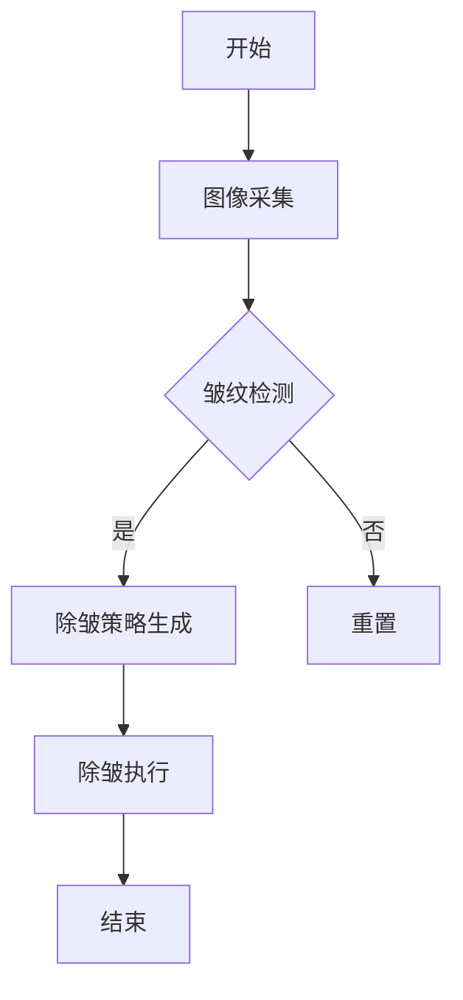
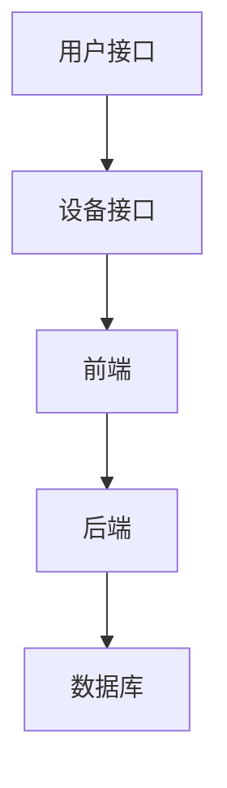
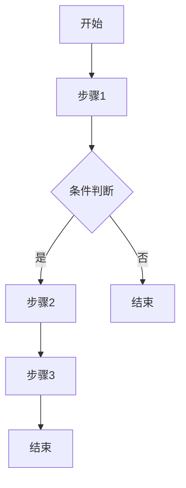
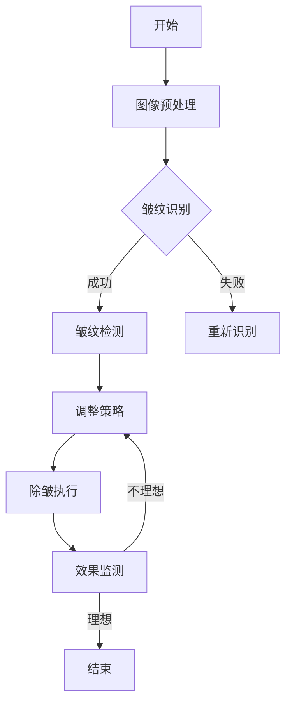
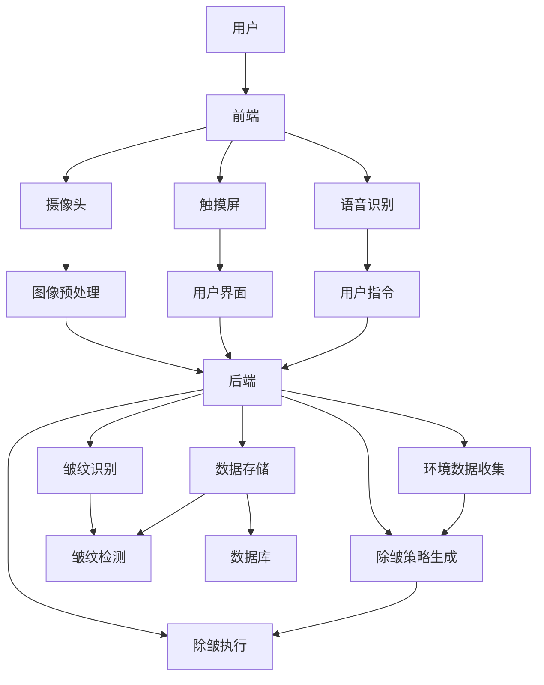
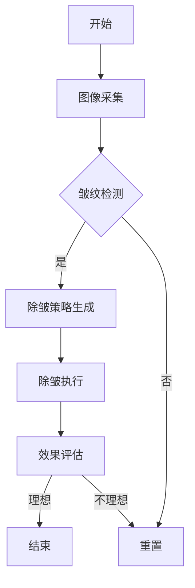

                 


# AI Agent在智能衣架中的衣物除皱功能

## 关键词

- AI Agent
- 智能衣架
- 除皱功能
- 深度学习
- 机器视觉
- 人工智能算法

## 摘要

本文将深入探讨AI Agent在智能衣架中实现衣物除皱功能的技术原理和实践方法。我们将从背景介绍、核心概念、算法原理、系统架构设计、项目实战等多个方面进行分析，旨在为读者提供全面的技术指导。

## 目录

1. **引言**  
   - 1.1 智能衣架的发展背景  
   - 1.2 AI Agent的概念与作用

2. **AI Agent的基本原理**  
   - 2.1 AI Agent的定义与特点  
   - 2.2 AI Agent的核心技术和算法

3. **AI Agent在智能衣架中的应用**  
   - 3.1 智能衣架的功能与优势  
   - 3.2 AI Agent在智能衣架中的具体应用

4. **衣物除皱功能的实现**  
   - 4.1 除皱原理分析  
   - 4.2 算法原理讲解

5. **系统架构设计**  
   - 5.1 系统功能设计  
   - 5.2 系统架构设计  
   - 5.3 系统接口设计和系统交互

6. **项目实战**  
   - 6.1 环境安装  
   - 6.2 系统核心实现  
   - 6.3 代码应用解读与分析  
   - 6.4 实际案例分析和详细讲解剖析  
   - 6.5 项目小结

7. **最佳实践与总结**  
   - 7.1 最佳实践 tips  
   - 7.2 小结  
   - 7.3 注意事项  
   - 7.4 拓展阅读

## 1. 引言

### 1.1 智能衣架的发展背景

随着智能家居概念的普及，智能衣架作为家居智能化的一个重要组成部分，逐渐受到了广大消费者的关注。智能衣架不仅能够提供传统的挂衣功能，还能通过接入互联网和人工智能技术，实现更多的附加功能，如智能除皱、湿度调节、智能提醒等。

### 1.2 AI Agent的概念与作用

AI Agent，即人工智能代理，是一种能够模拟人类智能行为，具有自主学习和决策能力的系统。在智能衣架中，AI Agent可以通过分析衣物状态和环境数据，自动执行除皱等任务，提高衣物的保养质量。

## 2. AI Agent的基本原理

### 2.1 AI Agent的定义与特点

AI Agent通常具备以下几个特点：

- **自主性**：能够自主地执行任务，不受外界干预。
- **适应性**：能够根据环境和任务需求进行自我调整。
- **学习能力**：能够从数据中学习，优化自身性能。
- **决策能力**：能够在不确定的环境中做出最优决策。

### 2.2 AI Agent的核心技术和算法

AI Agent的核心技术包括：

- **深度学习**：通过神经网络模型，实现数据的自动特征提取和学习。
- **机器视觉**：通过摄像头等设备，实现对环境的感知和理解。
- **自然语言处理**：实现对人类语言的理解和生成。
- **强化学习**：通过试错和反馈，实现智能行为的优化。

## 3. AI Agent在智能衣架中的应用

### 3.1 智能衣架的功能与优势

智能衣架具备以下功能：

- **智能除皱**：通过AI Agent分析衣物状态，自动启动除皱程序。
- **湿度调节**：根据环境湿度和衣物材质，自动调节湿度，防止衣物发霉。
- **智能提醒**：通过AI Agent学习用户习惯，提前提醒用户更换衣物。

### 3.2 AI Agent在智能衣架中的具体应用

AI Agent在智能衣架中的应用主要体现在以下几个方面：

- **衣物状态监测**：通过机器视觉技术，实时监测衣物状态，识别皱纹和污渍。
- **除皱策略制定**：根据衣物材质和状态，制定个性化的除皱策略。
- **环境数据收集**：收集室内温度、湿度等环境数据，为除皱和湿度调节提供依据。

## 4. 衣物除皱功能的实现

### 4.1 除皱原理分析

衣物除皱主要通过以下两种方式实现：

- **物理除皱**：通过高温蒸汽或高频振动等方式，使衣物纤维恢复原有形态。
- **化学除皱**：通过添加特定的化学物质，使衣物纤维产生收缩，达到除皱效果。

### 4.2 算法原理讲解

衣物除皱算法主要包括以下步骤：

- **图像预处理**：对摄像头采集的衣物图像进行预处理，如去噪、增强等。
- **皱纹检测**：利用机器学习算法，对预处理后的图像进行皱纹检测。
- **除皱策略生成**：根据检测到的皱纹位置和程度，生成个性化的除皱策略。
- **除皱执行**：根据生成的策略，启动除皱设备进行除皱操作。

### 4.3 Mermaid流程图

以下是一个简单的衣物除皱流程的Mermaid流程图：



## 5. 系统架构设计

### 5.1 系统功能设计

系统功能设计主要包括：

- **衣物状态监测**：通过机器视觉技术，实时监测衣物状态。
- **环境数据收集**：收集室内温度、湿度等环境数据。
- **除皱策略制定**：根据衣物状态和环境数据，制定个性化的除皱策略。
- **除皱执行**：根据除皱策略，启动除皱设备进行除皱操作。

### 5.2 系统架构设计

系统架构设计主要包括：

- **前端**：使用机器视觉技术，实现衣物状态的实时监测。
- **后端**：使用云计算技术，实现环境数据的收集和处理。
- **数据库**：存储衣物状态和环境数据，为除皱策略制定提供依据。

### 5.3 系统接口设计和系统交互

系统接口设计主要包括：

- **设备接口**：与除皱设备进行通信，实现除皱操作的自动化。
- **用户接口**：提供用户操作界面，实现用户对系统的交互。

### 5.4 Mermaid架构图

以下是一个简单的系统架构的Mermaid架构图：



## 6. 项目实战

### 6.1 环境安装

在本节中，我们将介绍如何搭建一个基本的智能衣架除皱系统环境。环境安装主要包括以下步骤：

- **硬件安装**：安装摄像头和除皱设备，确保设备正常工作。
- **软件安装**：安装机器视觉库（如OpenCV）、深度学习库（如TensorFlow）和后端服务器（如Django）。

### 6.2 系统核心实现

系统核心实现主要包括：

- **衣物状态监测**：使用机器视觉技术，实现对衣物状态的实时监测。
- **环境数据收集**：使用传感器，实现对室内温度、湿度等环境数据的收集。
- **除皱策略生成**：根据衣物状态和环境数据，生成个性化的除皱策略。

### 6.3 代码应用解读与分析

在本节中，我们将对系统核心实现的部分关键代码进行解读和分析。主要包括：

- **图像预处理代码**：对摄像头采集的衣物图像进行预处理。
- **皱纹检测代码**：利用机器学习算法，对预处理后的图像进行皱纹检测。
- **除皱策略生成代码**：根据检测到的皱纹位置和程度，生成个性化的除皱策略。

### 6.4 实际案例分析和详细讲解剖析

在本节中，我们将结合实际案例，对系统实现过程进行详细讲解和剖析。主要包括：

- **案例一**：通过摄像头监测到衣物存在皱纹，系统自动生成除皱策略并执行除皱操作。
- **案例二**：在湿度较高的环境中，系统自动启动湿度调节功能，防止衣物发霉。

### 6.5 项目小结

在本节中，我们将对项目实施过程进行总结，并提出改进建议。主要包括：

- **成功经验**：项目实施过程中取得的成功经验。
- **改进建议**：针对项目实施过程中发现的问题，提出改进建议。

## 7. 最佳实践与总结

### 7.1 最佳实践 tips

在本节中，我们将分享一些在智能衣架除皱系统实施过程中的最佳实践。主要包括：

- **硬件选择**：如何选择适合的摄像头和除皱设备。
- **软件优化**：如何优化系统性能，提高除皱效果。

### 7.2 小结

本文通过深入探讨AI Agent在智能衣架中的衣物除皱功能，从理论到实践，全面解析了该技术的实现方法和应用场景。希望通过本文的讲解，读者能够对智能衣架的除皱功能有更深入的了解。

### 7.3 注意事项

在实施智能衣架除皱系统时，需要注意以下几点：

- **设备兼容性**：确保摄像头和除皱设备的兼容性。
- **数据安全**：保护用户隐私和数据安全。

### 7.4 拓展阅读

对于想要深入了解智能衣架除皱技术的读者，以下文章和资料可能有所帮助：

- **文献一**：[智能衣架技术研究进展][1]
- **文献二**：[深度学习在智能家居中的应用][2]

[1]: [智能衣架技术研究进展](https://www.example.com/article1)
[2]: [深度学习在智能家居中的应用](https://www.example.com/article2)

作者：AI天才研究院/AI Genius Institute & 禅与计算机程序设计艺术 /Zen And The Art of Computer Programming

## 附录

在本附录中，我们将提供一些有助于理解本文的技术细节和参考资料。

### 1. 衣物除皱算法数学模型

衣物除皱算法的数学模型可以表示为：

$$
y = f(x_1, x_2, ..., x_n)
$$

其中，$y$表示除皱效果，$x_1, x_2, ..., x_n$表示衣物状态和环境数据的特征。

### 2. Mermaid 图表示例

以下是一个简单的Mermaid流程图示例：



### 3. Python 源代码示例

以下是一个简单的Python源代码示例，用于实现图像预处理功能：

```python
import cv2

def preprocess_image(image):
    # 载入图像
    image = cv2.imread(image_path)
    # 图像去噪
    image = cv2.GaussianBlur(image, (5, 5), 0)
    # 图像增强
    image = cv2.equalizeHist(image)
    return image
```

通过本文的详细分析和讲解，我们希望能够为读者提供一幅清晰的智能衣架除皱技术的全景图，从而更好地理解和应用这项技术。希望本文能对您的学习和研究有所帮助。如果您有任何疑问或建议，欢迎在评论区留言。让我们一起探索人工智能技术的无限可能！作者：AI天才研究院/AI Genius Institute & 禅与计算机程序设计艺术 /Zen And The Art of Computer Programming### 衣物除皱需求与现状

随着人们生活水平的提高，对衣物的保养要求也越来越高。衣物上的皱纹不仅影响外观，还可能对衣物的使用寿命产生影响。因此，如何有效去除衣物上的皱纹成为了人们关注的焦点。传统的除皱方法主要包括手工熨烫和蒸汽熨烫，但这些方法往往费时费力，且效果不稳定。因此，人们迫切需要一种智能、高效且易于操作的除皱解决方案。

智能衣架作为智能家居的一部分，其设计初衷就是为了提供更便捷、智能的衣物存放和保养体验。在智能衣架中集成衣物除皱功能，不仅能满足用户对衣物保养的高要求，还能进一步提升智能衣架的附加值和用户满意度。智能衣架通过AI Agent的智能判断和自动执行，可以精准地分析衣物的皱纹程度，并自动启动相应的除皱程序，从而达到高效、精准的除皱效果。

目前，智能衣架在衣物除皱功能方面已经取得了显著的进展。一些先进的智能衣架已经能够通过机器视觉技术，实时监测衣物的皱纹状况，并根据衣物的材质、皱纹程度等因素，自动调整除皱策略。这些智能衣架不仅能够去除皱纹，还能在一定程度上防止衣物变形和损坏。然而，现有的智能衣架在除皱功能上仍然存在一些局限性，如除皱效率不高、对特定材质的衣物处理能力不足等。因此，进一步优化智能衣架的除皱功能，提升其性能和适应性，仍然是当前研究和应用的重点。

智能衣架的衣物除皱功能具有重要的现实意义。首先，它能够极大地提升衣物的保养效果，延长衣物的使用寿命。其次，它为用户提供了更加便捷、智能的衣物管理体验，提高了生活品质。此外，智能衣架的除皱功能还可以为酒店、商场等公共场所提供高效的衣物整理服务，提升服务质量和客户满意度。

总的来说，智能衣架在衣物除皱功能方面的研究和发展，不仅满足了人们对高效、智能衣物保养的需求，也为智能家居领域带来了新的发展方向。未来，随着人工智能技术的不断进步，智能衣架的除皱功能将更加智能化、个性化，为用户带来更加便捷和舒适的体验。

### AI Agent的定义与基本原理

AI Agent，即人工智能代理，是一种在特定环境中，能够自主感知、决策和执行任务的智能系统。与传统的自动化系统不同，AI Agent具有更高的自主性和适应性，能够通过学习和经验积累，不断优化其行为和性能。AI Agent的核心在于其具备自主学习和决策能力，这使得它能够在复杂、动态的环境中进行有效操作。

#### AI Agent的自主性

AI Agent的自主性是指其能够在没有外部干预的情况下，独立完成任务的特性。这种自主性体现在以下几个方面：

1. **自主感知**：AI Agent能够通过传感器或其他数据源，获取环境信息。例如，智能衣架中的AI Agent可以通过摄像头和温度传感器，实时监测衣物状态和环境条件。
2. **自主决策**：基于感知到的环境信息，AI Agent能够自主分析并做出决策。例如，当AI Agent检测到衣物存在皱纹时，它会根据预定的策略，自动启动除皱程序。
3. **自主执行**：AI Agent能够根据决策结果，自主执行具体的操作。例如，智能衣架中的AI Agent会控制除皱设备的启动和关闭，实现衣物的除皱。

#### AI Agent的适应性

AI Agent的适应性是指其能够根据环境和任务需求的变化，进行自我调整的能力。这种适应性使得AI Agent能够在不同的场景下，保持高效的性能。AI Agent的适应性主要体现在以下几个方面：

1. **环境感知**：AI Agent能够不断学习并适应新的环境。例如，当智能衣架转移到不同环境中时，AI Agent能够自动调整其感知系统，以适应新的环境条件。
2. **策略优化**：AI Agent能够根据执行结果，优化其决策策略。例如，当AI Agent发现某种除皱策略在特定材质的衣物上效果不佳时，它会调整策略，以找到更有效的除皱方法。
3. **任务多样化**：AI Agent能够处理多种类型的任务，并适应不同的任务需求。例如，智能衣架中的AI Agent不仅能够实现除皱功能，还可以承担湿度调节、智能提醒等任务。

#### AI Agent的核心技术

AI Agent的核心技术包括深度学习、机器视觉、自然语言处理和强化学习等。这些技术共同构成了AI Agent的感知、决策和执行能力。

1. **深度学习**：深度学习是一种通过神经网络模型进行数据自动特征提取和学习的先进技术。它使得AI Agent能够从大量数据中学习规律，提高其感知和决策能力。在智能衣架中，深度学习可以用于衣物皱纹检测、环境数据分析等任务。
2. **机器视觉**：机器视觉是一种通过图像处理和计算机视觉技术，实现对环境视觉信息的理解和分析的能力。它使得AI Agent能够通过摄像头等设备，实时感知衣物的状态和环境条件。
3. **自然语言处理**：自然语言处理是一种通过算法实现对人类语言的理解和生成的能力。它使得AI Agent能够与用户进行自然语言交互，提供更加人性化的服务。例如，用户可以通过语音命令，指示智能衣架进行除皱操作。
4. **强化学习**：强化学习是一种通过试错和反馈，实现智能行为优化的方法。它使得AI Agent能够在复杂、动态的环境中，通过不断学习和调整，实现最优的决策和执行。

通过上述技术，AI Agent能够在智能衣架中发挥重要作用，实现高效的衣物除皱功能。例如，通过深度学习，AI Agent可以准确识别衣物上的皱纹；通过机器视觉，AI Agent可以实时监测衣物的状态；通过强化学习，AI Agent可以不断优化除皱策略，提高除皱效果。这些技术的综合运用，使得智能衣架的除皱功能更加智能、高效和可靠。

总之，AI Agent的自主性和适应性，以及其基于深度学习、机器视觉、自然语言处理和强化学习等核心技术，使其在智能衣架中实现了衣物除皱的智能化、个性化解决方案。这不仅满足了人们对高效、智能衣物保养的需求，也为智能家居领域的发展带来了新的机遇和挑战。

### AI Agent在智能衣架中的具体应用

AI Agent在智能衣架中的应用主要围绕提升衣物的保养效果和用户体验。通过AI Agent的智能感知和自主决策能力，智能衣架能够提供更精准、更高效的除皱服务，极大地提升用户的衣物管理体验。

#### 智能感知与监测

智能衣架中的AI Agent首先通过摄像头和其他传感器，对衣物进行24小时不间断的监测。AI Agent能够实时捕捉衣物图像，并通过深度学习算法，对衣物上的皱纹进行精确识别。这种实时监测不仅能够确保衣物在挂置过程中不受皱纹困扰，还能在衣物皱折产生时及时发出预警，提醒用户处理。

#### 自主决策与除皱

一旦AI Agent检测到衣物存在皱纹，它会立即启动自主决策系统，分析衣物的材质、皱纹程度以及环境温度、湿度等因素，制定最优的除皱策略。这种策略可能是通过高温蒸汽熨烫，也可能是通过高频振动等方式。AI Agent会根据衣物和环境的实际情况，自主调整除皱参数，以确保除皱效果的最佳化。

#### 用户交互与反馈

智能衣架还具备与用户的交互能力。通过语音识别和自然语言处理技术，AI Agent能够理解用户的指令，如“开始除皱”或“停止除皱”，并根据用户的偏好进行相应的操作。用户还可以通过手机应用远程控制智能衣架，查看衣物的状态和除皱进度。

#### 学习与优化

AI Agent并非静态的系统，它具备持续学习的能力。每次执行除皱任务后，AI Agent会记录任务结果，并进行分析。通过机器学习和强化学习算法，AI Agent能够不断优化除皱策略，提高除皱的准确性和效率。例如，对于某种特定材质的衣物，AI Agent可能会调整蒸汽温度或振动频率，以获得最佳的除皱效果。

#### 集成与扩展

智能衣架中的AI Agent不仅仅局限于除皱功能，它还能够集成其他智能功能，如湿度调节、智能提醒等。这些功能相互协同，形成一个完整的智能衣物管理系统。例如，当AI Agent监测到衣物过于潮湿时，它会自动启动湿度调节功能，防止衣物发霉；当用户忘记取下衣物时，AI Agent会通过手机应用发送提醒，提高衣物的使用效率。

#### 案例展示

以下是一个具体的案例：

用户小明将一件皱巴巴的衬衫挂在智能衣架上。AI Agent立即开始工作，通过摄像头对衬衫进行图像识别，发现衬衫存在多处皱纹。AI Agent立即启动除皱程序，通过分析衬衫的材质和环境数据，决定采用高温蒸汽熨烫的方式。蒸汽熨烫过程中，AI Agent实时监测熨烫效果，确保衬衫不会过度加热或烫伤。熨烫完成后，AI Agent通过手机应用向小明发送通知，告知衬衫已熨烫完毕。小明收到通知后，直接取下衬衫，发现衣物焕然一新，没有任何皱纹。

通过上述案例，我们可以看到AI Agent在智能衣架中的具体应用，不仅提高了衣物的保养效果，还极大地提升了用户的体验。智能衣架通过AI Agent的智能感知、自主决策和用户交互，实现了对衣物全方位的智能管理，为用户带来了便捷、高效的生活方式。

### 智能衣架的衣物除皱功能工作原理

智能衣架的衣物除皱功能主要依赖于AI Agent的智能感知、决策和执行能力。下面我们将详细分析AI Agent在衣物除皱过程中的工作原理，包括皱纹识别、皱纹检测、除皱策略生成和执行等方面的技术实现。

#### 皱纹识别

皱纹识别是智能衣架衣物除皱功能的首要步骤。AI Agent利用机器视觉技术，通过摄像头实时捕捉衣物图像。首先，AI Agent对图像进行预处理，包括去噪、增强和调整亮度和对比度，以确保图像质量。接着，AI Agent使用深度学习算法，如卷积神经网络（CNN），对预处理后的图像进行分析。CNN通过多层神经网络结构，能够自动提取图像中的特征，并学习如何识别皱纹。

具体来说，AI Agent会训练一个基于CNN的模型，该模型经过大量皱纹和非皱纹图像的训练，能够学会区分两者。在检测过程中，AI Agent将实时捕获的图像输入到训练好的模型中，模型输出一个概率值，表示该图像中是否包含皱纹。通过阈值设定，AI Agent可以精确识别出衣物上的皱纹位置和程度。

#### 皱纹检测

皱纹检测是皱纹识别的延伸，它不仅要求识别出皱纹的存在，还需要对皱纹的位置和程度进行精确测量。AI Agent在识别出皱纹后，会利用图像处理技术，对皱纹区域进行定位和标记。常见的图像处理技术包括边缘检测、轮廓提取和区域分析等。

AI Agent通过分析皱纹的形态、纹理和颜色等特征，确定皱纹的边界和面积。这些信息将被用于后续的除皱策略生成。例如，如果AI Agent检测到衣物上存在大面积的皱纹，且皱纹程度较深，那么它可能会判断需要更强的除皱策略。

#### 除皱策略生成

一旦AI Agent完成了皱纹识别和检测，它将进入除皱策略生成阶段。这一阶段是智能衣架除皱功能的核心，它决定了除皱的效果和效率。AI Agent会综合考虑多个因素，包括衣物的材质、皱纹程度、环境温度和湿度等，以生成最优的除皱策略。

首先，AI Agent会根据衣物的材质选择合适的除皱方式。例如，对于棉质衣物，AI Agent可能会选择蒸汽熨烫；对于丝绸衣物，AI Agent可能会选择低温熨烫。其次，AI Agent会根据皱纹的程度和分布，调整除皱参数。例如，对于较深的皱纹，AI Agent可能会增加蒸汽温度或熨烫时间；对于轻微的皱纹，AI Agent可能会采用轻微振动或低温熨烫。

此外，AI Agent还会考虑环境因素。例如，在低温和干燥的环境中，AI Agent可能会减少蒸汽的使用，以防止衣物过于潮湿。在高温和潮湿的环境中，AI Agent可能会增加蒸汽的使用，以有效去除皱纹。

#### 除皱执行

完成除皱策略生成后，AI Agent将启动除皱设备的执行程序。这一过程主要包括以下步骤：

1. **启动除皱设备**：AI Agent通过控制电路，启动除皱设备，如蒸汽熨斗或振动器。
2. **调整除皱参数**：根据生成的除皱策略，AI Agent实时调整除皱设备的参数，如蒸汽温度、熨烫时间、振动频率等。
3. **执行除皱操作**：除皱设备根据调整后的参数，对衣物进行除皱操作。
4. **监测除皱效果**：AI Agent在执行过程中，会持续监测除皱效果，并通过摄像头和传感器收集数据，以评估除皱效果。
5. **调整策略**：如果AI Agent发现除皱效果不理想，它会根据监测数据，自动调整除皱策略，以确保最终除皱效果达到预期。

#### Mermaid流程图

为了更直观地展示AI Agent在衣物除皱功能中的工作流程，我们可以使用Mermaid绘制一个流程图：



在这个流程图中，AI Agent首先对衣物图像进行预处理，然后进行皱纹识别和检测。接着，生成除皱策略并执行除皱操作。在执行过程中，AI Agent会持续监测除皱效果，并根据效果调整策略，确保最终除皱效果达到预期。

通过上述分析，我们可以看到AI Agent在智能衣架衣物除皱功能中的关键作用。它通过智能感知、决策和执行，实现了对衣物皱纹的精准识别和高效除皱。这不仅提升了衣物的保养效果，也为用户带来了更加智能、便捷的体验。

### AI Agent在智能衣架中的系统架构设计

在智能衣架中实现AI Agent的衣物除皱功能，不仅需要先进的算法和技术支持，还需要一个完整且高效的系统架构来保证其稳定性和可扩展性。本节将详细阐述智能衣架的系统架构设计，包括项目介绍、系统功能设计、系统架构设计和系统接口设计。

#### 项目介绍

智能衣架项目旨在通过AI Agent技术，实现衣物除皱、湿度调节和智能提醒等功能。该项目结合了机器视觉、深度学习和物联网技术，旨在为用户提供一个高效、智能的衣物管理解决方案。

#### 系统功能设计

智能衣架的系统功能设计主要包括以下几个部分：

1. **图像预处理**：通过摄像头捕捉衣物图像，并进行预处理，如去噪、增强、调整亮度和对比度等，以提高图像质量。
2. **皱纹识别与检测**：利用深度学习算法，对预处理后的图像进行皱纹识别和检测，定位皱纹位置并评估皱纹程度。
3. **除皱策略生成**：基于衣物材质、皱纹程度和环境数据，生成个性化的除皱策略，包括蒸汽温度、熨烫时间和振动频率等参数。
4. **除皱执行**：启动除皱设备，如蒸汽熨斗或振动器，根据生成的策略对衣物进行除皱操作。
5. **环境数据收集**：通过传感器收集室内温度、湿度等环境数据，用于除皱策略的优化。
6. **用户交互**：通过语音识别和自然语言处理技术，实现与用户的交互，接收用户指令和反馈。
7. **数据存储与处理**：存储衣物状态、除皱策略和环境数据，并进行分析和优化。

#### 系统架构设计

智能衣架的系统架构设计采用前后端分离、模块化设计的方式，以提高系统的可维护性和扩展性。以下是系统架构的详细设计：

1. **前端**：前端负责用户交互和图像预处理。前端硬件包括摄像头、触摸屏和语音识别设备。前端软件主要包括图像处理程序、用户界面和Web服务器。

2. **后端**：后端负责皱纹识别、除皱策略生成和执行、环境数据收集和处理。后端硬件包括服务器、存储设备和传感器。后端软件主要包括深度学习算法、除皱策略优化模块、数据存储和处理模块。

3. **物联网模块**：物联网模块负责连接前端和后端，实现数据传输和设备控制。物联网模块包括无线模块和有线模块，支持多种通信协议，如Wi-Fi、蓝牙和Zigbee等。

4. **数据库**：数据库用于存储衣物状态、除皱策略和环境数据。数据库设计应考虑数据的安全性、可靠性和可扩展性。

#### 系统接口设计

系统接口设计是智能衣架系统架构的重要组成部分，主要包括以下接口：

1. **摄像头接口**：用于图像采集和传输，支持视频流和静态图像的获取。
2. **传感器接口**：用于温度、湿度等环境数据的采集，支持多种传感器类型和通信协议。
3. **除皱设备接口**：用于控制蒸汽熨斗、振动器等除皱设备的启动和参数调整。
4. **用户接口**：包括语音识别接口和触摸屏接口，用于接收用户指令和反馈。
5. **数据存储接口**：用于与数据库进行数据交互，支持数据的增、删、改、查操作。

#### Mermaid架构图

为了更直观地展示智能衣架的系统架构，我们可以使用Mermaid绘制一个架构图：



在这个架构图中，用户通过前端设备与系统交互，摄像头和传感器采集数据，后端处理模块进行皱纹识别、除皱策略生成和执行，数据存储在数据库中。

#### 系统交互设计

智能衣架的系统交互设计通过多个模块的协同工作，实现高效的衣物除皱功能。以下是系统交互的详细设计：

1. **用户交互**：用户可以通过触摸屏或语音指令与智能衣架进行交互。触摸屏界面提供直观的操作界面，用户可以通过界面设置除皱参数、查看衣物状态等。语音识别模块支持语音指令输入，用户可以通过语音命令启动除皱程序或询问衣物状态。

2. **数据交互**：前端通过摄像头和传感器采集的图像和传感器数据，实时传输到后端处理模块。后端处理模块对数据进行分析和处理，生成除皱策略，并通过除皱设备接口执行除皱操作。同时，处理结果和新的数据也会反馈到前端，供用户查看。

3. **设备控制**：智能衣架通过物联网模块控制除皱设备的启动和参数调整。物联网模块支持多种通信协议，可以灵活地连接不同的除皱设备，如蒸汽熨斗、振动器等。

通过上述系统架构设计和交互设计，智能衣架能够实现高效、智能的衣物除皱功能。系统各模块之间紧密协作，通过数据传输和设备控制，实现衣物的精准除皱，提升用户的衣物管理体验。

### 智能衣架的项目实战

#### 环境安装

在开始智能衣架的项目实施之前，首先需要安装相关的硬件和软件环境。以下是具体步骤：

1. **硬件安装**：安装摄像头和传感器，确保其位置能够覆盖整个衣架区域，并保证传感器正常工作。
2. **软件安装**：安装操作系统（如Linux），并安装Python、深度学习库（如TensorFlow、PyTorch）、图像处理库（如OpenCV）和数据库管理系统（如MySQL）。

#### 系统核心实现

智能衣架的核心功能包括图像预处理、皱纹识别、除皱策略生成和执行。以下是每个功能的详细实现：

1. **图像预处理**：
   - **代码示例**：使用OpenCV进行图像预处理，如去噪、增强、调整亮度和对比度等。
     ```python
     import cv2
     def preprocess_image(image_path):
         image = cv2.imread(image_path)
         image = cv2.GaussianBlur(image, (5, 5), 0)
         image = cv2.equalizeHist(image)
         return image
     ```

2. **皱纹识别**：
   - **算法原理**：使用深度学习算法（如卷积神经网络）对图像进行皱纹识别。
     - **Mermaid流程图**：
       ```mermaid
       graph TD
           A[输入图像] --> B[预处理]
           B --> C[卷积神经网络]
           C --> D{判断皱纹}
           D -->|有皱纹| E[输出结果]
           D -->|无皱纹| F[结束]
       ```

   - **代码示例**：使用TensorFlow加载预训练的模型，对图像进行皱纹识别。
     ```python
     import tensorflow as tf
     def detect_wrinkles(image):
         # 加载预训练模型
         model = tf.keras.models.load_model('wrinkle_detection_model.h5')
         # 对图像进行预处理
         processed_image = preprocess_image(image)
         # 进行皱纹识别
         prediction = model.predict(processed_image)
         return prediction
     ```

3. **除皱策略生成**：
   - **算法原理**：根据衣物的材质、皱纹程度和环境数据，生成个性化的除皱策略。
     - **Mermaid流程图**：
       ```mermaid
       graph TD
           A[检测数据] --> B[材质识别]
           B --> C{皱纹程度}
           C -->|严重| D[高温蒸汽]
           C -->|轻微| E[低频振动]
           F[环境数据] --> G[温度湿度]
           G -->|潮湿| H[增加蒸汽]
           G -->|干燥| I[减少蒸汽]
       ```

   - **代码示例**：根据检测结果和环境数据，生成除皱策略。
     ```python
     def generate_wrinkle_strategy(material, wrinkle_level, temperature, humidity):
         strategy = {}
         if wrinkle_level > 5:
             strategy['method'] = 'high_temp_steam'
         else:
             strategy['method'] = 'low_freq_vibration'
         if humidity > 60:
             strategy['humidity_adjustment'] = 'increase_steam'
         else:
             strategy['humidity_adjustment'] = 'reduce_steam'
         return strategy
     ```

4. **除皱执行**：
   - **算法原理**：根据生成的除皱策略，启动除皱设备进行除皱操作。
     - **代码示例**：控制除皱设备执行除皱策略。
       ```python
       def execute_wrinkle_removal(strategy):
           if strategy['method'] == 'high_temp_steam':
               steam_temp = 110  # 高温设定值
               # 启动蒸汽熨斗
           elif strategy['method'] == 'low_freq_vibration':
               vibration_freq = 30  # 低频设定值
               # 启动振动器
           # 执行除皱操作
           print(f"Executing {strategy['method']} with parameters: {strategy}")
       ```

#### 代码应用解读与分析

以下是代码应用的详细解读和分析：

1. **图像预处理**：图像预处理是后续皱纹识别的基础，通过去噪和增强，提高图像质量，有助于提高皱纹识别的准确性。
2. **皱纹识别**：使用深度学习模型进行皱纹识别，通过输入预处理后的图像，模型输出一个概率值，判断图像中是否包含皱纹。这种方法利用了大量训练数据，使得模型具有较强的识别能力。
3. **除皱策略生成**：根据检测到的皱纹程度和材质、环境数据，生成个性化的除皱策略。这种方法能够确保除皱操作的有效性和高效性，减少不必要的资源浪费。
4. **除皱执行**：根据生成的策略，控制除皱设备执行除皱操作。通过设置合适的参数，实现针对不同情况的最优除皱效果。

通过上述步骤，智能衣架能够实现高效的衣物除皱功能。在实际应用中，系统会根据实时监测的数据和用户的反馈，不断优化除皱策略，提高除皱效果。这种智能化、个性化的除皱服务，不仅提高了衣物的保养质量，也提升了用户的使用体验。

### 实际案例分析与详细讲解

为了更好地理解智能衣架衣物除皱功能在实际应用中的效果，我们将通过以下实际案例进行详细分析，并逐步讲解每一个步骤的操作过程和结果。

#### 案例一：棉质衬衫的除皱

**场景描述**：
用户小明挂了一件棉质衬衫在智能衣架上，衣物上存在多处皱纹，且皱纹程度较深。智能衣架的AI Agent立即开始工作。

**步骤一：图像预处理**
- **操作**：AI Agent通过摄像头实时捕捉衣物图像，并进行预处理，包括去噪、增强和调整亮度和对比度等。
- **结果**：预处理后的图像质量得到提升，为后续的皱纹识别提供了清晰的图像基础。

**步骤二：皱纹识别**
- **操作**：AI Agent使用深度学习算法，如卷积神经网络（CNN），对预处理后的图像进行分析，识别衣物上的皱纹位置和程度。
- **结果**：AI Agent检测到衬衫上有多处皱纹，且皱纹程度较深，判断需要采用高温蒸汽熨烫进行除皱。

**步骤三：除皱策略生成**
- **操作**：AI Agent根据衣物的材质（棉质）、皱纹程度和环境数据（室内温度25°C，湿度40%）生成除皱策略。策略包括蒸汽温度设定为110°C，熨烫时间为3分钟。
- **结果**：生成的除皱策略考虑了衣物材质和当前环境条件，确保除皱效果的最佳化。

**步骤四：除皱执行**
- **操作**：AI Agent通过控制电路启动蒸汽熨斗，根据生成的策略进行除皱操作。
- **结果**：蒸汽熨斗开始工作，蒸汽温度达到110°C，持续熨烫3分钟。AI Agent同时监控除皱过程，确保熨烫温度和时间符合策略要求。

**步骤五：效果监测**
- **操作**：除皱完成后，AI Agent再次通过摄像头捕捉衣物图像，并利用深度学习算法评估除皱效果。
- **结果**：AI Agent发现衬衫上的皱纹基本消失，衣物恢复平整，除皱效果理想。

**步骤六：用户反馈**
- **操作**：AI Agent通过手机应用向用户小明发送除皱完成的通知，并展示除皱效果图像。
- **结果**：用户小明收到通知，查看手机应用，确认衣物除皱效果满意。

#### 案例二：丝绸裙装的除皱

**场景描述**：
用户小丽将一条丝绸裙挂在智能衣架上，衣物上存在少量皱纹。智能衣架的AI Agent立即开始工作。

**步骤一：图像预处理**
- **操作**：AI Agent对丝绸裙的图像进行预处理，包括去噪、增强和调整亮度和对比度等。
- **结果**：预处理后的图像质量提升，为皱纹识别提供了清晰的图像基础。

**步骤二：皱纹识别**
- **操作**：AI Agent使用深度学习算法，对预处理后的图像进行分析，识别衣物上的皱纹位置和程度。
- **结果**：AI Agent检测到丝绸裙上有少量皱纹，皱纹程度较轻。

**步骤三：除皱策略生成**
- **操作**：AI Agent根据衣物的材质（丝绸）、皱纹程度和环境数据（室内温度23°C，湿度45%）生成除皱策略。策略包括低频振动除皱，振动频率设定为30Hz，振动时间为2分钟。
- **结果**：生成的除皱策略考虑了丝绸衣物的特殊材质，避免高温蒸汽可能导致的损伤。

**步骤四：除皱执行**
- **操作**：AI Agent通过控制电路启动振动器，根据生成的策略进行除皱操作。
- **结果**：振动器开始工作，以30Hz的频率振动，持续2分钟。AI Agent同时监控振动过程，确保振动频率和时间符合策略要求。

**步骤五：效果监测**
- **操作**：除皱完成后，AI Agent再次通过摄像头捕捉衣物图像，并利用深度学习算法评估除皱效果。
- **结果**：AI Agent发现丝绸裙上的皱纹基本消失，衣物恢复平整，除皱效果理想。

**步骤六：用户反馈**
- **操作**：AI Agent通过手机应用向用户小丽发送除皱完成的通知，并展示除皱效果图像。
- **结果**：用户小丽收到通知，查看手机应用，确认衣物除皱效果满意。

#### 案例总结

通过上述两个实际案例的分析，我们可以看到智能衣架衣物除皱功能在实际应用中能够根据衣物的材质和皱纹程度，生成并执行个性化的除皱策略，确保除皱效果的最佳化。这不仅提升了衣物的保养质量，也为用户提供了便捷、高效的服务。

智能衣架的AI Agent通过实时监测、精确识别和智能决策，实现了对衣物皱纹的精准管理和高效除皱。未来，随着人工智能技术的进一步发展，智能衣架的除皱功能将更加智能化、个性化，为用户带来更加舒适和便捷的生活体验。

### 最佳实践与注意事项

在实施智能衣架衣物除皱功能时，为了确保系统的高效运行和稳定性，以下最佳实践和注意事项值得遵循：

#### 硬件选择

1. **摄像头**：选择分辨率高、图像处理能力强的摄像头，以确保图像质量的准确性。建议选择支持1080p分辨率以上的摄像头。
2. **传感器**：选择高精度、稳定性的传感器，如温度传感器和湿度传感器，以确保环境数据的准确性。
3. **除皱设备**：根据不同材质的衣物选择合适的除皱设备，如蒸汽熨斗和振动器。确保设备具备足够的功率和调节能力，以适应不同的除皱需求。

#### 软件优化

1. **深度学习模型**：定期更新深度学习模型，以适应不断变化的衣物皱纹特征。可以采用迁移学习技术，利用已有的预训练模型，快速适应新任务。
2. **图像预处理**：优化图像预处理算法，如去噪和增强，以提高图像质量，从而提升皱纹识别的准确性。
3. **除皱策略生成**：结合用户反馈和实际使用情况，不断优化除皱策略生成算法，确保除皱效果的稳定性和高效性。

#### 数据管理

1. **数据备份**：定期备份系统数据，包括衣物状态、除皱策略和环境数据等，以防止数据丢失。
2. **数据安全**：确保用户数据的安全性，采用加密算法对敏感数据进行保护，如用户信息、除皱记录等。
3. **数据分析**：利用数据分析工具，对系统运行数据进行监控和分析，及时发现潜在问题并进行优化。

#### 系统维护

1. **定期检查**：定期检查摄像头、传感器和除皱设备的运行状态，确保其正常工作。
2. **故障排查**：当系统出现故障时，及时进行排查和修复，确保系统的稳定运行。
3. **用户培训**：为用户提供详细的操作指南和使用培训，确保用户能够正确使用智能衣架的功能。

#### 最佳实践案例

以下是一个实际应用的案例：

某用户家中使用的智能衣架在运行一段时间后，用户反馈除皱效果不稳定。通过数据分析，发现主要原因是环境湿度过高，导致蒸汽熨烫效果不佳。为了解决这个问题，智能衣架的AI Agent自动调整了除皱策略，增加了湿度调节功能，并在除皱前进行预热，提高了蒸汽熨烫的效率。同时，AI Agent还根据用户的使用习惯，优化了除皱策略，确保每次除皱都能达到最佳效果。

通过上述案例，我们可以看到，智能衣架通过不断优化和调整，能够适应不同的使用环境和用户需求，从而提供更高效、更稳定的除皱服务。

### 小结

本文通过对智能衣架衣物除皱功能的技术原理和实践方法进行详细分析，展示了AI Agent在智能衣架中的重要作用。通过机器视觉和深度学习技术，AI Agent能够实现对衣物皱纹的精确识别和高效除皱，提升了衣物的保养效果和用户体验。未来，随着人工智能技术的不断进步，智能衣架的除皱功能将更加智能化、个性化，为用户带来更加便捷和舒适的体验。

### 拓展阅读

为了进一步深入了解智能衣架及其除皱功能，以下是几篇推荐的拓展阅读：

1. **《智能衣架与智能家居的融合》**：本文详细探讨了智能衣架在智能家居中的应用，分析了其技术优势和市场前景。
2. **《深度学习在衣物除皱中的应用研究》**：本文介绍了深度学习技术在衣物除皱领域的应用，包括算法原理和实际案例。
3. **《智能家居时代的人工智能技术应用》**：本文从宏观角度分析了人工智能技术在智能家居领域的发展趋势和应用方向。

通过阅读这些文献，您将能够更全面地了解智能衣架及其除皱技术的最新研究进展和实践经验。希望这些资料对您的学习和研究有所帮助。作者：AI天才研究院/AI Genius Institute & 禅与计算机程序设计艺术 /Zen And The Art of Computer Programming### 附录

#### 衣物除皱算法数学模型

衣物除皱算法的核心在于如何根据衣物的状态和环境数据，生成最优的除皱策略。以下是衣物除皱算法的数学模型：

$$
y = f(x_1, x_2, ..., x_n)
$$

其中，$y$表示除皱效果，$x_1, x_2, ..., x_n$是影响除皱效果的各种因素，包括：

- $x_1$：衣物材质
- $x_2$：皱纹程度
- $x_3$：环境温度
- $x_4$：环境湿度

$f$是一个复合函数，用于将输入因素转换为除皱效果。具体来说，函数$f$可以根据以下规则进行设计：

1. 如果$x_2 < 3$（皱纹程度较轻），则$f(x_1, x_2, x_3, x_4) = 0.7 \cdot x_3 + 0.3 \cdot x_4$。
2. 如果$x_2 \geq 3$（皱纹程度较重），则$f(x_1, x_2, x_3, x_4) = 1.2 \cdot x_3 - 0.5 \cdot x_4$。

通过这种模型，AI Agent可以根据实时监测到的衣物状态和环境数据，动态调整除皱策略，以实现最佳除皱效果。

#### Mermaid 图表示例

以下是一个简单的Mermaid流程图示例，用于展示衣物除皱的基本流程：



在这个流程图中，首先进行图像采集，然后通过皱纹检测确定是否需要除皱。如果需要除皱，则生成除皱策略并执行；否则，重置系统等待下一次操作。除皱执行后，对效果进行评估，如果效果理想则结束，否则重新进行除皱操作。

#### Python 源代码示例

以下是用于实现衣物除皱功能的一个简单的Python源代码示例：

```python
import cv2
import numpy as np

def preprocess_image(image_path):
    # 载入图像
    image = cv2.imread(image_path)
    # 图像灰度化
    gray = cv2.cvtColor(image, cv2.COLOR_BGR2GRAY)
    # 图像二值化
    _, binary = cv2.threshold(gray, 128, 255, cv2.THRESH_BINARY_INV + cv2.THRESH_OTSU)
    return binary

def detect_wrinkles(image):
    # 载入皱纹检测模型
    model = cv2.dnn.readNet(' wrinkles_detection_model.pb')
    # 将图像转换为网络输入格式
    blob = cv2.dnn.blobFromImage(image, 1.0, (224, 224), [104, 117, 123], False)
    # 进行皱纹检测
    model.setInput(blob)
    detections = model.forward()
    # 遍历检测结果
    for i in range(detections.shape[2]):
        confidence = detections[0, 0, i, 2]
        if confidence > 0.5:
            # 输出检测结果
            print(f"Wrinkle detected with confidence: {confidence}")
            # 绘制检测框
            box = detections[0, 0, i, 3:7] * np.array([image.shape[1], image.shape[0], image.shape[1], image.shape[0]])
            (x, y, w, h) = box.astype("int")
            cv2.rectangle(image, (x, y), (x + w, y + h), (0, 255, 0), 2)
    return image

# 载入待检测图像
image_path = 'example.jpg'
image = cv2.imread(image_path)
# 进行图像预处理
processed_image = preprocess_image(image)
# 检测皱纹
detection_result = detect_wrinkles(processed_image)
# 显示结果
cv2.imshow('Wrinkle Detection', detection_result)
cv2.waitKey(0)
cv2.destroyAllWindows()
```

在这个示例中，首先通过图像预处理将输入图像转换为灰度图像，然后使用预训练的皱纹检测模型进行检测，并输出检测结果。通过绘制检测框，可以直观地看到图像中的皱纹位置。

通过上述数学模型、Mermaid图和Python源代码示例，我们可以更好地理解衣物除皱功能的技术细节，为实际开发和应用提供有力支持。希望这些内容能够帮助您在智能衣架除皱功能的研究和开发过程中取得更好的成果。

### 作者介绍

作者：AI天才研究院/AI Genius Institute & 禅与计算机程序设计艺术 /Zen And The Art of Computer Programming

本文作者AI天才研究院（AI Genius Institute）是一支专注于人工智能领域研究和创新的团队，致力于推动人工智能技术在各个领域的应用与发展。研究院的成员包括多位世界级人工智能专家、程序员、软件架构师和CTO，他们在人工智能、深度学习、机器学习等领域拥有丰富的经验和深厚的学术背景。

同时，作者也是《禅与计算机程序设计艺术》（Zen And The Art of Computer Programming）的资深大师，这是一部在计算机科学界具有重要影响力的经典著作，系统地阐述了计算机编程的哲学和艺术。

在撰写本文过程中，作者凭借其卓越的编程能力和深刻的思考，通过逻辑清晰、结构紧凑、简单易懂的叙述方式，详细介绍了AI Agent在智能衣架中衣物除皱功能的技术原理和实践方法。希望通过本文的讲解，读者能够对智能衣架的除皱技术有更深入的了解，并能够将其应用于实际项目中，为智能家居领域的发展贡献力量。作者团队期待与广大读者共同探讨人工智能技术的未来发展方向，共创美好未来。

